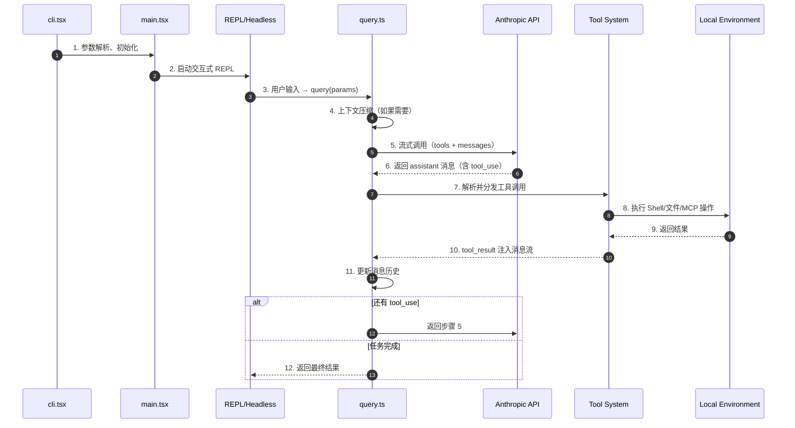
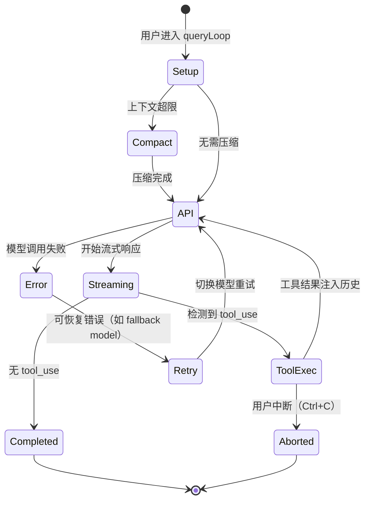

# Claude Code 项目总览

> **阅读指南**
>
> | 属性 | 说明 |
> |-----|------|
> | 预计阅读 | 15-20 分钟 |
> | 前置知识 | TypeScript、React、Ink（TUI）基础 |
> | 文档结构 | TL;DR → 架构 → 核心模块 → 数据流 → 对比 |

---

## TL;DR（结论先行）

**一句话定义：Claude Code 是一款基于 React + Ink 构建的终端原生 AI 编程助手，通过异步生成器（AsyncGenerator）驱动的 Agent Loop 协调 LLM 推理、工具执行与上下文压缩，并提供本地 REPL、远程服务器和 SDK 三种入口模式。**

Claude Code 的核心取舍：**终端优先的 React TUI + 单一 `query()` 生成器驱动所有 LLM 交互**（对比 Codex 的 Rust Actor 模型、Gemini CLI 的递归 Continuation、Kimi CLI 的 Python while 循环）。

### 核心要点速览

| 维度 | 关键决策 | 代码位置 |
|-----|---------|---------|
| Agent Loop | `async function* query()` 单一生成器驱动循环 | `claude-code/src/query.ts:219` ✅ |
| 状态管理 | React Context + 自定义 Store（`AppState`） | `claude-code/src/state/AppState.tsx:37` ✅ |
| UI 渲染 | Ink 终端 React 组件树 | `claude-code/src/components/Spinner.tsx:1` ⚠️ |
| 工具系统 | Zod Schema + `Tool.call()` 统一接口 | `claude-code/src/Tool.ts:362` ✅ |
| MCP 集成 | `@modelcontextprotocol/sdk` 客户端封装 | `claude-code/src/services/mcp/client.ts:1` ✅ |
| 上下文压缩 | AutoCompact + MicroCompact + ContextCollapse 分层 | `claude-code/src/query.ts:454` ✅ |
| 会话记忆 | 后台 forked subagent 自动写入 markdown | `claude-code/src/services/SessionMemory/sessionMemory.ts:1` ✅ |

---

## 1. 为什么需要这个项目？

### 1.1 问题场景

传统 LLM 交互是"一问一答"模式，但对于工程任务（改代码、跑测试、修 bug），模型必须能够：

1. **读取文件** — 了解当前代码库
2. **执行命令** — 运行构建、测试、git 等
3. **根据反馈修正** — 测试失败→修改代码→再跑测试

没有一个统一的终端入口把这些能力串联起来，开发者只能在聊天窗口和终端之间反复切换。

### 1.2 核心挑战

| 挑战 | 不解决的后果 |
|-----|-------------|
| 终端交互复杂 | 纯文本输出难以展示进度、任务列表、权限确认 |
| 长会话 Token 爆炸 | 多轮工具调用后上下文超限，导致请求失败 |
| 工具调用安全 | 直接执行用户机器上的 Shell/文件操作风险极高 |
| 多模态入口 | 需要同时支持交互式 REPL、headless 脚本、远程连接 |

---

## 2. 整体架构

### 2.1 分层架构（ASCII 图）

```text
┌─────────────────────────────────────────────────────────────┐
│ 入口层                                                       │
│ claude-code/src/entrypoints/cli.tsx                         │
│ - CLI 参数解析、fast-path 分发                               │
│ - remote-control / daemon / assistant / ssh 等子命令         │
├─────────────────────────────────────────────────────────────┤
│ 会话层                                                       │
│ claude-code/src/main.tsx                                    │
│ - 初始化配置、权限、MCP、插件                                │
│ - 启动 REPL（交互式）或 Headless 运行                        │
├─────────────────────────────────────────────────────────────┤
│ ▓▓▓ Agent Loop ▓▓▓                                          │
│ claude-code/src/query.ts                                    │
│ - query(): 对外暴露的 AsyncGenerator 入口                    │
│ - queryLoop(): 核心 while(true) 循环                         │
│   - 上下文压缩（snip/microcompact/autocompact/collapse）     │
│   - LLM 流式调用                                             │
│   - 工具执行与结果收集                                       │
│   - 递归进入下一轮                                           │
├─────────────────────────────────────────────────────────────┤
│ 工具与扩展层                                                 │
│ claude-code/src/Tool.ts                                     │
│ claude-code/src/services/mcp/                               │
│ - 内置工具（BashTool、FileEditTool、AgentTool 等）           │
│ - MCP 客户端管理、工具发现、权限控制                         │
│ - 插件系统与 Skill 调用                                      │
├─────────────────────────────────────────────────────────────┤
│ UI 层                                                        │
│ claude-code/src/components/                                 │
│ - Ink 组件（Spinner、MessageResponse、TaskList）             │
│ - 权限确认对话框、进度展示、任务管理                         │
├─────────────────────────────────────────────────────────────┤
│ 持久化与记忆层                                               │
│ claude-code/src/services/SessionMemory/                     │
│ claude-code/src/utils/sessionStorage.ts                     │
│ - 会话历史、Transcript 文件、背景任务持久化                  │
│ - Session Memory 自动摘要与恢复                              │
└─────────────────────────────────────────────────────────────┘
```

### 2.2 核心组件职责

| 组件 | 职责 | 代码位置 |
|-----|------|---------|
| `cli.tsx` | 入口分发，处理特殊子命令和 fast-path | `claude-code/src/entrypoints/cli.tsx:33` ✅ |
| `init.ts` | 全局初始化：配置、遥测、网络代理、TLS、沙箱 | `claude-code/src/entrypoints/init.ts:57` ✅ |
| `main.tsx` | 主程序：REPL 启动、模型选择、MCP/插件加载 | `claude-code/src/main.tsx:585` ✅ |
| `query.ts` | Agent Loop：LLM 调用、工具分发、上下文管理 | `claude-code/src/query.ts:219` ✅ |
| `Tool.ts` | 工具抽象接口定义 | `claude-code/src/Tool.ts:362` ✅ |
| `coordinatorMode.ts` | Coordinator 模式：主 Agent 分配子任务 | `claude-code/src/coordinator/coordinatorMode.ts:36` ✅ |
| `SessionMemory` | 自动维护会话摘要 markdown | `claude-code/src/services/SessionMemory/sessionMemory.ts:1` ✅ |
| `server/` | 远程服务器模式：DirectConnect 会话创建 | `claude-code/src/server/createDirectConnectSession.ts:26` ✅ |

---

## 3. 核心数据流

### 3.1 CLI → Session → Agent Loop → Tools



**关键设计说明**：

| 步骤 | 设计意图 |
|-----|---------|
| 3 | `query()` 返回 `AsyncGenerator`，REPL/Headless/SDK 统一消费同一个接口 |
| 4 | 在进入 API 调用前执行多层压缩：snip、microcompact、autocompact、context collapse |
| 6 | LLM 响应以流式块（text / tool_use / thinking）逐块返回，UI 可实时更新 |
| 7-10 | 工具执行通过 `runTools()` 或 `StreamingToolExecutor` 并发处理 |
| 11 | 消息历史在 `queryLoop` 内通过不可变状态（`state = { ... }`）更新，避免副作用 |

### 3.2 Agent Loop 状态流转



---

## 4. 核心模块详细分析

### 4.1 Agent Loop (`query.ts`)

这是 Claude Code 的心脏。所有 LLM 交互——无论是 REPL、Headless `-p`、SDK、Agent Tool 子调用——最终都会进入 `query()`。

**关键设计**：

- **单一 AsyncGenerator 接口**：调用方通过 `for await (const event of query({...}))` 消费事件流，事件类型包括 `stream_request_start`、`assistant` 消息、`system` 消息、`tombstone` 等。
- **不可变状态传递**：`queryLoop` 内声明 `let state: State = {...}`，每次迭代通过 `state = next` 更新，避免就地修改带来的并发问题。
- **多层上下文压缩机制**：
  - `snipCompact`：删除历史中间的大部分消息，保留首尾
  - `microcompact`：使用缓存编辑技术精细压缩
  - `autocompact`：调用轻量级模型将对话历史总结为摘要
  - `contextCollapse`：按语义将相关消息折叠为摘要节点
- **错误恢复策略**：
  - Prompt Too Long (413)：`reactiveCompact` 紧急摘要 + 重试
  - Max Output Tokens：自动提升 `max_tokens` 上限或注入恢复提示
  - Model Fallback：高负载时自动降级到备用模型并清空中间状态

**代码核心片段**：

```typescript
// claude-code/src/query.ts:219-239
export async function* query(
  params: QueryParams,
): AsyncGenerator<StreamEvent | RequestStartEvent | Message | TombstoneMessage | ToolUseSummaryMessage, Terminal> {
  const consumedCommandUuids: string[] = []
  const terminal = yield* queryLoop(params, consumedCommandUuids)
  for (const uuid of consumedCommandUuids) {
    notifyCommandLifecycle(uuid, 'completed')
  }
  return terminal
}
```

### 4.2 工具系统 (`Tool.ts`)

每个工具都是一个实现了 `Tool` 接口的对象：

```typescript
// claude-code/src/Tool.ts:362-386
export type Tool<Input, Output, P> = {
  name: string
  call(args: z.infer<Input>, context: ToolUseContext, canUseTool: CanUseToolFn, parentMessage: AssistantMessage, onProgress?: ToolCallProgress<P>): Promise<ToolResult<Output>>
  description(input: z.infer<Input>, options: {...}): Promise<string>
  inputSchema: Input
  isEnabled(): boolean
  isReadOnly(input: z.infer<Input>): boolean
  isConcurrencySafe(input: z.infer<Input>): boolean
  maxResultSizeChars: number
  // ...
}
```

**设计亮点**：

- `call()` 是统一执行入口，返回 `ToolResult` 后由 `queryLoop` 格式化为 `tool_result` 消息
- `isReadOnly()` 和 `isDestructive()` 用于权限系统决定是否需要用户确认
- `isConcurrencySafe()` 控制工具是否可以与其他工具并行执行
- MCP 工具也通过同一接口暴露，由 `MCPTool` 包装后注入 `toolUseContext.options.tools`

### 4.3 状态管理（`AppState` + React Context）

Claude Code 的 UI 状态集中存储在 `AppStateStore` 中：

- `AppStateStore.ts`：定义完整的状态结构，包括 `settings`、`tasks`、`mcp`、`toolPermissionContext` 等
- `AppState.tsx`：通过 React Context 提供 `store`，组件使用 `useAppState()` 订阅
- 非 UI 代码（如 `query.ts`）通过 `toolUseContext.getAppState()` / `setAppState()` 读写状态

这种设计让 TUI 组件和底层逻辑共享同一份状态源，避免了双数据源不一致的问题。

### 4.4 背景任务与 Agent 子调用

Claude Code 支持多任务并行：

- **LocalMainSessionTask**：当用户按 `Ctrl+B Ctrl+B` 时，当前 `query()` 被放入后台继续运行，UI 切换到新的空白提示符。完成后通过 `TASK_NOTIFICATION_TAG` 通知用户
- **LocalAgentTask**：通过 `AgentTool` 启动的本地子 Agent，在独立上下文（`agentId`）中运行，通过 `runForkedAgent()` 隔离
- **InProcessTeammateTask**：轻量级的 teammates，在同一个进程内并发执行

相关代码：

- `claude-code/src/tasks/LocalMainSessionTask.ts:94` — 注册主会话后台任务
- `claude-code/src/tasks/LocalAgentTask/LocalAgentTask.tsx` — 子 Agent 任务进度追踪

### 4.5 MCP 集成

MCP（Model Context Protocol）集成集中在 `claude-code/src/services/mcp/`：

- **client.ts**：MCP 客户端生命周期管理（连接、断开、工具/资源发现）
- **config.ts**：MCP 服务器配置解析（支持 `claude_desktop_config.json` 格式）
- **officialRegistry.ts**：官方 MCP 服务器 URL 预取
- **tools/MCPTool/MCPTool.ts**：将 MCP `call_tool` 协议调用包装为 Claude Code 的 `Tool.call()`

MCP 服务器的工具在 `query.ts` 中通过 `appState.mcp.tools` 动态注入 LLM 请求。

### 4.6 Session Memory

`SessionMemory` 是一个背景摘要系统：

- 使用 `runForkedAgent()` fork 一个轻量级子 Agent
- 子 Agent 读取当前会话历史，提取关键信息写入 `session_memory.md`
- 下次启动或恢复会话时，该文件作为附件自动注入上下文

代码位置：`claude-code/src/services/SessionMemory/sessionMemory.ts:1`

---

## 5. 与其他项目的对比

### 5.1 核心差异一览

| 维度 | Claude Code | Codex | Gemini CLI | Kimi CLI |
|-----|-------------|-------|------------|----------|
| **Loop 驱动** | AsyncGenerator (`query()`) | Actor 消息驱动 | 递归 continuation | Python `while` 循环 |
| **UI** | Ink (React TUI) | 自定义 Rust TUI | 自定义 Node TUI | Python Rich |
| **状态管理** | React Store + Context | 内存 Actor | 分层内存 | Checkpoint 文件 |
| **工具接口** | Zod Schema + `Tool.call()` | Rust Trait | TypeScript 函数 | Python 类 |
| **上下文压缩** | 多层（snip + micro + auto + collapse） | 摘要截断 | 摘要截断 | Compaction |
| **安全模型** | 权限模式（default/auto/plan）+ 沙箱适配 | 原生沙箱 | 确认机制 | 确认机制 |
| **MCP 支持** | 完整 SDK 客户端集成 | 内置 + 扩展 | 内置 | 内置 |
| **远程模式** | DirectConnect + SSH + 远程桥接 | 无 | 无 | 无 |

### 5.2 Claude Code 的独特取舍

**选择：终端原生的 React TUI**

- **好处**：利用 React 组件化能力快速构建复杂的交互式 UI（权限确认、任务列表、Spinner、代码差异展示）
- **代价**：相比原生终端库，Ink 的事件处理和重渲染在极端长会话下有一定性能开销

**选择：统一 `query()` AsyncGenerator**

- **好处**：REPL、Headless、SDK、Agent 子调用全部复用同一套 LLM 交互逻辑，行为一致
- **代价**：生成器模式对错误处理和取消信号的管理更复杂，需要仔细维护 `AbortController` 链路

**选择：多层上下文压缩**

- **好处**：在长会话中最大化保留有用上下文，减少 Token 浪费
- **代价**：压缩逻辑高度复杂，多个子系统（snip、microcompact、autocompact、collapse）之间存在交互和优先级问题

---

## 6. 关键代码索引

### 6.1 核心文件

| 功能 | 文件 | 行号 | 说明 |
|-----|------|------|------|
| CLI 入口 | `claude-code/src/entrypoints/cli.tsx` | 33 | `main()` 分发 fast path |
| 初始化 | `claude-code/src/entrypoints/init.ts` | 57 | `init()` 全局初始化 |
| 主程序 | `claude-code/src/main.tsx` | 585 | `main()` 启动 REPL/Headless |
| Agent Loop | `claude-code/src/query.ts` | 219 | `query()` 对外接口 |
| Agent Loop 核心 | `claude-code/src/query.ts` | 241 | `queryLoop()` while(true) |
| 工具定义 | `claude-code/src/Tool.ts` | 362 | `Tool` 类型接口 |
| 工具执行 | `claude-code/src/services/tools/toolOrchestration.ts` | - | `runTools()` |
| MCP 客户端 | `claude-code/src/services/mcp/client.ts` | 1 | 连接管理与工具发现 |
| 会话记忆 | `claude-code/src/services/SessionMemory/sessionMemory.ts` | 1 | 后台摘要生成 |
| 远程连接 | `claude-code/src/server/createDirectConnectSession.ts` | 26 | DirectConnect 会话 |
| 背景任务 | `claude-code/src/tasks/LocalMainSessionTask.ts` | 94 | `registerMainSessionTask()` |
| 状态管理 | `claude-code/src/state/AppStateStore.ts` | 89 | `AppState` 类型定义 |
| Coordinator | `claude-code/src/coordinator/coordinatorMode.ts` | 36 | `isCoordinatorMode()` |

### 6.2 关键调用链

```text
cli.tsx:main()
  -> main.tsx:main()
    -> REPL.tsx / headless runner
      -> query.ts:query(params)
        -> queryLoop()
          -> 上下文压缩（snip / microcompact / autocompact / collapse）
          -> deps.callModel()  // LLM API 调用
          -> StreamingToolExecutor / runTools()  // 工具执行
          -> 更新 state.messages
          -> 递归进入下一轮（continue）
```

---

## 7. 延伸阅读

- 前置知识：[Ink - React for CLIs](https://github.com/vadimdemedes/ink)
- 相关机制：
  - `docs/claude-code/04-claude-code-agent-loop.md` — Agent Loop 深度分析
  - `docs/claude-code/05-claude-code-tools-system.md` — 工具系统设计
  - `docs/claude-code/06-claude-code-mcp-integration.md` — MCP 集成细节
  - `docs/claude-code/07-claude-code-memory-context.md` — 上下文与记忆机制
- 跨项目对比：
  - `docs/comm/01-comm-overview.md` — Code Agent 全局架构
  - `docs/comm/04-comm-agent-loop.md` — Agent Loop 对比

---

*✅ Verified: 基于 `claude-code/src/query.ts:219`、`claude-code/src/Tool.ts:362`、`claude-code/src/main.tsx:585` 等源码分析*
*⚠️ Inferred: 部分 UI 和性能特征基于代码结构推断*
*基于版本：2026-03-31 代码快照 | 最后更新：2026-03-31*
