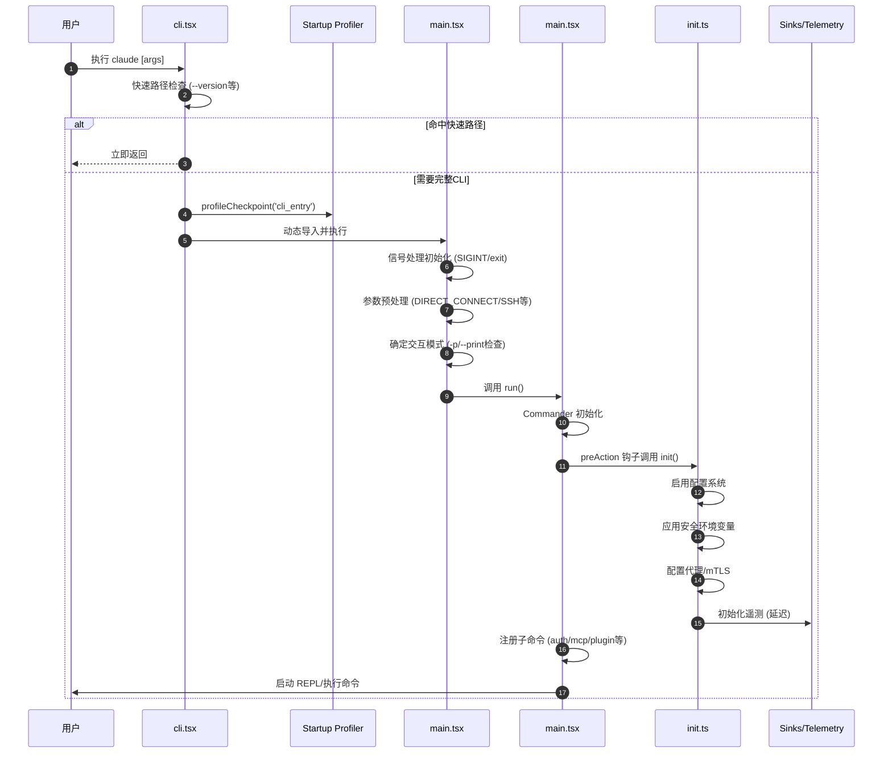
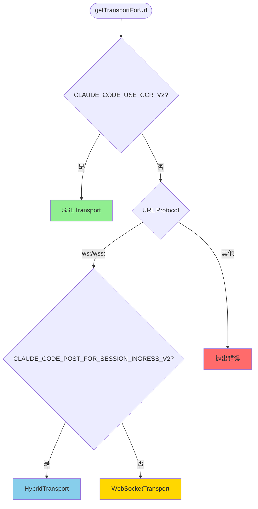
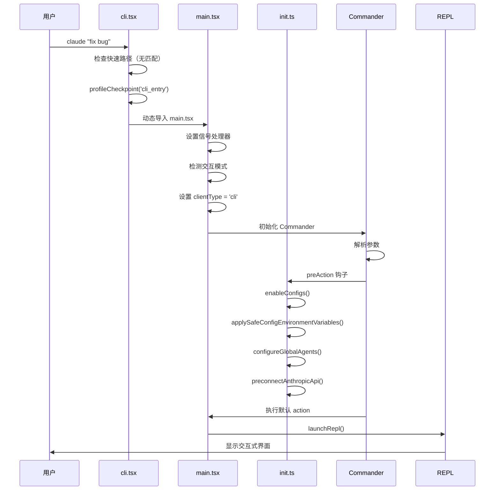
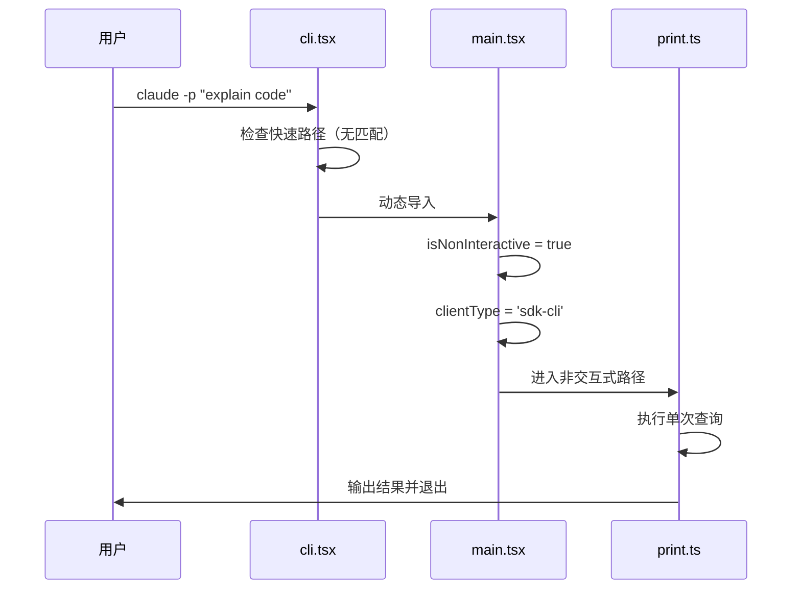
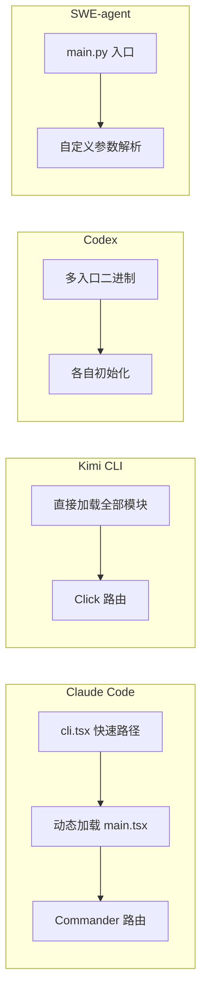

# Claude Code CLI Entry 机制

## TL;DR（结论先行）

Claude Code 的 CLI Entry 采用**分层快速路径 + 延迟加载**架构，通过 `main()` 函数在 `cli.tsx` 中实现零依赖快速响应（如 `--version`），然后通过动态导入按需加载完整 CLI 功能。

Claude Code 的核心取舍：**启动性能优先的渐进式加载**（对比其他项目的全量初始化）

### 核心要点速览

| 维度 | 关键决策 | 代码位置 |
|-----|---------|---------|
| 快速路径 | `--version` 零依赖直接返回 | `src/entrypoints/cli.tsx:37` |
| 入口分层 | 特殊子命令（daemon/bridge/mcp）快速分支 | `src/entrypoints/cli.tsx:72-245` |
| 初始化流程 | `init()` 延迟加载配置、网络、遥测 | `src/entrypoints/init.ts:57` |
| 主 CLI | Commander 驱动的交互式/非交互式双模式 | `src/main.tsx:585` |
| 传输层 | SSE/WebSocket/Hybrid 自适应选择 | `src/cli/transports/transportUtils.ts:16` |

---

## 1. 为什么需要结构化 CLI Entry？

### 1.1 问题场景

没有分层 Entry 的 CLI 工具：
```
用户运行: claude --version
→ 加载所有模块（500ms）
→ 初始化配置（100ms）
→ 连接远程服务（200ms）
→ 最后打印版本号
```

Claude Code 的分层 Entry：
```
用户运行: claude --version
→ 直接读取内联 MACRO.VERSION（<1ms）
→ 立即退出

用户运行: claude "fix bug"
→ 快速路径检查（无匹配）
→ 动态加载 main.tsx（~135ms）
→ 执行完整初始化流程
→ 启动 REPL
```

### 1.2 核心挑战

| 挑战 | 不解决的后果 |
|-----|-------------|
| 启动延迟 | 简单命令（--version/--help）响应缓慢，用户体验差 |
| 模块依赖爆炸 | 全量导入导致内存占用高，低端设备卡顿 |
| 多模式支持 | 同一二进制需支持交互式、非交互式、MCP Server、Daemon 等多种模式 |
| 远程/本地双环境 | CCR（Claude Code Remote）和本地环境需要不同的传输和认证策略 |

---

## 2. 整体架构

### 2.1 在系统中的位置

```text
┌─────────────────────────────────────────────────────────────┐
│ 用户输入层                                                   │
│ process.argv 解析                                            │
└───────────────────────┬─────────────────────────────────────┘
                        │
                        ▼
┌─────────────────────────────────────────────────────────────┐
│ ▓▓▓ CLI Entry (cli.tsx) ▓▓▓                                 │
│ src/entrypoints/cli.tsx                                      │
│ - main(): 快速路径检查（--version, --dump-system-prompt）     │
│ - 特殊模式路由（daemon, bridge, mcp, ps/logs/attach/kill）    │
│ - 延迟加载完整 CLI                                           │
└───────────────────────┬─────────────────────────────────────┘
                        │ 动态 import
                        ▼
┌─────────────────────────────────────────────────────────────┐
│ ▓▓▓ 主 CLI (main.tsx) ▓▓▓                                   │
│ src/main.tsx                                                 │
│ - main(): 信号处理、参数预处理                                │
│ - run(): Commander 配置、命令注册                             │
│ - setup(): 交互式/非交互式模式启动                            │
└───────────────────────┬─────────────────────────────────────┘
                        │
        ┌───────────────┼───────────────┐
        ▼               ▼               ▼
┌──────────────┐ ┌──────────────┐ ┌──────────────┐
│ 初始化层      │ │ 命令层        │ │ 传输层        │
│ init.ts      │ │ auth/        │ │ transports/  │
│ 配置/网络/遥测 │ │ autoMode/    │ │ SSE/WS/Hybrid│
└──────────────┘ └──────────────┘ └──────────────┘
```

### 2.2 核心组件职责

| 组件 | 职责 | 代码位置 |
|-----|------|---------|
| `cli.tsx#main` | 零依赖快速路径、特殊模式路由 | `src/entrypoints/cli.tsx:33` |
| `init.ts#init` | 配置系统、网络代理、遥测初始化 | `src/entrypoints/init.ts:57` |
| `main.tsx#main` | 信号处理、参数预处理、入口点标记 | `src/main.tsx:585` |
| `main.tsx#run` | Commander 配置、命令注册、preAction 钩子 | `src/main.tsx:884` |
| `transportUtils.ts#getTransportForUrl` | 自适应传输层选择 | `src/cli/transports/transportUtils.ts:16` |

### 2.3 启动流程时序



**关键交互说明**：

| 步骤 | 交互内容 | 设计意图 |
|-----|---------|---------|
| 1 | 用户调用 CLI | 通过 Node.js/Bun 运行时启动 |
| 2 | 快速路径检查 | 避免不必要的模块加载，优化冷启动 |
| 4 | 动态导入 main.tsx | 延迟加载重型依赖 (~135ms) |
| 6 | 信号处理初始化 | 确保优雅关闭和光标恢复 |
| 8 | 交互模式检测 | 区分 CLI/SDK/非交互式模式 |
| 11 | preAction 钩子 | 只在实际执行命令时初始化，避免 --help 时的开销 |
| 13 | 延迟遥测初始化 | 信任建立后才初始化第三方遥测 |

---

## 3. 核心组件详细分析

### 3.1 cli.tsx - 入口分流器

#### 职责定位

`cli.tsx` 是 Claude Code 的**零依赖入口点**，负责在加载任何重型模块之前快速处理常见命令。

#### 快速路径决策树

```mermaid
flowchart TD
    Start([用户输入]) --> Args{检查 args[0]}

    Args -->|'-v'/'--version'| Version[直接输出 MACRO.VERSION]
    Version --> Exit1([退出])

    Args -->|'--dump-system-prompt'| Dump[动态加载 prompts.ts]
    Dump --> Exit2([退出])

    Args -->|'--claude-in-chrome-mcp'| ChromeMCP[启动 Chrome MCP]
    ChromeMCP --> Exit3([退出])

    Args -->|'--chrome-native-host'| NativeHost[启动 Native Host]
    NativeHost --> Exit4([退出])

    Args -->|'--computer-use-mcp'| ComputerUse[启动 Computer Use MCP]
    ComputerUse --> Exit5([退出])

    Args -->|'--daemon-worker'| DaemonWorker[启动 Daemon Worker]
    DaemonWorker --> Exit6([退出])

    Args -->|'remote-control'/'rc'/'bridge'| Bridge[启动 Bridge 模式]
    Bridge --> Exit7([退出])

    Args -->|'daemon'| Daemon[启动 Daemon]
    Daemon --> Exit8([退出])

    Args -->|'ps'/'logs'/'attach'/'kill'| BgSessions[后台会话管理]
    BgSessions --> Exit9([退出])

    Args -->|'new'/'list'/'reply'| Templates[模板任务]
    Templates --> Exit10([退出])

    Args -->|'environment-runner'| EnvRunner[环境运行器]
    EnvRunner --> Exit11([退出])

    Args -->|'self-hosted-runner'| SelfHosted[自托管运行器]
    SelfHosted --> Exit12([退出])

    Args -->|'--tmux' + '--worktree'| TmuxWorktree[Tmux Worktree]
    TmuxWorktree --> Exit13([退出])

    Args -->|其他| FullCLI[加载完整 CLI]
    FullCLI --> Main[main.tsx#main()]

    style Version fill:#90EE90
    style Dump fill:#90EE90
    style ChromeMCP fill:#90EE90
    style NativeHost fill:#90EE90
    style ComputerUse fill:#90EE90
    style DaemonWorker fill:#90EE90
    style Bridge fill:#90EE90
    style Daemon fill:#90EE90
    style BgSessions fill:#90EE90
    style Templates fill:#90EE90
    style EnvRunner fill:#90EE90
    style SelfHosted fill:#90EE90
    style TmuxWorktree fill:#90EE90
    style Main fill:#FFD700
```

#### 关键代码

**快速路径 - version 处理**（✅ Verified）：

```typescript
// src/entrypoints/cli.tsx:33-42
async function main(): Promise<void> {
  const args = process.argv.slice(2);

  // Fast-path for --version/-v: zero module loading needed
  if (args.length === 1 && (args[0] === '--version' || args[0] === '-v' || args[0] === '-V')) {
    // MACRO.VERSION is inlined at build time
    console.log(`${MACRO.VERSION} (Claude Code)`);
    return;
  }
  // ...
}
```

**设计意图**：
1. **零依赖**：不导入任何模块，直接读取构建时内联的版本号
2. **极速响应**：避免 100ms+ 的模块加载时间
3. **用户体验**：常见查询（版本号）应该瞬时返回

---

### 3.2 init.ts - 初始化协调器

#### 职责定位

`init()` 是 Claude Code 的**核心初始化函数**，负责配置系统、网络代理、遥测等基础设施的启动。

#### 初始化流程

```mermaid
flowchart TD
    Start([init() 调用]) --> Config[启用配置系统]
    Config --> SafeEnv[应用安全环境变量]
    SafeEnv --> CACerts[应用额外 CA 证书]
    CACerts --> GracefulShutdown[设置优雅关闭]
    GracefulShutdown --> EventLogging[初始化 1P 事件日志]
    EventLogging --> OAuth[填充 OAuth 账户信息]
    EventLogging --> JetBrains[初始化 JetBrains 检测]
    EventLogging --> GitRepo[检测当前仓库]
    OAuth --> RemoteSettings[初始化远程设置加载 Promise]
    JetBrains --> RemoteSettings
    GitRepo --> RemoteSettings
    RemoteSettings --> MTLS[配置全局 mTLS]
    MTLS --> Proxy[配置全局代理]
    Proxy --> Preconnect[预连接 Anthropic API]
    Preconnect --> UpstreamProxy[CCR: 启动上游代理]
    UpstreamProxy --> WindowsShell[Windows: 设置 git-bash]
    WindowsShell --> LspCleanup[注册 LSP 管理器清理]
    LspCleanup --> TeamCleanup[注册 Team 清理]
    TeamCleanup --> Scratchpad[初始化 scratchpad 目录]
    Scratchpad --> End([完成])

    style Config fill:#e1f5e1
    style SafeEnv fill:#e1f5e1
    style CACerts fill:#e1f5e1
    style MTLS fill:#e1f5e1
    style Proxy fill:#e1f5e1
```

#### 关键代码

**初始化函数**（✅ Verified）：

```typescript
// src/entrypoints/init.ts:57-85
export const init = memoize(async (): Promise<void> => {
  const initStartTime = Date.now()
  logForDiagnosticsNoPII('info', 'init_started')
  profileCheckpoint('init_function_start')

  // Validate configs are valid and enable configuration system
  try {
    const configsStart = Date.now()
    enableConfigs()
    logForDiagnosticsNoPII('info', 'init_configs_enabled', {
      duration_ms: Date.now() - configsStart,
    })
    profileCheckpoint('init_configs_enabled')

    // Apply only safe environment variables before trust dialog
    // Full environment variables are applied after trust is established
    const envVarsStart = Date.now()
    applySafeConfigEnvironmentVariables()

    // Apply NODE_EXTRA_CA_CERTS from settings.json to process.env early,
    // before any TLS connections. Bun caches the TLS cert store at boot
    // via BoringSSL, so this must happen before the first TLS handshake.
    applyExtraCACertsFromConfig()
    // ...
  }
})
```

**设计意图**：
1. **memoize 包装**：确保初始化只执行一次，避免重复
2. **性能分析**：每个阶段记录 checkpoint，用于启动性能分析
3. **安全优先**：信任建立前只应用安全环境变量
4. **延迟加载**：OpenTelemetry 等重型模块通过动态导入延迟加载

---

### 3.3 main.tsx - 主 CLI 控制器

#### 职责定位

`main.tsx` 是 Claude Code 的**主控制器**，负责信号处理、参数预处理、Commander 配置和模式启动。

#### 主函数流程

```mermaid
flowchart TD
    Start([main()]) --> Security[设置 Windows PATH 安全]
    Security --> WarningHandler[初始化警告处理器]
    WarningHandler --> Signals[注册信号处理器]
    Signals --> DirectConnect[处理 DIRECT_CONNECT URL]
    DirectConnect --> DeepLink[处理 Deep Link URI]
    DeepLink --> Assistant[处理 Assistant 模式]
    Assistant --> SSH[处理 SSH 远程]
    SSH --> ModeDetect[检测交互模式]
    ModeDetect --> Entrypoint[设置 Entrypoint 标记]
    Entrypoint --> ClientType[确定 Client 类型]
    ClientType --> Settings[急加载设置标志]
    Settings --> Run[调用 run()]
    Run --> Commander[初始化 Commander]
    Commander --> PreAction[注册 preAction 钩子]
    PreAction --> Subcommands[注册子命令]
    Subcommands --> Action[默认 Action]
    Action --> Setup[调用 setup()]
    Setup --> REPL[启动 REPL]

    style Security fill:#e1f5e1
    style Signals fill:#e1f5e1
    style ModeDetect fill:#FFD700
    style ClientType fill:#FFD700
```

#### 关键代码

**交互模式检测**（✅ Verified）：

```typescript
// src/main.tsx:799-813
// Check for -p/--print and --init-only flags early to set isInteractiveSession before init()
// This is needed because telemetry initialization calls auth functions that need this flag
const cliArgs = process.argv.slice(2);
const hasPrintFlag = cliArgs.includes('-p') || cliArgs.includes('--print');
const hasInitOnlyFlag = cliArgs.includes('--init-only');
const hasSdkUrl = cliArgs.some(arg => arg.startsWith('--sdk-url'));
const isNonInteractive = hasPrintFlag || hasInitOnlyFlag || hasSdkUrl || !process.stdout.isTTY;

// Stop capturing early input for non-interactive modes
if (isNonInteractive) {
  stopCapturingEarlyInput();
}

// Set simplified tracking fields
const isInteractive = !isNonInteractive;
setIsInteractive(isInteractive);

// Initialize entrypoint based on mode - needs to be set before any event is logged
initializeEntrypoint(isNonInteractive);
```

**设计意图**：
1. **尽早检测**：在 `init()` 之前确定模式，影响遥测和认证行为
2. **多模式支持**：支持交互式、非交互式（-p）、SDK（--sdk-url）模式
3. **TTY 检测**：自动检测是否运行在终端中

**preAction 钩子**（✅ Verified）：

```typescript
// src/main.tsx:907-967
program.hook('preAction', async thisCommand => {
  profileCheckpoint('preAction_start');
  // Await async subprocess loads started at module evaluation
  await Promise.all([ensureMdmSettingsLoaded(), ensureKeychainPrefetchCompleted()]);
  profileCheckpoint('preAction_after_mdm');
  await init();
  profileCheckpoint('preAction_after_init');

  // process.title on Windows sets the console title directly
  if (!isEnvTruthy(process.env.CLAUDE_CODE_DISABLE_TERMINAL_TITLE)) {
    process.title = 'claude';
  }

  // Attach logging sinks so subcommand handlers can use logEvent/logError
  const { initSinks } = await import('./utils/sinks.js');
  initSinks();
  profileCheckpoint('preAction_after_sinks');

  // ... migrations, remote settings, etc.
});
```

**设计意图**：
1. **延迟初始化**：只在实际执行命令时初始化，避免 `--help` 时的开销
2. **并行加载**：MDM 设置和 Keychain 预取并行执行
3. **迁移执行**：配置就绪后执行数据迁移
4. **远程设置**：企业用户的远程管理设置异步加载

---

### 3.4 传输层 - 自适应传输选择

#### 职责定位

传输层负责 Claude Code 与远程服务（CCR）的通信，支持多种传输协议自适应选择。

#### 传输选择逻辑



#### 关键代码

**传输选择**（✅ Verified）：

```typescript
// src/cli/transports/transportUtils.ts:16-45
export function getTransportForUrl(
  url: URL,
  headers: Record<string, string> = {},
  sessionId?: string,
  refreshHeaders?: () => Record<string, string>,
): Transport {
  if (isEnvTruthy(process.env.CLAUDE_CODE_USE_CCR_V2)) {
    // v2: SSE for reads, HTTP POST for writes
    const sseUrl = new URL(url.href)
    if (sseUrl.protocol === 'wss:') {
      sseUrl.protocol = 'https:'
    } else if (sseUrl.protocol === 'ws:') {
      sseUrl.protocol = 'http:'
    }
    sseUrl.pathname = sseUrl.pathname.replace(/\/$/, '') + '/worker/events/stream'
    return new SSETransport(sseUrl, headers, sessionId, refreshHeaders)
  }

  if (url.protocol === 'ws:' || url.protocol === 'wss:') {
    if (isEnvTruthy(process.env.CLAUDE_CODE_POST_FOR_SESSION_INGRESS_V2)) {
      return new HybridTransport(url, headers, sessionId, refreshHeaders)
    }
    return new WebSocketTransport(url, headers, sessionId, refreshHeaders)
  } else {
    throw new Error(`Unsupported protocol: ${url.protocol}`)
  }
}
```

**设计意图**：
1. **环境自适应**：通过环境变量切换传输协议
2. **v2 优化**：CCR v2 使用 SSE + POST 替代 WebSocket，提高可靠性
3. **协议降级**：支持 WebSocket 到 HTTP 的降级

---

## 4. 端到端数据流转

### 4.1 正常启动流程



### 4.2 非交互式模式流程



---

## 5. 关键代码实现

### 5.1 核心数据结构

**启动性能分析点**（✅ Verified）：

```typescript
// src/utils/startupProfiler.ts
export function profileCheckpoint(name: string): void {
  if (typeof process !== 'undefined' && process.env.CLAUDE_CODE_ENABLE_STARTUP_PROFILER) {
    const now = performance.now();
    const elapsed = now - startTime;
    checkpoints.push({ name, elapsed });
    console.error(`[startup-profile] ${name}: ${elapsed.toFixed(2)}ms`);
  }
}
```

### 5.2 主链路代码

**入口函数完整逻辑**（✅ Verified）：

```typescript
// src/entrypoints/cli.tsx:33-299
async function main(): Promise<void> {
  const args = process.argv.slice(2);

  // Fast-path for --version/-v: zero module loading needed
  if (args.length === 1 && (args[0] === '--version' || args[0] === '-v' || args[0] === '-V')) {
    console.log(`${MACRO.VERSION} (Claude Code)`);
    return;
  }

  // For all other paths, load the startup profiler
  const { profileCheckpoint } = await import('../utils/startupProfiler.js');
  profileCheckpoint('cli_entry');

  // Fast-path for --dump-system-prompt
  if (feature('DUMP_SYSTEM_PROMPT') && args[0] === '--dump-system-prompt') {
    // ... 动态加载并输出系统提示词
    return;
  }

  // MCP 相关快速路径
  if (process.argv[2] === '--claude-in-chrome-mcp') {
    const { runClaudeInChromeMcpServer } = await import('../utils/claudeInChrome/mcpServer.js');
    await runClaudeInChromeMcpServer();
    return;
  }

  // Daemon Worker 快速路径
  if (feature('DAEMON') && args[0] === '--daemon-worker') {
    const { runDaemonWorker } = await import('../daemon/workerRegistry.js');
    await runDaemonWorker(args[1]);
    return;
  }

  // Bridge 模式快速路径
  if (feature('BRIDGE_MODE') && (args[0] === 'remote-control' || ...)) {
    // ... 启动 Bridge 模式
    return;
  }

  // 后台会话管理快速路径
  if (feature('BG_SESSIONS') && (args[0] === 'ps' || args[0] === 'logs' || ...)) {
    // ... 处理后台会话命令
    return;
  }

  // No special flags detected, load and run the full CLI
  const { startCapturingEarlyInput } = await import('../utils/earlyInput.js');
  startCapturingEarlyInput();
  profileCheckpoint('cli_before_main_import');
  const { main: cliMain } = await import('../main.js');
  profileCheckpoint('cli_after_main_import');
  await cliMain();
  profileCheckpoint('cli_after_main_complete');
}
```

**设计意图**：
1. **分层快速路径**：10+ 种特殊模式各自独立处理
2. **动态导入**：只在需要时加载对应模块
3. **性能分析**：全流程埋点，便于优化启动时间

### 5.3 关键调用链

```text
cli.tsx#main()                         [src/entrypoints/cli.tsx:33]
  -> 快速路径检查（--version等）        [src/entrypoints/cli.tsx:37]
  -> 动态导入 main.tsx                  [src/entrypoints/cli.tsx:293]
    -> main.tsx#main()                  [src/main.tsx:585]
      -> 信号处理初始化                 [src/main.tsx:594]
      -> 参数预处理（DIRECT_CONNECT等） [src/main.tsx:612]
      -> 交互模式检测                   [src/main.tsx:799]
      -> run()                          [src/main.tsx:854]
        -> Commander 初始化             [src/main.tsx:902]
        -> preAction 钩子               [src/main.tsx:907]
          -> init.ts#init()             [src/entrypoints/init.ts:57]
            - enableConfigs()
            - applySafeConfigEnvironmentVariables()
            - configureGlobalAgents()
            - preconnectAnthropicApi()
        -> 默认 Action 执行              [src/main.tsx:1007]
          -> setup() / launchRepl()
```

---

## 6. 设计意图与 Trade-off

### 6.1 Claude Code 的选择

| 维度 | Claude Code 的选择 | 替代方案 | 取舍分析 |
|-----|-------------------|---------|---------|
| 启动策略 | 分层快速路径 + 延迟加载 | 全量初始化（Kimi CLI） | 简单命令极速响应，但代码复杂度增加 |
| 参数解析 | Commander.js | 自定义解析器（SWE-agent） | 功能丰富、生态成熟，但包体积较大 |
| 初始化时机 | preAction 钩子延迟 | 顶层立即初始化 | 避免 --help 时的不必要开销 |
| 传输协议 | SSE/WS/Hybrid 自适应 | 单一 WebSocket | 支持多种部署环境，但维护成本增加 |
| 多模式支持 | 统一入口 + 内部分支 | 多入口文件（Codex） | 代码集中易维护，但入口函数较长 |

### 6.2 为什么这样设计？

**核心问题**：如何在支持 10+ 种运行模式的同时保持优秀的启动性能？

**Claude Code 的解决方案**：

- **代码依据**：`src/entrypoints/cli.tsx:33-299`
- **设计意图**：
  1. **零依赖快速路径**：`--version` 等简单命令不加载任何模块
  2. **内联分支判断**：使用 `feature()` 和 `process.argv` 内联检查，避免导入开销
  3. **动态导入**：重型功能（MCP、Bridge、Daemon）按需加载
  4. **preAction 钩子**：利用 Commander 的钩子机制延迟初始化

- **带来的好处**：
  - `--version` 响应 < 1ms
  - `--help` 不触发网络或配置加载
  - 模块化设计，各模式独立维护

- **付出的代价**：
  - 入口文件代码量较大（~300 行快速路径）
  - 动态导入增加代码复杂度
  - 需要仔细管理模块依赖关系

### 6.3 与其他项目的对比



| 项目 | 核心差异 | 适用场景 |
|-----|---------|---------|
| Claude Code | 分层快速路径 + 延迟加载 | 多模式支持、启动性能敏感 |
| Kimi CLI | 全量初始化、Click 路由 | 简单架构、快速开发 |
| Codex | Rust 多入口、编译时优化 | 企业级安全、性能极致 |
| SWE-agent | 自定义解析、轻量级 | 研究原型、简单场景 |

---

## 7. 边界情况与错误处理

### 7.1 终止条件

| 终止原因 | 触发条件 | 代码位置 |
|---------|---------|---------|
| 版本查询 | `--version` / `-v` | `src/entrypoints/cli.tsx:37` |
| 系统提示词导出 | `--dump-system-prompt` | `src/entrypoints/cli.tsx:53` |
| MCP Server 启动 | `--claude-in-chrome-mcp` 等 | `src/entrypoints/cli.tsx:72` |
| Bridge 模式 | `remote-control` / `bridge` 等 | `src/entrypoints/cli.tsx:112` |
| Daemon 模式 | `daemon` 子命令 | `src/entrypoints/cli.tsx:165` |
| 后台会话管理 | `ps` / `logs` / `attach` / `kill` | `src/entrypoints/cli.tsx:185` |
| 配置错误 | ConfigParseError | `src/entrypoints/init.ts:216` |
| 调试检测 | 检测到 Node Inspector | `src/main.tsx:266` |

### 7.2 错误恢复策略

| 错误类型 | 处理策略 | 代码位置 |
|---------|---------|---------|
| 配置解析错误 | 显示交互式错误对话框 | `src/entrypoints/init.ts:216-232` |
| 非交互式配置错误 | 写入 stderr 并同步退出 | `src/entrypoints/init.ts:221-225` |
| 上游代理初始化失败 | 记录警告并继续 | `src/entrypoints/init.ts:177-182` |
| 远程设置加载失败 | 静默失败，使用本地设置 | `src/main.tsx:957` |

---

## 8. 关键代码索引

| 功能 | 文件 | 行号 | 说明 |
|-----|------|------|------|
| 入口函数 | `src/entrypoints/cli.tsx` | 33 | 主入口，快速路径检查 |
| 初始化函数 | `src/entrypoints/init.ts` | 57 | 核心初始化逻辑 |
| 主 CLI 函数 | `src/main.tsx` | 585 | 信号处理、参数预处理 |
| Commander 配置 | `src/main.tsx` | 884 | 命令注册、preAction 钩子 |
| 传输层选择 | `src/cli/transports/transportUtils.ts` | 16 | 自适应传输选择 |
| 认证处理 | `src/cli/handlers/auth.ts` | 112 | OAuth 登录/登出 |
| 自动模式处理 | `src/cli/handlers/autoMode.ts` | 24 | 自动模式规则管理 |
| 结构化 IO | `src/cli/structuredIO.ts` | 135 | SDK 协议处理 |

---

## 9. 延伸阅读

- 前置知识：`01-claude-code-overview.md`
- 相关机制：`04-claude-code-agent-loop.md`、`06-claude-code-mcp-integration.md`
- 深度分析：`docs/comm/02-comm-cli-entry.md`（跨项目 CLI Entry 对比）

---

*✅ Verified: 基于 claude-code/src/entrypoints/cli.tsx、init.ts、main.tsx 等源码分析*
*基于版本：2026-03-31 | 最后更新：2026-03-31*
