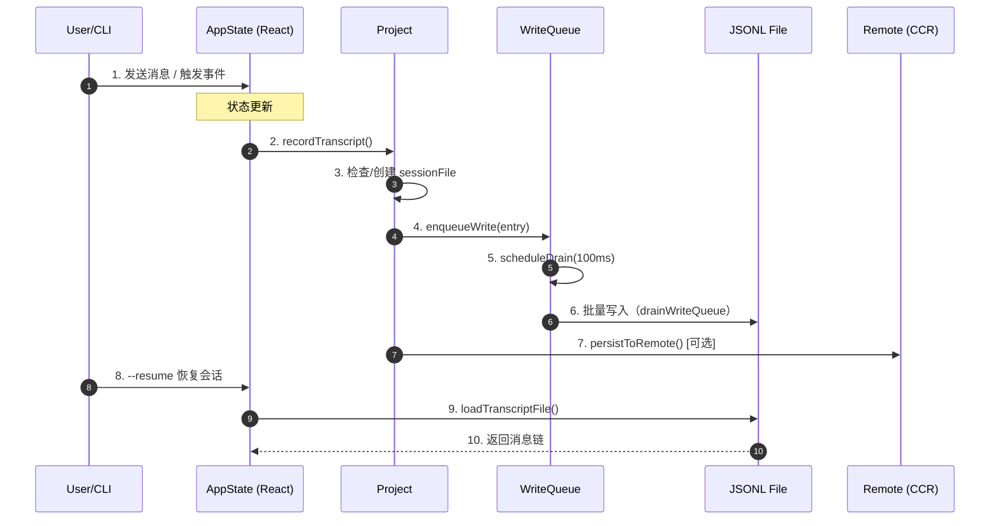
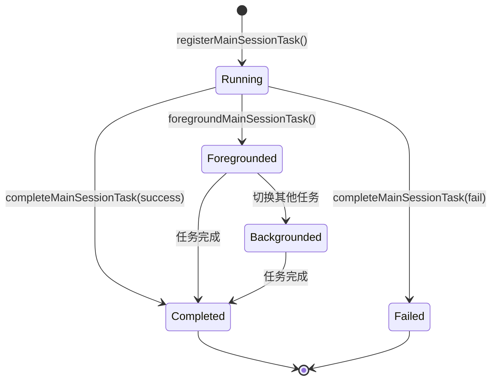
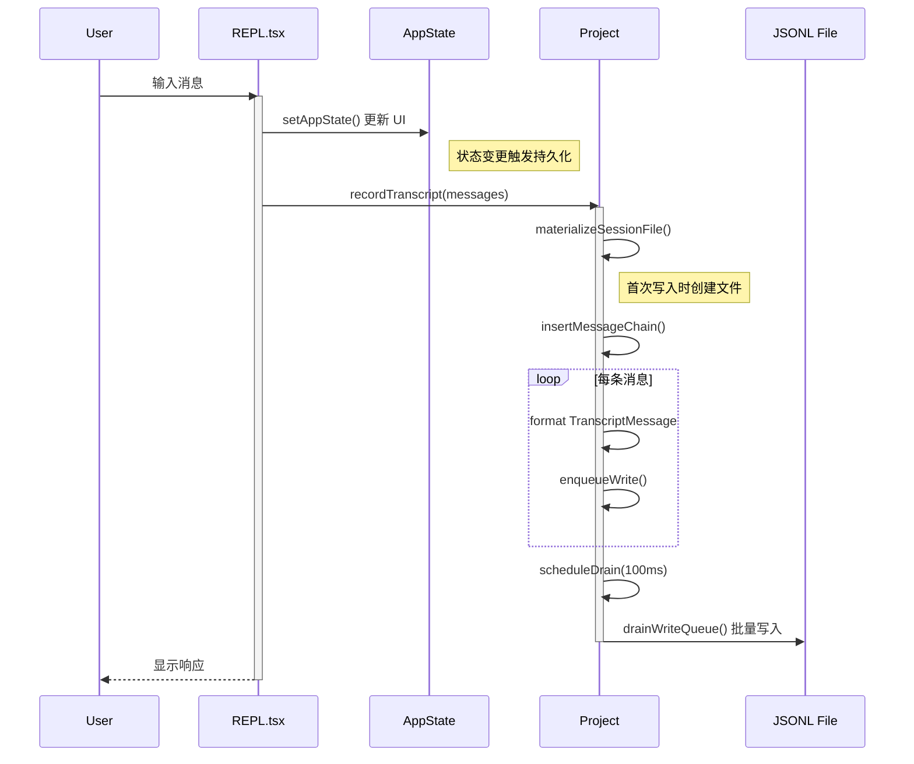
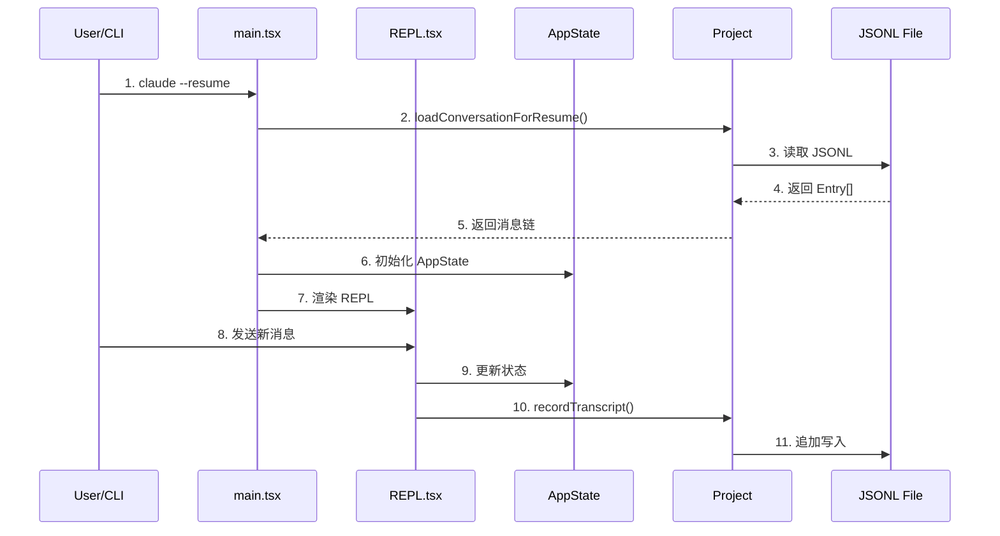
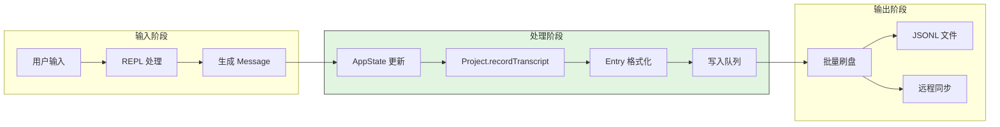
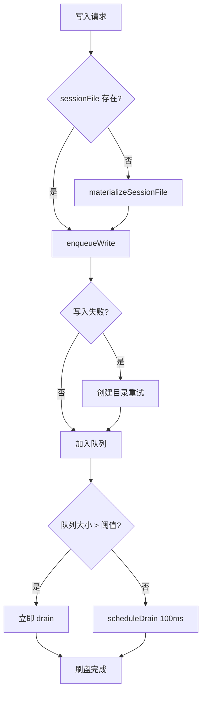
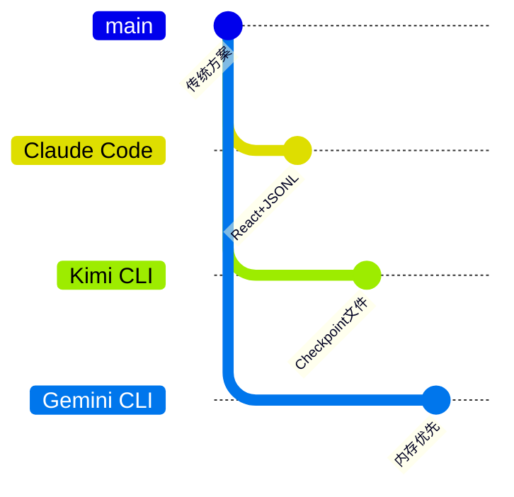

# Claude Code Session Runtime

## TL;DR（结论先行）

Claude Code 的 Session Runtime 是一个基于 JSONL 文件持久化的 React 状态管理系统，通过 `AppState` 集中管理会话状态，使用 `Project` 类实现异步写入队列和批量刷盘，支持本地/远程双路径持久化。

Claude Code 的核心取舍：**React 中心化状态 + JSONL 增量写入**（对比 Kimi CLI 的 Checkpoint 文件回滚、Gemini CLI 的内存优先策略）

### 核心要点速览

| 维度 | 关键决策 | 代码位置 |
|-----|---------|---------|
| 状态管理 | React useState + 全局 Store 模式 | `src/state/AppStateStore.ts:456` |
| 持久化格式 | JSONL 行式存储，支持增量追加 | `src/utils/sessionStorage.ts:202` |
| 写入策略 | 异步队列 + 批量刷盘（100ms 间隔） | `src/utils/sessionStorage.ts:567` |
| 会话恢复 | 从 JSONL 文件重建消息链 | `src/utils/sessionRestore.ts:99` |
| 远程同步 | CCR v2 内部事件写入 | `src/utils/sessionStorage.ts:1302` |

---

## 1. 为什么需要 Session Runtime？（解决什么问题）

### 1.1 问题场景

没有 Session Runtime：
- 每次退出后对话历史丢失，无法 `--resume` 继续
- 多轮对话状态散落在各组件，难以追踪
- 崩溃后无法恢复上下文，用户需重新描述问题

有 Session Runtime：
- 对话自动持久化到本地 JSONL 文件
- 支持 `--resume` 恢复完整上下文
- 后台任务（Background Session）可独立运行并稍后恢复

### 1.2 核心挑战

| 挑战 | 不解决的后果 |
|-----|-------------|
| 状态一致性 | React 组件状态与持久化数据不同步 |
| 性能瓶颈 | 每轮消息都同步写盘导致卡顿 |
| 并发安全 | 多任务同时写入导致文件损坏 |
| 恢复完整性 | 消息链断裂导致对话历史丢失 |

---

## 2. 整体架构（ASCII 图）

### 2.1 在系统中的位置

```text
┌─────────────────────────────────────────────────────────────┐
│ CLI 入口 / Command Handler                                   │
│ src/main.tsx, src/commands/                                  │
└───────────────────────┬─────────────────────────────────────┘
                        │ 初始化/恢复
                        ▼
┌─────────────────────────────────────────────────────────────┐
│ ▓▓▓ Session Runtime ▓▓▓                                     │
│ src/state/AppState.tsx / AppStateStore.ts                    │
│ - AppState: 全局状态定义                                     │
│ - Store: React 状态管理                                      │
│ - Project: 持久化控制器                                      │
└───────────────────────┬─────────────────────────────────────┘
                        │
        ┌───────────────┼───────────────┐
        ▼               ▼               ▼
┌──────────────┐ ┌──────────────┐ ┌──────────────┐
│ LocalMain    │ │ Session      │ │ Remote       │
│ SessionTask  │ │ Storage      │ │ Persistence  │
│ 后台任务管理  │ │ JSONL 文件   │ │ CCR v2 API   │
└──────────────┘ └──────────────┘ └──────────────┘
```

### 2.2 核心组件职责

| 组件 | 职责 | 代码位置 |
|-----|------|---------|
| `AppState` | 定义全局状态结构（消息、任务、MCP、插件等） | `src/state/AppStateStore.ts:89` |
| `getDefaultAppState()` | 初始化默认状态 | `src/state/AppStateStore.ts:456` |
| `Project` | 管理 JSONL 文件写入、队列、刷盘 | `src/utils/sessionStorage.ts:532` |
| `LocalMainSessionTask` | 处理后台会话任务（Ctrl+B 后台化） | `src/tasks/LocalMainSessionTask.ts:94` |
| `sessionRestore` | 会话恢复逻辑 | `src/utils/sessionRestore.ts` |
| `sessionHistory` | 远程会话历史获取 | `src/assistant/sessionHistory.ts` |

### 2.3 核心组件交互关系



**关键交互说明**：

| 步骤 | 交互内容 | 设计意图 |
|-----|---------|---------|
| 1-2 | 用户操作触发状态变更 | React 响应式更新 UI |
| 3 | 延迟创建 session 文件 | 避免空会话文件污染 |
| 4-5 | 异步队列缓冲写入 | 减少磁盘 I/O 频率 |
| 6 | 批量刷盘（100ms 间隔） | 平衡性能与持久化 |
| 7 | 双写远程（CCR 模式） | 云端备份与跨设备同步 |
| 8-10 | 恢复时重建消息链 | 支持 parentUuid 链式恢复 |

---

## 3. 核心组件详细分析

### 3.1 AppState 状态结构

#### 职责定位

AppState 是 Claude Code 的全局状态中心，包含消息历史、任务状态、MCP 连接、插件等所有运行时状态。

#### 状态定义

```typescript
// src/state/AppStateStore.ts:89-453
export type AppState = DeepImmutable<{
  settings: SettingsJson
  verbose: boolean
  mainLoopModel: ModelSetting
  tasks: { [taskId: string]: TaskState }
  agentNameRegistry: Map<string, AgentId>
  mcp: {
    clients: MCPServerConnection[]
    tools: Tool[]
    commands: Command[]
    resources: Record<string, ServerResource[]>
  }
  plugins: {
    enabled: LoadedPlugin[]
    disabled: LoadedPlugin[]
  }
  fileHistory: FileHistoryState
  todos: { [agentId: string]: TodoList }
  // ... 更多状态
}>
```

**关键字段说明**：

| 字段 | 类型 | 用途 |
|-----|------|------|
| `tasks` | `Record<string, TaskState>` | 后台任务状态（Agent、MainSession） |
| `foregroundedTaskId` | `string \| undefined` | 当前前台显示的任务 |
| `mcp.clients` | `MCPServerConnection[]` | MCP 服务器连接状态 |
| `fileHistory` | `FileHistoryState` | 文件历史快照 |
| `initialMessage` | `{ message: UserMessage } \| null` | CLI 传入的初始消息 |

#### 默认状态初始化

```typescript
// src/state/AppStateStore.ts:456-569
export function getDefaultAppState(): AppState {
  return {
    settings: getInitialSettings(),
    tasks: {},                    // ✅ 空任务表
    agentNameRegistry: new Map(),
    mcp: { clients: [], tools: [], commands: [], resources: {}, pluginReconnectKey: 0 },
    plugins: { enabled: [], disabled: [], commands: [], errors: [], ... },
    fileHistory: { snapshots: [], trackedFiles: new Set(), snapshotSequence: 0 },
    todos: {},
    initialMessage: null,
    // ... 其他默认值
  }
}
```

---

### 3.2 Project 持久化控制器

#### 职责定位

Project 类是会话持久化的核心，管理 JSONL 文件的写入队列、批量刷盘、远程同步。

#### 内部数据流

```text
┌────────────────────────────────────────────┐
│  输入层                                     │
│   消息/事件 → 格式化 Entry → 队列缓冲       │
└──────────────────┬─────────────────────────┘
                   ▼
┌────────────────────────────────────────────┐
│  处理层                                     │
│   批量收集 → 去重检查 → 写入队列            │
│   (100ms 间隔刷盘)                         │
└──────────────────┬─────────────────────────┘
                   ▼
┌────────────────────────────────────────────┐
│  输出层                                     │
│   本地 JSONL 文件 + 远程 CCR 同步           │
└────────────────────────────────────────────┘
```

#### 关键接口

| 接口 | 输入 | 输出 | 说明 | 代码位置 |
|-----|------|------|------|---------|
| `insertMessageChain()` | `Message[]` | `Promise<void>` | 批量插入消息链 | `sessionStorage.ts:993` |
| `enqueueWrite()` | `filePath, Entry` | `Promise<void>` | 队列写入 | `sessionStorage.ts:606` |
| `drainWriteQueue()` | - | `Promise<void>` | 刷盘执行 | `sessionStorage.ts:645` |
| `flush()` | - | `Promise<void>` | 强制刷盘 | `sessionStorage.ts:841` |

---

### 3.3 LocalMainSessionTask 后台任务

#### 职责定位

处理用户通过 Ctrl+B 后台化的主会话查询，允许长时间运行的任务在后台继续执行。

#### 状态机图



**状态说明**：

| 状态 | 说明 | 进入条件 | 退出条件 |
|-----|------|---------|---------|
| Running | 任务运行中 | 注册后台任务 | 完成/前台化 |
| Foregrounded | 前台显示 | 用户切换查看 | 切换其他任务 |
| Backgrounded | 后台运行 | 用户切换离开 | 前台化/完成 |
| Completed | 成功完成 | 查询正常结束 | - |
| Failed | 执行失败 | 查询抛出异常 | - |

---

### 3.4 组件间协作时序

展示从用户输入到持久化的完整流程：



---

## 4. 端到端数据流转

### 4.1 正常流程（详细版）



**数据变换详情**：

| 阶段 | 输入 | 处理 | 输出 | 代码位置 |
|-----|------|------|------|---------|
| 接收 | 用户输入 | 格式化 Message | Structured Message | `REPL.tsx` |
| 状态更新 | Message | React setState | 新 AppState | `AppStateStore.ts` |
| 持久化 | Message[] | 转 Entry + 队列 | JSONL 行 | `sessionStorage.ts:993` |
| 恢复 | JSONL 行 | 解析 + 重建链 | Message[] | `conversationRecovery.ts` |

### 4.2 数据流向图



### 4.3 异常/边界流程



---

## 5. 关键代码实现

### 5.1 核心数据结构

**AppState 类型定义**：

```typescript
// src/state/AppStateStore.ts:89-453
export type AppState = DeepImmutable<{
  settings: SettingsJson
  verbose: boolean
  mainLoopModel: ModelSetting
  mainLoopModelForSession: ModelSetting
  tasks: { [taskId: string]: TaskState }
  agentNameRegistry: Map<string, AgentId>
  foregroundedTaskId?: string
  mcp: {
    clients: MCPServerConnection[]
    tools: Tool[]
    commands: Command[]
    resources: Record<string, ServerResource[]>
    pluginReconnectKey: number
  }
  plugins: {
    enabled: LoadedPlugin[]
    disabled: LoadedPlugin[]
    commands: Command[]
    errors: PluginError[]
    installationStatus: {...}
    needsRefresh: boolean
  }
  fileHistory: FileHistoryState
  todos: { [agentId: string]: TodoList }
  initialMessage: { message: UserMessage; clearContext?: boolean } | null
  // ... 更多字段
}>
```

**字段说明**：

| 字段 | 类型 | 用途 |
|-----|------|------|
| `tasks` | `Record<string, TaskState>` | 统一管理所有后台任务 |
| `foregroundedTaskId` | `string?` | 当前前台任务 ID |
| `mcp.clients` | `MCPServerConnection[]` | MCP 服务器连接池 |
| `initialMessage` | `object?` | CLI 传入的初始消息 |

### 5.2 主链路代码

**关键代码**（Project 写入队列）：

```typescript
// src/utils/sessionStorage.ts:606-632
private enqueueWrite(filePath: string, entry: Entry): Promise<void> {
  return new Promise<void>(resolve => {
    // 1. 获取或创建文件队列
    let queue = this.writeQueues.get(filePath)
    if (!queue) {
      queue = []
      this.writeQueues.set(filePath, queue)
    }
    // 2. 加入队列
    queue.push({ entry, resolve })
    // 3. 调度刷盘
    this.scheduleDrain()
  })
}

private scheduleDrain(): void {
  if (this.flushTimer) return
  // 4. 100ms 后批量刷盘
  this.flushTimer = setTimeout(async () => {
    this.flushTimer = null
    this.activeDrain = this.drainWriteQueue()
    await this.activeDrain
    this.activeDrain = null
    if (this.writeQueues.size > 0) {
      this.scheduleDrain()  // 继续处理新写入
    }
  }, this.FLUSH_INTERVAL_MS)  // 100ms
}
```

**设计意图**：
1. **队列缓冲**：避免每消息都触发磁盘 I/O
2. **批量刷盘**：100ms 间隔平衡性能与持久化
3. **Promise 等待**：调用者可 await 确认写入完成
4. **递归调度**：处理刷盘期间新到达的写入

<details>
<summary>查看完整实现（含批量写入、分块处理）</summary>

```typescript
// src/utils/sessionStorage.ts:645-686
private async drainWriteQueue(): Promise<void> {
  for (const [filePath, queue] of this.writeQueues) {
    if (queue.length === 0) continue
    const batch = queue.splice(0)

    let content = ''
    const resolvers: Array<() => void> = []

    for (const { entry, resolve } of batch) {
      const line = jsonStringify(entry) + '\n'
      // 分块处理：超过 100MB 先刷盘
      if (content.length + line.length >= this.MAX_CHUNK_BYTES) {
        await this.appendToFile(filePath, content)
        for (const r of resolvers) r()
        resolvers.length = 0
        content = ''
      }
      content += line
      resolvers.push(resolve)
    }

    if (content.length > 0) {
      await this.appendToFile(filePath, content)
      for (const r of resolvers) r()
    }
  }
}
```

</details>

### 5.3 关键调用链

```text
main.tsx --resume
  -> loadConversationForResume()     [src/utils/conversationRecovery.ts]
    -> loadTranscriptFile()           [src/utils/sessionStorage.ts]
      -> parseJSONL()                 [src/utils/json.ts]
    -> restoreSessionStateFromLog()   [src/utils/sessionRestore.ts:99]
      -> fileHistoryRestoreStateFromLog()
      -> attributionRestoreStateFromLog()

REPL.tsx 用户输入
  -> recordTranscript()               [src/utils/sessionStorage.ts:1408]
    -> getProject().insertMessageChain()  [sessionStorage.ts:993]
      -> materializeSessionFile()     [sessionStorage.ts:976]
      -> appendEntry()                [sessionStorage.ts:1128]
        -> enqueueWrite()             [sessionStorage.ts:606]
          -> scheduleDrain()          [sessionStorage.ts:618]
            -> drainWriteQueue()      [sessionStorage.ts:645]
              -> appendToFile()       [sessionStorage.ts:634]
```

---

## 6. 设计意图与 Trade-off

### 6.1 Claude Code 的选择

| 维度 | Claude Code 的选择 | 替代方案 | 取舍分析 |
|-----|-------------------|---------|---------|
| 状态管理 | React useState + Store | Redux/Zustand | 简单直接，但跨组件通信需通过 props |
| 持久化格式 | JSONL 行式存储 | SQLite/LevelDB | 人类可读、易于调试，但查询能力弱 |
| 写入策略 | 异步队列 + 批量 | 同步写入 | 性能更好，但崩溃可能丢失 100ms 数据 |
| 恢复机制 | parentUuid 链式重建 | 快照保存 | 精确恢复，但需遍历整个文件 |
| 远程同步 | CCR v2 内部事件 | HTTP API 轮询 | 实时性好，但依赖内部基础设施 |

### 6.2 为什么这样设计？

**核心问题**：如何在保证性能的同时实现可靠的会话持久化？

**Claude Code 的解决方案**：
- **代码依据**：`src/utils/sessionStorage.ts:532-567`
- **设计意图**：
  - 使用 JSONL 格式便于人工查看和调试
  - 异步队列减少磁盘 I/O 阻塞主线程
  - parentUuid 链式结构支持消息分支（如 Agent 子会话）
- **带来的好处**：
  - 写入性能高（批量刷盘）
  - 文件格式简单，兼容性好
  - 支持后台任务独立持久化
- **付出的代价**：
  - 恢复时需扫描整个文件重建链
  - 大文件性能下降（需配合 compaction）
  - 崩溃可能丢失最近 100ms 数据

### 6.3 与其他项目的对比



| 项目 | 核心差异 | 适用场景 |
|-----|---------|---------|
| Claude Code | React 状态中心 + JSONL 增量写入 | 需要实时 UI 更新、后台任务 |
| Kimi CLI | Checkpoint 文件支持回滚 | 需要精确状态回滚 |
| Gemini CLI | 内存优先 + 后台同步 | 追求极致写入性能 |
| Codex | Rust 原生 + 内存管理 | 高性能、低资源占用 |

---

## 7. 边界情况与错误处理

### 7.1 终止条件

| 终止原因 | 触发条件 | 代码位置 |
|---------|---------|---------|
| 用户退出 | Ctrl+C / exit 命令 | `main.tsx` |
| 会话切换 | `--resume` 其他会话 | `sessionRestore.ts:332` |
| 清理过期 | `cleanupPeriodDays=0` | `sessionStorage.ts:960` |
| 刷盘超时 | 强制 flush 等待 | `sessionStorage.ts:841` |

### 7.2 超时/资源限制

```typescript
// src/utils/sessionStorage.ts:122-229
// 50MB - 防止 OOM 的墓碑重写阈值
const MAX_TOMBSTONE_REWRITE_BYTES = 50 * 1024 * 1024

// 50MB - 读取转录文件的最大字节数
export const MAX_TRANSCRIPT_READ_BYTES = 50 * 1024 * 1024

// 100MB - 单次批量写入分块大小
private readonly MAX_CHUNK_BYTES = 100 * 1024 * 1024

// 100ms - 刷盘间隔
private FLUSH_INTERVAL_MS = 100
```

### 7.3 错误恢复策略

| 错误类型 | 处理策略 | 代码位置 |
|---------|---------|---------|
| 文件不存在 | 自动创建目录重试 | `sessionStorage.ts:634` |
| 写入冲突 | UUID 去重跳过 | `sessionStorage.ts:1242` |
| 远程失败 | 优雅降级（本地优先） | `sessionStorage.ts:1302` |
| 消息链断裂 | parentUuid=null 重新开始 | `sessionStorage.ts:1040` |

---

## 8. 关键代码索引

| 功能 | 文件 | 行号 | 说明 |
|-----|------|------|------|
| 状态定义 | `src/state/AppStateStore.ts` | 89 | AppState 类型定义 |
| 默认状态 | `src/state/AppStateStore.ts` | 456 | getDefaultAppState() |
| 状态提供 | `src/state/AppState.tsx` | 50 | createStore |
| 会话存储 | `src/utils/sessionStorage.ts` | 532 | Project 类 |
| 消息写入 | `src/utils/sessionStorage.ts` | 993 | insertMessageChain() |
| 队列写入 | `src/utils/sessionStorage.ts` | 606 | enqueueWrite() |
| 批量刷盘 | `src/utils/sessionStorage.ts` | 645 | drainWriteQueue() |
| 强制刷盘 | `src/utils/sessionStorage.ts` | 841 | flush() |
| 会话恢复 | `src/utils/sessionRestore.ts` | 99 | restoreSessionStateFromLog() |
| 后台任务 | `src/tasks/LocalMainSessionTask.ts` | 94 | registerMainSessionTask() |
| 恢复 UI | `src/screens/ResumeConversation.tsx` | 67 | ResumeConversation 组件 |
| 远程历史 | `src/assistant/sessionHistory.ts` | 31 | createHistoryAuthCtx() |

---

## 9. 延伸阅读

- 前置知识：`01-claude-code-overview.md`
- 相关机制：`04-claude-code-agent-loop.md`（Agent 循环）
- 深度分析：`docs/comm/03-comm-session-runtime.md`（跨项目对比）

---

*✅ Verified: 基于 claude-code/src/state/AppStateStore.ts:89、claude-code/src/utils/sessionStorage.ts:532 等源码分析*
*基于版本：2026-03-31 | 最后更新：2026-03-31*
