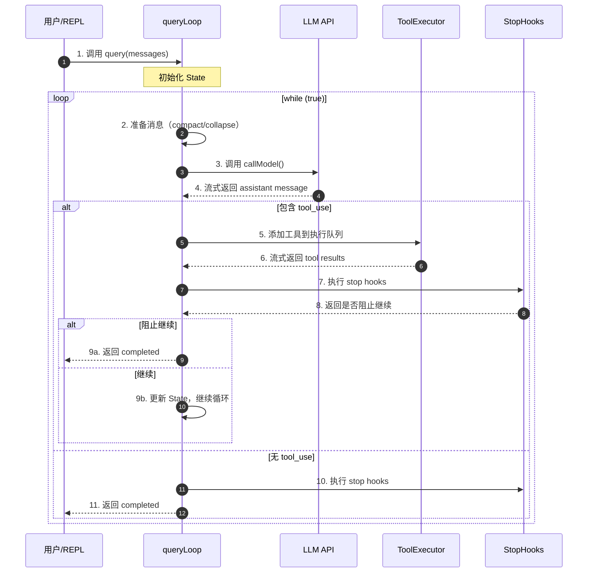
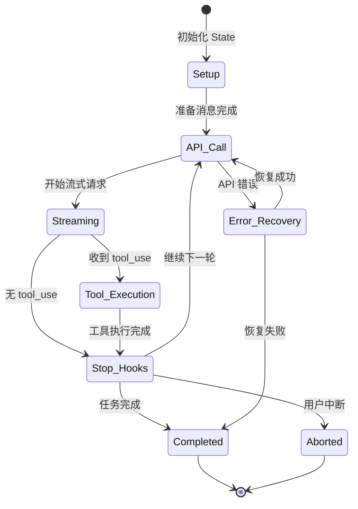
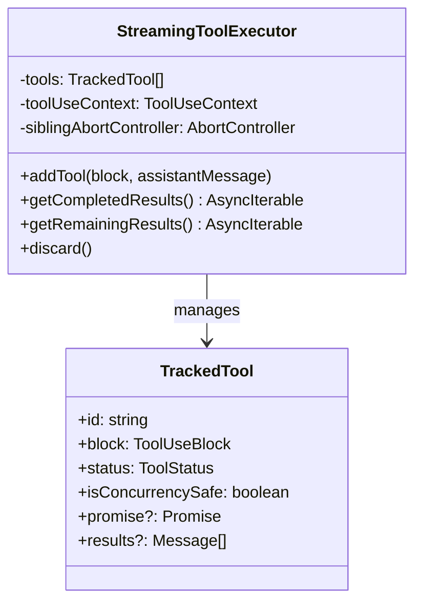
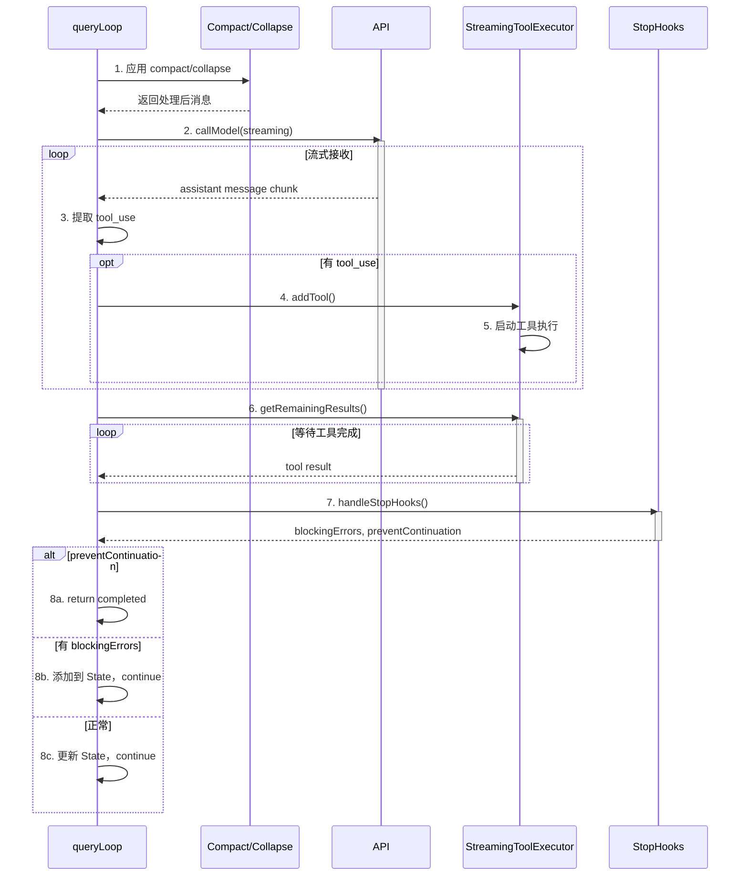
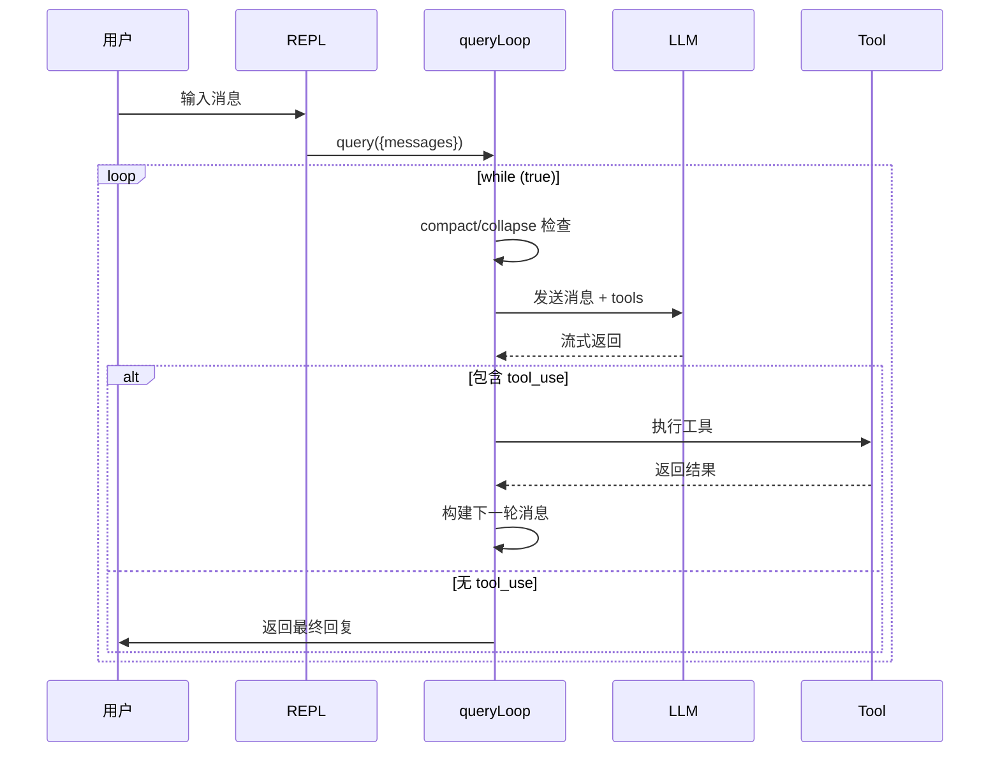
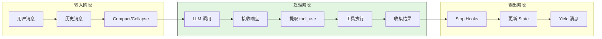
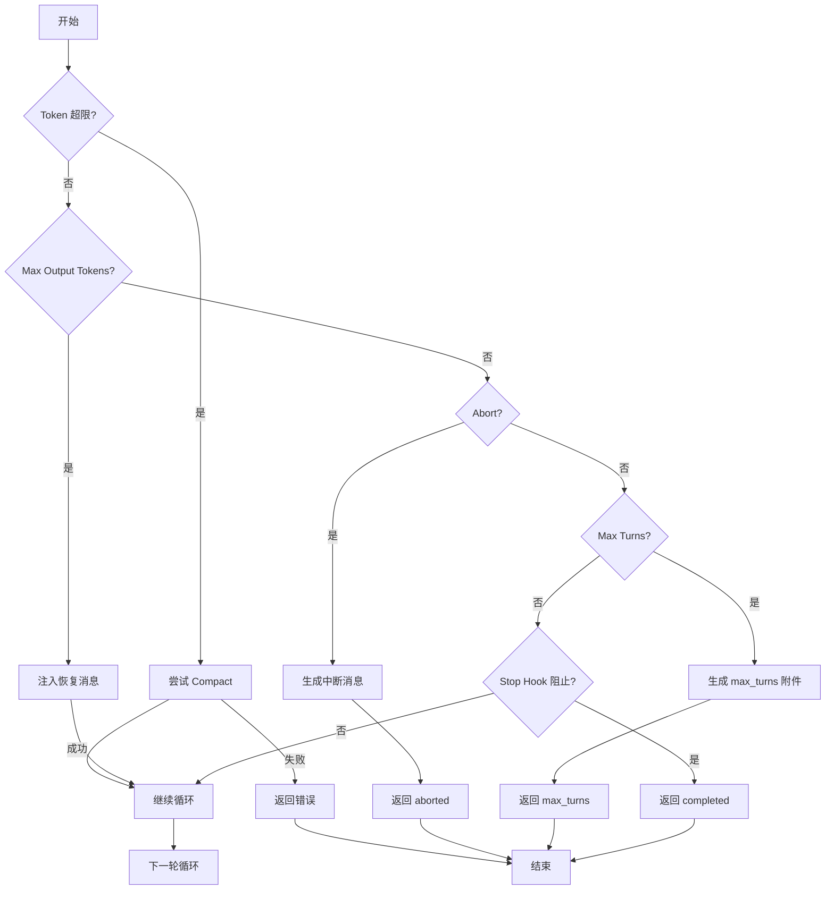
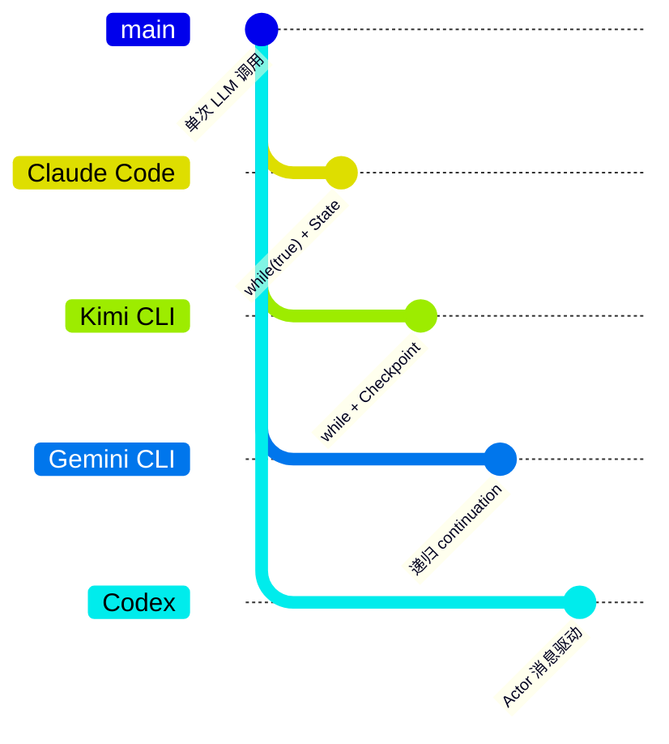
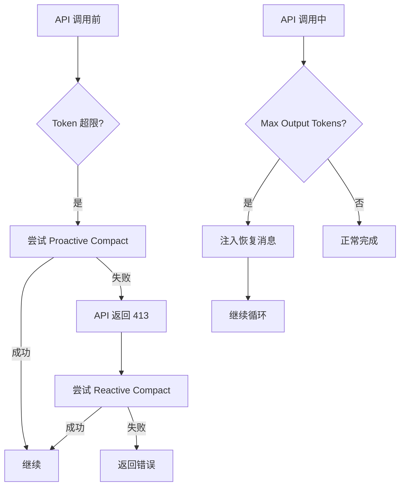

# Claude Code Agent Loop 机制

> **阅读指南**
>
> | 属性 | 说明 |
> |-----|------|
> | 预计阅读 | 25-35 分钟 |
> | 前置文档 | `01-claude-code-overview.md` |
> | 文档结构 | TL;DR → 架构 → 核心组件 → 状态机 → 代码实现 → 对比分析 |

---

## TL;DR（结论先行）

一句话定义：Agent Loop 是 Claude Code 的控制核心，通过 `while (true)` 循环驱动多轮 LLM 调用，实现从"一次性回答"到"持续任务执行"的转变。

Claude Code 的核心取舍：**基于 Generator 的异步迭代循环 + 流式工具执行 + 多重状态恢复机制**（对比 Kimi CLI 的 while+checkpoint、Gemini CLI 的递归 continuation、Codex 的 Actor 模型）

### 核心要点速览

| 维度 | 关键决策 | 代码位置 |
|-----|---------|---------|
| 核心机制 | `while (true)` 驱动多轮 LLM 调用 | `claude-code/src/query.ts:307` |
| 状态管理 | 不可变 State 对象 + 显式 continue 点 | `claude-code/src/query.ts:268-278` |
| 工具执行 | 流式执行器 + 并发安全检测 | `claude-code/src/services/tools/StreamingToolExecutor.ts:40` |
| 错误恢复 | 多重恢复路径（reactive compact、max_output_tokens、stop hooks） | `claude-code/src/query.ts:1062-1356` |
| 终止条件 | maxTurns、abort signal、stop hook prevention | `claude-code/src/query.ts:1705-1711` |

---

## 1. 为什么需要这个机制？

### 1.1 问题场景

没有 Agent Loop：
```
用户: "修复这个 bug"
LLM: "我需要先查看相关文件..." → 结束（实际上什么都没做）
```

有 Agent Loop：
```
用户: "修复这个 bug"
→ LLM: "先读文件" → 执行 Read → 得到文件内容
→ LLM: "找到问题了，在第 42 行" → 执行 Edit → 修改成功
→ LLM: "运行测试验证" → 执行 Bash → 测试通过
→ LLM: "修复完成" → 无工具调用 → 循环结束
```

### 1.2 核心挑战

| 挑战 | 不解决的后果 |
|-----|-------------|
| 多轮状态管理 | 每轮产生的消息和工具结果需要正确累积到下一轮 |
| 工具并发执行 | 读操作可以并行，写操作需要串行保证一致性 |
| Token 上限处理 | 长会话会触发 prompt too long，需要自动压缩 |
| 无限循环防护 | 需要 max turns、stop hooks 等多重终止机制 |
| 流式响应处理 | 大模型响应可能分多次到达，需要增量处理 |

---

## 2. 整体架构

### 2.1 在系统中的位置

```text
┌─────────────────────────────────────────────────────────────┐
│ REPL / SDK / Background Task                                │
│ src/REPL.tsx / src/print.ts / src/tasks/LocalMainSessionTask.ts│
└───────────────────────┬─────────────────────────────────────┘
                        │ 调用 query()
                        ▼
┌─────────────────────────────────────────────────────────────┐
│ ▓▓▓ Agent Loop (query.ts) ▓▓▓                               │
│ src/query.ts                                                │
│ - query()      : 入口，管理 command lifecycle               │
│ - queryLoop()  : 核心 while(true) 循环                      │
│ - State 对象   : 跨迭代状态管理                              │
└───────────────────────┬─────────────────────────────────────┘
                        │
        ┌───────────────┼───────────────┐
        ▼               ▼               ▼
┌──────────────┐ ┌──────────────┐ ┌──────────────┐
│ LLM API      │ │ Tool System  │ │ Context      │
│ callModel()  │ │ StreamingTool│ │ Compact/     │
│              │ │ Executor     │ │ Collapse     │
└──────────────┘ └──────────────┘ └──────────────┘
```

### 2.2 核心组件职责

| 组件 | 职责 | 代码位置 |
|-----|------|---------|
| `query()` | 入口函数，管理 command lifecycle，包装 `queryLoop()` | `src/query.ts:219-239` |
| `queryLoop()` | 核心循环，包含 `while(true)` 和状态机 | `src/query.ts:241-1729` |
| `State` | 跨迭代状态对象，包含 messages、toolUseContext、turnCount 等 | `src/query.ts:203-217` |
| `StreamingToolExecutor` | 流式工具执行器，支持并发安全检测 | `src/services/tools/StreamingToolExecutor.ts:40` |
| `runTools()` | 工具编排，分区并发/串行执行 | `src/services/tools/toolOrchestration.ts:19` |
| `handleStopHooks()` | Stop hook 处理，支持阻止继续执行 | `src/query/stopHooks.ts:65` |

### 2.3 核心组件交互关系



**关键交互说明**：

| 步骤 | 交互内容 | 设计意图 |
|-----|---------|---------|
| 1 | REPL 调用 query() | 解耦 UI 与核心逻辑 |
| 2 | 预处理消息（compact/collapse） | 防止 token 超限 |
| 3-4 | 流式 LLM 调用 | 支持增量显示，减少等待 |
| 5-6 | 流式工具执行 | 工具可以并行执行，结果按序返回 |
| 7-8 | Stop hooks 检查 | 用户自定义的终止条件 |
| 9b | State 更新 + continue | 显式状态传递，便于测试和调试 |

---

## 3. 核心组件详细分析

### 3.1 queryLoop 内部结构

#### 职责定位

`queryLoop` 是 Agent Loop 的核心，负责：
1. 维护跨迭代的可变状态（State）
2. 协调 LLM 调用、工具执行、hook 处理
3. 处理各种边界情况（abort、error、compact）

#### 状态机图



**状态说明**：

| 状态 | 说明 | 进入条件 | 退出条件 |
|-----|------|---------|---------|
| Setup | 初始化状态 | 函数入口 | State 初始化完成 |
| API_Call | 调用 LLM | 消息准备完成 | 流式响应开始 |
| Streaming | 接收流式响应 | API 调用成功 | 响应接收完成 |
| Tool_Execution | 执行工具 | 收到 tool_use | 所有工具完成 |
| Stop_Hooks | 执行 stop hooks | 工具执行完成或无 tool_use | hooks 完成 |
| Error_Recovery | 错误恢复 | API 错误或 token 超限 | 恢复成功或失败 |
| Completed | 完成 | 无 tool_use 且 hooks 通过 | 自动退出 |
| Aborted | 中断 | 用户触发 abort | 自动退出 |

#### 内部数据流

```text
┌────────────────────────────────────────────┐
│  输入层                                     │
│   State (messages, toolUseContext)         │
│   → 应用 compact/collapse                  │
│   → 构建 API 请求                          │
└──────────────────┬─────────────────────────┘
                   ▼
┌────────────────────────────────────────────┐
│  处理层                                     │
│   流式接收 assistant message               │
│   → 提取 tool_use 块                       │
│   → 流式执行工具                           │
│   → 收集 tool results                      │
└──────────────────┬─────────────────────────┘
                   ▼
┌────────────────────────────────────────────┐
│  输出层                                     │
│   执行 stop hooks                          │
│   → 更新 State (messages += new)           │
│   → yield 消息给上层                       │
│   → continue 或 return                     │
└────────────────────────────────────────────┘
```

#### 关键接口

| 接口 | 输入 | 输出 | 说明 | 代码位置 |
|-----|------|------|------|---------|
| `queryLoop()` | `QueryParams` | `Terminal` (Generator) | 核心循环入口 | `src/query.ts:241` |
| `State` | messages, toolUseContext, turnCount... | 更新后的 State | 跨迭代状态 | `src/query.ts:203-217` |
| `callModel()` | messages, systemPrompt, tools... | AsyncIterable messages | LLM 流式调用 | `src/query/deps.ts` |
| `runTools()` | toolUseBlocks, context | AsyncIterable results | 工具执行 | `src/services/tools/toolOrchestration.ts:19` |

---

### 3.2 工具执行系统

#### StreamingToolExecutor



**并发控制策略**：

✅ Verified: 工具分为两类执行模式（`src/services/tools/toolOrchestration.ts:86-116`）：

1. **并发安全工具**（`isConcurrencySafe: true`）：多个读操作可以并行
2. **非并发安全工具**（`isConcurrencySafe: false`）：写操作串行执行

```typescript
// src/services/tools/toolOrchestration.ts:86-116
function partitionToolCalls(
  toolUseMessages: ToolUseBlock[],
  toolUseContext: ToolUseContext,
): Batch[] {
  return toolUseMessages.reduce((acc: Batch[], toolUse) => {
    const tool = findToolByName(toolUseContext.options.tools, toolUse.name)
    const parsedInput = tool?.inputSchema.safeParse(toolUse.input)
    const isConcurrencySafe = parsedInput?.success
      ? (() => {
          try {
            return Boolean(tool?.isConcurrencySafe(parsedInput.data))
          } catch {
            return false  // 保守策略：出错视为不安全
          }
        })()
      : false
    if (isConcurrencySafe && acc[acc.length - 1]?.isConcurrencySafe) {
      acc[acc.length - 1]!.blocks.push(toolUse)  // 合并到当前并发批次
    } else {
      acc.push({ isConcurrencySafe, blocks: [toolUse] })  // 新开批次
    }
    return acc
  }, [])
}
```

---

### 3.3 组件间协作时序

展示一次完整 turn 的执行流程：



---

## 4. 端到端数据流转

### 4.1 正常流程（详细版）



### 4.2 数据流向图



### 4.3 异常/边界流程



---

## 5. 关键代码实现

### 5.1 核心数据结构

```typescript
// claude-code/src/query.ts:203-217
type State = {
  messages: Message[]                           // 累积的消息历史
  toolUseContext: ToolUseContext               // 工具执行上下文
  autoCompactTracking: AutoCompactTrackingState | undefined
  maxOutputTokensRecoveryCount: number         // max_output_tokens 恢复计数
  hasAttemptedReactiveCompact: boolean         // 是否已尝试 reactive compact
  maxOutputTokensOverride: number | undefined  // 覆盖 max output tokens
  pendingToolUseSummary: Promise<ToolUseSummaryMessage | null> | undefined
  stopHookActive: boolean | undefined          // stop hook 是否激活
  turnCount: number                            // 当前 turn 计数
  transition: Continue | undefined             // 上次继续原因
}
```

**字段说明**：

| 字段 | 类型 | 用途 |
|-----|------|------|
| `messages` | `Message[]` | 累积的对话历史，每轮迭代追加 |
| `toolUseContext` | `ToolUseContext` | 包含 tools、abortController、appState 等 |
| `turnCount` | `number` | 当前 turn 计数，用于 maxTurns 检查 |
| `transition` | `Continue \| undefined` | 记录上次继续原因，便于测试断言 |

### 5.2 主链路代码

**关键代码**（核心 `while(true)` 循环）：

```typescript
// claude-code/src/query.ts:306-728
async function* queryLoop(
  params: QueryParams,
  consumedCommandUuids: string[],
): AsyncGenerator<..., Terminal> {
  // 初始化 State
  let state: State = {
    messages: params.messages,
    toolUseContext: params.toolUseContext,
    // ... 其他字段
  }

  // eslint-disable-next-line no-constant-condition
  while (true) {
    // 1. 解构 State，读取当前状态
    let { toolUseContext } = state
    const { messages, turnCount, ... } = state

    // 2. 准备消息（compact/collapse）
    let messagesForQuery = [...getMessagesAfterCompactBoundary(messages)]
    // ... 应用 snip、microcompact、autocompact

    // 3. 调用 LLM
    for await (const message of deps.callModel({...})) {
      // 流式处理响应
      if (message.type === 'assistant') {
        assistantMessages.push(message)
        // 提取 tool_use
        const msgToolUseBlocks = message.message.content.filter(
          content => content.type === 'tool_use'
        ) as ToolUseBlock[]
        if (msgToolUseBlocks.length > 0) {
          toolUseBlocks.push(...msgToolUseBlocks)
          needsFollowUp = true
        }
      }
    }

    // 4. 如无 tool_use，执行 stop hooks 并退出
    if (!needsFollowUp) {
      const stopHookResult = yield* handleStopHooks(...)
      if (stopHookResult.preventContinuation) {
        return { reason: 'stop_hook_prevented' }
      }
      return { reason: 'completed' }
    }

    // 5. 执行工具
    const toolUpdates = streamingToolExecutor
      ? streamingToolExecutor.getRemainingResults()
      : runTools(toolUseBlocks, assistantMessages, canUseTool, toolUseContext)

    for await (const update of toolUpdates) {
      if (update.message) {
        yield update.message
        toolResults.push(...)
      }
    }

    // 6. 检查 abort
    if (toolUseContext.abortController.signal.aborted) {
      return { reason: 'aborted_tools' }
    }

    // 7. 检查 maxTurns
    if (maxTurns && nextTurnCount > maxTurns) {
      return { reason: 'max_turns', turnCount: nextTurnCount }
    }

    // 8. 更新 State，继续下一轮
    const next: State = {
      messages: [...messagesForQuery, ...assistantMessages, ...toolResults],
      toolUseContext: toolUseContextWithQueryTracking,
      turnCount: nextTurnCount,
      // ... 其他字段
      transition: { reason: 'next_turn' },
    }
    state = next
  } // while (true)
}
```

**设计意图**：

1. **State 模式**：所有跨迭代状态集中在 State 对象，通过解构读取、重建对象更新，保证不可变性
2. **Generator 模式**：使用 `async function*` 实现流式输出，上层可以实时显示消息
3. **显式 continue 点**：7 个 continue 点（transition reason）清晰标记循环继续原因
4. **工具并发**：StreamingToolExecutor 支持并发安全工具的并行执行

### 5.3 关键调用链

```text
query()                          [src/query.ts:219]
  -> queryLoop()                 [src/query.ts:241]
    -> while (true)              [src/query.ts:307]
      -> callModel()             [src/query/deps.ts]
        -> 流式接收消息
      -> StreamingToolExecutor   [src/services/tools/StreamingToolExecutor.ts:40]
        -> runToolUse()          [src/services/tools/toolExecution.ts:337]
          -> tool.call()         [src/Tool.ts:379]
      -> handleStopHooks()       [src/query/stopHooks.ts:65]
        -> executeStopHooks()    [src/utils/hooks.ts]
      -> State 更新 + continue   [src/query.ts:1715-1728]
```

---

## 6. 设计意图与 Trade-off

### 6.1 Claude Code 的选择

| 维度 | Claude Code 的选择 | 替代方案 | 取舍分析 |
|-----|-------------------|---------|---------|
| 循环结构 | `while(true)` + State 对象 | 递归 continuation（Gemini） | 简单直观，状态变更显式；但代码量较大 |
| 工具执行 | StreamingToolExecutor + 并发分区 | 完全串行/完全并行 | 读操作并行提速，写操作串行保安全 |
| 状态管理 | 显式 State 对象传递 | 全局状态/Context | 可测试性强，但需手动传递 |
| 流式处理 | Generator + yield | 回调/Promise | 代码可读性好，支持实时 UI 更新 |
| 错误恢复 | 多重恢复路径（reactive compact、escalation） | 单一失败 | 用户体验好，但逻辑复杂 |

### 6.2 为什么这样设计？

**核心问题**：如何平衡代码可读性、可测试性与功能复杂度？

**Claude Code 的解决方案**：

- 代码依据：`src/query.ts:268-278`
- 设计意图：使用不可变 State 对象 + 显式 continue 点
- 带来的好处：
  - 每次迭代的状态变更清晰可见
  - 测试可以断言 transition reason 验证代码路径
  - 避免隐式状态导致的 bug
- 付出的代价：
  - 代码行数增加（~1700 行）
  - 需要手动管理 State 的复制和更新

### 6.3 与其他项目的对比



| 项目 | 核心差异 | 适用场景 |
|-----|---------|---------|
| Claude Code | while(true) + Generator + 流式工具执行 | 复杂交互、需要实时反馈 |
| Kimi CLI | while + Checkpoint 文件回滚 | 需要状态持久化和回滚 |
| Gemini CLI | 递归 continuation + 状态机 | 清晰的状态流转 |
| Codex | Actor 模型 + 消息驱动 | 高并发、容错 |

---

## 7. 边界情况与错误处理

### 7.1 终止条件

| 终止原因 | 触发条件 | 代码位置 |
|---------|---------|---------|
| `completed` | 无 tool_use 且 stop hooks 通过 | `src/query.ts:1357` |
| `stop_hook_prevented` | Stop hook 阻止继续 | `src/query.ts:1279` |
| `aborted_streaming` | 用户中断（流式阶段） | `src/query.ts:1051` |
| `aborted_tools` | 用户中断（工具执行阶段） | `src/query.ts:1515` |
| `max_turns` | 超过 maxTurns 限制 | `src/query.ts:1711` |
| `prompt_too_long` | Token 超限且无法恢复 | `src/query.ts:1175` |
| `model_error` | API 调用异常 | `src/query.ts:996` |

### 7.2 Token 限制处理



### 7.3 错误恢复策略

| 错误类型 | 处理策略 | 代码位置 |
|---------|---------|---------|
| `prompt_too_long` | Reactive compact → 重试 | `src/query.ts:1119-1166` |
| `max_output_tokens` | 注入恢复消息 → 重试（最多 3 次） | `src/query.ts:1188-1256` |
| `model_fallback` | 切换 fallback model → 重试 | `src/query.ts:894-950` |
| `stop_hook_blocking` | 注入 blocking error → 重试 | `src/query.ts:1282-1306` |

---

## 8. 关键代码索引

| 功能 | 文件 | 行号 | 说明 |
|-----|------|------|------|
| 入口 | `src/query.ts` | 219 | `query()` 函数入口 |
| 核心循环 | `src/query.ts` | 241-1729 | `queryLoop()` 完整实现 |
| State 定义 | `src/query.ts` | 203-217 | State 类型定义 |
| while(true) | `src/query.ts` | 307 | 核心循环起点 |
| 工具执行 | `src/services/tools/StreamingToolExecutor.ts` | 40 | 流式工具执行器 |
| 工具编排 | `src/services/tools/toolOrchestration.ts` | 19 | `runTools()` 函数 |
| Stop Hooks | `src/query/stopHooks.ts` | 65 | `handleStopHooks()` |
| 并发分区 | `src/services/tools/toolOrchestration.ts` | 86-116 | `partitionToolCalls()` |
| 单次工具执行 | `src/services/tools/toolExecution.ts` | 337 | `runToolUse()` |
| Token Budget | `src/query/tokenBudget.ts` | 45 | `checkTokenBudget()` |

---

## 9. 延伸阅读

- 前置知识：`01-claude-code-overview.md`
- 相关机制：
  - `05-claude-code-tools-system.md` - 工具系统详解
  - `07-claude-code-memory-context.md` - 上下文压缩机制
  - `10-claude-code-safety-control.md` - 安全控制机制
- 深度分析：
  - `docs/kimi-cli/04-kimi-cli-agent-loop.md` - Kimi CLI 的 Agent Loop 对比
  - `docs/gemini-cli/04-gemini-cli-agent-loop.md` - Gemini CLI 的递归 continuation

---

*✅ Verified: 基于 claude-code/src/query.ts:241-1729 等源码分析*
*基于版本：2026-03-31 | 最后更新：2026-03-31*
