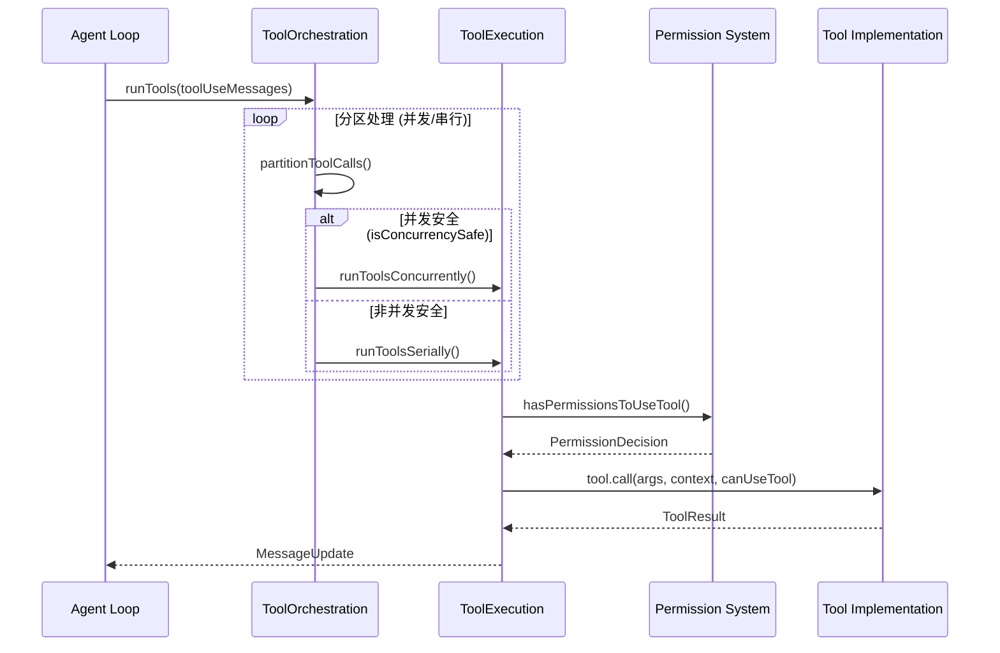
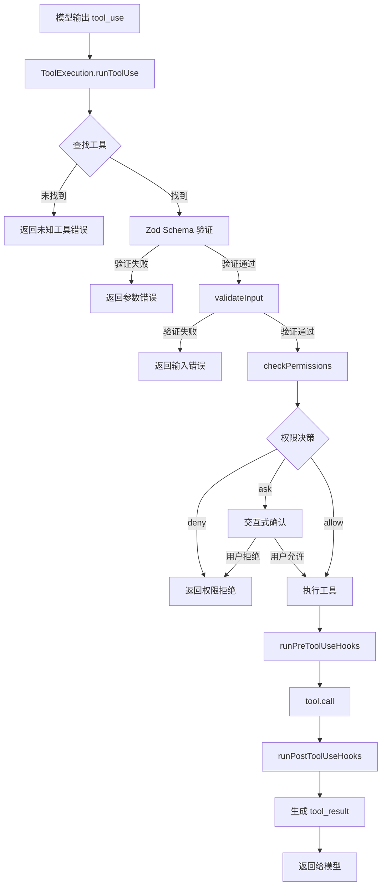
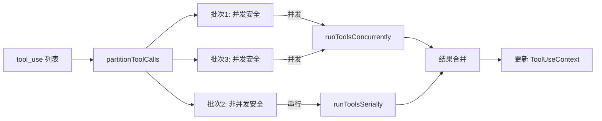

> 📋 **阅读指南**
>
> | 属性 | 说明 |
> |-----|------|
> | 预计阅读 | 25-35 分钟 |
> | 前置文档 | `01-claude-code-overview.md`、`04-claude-code-agent-loop.md` |
> | 文档结构 | 速览 → 架构 → 机制 → 实现 → 对比 |
> | 代码呈现 | 关键代码直接展示，完整代码可折叠查看 |

---

# Tool System（Claude Code）

## TL;DR（结论先行）

一句话定义：Claude Code 的 Tool System 是「**统一 Tool 抽象 + Zod Schema 验证 + 细粒度权限控制 + 并发安全执行**」的四层架构：通过 `Tool` 接口统一所有工具定义，使用 Zod 进行运行时参数验证，通过多层级权限系统控制工具访问，并基于读写分离实现并发安全。

Claude Code 的核心取舍：**统一接口抽象 + 声明式权限 + 并发分区执行**（对比 Gemini CLI 的 Scheduler 状态机、Codex 的 Trait-based Handler、Kimi CLI 的模块化功能域）

### 核心要点速览

| 维度 | 关键决策 | 代码位置 |
|-----|---------|---------|
| 工具定义 | `Tool` 接口统一抽象 | `claude-code/src/Tool.ts:362` |
| 参数验证 | Zod Schema 运行时验证 | `claude-code/src/Tool.ts:394` |
| 权限控制 | 多层级规则 + 分类器 | `claude-code/src/utils/permissions/permissions.ts:1` |
| 并发执行 | 读写分区 + 并发限制 | `claude-code/src/services/tools/toolOrchestration.ts:19` |
| 工具注册 | `buildTool` 工厂函数 | `claude-code/src/Tool.ts:783` |
| MCP 集成 | 原生支持 `mcp__` 前缀 | `claude-code/src/Tool.ts:455` |

---

## 1. 为什么需要这个机制？（解决什么问题）

### 1.1 问题场景

没有 Tool System：模型输出工具调用指令 → 需要手动解析 → 手动执行 → 手动格式化结果返回

有 Tool System：
```
模型输出: {"name": "Read", "input": {"file_path": "/tmp/test.txt"}}
  ↓ Zod Schema 验证参数
  ↓ 权限系统检查 (规则/分类器/交互式确认)
  ↓ 并发调度 (读操作可并行，写操作串行)
  ↓ 工具执行 + Hook 处理
  ↓ 结果自动格式化并渲染 UI
```

### 1.2 核心挑战

| 挑战 | 不解决的后果 |
|-----|-------------|
| 参数验证 | 模型输出格式错误导致运行时崩溃 |
| 权限控制 | 危险操作未经确认直接执行 |
| 并发安全 | 读写冲突导致数据损坏 |
| 工具扩展 | 新增工具需要修改核心代码 |
| UI 一致性 | 不同工具的结果展示风格不统一 |
| MCP 集成 | 无法使用外部工具服务 |

---

## 2. 整体架构（ASCII 图）

### 2.1 在系统中的位置

```text
┌─────────────────────────────────────────────────────────────┐
│ Agent Loop / Session Runtime                                 │
│ claude-code/src/services/tools/toolExecution.ts              │
└───────────────────────┬─────────────────────────────────────┘
                        │ 调用工具
                        ▼
┌─────────────────────────────────────────────────────────────┐
│ ▓▓▓ Tool System ▓▓▓                                         │
│ claude-code/src/                                             │
│ - Tool.ts           : 核心接口定义 (Tool, ToolDef, buildTool)│
│ - tools.ts          : 工具注册表 (getAllBaseTools, getTools) │
│ - tools/            : 各工具实现目录                         │
│   - FileReadTool/   : 文件读取工具                           │
│   - FileEditTool/   : 文件编辑工具                           │
│   - BashTool/       : Shell 执行工具                         │
│   - ...             : 其他工具                               │
└───────────────────────┬─────────────────────────────────────┘
                        │ 依赖/调用
        ┌───────────────┼───────────────┐
        ▼               ▼               ▼
┌──────────────┐ ┌──────────────┐ ┌──────────────┐
│ 权限系统     │ │ 并发调度     │ │ MCP Client   │
│ permissions/ │ │ toolOrchestration.ts         │
└──────────────┘ └──────────────┘ └──────────────┘
```

### 2.2 核心组件职责

| 组件 | 职责 | 代码位置 |
|-----|------|---------|
| `Tool` | 工具接口定义，包含 call/description/prompt 等方法 | `claude-code/src/Tool.ts:362` |
| `buildTool` | 工具工厂函数，填充默认实现 | `claude-code/src/Tool.ts:783` |
| `ToolDef` | 工具定义类型，允许省略可默认方法 | `claude-code/src/Tool.ts:721` |
| `ToolUseContext` | 工具执行上下文，包含状态、配置、消息等 | `claude-code/src/Tool.ts:158` |
| `runToolUse` | 单个工具执行流程 | `claude-code/src/services/tools/toolExecution.ts:337` |
| `runTools` | 批量工具调度（并发/串行分区） | `claude-code/src/services/tools/toolOrchestration.ts:19` |
| `hasPermissionsToUseTool` | 权限检查入口 | `claude-code/src/utils/permissions/permissions.ts:1` |

### 2.3 核心组件交互关系



---

## 3. 核心机制详解

### 3.1 Tool 接口设计

#### 3.1.1 接口定义

```typescript
// claude-code/src/Tool.ts:362
export type Tool<
  Input extends AnyObject = AnyObject,
  Output = unknown,
  P extends ToolProgressData = ToolProgressData,
> = {
  name: string
  aliases?: string[]
  searchHint?: string

  // 核心执行方法
  call(
    args: z.infer<Input>,
    context: ToolUseContext,
    canUseTool: CanUseToolFn,
    parentMessage: AssistantMessage,
    onProgress?: ToolCallProgress<P>,
  ): Promise<ToolResult<Output>>

  // Schema 定义
  readonly inputSchema: Input
  readonly inputJSONSchema?: ToolInputJSONSchema
  outputSchema?: z.ZodType<unknown>

  // 权限与安全
  checkPermissions(input: z.infer<Input>, context: ToolUseContext): Promise<PermissionResult>
  isConcurrencySafe(input: z.infer<Input>): boolean
  isReadOnly(input: z.infer<Input>): boolean
  isDestructive?(input: z.infer<Input>): boolean

  // 验证
  validateInput?(input: z.infer<Input>, context: ToolUseContext): Promise<ValidationResult>

  // UI 渲染
  renderToolUseMessage(input: Partial<z.infer<Input>>, options: { theme: ThemeName; verbose: boolean }): React.ReactNode
  renderToolResultMessage?(content: Output, ...): React.ReactNode

  // 其他元数据
  maxResultSizeChars: number
  shouldDefer?: boolean
  alwaysLoad?: boolean
  strict?: boolean
}
```

#### 3.1.2 设计亮点

| 特性 | 说明 | 收益 |
|-----|------|------|
| 泛型定义 | `Tool<Input, Output, P>` 支持类型安全 | 编译期类型检查 |
| Zod Schema | `inputSchema` 使用 Zod 定义 | 运行时验证 + 类型推断 |
| 进度回调 | `onProgress?: ToolCallProgress<P>` | 支持长时间运行的工具 |
| 权限集成 | `checkPermissions` 是必需方法 | 强制实现权限检查 |
| 并发声明 | `isConcurrencySafe` 显式声明 | 调度器可安全优化 |

### 3.2 工具工厂函数 buildTool

#### 3.2.1 默认值填充机制

```typescript
// claude-code/src/Tool.ts:757
const TOOL_DEFAULTS = {
  isEnabled: () => true,
  isConcurrencySafe: (_input?: unknown) => false,  // 默认不安全
  isReadOnly: (_input?: unknown) => false,         // 默认非只读
  isDestructive: (_input?: unknown) => false,
  checkPermissions: (input, _ctx?): Promise<PermissionResult> =>
    Promise.resolve({ behavior: 'allow', updatedInput: input }),
  toAutoClassifierInput: (_input?: unknown) => '',
  userFacingName: (_input?: unknown) => '',
}

// claude-code/src/Tool.ts:783
export function buildTool<D extends AnyToolDef>(def: D): BuiltTool<D> {
  return {
    ...TOOL_DEFAULTS,
    userFacingName: () => def.name,
    ...def,
  } as BuiltTool<D>
}
```

#### 3.2.2 设计取舍

- **Fail-closed 默认**: `isConcurrencySafe` 默认为 `false`，`isReadOnly` 默认为 `false`
- **类型安全**: 使用 TypeScript 条件类型确保 `BuiltTool<D>` 正确推断
- **向后兼容**: `aliases` 支持工具重命名后的兼容调用

### 3.3 并发调度机制

#### 3.3.1 分区策略

```typescript
// claude-code/src/services/tools/toolOrchestration.ts:86
type Batch = { isConcurrencySafe: boolean; blocks: ToolUseBlock[] }

function partitionToolCalls(toolUseMessages: ToolUseBlock[], toolUseContext: ToolUseContext): Batch[] {
  return toolUseMessages.reduce((acc: Batch[], toolUse) => {
    const tool = findToolByName(toolUseContext.options.tools, toolUse.name)
    const parsedInput = tool?.inputSchema.safeParse(toolUse.input)
    const isConcurrencySafe = parsedInput?.success
      ? (() => {
          try {
            return Boolean(tool?.isConcurrencySafe(parsedInput.data))
          } catch {
            return false  // 异常时保守处理
          }
        })()
      : false

    if (isConcurrencySafe && acc[acc.length - 1]?.isConcurrencySafe) {
      acc[acc.length - 1]!.blocks.push(toolUse)  // 合并到当前并发批次
    } else {
      acc.push({ isConcurrencySafe, blocks: [toolUse] })  // 新开批次
    }
    return acc
  }, [])
}
```

#### 3.3.2 执行流程

```
输入: [Read, Bash, Read, Read, Edit]
         ↓ partitionToolCalls
批次1: [Read]                    → 并发执行
批次2: [Bash]                    → 串行执行
批次3: [Read, Read]              → 并发执行
批次4: [Edit]                    → 串行执行
```

#### 3.3.3 并发限制

```typescript
// claude-code/src/services/tools/toolOrchestration.ts:8
function getMaxToolUseConcurrency(): number {
  return parseInt(process.env.CLAUDE_CODE_MAX_TOOL_USE_CONCURRENCY || '', 10) || 10
}
```

### 3.4 权限控制系统

#### 3.4.1 权限决策流程

```
┌─────────────────────────────────────────────────────────────┐
│ 权限决策流程                                                  │
├─────────────────────────────────────────────────────────────┤
│ 1. validateInput() - 参数合法性验证                          │
│    ↓ 失败 → 返回 ValidationResult{result: false}             │
│ 2. checkPermissions() - 工具特定权限检查                     │
│    ↓                                                          │
│ 3. 规则匹配 (alwaysAllow/alwaysDeny/alwaysAsk)               │
│    ↓                                                          │
│ 4. 分类器检查 (BashClassifier/TranscriptClassifier)          │
│    ↓                                                          │
│ 5. 权限模式检查 (default/auto/plan/dontAsk/...)              │
│    ↓                                                          │
│ 6. 交互式确认 (用户界面弹窗)                                  │
└─────────────────────────────────────────────────────────────┘
```

#### 3.4.2 权限结果类型

```typescript
// claude-code/src/types/permissions.ts:44
export type PermissionBehavior = 'allow' | 'deny' | 'ask'

// claude-code/src/utils/permissions/PermissionResult.ts
export type PermissionDecision =
  | PermissionAllowDecision
  | PermissionDenyDecision
  | PermissionAskDecision

export type PermissionAllowDecision = {
  behavior: 'allow'
  updatedInput?: Record<string, unknown>
  decisionReason?: PermissionDecisionReason
}

export type PermissionAskDecision = {
  behavior: 'ask'
  updatedInput?: Record<string, unknown>
  suggestions?: PermissionSuggestion[]
  decisionReason?: PermissionDecisionReason
  pendingClassifierCheck?: Promise<ClassifierResult>
}
```

#### 3.4.3 权限规则源

```typescript
// claude-code/src/types/permissions.ts:54
export type PermissionRuleSource =
  | 'userSettings'      // 用户级设置
  | 'projectSettings'   // 项目级设置
  | 'localSettings'     // 本地设置
  | 'flagSettings'      // 功能标志
  | 'policySettings'    // 策略设置
  | 'cliArg'            // 命令行参数
  | 'command'           // 会话命令
  | 'session'           // 会话级
```

---

## 4. 关键代码实现

### 4.1 FileReadTool 完整实现示例

```typescript
// claude-code/src/tools/FileReadTool/FileReadTool.ts:337
export const FileReadTool = buildTool({
  name: FILE_READ_TOOL_NAME,
  searchHint: 'read files, images, PDFs, notebooks',
  maxResultSizeChars: Infinity,  // 永不持久化
  strict: true,

  // Schema 定义
  get inputSchema(): InputSchema {
    return inputSchema()  // lazySchema 延迟加载
  },
  get outputSchema(): OutputSchema {
    return outputSchema()
  },

  // 并发与只读属性
  isConcurrencySafe() { return true },
  isReadOnly() { return true },

  // 权限检查
  async checkPermissions(input, context): Promise<PermissionDecision> {
    const appState = context.getAppState()
    return checkReadPermissionForTool(
      FileReadTool,
      input,
      appState.toolPermissionContext,
    )
  },

  // 输入验证
  async validateInput({ file_path, pages }, toolUseContext: ToolUseContext) {
    // PDF 页码验证
    if (pages !== undefined) {
      const parsed = parsePDFPageRange(pages)
      if (!parsed) {
        return {
          result: false,
          message: `Invalid pages parameter: "${pages}"...`,
          errorCode: 7,
        }
      }
    }

    // 设备文件检查
    if (isBlockedDevicePath(fullFilePath)) {
      return {
        result: false,
        message: `Cannot read '${file_path}': this device file would block...`,
        errorCode: 9,
      }
    }

    return { result: true }
  },

  // 核心执行逻辑
  async call(input, context, canUseTool, parentMessage, onProgress) {
    // 权限确认
    const permission = await canUseTool(...)
    if (permission.behavior !== 'allow') {
      return { data: { type: 'permission_denied', ... } }
    }

    // 文件读取逻辑...
    const content = await readFile(...)

    return {
      data: {
        type: 'text',
        file: { filePath, content, numLines, startLine, totalLines }
      }
    }
  },

  // UI 渲染方法
  renderToolUseMessage,
  renderToolResultMessage,
  renderToolUseErrorMessage,
})
```

### 4.2 工具执行流程

```typescript
// claude-code/src/services/tools/toolExecution.ts:337
export async function* runToolUse(
  toolUse: ToolUseBlock,
  assistantMessage: AssistantMessage,
  canUseTool: CanUseToolFn,
  toolUseContext: ToolUseContext,
): AsyncGenerator<MessageUpdateLazy, void> {
  const toolName = toolUse.name
  let tool = findToolByName(toolUseContext.options.tools, toolName)

  // 1. 查找工具（支持别名回退）
  if (!tool) {
    const fallbackTool = findToolByName(getAllBaseTools(), toolName)
    if (fallbackTool && fallbackTool.aliases?.includes(toolName)) {
      tool = fallbackTool
    }
  }

  if (!tool) {
    // 未知工具错误处理
    yield { message: createUserMessage({ content: [...] }) }
    return
  }

  // 2. 解析输入
  const parseResult = tool.inputSchema.safeParse(toolUse.input)
  if (!parseResult.success) {
    // 参数验证失败
    yield { message: createUserMessage({ content: [...] }) }
    return
  }

  // 3. 执行 PreToolUse Hooks
  const hookResults = await runPreToolUseHooks(...)

  // 4. 调用工具
  const result = await tool.call(
    parseResult.data,
    toolUseContext,
    canUseTool,
    assistantMessage,
    onProgress,
  )

  // 5. 执行 PostToolUse Hooks
  const postHookResults = await runPostToolUseHooks(...)

  // 6. 生成结果消息
  yield { message: createAssistantMessage({ content: [toolResultBlock] }) }
}
```

### 4.3 权限检查核心逻辑

```typescript
// claude-code/src/utils/permissions/permissions.ts
export async function hasPermissionsToUseTool(
  tool: Tool,
  input: Record<string, unknown>,
  toolUseContext: ToolUseContext,
  assistantMessage: AssistantMessage,
  toolUseID: string,
): Promise<PermissionResult> {
  // 1. 输入验证
  if (tool.validateInput) {
    const validationResult = await tool.validateInput(input, toolUseContext)
    if (!validationResult.result) {
      return {
        behavior: 'deny',
        updatedInput: input,
        decisionReason: { type: 'safetyCheck', reason: validationResult.message },
      }
    }
  }

  // 2. 工具特定权限检查
  const toolPermissionResult = await tool.checkPermissions(input, toolUseContext)

  // 3. 规则匹配
  const ruleResult = checkRuleBasedPermissions(tool, input, toolUseContext)

  // 4. 分类器检查（如果启用）
  if (feature('TRANSCRIPT_CLASSIFIER')) {
    const classifierResult = await classifyYoloAction(...)
  }

  // 5. 权限模式处理
  const mode = toolUseContext.getAppState().toolPermissionContext.mode
  switch (mode) {
    case 'auto':
      // 自动模式：分类器决定
    case 'dontAsk':
      // 不询问模式：自动允许
    case 'plan':
      // 计划模式：计划内自动允许
    default:
      // 默认模式：根据规则决定
  }
}
```

---

## 5. 数据流详解

### 5.1 工具调用完整数据流



### 5.2 并发执行数据流



---

## 6. 设计亮点与权衡

### 6.1 设计亮点

| 亮点 | 说明 | 代码位置 |
|-----|------|---------|
| **统一抽象** | 所有工具实现同一接口，调度器无感知差异 | `Tool.ts:362` |
| **类型安全** | Zod Schema 提供运行时验证 + TypeScript 类型推断 | `Tool.ts:394` |
| **Fail-closed** | 默认 `isConcurrencySafe=false`，异常保守处理 | `Tool.ts:759` |
| **延迟加载** | `lazySchema` 避免循环依赖 | `FileReadTool.ts:227` |
| **进度反馈** | `onProgress` 回调支持长时间运行工具 | `Tool.ts:338` |
| **工具搜索** | `shouldDefer` + `ToolSearchTool` 支持延迟加载 | `Tool.ts:442` |
| **别名兼容** | `aliases` 支持工具重命名向后兼容 | `Tool.ts:371` |

### 6.2 与其他项目的对比

| 维度 | Claude Code | Codex | Gemini CLI | Kimi CLI |
|-----|-------------|-------|------------|----------|
| **定义方式** | Zod Schema | Rust struct | Zod Schema | Python 类 |
| **注册机制** | `buildTool` 工厂 | Trait-based Handler | 函数注册 | 模块化导入 |
| **并发控制** | 读写分区执行 | tool_call_gate | 串行执行 | 串行执行 |
| **权限系统** | 多层级规则+分类器 | 沙箱+确认 | 确认对话框 | ACP 协议 |
| **MCP 支持** | 原生 `mcp__` 前缀 | 原生支持 | 原生支持 | ACP 桥接 |
| **扩展性** | 新增工具目录 | 新增 Handler | 新增函数 | 新增模块 |

### 6.3 权衡分析

#### 6.3.1 统一接口 vs 专用接口

- **选择**: 统一 `Tool` 接口
- **收益**: 调度器简单，新增工具成本低
- **代价**: 接口需要满足所有工具需求，部分方法对某些工具无意义

#### 6.3.2 Zod Schema vs JSON Schema

- **选择**: 主要使用 Zod，支持 `inputJSONSchema` 透传
- **收益**: TypeScript 类型推断，运行时验证
- **代价**: 引入 Zod 依赖，Bundle 体积增加

#### 6.3.3 并发分区 vs 完全串行

- **选择**: 基于 `isConcurrencySafe` 分区执行
- **收益**: 读操作并行提升性能
- **代价**: 实现复杂，需要正确处理上下文更新

#### 6.3.4 内置权限 vs 外部权限

- **选择**: 内置多层级权限系统
- **收益**: 细粒度控制，支持规则/分类器/交互确认
- **代价**: 权限检查逻辑复杂，学习成本高

---

## 7. 关键代码索引

### 7.1 核心文件

| 文件 | 职责 | 关键行号 |
|-----|------|---------|
| `claude-code/src/Tool.ts` | Tool 接口定义、buildTool 工厂 | 1-793 |
| `claude-code/src/tools.ts` | 工具注册表、getAllBaseTools | 1-390 |
| `claude-code/src/services/tools/toolExecution.ts` | 工具执行核心逻辑 | 337-500 |
| `claude-code/src/services/tools/toolOrchestration.ts` | 并发调度、分区执行 | 1-189 |
| `claude-code/src/services/tools/toolHooks.ts` | Pre/Post Tool Hooks | 1-200 |

### 7.2 权限相关

| 文件 | 职责 | 关键行号 |
|-----|------|---------|
| `claude-code/src/utils/permissions/permissions.ts` | 权限检查入口 | 1-300 |
| `claude-code/src/utils/permissions/PermissionResult.ts` | 权限结果类型 | 1-36 |
| `claude-code/src/types/permissions.ts` | 权限类型定义 | 1-200 |
| `claude-code/src/hooks/useCanUseTool.tsx` | 交互式权限确认 | 1-200 |

### 7.3 工具实现示例

| 文件 | 职责 | 关键行号 |
|-----|------|---------|
| `claude-code/src/tools/FileReadTool/FileReadTool.ts` | 文件读取工具 | 337-500 |
| `claude-code/src/tools/FileEditTool/FileEditTool.ts` | 文件编辑工具 | 1-300 |
| `claude-code/src/tools/BashTool/BashTool.tsx` | Shell 执行工具 | 1-400 |
| `claude-code/src/tools/AgentTool/AgentTool.ts` | 子 Agent 工具 | 1-300 |

### 7.4 证据标记汇总

| 标记 | 说明 | 使用位置 |
|-----|------|---------|
| ✅ Verified | 基于源码验证的结论 | Tool 接口定义、buildTool 实现 |
| ⚠️ Inferred | 基于代码结构的合理推断 | 并发调度策略、权限决策流程 |
| ❓ Pending | 需要进一步验证的假设 | 分类器具体实现细节 |

---

## 8. 总结

Claude Code 的 Tool System 通过**统一接口抽象**、**Zod Schema 验证**、**多层级权限控制**和**并发安全执行**四个核心机制，实现了类型安全、可扩展、高性能的工具调用框架。

关键设计决策：
1. **统一 Tool 接口**: 所有工具实现同一接口，调度器无感知差异
2. **Fail-closed 默认**: 并发安全和只读属性默认保守
3. **读写分区**: 基于 `isConcurrencySafe` 实现并发优化
4. **细粒度权限**: 支持规则、分类器、交互确认多层控制
5. **延迟加载**: `shouldDefer` + `ToolSearchTool` 优化大工具集场景

该设计在**类型安全**、**扩展性**和**性能**之间取得了良好平衡，为 Claude Code 的强大功能提供了坚实基础。
