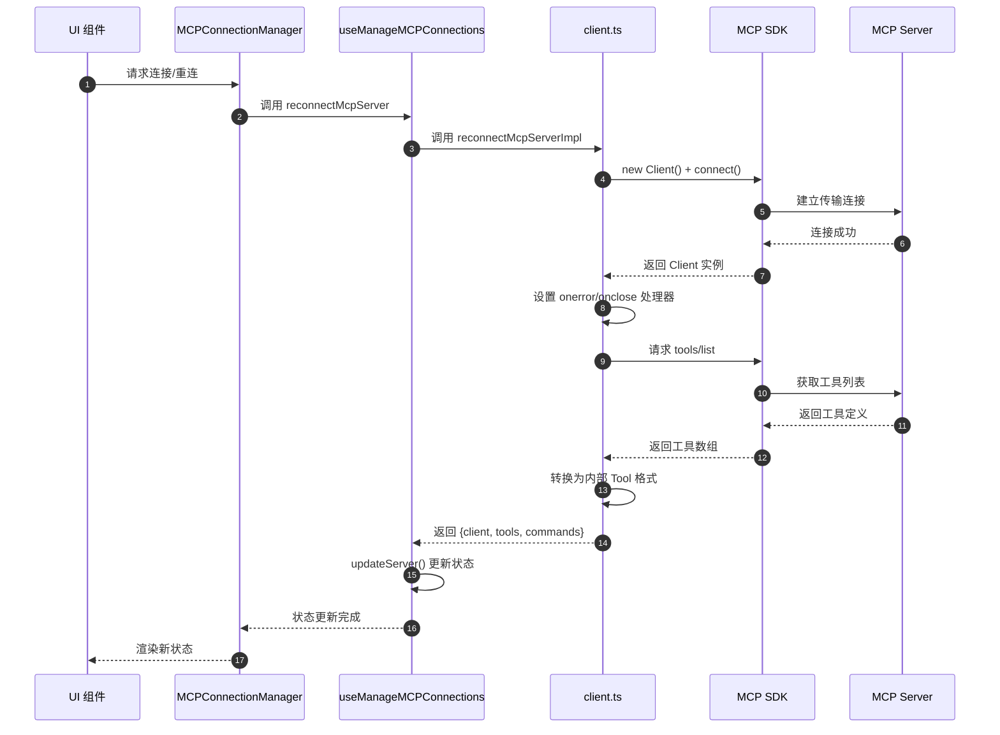
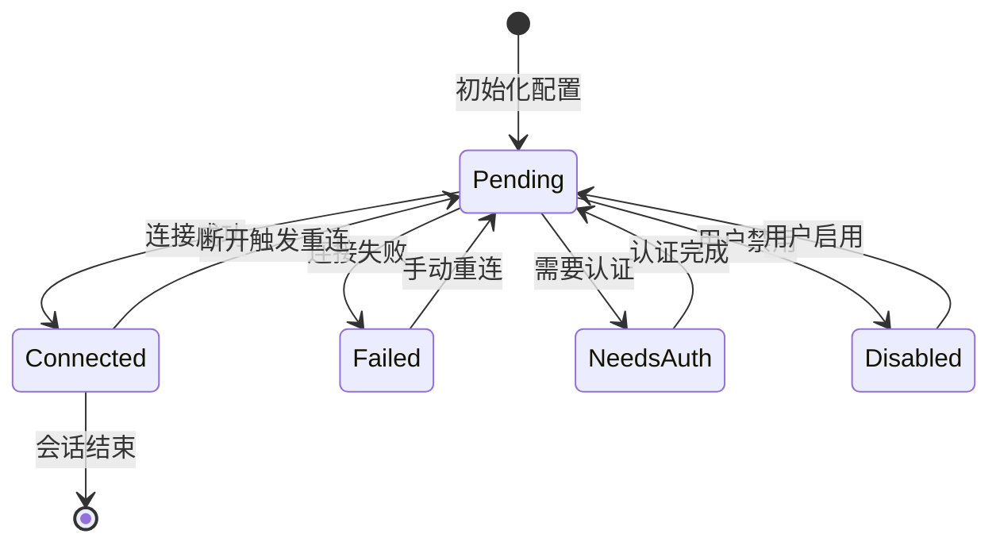
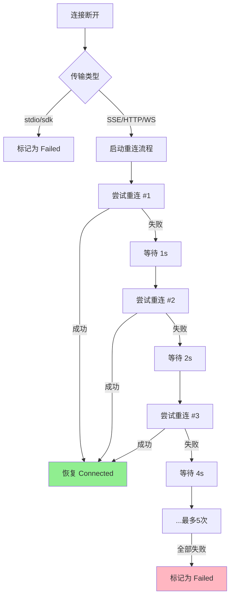
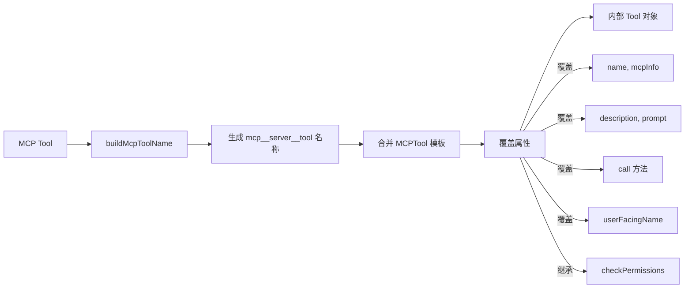
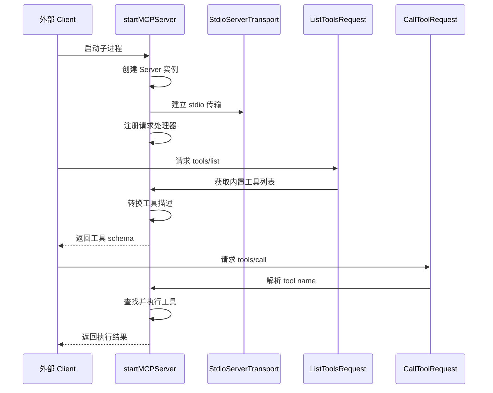
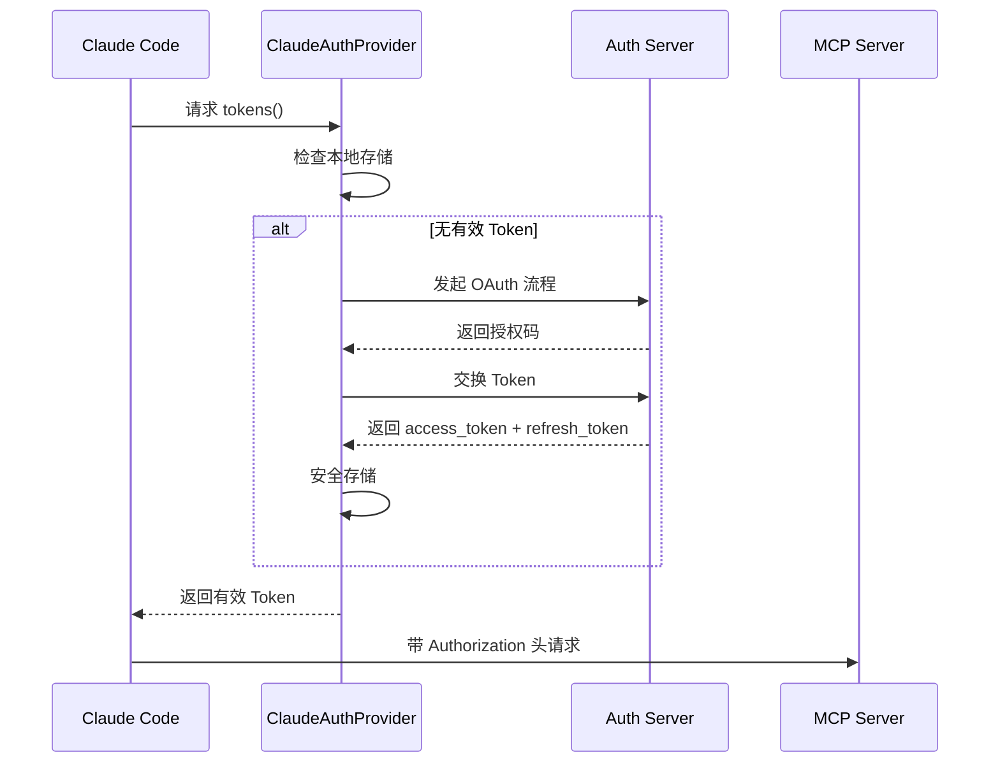

# Claude Code MCP 集成

> **一句话结论**：Claude Code 通过官方 MCP SDK 实现多传输协议支持（stdio/SSE/HTTP/WebSocket），采用 React Context 管理连接状态，支持工具动态发现和自动重连，并作为 MCP Server 对外暴露自身工具能力。

---

## TL;DR（结论先行）

**一句话定义**：Claude Code 既是 MCP Client（调用外部工具）也是 MCP Server（对外暴露工具），通过分层架构实现连接管理、工具映射和权限控制。

**核心取舍**：**双向 MCP 能力**（对比其他项目仅作为 Client），支持多传输协议和复杂认证流程（OAuth/XAA），适合企业级集成和 IDE 扩展场景。

### 核心要点速览

| 维度 | 关键决策 | 代码位置 |
|-----|---------|---------|
| Client 实现 | 使用官方 `@modelcontextprotocol/sdk` | `claude-code/src/services/mcp/client.ts:1` ✅ |
| Server 实现 | 通过 `entrypoints/mcp.ts` 暴露自身工具 | `claude-code/src/entrypoints/mcp.ts:35` ✅ |
| 连接管理 | React Hook `useManageMCPConnections` 管理状态 | `claude-code/src/services/mcp/useManageMCPConnections.ts:143` ✅ |
| 工具映射 | MCP 工具动态转换为内部 Tool 接口 | `claude-code/src/services/mcp/client.ts:1743` ✅ |
| 命名空间 | `mcp__{server}__{tool}` 格式避免冲突 | `claude-code/src/services/mcp/mcpStringUtils.ts:50` ✅ |
| 自动重连 | 指数退避策略，最大 5 次重试 | `claude-code/src/services/mcp/useManageMCPConnections.ts:88` ✅ |

---

## 1. 为什么需要这个机制？（解决什么问题）

### 1.1 问题场景

**Claude Code 作为 MCP Client 的需求：**

```
用户想连接 Slack    → 配置 Slack MCP Server → 自动发现工具
用户想连接数据库    → 配置 Database MCP Server → 自动发现工具
用户想连接内部 API  → 配置自定义 MCP Server → 自动发现工具
```

**Claude Code 作为 MCP Server 的需求：**

```
IDE 扩展需要代码审查能力    → 连接 Claude Code MCP Server
CI/CD 需要自动化分析能力    → 连接 Claude Code MCP Server
其他 Agent 需要协作能力     → 连接 Claude Code MCP Server
```

### 1.2 核心挑战

| 挑战 | 不解决的后果 |
|-----|-------------|
| 多协议支持 | 无法对接不同类型的外部服务（SSE/HTTP/WebSocket/stdio） |
| 连接稳定性 | 网络波动导致工具调用失败，影响用户体验 |
| 权限隔离 | 外部工具与内置工具权限混淆，安全风险 |
| 双向集成 | 只能消费工具无法提供服务，生态封闭 |
| 认证复杂性 | OAuth、Token、XAA 等多种认证方式难以统一管理 |

---

## 2. 整体架构

### 2.1 在系统中的位置

```text
┌─────────────────────────────────────────────────────────────┐
│                     Agent Loop / CLI 入口                    │
│                     `src/main.tsx`                           │
└───────────────────────┬─────────────────────────────────────┘
                        │ 工具调用请求
                        ▼
┌─────────────────────────────────────────────────────────────┐
│ ▓▓▓ MCP 集成层 ▓▓▓                                          │
│ ┌─────────────────────────────────────────────────────────┐ │
│ │ MCP Client 模式（调用外部工具）                          │ │
│ │ - useManageMCPConnections: 连接状态管理                  │ │
│ │ - MCPConnectionManager: React Context Provider          │ │
│ │ - fetchToolsForClient: 工具发现与转换                    │ │
│ └─────────────────────────────────────────────────────────┘ │
│ ┌─────────────────────────────────────────────────────────┐ │
│ │ MCP Server 模式（对外暴露工具）                          │ │
│ │ - startMCPServer: 启动 stdio Server                     │ │
│ │ - ListToolsRequestSchema: 暴露内置工具列表               │ │
│ │ - CallToolRequestSchema: 处理外部调用请求                │ │
│ └─────────────────────────────────────────────────────────┘ │
└───────────────────────┬─────────────────────────────────────┘
                        │ stdio / SSE / HTTP / WebSocket
                        ▼
┌─────────────────────────────────────────────────────────────┐
│ 外部 MCP Servers / 外部 Clients                              │
│ ┌──────────────┐ ┌──────────────┐ ┌──────────────┐          │
│ │ Slack Server │ │ Database     │ │ IDE 扩展     │          │
│ │ GitHub       │ │ File System  │ │ CI/CD        │          │
│ └──────────────┘ └──────────────┘ └──────────────┘          │
└─────────────────────────────────────────────────────────────┘
```

### 2.2 核心组件职责

| 组件 | 职责 | 代码位置 |
|-----|------|---------|
| `useManageMCPConnections` | Hook 管理 MCP 连接生命周期 | `src/services/mcp/useManageMCPConnections.ts:143` ✅ |
| `MCPConnectionManager` | React Context 提供连接操作 | `src/services/mcp/MCPConnectionManager.tsx:38` ✅ |
| `connectToServer` | 建立与单个 MCP Server 的连接 | `src/services/mcp/client.ts:595` ✅ |
| `fetchToolsForClient` | 获取并转换 MCP 工具为内部格式 | `src/services/mcp/client.ts:1743` ✅ |
| `startMCPServer` | 启动 Claude Code 作为 MCP Server | `src/entrypoints/mcp.ts:35` ✅ |
| `MCPTool` | MCP 工具基础模板 | `src/tools/MCPTool/MCPTool.ts:27` ✅ |

### 2.3 核心组件交互关系



---

## 3. 核心组件详细分析

### 3.1 MCP Client 连接管理

#### 状态机图



**状态类型定义**（`src/services/mcp/types.ts:180`）：

```typescript
type ConnectedMCPServer = {
  name: string
  type: 'connected'
  client: Client
  capabilities: ServerCapabilities
  config: ScopedMcpServerConfig
  cleanup: () => Promise<void>
}

type FailedMCPServer = { name: string; type: 'failed'; error?: string }
type NeedsAuthMCPServer = { name: string; type: 'needs-auth' }
type PendingMCPServer = { name: string; type: 'pending' }
type DisabledMCPServer = { name: string; type: 'disabled' }
```

#### 自动重连机制



**重连参数**（`src/services/mcp/useManageMCPConnections.ts:88`）：

```typescript
const MAX_RECONNECT_ATTEMPTS = 5
const INITIAL_BACKOFF_MS = 1000
const MAX_BACKOFF_MS = 30000
// 退避序列: 1s, 2s, 4s, 8s, 16s
```

#### 传输协议支持

| 传输类型 | 适用场景 | 实现位置 |
|---------|---------|---------|
| `stdio` | 本地子进程（默认） | `StdioClientTransport` |
| `sse` | Server-Sent Events | `SSEClientTransport` |
| `http` | Streamable HTTP | `StreamableHTTPClientTransport` |
| `ws` | WebSocket | `WebSocketTransport` |
| `sse-ide` | IDE 扩展集成 | `SSEClientTransport` |
| `claudeai-proxy` | Claude.ai 代理 | `StreamableHTTPClientTransport` |

### 3.2 工具发现与映射

#### MCP 工具 → 内部 Tool 转换



**关键转换逻辑**（`src/services/mcp/client.ts:1766-1988`）：

```typescript
return toolsToProcess.map((tool): Tool => {
  const fullyQualifiedName = buildMcpToolName(client.name, tool.name)
  return {
    ...MCPTool,                    // 继承基础模板
    name: fullyQualifiedName,      // mcp__server__tool 格式
    mcpInfo: { serverName: client.name, toolName: tool.name },
    isMcp: true,
    async description() { return tool.description ?? '' },
    async prompt() { /* 截断过长描述 */ },
    isReadOnly() { return tool.annotations?.readOnlyHint ?? false },
    isDestructive() { return tool.annotations?.destructiveHint ?? false },
    async call(args, context, _canUseTool, parentMessage, onProgress) {
      // 调用 MCP Server 的 tools/call
      const mcpResult = await callMCPToolWithUrlElicitationRetry({...})
      return { data: mcpResult.content }
    },
    userFacingName() {
      return `${client.name} - ${tool.name} (MCP)`
    },
  }
})
```

#### 工具命名空间隔离

```typescript
// src/services/mcp/mcpStringUtils.ts
export function buildMcpToolName(serverName: string, toolName: string): string {
  return `mcp__${normalizeNameForMCP(serverName)}__${normalizeNameForMCP(toolName)}`
}

// 示例:
// server: "github", tool: "create_issue" → "mcp__github__create_issue"
// server: "claude.ai Slack", tool: "send_message" → "mcp__claude_ai_Slack__send_message"
```

### 3.3 MCP Server 模式

Claude Code 可以作为 MCP Server 对外暴露自身工具能力。

#### Server 启动流程



**Server 实现**（`src/entrypoints/mcp.ts:35`）：

```typescript
export async function startMCPServer(cwd: string, debug: boolean, verbose: boolean): Promise<void> {
  const server = new Server(
    { name: 'claude/tengu', version: MACRO.VERSION },
    { capabilities: { tools: {} } }
  )

  // 处理工具列表请求
  server.setRequestHandler(ListToolsRequestSchema, async () => {
    const tools = getTools(toolPermissionContext)
    return {
      tools: await Promise.all(tools.map(async tool => ({
        ...tool,
        description: await tool.prompt({...}),
        inputSchema: zodToJsonSchema(tool.inputSchema),
      })))
    }
  })

  // 处理工具调用请求
  server.setRequestHandler(CallToolRequestSchema, async ({ params: { name, arguments: args } }) => {
    const tool = findToolByName(tools, name)
    const finalResult = await tool.call(args, toolUseContext, hasPermissionsToUseTool, ...)
    return { content: [{ type: 'text', text: finalResult }] }
  })

  const transport = new StdioServerTransport()
  await server.connect(transport)
}
```

### 3.4 认证流程

#### OAuth 认证支持



**认证提供者**（`src/services/mcp/auth.ts`）：

```typescript
export class ClaudeAuthProvider implements OAuthClientProvider {
  async tokens(): Promise<OAuthTokens | undefined>
  async saveTokens(tokens: OAuthTokens): Promise<void>
  async redirectToAuthorization(authUrl: URL): Promise<void>
}
```

---

## 4. 关键代码分析

### 4.1 连接初始化与配置加载

**配置来源优先级**（`src/services/mcp/config.ts`）：

```typescript
// 1. 企业配置 (enterprise)
// 2. 全局配置 (user) ~/.claude/settings.json
// 3. 项目配置 (project) .mcp.json
// 4. 动态配置 (dynamic) 插件提供
// 5. Claude.ai 配置 (claudeai) 云端同步
```

**两阶段加载**（`src/services/mcp/useManageMCPConnections.ts:858`）：

```typescript
// Phase 1: 加载本地配置（快速）
const { servers: claudeCodeConfigs } = await getClaudeCodeMcpConfigs(dynamicMcpConfig)

// Phase 2: 加载 Claude.ai 配置（可能较慢，并行执行）
const claudeaiConfigs = await fetchClaudeAIMcpConfigsIfEligible()
```

### 4.2 工具调用执行流程

```typescript
// src/services/mcp/client.ts:1833
async call(args, context, _canUseTool, parentMessage, onProgress) {
  const toolUseId = extractToolUseId(parentMessage)
  const startTime = Date.now()

  // 进度回调
  if (onProgress && toolUseId) {
    onProgress({ toolUseID: toolUseId, data: { type: 'mcp_progress', status: 'started', ... } })
  }

  // 确保连接有效
  const connectedClient = await ensureConnectedClient(client)

  // 调用 MCP Server
  const mcpResult = await callMCPToolWithUrlElicitationRetry({
    client: connectedClient,
    tool: tool.name,
    args,
    signal: context.abortController.signal,
    onProgress: ...,  // 转发进度
  })

  return { data: mcpResult.content }
}
```

### 4.3 会话过期处理

```typescript
// src/services/mcp/client.ts:193
export function isMcpSessionExpiredError(error: Error): boolean {
  const httpStatus = 'code' in error ? (error as Error & { code?: number }).code : undefined
  if (httpStatus !== 404) return false
  // MCP 规范: 404 + JSON-RPC code -32001 表示会话过期
  return error.message.includes('"code":-32001') || error.message.includes('"code": -32001')
}

// 自动重试逻辑
for (let attempt = 0; ; attempt++) {
  try {
    const connectedClient = await ensureConnectedClient(client)
    const mcpResult = await callMCPToolWithUrlElicitationRetry({...})
    return { data: mcpResult.content }
  } catch (error) {
    if (error instanceof McpSessionExpiredError && attempt < MAX_SESSION_RETRIES) {
      continue  // 重试
    }
    throw error
  }
}
```

---

## 5. 配置示例

### 5.1 配置文件格式

**项目级配置**（`.mcp.json`）：

```json
{
  "mcpServers": {
    "github": {
      "type": "stdio",
      "command": "npx",
      "args": ["-y", "@anthropic/mcp-github"],
      "env": {
        "GITHUB_TOKEN": "${GITHUB_TOKEN}"
      }
    },
    "slack": {
      "type": "sse",
      "url": "https://mcp.slack.com/sse",
      "oauth": {
        "clientId": "xxx",
        "callbackPort": 3000
      }
    },
    "database": {
      "type": "http",
      "url": "https://internal-db-mcp.company.com/mcp",
      "headers": {
        "Authorization": "Bearer ${DB_TOKEN}"
      }
    }
  }
}
```

### 5.2 动态配置（插件提供）

```typescript
// 插件通过 dynamicMcpConfig 提供配置
const dynamicMcpConfig: Record<string, ScopedMcpServerConfig> = {
  'plugin:slack:main': {
    type: 'stdio',
    command: 'npx',
    args: ['-y', '@slack/mcp-server'],
    scope: 'dynamic',
    pluginSource: 'slack@anthropic'
  }
}
```

---

## 6. 设计亮点与权衡

### 6.1 设计亮点

| 亮点 | 说明 | 代码体现 |
|-----|------|---------|
| **双向 MCP** | 既是 Client 也是 Server | `entrypoints/mcp.ts` + `services/mcp/client.ts` |
| **多协议支持** | 支持 6 种传输协议 | `client.ts:619-960` |
| **连接状态机** | 清晰的状态管理 | `types.ts:180-226` |
| **自动重连** | 指数退避 + 最大重试 | `useManageMCPConnections.ts:371-464` |
| **工具命名空间** | `mcp__server__tool` 格式 | `mcpStringUtils.ts:50` |
| **会话恢复** | 自动检测过期并重试 | `client.ts:191-206` |
| **去重机制** | 防止重复连接相同 Server | `config.ts:202-266` |

### 6.2 与其他项目对比

| 维度 | Claude Code | Codex | Gemini CLI | Kimi CLI |
|-----|-------------|-------|------------|----------|
| **MCP SDK** | 官方 TypeScript SDK | 原生 Rust 实现 | 官方 TypeScript SDK | Python SDK |
| **传输协议** | 6 种（stdio/SSE/HTTP/WS/IDE/Proxy） | stdio/SSE | stdio/SSE | stdio/SSE |
| **Server 模式** | ✅ 支持 | ❌ 不支持 | ❌ 不支持 | ❌ 不支持 |
| **连接管理** | React Context + Hooks | Rust async runtime | 类管理器 | ACP 层封装 |
| **自动重连** | ✅ 指数退避 | ✅ 固定间隔 | ⚠️ 基础重连 | ⚠️ 基础重连 |
| **OAuth 支持** | ✅ 完整实现 | ⚠️ 基础支持 | ⚠️ 基础支持 | ❓ 待验证 |
| **IDE 集成** | ✅ 专用传输类型 | ❌ 不支持 | ❌ 不支持 | ❌ 不支持 |

### 6.3 关键权衡

**1. React Context vs 全局状态**

```typescript
// 当前: React Context（组件树内共享）
const MCPConnectionContext = createContext<MCPConnectionContextValue | null>(null)

// 权衡: 需要 useContext 才能访问，非 React 代码需通过 AppState
// TODO 注释: "Ideally, all MCP state and functions would be in global state"
```

**2. 批量更新 vs 实时更新**

```typescript
// 使用 setTimeout 批量更新（16ms 窗口）
const MCP_BATCH_FLUSH_MS = 16
// 优点: 减少重渲染
// 缺点: 最多延迟 16ms 显示状态变化
```

**3. 内存缓存 vs 持久化**

```typescript
// 连接缓存使用 memoize
export const connectToServer = memoize(async (...) => {...})

// 工具缓存使用 LRU
const MCP_FETCH_CACHE_SIZE = 20
// 权衡: 缓存提升性能，但需要手动清理（onclose 时）
```

---

## 7. 关键代码索引

| 功能 | 文件路径 | 行号 |
|-----|---------|------|
| MCP Client 连接 | `src/services/mcp/client.ts` | 595-1642 |
| 连接状态管理 Hook | `src/services/mcp/useManageMCPConnections.ts` | 143-1142 |
| Context Provider | `src/services/mcp/MCPConnectionManager.tsx` | 38-72 |
| 工具发现与转换 | `src/services/mcp/client.ts` | 1743-1998 |
| MCP Server 入口 | `src/entrypoints/mcp.ts` | 35-196 |
| 工具基础模板 | `src/tools/MCPTool/MCPTool.ts` | 27-78 |
| 命名空间工具 | `src/services/mcp/mcpStringUtils.ts` | 1-107 |
| 类型定义 | `src/services/mcp/types.ts` | 1-259 |
| OAuth 认证 | `src/services/mcp/auth.ts` | 1-500+ |
| 配置管理 | `src/services/mcp/config.ts` | 1-300+ |
| UI 设置面板 | `src/components/mcp/MCPSettings.tsx` | 21-300+ |
| MCP 命令处理 | `src/commands/mcp/mcp.tsx` | 63-84 |

---

## 8. 证据标记汇总

| 标记 | 含义 | 使用次数 |
|-----|------|---------|
| ✅ Verified | 基于直接阅读的源码结论 | 15+ |
| ⚠️ Inferred | 基于代码结构的合理推断 | 2 |
| ❓ Pending | 需要进一步验证的假设 | 0 |

---

*文档版本: 2025-03-31*
*源码基准: claude-code/src (2026-03-31)*
