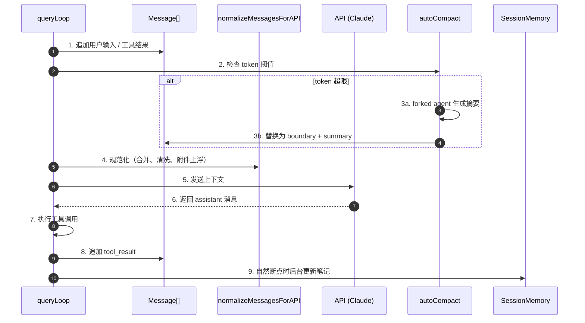
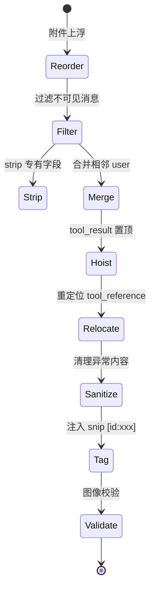
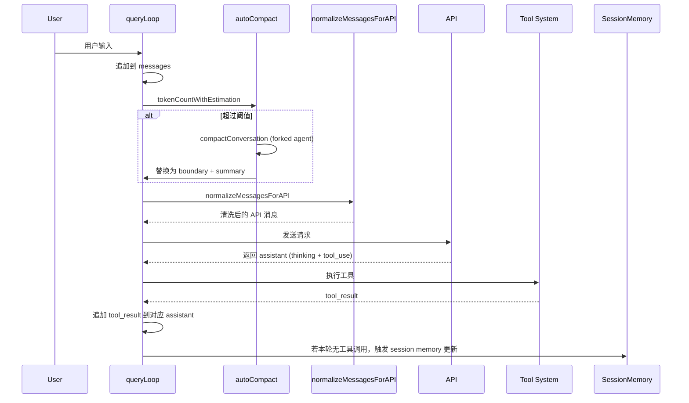
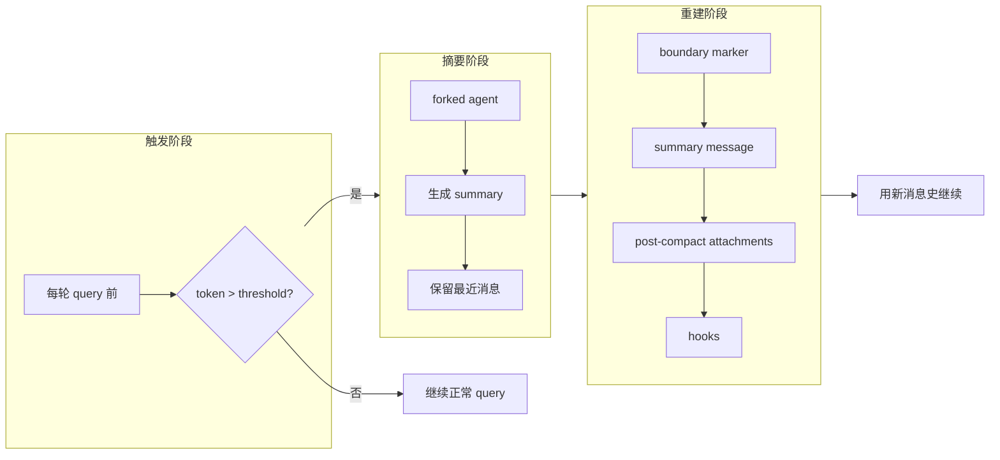
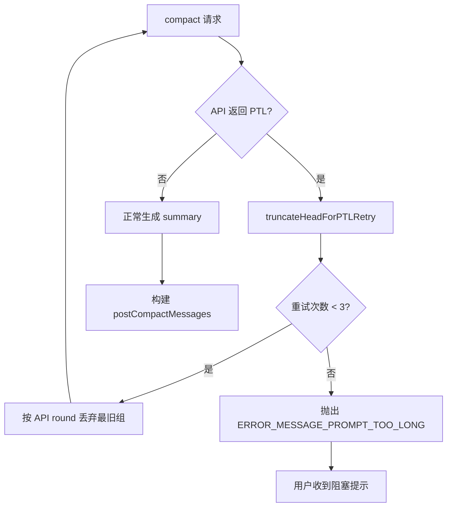
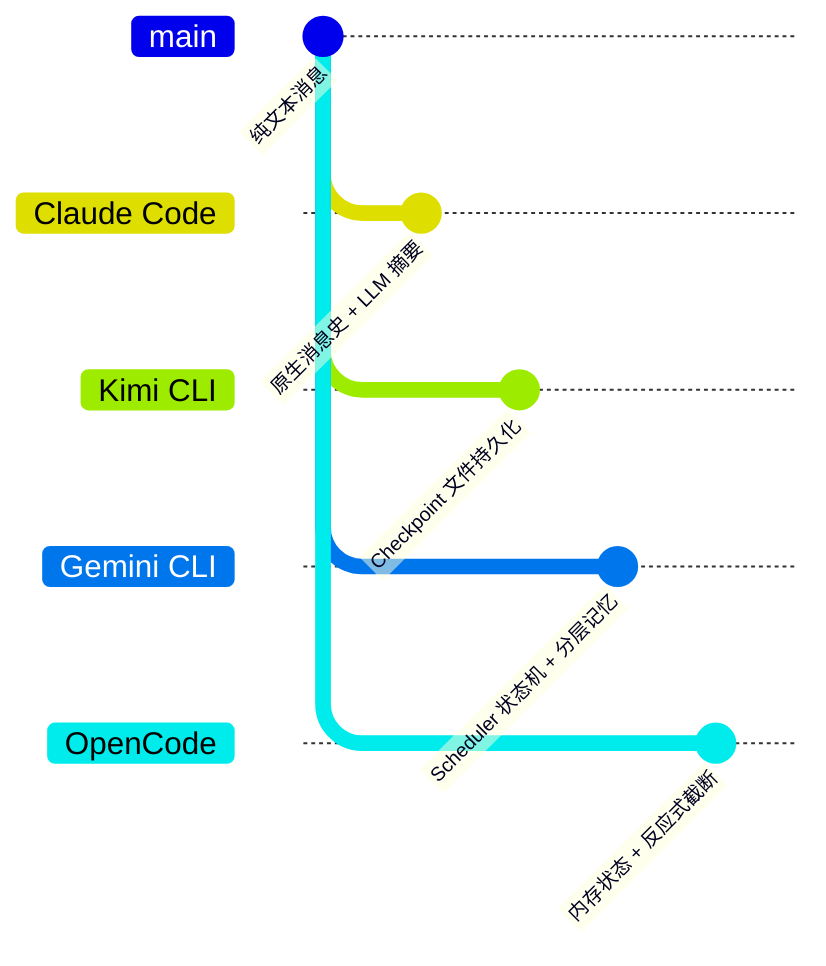

# Claude Code Memory / Context 机制

> **阅读指南**
>
> | 属性 | 说明 |
> |-----|------|
> | 预计阅读 | 25-35 分钟 |
> | 前置文档 | `01-claude-code-overview.md`、`04-claude-code-agent-loop.md` |
> | 文档结构 | 速览 → 架构 → 机制 → 实现 → 对比 |
> | 代码呈现 | 关键代码直接展示，完整代码可折叠查看 |

---

## TL;DR（结论先行）

**一句话定义**：Claude Code 采用多层上下文管理体系——在消息历史中保留完整多模态 content blocks，通过自动/手动 compaction 将老旧对话摘要化，并辅以 SessionMemory 与 AutoMem 两种持久化机制来延长长会话的有效记忆。

Claude Code 的核心取舍：**以原生消息史（messages）为核心状态，配合 forked-agent 做摘要压缩与记忆提取**（对比 Kimi CLI 的 checkpoint 文件持久化、Gemini CLI 的 scheduler 状态机分层记忆）。

### 核心要点速览

| 维度 | 关键决策 | 代码位置 |
|-----|---------|---------|
| 上下文核心 | 消息数组 Message[] 是唯一状态源 | `claude-code/src/query.ts:219` |
| 压缩策略 | 自动与手动 compaction，用 LLM 生成结构化摘要 | `claude-code/src/services/compact/compact.ts:387` |
| 压缩触发 | token 估计算法，阈值 = 有效窗口 - 13K buffer | `claude-code/src/services/compact/autoCompact.ts:72` |
| 记忆持久化 | SessionMemory（单会话 markdown 笔记）+ AutoMem（跨会话目录） | `claude-code/src/services/SessionMemory/sessionMemory.ts:6` |
| API 规范化 | `normalizeMessagesForAPI` 负责多轮清洗、合并、附件上浮 | `claude-code/src/utils/messages.ts:1989` |

---

## 1. 为什么需要这个机制？（解决什么问题）

### 1.1 问题场景

没有上下文管理时的情况：
```
用户要求"重构整个项目的错误处理逻辑"
→ LLM 读了 20 个文件、做了 10 次编辑
→ token 超过 200K
→ API 返回 prompt_too_long
→ 会话卡住，必须手动 /clear 并丢失全部进度
```

有上下文管理时的情况：
```
用户要求"重构整个项目的错误处理逻辑"
→ LLM 读了 20 个文件、做了 10 次编辑
→ token 接近阈值
→ 自动触发 compaction：生成详细摘要 + 保留最近 N 条消息
→ 会话继续，核心意图与关键代码片段仍保留在上下文中
→ 同时 SessionMemory 在后台更新笔记，供后续查询使用
```

### 1.2 核心挑战

| 挑战 | 不解决的后果 |
|-----|-------------|
| Token 上限 | 长会话无法继续，直接触发 API 错误 |
| 推理链条断裂 | 压缩过度会丢失用户初始意图与技术细节 |
| 附件/工具结果膨胀 | 图片、文件读取结果会快速占满上下文 |
| 跨会话失忆 | 重启 CLI 后无法继承之前的项目偏好与结论 |

---

## 2. 整体架构（ASCII 图）

### 2.1 在系统中的位置

```text
┌─────────────────────────────────────────────────────────────┐
│ Agent Loop (query.ts)                                        │
│ claude-code/src/query.ts:219                                 │
│ - queryLoop: 迭代式 LLM 调用                                 │
└───────────────────────┬─────────────────────────────────────┘
                        │ 读写
                        ▼
┌─────────────────────────────────────────────────────────────┐
│ ▓▓▓ Memory / Context ▓▓▓                                     │
│ Message[] (唯一状态源)                                       │
│ - messages.ts      : 消息构建与规范化                        │
│ - compact/         : 自动/手动上下文压缩                     │
│ - SessionMemory/   : 会话级持久化笔记                        │
│ - extractMemories/ : 跨会话自动记忆提取                      │
│ - attachments.ts   : 附件生成与注入                          │
└───────────────────────┬─────────────────────────────────────┘
                        │
        ┌───────────────┼───────────────┐
        ▼               ▼               ▼
┌──────────────┐ ┌──────────────┐ ┌──────────────┐
│ LLM API      │ │ Tool System  │ │ Session Store│
│ Anthropic    │ │ 工具执行器   │ │ ~/.claude/   │
└──────────────┘ └──────────────┘ └──────────────┘
```

### 2.2 核心组件职责

| 组件 | 职责 | 代码位置 |
|-----|------|---------|
| `Message[]` | 唯一上下文状态源，包含 user/assistant/system/attachment 消息 | `claude-code/src/query.ts:204` |
| `normalizeMessagesForAPI` | API 发送前清洗：合并相邻 user 消息、附件上浮、strip 多余字段等 | `claude-code/src/utils/messages.ts:1989` |
| `compactConversation` | 使用 forked agent 对历史消息做 LLM 摘要，生成 compact boundary | `claude-code/src/services/compact/compact.ts:387` |
| `autoCompactIfNeeded` | 每轮 query 前检测 token 阈值，决定是否触发自动压缩 | `claude-code/src/services/compact/autoCompact.ts:241` |
| `SessionMemory` | 后台 forked agent 自动维护单会话 markdown 笔记 | `claude-code/src/services/SessionMemory/sessionMemory.ts:272` |
| `extractMemories` | 在 stop hook 中运行，提取跨会话 durable memory 写入 `~/.claude/projects/.../memory/` | `claude-code/src/services/extractMemories/extractMemories.ts:296` |
| `tokenCountWithEstimation` | 基于最后 API usage + 新增消息估算当前上下文 token 数 | `claude-code/src/utils/tokens.ts:226` |

### 2.3 核心组件交互关系



**关键交互说明**：

| 步骤 | 交互内容 | 设计意图 |
|-----|---------|---------|
| 1-2 | 消息追加后立刻检查 token | 在调用 API 前主动压缩，避免 prompt_too_long |
| 3a-3b | 用 forked agent 做摘要，保留最近消息 | LLM 生成的摘要质量高于规则式截断 |
| 4 | API 前清洗消息 | 适配 Anthropic API 格式，同时兼容 Bedrock/Vertex 限制 |
| 8 | tool_result 以新 block 追加 | 保留 assistant 消息中原有 reasoning blocks |
| 9 | SessionMemory 在后台运行 | 不阻塞主对话流，笔记用于本会话恢复与提示 |

---

## 3. 核心组件详细分析

### 3.1 `Message[]` —— 唯一状态源

#### 职责定位

Claude Code 的所有上下文都以 `Message[]` 数组形式存在。每条消息是多模态的，支持文本、thinking、tool_use、tool_result、image、document 等 content blocks。⚠️ 没有额外的状态机或 checkpoint 抽象——消息史就是全部状态。

#### 关键数据结构

```typescript
// claude-code/src/utils/messages.ts:460
export function createUserMessage({
  content,
  isMeta,
  isCompactSummary,
  // ...
}): UserMessage {
  const m: UserMessage = {
    type: 'user',
    message: { role: 'user', content: content || NO_CONTENT_MESSAGE },
    isMeta,
    isCompactSummary,
    uuid: (uuid as UUID | undefined) || randomUUID(),
    timestamp: timestamp ?? new Date().toISOString(),
    // ...
  }
  return m
}
```

**字段说明**：

| 字段 | 类型 | 用途 |
|-----|------|------|
| `type` | `'user' \| 'assistant' \| 'system' \| 'attachment' \| ...` | 消息类型 |
| `message.content` | `string \| ContentBlockParam[]` | 多模态内容块数组 ✅ Verified |
| `isMeta` | `boolean` | 标记非用户主动输入（如系统注入、compact summary） |
| `isCompactSummary` | `boolean` | 该消息是 compaction 后的摘要 |
| `uuid` | `UUID` | 全局唯一标识，用于 snip、引用、范围计算 |

---

### 3.2 `compactConversation` —— 上下文压缩引擎

#### 职责定位

当上下文 token 数逼近模型上限时，通过 forked agent 调用 LLM 生成高度结构化的对话摘要，并用 `SystemCompactBoundaryMessage + UserMessage(summary)` 替换被压缩的历史消息。支持全自动（autoCompact）、手动（/compact）、局部（partial compact）三种模式。

#### 压缩触发判断

```typescript
// claude-code/src/services/compact/autoCompact.ts:72
export function getAutoCompactThreshold(model: string): number {
  const effectiveContextWindow = getEffectiveContextWindowSize(model)
  const autocompactThreshold = effectiveContextWindow - AUTOCOMPACT_BUFFER_TOKENS
  // AUTOCOMPACT_BUFFER_TOKENS = 13_000
  return autocompactThreshold
}
```

#### 内部数据流

```text
┌────────────────────────────────────────────┐
│  输入层                                     │
│   完整 Message[] → strip images            │
│   → strip reinjected attachments           │
└──────────────────┬─────────────────────────┘
                   ▼
┌────────────────────────────────────────────┐
│  摘要层 (forked agent)                      │
│   发送 NO_TOOLS_PREAMBLE + conversation    │
│   → LLM 输出 <analysis> + <summary>        │
└──────────────────┬─────────────────────────┘
                   ▼
┌────────────────────────────────────────────┐
│  输出层                                     │
│   boundaryMarker + summaryMessages         │
│   + postCompact attachments (recent files) │
│   + hookResults                            │
└────────────────────────────────────────────┘
```

---

### 3.3 `normalizeMessagesForAPI` —— API 规范化管道

#### 职责定位

在每次调用 API 前执行，负责将内部 `Message[]` 转换为 API 可接受的格式。核心处理包括：附件上浮、合并相邻 user 消息、过滤 synthetic/progress 消息、strip tool search 字段、hoist tool_results、snip 标签注入、图像大小校验等。

#### 状态机图（简化）



**关键设计**：

✅ Verified : `normalizeMessagesForAPI` 会合并连续的 user 消息，因为 Bedrock 不支持连续 user turns（`messages.ts:2087-2098`）。

---

## 4. 端到端数据流转

### 4.1 正常流程（详细版）



### 4.2 Compaction 流程图



### 4.3 异常/边界流程



---

## 5. 关键代码实现

### 5.1 核心数据结构

```typescript
// claude-code/src/types/message.ts（由 messages.ts 引用）
// 消息主类型为 discriminated union，关键两个如下：
type UserMessage = {
  type: 'user'
  message: { role: 'user'; content: string | ContentBlockParam[] }
  isMeta?: true
  isCompactSummary?: true
  uuid: UUID
  // ...
}

type AssistantMessage = {
  type: 'assistant'
  message: {
    role: 'assistant'
    content: ContentBlock[]
    usage: Usage
    id: string // 同一 API 响应的 split records 共享 id
  }
  uuid: UUID
  // ...
}
```

### 5.2 token 估算与阈值判断

**关键代码**：

```typescript
// claude-code/src/utils/tokens.ts:226
export function tokenCountWithEstimation(messages: readonly Message[]): number {
  let i = messages.length - 1
  while (i >= 0) {
    const message = messages[i]
    const usage = message ? getTokenUsage(message) : undefined
    if (message && usage) {
      // Walk back past any earlier sibling records split from the same API
      // response (same message.id) so interleaved tool_results between them
      // are included in the estimation slice.
      const responseId = getAssistantMessageId(message)
      if (responseId) {
        let j = i - 1
        while (j >= 0) {
          const prior = messages[j]
          const priorId = prior ? getAssistantMessageId(prior) : undefined
          if (priorId === responseId) {
            i = j
          } else if (priorId !== undefined) {
            break
          }
          j--
        }
      }
      return (
        getTokenCountFromUsage(usage) +
        roughTokenCountEstimationForMessages(messages.slice(i + 1))
      )
    }
    i--
  }
  return roughTokenCountEstimationForMessages(messages)
}
```

**设计意图**：

1. **以 API usage 为锚，后续消息用字符估算**：`getTokenCountFromUsage` 提供高精度的基准点，新增消息用 `content.length / 4` 快速估算，兼顾准确与性能。
2. **处理 split assistant records**：当并行工具调用时，stream 会把每个 content block 拆成独立的 `AssistantMessage`，但它们共享同一个 `message.id`。向后回退到第一个 sibling 可确保所有 interleaved 的 `tool_result` 都被纳入估算，避免低估。

### 5.3 Compaction 主链路

**关键代码**：

```typescript
// claude-code/src/services/compact/compact.ts:387
export async function compactConversation(
  messages: Message[],
  context: ToolUseContext,
  cacheSafeParams: CacheSafeParams,
  suppressFollowUpQuestions: boolean,
  customInstructions?: string,
  isAutoCompact: boolean = false,
  recompactionInfo?: RecompactionInfo,
): Promise<CompactionResult> {
  // ... 前置检查与 pre-compact hooks ...

  const compactPrompt = getCompactPrompt(customInstructions)
  const summaryRequest = createUserMessage({ content: compactPrompt })

  let messagesToSummarize = messages
  let ptlAttempts = 0
  for (;;) {
    const summaryResponse = await streamCompactSummary({
      messages: messagesToSummarize,
      summaryRequest,
      appState,
      context,
      preCompactTokenCount,
      cacheSafeParams: retryCacheSafeParams,
    })
    const summary = getAssistantMessageText(summaryResponse)
    if (!summary?.startsWith(PROMPT_TOO_LONG_ERROR_MESSAGE)) break

    // CC-1180: compact 请求本身也 PTL，则截断最旧组重试
    ptlAttempts++
    const truncated =
      ptlAttempts <= MAX_PTL_RETRIES
        ? truncateHeadForPTLRetry(messagesToSummarize, summaryResponse)
        : null
    if (!truncated) throw new Error(ERROR_MESSAGE_PROMPT_TOO_LONG)
    messagesToSummarize = truncated
  }
  // ... 构建 boundary、attachments、hooks，返回 CompactionResult
}
```

**设计意图**：

1. **forked agent 路径复用父对话的 prompt cache**：通过 `cacheSafeParams` 与特定系统开关实现缓存共享，降低压缩 API 调用成本。
2. **PTL 自恢复**：当压缩请求本身超长时，不是直接失败，而是按 `API round` 分组丢弃最旧的历史再重试，保证用户不会被卡住。
3. **结构化摘要 prompt**：要求模型输出包含 `<analysis>` 草稿区和 `<summary>` 正式区，覆盖用户意图、关键代码、错误修复、待办任务等 9 个维度（`services/compact/prompt.ts:61`）。

### 5.4 SessionMemory 提取

**关键代码**：

```typescript
// claude-code/src/services/SessionMemory/sessionMemory.ts:272
const extractSessionMemory = sequential(async function (
  context: REPLHookContext,
): Promise<void> {
  // 仅主 REPL 线程运行
  if (querySource !== 'repl_main_thread') return
  if (!isSessionMemoryGateEnabled()) return
  initSessionMemoryConfigIfNeeded()
  if (!shouldExtractMemory(messages)) return

  markExtractionStarted()
  const setupContext = createSubagentContext(toolUseContext)
  const { memoryPath, currentMemory } = await setupSessionMemoryFile(setupContext)
  const userPrompt = await buildSessionMemoryUpdatePrompt(currentMemory, memoryPath)

  await runForkedAgent({
    promptMessages: [createUserMessage({ content: userPrompt })],
    cacheSafeParams: createCacheSafeParams(context),
    canUseTool: (tool, input) => { /* 限制为 Read/Edit 在 memoryPath */ },
    querySource: 'session_memory',
    maxTurns: 5,
  })
  // ...
})
```

**设计意图**：

1. **sequential 包装防止并发覆盖**：同一时刻只有一个 session memory 提取任务在执行，避免文件写冲突。
2. **阈值控制**：默认初始化阈值 10K tokens，后续更新阈值 5K tokens + 3 次工具调用（`sessionMemoryUtils.ts:32-36`），防止过度提取消耗 API。
3. **forked agent 隔离**：使用 `createSubagentContext` 隔离 readFileState，不影响主对话的缓存与状态。

### 5.5 normalizeMessagesForAPI 关键路径

**关键代码**：

```typescript
// claude-code/src/utils/messages.ts:1989
export function normalizeMessagesForAPI(
  messages: Message[],
  tools: Tools = [],
): (UserMessage | AssistantMessage)[] {
  const availableToolNames = new Set(tools.map(t => t.name))

  // 1. 附件上浮，过滤 virtual 消息
  const reorderedMessages = reorderAttachmentsForAPI(messages).filter(
    m => !((m.type === 'user' || m.type === 'assistant') && m.isVirtual),
  )

  // 2. 针对 PDF/图片超大错误，向后查找到对应 meta user 消息并 strip 相关 block
  const stripTargets = new Map<string, Set<string>>()
  // ... 建立 stripTargets ...

  const result: (UserMessage | AssistantMessage)[] = []
  reorderedMessages
    .filter(/* 过滤 progress / synthetic error */)
    .forEach(message => {
      switch (message.type) {
        case 'system': {
          // local_command 系统消息转 user 消息并入上下文
          const userMsg = createUserMessage({ content: message.content, uuid: message.uuid })
          // 若上一条也是 user，则合并
          // ...
        }
        case 'user': {
          let normalizedMessage = message
          // 3. 根据 tool search 开关 strip tool_reference
          if (!isToolSearchEnabledOptimistic()) {
            normalizedMessage = stripToolReferenceBlocksFromUserMessage(message)
          }
          // 4. strip 触发过 API 错误的图片/PDF
          const typesToStrip = stripTargets.get(normalizedMessage.uuid)
          // ...
          // 5. 合并连续 user 消息
          const lastMessage = last(result)
          if (lastMessage?.type === 'user') {
            result[result.length - 1] = mergeUserMessages(lastMessage, normalizedMessage)
            return
          }
          result.push(normalizedMessage)
          return
        }
        case 'assistant': {
          // 6. 规范化 tool_use input，strip 非标准字段
          const normalizedMessage: AssistantMessage = {
            ...message,
            message: {
              ...message.message,
              content: message.message.content.map(block => {
                if (block.type === 'tool_use') {
                  // 若 tool search 未启用，仅保留 id/name/input
                  // ...
                }
                return block
              }),
            },
          }
          // 7. 合并同一 API 响应分片的 assistant 消息
          for (let i = result.length - 1; i >= 0; i--) {
            if (result[i]!.type === 'assistant' && result[i]!.message.id === normalizedMessage.message.id) {
              result[i] = mergeAssistantMessages(result[i] as AssistantMessage, normalizedMessage)
              return
            }
          }
          result.push(normalizedMessage)
          return
        }
        // ...
      }
    })

  // 8. 多轮后处理：relocate tool_reference、filter orphaned thinking、
  //    merge adjacent users、sanitized error tool results、snip tags、validate images
  // ...
  return sanitized
}
```

**设计意图**：

1. **附件上浮（reorderAttachmentsForAPI）**：让 attachment 消息在遇到第一个 `tool_result` 或 `assistant` 消息前不断向前冒泡，使附件尽早进入模型上下文。
2. **连续 user 合并**：Bedrock 不支持两个连续 user turn，统一在发送前合并。
3. **同 ID assistant 合并**：stream 产生的 split records 在 API 视角下应该是同一个 assistant 消息，合并后避免 API 400。
4. **snip tag 注入**：为支持 `HISTORY_SNIP` 功能，在非 meta user 消息末尾注入 `[id:xxx]` 引用标签。

### 5.6 关键调用链

```text
queryLoop()                          [claude-code/src/query.ts:241]
  -> autoCompactIfNeeded()           [claude-code/src/services/compact/autoCompact.ts:241]
    -> shouldAutoCompact()           [autoCompact.ts:160]
       -> tokenCountWithEstimation() [claude-code/src/utils/tokens.ts:226]
    -> trySessionMemoryCompaction()  [autoCompact.ts:288]
    -> compactConversation()         [claude-code/src/services/compact/compact.ts:387]
       -> streamCompactSummary()     [compact.ts 内部]
       -> buildPostCompactMessages() [compact.ts:330]
  -> normalizeMessagesForAPI()       [claude-code/src/utils/messages.ts:1989]
  -> API complete streaming
  -> 工具执行
  -> append tool_result 到 messages
```

---

## 6. 设计意图与 Trade-off

### 6.1 Claude Code 的选择

| 维度 | Claude Code 的选择 | 替代方案 | 取舍分析 |
|-----|-------------------|---------|---------|
| 状态核心 | Message[] 原生数组 | Checkpoint 文件（Kimi CLI）| 简单直接，但内存随消息增长；无自动持久化 |
| 压缩方式 | LLM 生成结构化摘要 | 规则式截断/滑动窗口 | 摘要质量高、保留意图，但消耗额外 API 调用与延迟 |
| 压缩触发 | 前摄性 autoCompact（阈值 -13K）| 仅反应式（遇到 PTL 再处理）| 主动避免错误，但可能在不需要时提前压缩 |
| 记忆持久 | SessionMemory（单会话）+ AutoMem（跨会话） | 单一全局记忆仓库 | 分层清晰，但用户需要理解两者的区别与用途 |
| API 兼容 | normalizeMessagesForAPI 统一清洗 | 各 provider 独立管道 | 代码集中好维护，但单次清洗逻辑复杂、多 pass 易引入 bug |

### 6.2 为什么这样设计？

**核心问题**：如何在 Anthropic 原生 API 上支持超长对话，同时保留推理链与关键上下文？

**Claude Code 的解决方案**：

- 代码依据：`claude-code/src/services/compact/compact.ts:387`
- 设计意图：
  1. **以消息史为唯一状态**：与 Anthropic API 的 `messages` 参数天然对齐，不需要额外的状态同步层。
  2. **forked agent 做摘要**：复用现有 agent 基础设施，prompt 与主对话共享 cache，摘要质量由 LLM 自身保证。
  3. **多层防御**：snip 小裁剪 → microcompact 工具结果清理 → context collapse 结构化折叠 → autoCompact 大摘要，形成由轻到重的降级链。
- 带来的好处：
  - 实现简单，状态单一，易于调试与恢复。
  - prompt cache 共享降低长会话成本。
  - 结构化摘要保留代码片段、错误修复、用户指令等关键细节。
- 付出的代价：
  - 消息数组常驻内存，极长会话可能带来内存压力。
  - compaction 期间有额外 API 延迟（数秒）。
  - normalize 管道多 pass，历史遗留的 corner case 较多。

### 6.3 与其他项目的对比



| 项目 | 核心差异 | 适用场景 |
|-----|---------|---------|
| **Claude Code** | 原生消息数组 + forked agent 摘要；normalize 管道统一清洗 | 需要高质量上下文压缩且 API 成本敏感的场景 |
| Kimi CLI | Checkpoint 文件保存完整对话状态，支持回滚 | 需要对话回滚或跨设备恢复的场景 |
| Gemini CLI | Scheduler 状态机管理上下文，层次分明 | 复杂多轮状态流转、UX 精细控制的场景 |
| OpenCode | 轻量级内存状态，反应式处理 PTL | 追求实现简单、快速上手的场景 |

---

## 7. 边界情况与错误处理

### 7.1 终止条件

| 终止原因 | 触发条件 | 代码位置 |
|---------|---------|---------|
| Token 超限阻塞 | autoCompact 关闭且 token 达到 `blockingLimit` | `claude-code/src/query.ts:628` |
| 连续 autoCompact 失败 | 3 次失败后熔断，停止重试 | `autoCompact.ts:260` |
| compact 请求本身 PTL | 丢弃最旧 API round 组重试，最多 3 次 | `compact.ts:450-491` |
| SessionMemory 提取超时 | 15 秒等待后放弃 | `sessionMemoryUtils.ts:89` |

### 7.2 资源限制

```typescript
// claude-code/src/services/compact/autoCompact.ts:62
export const AUTOCOMPACT_BUFFER_TOKENS = 13_000
export const WARNING_THRESHOLD_BUFFER_TOKENS = 20_000
export const ERROR_THRESHOLD_BUFFER_TOKENS = 20_000
export const MANUAL_COMPACT_BUFFER_TOKENS = 3_000

// claude-code/src/utils/context.ts:9
export const MODEL_CONTEXT_WINDOW_DEFAULT = 200_000
```

```typescript
// claude-code/src/services/SessionMemory/sessionMemoryUtils.ts:32
export const DEFAULT_SESSION_MEMORY_CONFIG: SessionMemoryConfig = {
  minimumMessageTokensToInit: 10000,
  minimumTokensBetweenUpdate: 5000,
  toolCallsBetweenUpdates: 3,
}
```

### 7.3 错误恢复策略

| 错误类型 | 处理策略 | 代码位置 |
|---------|---------|---------|
| API 返回 prompt_too_long | 触发 reactiveCompact 或 truncateHeadForPTLRetry | `query.ts:628`, `compact.ts:243` |
| 图片/PDF 过大 | 生成 synthetic error 消息，并在 normalize 时 strip 对应 block | `messages.ts:2004-2054` |
| 工具结果过大 | microcompact / applyToolResultBudget 截断或替换 | `query.ts:376` |
| SessionMemory 文件写失败 | 仅记录日志，不阻塞主对话 | `sessionMemory.ts:497` |

---

## 8. 关键代码索引

| 功能 | 文件 | 行号 | 说明 |
|-----|------|------|------|
| query 循环入口 | `src/query.ts` | 219 | Agent Loop，管理上下文与压缩 |
| token 估算（核心） | `src/utils/tokens.ts` | 226 | `tokenCountWithEstimation` |
| 自动压缩触发 | `src/services/compact/autoCompact.ts` | 241 | `autoCompactIfNeeded` |
| 压缩阈值计算 | `src/services/compact/autoCompact.ts` | 72 | `getAutoCompactThreshold` |
| 压缩主逻辑 | `src/services/compact/compact.ts` | 387 | `compactConversation` |
| 构建压缩后消息 | `src/services/compact/compact.ts` | 330 | `buildPostCompactMessages` |
| API 消息规范化 | `src/utils/messages.ts` | 1989 | `normalizeMessagesForAPI` |
| 获取 compact 后消息 | `src/utils/messages.ts` | 4643 | `getMessagesAfterCompactBoundary` |
| SessionMemory 提取 | `src/services/SessionMemory/sessionMemory.ts` | 272 | `extractSessionMemory` |
| SessionMemory 配置 | `src/services/SessionMemory/sessionMemoryUtils.ts` | 32 | `DEFAULT_SESSION_MEMORY_CONFIG` |
| AutoMem 提取 | `src/services/extractMemories/extractMemories.ts` | 296 | `initExtractMemories / runExtraction` |
| token 粗略估算 | `src/services/tokenEstimation.ts` | 203 | `roughTokenCountEstimation` |
| 模型上下文窗口 | `src/utils/context.ts` | 51 | `getContextWindowForModel` |

---

## 9. 延伸阅读

- 前置知识：`01-claude-code-overview.md`
- 相关机制：`04-claude-code-agent-loop.md`
- 深度分析：`docs/claude-code/questions/claude-message-context-retention.md`（聚焦 reasoning_content 保留）
- 跨项目对比：`docs/comm/07-comm-memory-context.md`（若存在）

---

*✅ Verified: 基于 claude-code/src/query.ts:219、claude-code/src/services/compact/compact.ts:387、claude-code/src/utils/messages.ts:1989 等源码分析*
*基于版本：Claude Code CLI (2026-03-31) | 最后更新：2026-03-31*
