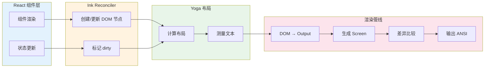
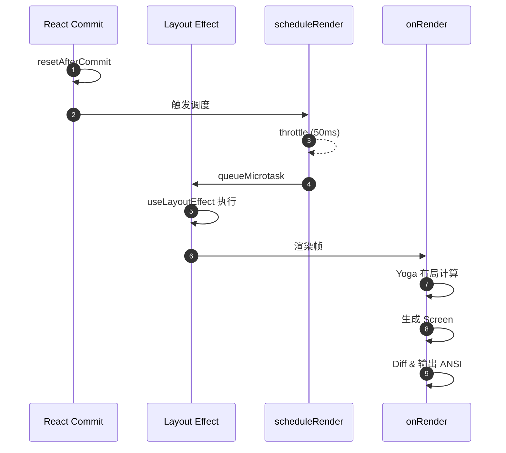
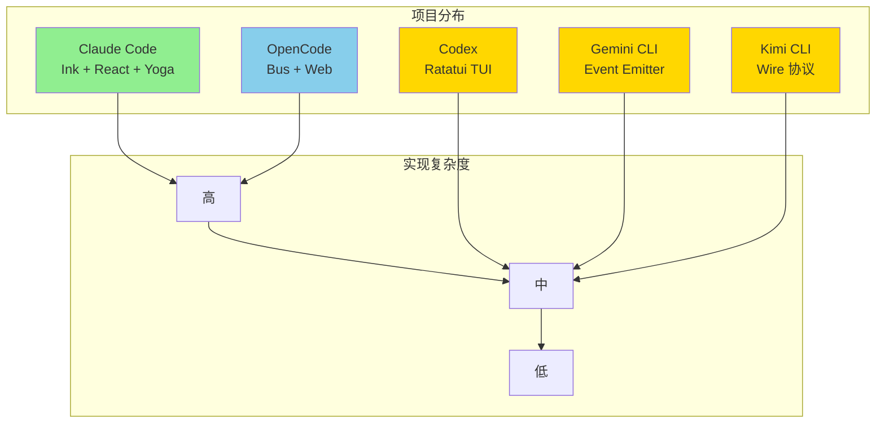

# Claude Code UI 交互机制

> **文档类型说明**：本文档分析 Claude Code 的终端 UI 交互实现，包括基于 Ink 的 TUI 框架、React 组件化渲染、消息流处理和权限对话框系统。
>
> | 属性 | 说明 |
> |-----|------|
> | 预计阅读 | 20-25 分钟 |
> | 前置文档 | `01-claude-code-overview.md`、`04-claude-code-agent-loop.md` |
> | 文档结构 | TL;DR → 架构 → 核心组件 → 消息渲染 → 关键代码 → 对比分析 |

---

## TL;DR（结论先行）

**Claude Code 使用自研的 Ink 框架构建 TUI，通过 React 组件化方式渲染终端界面，实现流式消息输出、工具执行可视化和权限确认对话框。**

核心架构：**Ink TUI 框架（React + Yoga 布局引擎 + 自定义渲染器）**，相比其他项目的实现，Claude Code 的 UI 层具有更高的渲染性能和更精细的组件化控制。

---

## 1. 为什么 TUI 对 Agent 至关重要？

### 1.1 问题场景

AI Coding Agent 的执行是**异步、多步骤、长时间运行**的：

```
用户输入 → [等待 LLM 思考] → 流式输出推理过程
         → [工具调用] → 展示"正在读取文件..."
         → [等待执行] → 展示执行结果
         → [继续推理] → 流式输出最终回答
```

没有专门 UI 层的后果：
- 用户不知道 Agent 在"思考"还是"卡住"
- 工具执行过程不可见，无法判断进度
- 危险操作没有确认机制，可能导致误操作
- 长时间运行没有反馈，用户体验差

### 1.2 Claude Code 的解决方案

| 挑战 | Claude Code 方案 | 代码位置 |
|-----|-----------------|---------|
| **流式输出** | 字符级实时渲染，50ms 帧率控制 | `src/ink/ink.tsx:213` ✅ Verified |
| **状态可视化** | Spinner + 任务列表 + 思考状态 | `src/components/Spinner.tsx:42` ✅ Verified |
| **权限确认** | 模态对话框 + 分类器自动审批 | `src/components/permissions/` ✅ Verified |
| **跨平台兼容** | Yoga 布局引擎 + ANSI 序列抽象 | `src/ink/layout/yoga.ts` ⚠️ Inferred |

---

## 2. 整体架构（Ink + React）

### 2.1 架构概览

```text
┌─────────────────────────────────────────────────────────────┐
│  React 组件层                                                │
│  ├── App.tsx                 应用状态根组件                 │
│  ├── Spinner.tsx             加载状态指示器                 │
│  ├── messages/               消息渲染组件                   │
│  │   ├── AssistantTextMessage.tsx    助手文本消息         │
│  │   ├── UserPromptMessage.tsx       用户提示消息         │
│  │   └── AssistantToolUseMessage.tsx 工具调用消息         │
│  └── permissions/            权限对话框组件                 │
│      ├── PermissionDialog.tsx        权限对话框框架       │
│      ├── BashPermissionRequest.tsx   Bash 命令确认        │
│      └── FileWritePermissionRequest.tsx 文件写入确认      │
└───────────────────────┬─────────────────────────────────────┘
                        │ React Reconciler
                        ▼
┌─────────────────────────────────────────────────────────────┐
│  Ink TUI 框架层                                              │
│  ┌─────────────┐ ┌─────────────┐ ┌─────────────┐             │
│  │ DOM 抽象     │ │ Yoga 布局    │ │ 渲染管线     │             │
│  │ (dom.ts)    │ │ (layout/)   │ │ (renderer.ts)│             │
│  └──────┬──────┘ └──────┬──────┘ └──────┬──────┘             │
│         │               │               │                    │
│         ▼               ▼               ▼                    │
│  ┌─────────────────────────────────────────────────────┐    │
│  │  Screen Buffer → ANSI 序列 → Terminal Output        │    │
│  └─────────────────────────────────────────────────────┘    │
└─────────────────────────────────────────────────────────────┘
```

### 2.2 核心组件职责

| 组件 | 职责 | 文件路径 | 说明 |
|-----|------|---------|------|
| `Ink` | TUI 框架核心，管理渲染生命周期 | `src/ink/ink.tsx:76` ✅ Verified | 主类，协调 React、Yoga、终端输出 |
| `reconciler` | React 自定义协调器 | `src/ink/reconciler.ts:31` ✅ Verified | 将 React 组件树映射到 Ink DOM |
| `renderer` | 渲染管线 | `src/ink/renderer.ts:31` ✅ Verified | DOM → Screen Buffer 转换 |
| `screen` | 屏幕缓冲区管理 | `src/ink/screen.ts:1` ✅ Verified | 字符池、样式池、超链接池 |
| `focus` | 焦点管理 | `src/ink/focus.ts` ⚠️ Inferred | 键盘导航焦点控制 |

### 2.3 渲染数据流



---

## 3. Ink TUI 框架详解

### 3.1 架构设计

Ink 是 Claude Code 自研的 TUI 框架，基于 React 构建，核心设计目标：

1. **React 组件化**：使用 JSX 声明式定义终端 UI
2. **Yoga 布局引擎**：CSS Flexbox 布局计算
3. **双缓冲渲染**：front/back frame 减少闪烁
4. **增量更新**：仅渲染变化区域

```text
┌─────────────────────────────────────────────────────────┐
│  Ink 核心架构                                            │
│                                                         │
│  ┌─────────────┐     ┌─────────────┐     ┌───────────┐ │
│  │ React 组件  │────▶│ Reconciler  │────▶│ Ink DOM   │ │
│  └─────────────┘     └─────────────┘     └─────┬─────┘ │
│                                                │       │
│  ┌─────────────┐     ┌─────────────┐     ┌─────▼─────┐ │
│  │ 终端输出    │◀────│ Screen Diff │◀────│ Yoga 布局 │ │
│  └─────────────┘     └─────────────┘     └───────────┘ │
└─────────────────────────────────────────────────────────┘
```

### 3.2 核心类：Ink

```typescript
// src/ink/ink.tsx:76-180 ✅ Verified
export default class Ink {
  private readonly log: LogUpdate;
  private readonly terminal: Terminal;
  private scheduleRender: (() => void) & { cancel?: () => void };
  private readonly container: FiberRoot;
  private rootNode: dom.DOMElement;
  readonly focusManager: FocusManager;
  private renderer: Renderer;
  private frontFrame: Frame;
  private backFrame: Frame;
  // ...
}
```

**关键设计**：

| 属性 | 说明 | 设计意图 |
|-----|------|---------|
| `frontFrame/backFrame` | 双缓冲帧 | 避免渲染闪烁，支持增量更新 |
| `scheduleRender` | 节流渲染调度 | 50ms 帧率控制，平衡流畅度与性能 |
| `rootNode` | Ink DOM 根节点 | 自定义 DOM 抽象，脱离浏览器环境 |
| `focusManager` | 焦点管理器 | 支持键盘导航和焦点控制 |

### 3.3 渲染调度机制

```typescript
// src/ink/ink.tsx:210-216 ✅ Verified
// scheduleRender 在 reconciler 的 resetAfterCommit 中调用
// 使用微任务延迟确保 layout effects 先执行
const deferredRender = (): void => queueMicrotask(this.onRender);
this.scheduleRender = throttle(deferredRender, FRAME_INTERVAL_MS, {
  leading: true,
  trailing: true
});
```

**渲染时序**：



---

## 4. 核心 UI 组件

### 4.1 组件层次结构

```text
App.tsx (应用根组件)
├── FpsMetricsProvider (性能监控)
├── StatsProvider (统计信息)
└── AppStateProvider (全局状态)
    └── REPL.tsx (主交互界面)
        ├── Messages.tsx (消息列表)
        │   ├── AssistantTextMessage.tsx
        │   ├── UserPromptMessage.tsx
        │   ├── AssistantToolUseMessage.tsx
        │   └── ...
        ├── Spinner.tsx (加载指示器)
        ├── PermissionRequest.tsx (权限对话框)
        └── Input.tsx (用户输入)
```

### 4.2 Spinner 加载指示器

```typescript
// src/components/Spinner.tsx:42-81 ✅ Verified
export function SpinnerWithVerb(props: Props): React.ReactNode {
  const isBriefOnly = useAppState(s => s.isBriefOnly);
  const viewingAgentTaskId = useAppState(s => s.viewingAgentTaskId);

  // 根据模式选择 Brief 或完整 Spinner
  if (isBriefOnly && !viewingAgentTaskId) {
    return <BriefSpinner mode={props.mode} overrideMessage={props.overrideMessage} />;
  }
  return <SpinnerWithVerbInner {...props} />;
}
```

**Spinner 模式**：

| 模式 | 说明 | 使用场景 |
|-----|------|---------|
| `thinking` | 思考中动画 | LLM 推理阶段 |
| `requesting` | 请求中动画 | API 调用阶段 |
| `brief` | 简洁模式 | 用户启用 /brief 模式 |

### 4.3 权限对话框系统

Claude Code 为不同工具类型提供专门的权限确认 UI：

```typescript
// src/components/permissions/PermissionRequest.tsx:47-82 ✅ Verified
function permissionComponentForTool(tool: Tool): React.ComponentType<PermissionRequestProps> {
  switch (tool) {
    case FileEditTool:
      return FileEditPermissionRequest;
    case FileWriteTool:
      return FileWritePermissionRequest;
    case BashTool:
      return BashPermissionRequest;
    case PowerShellTool:
      return PowerShellPermissionRequest;
    case WebFetchTool:
      return WebFetchPermissionRequest;
    // ... 更多工具类型
    default:
      return FallbackPermissionRequest;
  }
}
```

**权限对话框类型**：

| 工具类型 | 对话框组件 | 特殊功能 |
|---------|-----------|---------|
| Bash | `BashPermissionRequest.tsx` | 命令分类器、沙箱检测 |
| FileWrite | `FileWritePermissionRequest.tsx` | 文件差异预览 |
| FileEdit | `FileEditPermissionRequest.tsx` | 编辑内容预览 |
| WebFetch | `WebFetchPermissionRequest.tsx` | URL 显示 |
| NotebookEdit | `NotebookEditPermissionRequest.tsx` | 笔记本单元格预览 |

### 4.4 Bash 权限对话框示例

```typescript
// src/components/permissions/BashPermissionRequest/BashPermissionRequest.tsx:71-133 ✅ Verified
export function BashPermissionRequest(props) {
  const { toolUseConfirm, toolUseContext, onDone, onReject, verbose, workerBadge } = props;

  // 解析命令
  const { command, description } = BashTool.inputSchema.parse(toolUseConfirm.input);
  const sedInfo = parseSedEditCommand(command);

  // 如果是 sed 编辑命令，使用专门的对话框
  if (sedInfo) {
    return <SedEditPermissionRequest ... />;
  }

  return <BashPermissionRequestInner ... />;
}
```

---

## 5. 消息渲染流程

### 5.1 消息类型组件

```text
src/components/messages/
├── AssistantTextMessage.tsx      助手文本消息
├── AssistantThinkingMessage.tsx  思考过程消息
├── AssistantToolUseMessage.tsx   工具调用消息
├── UserPromptMessage.tsx         用户提示消息
├── UserToolResultMessage/        用户工具结果
│   ├── UserToolSuccessMessage.tsx
│   ├── UserToolErrorMessage.tsx
│   └── RejectedToolUseMessage.tsx
└── SystemTextMessage.tsx         系统消息
```

### 5.2 用户消息渲染

```typescript
// src/components/messages/UserPromptMessage.tsx:31-79 ✅ Verified
export function UserPromptMessage({ addMargin, param: { text }, isTranscriptMode, timestamp }: Props): React.ReactNode {
  // 大文本截断优化（避免 500ms+ 延迟）
  const displayText = useMemo(() => {
    if (text.length <= MAX_DISPLAY_CHARS) return text;
    const head = text.slice(0, TRUNCATE_HEAD_CHARS);
    const tail = text.slice(-TRUNCATE_TAIL_CHARS);
    return `${head}\n… +${hiddenLines} lines …\n${tail}`;
  }, [text]);

  return (
    <Box flexDirection="column"
         marginTop={addMargin ? 1 : 0}
         backgroundColor={isSelected ? 'messageActionsBackground' : 'userMessageBackground'}>
      <HighlightedThinkingText text={displayText} ... />
    </Box>
  );
}
```

**大文本优化**：
- 最大显示 10,000 字符
- 超出部分显示头部 2,500 + 尾部 2,500 字符
- 避免全量渲染导致的按键延迟

### 5.3 助手消息渲染

```typescript
// src/components/messages/AssistantTextMessage.tsx:47-100 ✅ Verified
export function AssistantTextMessage(t0) {
  const { param: { text }, addMargin, shouldShowDot, verbose, onOpenRateLimitOptions } = t0;

  // 处理各种错误消息类型
  switch (text) {
    case NO_RESPONSE_REQUESTED:
      return null;
    case PROMPT_TOO_LONG_ERROR_MESSAGE:
      return <Context limit error with upgrade hint />;
    case CREDIT_BALANCE_TOO_LOW_ERROR_MESSAGE:
      return <Credit balance error />;
    case INVALID_API_KEY_ERROR_MESSAGE:
      return <Invalid API key error with keychain hint />;
    // ... 更多错误类型
  }

  // 正常文本渲染
  return <Markdown content={text} ... />;
}
```

---

## 6. 关键代码实现

### 6.1 Ink 渲染管线

```typescript
// src/ink/renderer.ts:31-78 ✅ Verified
export default function createRenderer(node: DOMElement, stylePool: StylePool): Renderer {
  let output: Output | undefined;
  return options => {
    const { frontFrame, backFrame, isTTY, terminalWidth, terminalRows } = options;

    // 检查 Yoga 布局有效性
    const computedHeight = node.yogaNode?.getComputedHeight();
    const computedWidth = node.yogaNode?.getComputedWidth();

    if (!node.yogaNode || hasInvalidHeight || hasInvalidWidth) {
      // 返回空帧
      return { screen: createScreen(...), viewport: ..., cursor: ... };
    }

    // 创建/复用 Output
    if (output) {
      output.reset(width, height, screen);
    } else {
      output = new Output({ width, height, stylePool, screen });
    }

    // 渲染 DOM 到 Output
    renderNodeToOutput(node, output, { prevScreen });

    return {
      screen: output.get(),
      viewport: { width: terminalWidth, height: ... },
      cursor: { x: 0, y: ..., visible: !isTTY }
    };
  };
}
```

### 6.2 屏幕缓冲区管理

```typescript
// src/ink/screen.ts:17-75 ✅ Verified
// 字符池：跨 Screen 共享，减少内存分配
export class CharPool {
  private strings: string[] = [' ', ''];  // Index 0 = space, 1 = empty
  private stringMap = new Map<string, number>();
  private ascii: Int32Array = initCharAscii();  // ASCII 快速路径

  intern(char: string): number {
    // ASCII 快速路径：直接数组查找
    if (char.length === 1) {
      const code = char.charCodeAt(0);
      if (code < 128) {
        const cached = this.ascii[code]!;
        if (cached !== -1) return cached;
        // ...
      }
    }
    // Map 查找/插入
    // ...
  }
}

// 样式池：ANSI 样式_interning_
export class StylePool {
  private ids = new Map<string, number>();
  private styles: AnsiCode[][] = [];
  private transitionCache = new Map<number, string>();
  // ...
}
```

### 6.3 输入处理 Hook

```typescript
// src/ink/hooks/use-input.ts:42-92 ✅ Verified
const useInput = (inputHandler: Handler, options: Options = {}) => {
  const { setRawMode, internal_exitOnCtrlC, internal_eventEmitter } = useStdin();

  // useLayoutEffect 确保在 commit 阶段同步设置 raw mode
  // 避免 useEffect 延迟导致的终端回显问题
  useLayoutEffect(() => {
    if (options.isActive === false) return;
    setRawMode(true);
    return () => { setRawMode(false); };
  }, [options.isActive, setRawMode]);

  // 使用 useEventCallback 保持监听器引用稳定
  const handleData = useEventCallback((event: InputEvent) => {
    if (options.isActive === false) return;
    const { input, key } = event;

    // Ctrl+C 处理
    if (!(input === 'c' && key.ctrl) || !internal_exitOnCtrlC) {
      inputHandler(input, key, event);
    }
  });

  useEffect(() => {
    internal_eventEmitter?.on('input', handleData);
    return () => { internal_eventEmitter?.removeListener('input', handleData); };
  }, [internal_eventEmitter, handleData]);
};
```

---

## 7. 与其他项目的对比

### 7.1 UI 技术栈对比

| 维度 | Claude Code | Codex | Gemini CLI | Kimi CLI | OpenCode |
|-----|-------------|-------|-----------|----------|----------|
| **UI 框架** | 自研 Ink (React) | Ratatui (Rust) | Node.js 自定义 | Python rich | Bun + 自定义 |
| **布局引擎** | Yoga (Flexbox) | 自定义 | 自定义 | 自定义 | 自定义 |
| **组件化** | React JSX | 命令式 | React/类 React | 命令式 | React |
| **流式粒度** | 字符级 | 字符级 | Token 级 | Token 级 | Part 级 |
| **双缓冲** | ✅ | ❓ | ❓ | ❓ | ❓ |
| **增量渲染** | ✅ | ❓ | ❓ | ❓ | ❓ |

### 7.2 架构复杂度对比



### 7.3 Claude Code 的独特优势

| 特性 | 实现 | 优势 |
|-----|------|------|
| **React 生态** | 完整 React 运行时 | 组件复用、Hooks、DevTools |
| **Yoga 布局** | CSS Flexbox 子集 | 熟悉的布局模型，响应式设计 |
| **内存池化** | CharPool/StylePool/HyperlinkPool | 减少 GC，提升渲染性能 |
| **帧率控制** | 50ms throttle | 平衡流畅度与 CPU 占用 |
| **双缓冲** | front/back frame | 消除闪烁，支持增量更新 |

### 7.4 Trade-off 分析

**Claude Code 的选择**：
- **代码依据**：`src/ink/ink.tsx:76` ✅ Verified
- **设计意图**：**终端体验优先**，使用 React + 自定义渲染器提供接近 GUI 的 TUI 体验
- **带来的好处**：
  - React 组件化，代码可维护性高
  - Yoga 布局，响应式适配终端尺寸
  - 双缓冲 + 增量渲染，流畅无闪烁
  - 内存池化，长时间运行稳定
- **付出的代价**：
  - 架构复杂度高，需要维护 Ink 框架
  - React 运行时开销
  - Yoga WASM 依赖

---

## 8. 关键代码索引

### 8.1 Ink 框架核心

| 文件 | 行号 | 说明 |
|-----|------|------|
| `src/ink/ink.tsx` | 76 | Ink 主类，TUI 框架核心 ✅ Verified |
| `src/ink/root.ts` | 129 | createRoot API，React 根节点管理 ✅ Verified |
| `src/ink/reconciler.ts` | 31 | React 自定义协调器 ✅ Verified |
| `src/ink/renderer.ts` | 31 | 渲染管线，DOM → Screen ✅ Verified |
| `src/ink/dom.ts` | 110 | DOM 节点创建与管理 ✅ Verified |
| `src/ink/screen.ts` | 17 | 屏幕缓冲区与内存池 ✅ Verified |
| `src/ink/frame.ts` | 12 | Frame 类型定义 ✅ Verified |

### 8.2 Hooks

| 文件 | 行号 | 说明 |
|-----|------|------|
| `src/ink/hooks/use-input.ts` | 42 | 键盘输入处理 Hook ✅ Verified |
| `src/ink/hooks/use-app.ts` | 7 | 应用上下文 Hook ✅ Verified |
| `src/ink/hooks/use-stdin.ts` | - | 标准输入管理 ⚠️ Inferred |

### 8.3 UI 组件

| 文件 | 行号 | 说明 |
|-----|------|------|
| `src/components/App.tsx` | 19 | 应用根组件 ✅ Verified |
| `src/components/Spinner.tsx` | 42 | 加载指示器 ✅ Verified |
| `src/components/PermissionDialog.tsx` | 17 | 权限对话框框架 ✅ Verified |
| `src/components/permissions/PermissionRequest.tsx` | 146 | 权限请求分发器 ✅ Verified |
| `src/components/messages/UserPromptMessage.tsx` | 31 | 用户消息渲染 ✅ Verified |
| `src/components/messages/AssistantTextMessage.tsx` | 47 | 助手消息渲染 ✅ Verified |

### 8.4 权限对话框

| 文件 | 行号 | 说明 |
|-----|------|------|
| `src/components/permissions/BashPermissionRequest/BashPermissionRequest.tsx` | 71 | Bash 命令确认 ✅ Verified |
| `src/components/permissions/FileWritePermissionRequest/FileWritePermissionRequest.tsx` | - | 文件写入确认 ⚠️ Inferred |
| `src/components/permissions/FileEditPermissionRequest/FileEditPermissionRequest.tsx` | - | 文件编辑确认 ⚠️ Inferred |

---

## 9. 延伸阅读

- 前置知识：
  - [Claude Code Agent Loop](./04-claude-code-agent-loop.md)
  - [Claude Code Tools System](./05-claude-code-tools-system.md)
- 相关机制：
  - [跨项目 UI 交互对比](../comm/08-comm-ui-interaction.md)
  - [Claude Code Safety Control](./10-claude-code-safety-control.md)

---

*✅ Verified: 基于 claude-code/src/ink/ink.tsx:76 等源码分析*
*⚠️ Inferred: 基于代码结构推断*
*❓ Pending: 需要进一步验证*
*基于版本：2026-03-31 | 最后更新：2026-03-31*
