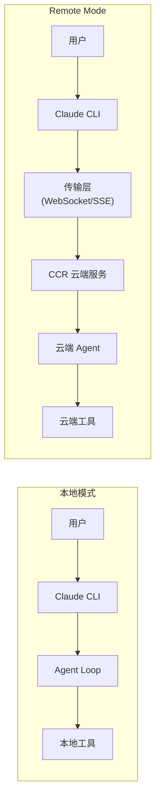
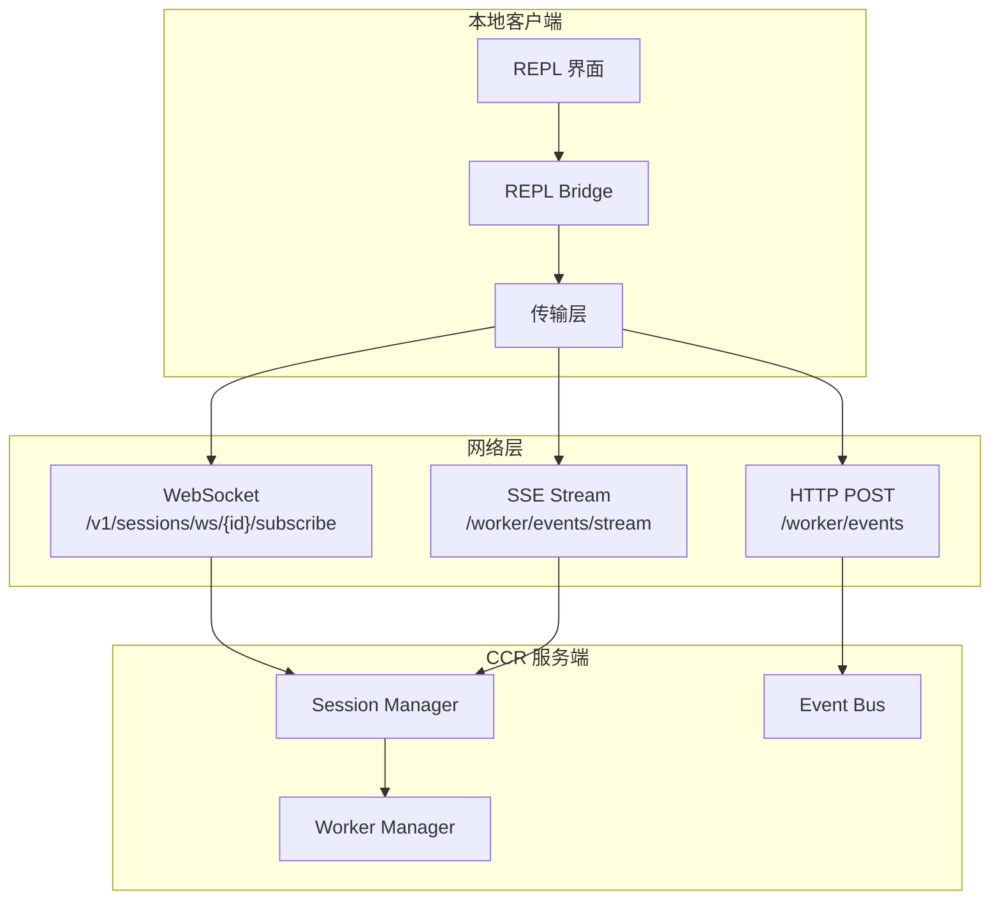
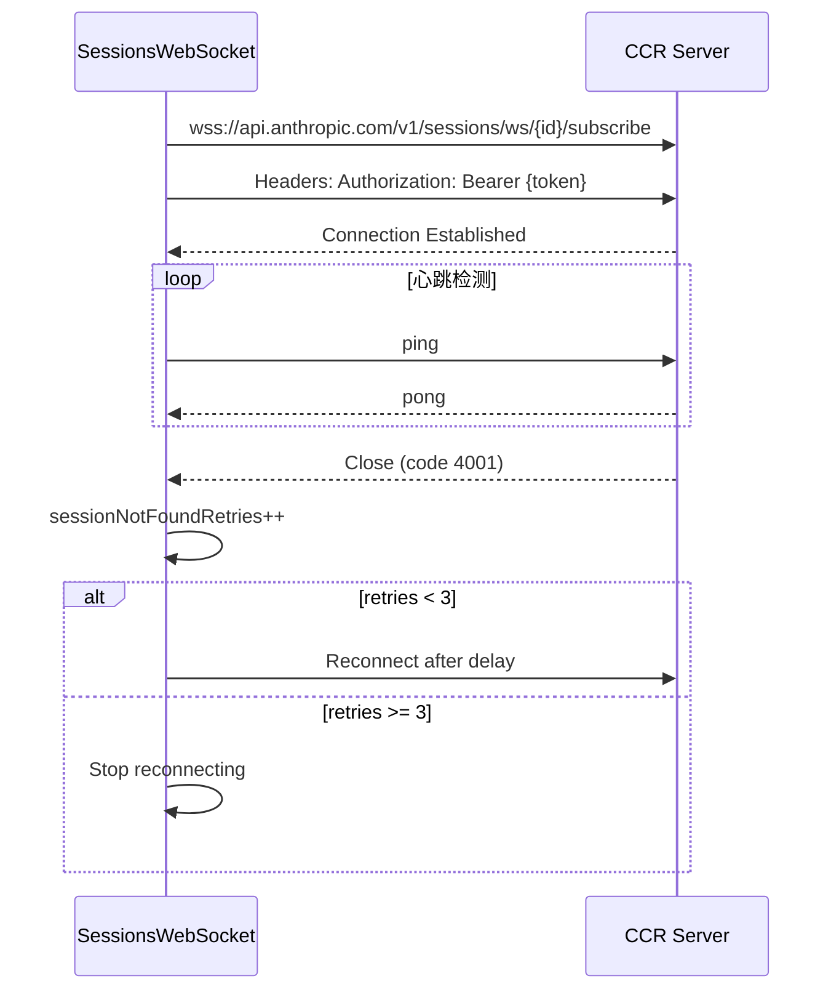
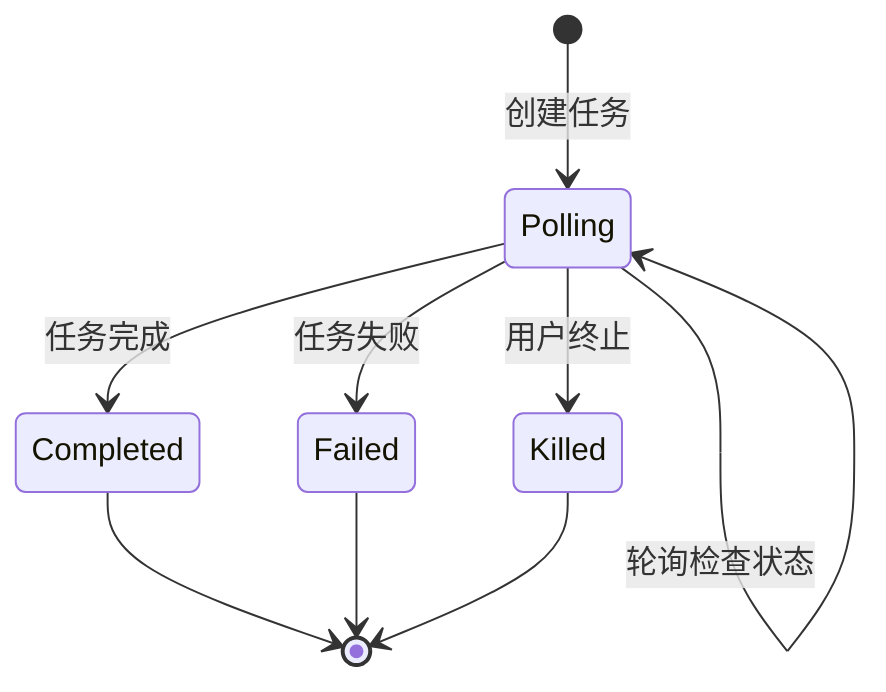
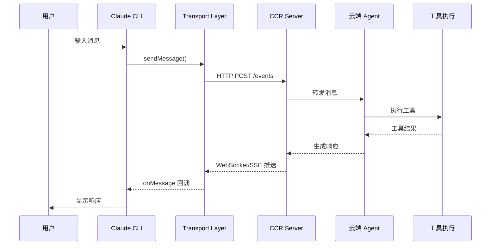
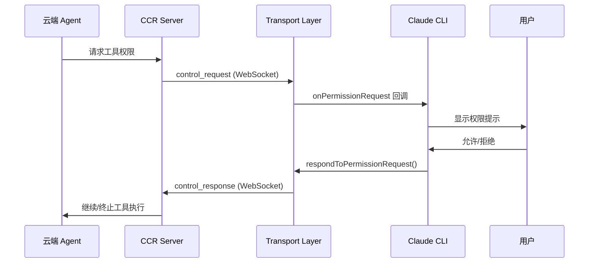
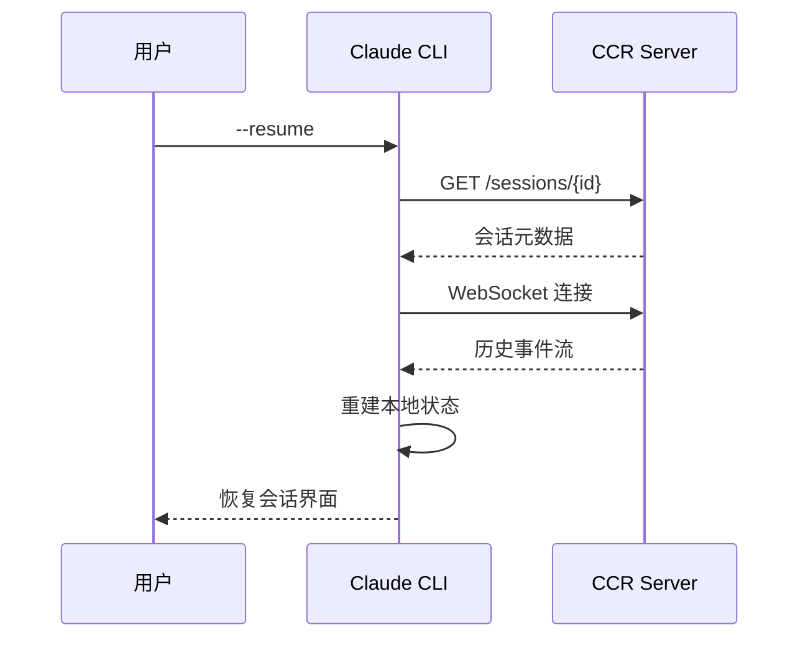

# Claude Code Web Server / Remote Mode 技术解析

**结论**：Claude Code 的 Web Server / Remote Mode 采用**分层传输架构**，通过 WebSocket/SSE 双通道实现本地 CLI 与云端 CCR (Claude Code Remote) 的实时双向通信，支持会话恢复、权限代理和并发多客户端协调。

---

## 1. 为什么需要 Remote Mode

### 1.1 核心场景

| 场景 | 说明 |
|------|------|
| **云端执行** | 本地仅作为交互界面，实际 Agent 运行在云端容器 |
| **后台任务** | 关闭本地 CLI 后，远程任务继续运行并可恢复 |
| **多客户端** | 支持 Web 端、IDE 插件与 CLI 同时连接同一会话 |
| **权限隔离** | 敏感操作（如文件修改）可在云端沙箱执行 |

### 1.2 与本地模式的对比



---

## 2. 架构概览

### 2.1 核心组件



### 2.2 传输层演进

| 传输方式 | 读取 | 写入 | 适用场景 | 环境变量 |
|---------|------|------|---------|---------|
| **WebSocketTransport** | WS | WS | 默认模式 | - |
| **HybridTransport** | WS | HTTP POST | 高并发写入 | `CLAUDE_CODE_POST_FOR_SESSION_INGRESS_V2` |
| **SSETransport** | SSE | HTTP POST | CCR v2 协议 | `CLAUDE_CODE_USE_CCR_V2` |

---

## 3. 核心组件详解

### 3.1 传输层实现

#### 3.1.1 WebSocketTransport

✅ **Verified**: `claude-code/src/cli/transports/WebSocketTransport.ts:74-800`

```typescript
export class WebSocketTransport implements Transport {
  private ws: WebSocketLike | null = null
  protected state: WebSocketTransportState = 'idle'
  private messageBuffer: CircularBuffer<StdoutMessage>

  // 重连配置
  private reconnectAttempts = 0
  private readonly maxReconnectAttempts = 5
  private readonly reconnectGiveUpMs = 600_000  // 10分钟

  // 心跳检测
  private pingInterval: NodeJS.Timeout | null = null
  private pongReceived = true
}
```

**关键特性**：
- **自动重连**：指数退避 + 抖动，最多 5 次尝试，总预算 10 分钟
- **消息缓冲**：CircularBuffer 缓存最多 1000 条消息，重连后重放
- **睡眠检测**：检测到系统睡眠（>60s 间隔）时重置重连预算
- **永久关闭码**：1002(协议错误)、4001(会话过期)、4003(未授权) 不重连

#### 3.1.2 HybridTransport

✅ **Verified**: `claude-code/src/cli/transports/HybridTransport.ts:54-283`

```typescript
export class HybridTransport extends WebSocketTransport {
  private uploader: SerialBatchEventUploader<StdoutMessage>
  private streamEventBuffer: StdoutMessage[] = []

  // 写入流程
  override async write(message: StdoutMessage): Promise<void> {
    if (message.type === 'stream_event') {
      // 延迟 100ms 批量写入，减少 POST 次数
      this.streamEventBuffer.push(message)
      if (!this.streamEventTimer) {
        this.streamEventTimer = setTimeout(
          () => this.flushStreamEvents(),
          BATCH_FLUSH_INTERVAL_MS  // 100ms
        )
      }
      return
    }
    // 非流式消息立即写入
    await this.uploader.enqueue([...this.takeStreamEvents(), message])
    return this.uploader.flush()
  }
}
```

**设计亮点**：
- **读写分离**：WebSocket 读，HTTP POST 写
- **批量压缩**：stream_event 延迟 100ms 批量发送
- **序列化上传**：SerialBatchEventUploader 保证单线程写入，避免 Firestore 冲突

#### 3.1.3 SSETransport (CCR v2)

✅ **Verified**: `claude-code/src/cli/transports/SSETransport.ts:162-712`

```typescript
export class SSETransport implements Transport {
  private state: SSETransportState = 'idle'
  private lastSequenceNum = 0
  private seenSequenceNums = new Set<number>()

  // 活性检测
  private livenessTimer: NodeJS.Timeout | null = null
  private readonly livenessTimeoutMs = 45_000  // 45秒无消息视为断开

  // 重连配置
  private readonly reconnectGiveUpMs = 600_000  // 10分钟
}
```

**SSE 帧解析**：
```typescript
export function parseSSEFrames(buffer: string): {
  frames: SSEFrame[]
  remaining: string
} {
  // SSE 帧以双换行符分隔
  // event: client_event
  // id: 123
  // data: {...}
  //
}
```

### 3.2 会话管理

#### 3.2.1 RemoteSessionManager

✅ **Verified**: `claude-code/src/remote/RemoteSessionManager.ts:95-344`

```typescript
export class RemoteSessionManager {
  private websocket: SessionsWebSocket | null = null
  private pendingPermissionRequests: Map<string, SDKControlPermissionRequest> = new Map()

  /**
   * 连接远程会话
   */
  connect(): void {
    const wsCallbacks: SessionsWebSocketCallbacks = {
      onMessage: message => this.handleMessage(message),
      onConnected: () => { ... },
      onClose: () => { ... },
      onReconnecting: () => { ... },
      onError: error => { ... },
    }

    this.websocket = new SessionsWebSocket(
      this.config.sessionId,
      this.config.orgUuid,
      this.config.getAccessToken,
      wsCallbacks,
    )

    void this.websocket.connect()
  }

  /**
   * 发送用户消息（HTTP POST）
   */
  async sendMessage(content: RemoteMessageContent): Promise<boolean> {
    return sendEventToRemoteSession(this.config.sessionId, content)
  }
}
```

#### 3.2.2 SessionsWebSocket

✅ **Verified**: `claude-code/src/remote/SessionsWebSocket.ts:82-405`

```typescript
export class SessionsWebSocket {
  private ws: WebSocketLike | null = null
  private state: WebSocketState = 'closed'
  private reconnectAttempts = 0

  // 重连配置
  private readonly reconnectDelayMs = 2000
  private readonly maxReconnectAttempts = 5
  private readonly pingIntervalMs = 30000

  // 特殊处理：4001 (session not found) 在压缩期间可能是瞬态错误
  private sessionNotFoundRetries = 0
  private readonly maxSessionNotFoundRetries = 3
}
```

**连接流程**：


### 3.3 CCR Client (v2 协议)

✅ **Verified**: `claude-code/src/cli/transports/ccrClient.ts:262-998`

```typescript
export class CCRClient {
  private workerEpoch = 0
  private readonly heartbeatIntervalMs = 20_000  // 20秒心跳
  private consecutiveAuthFailures = 0
  private readonly maxConsecutiveAuthFailures = 10

  // 上传器
  private readonly workerState: WorkerStateUploader
  private readonly eventUploader: SerialBatchEventUploader<ClientEvent>
  private readonly internalEventUploader: SerialBatchEventUploader<WorkerEvent>

  /**
   * 初始化 Worker
   */
  async initialize(epoch?: number): Promise<Record<string, unknown> | null> {
    // 1. 从环境变量或参数获取 epoch
    this.workerEpoch = epoch ?? parseInt(process.env.CLAUDE_CODE_WORKER_EPOCH || 'NaN')

    // 2. 注册 Worker
    await this.request('put', '/worker', {
      worker_status: 'idle',
      worker_epoch: this.workerEpoch,
    })

    // 3. 启动心跳
    this.startHeartbeat()

    // 4. 恢复状态
    return this.getWorkerState()
  }
}
```

**Epoch 机制**：
- 每个 Worker 实例有唯一的 epoch 编号
- 409 冲突表示新 Worker 已取代旧 Worker
- 旧 Worker 收到 409 后立即退出

### 3.4 协调器模式 (Coordinator Mode)

✅ **Verified**: `claude-code/src/coordinator/coordinatorMode.ts:36-369`

```typescript
export function isCoordinatorMode(): boolean {
  if (feature('COORDINATOR_MODE')) {
    return isEnvTruthy(process.env.CLAUDE_CODE_COORDINATOR_MODE)
  }
  return false
}

export function getCoordinatorSystemPrompt(): string {
  return `You are Claude Code, an AI assistant that orchestrates software engineering tasks across multiple workers.

## 1. Your Role
You are a **coordinator**. Your job is to:
- Help the user achieve their goal
- Direct workers to research, implement and verify code changes
- Synthesize results and communicate with the user

## 2. Your Tools
- **AgentTool** - Spawn a new worker
- **SendMessageTool** - Continue an existing worker
- **TaskStopTool** - Stop a running worker`
}
```

**协调器特性**：
- **多 Worker 并行**：支持同时启动多个子 Agent
- **任务分派**：将大任务拆分为 Research/Implementation/Verification 阶段
- **Worker 隔离**：每个 Worker 独立会话，通过消息传递通信

### 3.5 远程 Agent 任务

✅ **Verified**: `claude-code/src/tasks/RemoteAgentTask/RemoteAgentTask.tsx:22-300`

```typescript
export type RemoteAgentTaskState = TaskStateBase & {
  type: 'remote_agent'
  remoteTaskType: RemoteTaskType
  sessionId: string  // 原始会话 ID
  command: string
  title: string
  todoList: TodoList
  log: SDKMessage[]
  isLongRunning?: boolean  // 长期运行任务
  pollStartedAt: number  // 轮询开始时间
}

const REMOTE_TASK_TYPES = [
  'remote-agent',
  'ultraplan',
  'ultrareview',
  'autofix-pr',
  'background-pr'
] as const
```

**远程任务生命周期**：


### 3.6 消息适配器

✅ **Verified**: `claude-code/src/remote/sdkMessageAdapter.ts:27-303`

```typescript
export function convertSDKMessage(
  msg: SDKMessage,
  opts?: ConvertOptions,
): ConvertedMessage {
  switch (msg.type) {
    case 'assistant':
      return { type: 'message', message: convertAssistantMessage(msg) }

    case 'user': {
      // 工具结果消息需要转换以本地渲染
      const isToolResult = Array.isArray(content) &&
        content.some(b => b.type === 'tool_result')
      if (opts?.convertToolResults && isToolResult) {
        return { type: 'message', message: createUserMessage({...}) }
      }
      return { type: 'ignored' }
    }

    case 'stream_event':
      return { type: 'stream_event', event: convertStreamEvent(msg) }

    case 'result':
      // 仅错误结果显示
      if (msg.subtype !== 'success') {
        return { type: 'message', message: convertResultMessage(msg) }
      }
      return { type: 'ignored' }

    // ... 其他消息类型
  }
}
```

---

## 4. 数据流

### 4.1 消息流向



### 4.2 权限请求流程



### 4.3 会话恢复流程



---

## 5. 关键代码索引

| 文件 | 行号 | 职责 |
|------|------|------|
| `claude-code/src/server/types.ts` | 1-58 | 服务端类型定义（SessionState、SessionInfo） |
| `claude-code/src/server/createDirectConnectSession.ts` | 26-89 | 创建直连会话 |
| `claude-code/src/server/directConnectManager.ts` | 40-214 | 直连会话管理器 |
| `claude-code/src/remote/RemoteSessionManager.ts` | 95-344 | 远程会话管理 |
| `claude-code/src/remote/SessionsWebSocket.ts` | 82-405 | WebSocket 连接管理 |
| `claude-code/src/remote/sdkMessageAdapter.ts` | 27-303 | SDK 消息格式转换 |
| `claude-code/src/cli/transports/WebSocketTransport.ts` | 74-800 | WebSocket 传输实现 |
| `claude-code/src/cli/transports/HybridTransport.ts` | 54-283 | 混合传输（WS读+HTTP写） |
| `claude-code/src/cli/transports/SSETransport.ts` | 162-712 | SSE 传输实现 |
| `claude-code/src/cli/transports/ccrClient.ts` | 262-998 | CCR v2 客户端 |
| `claude-code/src/cli/transports/transportUtils.ts` | 16-46 | 传输层工厂函数 |
| `claude-code/src/coordinator/coordinatorMode.ts` | 36-369 | 协调器模式实现 |
| `claude-code/src/tasks/RemoteAgentTask/RemoteAgentTask.tsx` | 22-300+ | 远程 Agent 任务 |

---

## 6. 设计权衡

### 6.1 传输层选择

| 方案 | 优点 | 缺点 | 适用场景 |
|------|------|------|---------|
| **纯 WebSocket** | 低延迟、双向实时 | 高并发写入时冲突 | 低频率消息 |
| **Hybrid (WS+HTTP)** | 读写分离、批量写入 | 复杂度增加 | 高频率流式输出 |
| **SSE+HTTP** | 兼容性好、自动重连 | 单向服务器推送 | CCR v2 协议 |

### 6.2 重连策略

```typescript
// 指数退避 + 抖动
const baseDelay = Math.min(
  RECONNECT_BASE_DELAY_MS * Math.pow(2, this.reconnectAttempts - 1),
  RECONNECT_MAX_DELAY_MS,
)
const delay = baseDelay + baseDelay * 0.25 * (2 * Math.random() - 1)
```

**权衡点**：
- **快速恢复** vs **避免服务器过载**：基础延迟 1s，最大 30s
- **时间预算** vs **用户体验**：10 分钟总预算，超过后放弃重连
- **抖动** vs ** thundering herd**：±25% 随机抖动避免同步重连

### 6.3 消息缓冲

```typescript
// HybridTransport: 100ms 延迟批量
private streamEventBuffer: StdoutMessage[] = []
private readonly batchFlushIntervalMs = 100

// WebSocketTransport: CircularBuffer 重放缓存
private messageBuffer: CircularBuffer<StdoutMessage>
private readonly maxBufferSize = 1000
```

**权衡点**：
- **延迟** vs **吞吐量**：100ms 延迟换取更少 POST 请求
- **内存** vs **可靠性**：1000 条消息上限，避免 OOM

### 6.4 Epoch 机制

**优势**：
- 明确的 Worker 生命周期管理
- 避免僵尸 Worker 竞争
- 快速故障检测（409 冲突）

**代价**：
- 需要额外的状态同步
- 旧 Worker 必须立即退出
- 恢复逻辑复杂度增加

---

## 7. 相关文档

- [01-claude-code-overview.md](./01-claude-code-overview.md) - Claude Code 整体架构
- [04-claude-code-agent-loop.md](./04-claude-code-agent-loop.md) - Agent Loop 实现
- [07-claude-code-memory-context.md](./07-claude-code-memory-context.md) - 会话状态管理
- [docs/comm/09-comm-web-server.md](../comm/09-comm-web-server.md) - 跨项目 Web Server 对比

---

*文档基于 Claude Code 源码分析，最后更新：2026-03-31*
