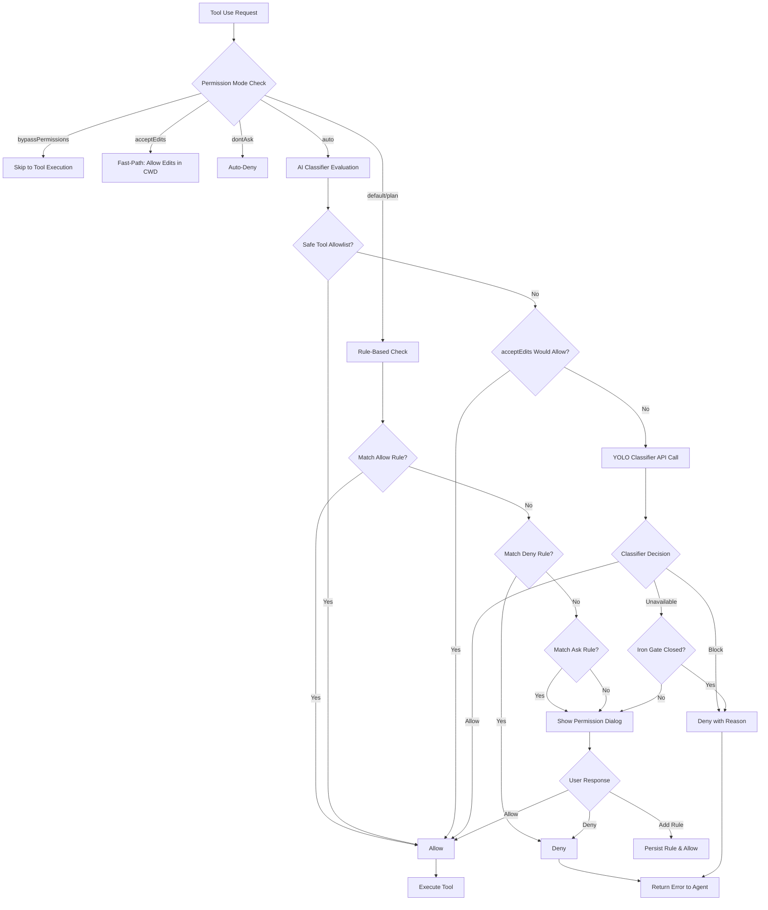
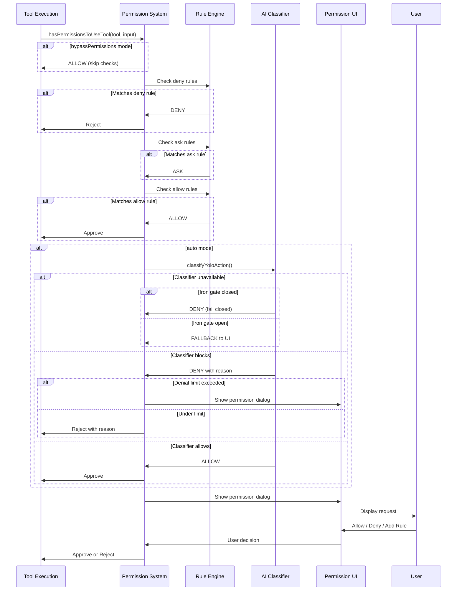

# Claude Code Safety Control Mechanism

## TL;DR

Claude Code implements a multi-layered safety control system combining permission modes (default/plan/acceptEdits/dontAsk/auto/bypassPermissions), rule-based access control with allow/ask/deny rules, AI-powered auto-mode classifiers for automatic approval decisions, interactive permission dialogs with rich UI components, and optional OS-level sandboxing via bubblewrap (Linux/WSL) or seatbelt (macOS) to isolate command execution.

---

## Why Safety Matters

AI Coding Agents have powerful capabilities that can potentially cause harm:

1. **File System Operations**: Can read, write, edit, and delete files anywhere the user has access
2. **Command Execution**: Can execute arbitrary shell commands with user privileges
3. **Network Access**: Can fetch remote resources and potentially exfiltrate data
4. **Automated Execution**: Can run autonomously without user oversight

Claude Code's safety architecture addresses these risks through defense-in-depth: multiple independent layers of protection that must all be satisfied before a potentially dangerous action can execute.

---

## Architecture Overview

### Permission Decision Flow



### Multi-Layer Defense Model

```mermaid
flowchart LR
    subgraph Layer1["Layer 1: Permission Modes"]
        M1[default]
        M2[plan]
        M3[acceptEdits]
        M4[dontAsk]
        M5[auto]
        M6[bypassPermissions]
    end

    subgraph Layer2["Layer 2: Rule Engine"]
        R1[Allow Rules]
        R2[Deny Rules]
        R3[Ask Rules]
    end

    subgraph Layer3["Layer 3: AI Classifier"]
        C1[YOLO Classifier]
        C2[Bash Classifier]
        C3[Safe Tool Allowlist]
    end

    subgraph Layer4["Layer 4: Interactive UI"]
        U1[Permission Dialogs]
        U2[Feedback Input]
        U3[Rule Suggestions]
    end

    subgraph Layer5["Layer 5: OS Sandbox"]
        S1[bubblewrap]
        S2[seatbelt]
    end

    Layer1 --> Layer2 --> Layer3 --> Layer4 --> Layer5
```



---

## Core Components

### 1. Permission Modes

Permission modes define the baseline behavior for tool approval decisions.

| Mode | Behavior | Use Case |
|------|----------|----------|
| `default` | Ask for all non-read operations | Standard interactive use |
| `plan` | Like default but pauses for review | Complex multi-step tasks |
| `acceptEdits` | Auto-allow file edits in working directory | Trusted codebase modifications |
| `dontAsk` | Auto-deny all permission requests | Non-interactive fallback |
| `auto` | AI classifier makes approval decisions | Power users with classifier trust |
| `bypassPermissions` | Skip all permission checks | ⚠️ Dangerous - debugging only |

**Key Code Locations**:

- `claude-code/src/types/permissions.ts:16-38` - Permission mode type definitions
- `claude-code/src/utils/permissions/PermissionMode.ts:42-91` - Mode configuration and display
- `claude-code/src/utils/permissions/permissions.ts:503-517` - Mode-based transformations (dontAsk → deny)

### 2. Rule-Based Permission System

Rules grant persistent permissions for specific tools or command patterns.

**Rule Format**:
```typescript
// Tool-level rule: allows all Bash tool uses
Bash

// Prefix rule: allows npm install with any arguments
Bash(npm install:*)

// Exact rule: allows only this specific command
Bash(git status)

// MCP tool rule
mcp__serverName__toolName
```

**Rule Sources** (in priority order):
1. `policySettings` - Organization-mandated rules (highest priority)
2. `flagSettings` - Feature flag rules
3. `cliArg` - Command-line `--allow` flags
4. `userSettings` - User's global settings
5. `projectSettings` - Project-specific `.claude/settings.json`
6. `localSettings` - Session-local settings
7. `command` - Rules from `/allow` commands
8. `session` - Temporary session rules (lowest priority)

**Key Code Locations**:

- `claude-code/src/types/permissions.ts:67-79` - Rule type definitions
- `claude-code/src/utils/permissions/permissions.ts:122-231` - Rule matching logic
- `claude-code/src/utils/permissions/permissionsLoader.ts` - Rule loading from settings
- `claude-code/src/tools/BashTool/bashPermissions.ts:778-899` - Bash-specific rule matching with wildcard support

### 3. AI Classifiers (Auto Mode)

When in `auto` mode, Claude Code uses AI classifiers to automatically approve or deny tool use requests without user interaction.

**YOLO Classifier** (Primary auto-mode classifier):
- Analyzes the full conversation transcript
- Makes allow/block decisions based on context
- Two-stage architecture: fast check + thinking check
- Configurable via `settings.autoMode` rules

**Bash Classifier** (Legacy, ant-only):
- Analyzes individual bash commands
- Matches against allow/ask/deny descriptions
- Runs asynchronously alongside user prompts

**Safe Tool Allowlist**:
```typescript
// Tools that skip classifier in auto mode
const SAFE_YOLO_ALLOWLISTED_TOOLS = new Set([
  'FileRead', 'Grep', 'Glob', 'LSP',       // Read-only
  'TodoWrite', 'TaskCreate', 'TaskUpdate', // Task management
  'AskUserQuestion', 'EnterPlanMode',      // UI tools
  'Sleep',                                 // Misc safe
])
```

**Key Code Locations**:

- `claude-code/src/utils/permissions/yoloClassifier.ts` - YOLO classifier implementation
- `claude-code/src/utils/permissions/classifierDecision.ts:56-98` - Safe tool allowlist
- `claude-code/src/utils/permissions/bashClassifier.ts` - Bash classifier (stub for external builds)
- `claude-code/src/tools/BashTool/bashPermissions.ts:433-530` - Async classifier execution

### 4. Interactive Permission System

When a tool requires user approval, Claude Code displays rich permission dialogs.

**Permission Dialog Types**:
- `BashPermissionRequest` - Shell command approval with command preview
- `FileWritePermissionRequest` - File write with diff preview
- `FileEditPermissionRequest` - File edit with unified diff
- `WebFetchPermissionRequest` - URL fetch approval
- `SkillPermissionRequest` - Custom skill approval
- `AskUserQuestionPermissionRequest` - Multi-choice question UI

**Permission Options**:
- **Allow Once** - Approve this single invocation
- **Allow with Rule** - Approve and create a persistent rule
- **Deny** - Reject with optional feedback
- **Deny with Rule** - Reject and create a deny rule

**Key Code Locations**:

- `claude-code/src/components/permissions/PermissionRequest.tsx` - Main permission request component
- `claude-code/src/components/permissions/PermissionDialog.tsx` - Dialog container
- `claude-code/src/components/permissions/PermissionPrompt.tsx` - Interactive prompt with feedback
- `claude-code/src/components/permissions/BashPermissionRequest/` - Bash-specific UI
- `claude-code/src/components/permissions/FileWritePermissionRequest/` - File write UI with diff

### 5. OS-Level Sandbox

Claude Code can wrap bash commands in OS-level sandboxes for additional isolation.

**Sandbox Features**:
- **Filesystem Restrictions**: Read/write allowlists and denylists
- **Network Restrictions**: Domain allowlists, unix socket controls
- **Process Isolation**: Separate PID namespace
- **Resource Limits**: Optional weaker sandbox for nested environments

**Platform Support**:
- macOS: `seatbelt` (built-in)
- Linux: `bubblewrap` (requires installation)
- WSL2: `bubblewrap` (requires installation)
- WSL1: Not supported

**Configuration**:
```json
{
  "sandbox": {
    "enabled": true,
    "autoAllowBashIfSandboxed": true,
    "allowUnsandboxedCommands": false,
    "filesystem": {
      "allowWrite": ["/tmp", "/var/log"],
      "denyRead": ["~/.ssh/id_rsa"]
    },
    "network": {
      "allowedDomains": ["api.github.com", "registry.npmjs.org"]
    }
  }
}
```

**Key Code Locations**:

- `claude-code/src/utils/sandbox/sandbox-adapter.ts` - Sandbox manager wrapper
- `claude-code/src/utils/sandbox/sandbox-ui-utils.ts` - Sandbox UI helpers
- `claude-code/src/components/permissions/SandboxPermissionRequest.tsx` - Sandbox-specific UI

---

## Permission Decision Flow (Detailed)

### Step-by-Step Decision Process



### Permission Context

The permission system maintains rich context for decision-making:

```typescript
type ToolPermissionContext = {
  mode: PermissionMode                    // Current permission mode
  additionalWorkingDirectories: Map<string, AdditionalWorkingDirectory>
  alwaysAllowRules: ToolPermissionRulesBySource
  alwaysDenyRules: ToolPermissionRulesBySource
  alwaysAskRules: ToolPermissionRulesBySource
  isBypassPermissionsModeAvailable: boolean
  shouldAvoidPermissionPrompts: boolean   // For headless/async agents
  awaitAutomatedChecksBeforeDialog: boolean
  prePlanMode: PermissionMode | undefined
}
```

**Key Code Locations**:

- `claude-code/src/types/permissions.ts:427-441` - ToolPermissionContext definition
- `claude-code/src/hooks/toolPermission/PermissionContext.ts:96-348` - Permission context creation
- `claude-code/src/hooks/toolPermission/handlers/interactiveHandler.ts:57-531` - Interactive permission handling

---

## Key Code Index

### Permission Core

| File | Responsibility |
|------|----------------|
| `claude-code/src/types/permissions.ts` | Type definitions for permissions, rules, decisions |
| `claude-code/src/utils/permissions/permissions.ts:473-956` | Main permission checking logic (`hasPermissionsToUseTool`) |
| `claude-code/src/utils/permissions/PermissionMode.ts` | Permission mode definitions and UI helpers |
| `claude-code/src/utils/permissions/PermissionResult.ts` | Permission result type exports |
| `claude-code/src/utils/permissions/PermissionRule.ts` | Rule type definitions |
| `claude-code/src/utils/permissions/permissionsLoader.ts` | Loading rules from settings files |

### Classifiers

| File | Responsibility |
|------|----------------|
| `claude-code/src/utils/permissions/yoloClassifier.ts` | YOLO auto-mode classifier |
| `claude-code/src/utils/permissions/classifierDecision.ts` | Classifier decision helpers, safe tool allowlist |
| `claude-code/src/utils/permissions/bashClassifier.ts` | Bash classifier (external stub) |
| `claude-code/src/utils/permissions/classifierShared.ts` | Shared classifier utilities |

### Bash Permission System

| File | Responsibility |
|------|----------------|
| `claude-code/src/tools/BashTool/bashPermissions.ts` | Bash-specific permission logic, rule matching |
| `claude-code/src/tools/BashTool/bashSecurity.ts` | Bash command security validation |
| `claude-code/src/tools/BashTool/pathValidation.ts` | Path constraint validation |
| `claude-code/src/tools/BashTool/modeValidation.ts` | Permission mode validation for Bash |

### UI Components

| File | Responsibility |
|------|----------------|
| `claude-code/src/components/permissions/PermissionRequest.tsx` | Main permission request component |
| `claude-code/src/components/permissions/PermissionDialog.tsx` | Dialog container |
| `claude-code/src/components/permissions/PermissionPrompt.tsx` | Interactive prompt with feedback |
| `claude-code/src/components/permissions/BashPermissionRequest/BashPermissionRequest.tsx` | Bash command UI |
| `claude-code/src/components/permissions/FileWritePermissionRequest/FileWritePermissionRequest.tsx` | File write UI |
| `claude-code/src/components/permissions/rules/PermissionRuleList.tsx` | Rule management UI |

### Sandbox

| File | Responsibility |
|------|----------------|
| `claude-code/src/utils/sandbox/sandbox-adapter.ts` | Sandbox manager wrapper |
| `claude-code/src/utils/sandbox/sandbox-ui-utils.ts` | Sandbox UI utilities |
| `claude-code/src/components/permissions/SandboxPermissionRequest.tsx` | Sandbox permission UI |

### Hooks and Context

| File | Responsibility |
|------|----------------|
| `claude-code/src/hooks/useCanUseTool.tsx` | React hook for permission checking |
| `claude-code/src/hooks/toolPermission/PermissionContext.ts` | Permission context creation |
| `claude-code/src/hooks/toolPermission/handlers/interactiveHandler.ts` | Interactive permission flow |
| `claude-code/src/hooks/toolPermission/handlers/coordinatorHandler.ts` | Coordinator permission handling |
| `claude-code/src/hooks/toolPermission/permissionLogging.ts` | Permission decision logging |

---

## Trade-offs vs Other Projects

### Comparison Matrix

| Aspect | Claude Code | Codex CLI | Gemini CLI | Kimi CLI | OpenCode |
|--------|-------------|-----------|------------|----------|----------|
| **Permission Model** | Multi-mode + Rules + AI Classifier | Simple allow/deny per tool | Policy-based | Rule-based | Simple allow/deny |
| **Auto-Approval** | YOLO Classifier (context-aware) | Limited | No | No | No |
| **Rule Persistence** | Multi-source hierarchy | Per-session | No | Project settings | No |
| **OS Sandbox** | bubblewrap/seatbelt | Native sandbox | No | No | No |
| **Permission UI** | Rich TUI with diffs | Simple prompts | Web UI | TUI | TUI |
| **Feedback Loop** | Built-in feedback input | No | No | No | No |

### Claude Code Advantages

1. **Context-Aware Auto-Approval**: The YOLO classifier analyzes the full conversation transcript, not just the current command, enabling smarter approval decisions.

2. **Flexible Rule System**: Rules can be set at multiple levels (user, project, session) with clear priority ordering.

3. **Rich Permission UI**: Diff previews for file edits, command syntax highlighting, and integrated feedback input.

4. **OS-Level Sandbox**: Optional but powerful additional isolation layer.

5. **Denial Tracking**: Auto mode tracks consecutive denials and falls back to user prompts when the classifier seems confused.

### Claude Code Trade-offs

1. **Complexity**: The multi-layered system is more complex than simpler allow/deny models.

2. **Classifier Latency**: Auto mode adds API call latency for each non-allowlisted tool use.

3. **External Build Limitations**: Full classifier functionality is ant-only; external builds get stub implementations.

4. **Sandbox Platform Support**: Requires specific OS support (no Windows native sandbox).

---

## Evidence Markers

- **✅ Verified**: Permission mode system, rule-based permissions, interactive permission UI, sandbox adapter structure
- **⚠️ Inferred**: Exact classifier API behavior, sandbox runtime internals, specific rule matching edge cases
- **❓ Pending**: Full YOLO classifier prompt templates, complete sandbox-runtime package internals

---

## Related Documentation

- [Codex Safety Control](../codex/10-codex-safety-control.md) - Comparison with Codex CLI's approach
- [Gemini CLI Safety Control](../gemini-cli/10-gemini-cli-safety-control.md) - Policy-based permissions
- [Kimi CLI Safety Control](../kimi-cli/10-kimi-cli-safety-control.md) - Rule-based system
- [OpenCode Safety Control](../opencode/10-opencode-safety-control.md) - Simple permission model
