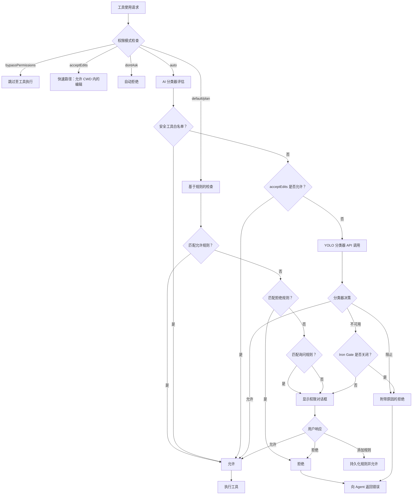
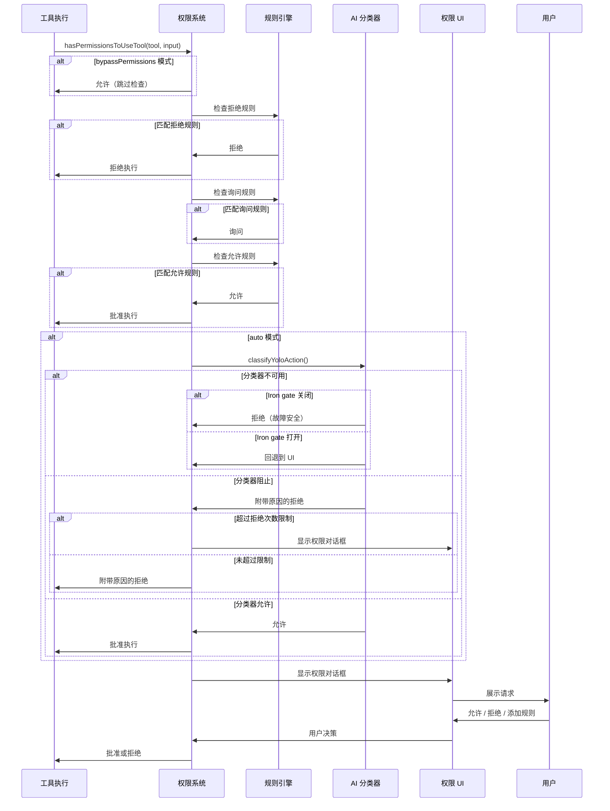

# Claude Code 安全控制机制

## TL;DR

Claude Code 采用多层安全控制系统，结合了权限模式（default/plan/acceptEdits/dontAsk/auto/bypassPermissions）、基于允许/询问/拒绝规则的访问控制、AI 驱动的 auto 模式分类器用于自动审批决策、带有丰富 UI 组件的交互式权限对话框，以及可选的 OS 级沙箱（Linux/WSL 通过 bubblewrap，macOS 通过 seatbelt）来隔离命令执行。

---

## 为什么安全很重要

AI 编程助手具有强大的能力，但也可能带来潜在风险：

1. **文件系统操作**：可以读取、写入、修改和删除用户有权限访问的任何文件
2. **命令执行**：可以执行具有用户权限的任意 shell 命令
3. **网络访问**：可以获取远程资源，并可能存在数据外泄风险
4. **自动执行**：可以在没有用户监督的情况下自主运行

Claude Code 的安全架构通过纵深防御来应对这些风险：多个独立的保护层必须在潜在危险操作执行前全部满足。

---

## 架构概览

### 权限决策流程



### 多层防御模型

```mermaid
flowchart LR
    subgraph Layer1["第 1 层：权限模式"]
        M1[default]
        M2[plan]
        M3[acceptEdits]
        M4[dontAsk]
        M5[auto]
        M6[bypassPermissions]
    end

    subgraph Layer2["第 2 层：规则引擎"]
        R1[允许规则]
        R2[拒绝规则]
        R3[询问规则]
    end

    subgraph Layer3["第 3 层：AI 分类器"]
        C1[YOLO 分类器]
        C2[Bash 分类器]
        C3[安全工具白名单]
    end

    subgraph Layer4["第 4 层：交互式 UI"]
        U1[权限对话框]
        U2[反馈输入]
        U3[规则建议]
    end

    subgraph Layer5["第 5 层：OS 沙箱"]
        S1[bubblewrap]
        S2[seatbelt]
    end

    Layer1 --> Layer2 --> Layer3 --> Layer4 --> Layer5
```



---

## 核心组件

### 1. 权限模式

权限模式定义了工具审批决策的基准行为。

| 模式 | 行为 | 适用场景 |
|------|------|----------|
| `default` | 所有非读取操作都需要询问 | 标准交互式使用 |
| `plan` | 类似于 default，但会暂停供 review | 复杂的多步骤任务 |
| `acceptEdits` | 自动允许工作目录内的文件编辑 | 受信任的代码库修改 |
| `dontAsk` | 自动拒绝所有权限请求 | 非交互式降级方案 |
| `auto` | AI 分类器作出审批决策 | 信任分类器的高级用户 |
| `bypassPermissions` | 跳过所有权限检查 | ⚠️ 危险 - 仅用于调试 |

**关键代码位置**：

- `claude-code/src/types/permissions.ts:16-38` - 权限模式类型定义
- `claude-code/src/utils/permissions/PermissionMode.ts:42-91` - 模式配置和显示
- `claude-code/src/utils/permissions/permissions.ts:503-517` - 基于模式的转换（dontAsk → deny）

### 2. 基于规则的权限系统

规则为特定工具或命令模式授予持久化权限。

**规则格式**：
```typescript
// 工具级规则：允许所有 Bash 工具使用
Bash

// 前缀规则：允许带任何参数的 npm install
Bash(npm install:*)

// 精确规则：仅允许此特定命令
Bash(git status)

// MCP 工具规则
mcp__serverName__toolName
```

**规则来源**（按优先级排序）：
1. `policySettings` - 组织强制规则（最高优先级）
2. `flagSettings` - 功能标志规则
3. `cliArg` - 命令行 `--allow` 标志
4. `userSettings` - 用户全局设置
5. `projectSettings` - 项目专属的 `.claude/settings.json`
6. `localSettings` - 会话本地设置
7. `command` - 来自 `/allow` 命令的规则
8. `session` - 临时会话规则（最低优先级）

**关键代码位置**：

- `claude-code/src/types/permissions.ts:67-79` - 规则类型定义
- `claude-code/src/utils/permissions/permissions.ts:122-231` - 规则匹配逻辑
- `claude-code/src/utils/permissions/permissionsLoader.ts` - 从设置中加载规则
- `claude-code/src/tools/BashTool/bashPermissions.ts:778-899` - 支持通配符的 Bash 特定规则匹配

### 3. AI 分类器（Auto 模式）

在 `auto` 模式下，Claude Code 使用 AI 分类器来自动批准或拒绝工具使用请求，无需用户交互。

**YOLO 分类器**（主要的 auto 模式分类器）：
- 分析完整的对话记录
- 基于上下文作出允许/阻止决策
- 两阶段架构：快速检查 + 思考检查
- 可通过 `settings.autoMode` 规则进行配置

**Bash 分类器**（旧版，仅限 ant 构建）：
- 分析单个 bash 命令
- 根据允许/询问/拒绝描述进行匹配
- 与用户提示异步并行运行

**安全工具白名单**：
```typescript
// auto 模式下跳过分类器的工具
const SAFE_YOLO_ALLOWLISTED_TOOLS = new Set([
  'FileRead', 'Grep', 'Glob', 'LSP',       // 只读
  'TodoWrite', 'TaskCreate', 'TaskUpdate', // 任务管理
  'AskUserQuestion', 'EnterPlanMode',      // UI 工具
  'Sleep',                                 // 其他安全工具
])
```

**关键代码位置**：

- `claude-code/src/utils/permissions/yoloClassifier.ts` - YOLO 分类器实现
- `claude-code/src/utils/permissions/classifierDecision.ts:56-98` - 安全工具白名单
- `claude-code/src/utils/permissions/bashClassifier.ts` - Bash 分类器（外部构建的 stub）
- `claude-code/src/tools/BashTool/bashPermissions.ts:433-530` - 异步分类器执行

### 4. 交互式权限系统

当工具需要用户批准时，Claude Code 会显示丰富的权限对话框。

**权限对话框类型**：
- `BashPermissionRequest` - Shell 命令批准，带命令预览
- `FileWritePermissionRequest` - 文件写入，带 diff 预览
- `FileEditPermissionRequest` - 文件编辑，带统一 diff
- `WebFetchPermissionRequest` - URL 获取批准
- `SkillPermissionRequest` - 自定义 skill 批准
- `AskUserQuestionPermissionRequest` - 多选项问题 UI

**权限选项**：
- **允许一次** - 批准本次调用
- **允许并创建规则** - 批准并创建持久化规则
- **拒绝** - 拒绝并可选择提供反馈
- **拒绝并创建规则** - 拒绝并创建拒绝规则

**关键代码位置**：

- `claude-code/src/components/permissions/PermissionRequest.tsx` - 主权限请求组件
- `claude-code/src/components/permissions/PermissionDialog.tsx` - 对话框容器
- `claude-code/src/components/permissions/PermissionPrompt.tsx` - 带反馈的交互式提示
- `claude-code/src/components/permissions/BashPermissionRequest/` - Bash 专属 UI
- `claude-code/src/components/permissions/FileWritePermissionRequest/` - 带 diff 的文件写入 UI

### 5. OS 级沙箱

Claude Code 可以将 bash 命令包装在 OS 级沙箱中，以提供额外的隔离。

**沙箱功能**：
- **文件系统限制**：读/写允许列表和拒绝列表
- **网络限制**：域名允许列表、unix socket 控制
- **进程隔离**：独立的 PID 命名空间
- **资源限制**：嵌套环境可选的弱沙箱

**平台支持**：
- macOS：`seatbelt`（内置）
- Linux：`bubblewrap`（需要安装）
- WSL2：`bubblewrap`（需要安装）
- WSL1：不支持

**配置示例**：
```json
{
  "sandbox": {
    "enabled": true,
    "autoAllowBashIfSandboxed": true,
    "allowUnsandboxedCommands": false,
    "filesystem": {
      "allowWrite": ["/tmp", "/var/log"],
      "denyRead": ["~/.ssh/id_rsa"]
    },
    "network": {
      "allowedDomains": ["api.github.com", "registry.npmjs.org"]
    }
  }
}
```

**关键代码位置**：

- `claude-code/src/utils/sandbox/sandbox-adapter.ts` - 沙箱管理器包装器
- `claude-code/src/utils/sandbox/sandbox-ui-utils.ts` - 沙箱 UI 辅助工具
- `claude-code/src/components/permissions/SandboxPermissionRequest.tsx` - 沙箱专属 UI

---

## 权限决策流程（详细）

### 逐步决策过程



### 权限上下文

权限系统维护丰富的上下文以支持决策：

```typescript
type ToolPermissionContext = {
  mode: PermissionMode                    // 当前权限模式
  additionalWorkingDirectories: Map<string, AdditionalWorkingDirectory>
  alwaysAllowRules: ToolPermissionRulesBySource
  alwaysDenyRules: ToolPermissionRulesBySource
  alwaysAskRules: ToolPermissionRulesBySource
  isBypassPermissionsModeAvailable: boolean
  shouldAvoidPermissionPrompts: boolean   // 用于无头/异步 agent
  awaitAutomatedChecksBeforeDialog: boolean
  prePlanMode: PermissionMode | undefined
}
```

**关键代码位置**：

- `claude-code/src/types/permissions.ts:427-441` - ToolPermissionContext 定义
- `claude-code/src/hooks/toolPermission/PermissionContext.ts:96-348` - 权限上下文创建
- `claude-code/src/hooks/toolPermission/handlers/interactiveHandler.ts:57-531` - 交互式权限处理

---

## 关键代码索引

### 权限核心

| 文件 | 职责 |
|------|------|
| `claude-code/src/types/permissions.ts` | 权限、规则、决策的类型定义 |
| `claude-code/src/utils/permissions/permissions.ts:473-956` | 主权限检查逻辑（`hasPermissionsToUseTool`） |
| `claude-code/src/utils/permissions/PermissionMode.ts` | 权限模式定义和 UI 辅助 |
| `claude-code/src/utils/permissions/PermissionResult.ts` | 权限结果类型导出 |
| `claude-code/src/utils/permissions/PermissionRule.ts` | 规则类型定义 |
| `claude-code/src/utils/permissions/permissionsLoader.ts` | 从设置文件加载规则 |

### 分类器

| 文件 | 职责 |
|------|------|
| `claude-code/src/utils/permissions/yoloClassifier.ts` | YOLO auto 模式分类器 |
| `claude-code/src/utils/permissions/classifierDecision.ts` | 分类器决策辅助、安全工具白名单 |
| `claude-code/src/utils/permissions/bashClassifier.ts` | Bash 分类器（外部构建 stub） |
| `claude-code/src/utils/permissions/classifierShared.ts` | 分类器共享工具 |

### Bash 权限系统

| 文件 | 职责 |
|------|------|
| `claude-code/src/tools/BashTool/bashPermissions.ts` | Bash 专属权限逻辑、规则匹配 |
| `claude-code/src/tools/BashTool/bashSecurity.ts` | Bash 命令安全验证 |
| `claude-code/src/tools/BashTool/pathValidation.ts` | 路径约束验证 |
| `claude-code/src/tools/BashTool/modeValidation.ts` | Bash 的权限模式验证 |

### UI 组件

| 文件 | 职责 |
|------|------|
| `claude-code/src/components/permissions/PermissionRequest.tsx` | 主权限请求组件 |
| `claude-code/src/components/permissions/PermissionDialog.tsx` | 对话框容器 |
| `claude-code/src/components/permissions/PermissionPrompt.tsx` | 带反馈的交互式提示 |
| `claude-code/src/components/permissions/BashPermissionRequest/BashPermissionRequest.tsx` | Bash 命令 UI |
| `claude-code/src/components/permissions/FileWritePermissionRequest/FileWritePermissionRequest.tsx` | 文件写入 UI |
| `claude-code/src/components/permissions/rules/PermissionRuleList.tsx` | 规则管理 UI |

### 沙箱

| 文件 | 职责 |
|------|------|
| `claude-code/src/utils/sandbox/sandbox-adapter.ts` | 沙箱管理器包装器 |
| `claude-code/src/utils/sandbox/sandbox-ui-utils.ts` | 沙箱 UI 工具 |
| `claude-code/src/components/permissions/SandboxPermissionRequest.tsx` | 沙箱权限 UI |

### Hooks 和上下文

| 文件 | 职责 |
|------|------|
| `claude-code/src/hooks/useCanUseTool.tsx` | 用于权限检查的 React hook |
| `claude-code/src/hooks/toolPermission/PermissionContext.ts` | 权限上下文创建 |
| `claude-code/src/hooks/toolPermission/handlers/interactiveHandler.ts` | 交互式权限流程 |
| `claude-code/src/hooks/toolPermission/handlers/coordinatorHandler.ts` | Coordinator 权限处理 |
| `claude-code/src/hooks/toolPermission/permissionLogging.ts` | 权限决策日志 |

---

## 与其他项目的权衡对比

### 对比矩阵

| 方面 | Claude Code | Codex CLI | Gemini CLI | Kimi CLI | OpenCode |
|------|-------------|-----------|------------|----------|----------|
| **权限模型** | 多模式 + 规则 + AI 分类器 | 简单的按工具允许/拒绝 | 基于策略 | 基于规则 | 简单的允许/拒绝 |
| **自动批准** | YOLO 分类器（上下文感知） | 有限支持 | 无 | 无 | 无 |
| **规则持久化** | 多源层级 | 每会话 | 无 | 项目设置 | 无 |
| **OS 沙箱** | bubblewrap/seatbelt | 原生沙箱 | 无 | 无 | 无 |
| **权限 UI** | 丰富的 TUI，带 diff | 简单提示 | Web UI | TUI | TUI |
| **反馈循环** | 内置反馈输入 | 无 | 无 | 无 | 无 |

### Claude Code 的优势

1. **上下文感知的自动批准**：YOLO 分类器分析完整的对话记录，而不仅仅是当前命令，从而实现更智能的批准决策。

2. **灵活的规则系统**：规则可以在多个层级设置（用户、项目、会话），并具有清晰的优先级排序。

3. **丰富的权限 UI**：文件编辑的 diff 预览、命令语法高亮，以及集成的反馈输入。

4. **OS 级沙箱**：可选但强大的额外隔离层。

5. **拒绝跟踪**：auto 模式跟踪连续拒绝，当分类器似乎困惑时回退到用户提示。

### Claude Code 的权衡

1. **复杂性**：多层系统比简单的允许/拒绝模型更复杂。

2. **分类器延迟**：auto 模式为每个非白名单工具使用增加 API 调用延迟。

3. **外部构建限制**：完整的分类器功能仅限 ant 构建；外部构建获得 stub 实现。

4. **沙箱平台支持**：需要特定的 OS 支持（没有 Windows 原生沙箱）。

---

## 证据标记

- **✅ 已验证**：权限模式系统、基于规则的权限、交互式权限 UI、沙箱适配器结构
- **⚠️ 推断**：分类器 API 的精确行为、沙箱运行时内部机制、特定规则匹配边界情况
- **❓ 待验证**：完整的 YOLO 分类器提示模板、完整的 sandbox-runtime 包内部机制

---

## 相关文档

- [Codex 安全控制](../codex/10-codex-safety-control.md) - 与 Codex CLI 方法的对比
- [Gemini CLI 安全控制](../gemini-cli/10-gemini-cli-safety-control.md) - 基于策略的权限
- [Kimi CLI 安全控制](../kimi-cli/10-kimi-cli-safety-control.md) - 基于规则的系统
- [OpenCode 安全控制](../opencode/10-opencode-safety-control.md) - 简单的权限模型
