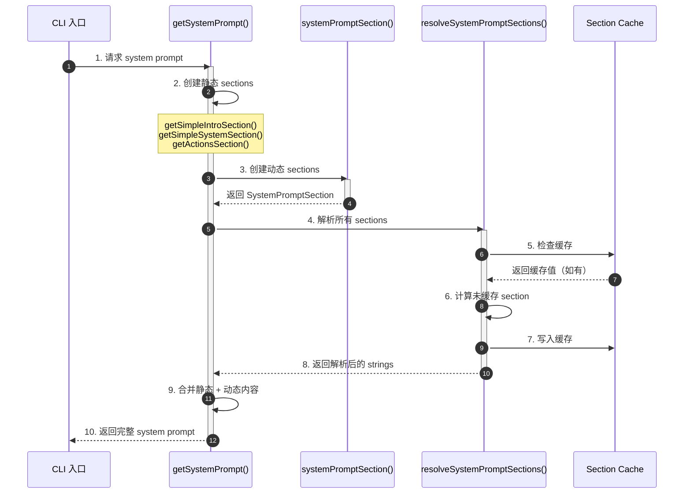
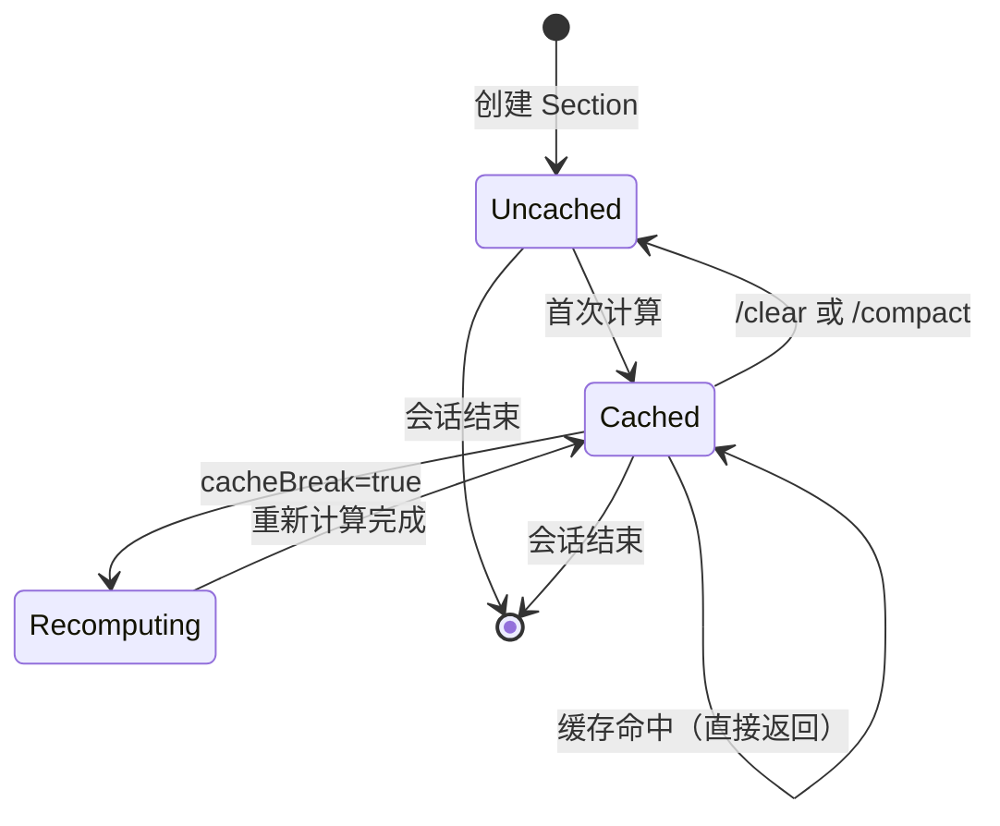
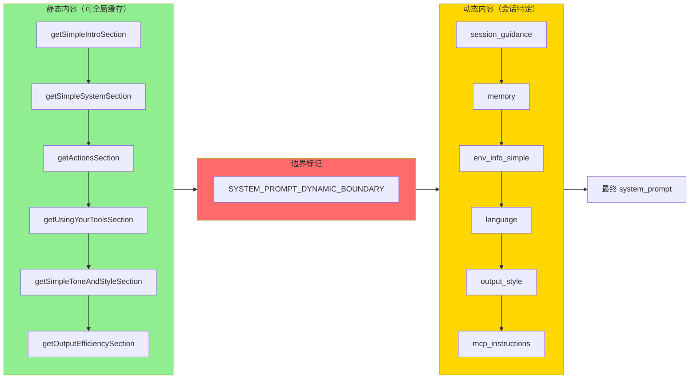
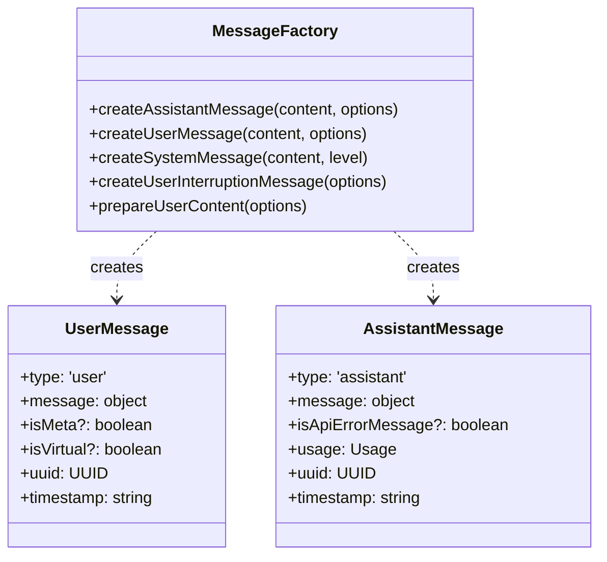
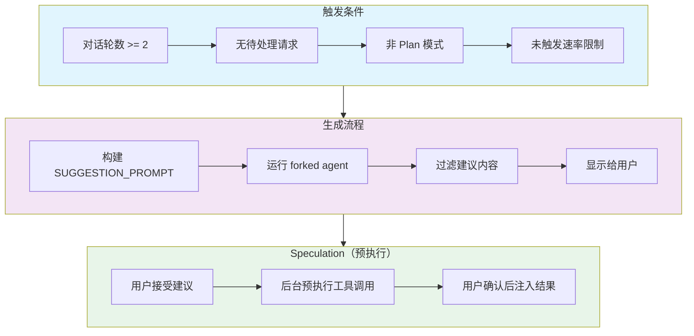
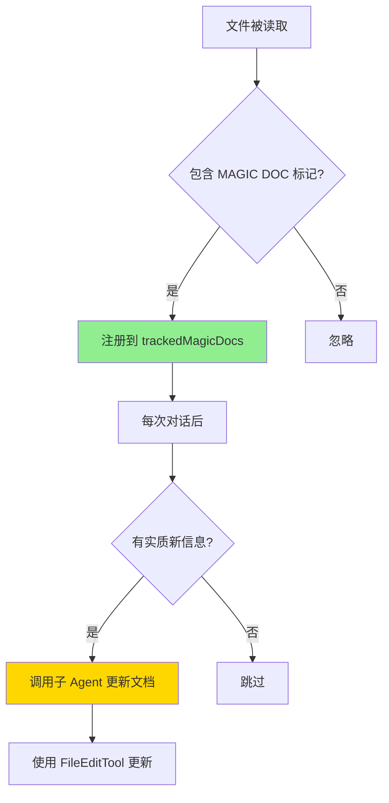
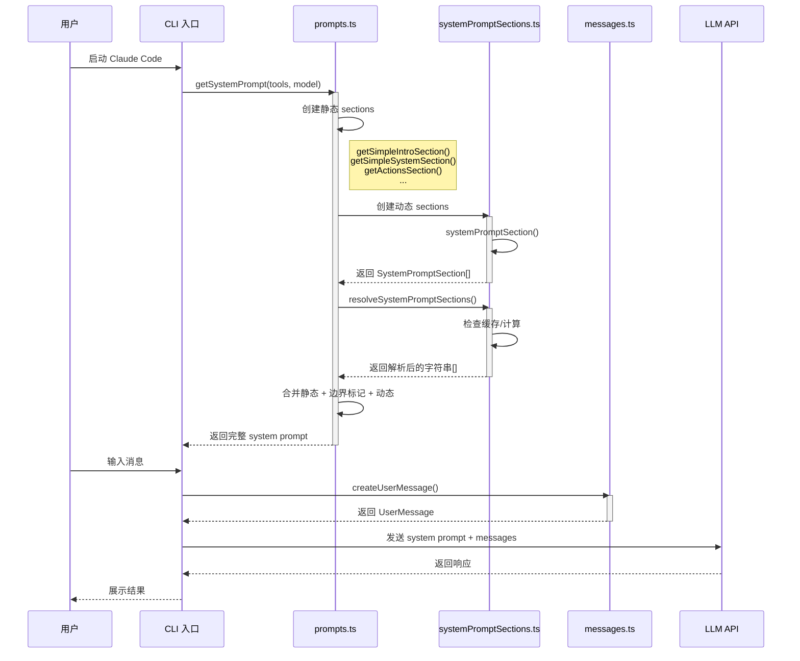
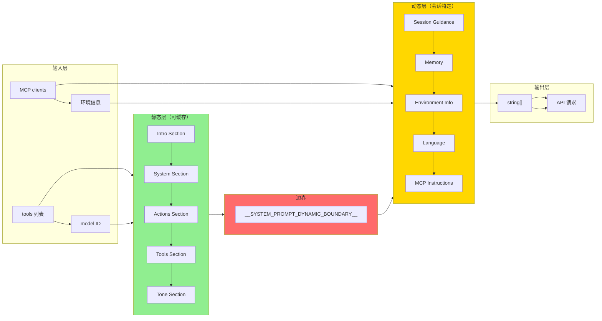
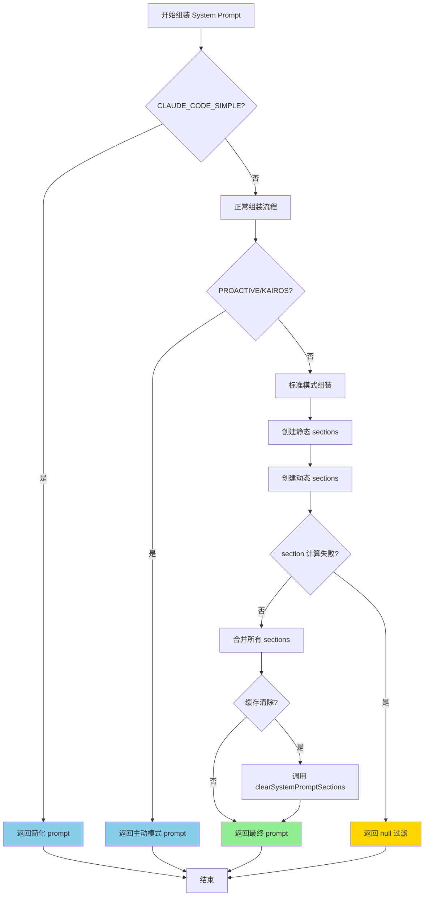
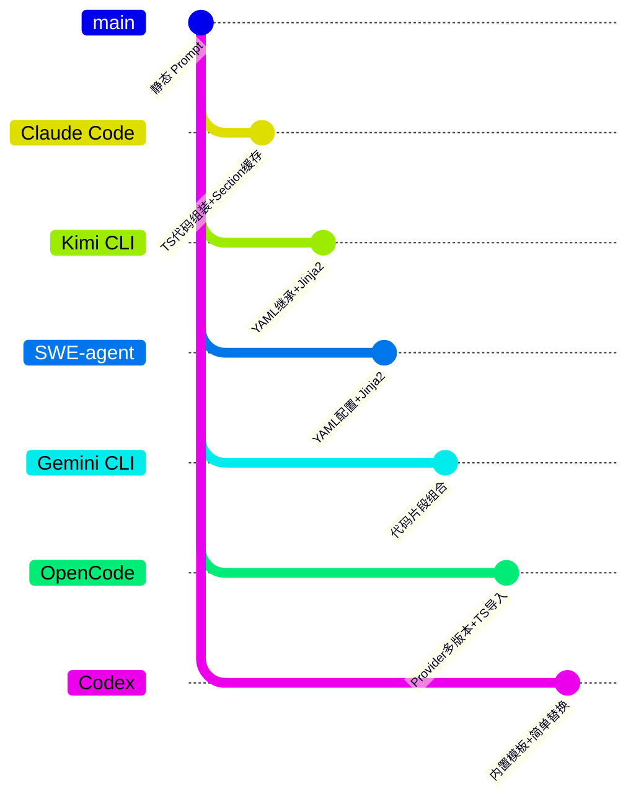

> 📋 **阅读指南**
>
> | 属性 | 说明 |
> |-----|------|
> | 预计阅读 | 20-25 分钟 |
> | 前置文档 | `01-claude-code-overview.md`、`03-claude-code-session-runtime.md` |
> | 文档结构 | 速览 → 架构 → 机制 → 实现 → 对比 |
> | 代码呈现 | 关键代码直接展示，完整代码可折叠查看 |

---

# Prompt Organization（Claude Code）

## TL;DR（结论先行）

一句话定义：Prompt Organization 是 AI Coding Agent 中负责管理系统提示词（System Prompt）的组装、缓存和动态注入的机制，确保 LLM 在不同场景下接收到恰当的指令和上下文。

Claude Code 的核心取舍：**TypeScript 代码组装 + Section 缓存管理 + 动态边界分割**（对比 Kimi CLI 的 YAML 配置继承 + Jinja2 模板、SWE-agent 的 YAML 配置驱动、Gemini CLI 的代码片段组合）

### 核心要点速览

| 维度 | 关键决策 | 代码位置 |
|-----|---------|---------|
| 配置格式 | TypeScript 代码组装 + 函数式 Section | `claude-code/src/constants/prompts.ts:444` |
| 缓存机制 | Section 级别缓存 + 动态边界标记 | `claude-code/src/constants/systemPromptSections.ts:20` |
| 动态内容 | SYSTEM_PROMPT_DYNAMIC_BOUNDARY 分割 | `claude-code/src/constants/prompts.ts:114` |
| 消息工厂 | 标准化消息创建函数 | `claude-code/src/utils/messages.ts:460` |
| 智能提示 | Prompt Suggestion + Speculation 预执行 | `claude-code/src/services/PromptSuggestion/promptSuggestion.ts:258` |
| 动态文档 | Magic Docs 自动维护 | `claude-code/src/services/MagicDocs/magicDocs.ts:1` |

---

## 1. 为什么需要这个机制？（解决什么问题）

### 1.1 问题场景

没有 Prompt Organization 机制时，开发者会面临以下问题：

```
场景：团队需要为不同项目配置不同的 Agent 行为

没有该机制：
  -> 每个项目都要复制粘贴完整的 system prompt
  -> 修改基线行为需要逐个文件修改
  -> 运行时信息（当前目录、时间等）硬编码在 prompt 中
  -> 不同环境（开发/测试/生产）难以切换
  -> 每次请求都重新计算整个 prompt，浪费 token

有该机制（Claude Code）：
  -> 通过代码函数组装 system prompt
  -> Section 级别缓存避免重复计算
  -> 静态/动态内容分离，支持 prompt cache
  -> 运行时变量（环境信息、MCP 配置等）动态注入
  -> 智能提示和预执行提升用户体验
```

### 1.2 核心挑战

| 挑战 | 不解决的后果 |
|-----|-------------|
| Prompt 版本管理 | 团队无法统一基线行为，每次更新需要手动同步多个项目 |
| 运行时上下文注入 | 静态 prompt 无法感知当前环境（目录、文件列表、技能等） |
| 缓存效率 | 每次请求重新计算整个 prompt，浪费 API 成本和延迟 |
| 多场景适配 | 不同任务（编码、审查、调试）需要不同的系统指令 |
| 用户体验 | 用户需要重复输入相似的提示词 |

---

## 2. 整体架构（ASCII 图）

### 2.1 在系统中的位置

```text
┌─────────────────────────────────────────────────────────────┐
│ CLI 入口 / Session Runtime                                   │
│ claude-code/src/cli.tsx                                      │
└───────────────────────┬─────────────────────────────────────┘
                        │ 调用 getSystemPrompt()
                        ▼
┌─────────────────────────────────────────────────────────────┐
│ ▓▓▓ Prompt Organization ▓▓▓                                │
│ claude-code/src/constants/prompts.ts                         │
│ - getSystemPrompt(): 主入口，组装 system prompt             │
│ - systemPromptSection(): 创建可缓存 Section                 │
│ - DANGEROUS_uncachedSystemPromptSection(): 动态 Section     │
└───────────────────────┬─────────────────────────────────────┘
                        │ 依赖/调用
        ┌───────────────┼───────────────┐
        ▼               ▼               ▼
┌──────────────┐ ┌──────────────┐ ┌──────────────┐
│ System       │ │ Message      │ │ Prompt       │
│ Sections     │ │ Factory      │ │ Suggestion   │
│ 静态/动态    │ │ 消息创建     │ │ 智能提示     │
│ sections.ts  │ │ messages.ts  │ │ suggestion.ts│
└──────────────┘ └──────────────┘ └──────────────┘
```

### 2.2 核心组件职责

| 组件 | 职责 | 代码位置 |
|-----|------|---------|
| `getSystemPrompt()` | 主入口，协调组装完整 system prompt | `claude-code/src/constants/prompts.ts:444` |
| `systemPromptSection()` | 创建可缓存的 prompt section | `claude-code/src/constants/systemPromptSections.ts:20` |
| `DANGEROUS_uncachedSystemPromptSection()` | 创建每轮重新计算的 section | `claude-code/src/constants/systemPromptSections.ts:32` |
| `resolveSystemPromptSections()` | 解析所有 section，处理缓存 | `claude-code/src/constants/systemPromptSections.ts:43` |
| `createUserMessage()` | 创建标准化用户消息 | `claude-code/src/utils/messages.ts:460` |
| `createAssistantMessage()` | 创建标准化助手消息 | `claude-code/src/utils/messages.ts:411` |
| `buildMagicDocsUpdatePrompt()` | 构建 Magic Docs 更新提示 | `claude-code/src/services/MagicDocs/prompts.ts:98` |
| `generateSuggestion()` | 生成智能提示建议 | `claude-code/src/services/PromptSuggestion/promptSuggestion.ts:294` |

### 2.3 核心组件交互关系



**关键交互说明**：

| 步骤 | 交互内容 | 设计意图 |
|-----|---------|---------|
| 1 | CLI 请求 system prompt | 统一入口，便于管理和扩展 |
| 2 | 创建静态 sections | 不变内容，可全局缓存 |
| 3 | 创建动态 sections | 运行时依赖内容，按需计算 |
| 5 | 检查 section 缓存 | 避免重复计算，提升性能 |
| 6 | 计算未缓存 section | 惰性计算，按需生成 |
| 9 | 合并静态 + 动态内容 | 通过边界标记支持 prompt cache |

---

## 3. 核心组件详细分析

### 3.1 System Prompt Section 缓存机制

#### 职责定位

System Prompt Section 是 Claude Code 中管理系统提示词的基本单元，通过缓存机制避免重复计算，提升性能。

#### 状态机图



**状态说明**：

| 状态 | 说明 | 进入条件 | 退出条件 |
|-----|------|---------|---------|
| Uncached | 未缓存 | Section 首次创建 | 完成计算 |
| Cached | 已缓存 | 计算完成并写入缓存 | 缓存清除或标记为 cacheBreak |
| Recomputing | 重新计算中 | cacheBreak=true 且需要新值 | 计算完成 |

#### 内部数据流

```text
┌─────────────────────────────────────────────────────────────┐
│  输入层                                                      │
│  ├── Section 名称（唯一标识）                                │
│  ├── 计算函数（compute）                                     │
│  └── cacheBreak 标记（是否每轮重新计算）                     │
└──────────────────────────┬──────────────────────────────────┘
                           ▼
┌─────────────────────────────────────────────────────────────┐
│  处理层                                                      │
│  ├── 检查缓存（getSystemPromptSectionCache）                 │
│  ├── 如有缓存且非 cacheBreak，直接返回                       │
│  ├── 否则执行 compute 函数                                   │
│  └── 写入缓存（setSystemPromptSectionCacheEntry）            │
└──────────────────────────┬──────────────────────────────────┘
                           ▼
┌─────────────────────────────────────────────────────────────┐
│  输出层                                                      │
│  ├── 返回计算后的字符串或 null                               │
│  └── 缓存供下次使用                                          │
└─────────────────────────────────────────────────────────────┘
```

#### 关键接口

| 接口 | 输入 | 输出 | 说明 | 代码位置 |
|-----|------|------|------|---------|
| `systemPromptSection()` | name, compute | SystemPromptSection | 创建可缓存 section | `systemPromptSections.ts:20` |
| `DANGEROUS_uncachedSystemPromptSection()` | name, compute, reason | SystemPromptSection | 创建动态 section | `systemPromptSections.ts:32` |
| `resolveSystemPromptSections()` | sections[] | (string \| null)[] | 解析所有 sections | `systemPromptSections.ts:43` |
| `clearSystemPromptSections()` | - | void | 清除所有缓存 | `systemPromptSections.ts:65` |

---

### 3.2 System Prompt 组装流程

#### 职责定位

负责将多个 section 组装成完整的 system prompt，并处理静态/动态内容的分割以支持 prompt cache。

#### 渲染流程



#### 关键设计

1. **动态边界标记**：`SYSTEM_PROMPT_DYNAMIC_BOUNDARY`（`__SYSTEM_PROMPT_DYNAMIC_BOUNDARY__`）用于分割静态和动态内容
2. **静态内容缓存**：边界前的内容可以使用 scope: 'global' 缓存
3. **动态内容隔离**：边界后的内容包含用户/会话特定信息，不应缓存
4. **⚠️ Inferred**：这种设计使得 Claude Code 能够利用 Anthropic API 的 prompt cache 功能，降低重复调用的成本

---

### 3.3 消息工厂（Message Factory）

#### 职责定位

提供标准化的消息创建函数，确保消息格式一致性。

#### 关键函数



---

### 3.4 Prompt Suggestion 机制

#### 职责定位

基于对话历史预测用户下一步可能输入的内容，提升用户体验。

#### 使用场景



---

### 3.5 Magic Docs 机制

#### 职责定位

自动维护标记为 "# MAGIC DOC:" 的文档文件，在对话过程中自动更新文档内容。

#### 工作流程



---

## 4. 端到端数据流转

### 4.1 正常流程（详细版）



**数据变换详情**：

| 阶段 | 输入 | 处理 | 输出 | 代码位置 |
|-----|------|------|------|---------|
| System Prompt 组装 | tools, model, mcpClients | 函数式 section 组装 | string[] | `prompts.ts:444` |
| Section 解析 | SystemPromptSection[] | 缓存检查 + 计算 | (string \| null)[] | `systemPromptSections.ts:43` |
| 用户消息创建 | content, options | 标准化消息结构 | UserMessage | `messages.ts:460` |
| 助手消息创建 | content, usage | 标准化响应结构 | AssistantMessage | `messages.ts:411` |

### 4.2 数据流向图



### 4.3 异常/边界流程



---

## 5. 关键代码实现

### 5.1 核心数据结构

```typescript
// claude-code/src/constants/systemPromptSections.ts:8-14
type ComputeFn = () => string | null | Promise<string | null>

type SystemPromptSection = {
  name: string
  compute: ComputeFn
  cacheBreak: boolean
}
```

**字段说明**：

| 字段 | 类型 | 用途 |
|-----|------|------|
| `name` | `string` | Section 唯一标识，用于缓存键 |
| `compute` | `ComputeFn` | 计算函数，返回 section 内容 |
| `cacheBreak` | `boolean` | 是否每轮重新计算（破坏缓存） |

### 5.2 主链路代码

**关键代码**（核心逻辑）：

```typescript
// claude-code/src/constants/systemPromptSections.ts:20-58
export function systemPromptSection(
  name: string,
  compute: ComputeFn,
): SystemPromptSection {
  return { name, compute, cacheBreak: false }
}

export function DANGEROUS_uncachedSystemPromptSection(
  name: string,
  compute: ComputeFn,
  _reason: string,
): SystemPromptSection {
  return { name, compute, cacheBreak: true }
}

export async function resolveSystemPromptSections(
  sections: SystemPromptSection[],
): Promise<(string | null)[]> {
  const cache = getSystemPromptSectionCache()

  return Promise.all(
    sections.map(async s => {
      if (!s.cacheBreak && cache.has(s.name)) {
        return cache.get(s.name) ?? null
      }
      const value = await s.compute()
      setSystemPromptSectionCacheEntry(s.name, value)
      return value
    }),
  )
}
```

**设计意图**：
1. **函数式创建**：通过工厂函数创建 section，明确标记是否缓存
2. **惰性计算**：仅在需要时执行 compute 函数
3. **缓存隔离**：每个 section 独立缓存，互不影响
4. **类型安全**：TypeScript 类型确保返回值一致性

<details>
<summary>📋 查看 getSystemPrompt 完整实现</summary>

```typescript
// claude-code/src/constants/prompts.ts:444-577
export async function getSystemPrompt(
  tools: Tools,
  model: string,
  additionalWorkingDirectories?: string[],
  mcpClients?: MCPServerConnection[],
): Promise<string[]> {
  if (isEnvTruthy(process.env.CLAUDE_CODE_SIMPLE)) {
    return [
      `You are Claude Code, Anthropic's official CLI for Claude.\n\nCWD: ${getCwd()}\nDate: ${getSessionStartDate()}`,
    ]
  }

  const cwd = getCwd()
  const [skillToolCommands, outputStyleConfig, envInfo] = await Promise.all([
    getSkillToolCommands(cwd),
    getOutputStyleConfig(),
    computeSimpleEnvInfo(model, additionalWorkingDirectories),
  ])

  const settings = getInitialSettings()
  const enabledTools = new Set(tools.map(_ => _.name))

  // Proactive/KAIROS 模式简化 prompt
  if (
    (feature('PROACTIVE') || feature('KAIROS')) &&
    proactiveModule?.isProactiveActive()
  ) {
    return [
      `\nYou are an autonomous agent...`,
      getSystemRemindersSection(),
      await loadMemoryPrompt(),
      envInfo,
      getLanguageSection(settings.language),
      // ...
    ].filter(s => s !== null)
  }

  // 创建动态 sections
  const dynamicSections = [
    systemPromptSection('session_guidance', () =>
      getSessionSpecificGuidanceSection(enabledTools, skillToolCommands),
    ),
    systemPromptSection('memory', () => loadMemoryPrompt()),
    systemPromptSection('env_info_simple', () => envInfo),
    // ...
    DANGEROUS_uncachedSystemPromptSection(
      'mcp_instructions',
      () =>
        isMcpInstructionsDeltaEnabled()
          ? null
          : getMcpInstructionsSection(mcpClients),
      'MCP servers connect/disconnect between turns',
    ),
    // ...
  ]

  const resolvedDynamicSections =
    await resolveSystemPromptSections(dynamicSections)

  return [
    // --- Static content (cacheable) ---
    getSimpleIntroSection(outputStyleConfig),
    getSimpleSystemSection(),
    getActionsSection(),
    getUsingYourToolsSection(enabledTools),
    getSimpleToneAndStyleSection(),
    getOutputEfficiencySection(),
    // === BOUNDARY MARKER ===
    ...(shouldUseGlobalCacheScope() ? [SYSTEM_PROMPT_DYNAMIC_BOUNDARY] : []),
    // --- Dynamic content ---
    ...resolvedDynamicSections,
  ].filter(s => s !== null)
}
```

</details>

### 5.3 关键调用链

```text
getSystemPrompt()                          [prompts.ts:444]
  -> systemPromptSection()                   [systemPromptSections.ts:20]
  -> DANGEROUS_uncachedSystemPromptSection() [systemPromptSections.ts:32]
  -> resolveSystemPromptSections()           [systemPromptSections.ts:43]
     -> getSystemPromptSectionCache()         [bootstrap/state.js]
     -> setSystemPromptSectionCacheEntry()    [bootstrap/state.js]
  -> getSimpleIntroSection()                 [prompts.ts:175]
  -> getSimpleSystemSection()                [prompts.ts:186]
  -> getActionsSection()                     [prompts.ts:255]
  -> getUsingYourToolsSection()              [prompts.ts:269]
```

---

## 6. 设计意图与 Trade-off

### 6.1 Claude Code 的选择

| 维度 | Claude Code 的选择 | 替代方案 | 取舍分析 |
|-----|-------------------|---------|---------|
| 配置格式 | TypeScript 代码组装 | YAML/JSON 配置 | 类型安全，IDE 支持好；但需要重新编译才能修改 |
| 缓存机制 | Section 级别缓存 | 整体缓存/不缓存 | 细粒度控制，动态内容不影响静态缓存；实现复杂度增加 |
| 动态边界 | 显式边界标记 | 自动检测变化 | 明确可控，支持 API 级 prompt cache；需要手动维护边界位置 |
| 模板引擎 | 函数式代码 | Jinja2/Handlebars | 灵活性高，可利用 TS 生态；学习成本较高 |
| 智能提示 | Forked Agent 预执行 | 本地启发式 | 质量高，基于 LLM；增加 API 调用成本 |

### 6.2 为什么这样设计？

**核心问题**：如何在保证类型安全的同时，实现高效的 prompt 管理和缓存？

**Claude Code 的解决方案**：
- **代码依据**：`claude-code/src/constants/systemPromptSections.ts:20`、`claude-code/src/constants/prompts.ts:114`
- **设计意图**：
  - 使用 TypeScript 函数组装 prompt，获得编译时类型检查
  - Section 级别缓存避免重复计算，同时支持细粒度失效控制
  - 显式边界标记 `SYSTEM_PROMPT_DYNAMIC_BOUNDARY` 支持 Anthropic API 的 prompt cache 功能
- **带来的好处**：
  - 类型安全：编译时捕获错误，IDE 提供自动补全
  - 性能优化：静态内容全局缓存，动态内容按需计算
  - 成本控制：利用 prompt cache 降低重复调用成本
- **付出的代价**：
  - 修改 prompt 需要重新编译项目
  - 动态边界位置需要手动维护，容易出错
  - 代码组织复杂度高于配置文件

### 6.3 与其他项目的对比



| 项目 | 核心差异 | 适用场景 |
|-----|---------|---------|
| **Claude Code** | TypeScript 代码组装 + Section 级别缓存 + 动态边界分割；函数式 section 管理 | 需要类型安全和细粒度缓存控制的复杂场景 |
| **Kimi CLI** | YAML 配置继承 + Jinja2 模板 + 运行时变量注入；使用 `${...}` 分隔符 | 需要灵活配置继承和强类型验证的团队环境 |
| **SWE-agent** | YAML 配置驱动 + Jinja2 模板；四层模板类型（system/instance/next_step/strategy） | 复杂的软件工程任务，需要分阶段指导的场景 |
| **Gemini CLI** | 代码片段（snippets）组合 + 条件渲染；分层内存（HierarchicalMemory）注入 | 需要动态组合 prompt 章节和内存管理的交互式场景 |
| **OpenCode** | Provider-specific 多版本（Anthropic/Gemini/Beast）；TypeScript 模块导入 `.txt` 文件 | 需要针对不同模型优化 prompt 的多提供商场景 |
| **Codex** | 内置模板文件 + 简单变量替换；Rust 宏编译时包含 | 追求启动速度和简单部署的场景 |

**详细对比分析**：

| 对比维度 | Claude Code | Kimi CLI | SWE-agent | Gemini CLI |
|---------|-------------|----------|-----------|------------|
| **配置格式** | TypeScript 代码 | YAML + Pydantic | YAML | TypeScript 代码 |
| **模板引擎** | 函数式代码 | Jinja2 | Jinja2 | 代码片段组合 |
| **缓存机制** | Section 级别 | 无 | 无 | 无 |
| **动态边界** | 显式标记 | 无 | 无 | 无 |
| **继承机制** | 无 | extend 递归继承 | extends 继承 | 无 |
| **类型安全** | 强（TypeScript） | 强（Pydantic） | 中等 | 中等（TypeScript） |
| **修改方式** | 修改代码 + 编译 | 修改 YAML | 修改 YAML | 修改代码 |

---

## 7. 边界情况与错误处理

### 7.1 终止条件

| 终止原因 | 触发条件 | 代码位置 |
|---------|---------|---------|
| 简化模式 | `CLAUDE_CODE_SIMPLE` 环境变量设置 | `prompts.ts:450` |
| 主动模式 | `PROACTIVE` 或 `KAIROS` 特性启用且激活 | `prompts.ts:467` |
| Section 计算失败 | compute 函数返回 null 或抛出异常 | `systemPromptSections.ts:53` |
| 缓存清除 | 用户执行 `/clear` 或 `/compact` | `systemPromptSections.ts:65` |

### 7.2 错误恢复策略

| 错误类型 | 处理策略 | 代码位置 |
|---------|---------|---------|
| Section 计算返回 null | 过滤掉，不加入最终 prompt | `prompts.ts:577` |
| 异步计算异常 | 向上传播，由调用方处理 | `systemPromptSections.ts:53` |
| 缓存未命中 | 执行计算并写入缓存 | `systemPromptSections.ts:53-55` |

---

## 8. 关键代码索引

| 功能 | 文件 | 行号 | 说明 |
|-----|------|------|------|
| System Prompt 主入口 | `claude-code/src/constants/prompts.ts` | 444 | `getSystemPrompt()` 函数 |
| 动态边界标记 | `claude-code/src/constants/prompts.ts` | 114 | `SYSTEM_PROMPT_DYNAMIC_BOUNDARY` |
| Section 创建（缓存） | `claude-code/src/constants/systemPromptSections.ts` | 20 | `systemPromptSection()` |
| Section 创建（动态） | `claude-code/src/constants/systemPromptSections.ts` | 32 | `DANGEROUS_uncachedSystemPromptSection()` |
| Section 解析 | `claude-code/src/constants/systemPromptSections.ts` | 43 | `resolveSystemPromptSections()` |
| 缓存清除 | `claude-code/src/constants/systemPromptSections.ts` | 65 | `clearSystemPromptSections()` |
| 用户消息创建 | `claude-code/src/utils/messages.ts` | 460 | `createUserMessage()` |
| 助手消息创建 | `claude-code/src/utils/messages.ts` | 411 | `createAssistantMessage()` |
| System 消息创建 | `claude-code/src/utils/messages.ts` | 4335 | `createSystemMessage()` |
| Prompt Suggestion | `claude-code/src/services/PromptSuggestion/promptSuggestion.ts` | 258 | `SUGGESTION_PROMPT` |
| 生成建议 | `claude-code/src/services/PromptSuggestion/promptSuggestion.ts` | 294 | `generateSuggestion()` |
| Speculation | `claude-code/src/services/PromptSuggestion/speculation.ts` | 402 | `startSpeculation()` |
| Magic Docs | `claude-code/src/services/MagicDocs/magicDocs.ts` | 1 | Magic Docs 主模块 |
| Magic Docs Prompt | `claude-code/src/services/MagicDocs/prompts.ts` | 98 | `buildMagicDocsUpdatePrompt()` |
| Output Style | `claude-code/src/constants/outputStyles.ts` | 41 | `OUTPUT_STYLE_CONFIG` |
| 环境信息计算 | `claude-code/src/constants/prompts.ts` | 651 | `computeSimpleEnvInfo()` |

---

## 9. 延伸阅读

- **前置知识**：
  - `docs/claude-code/01-claude-code-overview.md` - Claude Code 整体架构
  - `docs/claude-code/03-claude-code-session-runtime.md` - Session Runtime 分析

- **相关机制**：
  - `docs/claude-code/04-claude-code-agent-loop.md` - Agent Loop 中的 prompt 使用
  - `docs/claude-code/07-claude-code-memory-context.md` - 上下文管理
  - `docs/comm/07-comm-memory-context.md` - 跨项目上下文管理对比

- **深度分析**：
  - `docs/kimi-cli/11-kimi-cli-prompt-organization.md` - Kimi CLI 的 prompt 组织
  - `docs/opencode/11-opencode-prompt-organization.md` - OpenCode 的 prompt 组织
  - `docs/swe-agent/11-swe-agent-prompt-organization.md` - SWE-agent 的 prompt 组织

---

*✅ Verified: 基于 claude-code/src/constants/prompts.ts:444、claude-code/src/constants/systemPromptSections.ts:20 等源码分析*

*基于版本：claude-code (2026-03-31) | 最后更新：2026-03-31*
