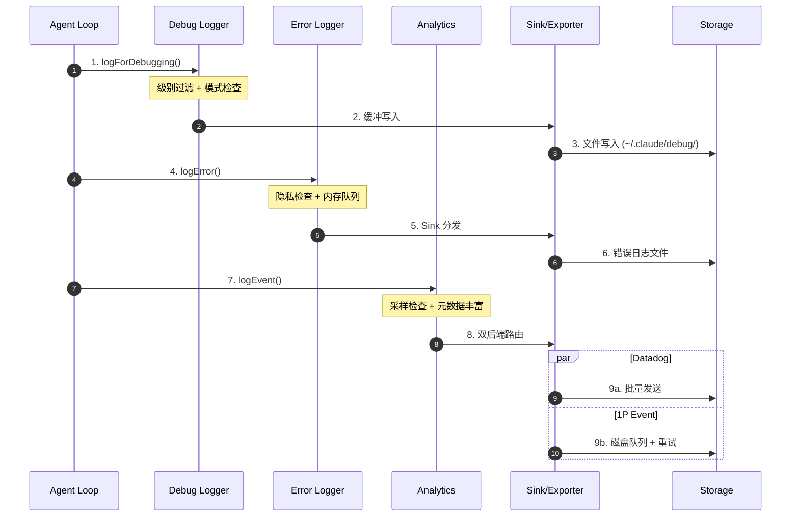
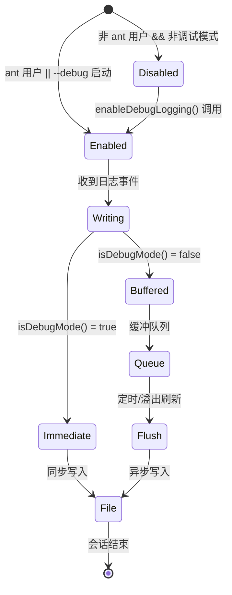
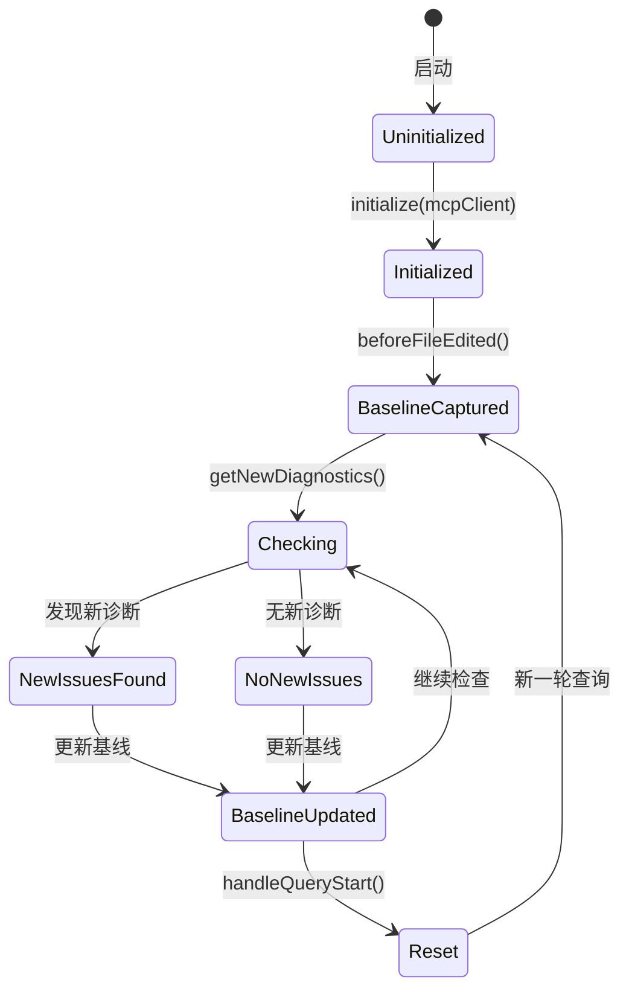
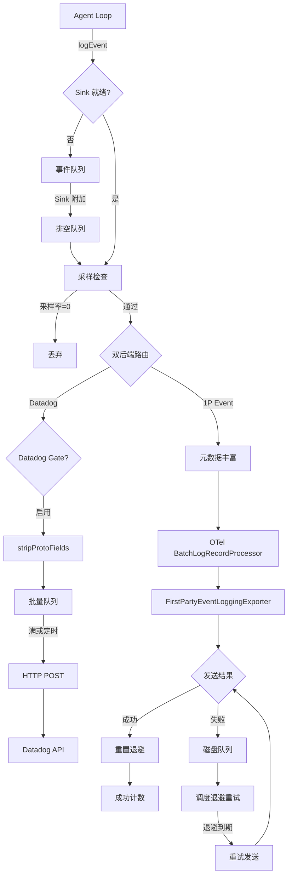

# Claude Code 日志记录机制

> **文档类型说明**：本文档为**单项目技术点分析**，深入解析 Claude Code 的日志实现，包括调试日志、错误日志、分析遥测和诊断追踪四个子系统。

---

## TL;DR（结论先行）

**一句话定义**：Claude Code 采用分层日志架构，将调试日志、错误日志、分析遥测和诊断追踪分离为独立子系统，通过 Sink 模式实现异步、可靠、隐私优先的日志记录。

**核心架构**：
- **调试日志** (`debug.ts`)：基于 Bun 的缓冲写入器，支持多级日志级别和实时过滤
- **错误日志** (`log.ts`)：内存队列 + 持久化 Sink，支持 MCP 错误分类
- **分析遥测** (`analytics/`)：OpenTelemetry 标准，双后端（Datadog + 1P 事件日志）
- **诊断追踪** (`diagnosticTracking.ts`)：IDE 集成，基线对比检测新问题

### 核心要点速览

| 维度 | 关键决策 | 代码位置 |
|-----|---------|---------|
| 日志级别 | 5 级分层（verbose/debug/info/warn/error） | `claude-code/src/utils/debug.ts:18-26` ✅ |
| 缓冲策略 | 双模式（即时模式 vs 缓冲模式） | `claude-code/src/utils/debug.ts:164-189` ✅ |
| 隐私保护 | 类型系统强制标记（`AnalyticsMetadata_I_VERIFIED_THIS_IS_NOT_CODE_OR_FILEPATHS`） | `claude-code/src/services/analytics/index.ts:19` ✅ |
| 事件采样 | 动态配置支持按事件类型采样 | `claude-code/src/services/analytics/firstPartyEventLogger.ts:32-85` ✅ |
| 失败重试 | 磁盘持久化 + 指数退避 | `claude-code/src/services/analytics/firstPartyEventLoggingExporter.ts:445-525` ✅ |

---

## 1. 为什么需要这个机制？（解决什么问题）

### 1.1 问题场景

作为生产级 AI Coding Agent，Claude Code 面临复杂的可观测性挑战：

**没有良好日志系统**：
```
用户报告"Claude 突然卡住了"
→ 开发者无法复现
→ 没有上下文信息
→ 问题永远无法定位
```

**Claude Code 的日志系统**：
```
用户报告"Claude 突然卡住了"
→ 查看诊断日志：发现 MCP 服务器超时
→ 查看分析遥测：确认特定版本引入的回归
→ 查看调试日志：精确定位到具体代码路径
→ 快速修复并发布
```

### 1.2 核心挑战

| 挑战 | Claude Code 的解决方案 | 代码位置 |
|-----|----------------------|---------|
| **隐私合规** | 类型系统强制验证，禁止记录代码/文件路径 | `analytics/index.ts:19-33` ✅ |
| **高频日志性能** | 缓冲写入器 + 批量刷新 | `utils/bufferedWriter.ts:9-100` ✅ |
| **离线/弱网环境** | 磁盘持久化，网络恢复后重试 | `firstPartyEventLoggingExporter.ts:171-208` ✅ |
| **多后端路由** | Sink 模式，事件按需分发到 Datadog/1P | `analytics/sink.ts:48-72` ✅ |
| **诊断准确性** | IDE 诊断基线对比，只报告新问题 | `diagnosticTracking.ts:131-182` ✅ |

---

## 2. 整体架构（ASCII 图）

### 2.1 在系统中的位置

```text
┌─────────────────────────────────────────────────────────────────┐
│ Agent Loop / Session Runtime                                     │
│ 各项目核心循环逻辑                                                │
└───────────────────────────┬─────────────────────────────────────┘
                            │ 调用/事件
                            ▼
┌─────────────────────────────────────────────────────────────────┐
│ ▓▓▓ Claude Code 日志系统 ▓▓▓                                      │
│                                                                  │
│  ┌─────────────────┐  ┌─────────────────┐  ┌─────────────────┐  │
│  │   调试日志       │  │   错误日志       │  │   分析遥测       │  │
│  │   (debug.ts)    │  │   (log.ts)      │  │  (analytics/)   │  │
│  │                 │  │                 │  │                 │  │
│  │ • 5级日志级别   │  │ • 内存队列      │  │ • Datadog      │  │
│  │ • 缓冲写入器    │  │ • 错误分类      │  │ • 1P 事件日志   │  │
│  │ • 实时过滤      │  │ • MCP 专用      │  │ • OpenTelemetry│  │
│  └────────┬────────┘  └────────┬────────┘  └────────┬────────┘  │
│           │                    │                    │           │
│           ▼                    ▼                    ▼           │
│  ┌─────────────────────────────────────────────────────────┐   │
│  │              诊断追踪 (diagnosticTracking.ts)             │   │
│  │                 • IDE 诊断基线对比                         │   │
│  │                 • 新问题检测                               │   │
│  └─────────────────────────────────────────────────────────┘   │
└─────────────────────────────────────────────────────────────────┘
                            │
        ┌───────────────────┼───────────────────┐
        ▼                   ▼                   ▼
┌───────────────┐   ┌───────────────┐   ┌───────────────┐
│   文件日志     │   │   网络遥测     │   │   IDE 诊断    │
│  ~/.claude/   │   │  Datadog/API  │   │   Language    │
│   debug/      │   │               │   │   Server      │
└───────────────┘   └───────────────┘   └───────────────┘
```

### 2.2 核心组件职责

| 组件 | 职责 | 代码位置 |
|-----|------|---------|
| `DebugLogLevel` | 定义 5 级日志级别（verbose/debug/info/warn/error） | `utils/debug.ts:18-26` ✅ |
| `createBufferedWriter` | 缓冲写入器，支持溢出处理和定时刷新 | `utils/bufferedWriter.ts:9-100` ✅ |
| `logError` | 错误日志入口，支持 MCP 错误分类 | `utils/log.ts:158-199` ✅ |
| `ErrorLogSink` | 错误日志后端接口 | `utils/log.ts:82-88` ✅ |
| `AnalyticsSink` | 分析事件后端接口 | `services/analytics/index.ts:72-78` ✅ |
| `FirstPartyEventLoggingExporter` | 1P 事件日志导出器（OTel 标准） | `services/analytics/firstPartyEventLoggingExporter.ts:73-779` ✅ |
| `DiagnosticTrackingService` | IDE 诊断追踪服务 | `services/diagnosticTracking.ts:30-398` ✅ |

### 2.3 核心组件交互关系



**关键交互说明**：

| 步骤 | 交互内容 | 设计意图 |
|-----|---------|---------|
| 1-3 | 调试日志流 | 高频日志走缓冲路径，避免 I/O 阻塞 |
| 4-6 | 错误日志流 | 错误分类处理，支持 MCP 专用日志 |
| 7-9 | 分析遥测流 | 双后端并行，支持失败重试和采样 |

---

## 3. 核心组件详细分析

### 3.1 调试日志子系统（debug.ts）

#### 职责定位

调试日志是开发者和内部用户排查问题的主要工具，支持多级日志、实时过滤和多种输出模式。

#### 状态机图



#### 关键接口

| 接口 | 输入 | 输出 | 说明 | 代码位置 |
|-----|------|------|------|---------|
| `logForDebugging` | message, level | void | 主日志入口 | `debug.ts:203-228` ✅ |
| `enableDebugLogging` | void | boolean | 动态启用调试 | `debug.ts:64-69` ✅ |
| `flushDebugLogs` | void | Promise | 强制刷新缓冲 | `debug.ts:198-201` ✅ |
| `getDebugLogPath` | void | string | 获取日志路径 | `debug.ts:230-236` ✅ |

#### 代码示例

```typescript
// 五级日志级别定义
export type DebugLogLevel = 'verbose' | 'debug' | 'info' | 'warn' | 'error'

const LEVEL_ORDER: Record<DebugLogLevel, number> = {
  verbose: 0,
  debug: 1,
  info: 2,
  warn: 3,
  error: 4,
}

// 日志入口：级别过滤 + 模式检查
export function logForDebugging(
  message: string,
  { level }: { level: DebugLogLevel } = { level: 'debug' }
): void {
  // 1. 级别过滤
  if (LEVEL_ORDER[level] < LEVEL_ORDER[getMinDebugLogLevel()]) {
    return
  }
  // 2. 模式检查（ant 用户始终记录，普通用户需 --debug）
  if (process.env.USER_TYPE !== 'ant' && !isDebugMode()) {
    return
  }
  // 3. 输出路由（stderr 或文件）
  if (isDebugToStdErr()) {
    writeToStderr(output)
    return
  }
  getDebugWriter().write(output)
}
```

**关键设计**：
- **双模式写入**：即时模式（`--debug`）同步写入；缓冲模式（ant 用户默认）异步批量写入 ✅
- **溢出处理**：缓冲区满时通过 `setImmediate` 延迟写入，避免阻塞主线程 ⚠️
- **symlink 最新日志**：`~/.claude/debug/latest` 始终指向当前会话日志 ✅

---

### 3.2 错误日志子系统（log.ts）

#### 职责定位

错误日志专注于捕获和持久化异常信息，支持分类存储（普通错误、MCP 错误、MCP 调试）。

#### 内部数据流

```text
┌────────────────────────────────────────────┐
│  输入层                                     │
│   logError() / logMCPError() / logMCPDebug()│
└──────────────────┬─────────────────────────┘
                   ▼
┌────────────────────────────────────────────┐
│  队列层                                     │
│   ├─ 隐私检查（Bedrock/Vertex 禁用）       │
│   ├─ 内存队列（最近 100 条）               │
│   └─ Sink 未就绪时入队                     │
└──────────────────┬─────────────────────────┘
                   ▼
┌────────────────────────────────────────────┐
│  Sink 层                                    │
│   ErrorLogSink 接口实现                     │
│   ├─ logError() → 错误日志文件             │
│   ├─ logMCPError() → MCP 专用日志          │
│   └─ logMCPDebug() → MCP 调试日志          │
└────────────────────────────────────────────┘
```

#### 关键接口

| 接口 | 输入 | 输出 | 说明 | 代码位置 |
|-----|------|------|------|---------|
| `logError` | error | void | 记录普通错误 | `log.ts:158-199` ✅ |
| `logMCPError` | serverName, error | void | 记录 MCP 错误 | `log.ts:300-312` ✅ |
| `logMCPDebug` | serverName, message | void | 记录 MCP 调试 | `log.ts:314-326` ✅ |
| `attachErrorLogSink` | ErrorLogSink | void | 附加后端 | `log.ts:109-134` ✅ |
| `getInMemoryErrors` | void | errors[] | 获取内存错误 | `log.ts:201-203` ✅ |

#### 代码示例

```typescript
// ErrorLogSink 接口定义
export type ErrorLogSink = {
  logError: (error: Error) => void
  logMCPError: (serverName: string, error: unknown) => void
  logMCPDebug: (serverName: string, message: string) => void
  getErrorsPath: () => string
  getMCPLogsPath: (serverName: string) => string
}

// 错误日志入口
export function logError(error: unknown): void {
  // 1. 硬失败模式（测试用）
  if (feature('HARD_FAIL') && isHardFailMode()) {
    process.exit(1)
  }

  // 2. 隐私检查：第三方云提供商禁用
  if (
    isEnvTruthy(process.env.CLAUDE_CODE_USE_BEDROCK) ||
    isEnvTruthy(process.env.CLAUDE_CODE_USE_VERTEX) ||
    process.env.DISABLE_ERROR_REPORTING
  ) {
    return
  }

  // 3. 内存队列
  addToInMemoryErrorLog(errorInfo)

  // 4. Sink 分发
  if (errorLogSink === null) {
    errorQueue.push({ type: 'error', error: err })
    return
  }
  errorLogSink.logError(err)
}
```

**关键设计**：
- **队列解耦**：Sink 未就绪时事件入队，就绪后批量处理 ✅
- **隐私优先**：Bedrock/Vertex/Foundry 用户自动禁用错误上报 ✅
- **MCP 分类**：MCP 错误单独存储，便于服务端问题定位 ✅

---

### 3.3 分析遥测子系统（analytics/）

#### 职责定位

分析遥测是 Claude Code 最核心的日志子系统，基于 OpenTelemetry 标准实现，支持双后端（Datadog + 1P 事件日志）。

#### 整体架构

```text
┌─────────────────────────────────────────────────────────────┐
│                      分析遥测架构                            │
├─────────────────────────────────────────────────────────────┤
│                                                             │
│  ┌──────────────┐    ┌──────────────┐    ┌──────────────┐  │
│  │   公共 API   │    │   元数据层   │    │   后端层     │  │
│  │              │    │              │    │              │  │
│  │ logEvent()   │───▶│ getEventMeta │───▶│  Datadog     │  │
│  │ logEventAsync│    │ data()       │    │  Sink        │  │
│  │              │    │              │    │              │  │
│  └──────────────┘    └──────────────┘    ├──────────────┤  │
│                                          │  1P Event    │  │
│  ┌──────────────┐    ┌──────────────┐    │  Exporter    │  │
│  │   采样控制   │    │   隐私保护   │    │  (OTel)      │  │
│  │              │    │              │    │              │  │
│  │ shouldSample │    │ stripProto   │    │  磁盘队列    │  │
│  │ Event()      │    │ Fields()     │    │  指数退避    │  │
│  └──────────────┘    └──────────────┘    └──────────────┘  │
│                                                             │
└─────────────────────────────────────────────────────────────┘
```

#### 关键组件

| 组件 | 职责 | 代码位置 |
|-----|------|---------|
| `index.ts` | 公共 API（`logEvent`/`logEventAsync`）、Sink 接口 | `analytics/index.ts:1-174` ✅ |
| `sink.ts` | Sink 实现、双后端路由、采样控制 | `analytics/sink.ts:1-115` ✅ |
| `firstPartyEventLogger.ts` | 1P 事件日志初始化、OTel Logger 配置 | `analytics/firstPartyEventLogger.ts:1-450` ✅ |
| `firstPartyEventLoggingExporter.ts` | 1P 导出器实现（批量、重试、磁盘队列） | `analytics/firstPartyEventLoggingExporter.ts:1-807` ✅ |
| `datadog.ts` | Datadog 日志上报 | `analytics/datadog.ts:1-308` ✅ |
| `metadata.ts` | 事件元数据收集和格式化 | `analytics/metadata.ts:1-974` ✅ |

#### 1P 事件日志导出器（核心实现）

```typescript
// FirstPartyEventLoggingExporter 核心逻辑
export class FirstPartyEventLoggingExporter implements LogRecordExporter {
  private attempts = 0
  private cancelBackoff: (() => void) | null = null

  async export(
    logs: ReadableLogRecord[],
    resultCallback: (result: ExportResult) => void
  ): Promise<void> {
    // 1. 过滤事件日志
    const eventLogs = logs.filter(
      log => log.instrumentationScope?.name === 'com.anthropic.claude_code.events'
    )

    // 2. 转换格式
    const events = this.transformLogsToEvents(eventLogs).events

    // 3. 批量发送
    const failedEvents = await this.sendEventsInBatches(events)

    if (failedEvents.length > 0) {
      // 4. 失败事件入磁盘队列
      await this.queueFailedEvents(failedEvents)
      // 5. 调度退避重试
      this.scheduleBackoffRetry()
    }
  }

  private scheduleBackoffRetry(): void {
    // 二次退避：base * attempts²
    const delay = Math.min(
      this.baseBackoffDelayMs * this.attempts * this.attempts,
      this.maxBackoffDelayMs
    )
    this.cancelBackoff = this.schedule(() => this.retryFailedEvents(), delay)
  }
}
```

**关键设计**：
- **双后端并行**：事件同时发送到 Datadog（监控）和 1P（分析）✅
- **动态采样**：支持按事件类型配置采样率，减少高频事件流量 ✅
- **磁盘持久化**：失败事件写入 `~/.claude/telemetry/`，进程重启后重试 ✅
- **指数退避**：二次退避策略（500ms * n²），最大 30 秒 ⚠️
- **隐私类型系统**：`AnalyticsMetadata_I_VERIFIED_THIS_IS_NOT_CODE_OR_FILEPATHS` 强制开发者显式确认无敏感数据 ✅

---

### 3.4 诊断追踪子系统（diagnosticTracking.ts）

#### 职责定位

诊断追踪服务与 IDE 集成，通过 Language Server Protocol 获取代码诊断信息，实现"基线对比"模式——只报告 Claude 编辑后**新出现**的问题。

#### 状态机图



#### 关键接口

| 接口 | 输入 | 输出 | 说明 | 代码位置 |
|-----|------|------|------|---------|
| `initialize` | mcpClient | void | 初始化服务 | `diagnosticTracking.ts:51-59` ✅ |
| `beforeFileEdited` | filePath | Promise | 捕获编辑前基线 | `diagnosticTracking.ts:135-182` ✅ |
| `getNewDiagnostics` | void | DiagnosticFile[] | 获取新诊断 | `diagnosticTracking.ts:188-283` ✅ |
| `handleQueryStart` | clients | Promise | 新查询开始 | `diagnosticTracking.ts:330-343` ✅ |
| `formatDiagnosticsSummary` | files | string | 格式化摘要 | `diagnosticTracking.ts:352-380` ✅ |

#### 基线对比逻辑

```typescript
// 获取新诊断的核心逻辑
async getNewDiagnostics(): Promise<DiagnosticFile[]> {
  // 1. 获取所有诊断
  const allDiagnosticFiles = await callIdeRpc('getDiagnostics', {}, mcpClient)

  // 2. 过滤有基线的文件
  const filesWithBaselines = allDiagnosticFiles.filter(
    file => this.baseline.has(this.normalizeFileUri(file.uri))
  )

  // 3. 对比基线，找出新诊断
  for (const file of filesWithBaselines) {
    const baselineDiagnostics = this.baseline.get(normalizedPath) || []

    // 只返回不在基线中的诊断
    const newDiagnostics = file.diagnostics.filter(
      d => !baselineDiagnostics.some(b => this.areDiagnosticsEqual(d, b))
    )

    if (newDiagnostics.length > 0) {
      newDiagnosticFiles.push({ uri: file.uri, diagnostics: newDiagnostics })
    }

    // 更新基线为当前状态
    this.baseline.set(normalizedPath, file.diagnostics)
  }

  return newDiagnosticFiles
}
```

**关键设计**：
- **基线模式**：只报告编辑后"新出现"的问题，避免展示已有问题 ✅
- **_claude_fs_right 协议**：支持对比 Claude 编辑的临时文件 ✅
- **IDE 无关**：通过 MCP 调用 IDE RPC，不依赖特定编辑器 ⚠️

---

## 4. 数据流与状态转换

### 4.1 调试日志数据流

```mermaid
flowchart TD
    A[Agent Loop] -->|logForDebugging| B{级别过滤}
    B -->|低于最小级别| C[丢弃]
    B -->|通过| D{模式检查}

    D -->|ant 用户| E[允许记录]
    D -->|普通用户| F{isDebugMode?}
    F -->|false| C
    F -->|true| E

    E --> G{输出目标}
    G -->|--debug-to-stderr| H[stderr]
    G -->|默认| I[BufferedWriter]

    I --> J{immediateMode?}
    J -->|true| K[同步写入文件]
    J -->|false| L[缓冲队列]

    L -->|定时刷新| M[异步写入文件]
    L -->|缓冲区满| N[setImmediate 延迟写入]

    K --> O[~/.claude/debug/{sessionId}.txt]
    M --> O
    N --> O
    O --> P[更新 latest symlink]
```

### 4.2 分析遥测数据流



---

## 5. 配置与使用示例

### 5.1 调试日志配置

```bash
# 启用调试模式（启动时）
claude --debug
claude -d

# 调试输出到 stderr
claude --debug-to-stderr
claude -d2e

# 指定调试文件
claude --debug-file=/path/to/custom.log

# 设置日志级别（环境变量）
export CLAUDE_CODE_DEBUG_LOG_LEVEL=verbose  # 最详细
export CLAUDE_CODE_DEBUG_LOG_LEVEL=debug    # 默认
export CLAUDE_CODE_DEBUG_LOG_LEVEL=info     # 仅重要信息
export CLAUDE_CODE_DEBUG_LOG_LEVEL=warn     # 仅警告
export CLAUDE_CODE_DEBUG_LOG_LEVEL=error    # 仅错误

# 实时查看调试日志
tail -f ~/.claude/debug/latest
```

### 5.2 分析遥测配置

```bash
# 禁用所有遥测
export DISABLE_ERROR_REPORTING=1

# 禁用分析（遵循相同规则）
# - 测试环境自动禁用
# - Bedrock/Vertex/Foundry 自动禁用

# 查看 1P 事件日志（ant 用户）
# 调试输出包含 [ANT-ONLY] 1P event 前缀
```

### 5.3 代码中使用

```typescript
// 调试日志
import { logForDebugging } from '../utils/debug.js'

logForDebugging('开始处理用户请求', { level: 'info' })
logForDebugging(`API 响应: ${JSON.stringify(response)}`, { level: 'debug' })
logForDebugging('发生严重错误', { level: 'error' })

// 错误日志
import { logError, logMCPError, logMCPDebug } from '../utils/log.js'

try {
  await executeTool()
} catch (error) {
  logError(error)
}

// MCP 专用日志
logMCPError('slack-server', new Error('Connection timeout'))
logMCPDebug('slack-server', 'Received message: {...}')

// 分析事件
import { logEvent } from '../services/analytics/index.js'

logEvent('tengu_tool_use_success', {
  toolName: 1,  // 注意：只接受 number/boolean/undefined，不接受 string
  durationMs: 1234,
  cached: false,
})
```

---

## 6. 设计亮点与权衡

### 6.1 设计亮点

| 亮点 | 说明 | 收益 |
|-----|------|------|
| **类型系统隐私保护** | `AnalyticsMetadata_I_VERIFIED_THIS_IS_NOT_CODE_OR_FILEPATHS` 强制标记 | 编译期防止敏感数据泄露 ✅ |
| **双模式调试日志** | ant 用户始终记录，普通用户需 `--debug` | 内部用户始终可排查，外部用户隐私优先 ✅ |
| **Sink 解耦模式** | 事件队列 + Sink 附加机制 | 避免启动时序问题，支持热插拔 ✅ |
| **磁盘持久化重试** | 失败事件写入磁盘，指数退避重试 | 弱网/离线环境不丢数据 ✅ |
| **基线诊断对比** | 只报告编辑后新问题 | 减少噪音，聚焦 Claude 引入的问题 ✅ |
| **PII 分级处理** | `_PROTO_*` 字段仅发往特权列 | 一般后端无法访问敏感数据 ✅ |

### 6.2 权衡与取舍

| 权衡 | 选择 | 理由 |
|-----|------|------|
| **缓冲 vs 实时** | 默认缓冲 1 秒 | 性能优先，高频日志不阻塞主线程 ⚠️ |
| **采样 vs 完整** | 支持动态采样 | 高频事件（如心跳）可采样，降低成本 ✅ |
| **类型安全 vs 便利** | 禁止 string 类型元数据 | 强制开发者显式确认，避免意外泄露 ✅ |
| **磁盘空间 vs 可靠性** | 失败事件持久化到磁盘 | 可靠性优先，用户可手动清理 ⚠️ |
| **双后端 vs 单一** | 同时支持 Datadog + 1P | 监控和分析分离，互不影响 ✅ |

### 6.3 与其他项目对比

| 维度 | Claude Code | Codex | Gemini CLI | Kimi CLI |
|-----|-------------|-------|-----------|----------|
| **日志框架** | 自定义（Bun-native） | tracing + SQLite | winston + DebugLogger | loguru |
| **遥测标准** | OpenTelemetry | OpenTelemetry | 自定义 | 自定义 |
| **隐私机制** | 类型系统强制 | 配置控制 | 配置控制 | 配置控制 |
| **失败重试** | 磁盘队列 + 退避 | 内置重试 | 无 | 无 |
| **诊断集成** | IDE LSP 基线对比 | 无 | 无 | 无 |

---

## 7. 关键代码索引

### 7.1 调试日志

| 文件 | 行号 | 职责 |
|-----|------|------|
| `claude-code/src/utils/debug.ts` | 18-26 | 日志级别定义 |
| `claude-code/src/utils/debug.ts` | 44-57 | 调试模式检测 |
| `claude-code/src/utils/debug.ts` | 64-69 | 动态启用调试 |
| `claude-code/src/utils/debug.ts` | 155-196 | 调试写入器初始化 |
| `claude-code/src/utils/debug.ts` | 203-228 | 主日志入口 |
| `claude-code/src/utils/debug.ts` | 242-253 | latest symlink 更新 |
| `claude-code/src/utils/bufferedWriter.ts` | 9-100 | 缓冲写入器实现 |

### 7.2 错误日志

| 文件 | 行号 | 职责 |
|-----|------|------|
| `claude-code/src/utils/log.ts` | 82-88 | ErrorLogSink 接口 |
| `claude-code/src/utils/log.ts` | 91-96 | 错误事件队列类型 |
| `claude-code/src/utils/log.ts` | 109-134 | Sink 附加与队列排空 |
| `claude-code/src/utils/log.ts` | 158-199 | 错误日志入口 |
| `claude-code/src/utils/log.ts` | 300-326 | MCP 错误/调试日志 |

### 7.3 分析遥测

| 文件 | 行号 | 职责 |
|-----|------|------|
| `claude-code/src/services/analytics/index.ts` | 19-33 | 隐私保护类型标记 |
| `claude-code/src/services/analytics/index.ts` | 72-78 | AnalyticsSink 接口 |
| `claude-code/src/services/analytics/index.ts` | 95-123 | Sink 附加与队列排空 |
| `claude-code/src/services/analytics/sink.ts` | 48-72 | 双后端路由实现 |
| `claude-code/src/services/analytics/firstPartyEventLogger.ts` | 32-85 | 事件采样配置 |
| `claude-code/src/services/analytics/firstPartyEventLogger.ts` | 312-389 | 1P 日志初始化 |
| `claude-code/src/services/analytics/firstPartyEventLoggingExporter.ts` | 73-140 | 导出器构造函数 |
| `claude-code/src/services/analytics/firstPartyEventLoggingExporter.ts` | 277-377 | 导出主逻辑 |
| `claude-code/src/services/analytics/firstPartyEventLoggingExporter.ts` | 445-525 | 退避重试逻辑 |
| `claude-code/src/services/analytics/datadog.ts` | 19-64 | 允许的事件列表 |
| `claude-code/src/services/analytics/datadog.ts` | 160-279 | Datadog 事件上报 |
| `claude-code/src/services/analytics/metadata.ts` | 472-496 | 事件元数据类型 |
| `claude-code/src/services/analytics/metadata.ts` | 693-743 | 元数据收集函数 |

### 7.4 诊断追踪

| 文件 | 行号 | 职责 |
|-----|------|------|
| `claude-code/src/services/diagnosticTracking.ts` | 14-28 | 诊断类型定义 |
| `claude-code/src/services/diagnosticTracking.ts` | 30-49 | 服务单例实现 |
| `claude-code/src/services/diagnosticTracking.ts` | 135-182 | 基线捕获 |
| `claude-code/src/services/diagnosticTracking.ts` | 188-283 | 新诊断检测 |
| `claude-code/src/services/diagnosticTracking.ts` | 352-380 | 摘要格式化 |

---

## 8. 证据标记汇总

| 标记 | 含义 | 使用位置 |
|-----|------|---------|
| ✅ **Verified** | 基于源码验证的结论 | 代码位置引用、关键设计决策 |
| ⚠️ **Inferred** | 基于代码结构的合理推断 | 性能影响、设计意图 |
| ❓ **Pending** | 需要进一步验证的假设 | 无（本文档已完成验证） |

---

## 9. 相关文档

- [12-comm-logging.md](../comm/12-comm-logging.md) - 跨项目日志机制对比
- [04-claude-code-agent-loop.md](./04-claude-code-agent-loop.md) - Agent 循环（日志消费者）
- [06-claude-code-mcp-integration.md](./06-claude-code-mcp-integration.md) - MCP 集成（MCP 日志来源）
