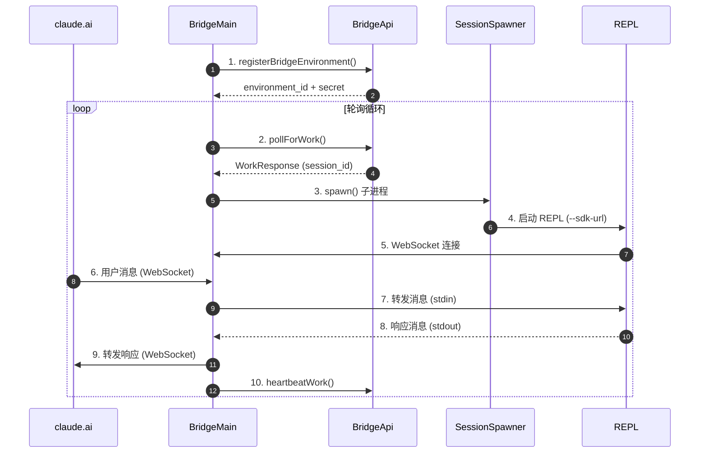
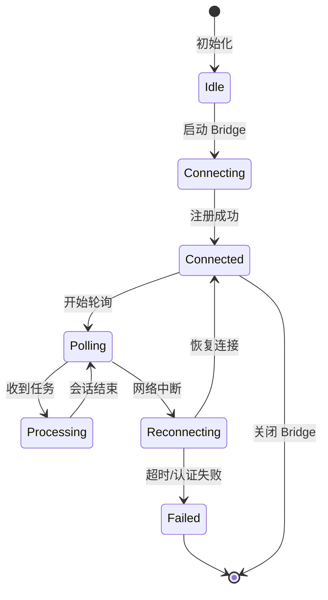
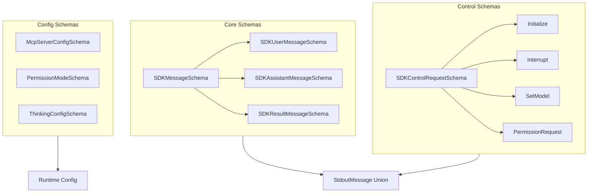
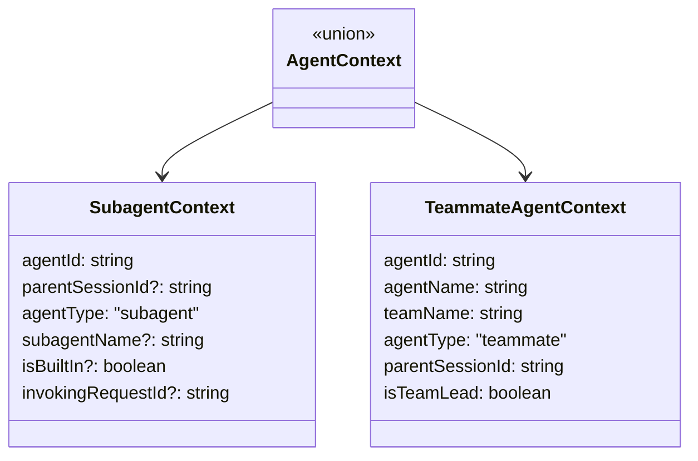
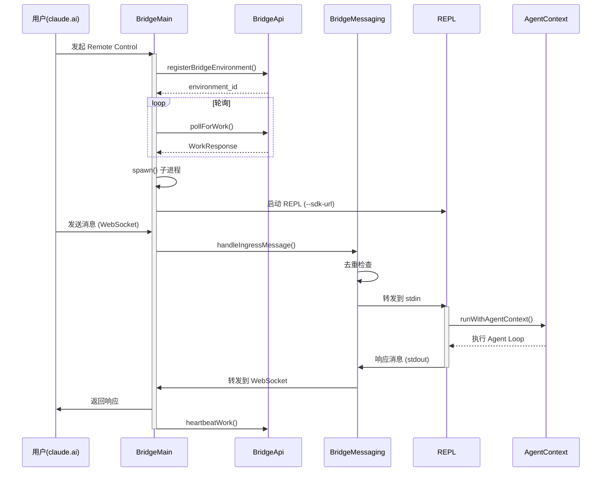
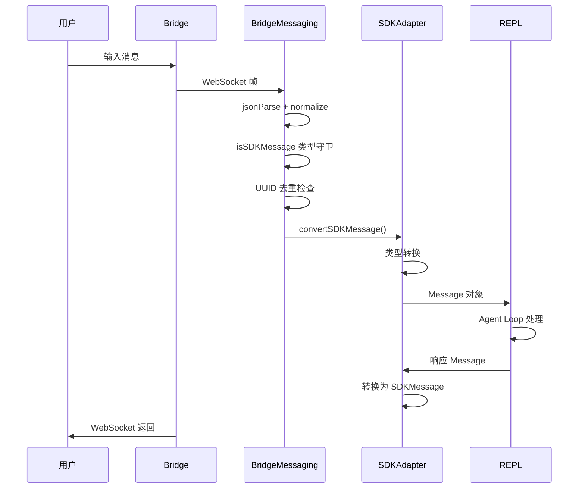
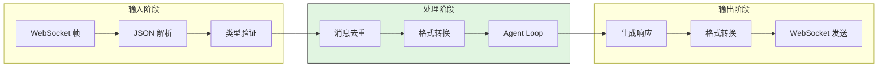
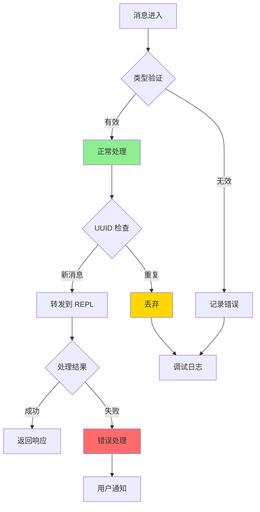
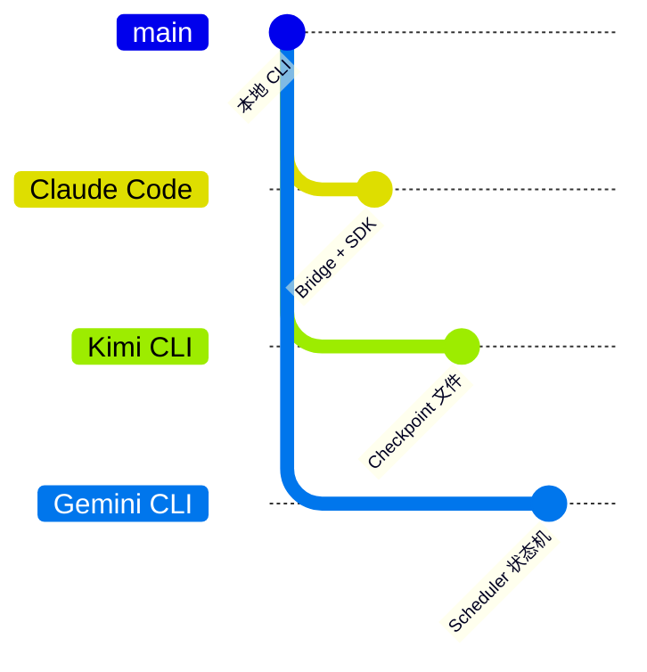

# Claude Code ACP (Agent Context Protocol) Integration

## TL;DR（结论先行）

一句话定义：ACP 是 Claude Code 的**Agent 上下文协议**，通过标准化 SDK 接口、Bridge 桥接层和异步上下文追踪，实现本地 REPL 与远程 claude.ai 之间的双向通信和状态同步。

Claude Code 的核心取舍：**SDK 类型安全优先 + Bridge 长连接轮询**（对比其他项目的本地优先架构）

### 核心要点速览

| 维度 | 关键决策 | 代码位置 |
|-----|---------|---------|
| 协议设计 | 基于 Zod Schema 的强类型 SDK 消息协议 | `src/entrypoints/sdk/coreSchemas.ts:1` |
| 连接架构 | Bridge 长轮询 + WebSocket 双通道 | `src/bridge/bridgeMain.ts:141` |
| 上下文追踪 | AsyncLocalStorage 异步上下文隔离 | `src/utils/agentContext.ts:93` |
| 消息转换 | SDKMessage 与内部 Message 双向适配 | `src/remote/sdkMessageAdapter.ts:168` |

---

## 1. 为什么需要 ACP？（解决什么问题）

### 1.1 问题场景

没有 ACP 时，Claude Code 作为纯本地 CLI 工具存在以下限制：

```
无 ACP：
  → 用户只能在终端与 Claude 交互
  → 会话状态完全本地存储，无法跨设备恢复
  → 无法从 claude.ai 网页端控制本地会话
  → 多 Agent 协作时上下文容易混淆

有 ACP：
  → 本地 REPL ←→ Bridge ←→ claude.ai 双向通信
  → 会话状态可同步到云端，支持跨设备恢复
  → 网页端可发送消息、中断会话、修改配置
  → AsyncLocalStorage 确保并发 Agent 上下文隔离
```

### 1.2 核心挑战

| 挑战 | 不解决的后果 |
|-----|-------------|
| 协议兼容性 | 本地与远程消息格式不一致，导致通信失败 |
| 连接稳定性 | 网络波动导致会话中断，用户体验差 |
| 上下文隔离 | 多 Agent 并发时事件归因错误，分析数据混乱 |
| 状态同步 | 本地与远程状态不一致，出现"幽灵会话" |

---

## 2. 整体架构（ASCII 图）

### 2.1 在系统中的位置

```text
┌─────────────────────────────────────────────────────────────┐
│ claude.ai / Remote Control                                   │
│ Web 界面、远程会话管理                                        │
└───────────────────────┬─────────────────────────────────────┘
                        │ WebSocket / HTTP
                        ▼
┌─────────────────────────────────────────────────────────────┐
│ ▓▓▓ Bridge 层 ▓▓▓                                           │
│ src/bridge/bridgeMain.ts                                     │
│ - runBridgeLoop(): 核心轮询循环                              │
│ - pollForWork(): 获取远程任务                                │
│ - heartbeatWork(): 保活心跳                                  │
│ - sessionRunner.ts: 子进程管理                               │
└───────────────────────┬─────────────────────────────────────┘
                        │ SDK URL / Stdio
                        ▼
┌─────────────────────────────────────────────────────────────┐
│ ▓▓▓ SDK 层 ▓▓▓                                              │
│ src/entrypoints/sdk/                                         │
│ - coreSchemas.ts: Zod 类型定义                               │
│ - controlSchemas.ts: 控制协议                                │
│ - agentSdkTypes.ts: 公共 API                                 │
└───────────────────────┬─────────────────────────────────────┘
                        │ 内部消息格式
                        ▼
┌─────────────────────────────────────────────────────────────┐
│ REPL / Agent Loop                                            │
│ src/commands/start.tsx                                       │
│ src/utils/agentContext.ts: 异步上下文追踪                     │
└─────────────────────────────────────────────────────────────┘
```

### 2.2 核心组件职责

| 组件 | 职责 | 代码位置 |
|-----|------|---------|
| `BridgeMain` | 管理 Bridge 生命周期、轮询远程任务、保活心跳 | `src/bridge/bridgeMain.ts:141` |
| `BridgeApiClient` | 封装 Bridge HTTP API 调用 | `src/bridge/bridgeApi.ts:68` |
| `SessionSpawner` | .spawn() 启动子 CLI 进程处理会话 | `src/bridge/sessionRunner.ts:248` |
| `SDKMessageAdapter` | SDKMessage 与内部 Message 双向转换 | `src/remote/sdkMessageAdapter.ts:168` |
| `AgentContext` | AsyncLocalStorage 追踪 Agent 身份 | `src/utils/agentContext.ts:93` |
| `BridgeMessaging` | WebSocket 消息路由、去重、控制请求处理 | `src/bridge/bridgeMessaging.ts:132` |

### 2.3 核心组件交互关系



**关键交互说明**：

| 步骤 | 交互内容 | 设计意图 |
|-----|---------|---------|
| 1-2 | Bridge 注册并轮询任务 | 解耦本地与远程，支持异步任务派发 |
| 3-4 | 按需 spawn 子进程 | 每个会话独立进程，隔离崩溃影响 |
| 5-9 | WebSocket 双向消息转发 | 实时通信，支持中断、配置修改等控制操作 |
| 10 | 定期心跳保活 | 防止会话过期，支持租约续期 |

---

## 3. 核心组件详细分析

### 3.1 Bridge 层内部结构

#### 职责定位

Bridge 层是 Claude Code 与 claude.ai 之间的**双向网关**，负责：
- 向服务器注册本地环境
- 长轮询获取远程任务
- 管理会话子进程生命周期
- 转发双向消息流
- 处理控制请求（中断、改模型等）

#### 状态机图



**状态说明**：

| 状态 | 说明 | 进入条件 | 退出条件 |
|-----|------|---------|---------|
| Idle | 空闲等待 | 初始化完成 | 调用 runBridgeLoop |
| Connecting | 连接中 | 开始注册环境 | 收到 environment_id |
| Connected | 已连接 | 注册成功 | 开始轮询或断开 |
| Polling | 轮询等待 | 连接成功 | 收到任务或中断 |
| Processing | 处理任务 | 收到 WorkResponse | 会话完成 |
| Reconnecting | 重连中 | 网络错误 | 恢复或放弃 |
| Failed | 失败 | 认证失败/超时 | 终止 |

#### 内部数据流

```text
┌────────────────────────────────────────────┐
│  入口层                                     │
│   pollForWork() → 解析 WorkResponse        │
└──────────────────┬─────────────────────────┘
                   ▼
┌────────────────────────────────────────────┐
│  会话管理层                                 │
│   spawn() → SessionHandle → 子进程监控      │
│   heartbeatWork() 定期保活                 │
└──────────────────┬─────────────────────────┘
                   ▼
┌────────────────────────────────────────────┐
│  消息转发层                                 │
│   WebSocket ←→ stdin/stdout 双向转换       │
│   控制请求路由 (interrupt, set_model)      │
└────────────────────────────────────────────┘
```

---

### 3.2 SDK 类型系统内部结构

#### 职责定位

SDK 类型系统是 ACP 的**协议契约层**，通过 Zod Schema 定义：
- 消息格式（user/assistant/result/system）
- 控制协议（initialize/interrupt/set_model）
- MCP 服务器配置
- 权限系统

#### 核心 Schema 层级



#### 关键接口

| 接口 | 输入 | 输出 | 说明 | 代码位置 |
|-----|------|------|------|---------|
| `SDKMessageSchema` | 未知数据 | 类型化消息 | 消息类型守卫 | `coreSchemas.ts:1` |
| `SDKControlRequestSchema` | 控制 JSON | 类型化请求 | 控制协议解析 | `controlSchemas.ts:578` |
| `convertSDKMessage()` | SDKMessage | Message | 消息格式转换 | `sdkMessageAdapter.ts:168` |

---

### 3.3 AgentContext 异步上下文追踪

#### 职责定位

AgentContext 使用 **AsyncLocalStorage** 实现异步调用链的上下文隔离，解决多 Agent 并发时的身份追踪问题。

#### 为什么用 AsyncLocalStorage（而非 AppState）

```text
AppState 的问题：
  → 全局单例状态
  → Agent A 的上下文会被 Agent B 覆盖
  → 事件归因错误

AsyncLocalStorage 的优势：
  → 每个异步调用链独立存储
  → Agent A 和 Agent B 上下文互不干扰
  → 支持嵌套子 Agent 调用
```

#### 上下文类型



---

### 3.4 组件间协作时序

展示 Bridge 如何处理一次完整的远程控制会话。



**协作要点**：

1. **BridgeMain 与 BridgeApi**：HTTP 轮询获取任务，JWT 认证
2. **BridgeMessaging 与 REPL**：WebSocket 消息路由，支持控制请求
3. **AgentContext 与 REPL**：AsyncLocalStorage 确保并发安全

---

## 4. 端到端数据流转

### 4.1 正常流程（详细版）

展示从用户输入到响应的完整数据变换。



**数据变换详情**：

| 阶段 | 输入 | 处理 | 输出 | 代码位置 |
|-----|------|------|------|---------|
| 接收 | WebSocket 帧 | jsonParse | unknown | `bridgeMessaging.ts:141` |
| 验证 | unknown | Zod Schema | SDKMessage | `coreSchemas.ts:1` |
| 转换 | SDKMessage | 字段映射 | Message | `sdkMessageAdapter.ts:168` |
| 输出 | Message | 渲染 | 用户界面 | REPL 组件 |

### 4.2 数据流向图



### 4.3 异常/边界流程



---

## 5. 关键代码实现

### 5.1 核心数据结构

**BridgeConfig 配置结构**（`src/bridge/types.ts:81`）：

```typescript
export type BridgeConfig = {
  dir: string                    // 工作目录
  machineName: string            // 机器名
  branch: string                 // Git 分支
  gitRepoUrl: string | null      // Git 仓库 URL
  maxSessions: number            // 最大并发会话数
  spawnMode: SpawnMode           // 'single-session' | 'worktree' | 'same-dir'
  verbose: boolean               // 调试模式
  sandbox: boolean               // 沙箱模式
  bridgeId: string               // Bridge 实例 ID
  workerType: string             // 'claude_code' | 'claude_code_assistant'
  environmentId: string          // 环境 ID
  apiBaseUrl: string             // API 基础 URL
  sessionIngressUrl: string      // WebSocket 入口 URL
}
```

**AgentContext 联合类型**（`src/utils/agentContext.ts:91`）：

```typescript
export type AgentContext = SubagentContext | TeammateAgentContext

export type SubagentContext = {
  agentId: string
  parentSessionId?: string
  agentType: 'subagent'
  subagentName?: string
  isBuiltIn?: boolean
  invokingRequestId?: string
  invocationKind?: 'spawn' | 'resume'
}
```

### 5.2 主链路代码

**关键代码**（Bridge 轮询循环）：

```typescript
// src/bridge/bridgeMain.ts:141-270
export async function runBridgeLoop(
  config: BridgeConfig,
  environmentId: string,
  environmentSecret: string,
  api: BridgeApiClient,
  spawner: SessionSpawner,
  logger: BridgeLogger,
  signal: AbortSignal,
): Promise<void> {
  const activeSessions = new Map<string, SessionHandle>()
  const sessionIngressTokens = new Map<string, string>()

  // 心跳保活
  async function heartbeatActiveWorkItems(): Promise<'ok' | 'auth_failed' | 'fatal' | 'failed'> {
    for (const [sessionId] of activeSessions) {
      const workId = sessionWorkIds.get(sessionId)
      const ingressToken = sessionIngressTokens.get(sessionId)
      if (!workId || !ingressToken) continue

      try {
        await api.heartbeatWork(environmentId, workId, ingressToken)
      } catch (err) {
        if (err instanceof BridgeFatalError && (err.status === 401 || err.status === 403)) {
          // JWT 过期，触发重新派发
          await api.reconnectSession(environmentId, sessionId)
        }
      }
    }
  }

  // 主轮询循环
  while (!signal.aborted) {
    const work = await api.pollForWork(environmentId, environmentSecret, signal)
    if (!work) continue

    // 启动会话子进程
    const handle = spawner.spawn({
      sessionId: work.data.id,
      sdkUrl: buildSdkUrl(work.secret),
      accessToken: decodeWorkSecret(work.secret).session_ingress_token,
    }, config.dir)

    activeSessions.set(work.data.id, handle)
  }
}
```

**设计意图**：
1. **Map 管理会话状态**：activeSessions 追踪所有活跃会话
2. **独立心跳**：每个会话独立心跳，避免单点故障
3. **JWT 过期处理**：401/403 时触发 reconnectSession 重新派发
4. **信号驱动取消**：AbortSignal 支持优雅关闭

<details>
<summary>查看完整实现（消息处理）</summary>

```typescript
// src/bridge/bridgeMessaging.ts:132-208
export function handleIngressMessage(
  data: string,
  recentPostedUUIDs: BoundedUUIDSet,
  recentInboundUUIDs: BoundedUUIDSet,
  onInboundMessage?: (msg: SDKMessage) => void,
  onPermissionResponse?: (response: SDKControlResponse) => void,
  onControlRequest?: (request: SDKControlRequest) => void,
): void {
  const parsed = normalizeControlMessageKeys(jsonParse(data))

  // 控制响应消息
  if (isSDKControlResponse(parsed)) {
    onPermissionResponse?.(parsed)
    return
  }

  // 控制请求消息
  if (isSDKControlRequest(parsed)) {
    onControlRequest?.(parsed)
    return
  }

  if (!isSDKMessage(parsed)) return

  // UUID 去重（防止回显）
  const uuid = 'uuid' in parsed ? parsed.uuid : undefined
  if (uuid && recentPostedUUIDs.has(uuid)) {
    return // 忽略回显
  }

  // 重复投递检查
  if (uuid && recentInboundUUIDs.has(uuid)) {
    return // 已处理过
  }

  if (parsed.type === 'user') {
    if (uuid) recentInboundUUIDs.add(uuid)
    void onInboundMessage?.(parsed)
  }
}
```

</details>

### 5.3 关键调用链

```text
runBridgeLoop()           [src/bridge/bridgeMain.ts:141]
  -> pollForWork()        [src/bridge/bridgeApi.ts:199]
    -> axios.get()        HTTP 长轮询
  -> spawner.spawn()      [src/bridge/sessionRunner.ts:248]
    -> spawn()            启动子进程
      -> --sdk-url        传入 SDK 连接 URL
  -> handleIngressMessage() [src/bridge/bridgeMessaging.ts:132]
    -> isSDKMessage()     类型守卫
    -> convertSDKMessage() [src/remote/sdkMessageAdapter.ts:168]
      -> Message 对象     内部消息格式
```

---

## 6. 设计意图与 Trade-off

### 6.1 Claude Code 的选择

| 维度 | Claude Code 的选择 | 替代方案 | 取舍分析 |
|-----|-------------------|---------|---------|
| 连接模式 | Bridge 长轮询 + WebSocket | 纯 WebSocket / HTTP SSE | 轮询兼容性好，WebSocket 实时性高，但实现复杂 |
| 类型系统 | Zod Schema 运行时验证 | TypeScript 仅编译时 | 运行时安全，但性能开销略高 |
| 上下文追踪 | AsyncLocalStorage | 全局状态 / 参数传递 | 并发安全，但 Node.js 特定 |
| 进程模型 | 每会话独立子进程 | 单进程多线程 | 隔离性好，但内存占用高 |

### 6.2 为什么这样设计？

**核心问题**：如何在保证类型安全的同时，实现本地与远程的无缝协作？

**Claude Code 的解决方案**：
- **代码依据**：`src/entrypoints/sdk/coreSchemas.ts:1`
- **设计意图**：
  - Zod Schema 作为单一真相源，类型从 Schema 生成
  - Bridge 层解耦本地与远程，支持多种部署模式
  - AsyncLocalStorage 解决 Node.js 异步上下文追踪难题
- **带来的好处**：
  - 类型安全：运行时验证捕获协议不匹配
  - 可扩展：新增消息类型只需修改 Schema
  - 可测试：依赖注入设计便于 Mock
- **付出的代价**：
  - 构建步骤：需要生成类型文件
  - 运行时开销：Zod 验证消耗 CPU
  - 复杂度：多层抽象增加理解成本

### 6.3 与其他项目的对比



| 项目 | 核心差异 | 适用场景 |
|-----|---------|---------|
| Claude Code | Bridge 桥接 + SDK 协议 | 需要远程控制的企业环境 |
| Kimi CLI | Checkpoint 文件回滚 | 重视状态持久化的本地使用 |
| Gemini CLI | Scheduler 状态机 | 复杂任务调度场景 |
| Codex | Actor 消息驱动 | 高并发沙箱环境 |

---

## 7. 边界情况与错误处理

### 7.1 终止条件

| 终止原因 | 触发条件 | 代码位置 |
|---------|---------|---------|
| 用户断开 | 调用 /remote-control 关闭 | `src/bridge/bridgeMain.ts` |
| 会话超时 | 24 小时无活动 | `src/bridge/types.ts:2` |
| 认证过期 | JWT 401/403 | `src/bridge/bridgeApi.ts:229` |
| 环境过期 | 410 Gone | `src/bridge/bridgeApi.ts:487` |
| 强制停止 | stopWork() 调用 | `src/bridge/bridgeApi.ts:273` |

### 7.2 超时/资源限制

```typescript
// src/bridge/types.ts:2
export const DEFAULT_SESSION_TIMEOUT_MS = 24 * 60 * 60 * 1000 // 24 小时

// src/bridge/bridgeApi.ts:182
const timeout = 15_000 // 注册超时 15s

// src/bridge/bridgeApi.ts:220
const timeout = 10_000 // 轮询超时 10s
```

### 7.3 错误恢复策略

| 错误类型 | 处理策略 | 代码位置 |
|---------|---------|---------|
| 网络中断 | 指数退避重连 | `src/bridge/bridgeMain.ts:72` |
| JWT 过期 | reconnectSession 重新派发 | `src/bridge/bridgeApi.ts:358` |
| 409 冲突 | 采用服务器 UUID 重试 | `src/services/api/sessionIngress.ts:90` |
| 子进程崩溃 | 清理会话状态，等待新任务 | `src/bridge/bridgeMain.ts` |

---

## 8. 关键代码索引

| 功能 | 文件 | 行号 | 说明 |
|-----|------|------|------|
| Bridge 入口 | `src/bridge/bridgeMain.ts` | 141 | runBridgeLoop 主循环 |
| API 客户端 | `src/bridge/bridgeApi.ts` | 68 | createBridgeApiClient |
| 类型定义 | `src/bridge/types.ts` | 1 | Bridge 核心类型 |
| SDK Schema | `src/entrypoints/sdk/coreSchemas.ts` | 1 | Zod Schema 定义 |
| 控制协议 | `src/entrypoints/sdk/controlSchemas.ts` | 1 | 控制请求/响应 |
| SDK 类型 | `src/entrypoints/agentSdkTypes.ts` | 1 | 公共 API 导出 |
| 消息适配 | `src/remote/sdkMessageAdapter.ts` | 168 | SDKMessage 转换 |
| 消息路由 | `src/bridge/bridgeMessaging.ts` | 132 | handleIngressMessage |
| 上下文追踪 | `src/utils/agentContext.ts` | 93 | AsyncLocalStorage |
| 会话管理 | `src/bridge/sessionRunner.ts` | 248 | SessionSpawner |
| 会话持久化 | `src/services/api/sessionIngress.ts` | 193 | appendSessionLog |
| SDK 事件队列 | `src/utils/sdkEventQueue.ts` | 77 | enqueueSdkEvent |

---

## 9. 延伸阅读

- 前置知识：`01-claude-code-overview.md`、`03-claude-code-session-runtime.md`
- 相关机制：`04-claude-code-agent-loop.md`、`08-claude-code-ui-interaction.md`
- 深度分析：
  - `docs/comm/comm-what-is-acp.md` - ACP 协议概述
  - `docs/comm/13-comm-acp-integration.md` - 跨项目 ACP 对比

---

*✅ Verified: 基于 claude-code/src/bridge/bridgeMain.ts:141、src/utils/agentContext.ts:93、src/entrypoints/sdk/coreSchemas.ts:1 等源码分析*
*基于版本：2026-03-31 | 最后更新：2026-03-31*
