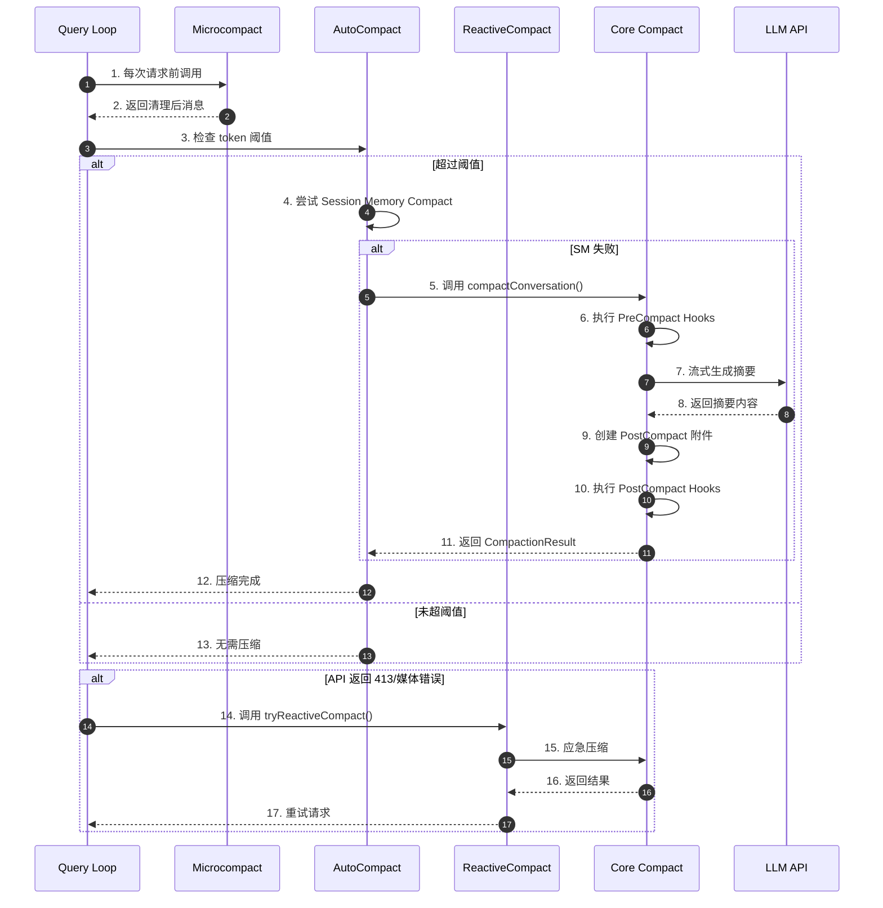
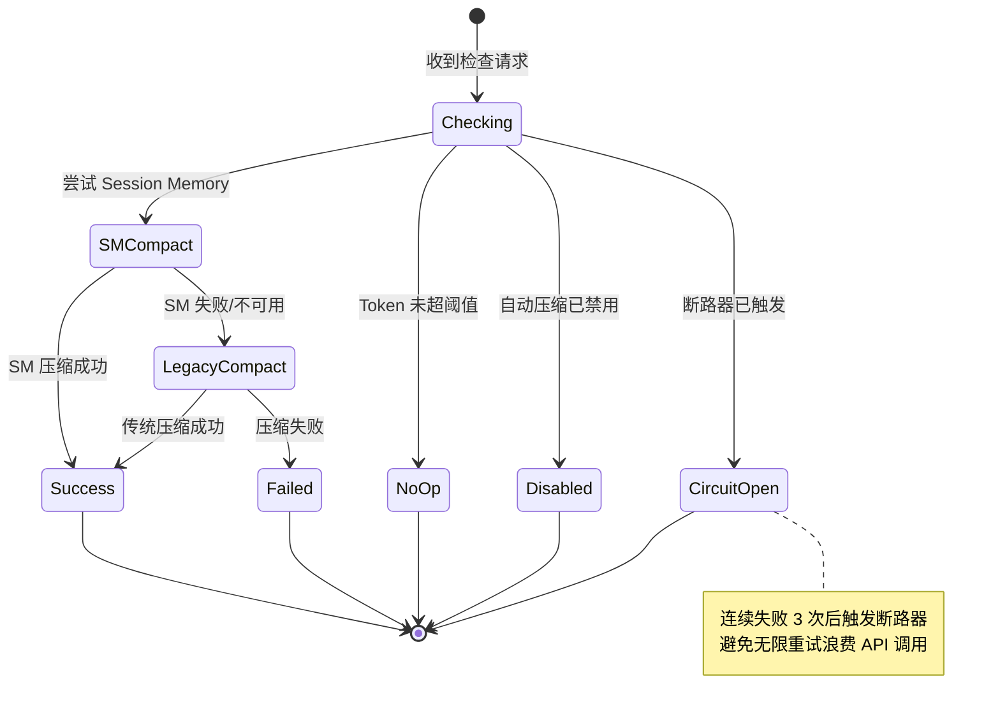
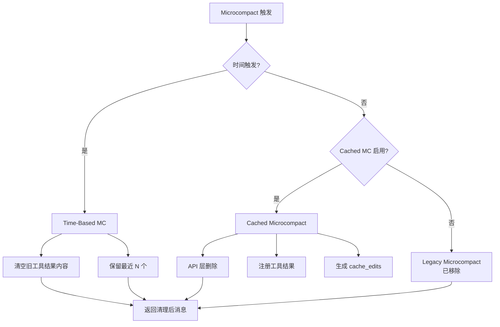
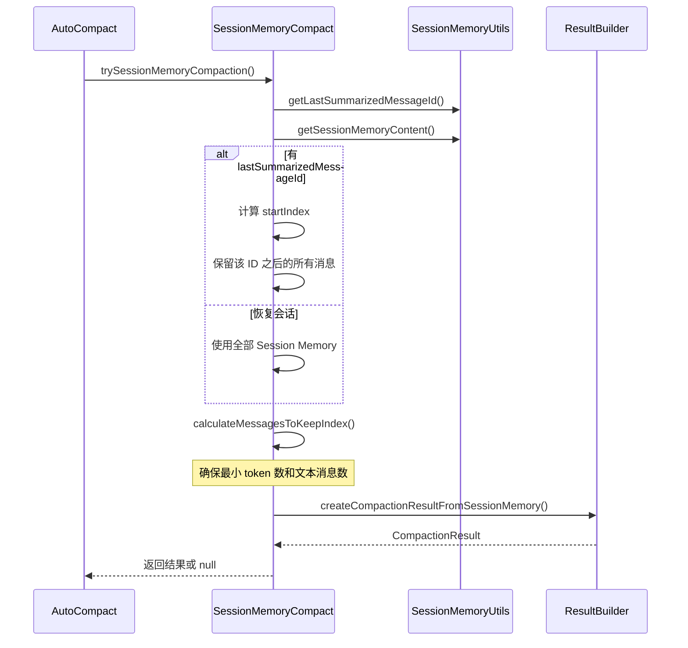
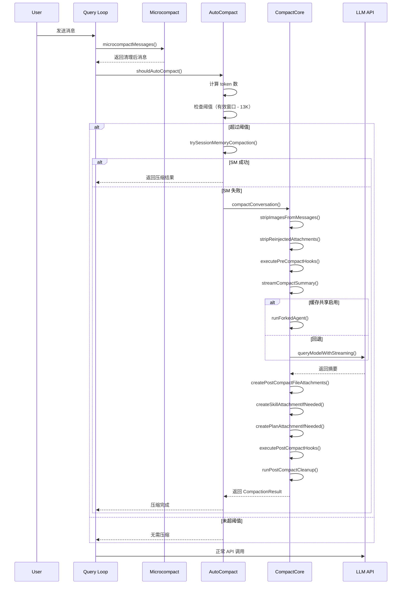
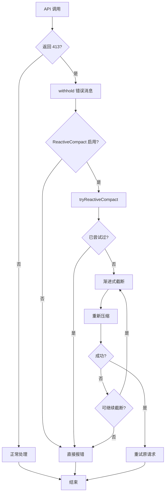
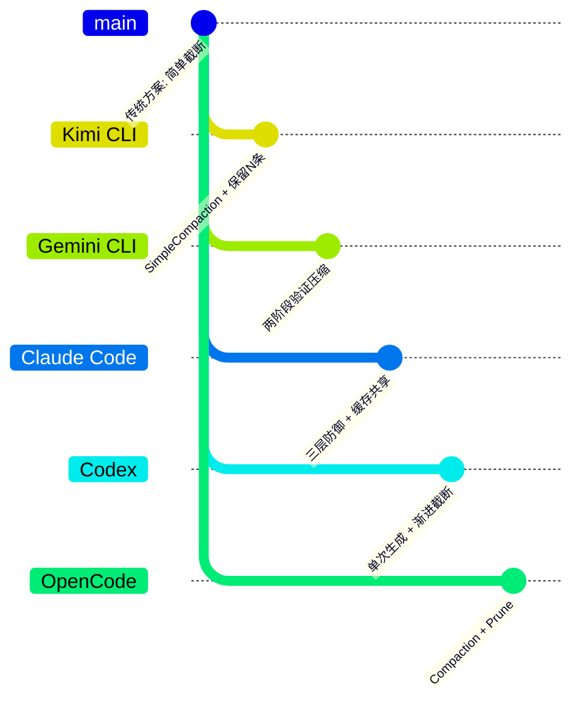

# Claude Code 上下文压缩机制

> **阅读指南**
>
> | 属性 | 说明 |
> |-----|------|
> | 预计阅读 | 30-40 分钟 |
> | 前置文档 | `docs/claude-code/04-claude-agent-loop.md`、`docs/claude-code/07-claude-memory-context.md` |
> | 文档结构 | 速览 → 架构 → 机制 → 实现 → 对比 |
> | 代码呈现 | 关键代码直接展示，完整代码可折叠查看 |

---

## TL;DR（结论先行）

**一句话定义**：Context Compaction 是 AI Coding Agent 解决上下文窗口超限的核心机制，通过将历史消息压缩为摘要来释放 token 预算。

Claude Code 的核心取舍：**多层防御体系（Microcompact + AutoCompact + ReactiveCompact）+ 提示缓存共享**（对比 Kimi CLI 的简单保留策略、Gemini CLI 的两阶段验证压缩）

### 核心要点速览

| 维度 | 关键决策 | 代码位置 |
|-----|---------|---------|
| 压缩策略 | 三层防御：Microcompact → AutoCompact → ReactiveCompact | `claude-code/src/services/compact/` |
| 触发条件 | Token 阈值（默认有效窗口 -13K 缓冲） | `claude-code/src/services/compact/autoCompact.ts:72` |
| 摘要生成 | 单次 LLM 调用 + 详细提示词模板 | `claude-code/src/services/compact/prompt.ts:61` |
| 缓存优化 | Forked Agent 复用主对话缓存前缀 | `claude-code/src/services/compact/compact.ts:1178` |
| 失败处理 | PTL 重试 + 断路器 + 渐进式截断 | `claude-code/src/services/compact/compact.ts:243` |

---

## 1. 为什么需要这个机制？

### 1.1 问题场景

没有 Context Compaction：
```
用户: "分析这个大型项目并修复 bug"
  -> LLM 调用工具读取文件（产生大量输出）
  -> Token 数迅速达到 200K 上限
  -> API 返回 prompt_too_long 错误，对话中断
```

有 Context Compaction：
```
用户: "分析这个大型项目并修复 bug"
  -> LLM 调用工具读取文件
  -> Token 接近上限，触发 AutoCompact
  -> 历史消息被摘要替换，释放预算
  -> 任务继续完成
```

### 1.2 核心挑战

| 挑战 | 不解决的后果 |
|-----|-------------|
| Token 上限硬性限制 | 长对话无法完成，任务中断 |
| 压缩可能丢失关键信息 | 丢失用户原始需求或技术决策 |
| 工具输出过大 | 单次工具调用挤占全部上下文空间 |
| 压缩成本 | 频繁压缩导致 API 费用增加 |
| 缓存失效 | 压缩后提示缓存失效，增加 latency |

---

## 2. 整体架构

### 2.1 在系统中的位置

```text
┌─────────────────────────────────────────────────────────────┐
│ Agent Loop / Query                                           │
│ claude-code/src/query.ts:600                                 │
└───────────────────────┬─────────────────────────────────────┘
                        │ 调用压缩检查
        ┌───────────────┼───────────────┐
        ▼               ▼               ▼
┌──────────────┐ ┌──────────────┐ ┌──────────────┐
│ Microcompact │ │ AutoCompact  │ │ Reactive     │
│ 工具结果清理  │ │ 主动摘要压缩 │ │ 被动应急压缩 │
│ microCompact │ │ autoCompact  │ │ reactiveCompact
│ .ts:253      │ │ .ts:241      │ │ (动态加载)   │
└──────────────┘ └──────────────┘ └──────────────┘
                        │
                        ▼
┌─────────────────────────────────────────────────────────────┐
│ ▓▓▓ Core Compaction ▓▓▓                                     │
│ claude-code/src/services/compact/compact.ts                  │
│ - compactConversation(): 完整压缩（第 387 行）              │
│ - partialCompactConversation(): 部分压缩（第 772 行）       │
│ - streamCompactSummary(): 流式摘要（第 1136 行）            │
└───────────────────────┬─────────────────────────────────────┘
                        │ 依赖/调用
        ┌───────────────┼───────────────┐
        ▼               ▼               ▼
┌──────────────┐ ┌──────────────┐ ┌──────────────┐
│ LLM API      │ │ Session      │ │ Post-Compact │
│ (Claude API) │ │ Memory       │ │ Cleanup      │
│              │ │ Compact      │ │              │
└──────────────┘ └──────────────┘ └──────────────┘
```

### 2.2 核心组件职责

| 组件 | 职责 | 代码位置 |
|-----|------|---------|
| `microcompactMessages()` | 轻量级工具结果清理，无需 LLM 调用 | `claude-code/src/services/compact/microCompact.ts:253` |
| `autoCompactIfNeeded()` | 主动检测 token 阈值并触发压缩 | `claude-code/src/services/compact/autoCompact.ts:241` |
| `compactConversation()` | 核心压缩逻辑，生成对话摘要 | `claude-code/src/services/compact/compact.ts:387` |
| `sessionMemoryCompact` | 使用 Session Memory 替代传统压缩 | `claude-code/src/services/compact/sessionMemoryCompact.ts:514` |
| `streamCompactSummary()` | 流式调用 LLM 生成摘要 | `claude-code/src/services/compact/compact.ts:1136` |
| `groupMessagesByApiRound()` | 按 API 轮次分组消息 | `claude-code/src/services/compact/grouping.ts:22` |

### 2.3 核心组件交互关系



**关键交互说明**：

| 步骤 | 交互内容 | 设计意图 |
|-----|---------|---------|
| 1-2 | Microcompact 轻量清理 | 在每次 API 调用前清理过期工具结果，无需 LLM |
| 3-5 | AutoCompact 阈值检查 |  proactive 检测，避免等到 API 报错 |
| 6 | PreCompact Hooks | 允许外部系统注入自定义指令 |
| 7-8 | 流式摘要生成 | 支持取消操作，实时反馈进度 |
| 9 | PostCompact 附件 | 恢复最近访问的文件、技能等上下文 |
| 14-17 | ReactiveCompact 应急 | 当 API 返回 413 时自动恢复 |

---

## 3. 核心组件详细分析

### 3.1 AutoCompact 内部结构

#### 职责定位

一句话说明：Proactive 检测 token 使用量并在超过阈值时自动触发压缩，防止 API 调用失败。

#### 状态机图



**状态说明**：

| 状态 | 说明 | 进入条件 | 代码位置 |
|-----|------|---------|---------|
| Checking | 检查是否需要压缩 | 每次 turn 开始 | `autoCompact.ts:160` |
| SMCompact | 尝试 Session Memory 压缩 | SM 功能启用 | `autoCompact.ts:288` |
| LegacyCompact | 传统 LLM 压缩 | SM 失败或禁用 | `autoCompact.ts:312` |
| CircuitOpen | 断路器打开 | 连续 3 次失败 | `autoCompact.ts:260` |
| Success | 压缩成功 | 摘要生成完成 | `autoCompact.ts:328` |

#### 关键阈值配置

```typescript
// claude-code/src/services/compact/autoCompact.ts:62-65
export const AUTOCOMPACT_BUFFER_TOKENS = 13_000        // 自动压缩缓冲
export const WARNING_THRESHOLD_BUFFER_TOKENS = 20_000  // 警告阈值
export const ERROR_THRESHOLD_BUFFER_TOKENS = 20_000    // 错误阈值
export const MANUAL_COMPACT_BUFFER_TOKENS = 3_000      // 手动压缩缓冲
```

**阈值计算逻辑**：


---

### 3.2 Core Compaction 内部结构

#### 职责定位

一句话说明：通过 LLM 生成详细对话摘要，将历史消息压缩为结构化总结，保留关键技术和业务上下文。

#### 内部数据流

```text
┌─────────────────────────────────────────────────────────────┐
│  输入层                                                      │
│  ├── 消息历史 ──► 去除图片/文档（减少 tokens）              │
│  ├── 去除重复附件（skill_discovery/skill_listing）          │
│  └── 保留 Compact Boundary 之后的消息                        │
└──────────────────────────┬──────────────────────────────────┘
                           ▼
┌─────────────────────────────────────────────────────────────┐
│  处理层                                                      │
│  ├── PreCompact Hooks（注入自定义指令）                      │
│  ├── 流式 LLM 调用（生成摘要）                               │
│  │   ├── 优先：Forked Agent（缓存共享）                      │
│  │   └── 回退：直接流式调用                                  │
│  └── PTL 重试（Prompt Too Long 时截断头部）                  │
└──────────────────────────┬──────────────────────────────────┘
                           ▼
┌─────────────────────────────────────────────────────────────┐
│  输出层                                                      │
│  ├── Compact Boundary Marker（压缩边界标记）                 │
│  ├── Summary Messages（摘要内容）                            │
│  ├── PostCompact Attachments（文件/技能/计划）               │
│  ├── Session Start Hooks（恢复 CLAUDE.md 等）                │
│  └── PostCompact Cleanup（清理缓存状态）                     │
└─────────────────────────────────────────────────────────────┘
```

#### 关键算法：PTL 重试机制

当压缩请求本身触发 prompt_too_long 时，Claude Code 会渐进式截断最旧的消息：

```typescript
// claude-code/src/services/compact/compact.ts:243-291
export function truncateHeadForPTLRetry(
  messages: Message[],
  ptlResponse: AssistantMessage,
): Message[] | null {
  // 按 API 轮次分组
  const groups = groupMessagesByApiRound(input)
  if (groups.length < 2) return null

  const tokenGap = getPromptTooLongTokenGap(ptlResponse)
  let dropCount: number
  if (tokenGap !== undefined) {
    // 根据 token 缺口计算需要丢弃的组数
    let acc = 0
    dropCount = 0
    for (const g of groups) {
      acc += roughTokenCountEstimationForMessages(g)
      dropCount++
      if (acc >= tokenGap) break
    }
  } else {
    // 无法解析时丢弃 20%
    dropCount = Math.max(1, Math.floor(groups.length * 0.2))
  }

  // 保留至少一组用于摘要
  dropCount = Math.min(dropCount, groups.length - 1)
  const sliced = groups.slice(dropCount).flat()
  // ...
}
```

---

### 3.3 Microcompact 内部结构

#### 职责定位

一句话说明：轻量级工具结果清理，通过内容清空或缓存编辑 API 移除过期工具结果，无需 LLM 调用。

#### 三种 Microcompact 策略



**策略对比**：

| 策略 | 触发条件 | 实现方式 | 代码位置 |
|-----|---------|---------|---------|
| Time-Based | 距离上次 assistant 消息超过阈值（默认 15 分钟） | 直接修改消息内容为空 | `microCompact.ts:446` |
| Cached MC | 工具结果数超过阈值 | 使用 cache_edits API | `microCompact.ts:305` |

---

### 3.4 Session Memory Compact

#### 职责定位

一句话说明：利用已提取的 Session Memory 替代传统 LLM 压缩，避免额外的 API 调用成本。

#### 工作流程



**保留策略配置**：

```typescript
// claude-code/src/services/compact/sessionMemoryCompact.ts:57-61
export const DEFAULT_SM_COMPACT_CONFIG: SessionMemoryCompactConfig = {
  minTokens: 10_000,        // 最少保留 10K tokens
  minTextBlockMessages: 5,  // 最少保留 5 条文本消息
  maxTokens: 40_000,        // 最多保留 40K tokens
}
```

---

## 4. 端到端数据流转

### 4.1 正常流程（详细版）



### 4.2 异常流程（PTL 恢复）



---

## 5. 关键代码实现

### 5.1 核心数据结构

```typescript
// claude-code/src/services/compact/compact.ts:299-310
export interface CompactionResult {
  boundaryMarker: SystemMessage           // 压缩边界标记
  summaryMessages: UserMessage[]          // 摘要消息列表
  attachments: AttachmentMessage[]        // 附件消息
  hookResults: HookResultMessage[]        // Hook 结果
  messagesToKeep?: Message[]              // 保留的消息（部分压缩）
  userDisplayMessage?: string             // 用户显示消息
  preCompactTokenCount?: number           // 压缩前 token 数
  postCompactTokenCount?: number          // 压缩后 token 数
  truePostCompactTokenCount?: number      // 真实压缩后 token 数
  compactionUsage?: ReturnType<typeof getTokenUsage>  // API 使用统计
}

// claude-code/src/services/compact/autoCompact.ts:51-60
export type AutoCompactTrackingState = {
  compacted: boolean
  turnCounter: number
  turnId: string
  consecutiveFailures?: number  // 连续失败次数（断路器）
}
```

### 5.2 主链路代码

**AutoCompact 入口**：

```typescript
// claude-code/src/services/compact/autoCompact.ts:241-351
export async function autoCompactIfNeeded(
  messages: Message[],
  toolUseContext: ToolUseContext,
  cacheSafeParams: CacheSafeParams,
  querySource?: QuerySource,
  tracking?: AutoCompactTrackingState,
  snipTokensFreed?: number,
): Promise<{
  wasCompacted: boolean
  compactionResult?: CompactionResult
  consecutiveFailures?: number
}> {
  // 1. 检查断路器
  if (tracking?.consecutiveFailures !== undefined &&
      tracking.consecutiveFailures >= MAX_CONSECUTIVE_AUTOCOMPACT_FAILURES) {
    return { wasCompacted: false }
  }

  // 2. 检查是否应该压缩
  const shouldCompact = await shouldAutoCompact(messages, model, querySource, snipTokensFreed)
  if (!shouldCompact) {
    return { wasCompacted: false }
  }

  // 3. 尝试 Session Memory Compact（实验性功能）
  const sessionMemoryResult = await trySessionMemoryCompaction(...)
  if (sessionMemoryResult) {
    runPostCompactCleanup(querySource)
    return { wasCompacted: true, compactionResult: sessionMemoryResult }
  }

  // 4. 回退到传统压缩
  try {
    const compactionResult = await compactConversation(...)
    runPostCompactCleanup(querySource)
    return { wasCompacted: true, compactionResult, consecutiveFailures: 0 }
  } catch (error) {
    // 5. 记录失败，递增断路器计数
    const nextFailures = (tracking?.consecutiveFailures ?? 0) + 1
    return { wasCompacted: false, consecutiveFailures: nextFailures }
  }
}
```

**核心压缩逻辑**：

```typescript
// claude-code/src/services/compact/compact.ts:387-507
export async function compactConversation(
  messages: Message[],
  context: ToolUseContext,
  cacheSafeParams: CacheSafeParams,
  suppressFollowUpQuestions: boolean,
  customInstructions?: string,
  isAutoCompact: boolean = false,
  recompactionInfo?: RecompactionInfo,
): Promise<CompactionResult> {
  // 1. 执行 PreCompact Hooks
  const hookResult = await executePreCompactHooks(...)

  // 2. 准备压缩提示词
  const compactPrompt = getCompactPrompt(customInstructions)
  const summaryRequest = createUserMessage({ content: compactPrompt })

  // 3. 流式生成摘要（带 PTL 重试）
  let summaryResponse = await streamCompactSummary({
    messages: messagesToSummarize,
    summaryRequest,
    appState,
    context,
    preCompactTokenCount,
    cacheSafeParams: retryCacheSafeParams,
  })

  // 4. 处理 PTL 错误，渐进式截断
  while (summary?.startsWith(PROMPT_TOO_LONG_ERROR_MESSAGE)) {
    ptlAttempts++
    const truncated = truncateHeadForPTLRetry(messagesToSummarize, summaryResponse)
    if (!truncated) throw new Error(ERROR_MESSAGE_PROMPT_TOO_LONG)
    messagesToSummarize = truncated
    summaryResponse = await streamCompactSummary({...})
  }

  // 5. 创建 PostCompact 附件
  const [fileAttachments, asyncAgentAttachments] = await Promise.all([
    createPostCompactFileAttachments(preCompactReadFileState, context, ...),
    createAsyncAgentAttachmentsIfNeeded(context),
  ])

  // 6. 执行 SessionStart Hooks
  const hookMessages = await processSessionStartHooks('compact', ...)

  // 7. 构建结果
  return {
    boundaryMarker,
    summaryMessages,
    attachments: postCompactFileAttachments,
    hookResults: hookMessages,
    // ...
  }
}
```

### 5.3 关键调用链

```text
query()                          [query.ts:200]
  -> microcompactMessages()      [microCompact.ts:253]
    -> maybeTimeBasedMicrocompact()  [microCompact.ts:446]
    -> cachedMicrocompactPath()      [microCompact.ts:305]

  -> autoCompactIfNeeded()       [autoCompact.ts:241]
    -> shouldAutoCompact()       [autoCompact.ts:160]
    -> trySessionMemoryCompaction()  [sessionMemoryCompact.ts:514]
      -> calculateMessagesToKeepIndex()  [sessionMemoryCompact.ts:324]
    -> compactConversation()     [compact.ts:387]
      -> executePreCompactHooks()  [hooks.ts]
      -> streamCompactSummary()    [compact.ts:1136]
        -> runForkedAgent()        [forkedAgent.ts] (缓存共享路径)
        -> queryModelWithStreaming() [claude.ts] (回退路径)
      -> createPostCompactFileAttachments() [compact.ts:1415]
      -> processSessionStartHooks() [sessionStart.ts]
      -> runPostCompactCleanup()   [postCompactCleanup.ts:31]
```

---

## 6. 设计意图与 Trade-off

### 6.1 Claude Code 的选择

| 维度 | Claude Code 的选择 | 替代方案 | 取舍分析 |
|-----|-------------------|---------|---------|
| 压缩层级 | 三层防御（Micro + Auto + Reactive） | 单层压缩 | 更精细控制但复杂度更高 |
| 缓存策略 | Forked Agent 复用缓存前缀 | 每次都重新上传 | 减少 cache_creation 成本但实现复杂 |
| SM Compact | 优先尝试 Session Memory | 直接 LLM 压缩 | 零成本但依赖 Session Memory 质量 |
| PTL 处理 | 渐进式截断 + 重试 | 直接报错 | 提高成功率但可能丢失更早上下文 |
| 断路器 | 3 次失败后停止 | 无限重试 | 防止资源浪费但可能错过恢复机会 |

### 6.2 为什么这样设计？

**核心问题**：如何在保证可靠性的前提下，最小化压缩成本和用户感知？

**Claude Code 的解决方案**：

- **代码依据**：`claude-code/src/services/compact/autoCompact.ts:241-351`
- **设计意图**：通过多层防御体系，在不同阶段使用最适合的压缩策略
- **带来的好处**：
  - Microcompact：零成本清理，处理大部分工具结果膨胀
  - Session Memory：利用已提取的记忆，避免重复 LLM 调用
  - 缓存共享：Forked Agent 复用主对话缓存，减少 cache_creation
  - Reactive：只在必要时触发，作为最后防线
- **付出的代价**：
  - 代码复杂度高，多个模块协同
  - Session Memory 质量影响压缩效果
  - 缓存共享增加调试难度

### 6.3 与其他项目的对比



| 项目 | 核心差异 | 适用场景 |
|-----|---------|---------|
| **Claude Code** | 三层防御 + 缓存共享 + Session Memory | 高频使用、成本敏感、企业级 |
| **Kimi CLI** | 简单保留策略 + 单次生成 | 简单场景、确定性需求 |
| **Gemini CLI** | 两阶段验证 + Reverse Budget | 高质量要求、工具调用频繁 |
| **Codex** | 单次生成 + 渐进截断兜底 | 成本敏感、需要兜底机制 |
| **OpenCode** | 双重机制（Compaction + Prune） | 复杂场景、细粒度控制 |

**详细对比**：

| 维度 | Claude Code | Gemini CLI | Kimi CLI | Codex |
|-----|-------------|------------|----------|-------|
| **LLM 压缩** | 有（多层） | 有（两阶段） | 有（单层） | 有（单层） |
| **验证机制** | 无（依赖质量提示词） | 有（自我验证） | 无 | 无 |
| **缓存优化** | Forked Agent 共享 | 无 | 无 | 无 |
| **工具保护** | Microcompact | Reverse Budget | 无 | 无 |
| **SM 替代** | 优先尝试 | 无 | 无 | 无 |
| **实现复杂度** | 高 | 高 | 低 | 中 |
| **调用成本** | 低（多层优化） | 高（2x LLM） | 低 | 低 |

---

## 7. 边界情况与错误处理

### 7.1 终止条件

| 终止原因 | 触发条件 | 代码位置 |
|---------|---------|---------|
| Token 正常 | 未超过 autoCompactThreshold | `autoCompact.ts:169` |
| 断路器触发 | 连续 3 次失败 | `autoCompact.ts:260` |
| 用户禁用 | DISABLE_AUTO_COMPACT 设置 | `autoCompact.ts:148` |
| SM 成功 | Session Memory 压缩完成 | `autoCompact.ts:293` |
| 压缩完成 | 传统压缩成功 | `autoCompact.ts:328` |
| PTL 无法恢复 | 截断后仍超限 | `compact.ts:477` |

### 7.2 超时/资源限制

```typescript
// claude-code/src/services/compact/compact.ts:29-30
// 为摘要预留的输出 token 数
const MAX_OUTPUT_TOKENS_FOR_SUMMARY = 20_000

// claude-code/src/services/compact/compact.ts:122-130
// PostCompact 附件预算
export const POST_COMPACT_MAX_FILES_TO_RESTORE = 5
export const POST_COMPACT_TOKEN_BUDGET = 50_000
export const POST_COMPACT_MAX_TOKENS_PER_FILE = 5_000
export const POST_COMPACT_MAX_TOKENS_PER_SKILL = 5_000
export const POST_COMPACT_SKILLS_TOKEN_BUDGET = 25_000
```

### 7.3 错误恢复策略

| 错误类型 | 处理策略 | 代码位置 |
|---------|---------|---------|
| Prompt Too Long | 渐进式截断头部消息，重试最多 3 次 | `compact.ts:460-491` |
| API 错误 | 记录事件，返回失败 | `compact.ts:507-515` |
| 无摘要内容 | 记录事件，抛出错误 | `compact.ts:493-506` |
| 流式中断 | 重试最多 2 次 | `compact.ts:1251-1289` |
| 用户取消 | 静默处理，不记录错误 | `autoCompact.ts:335-337` |

---

## 8. 关键代码索引

| 功能 | 文件 | 行号 | 说明 |
|-----|------|------|------|
| 入口 | `src/services/compact/autoCompact.ts` | 241 | `autoCompactIfNeeded()` 主入口 |
| 触发检查 | `src/services/compact/autoCompact.ts` | 160 | `shouldAutoCompact()` 阈值检查 |
| 核心压缩 | `src/services/compact/compact.ts` | 387 | `compactConversation()` 完整压缩 |
| 部分压缩 | `src/services/compact/compact.ts` | 772 | `partialCompactConversation()` |
| 流式摘要 | `src/services/compact/compact.ts` | 1136 | `streamCompactSummary()` |
| PTL 重试 | `src/services/compact/compact.ts` | 243 | `truncateHeadForPTLRetry()` |
| 消息分组 | `src/services/compact/grouping.ts` | 22 | `groupMessagesByApiRound()` |
| 提示词 | `src/services/compact/prompt.ts` | 61 | `BASE_COMPACT_PROMPT` |
| Microcompact | `src/services/compact/microCompact.ts` | 253 | `microcompactMessages()` |
| SM Compact | `src/services/compact/sessionMemoryCompact.ts` | 514 | `trySessionMemoryCompaction()` |
| 清理 | `src/services/compact/postCompactCleanup.ts` | 31 | `runPostCompactCleanup()` |
| 阈值计算 | `src/services/compact/autoCompact.ts` | 72 | `getAutoCompactThreshold()` |

---

## 9. 延伸阅读

- 前置知识：`docs/claude-code/07-claude-memory-context.md`
- 相关机制：`docs/claude-code/04-claude-agent-loop.md`
- Session Memory：`docs/claude-code/questions/claude-session-memory.md`（如有）
- 跨项目对比：`docs/comm/comm-context-compaction.md`
- 其他项目：
  - Kimi CLI: `docs/kimi-cli/questions/kimi-cli-context-compaction.md`
  - Gemini CLI: `docs/gemini-cli/questions/gemini-cli-context-compaction.md`
  - Codex: `docs/codex/questions/codex-context-compaction.md`
  - OpenCode: `docs/opencode/questions/opencode-context-compaction.md`

---

*✅ Verified: 基于 claude-code/src/services/compact/*.ts 源码分析*
*⚠️ Inferred: 部分设计意图基于代码结构和注释推断*
*基于版本：2026-03-31 | 最后更新：2026-03-31*
