# Claude Code 无限循环防护机制

> **阅读指南**
>
> | 属性 | 说明 |
> |-----|------|
> | 预计阅读 | 20-30 分钟 |
> | 前置文档 | `04-claude-code-agent-loop.md` |
> | 文档结构 | 速览 → 架构 → 机制 → 实现 → 对比 |
> | 代码呈现 | 关键代码直接展示，完整代码可折叠查看 |

---

## TL;DR（结论先行）

**一句话定义**：Claude Code 采用 **"maxTurns 硬限制 + AbortController 信号取消 + 智能恢复机制"** 的三层防护策略，通过 `query.ts` 中的循环计数器和 `utils/abortController.ts` 中的信号传播系统，防止 Agent 陷入无限循环。

Claude Code 的核心取舍：**显式 turn 计数 + 优雅取消恢复**（对比 Kimi CLI 的 Checkpoint 超时回滚、Gemini CLI 的 Scheduler 状态机、Codex 的 CancellationToken）

### 核心要点速览

| 维度 | 关键决策 | 代码位置 |
|-----|---------|---------|
| 循环限制 | `maxTurns` 参数控制最大 turn 数 | `claude-code/src/query.ts:191` |
| 计数器管理 | `turnCount` 状态追踪当前 turn | `claude-code/src/query.ts:213` |
| 取消机制 | `AbortController` 信号传播 | `claude-code/src/utils/abortController.ts:16` |
| 子 Agent 限制 | Fork Agent 默认 200 turns | `claude-code/src/tools/AgentTool/forkSubagent.ts:65` |
| 恢复策略 | 多种恢复路径（compact、reactive compact、max_output_tokens 恢复） | `claude-code/src/query.ts:1085-1252` |

---

## 1. 为什么需要这个机制？（解决什么问题）

### 1.1 问题场景

没有无限循环防护：
```
用户: "修复这个 bug"
  -> LLM: "让我检查文件" → 读文件 → 得到结果
  -> LLM: "需要修改第 42 行" → 写文件 → 成功
  -> LLM: "让我再检查一下" → 读文件 → 得到结果
  -> LLM: "还需要修改" → 写文件 → 成功
  -> ...（无限循环）
  -> 用户只能强制退出，丢失会话状态
```

有无限循环防护：
```
用户: "修复这个 bug"
  -> LLM: "让我检查文件" → 读文件 → 得到结果
  -> ...（多轮执行）
  -> 达到 maxTurns 限制（如 200 turns）
  -> 自动终止并返回 'max_turns' 原因
  -> 用户可查看结果，会话保持连续性
```

### 1.2 核心挑战

| 挑战 | 不解决的后果 |
|-----|-------------|
| Agent 无限循环执行 | 资源耗尽、API 费用失控、用户体验差 |
| 用户无法中断 | 紧急情况下只能强制退出，丢失上下文 |
| 中断后状态丢失 | 无法恢复之前的执行进度 |
| 子 Agent 失控 | 子任务无限执行影响主任务 |
| 恢复机制缺失 | 遇到可恢复错误时无法自动重试 |

---

## 2. 整体架构（ASCII 图）

### 2.1 在系统中的位置

```text
┌─────────────────────────────────────────────────────────────┐
│ QueryEngine / SDK Entry                                      │
│ claude-code/src/QueryEngine.ts:659                           │
└───────────────────────┬─────────────────────────────────────┘
                        │ 调用 query()
                        ▼
┌─────────────────────────────────────────────────────────────┐
│ ▓▓▓ Query Loop 无限循环防护 ▓▓▓                              │
│ claude-code/src/query.ts:241-1729                            │
│ - queryLoop()    : 主循环入口                                │
│ - turnCount      : turn 计数器                               │
│ - maxTurns       : 最大 turn 限制                            │
│ - abortController: 取消信号                                  │
└───────────────────────┬─────────────────────────────────────┘
                        │
        ┌───────────────┼───────────────┐
        ▼               ▼               ▼
┌──────────────┐ ┌──────────────┐ ┌──────────────┐
│ AbortController│ │ Recovery     │ │ Subagent     │
│ 取消信号管理   │ │ 恢复机制     │ │ 子 Agent 限制 │
│ abortController│ │ compact/retry│ │ forkSubagent │
└──────────────┘ └──────────────┘ └──────────────┘
```

### 2.2 核心组件职责

| 组件 | 职责 | 代码位置 |
|-----|------|---------|
| `queryLoop()` | 主查询循环，管理 turn 计数和递归调用 | `claude-code/src/query.ts:241` |
| `turnCount` | 当前 turn 计数器，每次递归 +1 | `claude-code/src/query.ts:276` |
| `maxTurns` | 最大 turn 限制参数（可配置） | `claude-code/src/query.ts:191` |
| `abortController` | 取消信号控制器 | `claude-code/src/query.ts:665` |
| `createChildAbortController()` | 创建子控制器，支持信号传播 | `claude-code/src/utils/abortController.ts:68` |
| `FORK_AGENT.maxTurns` | 子 Agent 默认 turn 限制 | `claude-code/src/tools/AgentTool/forkSubagent.ts:65` |

### 2.3 核心组件交互关系

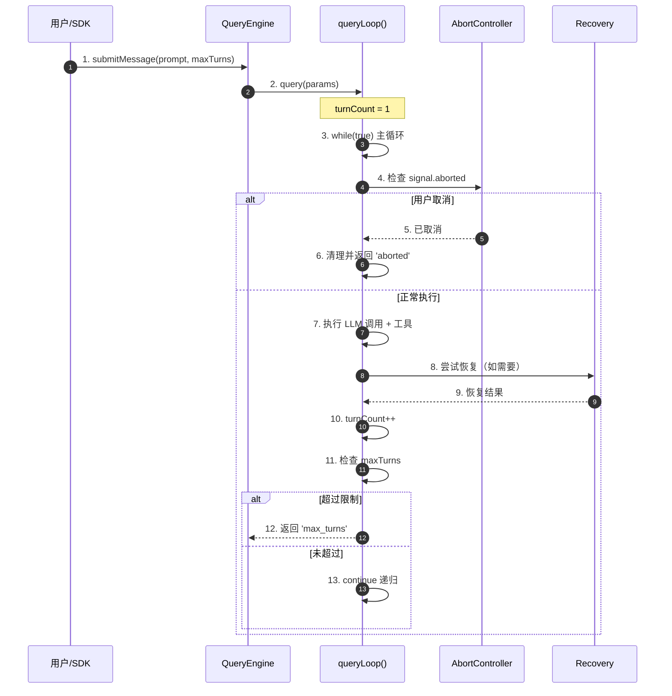

**关键交互说明**：

| 步骤 | 交互内容 | 设计意图 |
|-----|---------|---------|
| 1 | 用户/SDK 发起请求，可传 maxTurns | 支持自定义循环限制 |
| 2 | QueryEngine 调用 query 函数 | 解耦引擎与循环逻辑 |
| 3-4 | 主循环检查取消信号 | 支持用户实时中断 |
| 7 | 执行 LLM 调用和工具 | 核心 Agent 逻辑 |
| 8-9 | 恢复机制处理错误 | 自动恢复可修复错误 |
| 11 | 检查 maxTurns 限制 | 防止无限循环 |
| 13 | 递归继续下一 turn | 支持多轮对话 |

---

## 3. 核心组件详细分析

### 3.1 queryLoop 内部结构

#### 职责定位

queryLoop 是 Claude Code 的核心 Agent 循环，负责驱动多轮 LLM 调用，管理 turn 计数、取消信号和恢复机制。

#### 状态机图

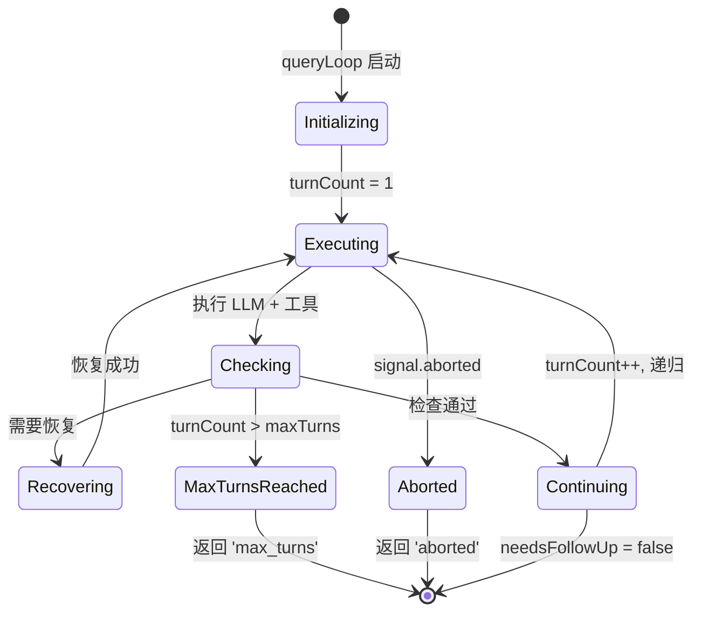

**状态说明**：

| 状态 | 说明 | 进入条件 | 退出条件 |
|-----|------|---------|---------|
| Initializing | 初始化状态 | queryLoop 被调用 | 设置初始 turnCount |
| Executing | 执行中 | 开始 LLM 调用 | 执行完成/取消 |
| Checking | 检查状态 | 执行完成 | 决定下一步 |
| Recovering | 恢复中 | 遇到可恢复错误 | 恢复成功/失败 |
| Continuing | 继续执行 | 检查通过 | 递归或完成 |
| MaxTurnsReached | 达到限制 | turnCount > maxTurns | 返回结果 |
| Aborted | 已取消 | 用户取消 | 返回结果 |

#### 内部数据流

```text
┌─────────────────────────────────────────────────────────────┐
│  输入层                                                      │
│  ├── QueryParams (messages, systemPrompt, maxTurns)         │
│  └── 初始状态 State (turnCount=1, messages, toolUseContext) │
└──────────────────────────┬──────────────────────────────────┘
                           ▼
┌─────────────────────────────────────────────────────────────┐
│  处理层                                                      │
│  ├── while(true) 主循环                                     │
│  │   ├── 检查 abortController.signal.aborted                │
│  │   ├── 调用 LLM (streaming)                               │
│  │   ├── 执行工具调用                                       │
│  │   └── 尝试恢复机制（compact/retry）                      │
│  └── 状态更新 (turnCount++, messages 更新)                  │
└──────────────────────────┬──────────────────────────────────┘
                           ▼
┌─────────────────────────────────────────────────────────────┐
│  输出层                                                      │
│  ├── 生成消息 (yield Message)                               │
│  ├── 返回 Terminal (reason: 'completed' | 'max_turns' ...)  │
│  └── 清理资源 (pendingToolUseSummary)                       │
└─────────────────────────────────────────────────────────────┘
```

#### 关键接口

| 接口 | 输入 | 输出 | 说明 | 代码位置 |
|-----|------|------|------|---------|
| `query()` | `QueryParams` | `AsyncGenerator<...>, Terminal` | 入口函数 | `query.ts:219` |
| `queryLoop()` | `QueryParams, consumedCommandUuids` | `AsyncGenerator<...>, Terminal` | 核心循环 | `query.ts:241` |
| `State` | messages, turnCount, toolUseContext... | - | 循环状态 | `query.ts:204` |

---

### 3.2 AbortController 内部结构

#### 职责定位

AbortController 负责管理取消信号的传播，支持用户中断和父子控制器链式取消。

#### 状态机图

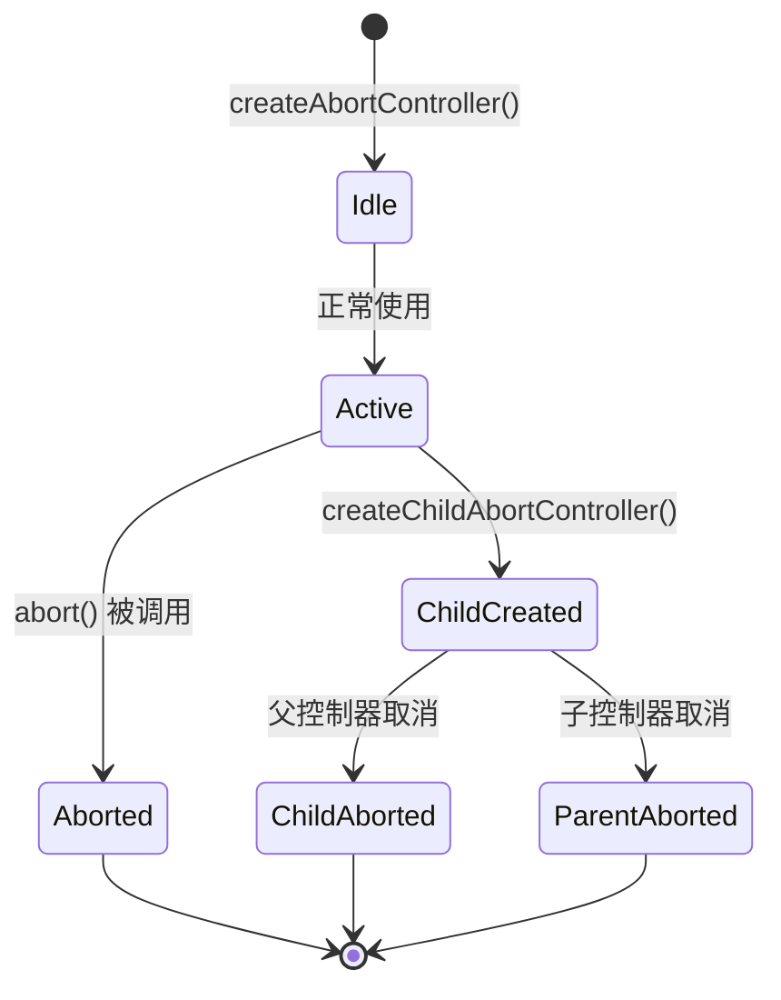

#### 关键算法逻辑

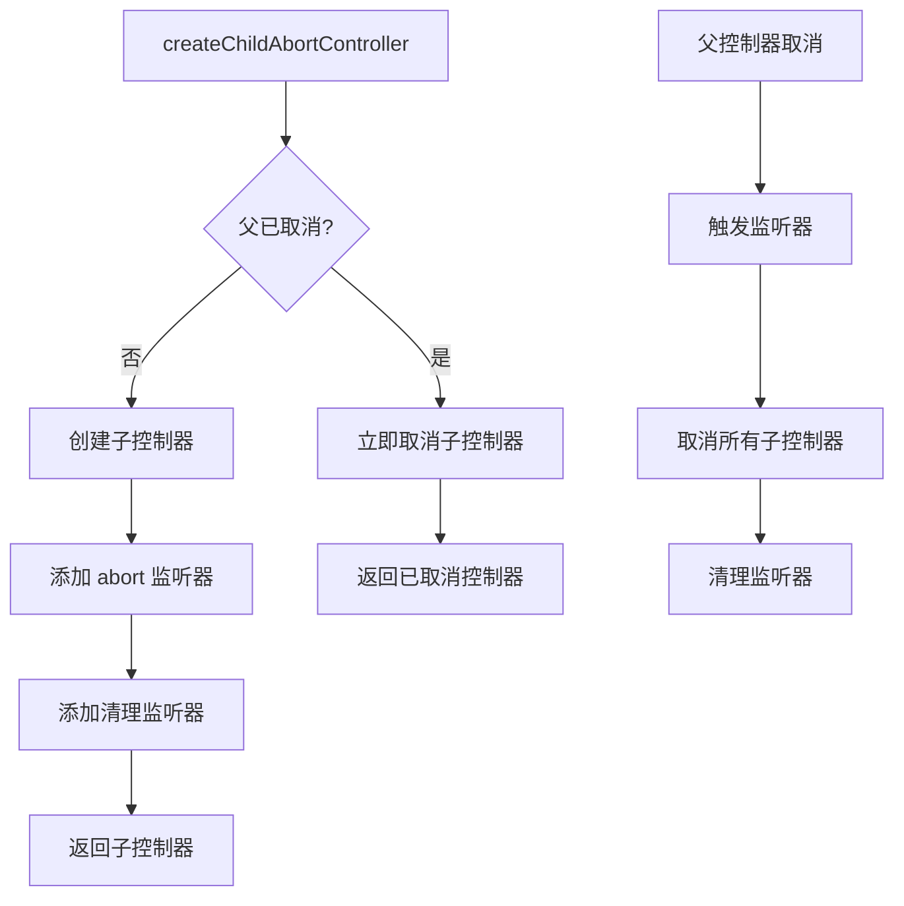

**算法要点**：

1. **WeakRef 内存安全**：使用 WeakRef 防止父控制器保留废弃子控制器
2. **自动清理**：子控制器取消时自动移除父监听器
3. **快速路径**：父已取消时立即取消子控制器，无需监听器

#### 关键接口

| 接口 | 输入 | 输出 | 说明 | 代码位置 |
|-----|------|------|------|---------|
| `createAbortController()` | `maxListeners?` | `AbortController` | 创建控制器 | `abortController.ts:16` |
| `createChildAbortController()` | `parent, maxListeners?` | `AbortController` | 创建子控制器 | `abortController.ts:68` |

---

### 3.3 组件间协作时序

展示 maxTurns 检查和取消机制的完整协作流程。

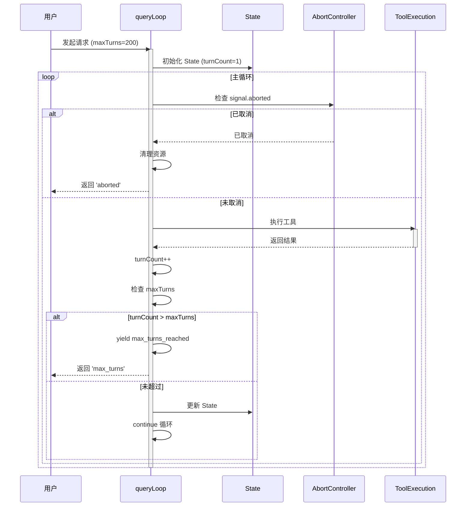

**协作要点**：

1. **queryLoop 与 State**：State 携带 turnCount 等可变状态，每次递归更新
2. **queryLoop 与 AbortController**：每次循环检查取消信号，支持实时中断
3. **maxTurns 检查**：在工具执行后、递归前检查，防止超限

---

### 3.4 关键数据路径

#### 主路径（正常流程）

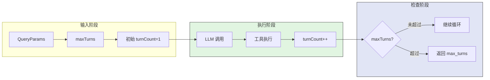

#### 异常路径（取消/错误）

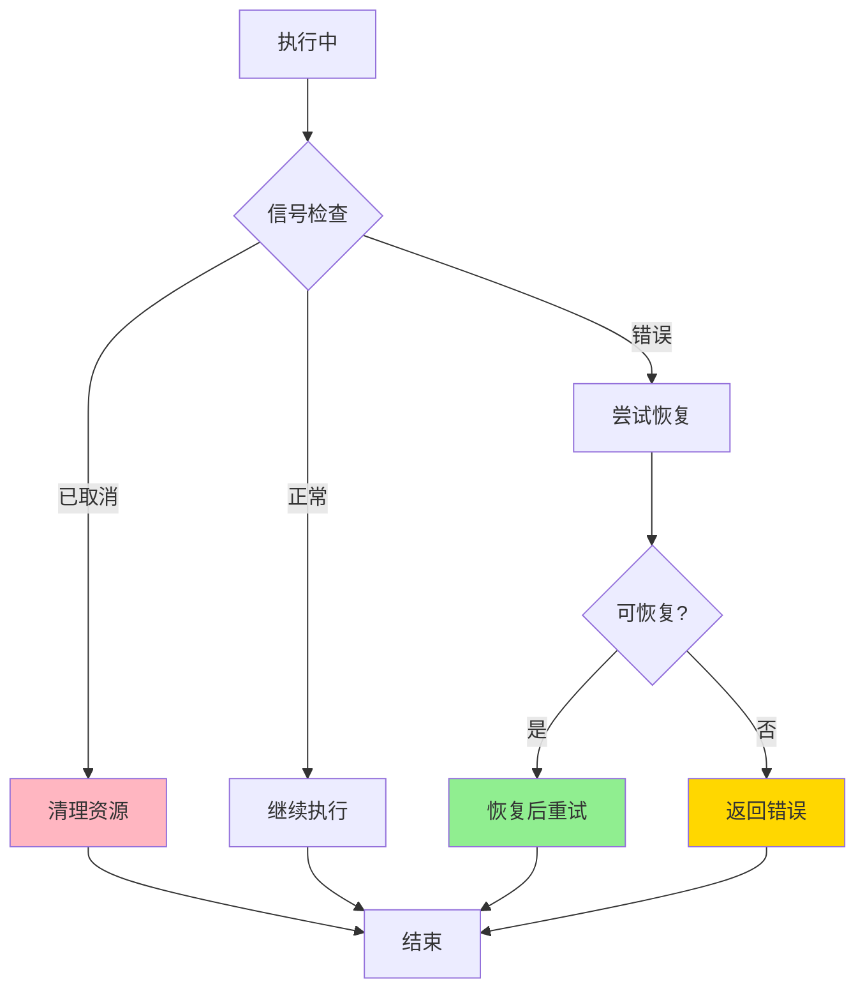

---

## 4. 端到端数据流转

### 4.1 正常流程（详细版）

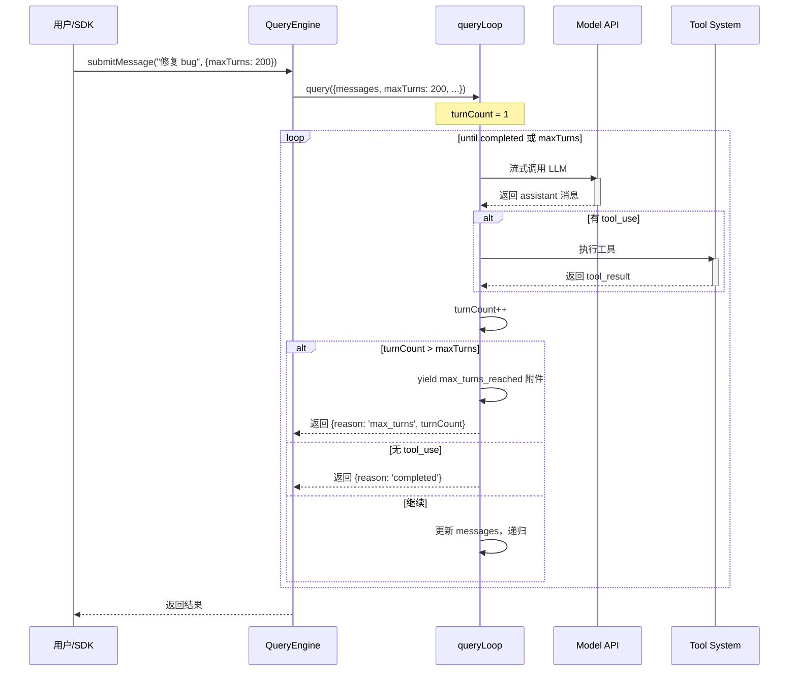

**数据变换详情**：

| 阶段 | 输入 | 处理 | 输出 | 代码位置 |
|-----|------|------|------|---------|
| 初始化 | `QueryParams` | 解构参数 | `State` 初始状态 | `query.ts:268` |
| LLM 调用 | `messagesForQuery` | 流式请求 | `assistantMessages` | `query.ts:659` |
| 工具执行 | `toolUseBlocks` | 执行工具 | `toolResults` | `query.ts:1380` |
| turn 计数 | `turnCount` | +1 | 新 turnCount | `query.ts:1679` |
| 限制检查 | `nextTurnCount, maxTurns` | 比较 | 是否超限 | `query.ts:1705` |
| 结果返回 | `reason, turnCount` | 封装 | `Terminal` | `query.ts:1711` |

### 4.2 数据流向图

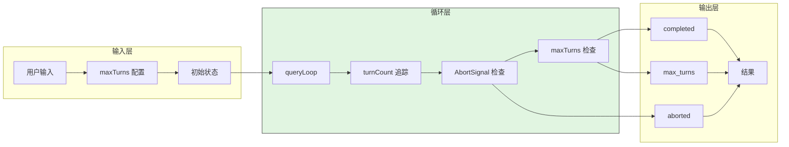

### 4.3 异常/边界流程

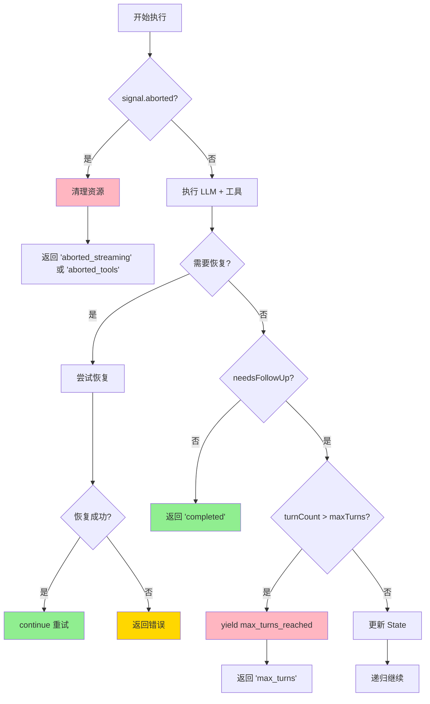

---

## 5. 关键代码实现

### 5.1 核心数据结构

**QueryParams 接口**（`claude-code/src/query.ts:181-199`）

```typescript
export type QueryParams = {
  messages: Message[]
  systemPrompt: SystemPrompt
  userContext: { [k: string]: string }
  systemContext: { [k: string]: string }
  canUseTool: CanUseToolFn
  toolUseContext: ToolUseContext
  fallbackModel?: string
  querySource: QuerySource
  maxOutputTokensOverride?: number
  maxTurns?: number  // 最大 turn 限制（可选）
  skipCacheWrite?: boolean
  taskBudget?: { total: number }
  deps?: QueryDeps
}
```

**State 类型**（`claude-code/src/query.ts:204-217`）

```typescript
type State = {
  messages: Message[]
  toolUseContext: ToolUseContext
  autoCompactTracking: AutoCompactTrackingState | undefined
  maxOutputTokensRecoveryCount: number
  hasAttemptedReactiveCompact: boolean
  maxOutputTokensOverride: number | undefined
  pendingToolUseSummary: Promise<ToolUseSummaryMessage | null> | undefined
  stopHookActive: boolean | undefined
  turnCount: number  // 当前 turn 计数
  transition: Continue | undefined
}
```

**字段说明**：

| 字段 | 类型 | 用途 |
|-----|------|------|
| `maxTurns` | `number?` | 最大 turn 限制，undefined 表示无限制 |
| `turnCount` | `number` | 当前 turn 计数，从 1 开始 |
| `transition` | `Continue?` | 记录上次继续原因，用于恢复逻辑 |

### 5.2 主链路代码

**maxTurns 检查逻辑**（`claude-code/src/query.ts:1704-1711`）

```typescript
// Check if we've reached the max turns limit
if (maxTurns && nextTurnCount > maxTurns) {
  yield createAttachmentMessage({
    type: 'max_turns_reached',
    maxTurns,
    turnCount: nextTurnCount,
  })
  return { reason: 'max_turns', turnCount: nextTurnCount }
}
```

**设计意图**：
1. **前置检查**：在递归调用前检查，防止超限后仍执行
2. **用户通知**：通过 attachment 通知用户已达到限制
3. **优雅返回**：返回明确的 `max_turns` 原因，便于上层处理

**AbortController 创建**（`claude-code/src/utils/abortController.ts:16-22`）

```typescript
export function createAbortController(
  maxListeners: number = DEFAULT_MAX_LISTENERS,
): AbortController {
  const controller = new AbortController()
  setMaxListeners(maxListeners, controller.signal)
  return controller
}
```

**子控制器创建**（`claude-code/src/utils/abortController.ts:68-99`）

```typescript
export function createChildAbortController(
  parent: AbortController,
  maxListeners?: number,
): AbortController {
  const child = createAbortController(maxListeners)

  // Fast path: parent already aborted
  if (parent.signal.aborted) {
    child.abort(parent.signal.reason)
    return child
  }

  // WeakRef prevents memory leak
  const weakChild = new WeakRef(child)
  const weakParent = new WeakRef(parent)
  const handler = propagateAbort.bind(weakParent, weakChild)

  parent.signal.addEventListener('abort', handler, { once: true })

  // Auto-cleanup when child is aborted
  child.signal.addEventListener(
    'abort',
    removeAbortHandler.bind(weakParent, new WeakRef(handler)),
    { once: true },
  )

  return child
}
```

**设计意图**：
1. **内存安全**：使用 WeakRef 防止父控制器保留废弃子控制器
2. **自动传播**：父取消时自动取消所有子控制器
3. **自动清理**：子取消时自动移除父监听器，防止监听器累积

### 5.3 关键调用链

```text
QueryEngine.submitMessage()          [QueryEngine.ts:209]
  -> query()                         [query.ts:219]
    -> queryLoop()                   [query.ts:241]
      - 初始化 State (turnCount=1)   [query.ts:268]
      - while(true) 主循环           [query.ts:307]
        - 检查 signal.aborted        [query.ts:1015]
        - 调用 LLM (streaming)       [query.ts:659]
        - 执行工具                   [query.ts:1380]
        - turnCount++                [query.ts:1679]
        - 检查 maxTurns              [query.ts:1705]
          - 超限: 返回 'max_turns'   [query.ts:1711]
          - 未超限: 递归继续         [query.ts:1715]
```

---

## 6. 设计意图与 Trade-off

### 6.1 Claude Code 的选择

| 维度 | Claude Code 的选择 | 替代方案 | 取舍分析 |
|-----|-------------------|---------|---------|
| 循环限制 | `maxTurns` 参数 | 固定硬编码 | 灵活可配置，但需要用户理解 |
| 取消机制 | `AbortController` 信号 | 进程杀死 | 标准 Web API，支持优雅清理 |
| 信号传播 | WeakRef 父子链 | 强引用 | 内存安全，但实现复杂 |
| 恢复策略 | 多种恢复路径 | 直接失败 | 提高成功率，但增加复杂度 |
| 子 Agent 限制 | 默认 200 turns | 继承父限制 | 平衡灵活性和安全性 |

### 6.2 为什么这样设计？

**核心问题**：如何优雅地防止 Agent 无限循环，同时支持用户中断和自动恢复？

**Claude Code 的解决方案**：

- **代码依据**：`claude-code/src/query.ts:1705-1711`
- **设计意图**：通过显式 turn 计数和可配置限制，防止资源耗尽
- **带来的好处**：
  - 可配置性：用户/子 Agent 可自定义限制
  - 可观测性：明确的 `max_turns` 返回原因
  - 可中断性：AbortController 支持实时取消
  - 内存安全：WeakRef 防止监听器泄漏
- **付出的代价**：
  - 需要手动传递和检查 maxTurns
  - WeakRef 实现增加代码复杂度
  - 恢复逻辑分散在多个条件分支

### 6.3 与其他项目的对比

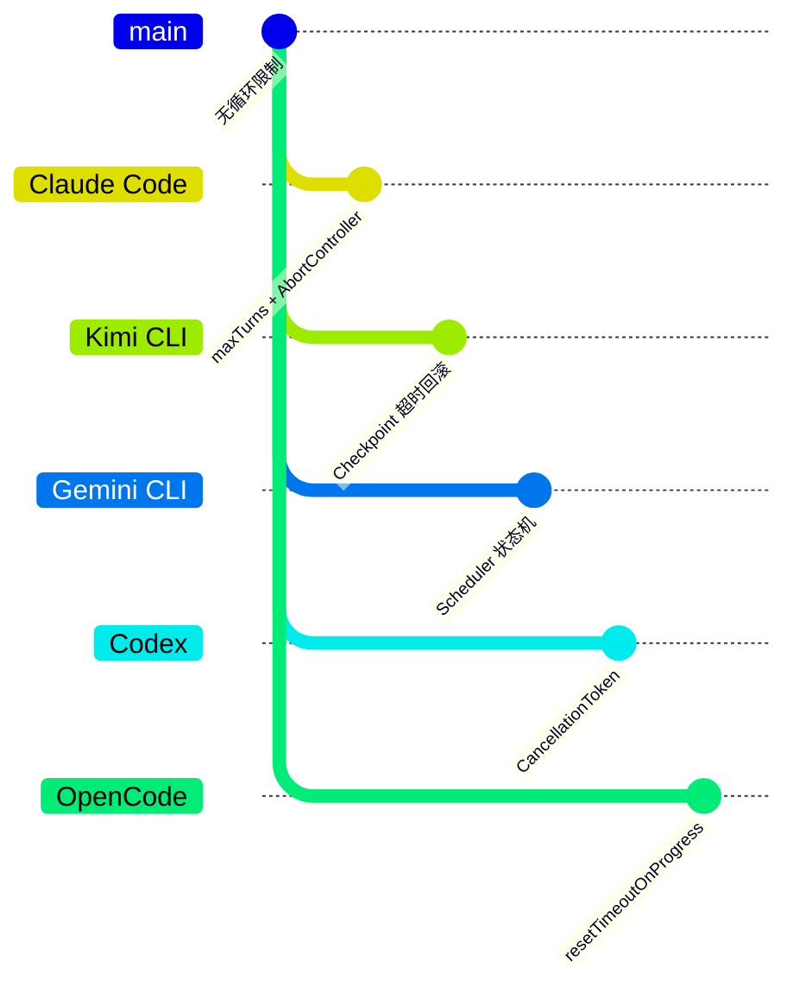

| 项目 | 核心差异 | 适用场景 |
|-----|---------|---------|
| **Claude Code** | maxTurns + AbortController 信号 | TypeScript 生态，需要灵活配置 |
| **Kimi CLI** | Checkpoint 超时回滚 | Python 生态，需要状态恢复 |
| **Gemini CLI** | Scheduler 状态机 + MCP 超时 | 标准化 MCP 工具管理 |
| **Codex** | CancellationToken | Rust 生态，强类型取消信号 |
| **OpenCode** | resetTimeoutOnProgress 动态续期 | 长时间任务需要进度反馈 |

**详细对比表**：

| 维度 | Claude Code | Kimi CLI | Gemini CLI | Codex |
|-----|-------------|----------|------------|-------|
| **循环限制** | maxTurns 参数 | max_steps_per_turn | 隐式限制 | 隐式限制 |
| **取消机制** | AbortController | 信号处理 | AbortSignal | CancellationToken |
| **超时恢复** | 多种恢复路径 | Checkpoint 回滚 | 错误返回 | 错误返回 |
| **子 Agent** | 默认 200 turns | 继承父配置 | 独立配置 | 独立配置 |
| **内存安全** | WeakRef | asyncio.Task | 标准 Promise | Rust 所有权 |
| **实现语言** | TypeScript | Python | TypeScript | Rust |

---

## 7. 边界情况与错误处理

### 7.1 终止条件

| 终止原因 | 触发条件 | 代码位置 |
|---------|---------|---------|
| 正常完成 | 无 tool_use，任务完成 | `query.ts:1357` |
| 达到 maxTurns | turnCount > maxTurns | `query.ts:1705` |
| 用户取消 | abortController.signal.aborted | `query.ts:1015` |
| API 错误 | 不可恢复的错误 | `query.ts:955` |
| Stop Hook | 阻止继续 | `query.ts:1278` |
| Token Budget | 超出预算 | `query.ts:1343` |

### 7.2 超时/资源限制

**子 Agent 默认限制**（`claude-code/src/tools/AgentTool/forkSubagent.ts:65`）

```typescript
export const FORK_AGENT = {
  agentType: FORK_SUBAGENT_TYPE,
  maxTurns: 200,  // 子 Agent 默认 200 turns
  model: 'inherit',
  permissionMode: 'bubble',
  // ...
} satisfies BuiltInAgentDefinition
```

**恢复限制**（`claude-code/src/query.ts:164`）

```typescript
const MAX_OUTPUT_TOKENS_RECOVERY_LIMIT = 3
```

### 7.3 错误恢复策略

| 错误类型 | 处理策略 | 代码位置 |
|---------|---------|---------|
| Prompt Too Long | Context Collapse 或 Reactive Compact | `query.ts:1085-1117` |
| Media Size | Reactive Compact 图片剥离 | `query.ts:1119-1166` |
| Max Output Tokens | 升级 token 限制或恢复消息 | `query.ts:1188-1252` |
| 529 Overloaded | 指数退避重试 | `withRetry.ts:267-304` |
| 401/403 Auth | 刷新凭证重试 | `withRetry.ts:241-250` |

---

## 8. 关键代码索引

| 功能 | 文件 | 行号 | 说明 |
|-----|------|------|------|
| 入口 | `claude-code/src/query.ts` | 219 | `query()` 函数 |
| 核心循环 | `claude-code/src/query.ts` | 241 | `queryLoop()` 函数 |
| maxTurns 参数 | `claude-code/src/query.ts` | 191 | `QueryParams.maxTurns` |
| turnCount 状态 | `claude-code/src/query.ts` | 213 | `State.turnCount` |
| 限制检查 | `claude-code/src/query.ts` | 1705 | maxTurns 检查逻辑 |
| AbortController | `claude-code/src/utils/abortController.ts` | 16 | `createAbortController()` |
| 子控制器 | `claude-code/src/utils/abortController.ts` | 68 | `createChildAbortController()` |
| 子 Agent 限制 | `claude-code/src/tools/AgentTool/forkSubagent.ts` | 65 | `FORK_AGENT.maxTurns` |
| 取消检查 | `claude-code/src/query.ts` | 1015 | 流式取消检查 |
| 恢复机制 | `claude-code/src/query.ts` | 1085 | Prompt Too Long 恢复 |
| 重试逻辑 | `claude-code/src/services/api/withRetry.ts` | 170 | `withRetry()` 函数 |

---

## 9. 延伸阅读

- 前置知识：`docs/claude-code/04-claude-code-agent-loop.md` - Agent Loop 整体架构
- 相关机制：`docs/claude-code/06-claude-code-mcp-integration.md` - MCP 工具集成
- 对比分析：`docs/kimi-cli/q10-kimi-cli-tool-call-concurrency.md` - Kimi CLI 并发机制
- 对比分析：`docs/gemini-cli/q05-gemini-cli-skill-execution-timeout.md` - Gemini CLI 超时机制
- 跨项目对比：`docs/comm/comm-skill-execution-timeout.md`

---

*✅ Verified: 基于 claude-code/src/query.ts:241、claude-code/src/utils/abortController.ts:16、claude-code/src/tools/AgentTool/forkSubagent.ts:65 等源码分析*
*⚠️ Inferred: 部分设计意图基于代码结构推断*
*基于版本：2026-02-08 | 最后更新：2026-03-31*
