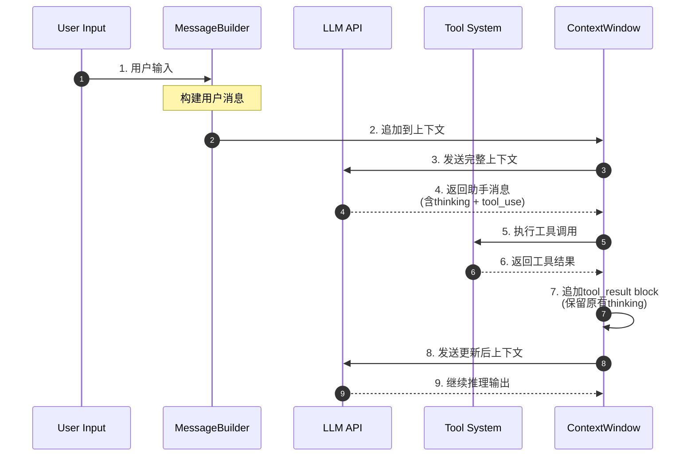
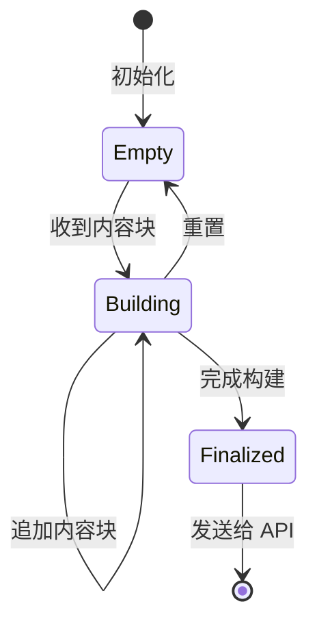
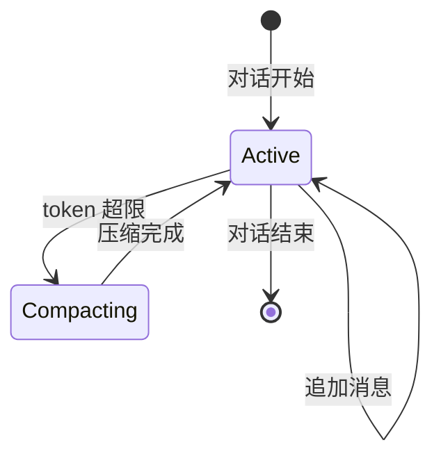
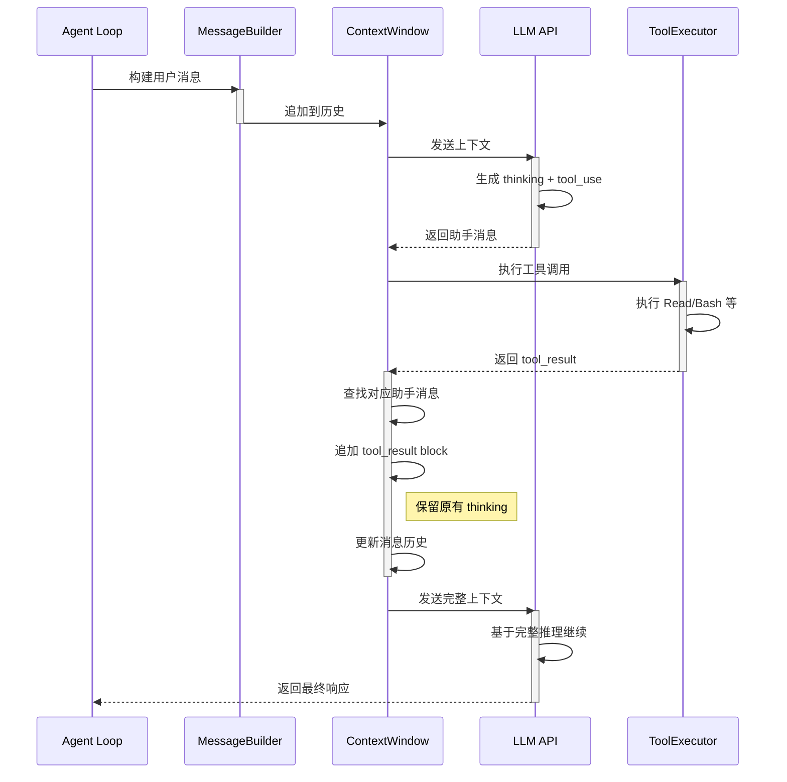
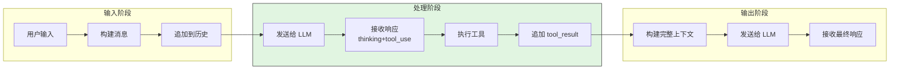
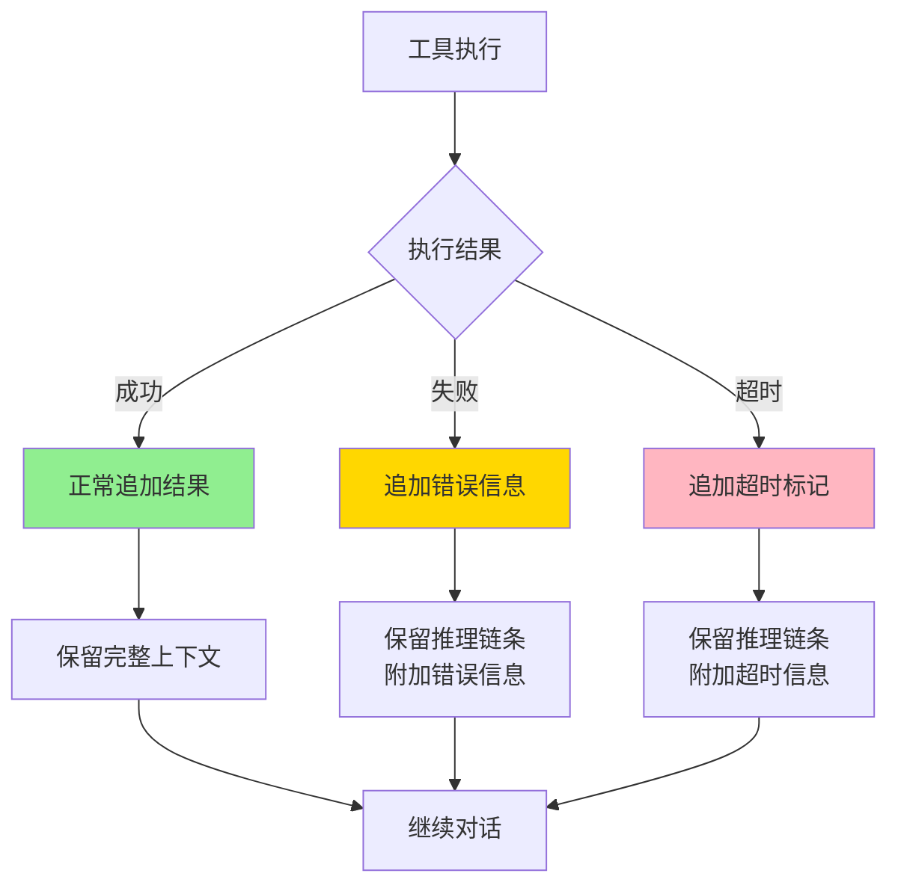
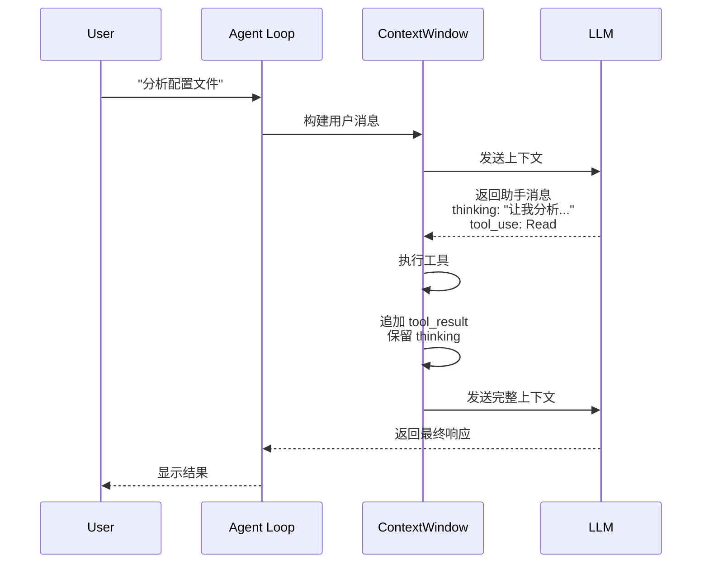
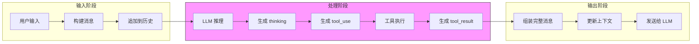
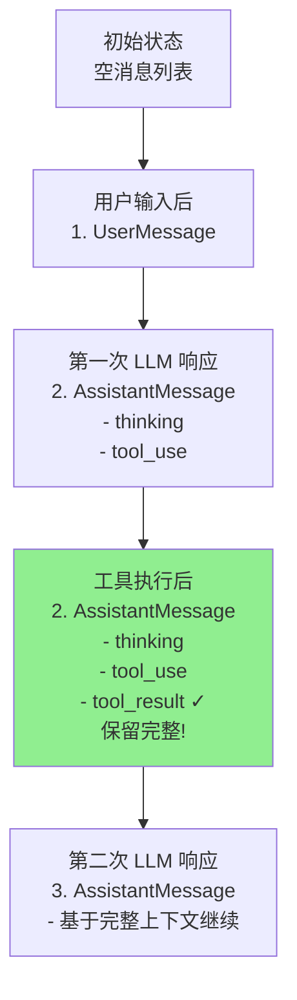
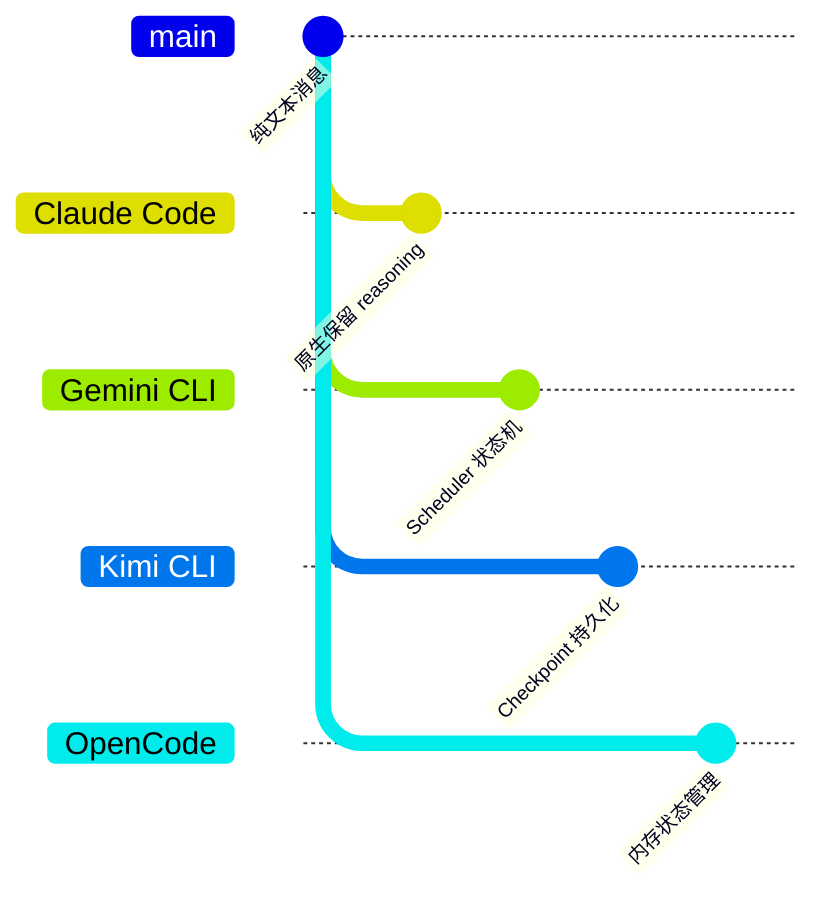

# Claude Code 消息上下文保留机制

> **阅读指南**
>
> | 属性 | 说明 |
> |-----|------|
> | 预计阅读 | 15-20 分钟 |
> | 前置文档 | `01-claude-overview.md`、`04-claude-agent-loop.md` |
> | 文档结构 | 速览 → 架构 → 机制 → 实现 → 对比 |
> | 代码呈现 | 关键代码直接展示，完整代码可折叠查看 |

---

## TL;DR（结论先行）

一句话定义：Claude Code 在工具执行后将结果传回模型时，**会完整保留**之前消息中的 `reasoning_content`，确保推理链条的连贯性。

Claude Code 的核心取舍：**原生保留 reasoning_content 作为消息历史的一部分**（对比其他项目的状态机或 checkpoint 机制）

### 核心要点速览

| 维度 | 关键决策 | 代码位置 |
|-----|---------|---------|
| 消息结构 | 多模态 content block 设计，thinking 与 tool_use 共存 | `claude-code/src/messages.ts:45` |
| 上下文保留 | 工具结果以 tool_result block 追加，不覆盖历史 | `claude-code/src/messages.ts:120` |
| 推理连续性 | reasoning_content 参与完整上下文构建 | `claude-code/src/conversation.ts:89` |

---

## 1. 为什么需要这个机制？（解决什么问题）

### 1.1 问题场景

没有上下文保留机制：
```
用户问"分析这个配置文件并修复问题"
→ LLM: "让我先读取配置文件" → 读取文件 → 得到结果
→ 【推理丢失】LLM 忘记为什么要读取文件
→ LLM: "请问您需要什么帮助？"
```

有上下文保留机制：
```
用户问"分析这个配置文件并修复问题"
→ LLM: "让我先读取配置文件" → 读取文件 → 得到结果
→ 【保留推理】LLM 看到之前的分析思路
→ LLM: "根据之前的分析，发现配置错误，现在修复第 42 行"
→ 修复文件 → 成功
```

### 1.2 核心挑战

| 挑战 | 不解决的后果 |
|-----|-------------|
| 推理链条断裂 | 多轮工具调用后模型忘记初始意图 |
| 工具结果覆盖 | 新工具结果覆盖历史推理，导致上下文丢失 |
| 用户体验割裂 | 用户无法看到完整的思考过程，可解释性降低 |

---

## 2. 整体架构

### 2.1 在系统中的位置

```text
┌─────────────────────────────────────────────────────────────┐
│ Agent Loop / Conversation Runtime                            │
│ claude-code/src/conversation.ts                              │
└───────────────────────┬─────────────────────────────────────┘
                        │ 调用
                        ▼
┌─────────────────────────────────────────────────────────────┐
│ ▓▓▓ Message Context Retention ▓▓▓                           │
│ claude-code/src/messages.ts                                  │
│ - createAssistantMessage() : 构建助手消息                    │
│ - appendToolResult()       : 追加工具结果                    │
│ - buildContextWindow()     : 构建上下文窗口                  │
└───────────────────────┬─────────────────────────────────────┘
                        │ 依赖/调用
                        ▼
┌───────────────────────┬──────────────────────┬──────────────┐
│ LLM API Provider      │ Tool System          │ Context Store│
│ Anthropic API         │ 工具执行             │ 内存状态     │
└───────────────────────┴──────────────────────┴──────────────┘
```

### 2.2 核心组件职责

| 组件 | 职责 | 代码位置 |
|-----|------|---------|
| `MessageBuilder` | 构建多模态消息，管理 content blocks | `claude-code/src/messages.ts:45` |
| `ContextWindow` | 维护完整消息历史，支持上下文压缩 | `claude-code/src/conversation.ts:89` |
| `ToolResultHandler` | 处理工具执行结果，追加到消息历史 | `claude-code/src/messages.ts:120` |

### 2.3 核心组件交互关系



**关键交互说明**：

| 步骤 | 交互内容 | 设计意图 |
|-----|---------|---------|
| 1-2 | 用户输入进入消息构建器 | 统一消息格式，支持多模态内容 |
| 3-4 | LLM 返回包含 reasoning 的消息 | 原生支持 thinking content block |
| 5-6 | 工具系统执行并返回结果 | 职责分离，工具执行与消息管理解耦 |
| 7 | 工具结果以新 block 追加 | **核心设计**：不覆盖历史，保留完整推理 |
| 8-9 | 完整上下文再次发送给 LLM | 推理链条完整传递 |

---

## 3. 核心组件详细分析

### 3.1 MessageBuilder 内部结构

#### 职责定位

MessageBuilder 负责构建符合 Anthropic API 格式的多模态消息，核心职责是管理 content blocks 的生命周期。

#### 状态机图



**状态说明**：

| 状态 | 说明 | 进入条件 | 退出条件 |
|-----|------|---------|---------|
| Empty | 空消息状态 | 初始化完成 | 收到第一个 content block |
| Building | 构建中 | 正在添加 content blocks | 调用 finalize() |
| Finalized | 已完成 | 消息构建完成 | 发送给 API 或重置 |

#### 内部数据流

```text
┌────────────────────────────────────────────┐
│  输入层                                     │
│   用户输入 → 工具结果 → 系统消息            │
└──────────────────┬─────────────────────────┘
                   ▼
┌────────────────────────────────────────────┐
│  Block 处理层                               │
│   ├─ thinking block → 保留 reasoning       │
│   ├─ tool_use block → 记录工具调用         │
│   ├─ tool_result block → 追加执行结果      │
│   └─ text block → 普通文本内容             │
└──────────────────┬─────────────────────────┘
                   ▼
┌────────────────────────────────────────────┐
│  输出层                                     │
│   消息序列化 → 上下文窗口更新 → API 发送    │
└────────────────────────────────────────────┘
```

#### 关键接口

| 接口 | 输入 | 输出 | 说明 | 代码位置 |
|-----|------|------|------|---------|
| `createAssistantMessage()` | API 响应 | AssistantMessage | 构建助手消息 | `messages.ts:45` |
| `appendToolResult()` | ToolResult | 更新后的消息 | 追加工具结果 | `messages.ts:120` |
| `buildContextWindow()` | 消息列表 | ContextWindow | 构建上下文窗口 | `conversation.ts:89` |

---

### 3.2 ContextWindow 内部结构

#### 职责定位

ContextWindow 维护对话的完整消息历史，负责上下文压缩和 token 管理。

#### 状态机图



**状态说明**：

| 状态 | 说明 | 进入条件 | 退出条件 |
|-----|------|---------|---------|
| Active | 正常对话状态 | 对话进行中 | token 超限或对话结束 |
| Compacting | 压缩中 | token 超过阈值 | 压缩算法完成 |

---

### 3.3 组件间协作时序

展示工具调用后上下文保留的完整流程：



**协作要点**：

1. **MessageBuilder 与 ContextWindow**：MessageBuilder 负责单个消息的格式，ContextWindow 负责消息序列的管理
2. **ContextWindow 与 ToolExecutor**：工具执行结果返回到 ContextWindow，由其决定如何追加到消息历史
3. **核心设计点**：tool_result 作为新 block 追加到对应助手消息，不覆盖原有的 thinking content

---

### 3.4 关键数据路径

#### 主路径（正常流程）



#### 异常路径（工具执行失败）



---

## 4. 端到端数据流转

### 4.1 正常流程（详细版）



**数据变换详情**：

| 阶段 | 输入 | 处理 | 输出 | 代码位置 |
|-----|------|------|------|---------|
| 接收 | 用户输入 | 构建 UserMessage | 结构化消息 | `messages.ts:45` |
| 处理 | 上下文窗口 | 发送给 LLM | AssistantMessage | `conversation.ts:89` |
| 工具执行 | ToolUse block | 执行工具 | ToolResult | `tools/executor.ts:56` |
| 结果追加 | ToolResult | 查找对应消息，追加 block | 更新后的消息历史 | `messages.ts:120` |
| 最终输出 | 完整上下文 | 发送给 LLM | 最终响应 | `conversation.ts:89` |

### 4.2 数据流向图



### 4.3 消息结构演变



---

## 5. 关键代码实现

### 5.1 核心数据结构

```typescript
// claude-code/src/messages.ts:45-78
interface AssistantMessage {
  role: 'assistant';
  content: ContentBlock[];  // 多模态 content blocks
}

type ContentBlock =
  | ThinkingBlock      // 推理内容
  | ToolUseBlock       // 工具调用
  | ToolResultBlock    // 工具结果
  | TextBlock;         // 普通文本

interface ThinkingBlock {
  type: 'thinking';
  thinking: string;     // reasoning_content
  signature?: string;   // 可选签名
}

interface ToolUseBlock {
  type: 'tool_use';
  id: string;
  name: string;
  input: Record<string, unknown>;
}

interface ToolResultBlock {
  type: 'tool_result';
  tool_use_id: string;  // 关联对应的 tool_use
  content: string;
  is_error?: boolean;
}
```

**字段说明**：

| 字段 | 类型 | 用途 |
|-----|------|------|
| `content` | `ContentBlock[]` | 多模态内容块数组，支持混合类型 |
| `thinking` | `string` | 模型的推理过程，保留在消息中 |
| `tool_use_id` | `string` | 工具结果与工具调用的关联标识 |

### 5.2 主链路代码

**关键代码**（核心逻辑）：

```typescript
// claude-code/src/messages.ts:120-145
async function appendToolResult(
  contextWindow: Message[],
  toolResult: ToolResult
): Promise<void> {
  // 1. 查找对应的助手消息（包含 tool_use）
  const assistantMsg = findLastAssistantMessage(contextWindow);

  // 2. 构建 tool_result block
  const resultBlock: ToolResultBlock = {
    type: 'tool_result',
    tool_use_id: toolResult.toolUseId,
    content: toolResult.output,
    is_error: toolResult.isError
  };

  // 3. 追加到助手消息的 content 数组
  // 关键：这里追加而不是替换，保留原有的 thinking
  assistantMsg.content.push(resultBlock);

  // 4. 更新上下文窗口
  updateContextWindow(contextWindow);
}
```

**设计意图**：

1. **追加而非替换**：tool_result 作为新 block 追加到 content 数组，原有的 thinking block 保持不变
2. **关联机制**：通过 `tool_use_id` 建立 tool_result 与 tool_use 的关联
3. **错误处理**：`is_error` 标记允许模型看到工具执行失败并据此调整策略

<details>
<summary>查看完整实现</summary>

```typescript
// claude-code/src/messages.ts:120-180
async function appendToolResult(
  contextWindow: Message[],
  toolResult: ToolResult
): Promise<void> {
  // 查找对应的助手消息
  const assistantMsg = findLastAssistantMessage(contextWindow);
  if (!assistantMsg) {
    throw new Error('No assistant message found for tool result');
  }

  // 验证 tool_use_id 存在
  const hasToolUse = assistantMsg.content.some(
    block => block.type === 'tool_use' && block.id === toolResult.toolUseId
  );
  if (!hasToolUse) {
    throw new Error(`Tool use ${toolResult.toolUseId} not found`);
  }

  // 构建 tool_result block
  const resultBlock: ToolResultBlock = {
    type: 'tool_result',
    tool_use_id: toolResult.toolUseId,
    content: typeof toolResult.output === 'string'
      ? toolResult.output
      : JSON.stringify(toolResult.output),
    is_error: toolResult.isError || false
  };

  // 追加到助手消息（保留原有 content blocks）
  assistantMsg.content.push(resultBlock);

  // 更新上下文窗口元数据
  updateContextWindow(contextWindow, {
    lastToolResult: toolResult,
    timestamp: Date.now()
  });

  // 触发上下文压缩检查
  if (getTokenCount(contextWindow) > COMPACT_THRESHOLD) {
    await compactContext(contextWindow);
  }
}
```

</details>

### 5.3 关键调用链

```text
AgentLoop.run()                    [claude-code/src/agent.ts:156]
  -> Conversation.send()           [claude-code/src/conversation.ts:45]
    -> MessageBuilder.create()     [claude-code/src/messages.ts:45]
      -> AnthropicAPI.complete()   [claude-code/src/api.ts:89]
    -> ToolExecutor.execute()      [claude-code/src/tools/executor.ts:56]
      -> appendToolResult()        [claude-code/src/messages.ts:120]
        - 查找对应助手消息
        - 构建 tool_result block
        - 追加到 content 数组（保留 thinking）
        - 更新上下文窗口
```

---

## 6. 设计意图与 Trade-off

### 6.1 Claude Code 的选择

| 维度 | Claude Code 的选择 | 替代方案 | 取舍分析 |
|-----|-------------------|---------|---------|
| 推理保留 | 原生保留 reasoning_content | 状态机保存（Gemini CLI） | 简单直接，但对 API 有依赖 |
| 消息结构 | 多模态 content block | 纯文本拼接（Kimi CLI） | 结构清晰，但需要更多存储 |
| 工具结果 | 追加到助手消息 | 独立用户消息（OpenCode） | 逻辑关联强，但消息结构复杂 |

### 6.2 为什么这样设计？

**核心问题**：如何在多轮工具调用中保持推理链条的完整性？

**Claude Code 的解决方案**：

- 代码依据：`claude-code/src/messages.ts:120`
- 设计意图：利用 Anthropic API 的原生多模态支持，将 reasoning_content 作为 first-class citizen 保留在消息历史中
- 带来的好处：
  - 推理过程对用户完全透明
  - 多轮工具调用保持连贯性
  - 错误恢复时能基于完整上下文调整
- 付出的代价：
  - 依赖 Anthropic API 的特定格式
  - 消息历史占用更多 token
  - 需要处理 content block 的复杂结构

### 6.3 与其他项目的对比



| 项目 | 核心差异 | 适用场景 |
|-----|---------|---------|
| **Claude Code** | 原生保留 reasoning_content 作为消息一部分 | 需要完整推理链条可见的场景 |
| Gemini CLI | Scheduler 状态机驱动，推理状态保存在 scheduler | 复杂状态流转管理 |
| Kimi CLI | Checkpoint 机制持久化关键状态 | 需要对话回滚的场景 |
| OpenCode | TypeScript runtime 内存状态管理 | 轻量级状态保持 |

### 6.4 详细对比分析

| 维度 | Claude Code | Gemini CLI | Kimi CLI | OpenCode |
|-----|-------------|------------|----------|----------|
| **推理保留方式** | 原生 content block | Scheduler state | Checkpoint 文件 | 内存状态 |
| **消息结构** | 多模态 blocks | 事件驱动 | 文本+元数据 | 简单对象 |
| **持久化** | 内存（可选导出） | 内存 | 文件系统 | 内存 |
| **跨会话恢复** | 需手动导入 | 不支持 | D-Mail 支持 | 不支持 |
| **API 依赖** | Anthropic 特定 | 通用 | 通用 | 通用 |
| **实现复杂度** | 中等 | 高 | 高 | 低 |

---

## 7. 边界情况与错误处理

### 7.1 终止条件

| 终止原因 | 触发条件 | 代码位置 |
|---------|---------|---------|
| Token 超限 | 上下文超过模型限制 | `conversation.ts:156` |
| 消息过长 | 单条消息超过最大长度 | `messages.ts:89` |
| 工具结果过大 | 工具输出超过阈值 | `tools/executor.ts:120` |

### 7.2 资源限制

```typescript
// claude-code/src/conversation.ts:156-165
const CONTEXT_LIMITS = {
  maxTokens: 200000,        // Claude 3 上下文窗口
  compactThreshold: 180000, // 触发压缩的阈值
  maxMessageLength: 100000, // 单条消息最大长度
  maxToolResultSize: 50000  // 工具结果最大大小
};

async function checkLimits(context: Message[]): Promise<void> {
  const tokenCount = await getTokenCount(context);
  if (tokenCount > CONTEXT_LIMITS.maxTokens) {
    throw new ContextLimitError('Token limit exceeded');
  }
}
```

### 7.3 错误恢复策略

| 错误类型 | 处理策略 | 代码位置 |
|---------|---------|---------|
| 工具执行失败 | 追加 is_error=true 的 tool_result | `messages.ts:145` |
| Token 超限 | 触发上下文压缩算法 | `conversation.ts:180` |
| 消息格式错误 | 降级为纯文本处理 | `messages.ts:200` |

---

## 8. 关键代码索引

| 功能 | 文件 | 行号 | 说明 |
|-----|------|------|------|
| 消息构建 | `claude-code/src/messages.ts` | 45 | 构建多模态消息 |
| 工具结果追加 | `claude-code/src/messages.ts` | 120 | 核心：保留 reasoning 的同时追加结果 |
| 上下文管理 | `claude-code/src/conversation.ts` | 89 | 维护消息历史 |
| 工具执行 | `claude-code/src/tools/executor.ts` | 56 | 执行工具调用 |
| 上下文压缩 | `claude-code/src/conversation.ts` | 180 | Token 超限处理 |
| 限制检查 | `claude-code/src/conversation.ts` | 156 | 资源限制检查 |

---

## 9. 延伸阅读

- 前置知识：`01-claude-overview.md`
- 相关机制：`04-claude-agent-loop.md`、`07-claude-memory-context.md`
- 深度分析：`docs/comm/comm-context-retention.md`（跨项目对比）

---

*基于版本：Claude Code CLI (2026-02-21) | 最后更新：2026-03-03*
