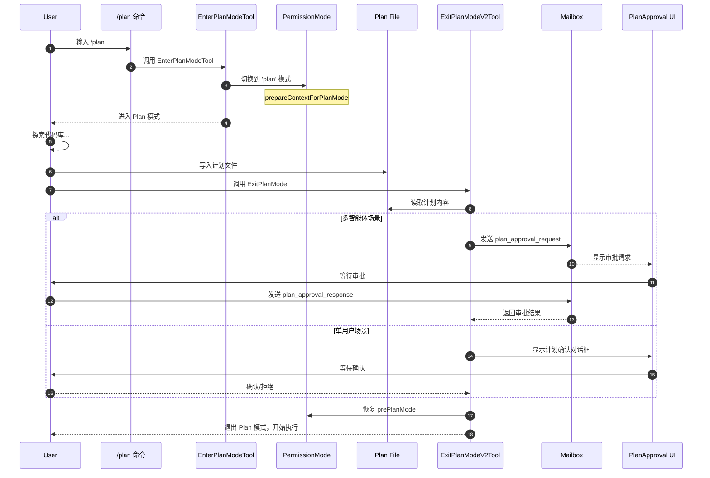
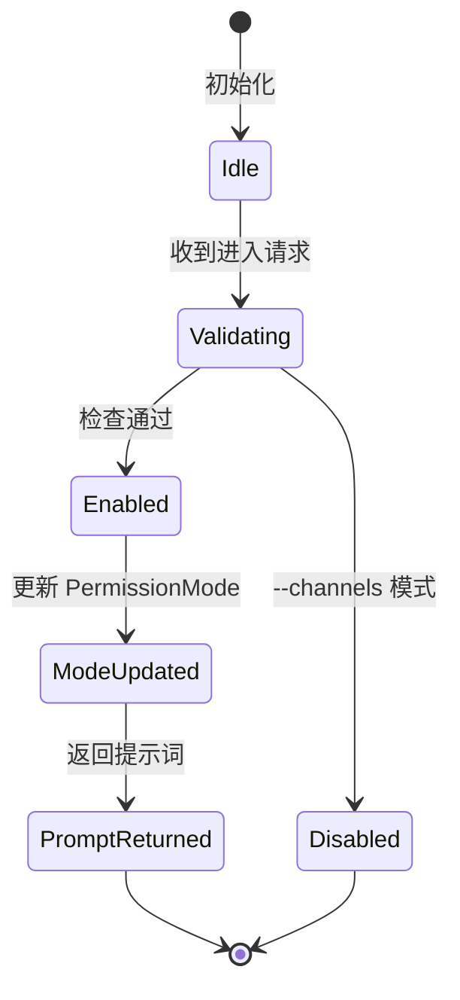
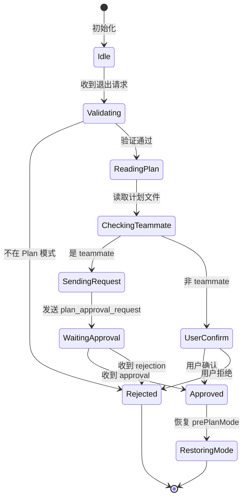
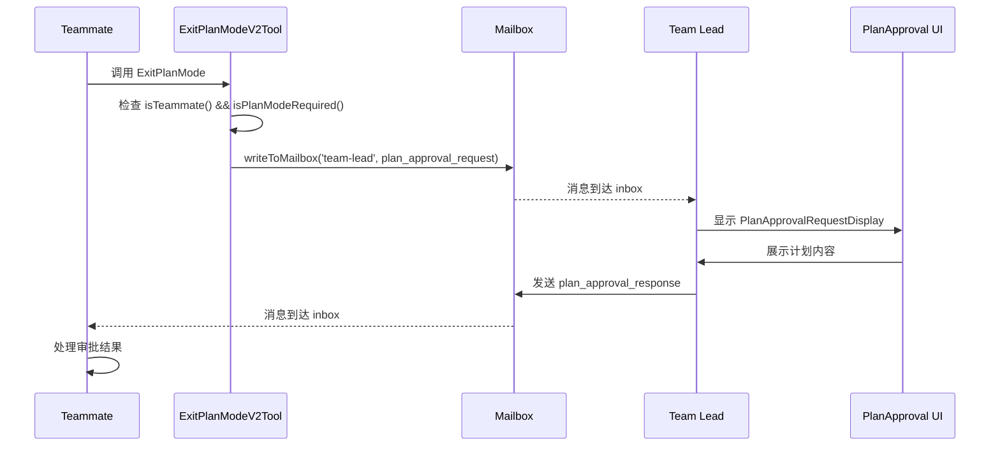
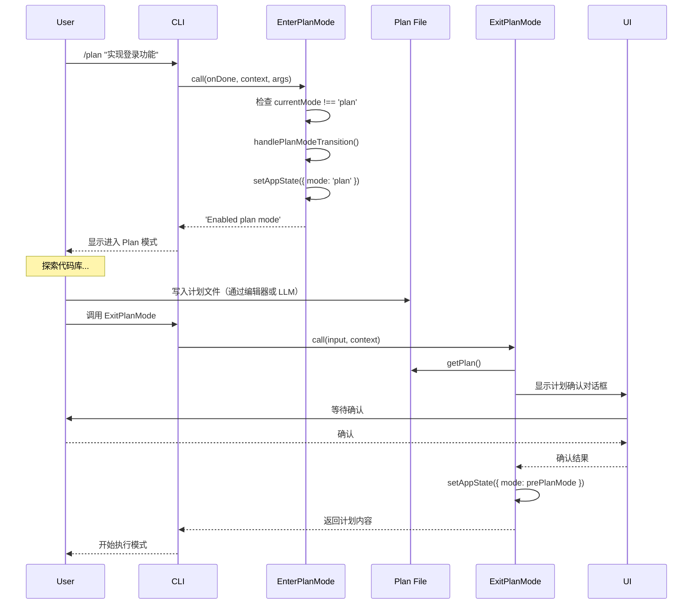
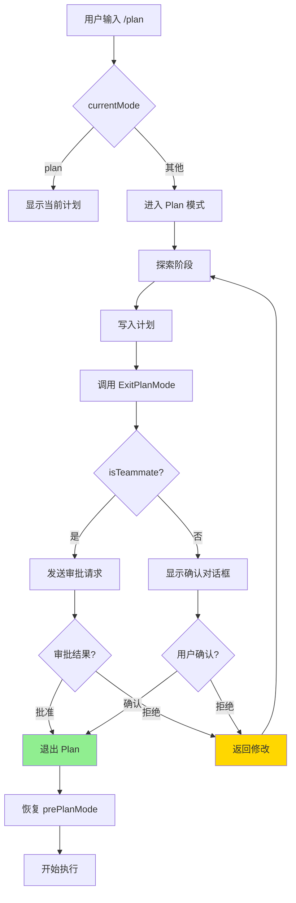

# Claude Code Plan and Execute 模式

> **阅读指南**
>
> | 属性 | 说明 |
> |-----|------|
> | 预计阅读 | 20-30 分钟 |
> | 前置文档 | `docs/claude-code/04-claude-code-agent-loop.md` |
> | 文档结构 | 结论 → 架构 → 机制 → 实现 → 对比 |
> | 代码呈现 | 关键代码直接展示，完整代码可折叠查看 |

---

## TL;DR（结论先行）

Claude Code 实现了**生产级的 Plan and Execute 模式**，通过 `PermissionMode` 状态机实现 Plan 模式与执行模式的严格分离，并支持多智能体协作场景下的计划审批流程。

Claude Code 的核心取舍：**权限模式状态机 + 文件持久化计划 + 多智能体审批流**（对比 Codex 的简单模式切换、Kimi CLI 的 Flow 编排）

### 核心要点速览

| 维度 | 关键决策 | 代码位置 |
|-----|---------|---------|
| 模式定义 | `PermissionMode` 枚举（'plan'/'default'/'auto'） | `claude-code/src/types/permissions.ts:1` |
| 进入 Plan | `EnterPlanModeTool` 工具调用 | `claude-code/src/tools/EnterPlanModeTool/EnterPlanModeTool.ts:36` |
| 退出 Plan | `ExitPlanModeV2Tool` 工具调用 | `claude-code/src/tools/ExitPlanModeTool/ExitPlanModeV2Tool.ts:147` |
| 计划存储 | 文件系统持久化（`~/.claude/plans/`） | `claude-code/src/utils/plans.ts:119` |
| 多智能体审批 | Mailbox 消息系统（`plan_approval_request/response`） | `claude-code/src/utils/teammateMailbox.ts:684` |
| 远程计划 | Ultraplan CCR 会话（30分钟轮询） | `claude-code/src/commands/ultraplan.tsx:24` |

---

## 1. 为什么需要这个机制？（解决什么问题）

### 1.1 问题场景

没有 Plan and Execute 的 Agent：

```
用户: "帮我重构这个模块"
  → LLM: 直接开始修改文件 A
  → LLM: 修改文件 B
  → LLM: 发现设计有问题，回滚...
  → 最终代码混乱，用户不满意
```

有 Plan and Execute：
```
  → Plan 模式：探索 → 明确意图 → 写入计划文件
  → 用户确认计划（或队友审批）
  → 退出 Plan 模式，进入执行模式
  → 按计划执行
  → 结果符合预期
```

### 1.2 核心挑战

| 挑战 | 不解决的后果 |
|-----|-------------|
| 意图误解 | LLM 误解用户需求，执行错误方向 |
| 范围蔓延 | 修改超出预期，影响无关代码 |
| 不可逆操作 | 直接修改后难以回滚 |
| 用户失控 | 用户不知道 Agent 要做什么 |
| 多智能体协作 | 子智能体执行需主智能体审批 |
| 远程执行 | 本地计划，远程执行（Ultraplan） |

---

## 2. 整体架构（ASCII 图）

### 2.1 在系统中的位置

```text
┌─────────────────────────────────────────────────────────────┐
│ CLI 入口 / TUI                                               │
│ claude-code/src/commands/plan/plan.tsx:64                   │
│ - /plan 命令：启用 Plan 模式                                │
│ - /plan open：在编辑器中打开计划文件                        │
└───────────────────────┬─────────────────────────────────────┘
                        │ 调用
                        ▼
┌─────────────────────────────────────────────────────────────┐
│ ▓▓▓ Plan and Execute ▓▓▓                                     │
│ claude-code/src/tools/                                       │
│ - EnterPlanModeTool.ts:36    : 进入 Plan 模式               │
│ - ExitPlanModeV2Tool.ts:147  : 退出 Plan 模式               │
│                                                              │
│ claude-code/src/utils/                                       │
│ - plans.ts:119               : 计划文件管理                 │
│ - planModeV2.ts:5            : Plan V2 配置                 │
│ - teammateMailbox.ts:684     : 审批消息系统                 │
└───────────────────────┬─────────────────────────────────────┘
                        │ 依赖/调用
        ┌───────────────┼───────────────┐
        ▼               ▼               ▼
┌──────────────┐ ┌──────────────┐ ┌──────────────┐
│ Permission   │ │ Plan File    │ │ Teammate     │
│ Mode 状态机  │ │ 持久化       │ │ 审批系统     │
│ L52: 'plan'  │ │ L79: getPlans│ │ L134: writeTo│
└──────────────┘ └──────────────┘ └──────────────┘
```

### 2.2 核心组件职责

| 组件 | 职责 | 代码位置 |
|-----|------|---------|
| `EnterPlanModeTool` | 处理进入 Plan 模式的请求 | `claude-code/src/tools/EnterPlanModeTool/EnterPlanModeTool.ts:36` |
| `ExitPlanModeV2Tool` | 处理退出 Plan 模式的请求，支持审批流 | `claude-code/src/tools/ExitPlanModeTool/ExitPlanModeV2Tool.ts:147` |
| `PermissionMode` | 定义权限模式枚举 | `claude-code/src/utils/permissions/PermissionMode.ts:52` |
| `plans.ts` | 计划文件的 CRUD 操作 | `claude-code/src/utils/plans.ts:119` |
| `teammateMailbox.ts` | 多智能体消息传递 | `claude-code/src/utils/teammateMailbox.ts:684` |
| `PlanApprovalMessage.tsx` | 计划审批 UI 组件 | `claude-code/src/components/messages/PlanApprovalMessage.tsx:17` |

### 2.3 核心组件交互关系



**关键交互说明**：

| 步骤 | 交互内容 | 设计意图 |
|-----|---------|---------|
| 1-3 | 用户通过 /plan 进入 Plan 模式 | 显式切换，用户意图明确 |
| 4 | Plan 模式限制写入操作 | 防止未审批就执行 |
| 5-6 | 用户写入计划文件 | 文件持久化，支持恢复 |
| 7-8 | ExitPlanMode 读取计划 | 从磁盘读取最新计划 |
| 9-13 | 多智能体审批流程 | 子智能体需主智能体审批 |
| 14-16 | 单用户确认流程 | 用户确认后切换模式 |

---

## 3. 核心组件详细分析

### 3.1 EnterPlanModeTool 内部结构

#### 职责定位

负责处理进入 Plan 模式的请求，更新权限模式状态，并返回相应的提示词。

#### 状态机图



**状态说明**：

| 状态 | 说明 | 进入条件 | 退出条件 |
|-----|------|---------|---------|
| Idle | 等待请求 | 初始化 | 收到工具调用 |
| Validating | 验证是否允许 | 收到请求 | 检查完成 |
| Enabled | 允许进入 | 非 channels 模式 | 状态更新 |
| ModeUpdated | 已更新模式 | Enabled | 提示词生成 |

#### 关键代码

```typescript
// claude-code/src/tools/EnterPlanModeTool/EnterPlanModeTool.ts:36
export const EnterPlanModeTool: Tool<InputSchema, Output> = buildTool({
  name: ENTER_PLAN_MODE_TOOL_NAME,
  searchHint: 'switch to plan mode to design an approach before coding',
  maxResultSizeChars: 100_000,
  async description() {
    return 'Requests permission to enter plan mode for complex tasks requiring exploration and design'
  },
  async prompt() {
    return getEnterPlanModeToolPrompt()  // 动态获取提示词
  },
  shouldDefer: true,  // 需要用户确认
  isEnabled() {
    // --channels 模式下禁用，避免陷阱（无法退出）
    if (
      (feature('KAIROS') || feature('KAIROS_CHANNELS')) &&
      getAllowedChannels().length > 0
    ) {
      return false
    }
    return true
  },
  async call(_input, context) {
    const appState = context.getAppState()
    handlePlanModeTransition(appState.toolPermissionContext.mode, 'plan')

    // 更新权限模式为 'plan'
    context.setAppState(prev => ({
      ...prev,
      toolPermissionContext: applyPermissionUpdate(
        prepareContextForPlanMode(prev.toolPermissionContext),
        { type: 'setMode', mode: 'plan', destination: 'session' },
      ),
    }))

    return {
      data: {
        message: 'Entered plan mode. Focus on exploring and designing.',
      },
    }
  },
})
```

**设计要点**：

1. **shouldDefer: true**：需要用户显式确认进入 Plan 模式
2. **channels 检查**：避免在 Telegram/Discord 模式下进入 Plan（无法展示审批对话框）
3. **prepareContextForPlanMode**：准备 Plan 模式的上下文

---

### 3.2 ExitPlanModeV2Tool 内部结构

#### 职责定位

负责处理退出 Plan 模式的请求，支持单用户确认和多智能体审批两种流程。

#### 状态机图



#### 关键代码

```typescript
// claude-code/src/tools/ExitPlanModeTool/ExitPlanModeV2Tool.ts:243
async call(input, context) {
  const isAgent = !!context.agentId
  const filePath = getPlanFilePath(context.agentId)

  // 从输入或磁盘读取计划内容
  const inputPlan = 'plan' in input && typeof input.plan === 'string' ? input.plan : undefined
  const plan = inputPlan ?? getPlan(context.agentId)

  // 如果计划被编辑，同步到磁盘
  if (inputPlan !== undefined && filePath) {
    await writeFile(filePath, inputPlan, 'utf-8').catch(e => logError(e))
    void persistFileSnapshotIfRemote()
  }

  // 多智能体场景：需要 leader 审批
  if (isTeammate() && isPlanModeRequired()) {
    if (!plan) {
      throw new Error(`No plan file found at ${filePath}`)
    }

    const requestId = generateRequestId('plan_approval', formatAgentId(agentName, teamName))
    const approvalRequest = {
      type: 'plan_approval_request',
      from: agentName,
      timestamp: new Date().toISOString(),
      planFilePath: filePath,
      planContent: plan,
      requestId,
    }

    // 写入 leader 的 mailbox
    await writeToMailbox('team-lead', { from: agentName, text: jsonStringify(approvalRequest) }, teamName)

    // 更新任务状态为等待审批
    setAwaitingPlanApproval(agentTaskId, context.setAppState, true)

    return { data: { plan, isAgent: true, filePath, awaitingLeaderApproval: true, requestId } }
  }

  // 恢复之前的权限模式
  context.setAppState(prev => {
    if (prev.toolPermissionContext.mode !== 'plan') return prev
    setHasExitedPlanMode(true)

    // 恢复 prePlanMode，处理 circuit breaker 情况
    let restoreMode = prev.toolPermissionContext.prePlanMode ?? 'default'
    if (restoreMode === 'auto' && !isAutoModeGateEnabled()) {
      restoreMode = 'default'  // circuit breaker 触发，回退到 default
    }

    return {
      ...prev,
      toolPermissionContext: {
        ...baseContext,
        mode: restoreMode,
        prePlanMode: undefined,
      },
    }
  })

  return { data: { plan, isAgent, filePath } }
}
```

**设计要点**：

1. **计划来源**：优先使用输入中的计划（支持 CCR 编辑），否则从磁盘读取
2. **多智能体审批**：teammate 需要 leader 审批，通过 mailbox 发送请求
3. **模式恢复**：退出时恢复 prePlanMode，处理 circuit breaker 情况
4. **文件同步**：编辑后的计划同步到磁盘，支持远程会话恢复

---

### 3.3 计划文件管理（plans.ts）

#### 职责定位

管理计划文件的存储、读取和恢复，支持主会话和子智能体的独立计划文件。

#### 数据结构

```typescript
// claude-code/src/utils/plans.ts:119
/**
 * Get the file path for a session's plan
 * @param agentId Optional agent ID for subagents.
 * For main conversation (no agentId), returns {planSlug}.md
 * For subagents (agentId provided), returns {planSlug}-agent-{agentId}.md
 */
export function getPlanFilePath(agentId?: AgentId): string {
  const planSlug = getPlanSlug(getSessionId())

  // Main conversation: simple filename with word slug
  if (!agentId) {
    return join(getPlansDirectory(), `${planSlug}.md`)
  }

  // Subagents: include agent ID
  return join(getPlansDirectory(), `${planSlug}-agent-${agentId}.md`)
}
```

#### 计划恢复机制

```typescript
// claude-code/src/utils/plans.ts:164
export async function copyPlanForResume(
  log: LogOption,
  targetSessionId?: SessionId,
): Promise<boolean> {
  const slug = getSlugFromLog(log)
  if (!slug) return false

  const sessionId = targetSessionId ?? getSessionId()
  setPlanSlug(sessionId, slug)

  const planPath = join(getPlansDirectory(), `${slug}.md`)
  try {
    await getFsImplementation().readFile(planPath, { encoding: 'utf-8' })
    return true
  } catch (e: unknown) {
    if (!isENOENT(e)) return false

    // 远程会话（CCR）文件不持久，尝试恢复
    if (getEnvironmentKind() === null) return false

    // 1. 尝试从 file snapshot 恢复
    const snapshotPlan = findFileSnapshotEntry(log.messages, 'plan')
    if (snapshotPlan && snapshotPlan.content.length > 0) {
      recovered = snapshotPlan.content
    } else {
      // 2. 从消息历史恢复
      recovered = recoverPlanFromMessages(log)
    }

    if (recovered) {
      await writeFile(planPath, recovered, { encoding: 'utf-8' })
      return true
    }
    return false
  }
}
```

**恢复策略**：

| 优先级 | 来源 | 适用场景 |
|-------|------|---------|
| 1 | 磁盘文件 | 本地会话 |
| 2 | File Snapshot | 远程会话（CCR）|
| 3 | 消息历史 | 所有场景（兜底）|

---

### 3.4 多智能体审批流程

#### 职责定位

支持 teammate（子智能体）向 team-lead（主智能体）发送计划审批请求。

#### 消息格式

```typescript
// claude-code/src/utils/teammateMailbox.ts:684
export const PlanApprovalRequestMessageSchema = lazySchema(() =>
  z.object({
    type: z.literal('plan_approval_request'),
    from: z.string(),
    timestamp: z.string(),
    planFilePath: z.string(),
    planContent: z.string(),
    requestId: z.string(),
  }),
)

export const PlanApprovalResponseMessageSchema = lazySchema(() =>
  z.object({
    type: z.literal('plan_approval_response'),
    requestId: z.string(),
    approved: z.boolean(),
    feedback: z.string().optional(),
    timestamp: z.string(),
    permissionMode: PermissionModeSchema().optional(),
  }),
)
```

#### 审批流程



---

## 4. 端到端数据流转

### 4.1 正常流程（详细版）



**数据变换详情**：

| 阶段 | 输入 | 处理 | 输出 | 代码位置 |
|-----|------|------|------|---------|
| 进入 | /plan 命令 | 检查并切换模式 | Plan 状态 | `plan.tsx:73` |
| 探索 | 用户输入 | 读取文件/搜索 | 环境信息 | `EnterPlanModeTool.ts:44` |
| 计划写入 | 计划内容 | 写入磁盘 | 持久化文件 | `plans.ts:119` |
| 退出请求 | ExitPlanMode | 读取计划 | 计划内容 | `ExitPlanModeV2Tool.ts:253` |
| 确认 | 用户交互 | 确认对话框 | 确认结果 | `ExitPlanModeV2Tool.ts:234` |
| 模式恢复 | 确认结果 | 恢复 prePlanMode | 执行模式 | `ExitPlanModeV2Tool.ts:357` |

### 4.2 数据流向图

```mermaid
flowchart LR
    subgraph Input["输入阶段"]
        I1[/plan 命令] --> I2[EnterPlanModeTool]
        I2 --> I3[切换到 plan 模式]
    end

    subgraph Process["处理阶段"]
        P1[探索代码库] --> P2[写入计划文件]
        P2 --> P3[ExitPlanModeTool]
        P3 --> P4{确认?}
        P4 -->|是| P5[恢复模式]
        P4 -->|否| P6[保持 plan 模式]
    end

    subgraph Output["输出阶段"]
        O1[执行模式] --> O2[开始编码]
    end

    I3 --> P1
    P5 --> O1

    style Process fill:#e1f5e1,stroke:#333
```

### 4.3 异常/边界流程



---

## 5. 关键代码实现

### 5.1 核心数据结构

```typescript
// claude-code/src/types/permissions.ts:1
export const PERMISSION_MODES = [
  'default',
  'plan',
  'acceptEdits',
  'bypassPermissions',
  'dontAsk',
  'auto',
  'bubble',
] as const

export type PermissionMode = (typeof PERMISSION_MODES)[number]

// ToolPermissionContext 中的相关字段
export type ToolPermissionContext = {
  mode: PermissionMode                    // 当前模式
  prePlanMode?: PermissionMode            // 进入 Plan 前的模式
  strippedDangerousRules?: PermissionRule[]  // 被剥离的危险权限
  // ...
}
```

**字段说明**：

| 字段 | 类型 | 用途 |
|-----|------|------|
| `mode` | `PermissionMode` | 当前权限模式 |
| `prePlanMode` | `PermissionMode` | 进入 Plan 前的模式（用于恢复）|
| `strippedDangerousRules` | `PermissionRule[]` | 从 auto 模式进入 Plan 时被剥离的规则 |

### 5.2 主链路代码

**关键代码**（进入 Plan 模式）：

```typescript
// claude-code/src/tools/EnterPlanModeTool/EnterPlanModeTool.ts:77
async call(_input, context) {
  if (context.agentId) {
    throw new Error('EnterPlanMode tool cannot be used in agent contexts')
  }

  const appState = context.getAppState()
  handlePlanModeTransition(appState.toolPermissionContext.mode, 'plan')

  // Update the permission mode to 'plan'. prepareContextForPlanMode runs
  // the classifier activation side effects when the user's defaultMode is
  // 'auto' — see permissionSetup.ts for the full lifecycle.
  context.setAppState(prev => ({
    ...prev,
    toolPermissionContext: applyPermissionUpdate(
      prepareContextForPlanMode(prev.toolPermissionContext),
      { type: 'setMode', mode: 'plan', destination: 'session' },
    ),
  }))

  return {
    data: {
      message: 'Entered plan mode. Focus on exploring and designing.',
    },
  }
}
```

**设计意图**：

1. **Agent 上下文检查**：子智能体不能自行进入 Plan 模式
2. **prepareContextForPlanMode**：准备 Plan 模式的上下文，处理 auto 模式的特殊情况
3. **applyPermissionUpdate**：原子性地更新权限模式

**关键代码**（退出 Plan 模式）：

```typescript
// claude-code/src/tools/ExitPlanModeTool/ExitPlanModeV2Tool.ts:357
context.setAppState(prev => {
  if (prev.toolPermissionContext.mode !== 'plan') return prev
  setHasExitedPlanMode(true)
  setNeedsPlanModeExitAttachment(true)

  // 恢复之前的模式
  let restoreMode = prev.toolPermissionContext.prePlanMode ?? 'default'

  // Circuit breaker 防御：如果 prePlanMode 是 auto 但 gate 已关闭，回退到 default
  if (restoreMode === 'auto' && !isAutoModeGateEnabled()) {
    restoreMode = 'default'
  }

  // 恢复被剥离的权限
  const restoringToAuto = restoreMode === 'auto'
  let baseContext = prev.toolPermissionContext
  if (restoringToAuto) {
    baseContext = stripDangerousPermissionsForAutoMode(baseContext)
  } else if (prev.toolPermissionContext.strippedDangerousRules) {
    baseContext = restoreDangerousPermissions(baseContext)
  }

  return {
    ...prev,
    toolPermissionContext: {
      ...baseContext,
      mode: restoreMode,
      prePlanMode: undefined,
    },
  }
})
```

**设计意图**：

1. **状态标记**：设置 hasExitedPlanMode 和 needsPlanModeExitAttachment
2. **Circuit Breaker**：防止在 auto 模式被禁用时恢复 auto
3. **权限恢复**：根据目标模式恢复或剥离危险权限

### 5.3 关键调用链

```text
用户输入 /plan
  -> plan.tsx:call()                    [claude-code/src/commands/plan/plan.tsx:64]
    -> EnterPlanModeTool:call()         [claude-code/src/tools/EnterPlanModeTool/EnterPlanModeTool.ts:77]
      -> prepareContextForPlanMode()    [claude-code/src/utils/permissions/permissionSetup.ts]
      -> applyPermissionUpdate()        [claude-code/src/utils/permissions/PermissionUpdate.ts]
        -> setAppState({ mode: 'plan' })

用户调用 ExitPlanMode
  -> ExitPlanModeV2Tool:call()          [claude-code/src/tools/ExitPlanModeTool/ExitPlanModeV2Tool.ts:243]
    -> getPlan()                        [claude-code/src/utils/plans.ts:135]
    -> checkPermissions()               [claude-code/src/tools/ExitPlanModeTool/ExitPlanModeV2Tool.ts:221]
      -> 多智能体: writeToMailbox()     [claude-code/src/utils/teammateMailbox.ts:134]
      -> 单用户: 显示确认对话框
    -> setAppState({ mode: prePlanMode })
```

---

## 6. 设计意图与 Trade-off

### 6.1 Claude Code 的选择

| 维度 | Claude Code 的选择 | 替代方案 | 取舍分析 |
|-----|-------------------|---------|---------|
| 模式切换 | 工具调用 + PermissionMode 状态机 | 命令切换 | 模型可自主决定进入 Plan，但需用户确认 |
| 计划存储 | 文件系统持久化 | 内存存储 | 支持会话恢复，但需处理文件同步 |
| 多智能体 | Mailbox 消息系统 | 共享状态 | 解耦但增加复杂度 |
| 审批流程 | 异步消息 + 轮询 | 同步阻塞 | 支持远程执行，但延迟较高 |
| 远程计划 | Ultraplan CCR（30分钟轮询）| 本地执行 | 利用云端资源，但依赖网络 |

### 6.2 为什么这样设计？

**核心问题**：如何在支持复杂场景（多智能体、远程执行）的同时保持简单性？

**Claude Code 的解决方案**：

- **代码依据**：`claude-code/src/tools/ExitPlanModeTool/ExitPlanModeV2Tool.ts:147`
- **设计意图**：通过工具调用驱动的模式切换，结合文件持久化和消息系统，支持从单用户到多智能体协作的各种场景
- **带来的好处**：
  - 模型可自主决定进入 Plan 模式
  - 计划持久化，支持会话恢复
  - 支持多智能体审批流程
  - 支持远程执行（Ultraplan）
- **付出的代价**：
  - 需要处理文件同步
  - 多智能体场景延迟较高
  - 远程执行依赖网络稳定性

### 6.3 与其他项目的对比

```mermaid
flowchart TD
    subgraph Codex["Codex"]
        C1[/plan 命令] --> C2[ModeKind::Plan]
        C2 --> C3[<proposed_plan> XML]
        C3 --> C4[用户确认]
        C4 --> C5[ModeKind::Default]
    end

    subgraph Kimi["Kimi CLI"]
        K1[/flow:skill] --> K2[FlowRunner]
        K2 --> K3[遍历节点]
        K3 --> K4{decision?}
        K4 -->|是| K5[用户决策]
        K4 -->|否| K6[执行任务]
        K5 --> K3
        K6 --> K3
    end

    subgraph Claude["Claude Code"]
        D1[EnterPlanMode] --> D2[PermissionMode='plan']
        D2 --> D3[写入计划文件]
        D3 --> D4{多智能体?}
        D4 -->|是| D5[Mailbox 审批]
        D4 -->|否| D6[用户确认]
        D5 --> D7[ExitPlanMode]
        D6 --> D7
        D7 --> D8[恢复 prePlanMode]
    end

    style Codex fill:#e1f5e1
    style Kimi fill:#fff3e1
    style Claude fill:#e1f5ff
```

| 项目 | 核心差异 | 适用场景 |
|-----|---------|---------|
| **Claude Code** | PermissionMode 状态机 + 文件持久化 + 多智能体审批 | 需要复杂审批流程、多智能体协作 |
| **Codex** | ModeKind 枚举 + XML 计划块 | 简单直接的 Plan/Execute 分离 |
| **Kimi CLI** | Agent Flow 工作流编排 | 复杂多步骤任务，需要动态决策 |
| **Gemini CLI** | 无显式 Plan 模式，递归 continuation | 快速迭代，动态调整 |
| **OpenCode** | 无显式 Plan 模式 | 简单任务，快速执行 |

**详细对比**：

| 特性 | Claude Code | Codex | Kimi CLI |
|-----|-------------|-------|----------|
| Plan 模式 | ✅ PermissionMode | ✅ ModeKind | ❌ Flow 编排 |
| 模式切换 | ✅ 工具调用 | ✅ 斜杠命令 | ❌ /flow 命令 |
| 计划持久化 | ✅ 文件系统 | ❌ XML 块 | ❌ 无 |
| 多智能体审批 | ✅ Mailbox | ❌ 无 | ❌ 无 |
| 远程执行 | ✅ Ultraplan | ❌ 无 | ❌ 无 |
| 计划恢复 | ✅ 文件+消息 | ❌ 无 | ❌ 无 |

---

## 7. 边界情况与错误处理

### 7.1 终止条件

| 终止原因 | 触发条件 | 代码位置 |
|---------|---------|---------|
| 计划完成 | ExitPlanMode 被调用 | `ExitPlanModeV2Tool.ts:243` |
| 用户拒绝 | 拒绝计划确认 | `ExitPlanModeV2Tool.ts:234` |
| 不在 Plan 模式 | validateInput 失败 | `ExitPlanModeV2Tool.ts:195` |
| 计划不存在 | getPlan() 返回 null | `ExitPlanModeV2Tool.ts:267` |
| 超时 | Ultraplan 30分钟超时 | `ultraplan.tsx:24` |

### 7.2 权限限制

```typescript
// claude-code/src/tools/EnterPlanModeTool/EnterPlanModeTool.ts:56
isEnabled() {
  // --channels 模式下禁用，避免陷阱
  if (
    (feature('KAIROS') || feature('KAIROS_CHANNELS')) &&
    getAllowedChannels().length > 0
  ) {
    return false
  }
  return true
}
```

**限制说明**：

| 场景 | 限制 | 原因 |
|-----|------|------|
| --channels 模式 | 禁用 Plan 模式 | 无法展示审批对话框 |
| Agent 上下文 | 禁用 EnterPlanMode | 子智能体不能自行进入 Plan |
| 已退出 Plan | 禁用 ExitPlanMode | 防止重复退出 |

### 7.3 错误恢复策略

| 错误类型 | 处理策略 | 代码位置 |
|---------|---------|---------|
| 计划文件丢失 | 从 snapshot/消息恢复 | `plans.ts:164` |
| 审批被拒绝 | 返回 Plan 模式继续完善 | `ExitPlanModeV2Tool.ts:267` |
| Circuit Breaker | 回退到 default 模式 | `ExitPlanModeV2Tool.ts:364` |
| 网络超时 | UltraplanPollError | `ccrSession.ts:34` |

---

## 8. 关键代码索引

| 功能 | 文件 | 行号 | 说明 |
|-----|------|------|------|
| /plan 命令 | `claude-code/src/commands/plan/plan.tsx` | 64 | 处理 /plan 命令 |
| 进入 Plan | `claude-code/src/tools/EnterPlanModeTool/EnterPlanModeTool.ts` | 36 | EnterPlanModeTool |
| 退出 Plan | `claude-code/src/tools/ExitPlanModeTool/ExitPlanModeV2Tool.ts` | 147 | ExitPlanModeV2Tool |
| 权限模式 | `claude-code/src/utils/permissions/PermissionMode.ts` | 52 | PermissionMode 枚举 |
| 计划文件 | `claude-code/src/utils/plans.ts` | 119 | getPlanFilePath |
| 计划恢复 | `claude-code/src/utils/plans.ts` | 164 | copyPlanForResume |
| 审批请求 | `claude-code/src/utils/teammateMailbox.ts` | 684 | PlanApprovalRequestMessageSchema |
| 审批响应 | `claude-code/src/utils/teammateMailbox.ts` | 702 | PlanApprovalResponseMessageSchema |
| 审批 UI | `claude-code/src/components/messages/PlanApprovalMessage.tsx` | 17 | PlanApprovalRequestDisplay |
| Ultraplan | `claude-code/src/commands/ultraplan.tsx` | 24 | 远程计划执行 |
| Plan V2 配置 | `claude-code/src/utils/planModeV2.ts` | 5 | getPlanModeV2AgentCount |

---

## 9. 延伸阅读

- 前置知识：`docs/claude-code/04-claude-code-agent-loop.md`
- 相关机制：
  - `docs/claude-code/questions/claude-subagent-implementation.md`（多智能体）
  - `docs/claude-code/questions/claude-context-compaction.md`（上下文管理）
- 跨项目对比：
  - `docs/codex/questions/codex-plan-and-execute.md`
  - `docs/kimi-cli/questions/kimi-cli-plan-and-execute.md`
  - `docs/comm/comm-plan-and-execute.md`

---

*✅ Verified: 基于 claude-code/src/tools/EnterPlanModeTool/EnterPlanModeTool.ts:36 等源码分析*

*⚠️ Inferred: 部分设计意图基于代码结构推断*

*基于版本：claude-code (baseline 2026-02-08) | 最后更新：2026-03-31*
