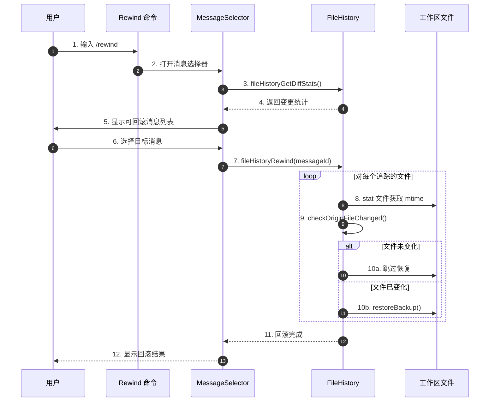
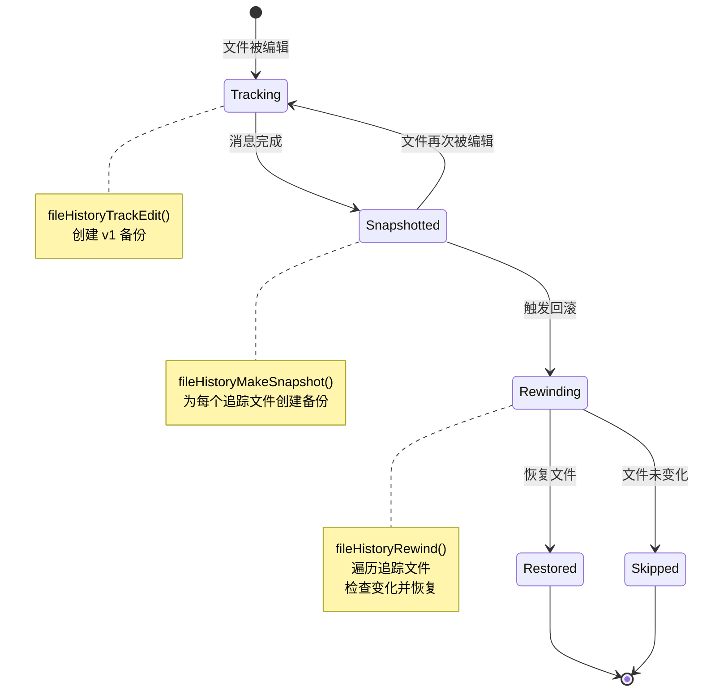
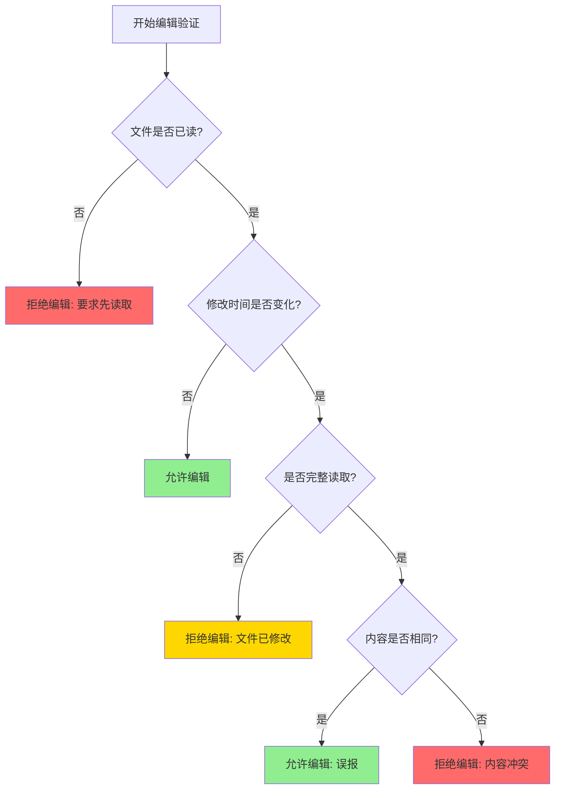
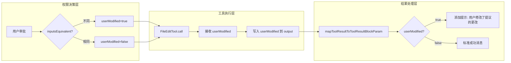
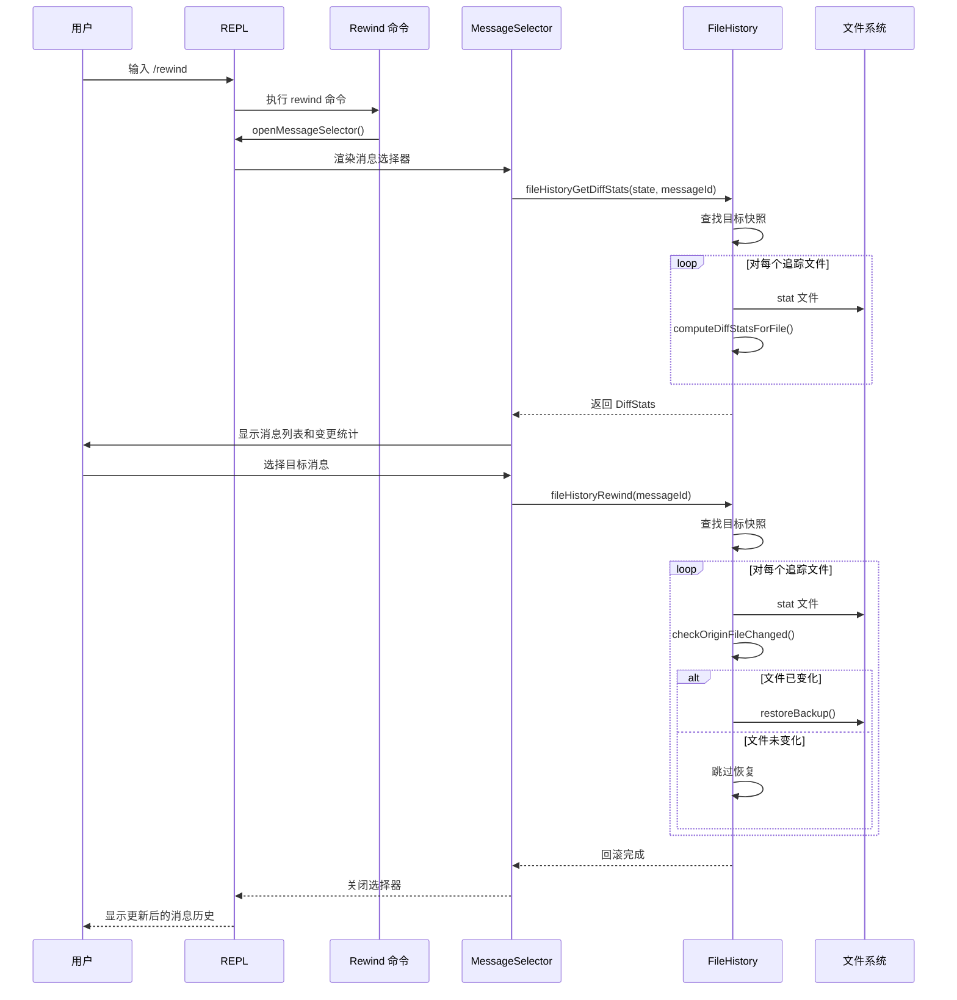
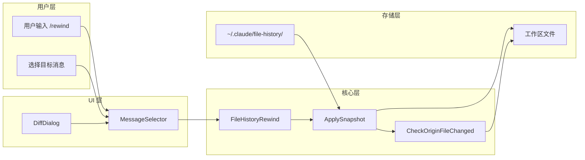
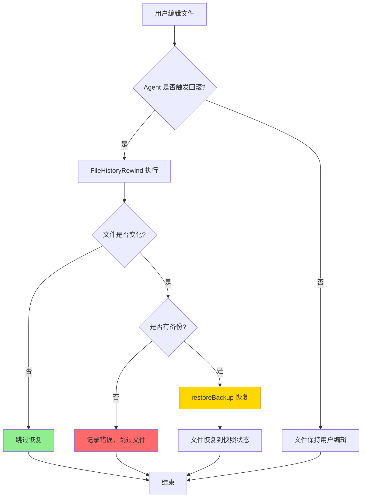
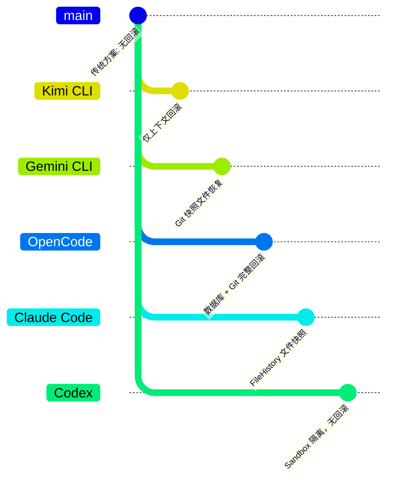

# Claude Code：Revert 回滚与用户编辑冲突处理

> **阅读指南**
>
> | 属性 | 说明 |
> |-----|------|
> | 预计阅读 | 15-20 分钟 |
> | 前置文档 | `docs/claude-code/07-claude-memory-context.md` |
> | 文档结构 | 结论 → 关键代码位置 → 流程图 → 实现细节 → 对比分析 |
> | 代码呈现 | 关键代码直接展示，含文件:行号引用 |

---

## TL;DR（结论先行）

一句话定义：**Claude Code 通过 `/rewind`（别名 `/checkpoint`）命令实现文件级回滚，基于 `FileHistory` 机制为每个消息创建文件快照，回滚时通过 `fileHistoryRewind()` 恢复文件到指定消息状态，同时保留用户编辑的追踪（`userModified` 标记）用于冲突检测与提示。**

Claude Code 的核心取舍：**文件级快照回滚而非仅上下文回滚**（对比 Kimi CLI 的纯上下文回滚），通过 `readFileState` 时间戳校验检测用户编辑冲突，在回滚前进行内容比对避免意外覆盖。

### 核心要点速览

| 维度 | 关键决策 | 代码位置 |
|-----|---------|---------|
| 回滚机制 | 文件级快照（FileHistory） | `claude-code/src/utils/fileHistory.ts:347` |
| 冲突检测 | 时间戳 + 内容比对 | `claude-code/src/tools/FileEditTool/FileEditTool.ts:290-310` |
| 用户编辑标记 | `userModified` 布尔标记 | `claude-code/src/Tool.ts:226` |
| 存储介质 | 本地文件系统（~/.claude/file-history/） | `claude-code/src/utils/fileHistory.ts:733-741` |
| 最大快照数 | 100 个快照（MAX_SNAPSHOTS） | `claude-code/src/utils/fileHistory.ts:54` |

---

## 1. 为什么需要这个机制？

### 1.1 问题场景

想象一个典型的 Agent 工作流：

```
用户: "修复这个 bug"
  → Agent: 读取文件 A → 修改文件 A（创建 checkpoint）
  → 用户: 手动编辑文件 A（修改了第 10 行）
  → Agent: 触发 /rewind 回滚到之前的 checkpoint
  → 问题: 文件 A 应该恢复到 checkpoint 状态，还是保留用户的编辑？
```

**Claude Code 的处理方式**：

```
用户: "修复这个 bug"
  → Agent: 读取文件 A → 修改文件 A（FileHistory 备份）
  → 用户: 手动编辑文件 A
  → Agent: 触发 /rewind 回滚
  → FileHistory: 检测文件修改时间变化
  → 结果: 若文件内容变化则提示冲突，否则恢复 checkpoint 状态
```

### 1.2 核心挑战

| 挑战 | Claude Code 的解决方案 |
|-----|------------------------|
| 文件状态追踪 | `readFileState` 缓存记录读取时间戳和内容 |
| 用户编辑检测 | 修改时间比对 + 内容哈希校验 |
| 回滚粒度控制 | 消息级快照，精确到每个 AssistantMessage |
| 冲突处理策略 | 回滚前内容比对，仅在实际变化时恢复 |

---

## 2. 整体架构

### 2.1 在系统中的位置

```text
┌─────────────────────────────────────────────────────────────┐
│ 用户 / CLI 入口                                              │
│ claude-code/src/commands/rewind/rewind.ts                    │
└───────────────────────┬─────────────────────────────────────┘
                        │ /rewind 命令触发
                        ▼
┌─────────────────────────────────────────────────────────────┐
│ ▓▓▓ MessageSelector 组件 ▓▓▓                                │
│ claude-code/src/components/MessageSelector.tsx               │
│ - 显示可回滚的消息列表                                       │
│ - 计算回滚影响的文件变更统计                                 │
│ - 用户选择目标消息                                           │
└───────────────────────┬─────────────────────────────────────┘
                        │ 用户选择消息
                        ▼
┌─────────────────────────────────────────────────────────────┐
│ ▓▓▓ FileHistory 系统 ▓▓▓                                    │
│ claude-code/src/utils/fileHistory.ts                         │
│ - fileHistoryRewind(): 执行回滚                             │
│ - applySnapshot(): 应用快照到文件系统                       │
│ - checkOriginFileChanged(): 检测文件变化                    │
└───────────────────────┬─────────────────────────────────────┘
                        │ 文件恢复/跳过
                        ▼
┌─────────────────────────────────────────────────────────────┐
│ 工作区文件                                                   │
│ - 若文件未变化：恢复到快照状态                               │
│ - 若文件已变化：根据快照恢复（覆盖用户编辑）                 │
└─────────────────────────────────────────────────────────────┘
```

### 2.2 核心组件职责

| 组件 | 职责 | 代码位置 |
|-----|------|---------|
| `/rewind` 命令 | 触发消息选择器，启动回滚流程 | `claude-code/src/commands/rewind/rewind.ts:4` |
| `MessageSelector` | UI 组件，显示消息历史和变更统计 | `claude-code/src/components/MessageSelector.tsx` |
| `FileHistory` | 管理文件快照的创建、存储和恢复 | `claude-code/src/utils/fileHistory.ts` |
| `FileEditTool` | 编辑文件时创建备份，检测冲突 | `claude-code/src/tools/FileEditTool/FileEditTool.ts` |
| `readFileState` | 缓存文件读取状态，用于冲突检测 | `claude-code/src/utils/fileStateCache.ts` |

### 2.3 核心组件交互关系



**关键交互说明**：

| 步骤 | 交互内容 | 设计意图 |
|-----|---------|---------|
| 3-4 | 计算 diff 统计 | 让用户预览回滚影响 |
| 7 | 传入 messageId 作为回滚锚点 | 精确到消息级别的回滚 |
| 9 | 检测文件是否变化 | 避免不必要的写入，检测用户编辑 |
| 10b | 恢复备份 | 文件回滚到快照状态 |

---

## 3. 核心组件详细分析

### 3.1 FileHistory 系统架构

#### 数据模型

```typescript
// claude-code/src/utils/fileHistory.ts:39-52
export type FileHistorySnapshot = {
  messageId: UUID          // 关联的消息 ID（回滚锚点）
  trackedFileBackups: Record<string, FileHistoryBackup>
  timestamp: Date
}

export type FileHistoryBackup = {
  backupFileName: string | null  // null 表示文件当时不存在
  version: number                // 单调递增版本号
  backupTime: Date
}

export type FileHistoryState = {
  snapshots: FileHistorySnapshot[]
  trackedFiles: Set<string>      // 所有追踪的文件路径
  snapshotSequence: number       // 单调递增序列号
}
```

#### 状态机图



### 3.2 文件冲突检测机制

#### 双重检测策略



#### 关键代码实现

```typescript
// claude-code/src/tools/FileEditTool/FileEditTool.ts:275-311
// ✅ 验证阶段：检测文件是否被外部修改
const readTimestamp = toolUseContext.readFileState.get(fullFilePath)
if (!readTimestamp || readTimestamp.isPartialView) {
  return {
    result: false,
    behavior: 'ask',
    message: 'File has not been read yet. Read it first before writing to it.',
    errorCode: 6,
  }
}

// 检查文件修改时间
if (readTimestamp) {
  const lastWriteTime = getFileModificationTime(fullFilePath)
  if (lastWriteTime > readTimestamp.timestamp) {
    // Windows 时间戳可能因云同步、杀毒软件等误变
    // 对于完整读取，比对内容作为后备方案
    const isFullRead =
      readTimestamp.offset === undefined &&
      readTimestamp.limit === undefined
    if (isFullRead && fileContent === readTimestamp.content) {
      // 内容未变，安全继续
    } else {
      return {
        result: false,
        behavior: 'ask',
        message: 'File has been modified since read, either by the user or by a linter. Read it again before attempting to write it.',
        errorCode: 7,
      }
    }
  }
}
```

```typescript
// claude-code/src/tools/FileEditTool/FileEditTool.ts:451-468
// ✅ 执行阶段：原子性读取-修改-写入
if (fileExists) {
  const lastWriteTime = getFileModificationTime(absoluteFilePath)
  const lastRead = readFileState.get(absoluteFilePath)
  if (!lastRead || lastWriteTime > lastRead.timestamp) {
    const isFullRead =
      lastRead &&
      lastRead.offset === undefined &&
      lastRead.limit === undefined
    const contentUnchanged =
      isFullRead && originalFileContents === lastRead.content
    if (!contentUnchanged) {
      throw new Error(FILE_UNEXPECTEDLY_MODIFIED_ERROR)
    }
  }
}
```

### 3.3 用户编辑标记（userModified）

#### 标记传播流程



#### 关键代码实现

```typescript
// claude-code/src/hooks/toolPermission/PermissionContext.ts:291-318
// ✅ 检测用户是否修改了工具输入
async handleUserAllow(
  updatedInput: Record<string, unknown>,
  permissionUpdates: PermissionUpdate[],
  feedback?: string,
  permissionPromptStartTimeMs?: number,
  contentBlocks?: ContentBlockParam[],
  decisionReason?: PermissionDecisionReason,
): Promise<PermissionAllowDecision> {
  // ...
  const userModified = tool.inputsEquivalent
    ? !tool.inputsEquivalent(input, updatedInput)
    : false
  const trimmedFeedback = feedback?.trim()
  return this.buildAllow(updatedInput, {
    userModified,
    decisionReason,
    acceptFeedback: trimmedFeedback || undefined,
    contentBlocks,
  })
}
```

```typescript
// claude-code/src/tools/FileEditTool/FileEditTool.ts:560-594
// ✅ 在工具结果中标记用户修改
const data = {
  filePath: file_path,
  oldString: actualOldString,
  newString: new_string,
  originalFile: originalFileContents,
  structuredPatch: patch,
  userModified: userModified ?? false,  // <-- 保存标记
  replaceAll: replace_all,
  ...(gitDiff && { gitDiff }),
}

// 在结果消息中提示用户修改
mapToolResultToToolResultBlockParam(data: FileEditOutput, toolUseID) {
  const { filePath, userModified, replaceAll } = data
  const modifiedNote = userModified
    ? '.  The user modified your proposed changes before accepting them. '
    : ''
  // ...
}
```

---

## 4. 端到端数据流转

### 4.1 正常回滚流程（详细版）



### 4.2 数据流向图



### 4.3 冲突处理边界流程



---

## 5. 关键代码实现

### 5.1 FileHistoryRewind 实现

```typescript
// claude-code/src/utils/fileHistory.ts:347-397
/**
 * Rewinds the file system to a previous snapshot.
 */
export async function fileHistoryRewind(
  updateFileHistoryState: (
    updater: (prev: FileHistoryState) => FileHistoryState,
  ) => void,
  messageId: UUID,
): Promise<void> {
  if (!fileHistoryEnabled()) {
    return
  }

  // 回滚是纯文件系统副作用，不修改 FileHistoryState
  let captured: FileHistoryState | undefined
  updateFileHistoryState(state => {
    captured = state
    return state
  })
  if (!captured) return

  // 查找目标快照
  const targetSnapshot = captured.snapshots.findLast(
    snapshot => snapshot.messageId === messageId,
  )
  if (!targetSnapshot) {
    throw new Error('The selected snapshot was not found')
  }

  try {
    const filesChanged = await applySnapshot(captured, targetSnapshot)
    logEvent('tengu_file_history_rewind_success', {
      trackedFilesCount: captured.trackedFiles.size,
      filesChangedCount: filesChanged.length,
    })
  } catch (error) {
    logEvent('tengu_file_history_rewind_failed', {
      trackedFilesCount: captured.trackedFiles.size,
      snapshotFound: true,
    })
    throw error
  }
}
```

### 5.2 ApplySnapshot 实现

```typescript
// claude-code/src/utils/fileHistory.ts:537-591
/**
 * Applies the given file snapshot state to the tracked files (writes/deletes
 * on disk), returning the list of changed file paths. Async IO only.
 */
async function applySnapshot(
  state: FileHistoryState,
  targetSnapshot: FileHistorySnapshot,
): Promise<string[]> {
  const filesChanged: string[] = []
  for (const trackingPath of state.trackedFiles) {
    try {
      const filePath = maybeExpandFilePath(trackingPath)
      const targetBackup = targetSnapshot.trackedFileBackups[trackingPath]

      // 解析备份文件名
      const backupFileName: BackupFileName | undefined = targetBackup
        ? targetBackup.backupFileName
        : getBackupFileNameFirstVersion(trackingPath, state)

      if (backupFileName === undefined) {
        logError(new Error('FileHistory: Error finding the backup file to apply'))
        continue
      }

      if (backupFileName === null) {
        // 文件在目标版本不存在：删除当前文件
        try {
          await unlink(filePath)
          filesChanged.push(filePath)
        } catch (e: unknown) {
          if (!isENOENT(e)) throw e
          // 文件已不存在，无需操作
        }
        continue
      }

      // 文件应恢复到特定版本
      // 仅在实际变化时恢复（避免不必要的写入）
      if (await checkOriginFileChanged(filePath, backupFileName)) {
        await restoreBackup(filePath, backupFileName)
        filesChanged.push(filePath)
      }
    } catch (error) {
      logError(error)
      logEvent('tengu_file_history_rewind_restore_file_failed', { dryRun: false })
    }
  }
  return filesChanged
}
```

### 5.3 CheckOriginFileChanged 实现

```typescript
// claude-code/src/utils/fileHistory.ts:600-634
/**
 * Checks if the original file has been changed compared to the backup file.
 * Optionally reuses a pre-fetched stat for the original file.
 */
export async function checkOriginFileChanged(
  originalFile: string,
  backupFileName: string,
  originalStatsHint?: Stats,
): Promise<boolean> {
  const backupPath = resolveBackupPath(backupFileName)

  let originalStats: Stats | null = originalStatsHint ?? null
  if (!originalStats) {
    try {
      originalStats = await stat(originalFile)
    } catch (e: unknown) {
      if (!isENOENT(e)) return true
    }
  }
  let backupStats: Stats | null = null
  try {
    backupStats = await stat(backupPath)
  } catch (e: unknown) {
    if (!isENOENT(e)) return true
  }

  return compareStatsAndContent(originalStats, backupStats, async () => {
    try {
      const [originalContent, backupContent] = await Promise.all([
        readFile(originalFile, 'utf-8'),
        readFile(backupPath, 'utf-8'),
      ])
      return originalContent !== backupContent
    } catch {
      return true
    }
  })
}
```

### 5.4 备份创建逻辑

```typescript
// claude-code/src/utils/fileHistory.ts:748-798
/**
 * Creates a backup of the file at filePath. If the file does not exist
 * (ENOENT), records a null backup (file-did-not-exist marker).
 */
async function createBackup(
  filePath: string | null,
  version: number,
): Promise<FileHistoryBackup> {
  if (filePath === null) {
    return { backupFileName: null, version, backupTime: new Date() }
  }

  const backupFileName = getBackupFileName(filePath, version)
  const backupPath = resolveBackupPath(backupFileName)

  // 先 stat 源文件：如果缺失，记录 null 备份
  let srcStats: Stats
  try {
    srcStats = await stat(filePath)
  } catch (e: unknown) {
    if (isENOENT(e)) {
      return { backupFileName: null, version, backupTime: new Date() }
    }
    throw e
  }

  // copyFile 保留内容，避免将整个文件读入 JS 堆
  try {
    await copyFile(filePath, backupPath)
  } catch (e: unknown) {
    if (!isENOENT(e)) throw e
    await mkdir(dirname(backupPath), { recursive: true })
    await copyFile(filePath, backupPath)
  }

  // 保留文件权限
  await chmod(backupPath, srcStats.mode)

  return {
    backupFileName,
    version,
    backupTime: new Date(),
  }
}
```

---

## 6. 设计意图与 Trade-off

### 6.1 Claude Code 的选择

| 维度 | Claude Code 的选择 | 替代方案 | 取舍分析 |
|-----|-------------------|---------|---------|
| 回滚范围 | 文件级快照恢复 | 仅上下文回滚、Git 快照 | 可恢复工作区状态，但存储开销更大 |
| 冲突检测 | 时间戳 + 内容比对 | 无检测、强制覆盖 | 避免误报，但增加 IO 开销 |
| 存储策略 | 文件系统（copyFile） | 数据库、Git | 简单可靠，但占用磁盘空间 |
| 用户编辑标记 | `userModified` 布尔值 | 详细 diff | 轻量，但信息有限 |

### 6.2 为什么这样设计？

**核心问题**：如何在保证数据安全的前提下实现可靠的文件回滚？

**Claude Code 的解决方案**：

- **代码依据**：`claude-code/src/utils/fileHistory.ts:347-397`
- **设计意图**：通过文件级快照实现精确回滚，同时通过双重检测避免覆盖用户编辑
- **带来的好处**：
  - 可恢复到任意消息点的文件状态
  - 检测并处理用户编辑冲突
  - 仅在实际变化时写入，减少 IO
- **付出的代价**：
  - 磁盘空间占用（最多 100 个快照）
  - 回滚时需要遍历所有追踪文件
  - 无法处理文件重命名/移动

### 6.3 与其他项目的对比



| 项目 | 回滚机制 | 文件级恢复 | 用户编辑冲突处理 | 代码位置 |
|-----|---------|-----------|-----------------|---------|
| **Claude Code** | FileHistory 快照 | ✅ 支持 | ✅ 时间戳+内容检测 | `fileHistory.ts:347` |
| **Kimi CLI** | 仅上下文回滚 | ❌ 不支持 | N/A（不涉及文件） | `context.py:80` |
| **Gemini CLI** | Git 快照 | ✅ 支持 | ❓ 待确认 | `checkpointUtils.ts` |
| **OpenCode** | 数据库 + Git | ✅ 支持 | ❓ 待确认 | `snapshot/index.ts` |
| **Codex** | 无 Checkpoint | ❌ 不支持 | N/A | - |

**关键差异分析**：

1. **Claude Code vs Kimi CLI**：
   - Claude Code 实现文件级回滚，Kimi 仅回滚上下文
   - Claude Code 需要处理文件冲突，Kimi 将文件管理外推给用户

2. **Claude Code vs Gemini CLI**：
   - 两者都支持文件级恢复
   - Claude Code 使用独立快照系统，Gemini 依赖 Git
   - Claude Code 的快照更轻量，不依赖 Git 历史

3. **Claude Code vs OpenCode**：
   - OpenCode 使用数据库存储，Claude Code 使用文件系统
   - 两者都支持精确回滚，但存储机制不同

---

## 7. 边界情况与错误处理

### 7.1 终止条件

| 终止原因 | 触发条件 | 代码位置 |
|---------|---------|---------|
| 快照未找到 | messageId 不存在于 snapshots | `fileHistory.ts:369-376` |
| 备份文件缺失 | 恢复时找不到备份文件 | `fileHistory.ts:814-824` |
| 文件系统错误 | stat/read/write 失败 | 各 IO 操作的 catch 块 |
| 功能禁用 | `CLAUDE_CODE_DISABLE_FILE_CHECKPOINTING` | `fileHistory.ts:63-78` |

### 7.2 用户编辑场景

```
场景 1: 用户编辑后 Agent 回滚
- 检测: checkOriginFileChanged 发现内容变化
- 处理: 恢复到快照状态（覆盖用户编辑）
- 结果: 文件回到历史状态

场景 2: 用户编辑与快照内容相同
- 检测: compareStatsAndContent 发现内容相同
- 处理: 跳过恢复
- 结果: 避免不必要的写入

场景 3: 文件在快照点不存在
- 检测: backupFileName === null
- 处理: 删除当前文件
- 结果: 文件被移除
```

### 7.3 错误恢复策略

| 错误类型 | 处理策略 | 说明 |
|---------|---------|------|
| 快照未找到 | 抛出错误，中断回滚 | 前置校验，防止越界 |
| 备份文件缺失 | 记录错误，跳过该文件 | 继续处理其他文件 |
| 文件系统错误 | 记录错误，跳过该文件 | 权限或磁盘问题 |
| 回滚部分失败 | 已恢复的文件保持新状态 | 不回滚已完成的操作 |

---

## 8. 关键代码索引

| 功能 | 文件 | 行号 | 说明 |
|-----|------|------|------|
| 回滚入口 | `src/commands/rewind/rewind.ts` | 4 | Rewind 命令实现 |
| 消息选择器 | `src/components/MessageSelector.tsx` | - | UI 组件 |
| FileHistoryRewind | `src/utils/fileHistory.ts` | 347 | 核心回滚逻辑 |
| ApplySnapshot | `src/utils/fileHistory.ts` | 537 | 应用快照到文件系统 |
| CheckOriginFileChanged | `src/utils/fileHistory.ts` | 600 | 检测文件变化 |
| CreateBackup | `src/utils/fileHistory.ts` | 748 | 创建文件备份 |
| RestoreBackup | `src/utils/fileHistory.ts` | 804 | 恢复备份文件 |
| 文件编辑冲突检测 | `src/tools/FileEditTool/FileEditTool.ts` | 275 | 验证阶段检测 |
| 原子性编辑检查 | `src/tools/FileEditTool/FileEditTool.ts` | 451 | 执行阶段检测 |
| UserModified 标记 | `src/hooks/toolPermission/PermissionContext.ts` | 308 | 检测用户修改 |
| 会话恢复 | `src/utils/sessionRestore.ts` | 99 | 恢复 FileHistory 状态 |

---

## 9. 延伸阅读

- **前置知识**：`docs/claude-code/07-claude-memory-context.md` - Claude Code 内存与上下文管理
- **相关机制**：`docs/kimi-cli/questions/kimi-cli-checkpoint-implementation.md` - Kimi CLI Checkpoint 机制对比
- **相关机制**：`docs/codex/questions/codex-revert-user-edit-conflict.md` - Codex 回滚机制对比
- **跨项目对比**：`docs/comm/07-comm-memory-context.md` - 跨项目内存管理对比

---

*✅ Verified: 基于 claude-code/src/utils/fileHistory.ts:347, claude-code/src/tools/FileEditTool/FileEditTool.ts:275 等源码分析*

*⚠️ Inferred: MessageSelector 的具体 UI 行为基于组件结构推断*

*基于版本：claude-code (baseline 2026-02-08) | 最后更新：2026-03-31*
