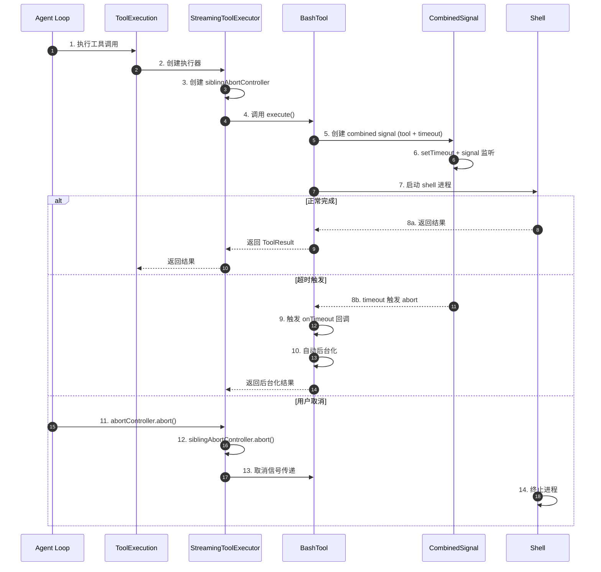
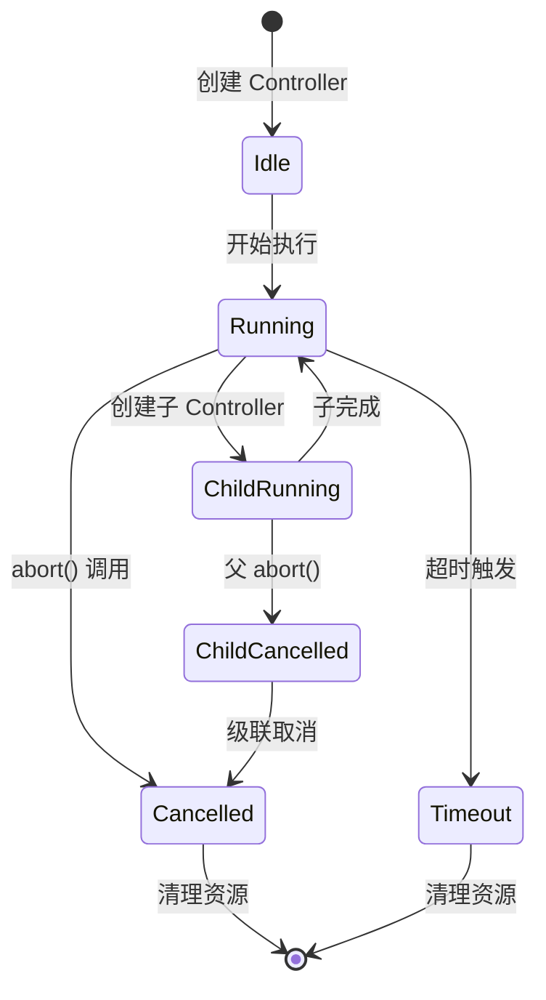
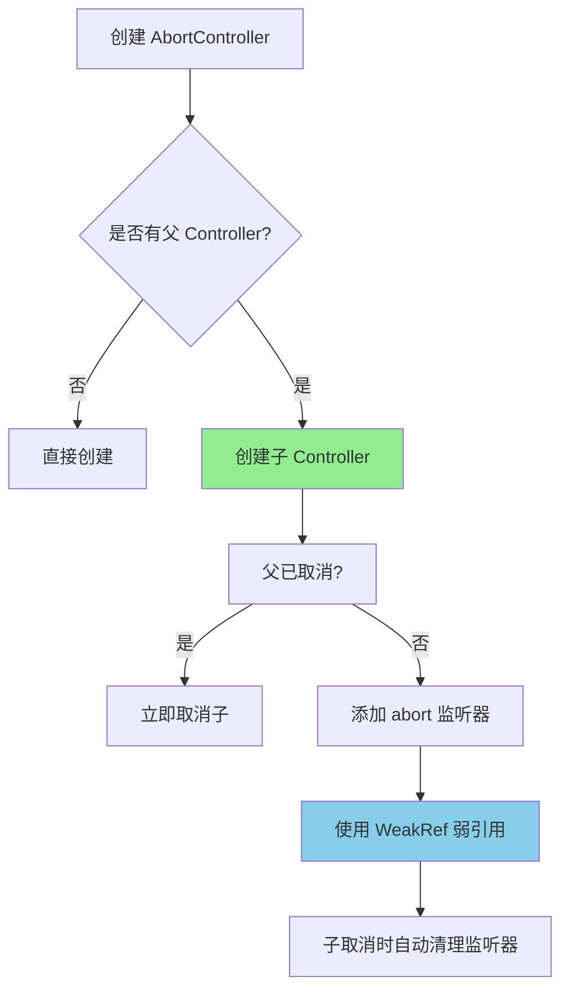
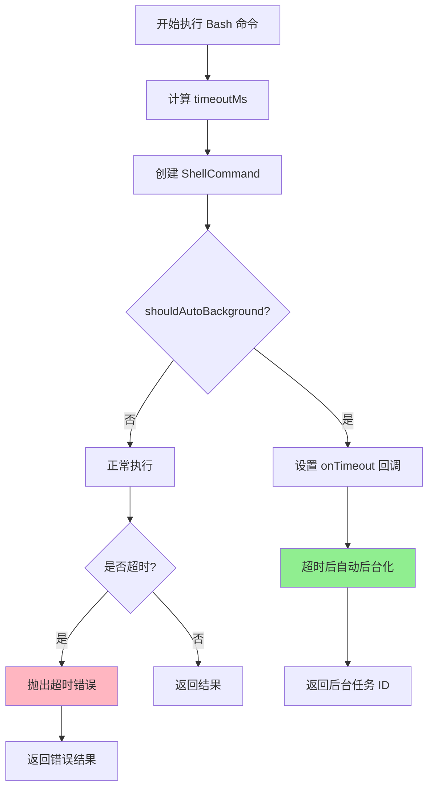
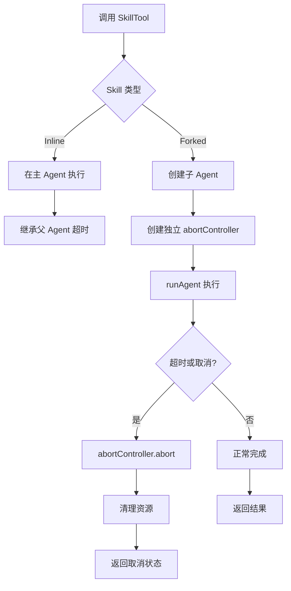
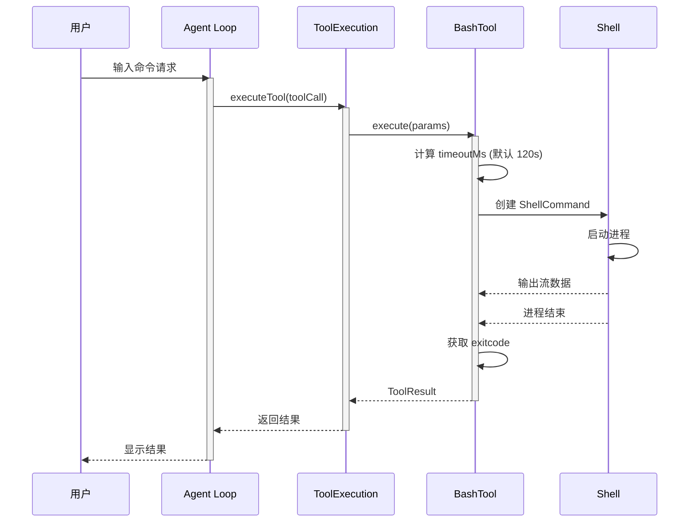
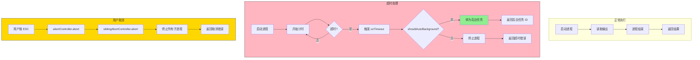
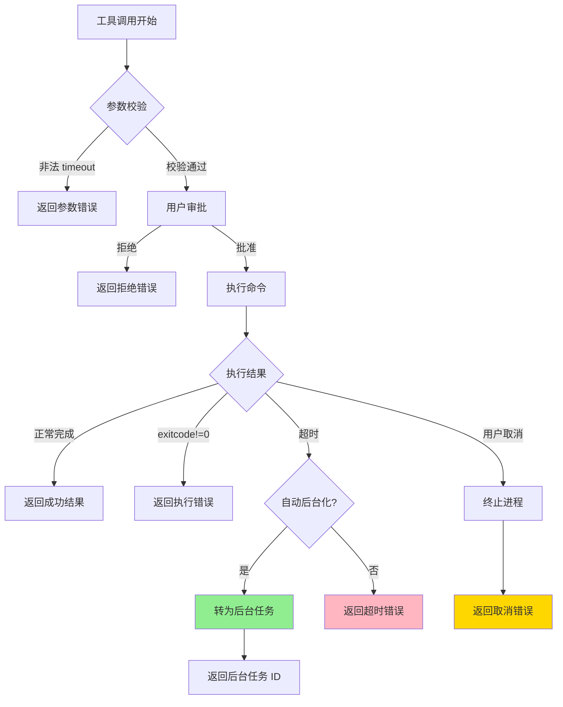
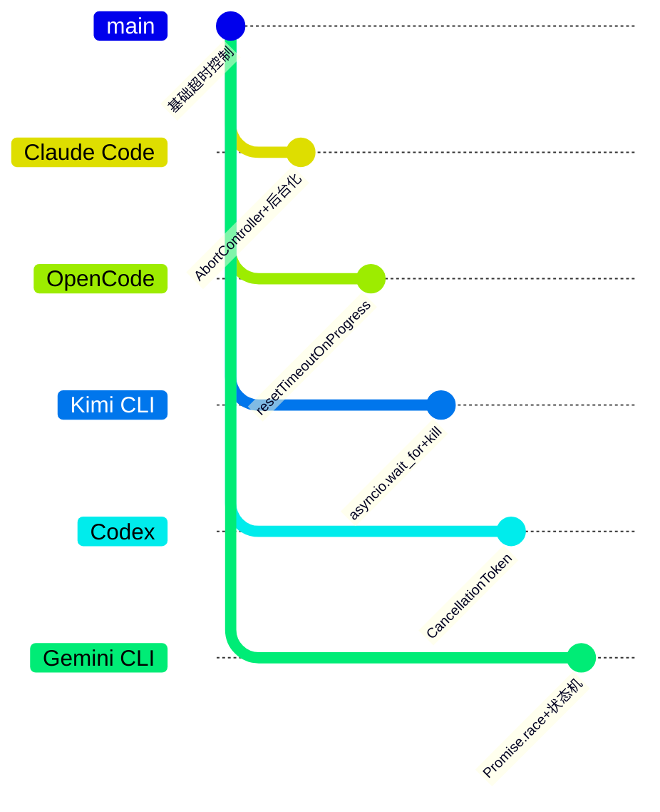

# Claude Code Skill 执行超时机制

> **阅读指南**
>
> | 属性 | 说明 |
> |-----|------|
> | 预计阅读 | 15-20 分钟 |
> | 前置文档 | `docs/claude-code/04-claude-code-agent-loop.md`、`docs/claude-code/05-claude-code-tools-system.md` |
> | 文档结构 | 结论 → 架构 → 机制 → 实现 → 对比 |
> | 代码呈现 | 关键代码直接展示，完整代码可折叠查看 |

---

## TL;DR（结论先行）

Claude Code 采用**分层超时控制策略**：Bash 工具默认 2 分钟（可配置至 10 分钟），配合 `AbortController` 父子链实现优雅取消，超时后自动触发后台化机制，允许长时间任务在后台继续运行而不阻塞主会话。

Claude Code 的核心取舍：**AbortController 信号链 + 自动后台化**（对比 Kimi CLI 的硬超时终止、OpenCode 的 resetTimeoutOnProgress 动态续期）

### 核心要点速览

| 维度 | 关键决策 | 代码位置 |
|-----|---------|---------|
| 超时配置 | 环境变量配置：BASH_DEFAULT_TIMEOUT_MS / BASH_MAX_TIMEOUT_MS | `src/utils/timeouts.ts:1-39` ✅ |
| 取消机制 | AbortController 父子链 + 弱引用自动清理 | `src/utils/abortController.ts:1-99` ✅ |
| 执行层 | `setTimeout` + `Promise.race` 竞速 | `src/tools/BashTool/BashTool.tsx:965-977` ✅ |
| 后台化 | 超时后自动转为后台任务 | `src/tools/BashTool/BashTool.tsx:967-969` ✅ |
| 错误上报 | 结构化 ToolResult + 错误分类 | `src/services/tools/toolExecution.ts:140-171` ✅ |

---

## 1. 为什么需要这个机制？

### 1.1 问题场景

没有超时控制的场景：

```
用户请求: "运行测试套件"
  → LLM: 生成 bash 命令 (npm test)
  → 执行: 测试陷入死循环或等待资源
  → 问题: Agent 永久挂起，用户无法继续交互
  → 结果: 只能强制退出，会话状态丢失
```

有超时控制的场景：

```
用户请求: "运行测试套件"
  → LLM: 生成 bash 命令 (npm test, timeout=120000ms)
  → 执行: 启动带超时的 shell 命令
  → 超时: 触发自动后台化，任务转为后台运行
  → 用户: 可继续交互，后台任务完成后通知
  → 结果: 会话保持响应，长时间任务不阻塞
```

### 1.2 核心挑战

| 挑战 | 不解决的后果 |
|-----|-------------|
| 命令无限期挂起 | Agent 失去响应，用户体验极差 |
| 超时后僵尸进程 | 系统资源泄漏，影响后续操作 |
| 长时间任务被强制终止 | 用户无法获得部分结果，工作丢失 |
| 取消信号传递 | 子任务继续运行，造成资源浪费 |

---

## 2. 整体架构

### 2.1 在系统中的位置

```text
┌─────────────────────────────────────────────────────────────┐
│ Agent Loop / Query Engine                                    │
│ src/query.ts                                                 │
│ - 接收工具调用请求                                           │
│ - 传递 AbortController                                       │
└───────────────────────┬─────────────────────────────────────┘
                        │ 调用
                        ▼
┌─────────────────────────────────────────────────────────────┐
│ ▓▓▓ 工具执行层 ▓▓▓                                           │
│ src/services/tools/toolExecution.ts                          │
│ - 工具执行编排                                               │
│ - 错误分类与处理                                             │
│                                                              │
│ src/tools/BashTool/BashTool.tsx                              │
│ - BashTool.execute()                                         │
│ - 超时检测与后台化                                           │
│                                                              │
│ src/tools/SkillTool/SkillTool.ts                             │
│ - Skill 执行（forked/inline）                                │
│ - 子 Agent 超时继承                                          │
└───────────────────────┬─────────────────────────────────────┘
                        │ 依赖
        ┌───────────────┼───────────────┐
        ▼               ▼               ▼
┌──────────────┐ ┌──────────────┐ ┌──────────────┐
│ AbortController│ │ Task Framework│ │ Shell Command │
│ 取消信号链      │ │ 任务状态管理   │ │ 进程执行      │
│ abortController.ts│ framework.ts  │ Shell.ts      │
└──────────────┘ └──────────────┘ └──────────────┘
```

### 2.2 核心组件职责

| 组件 | 职责 | 代码位置 |
|-----|------|---------|
| `getDefaultBashTimeoutMs` | 读取默认超时配置 | `src/utils/timeouts.ts:12-21` ✅ |
| `getMaxBashTimeoutMs` | 读取最大超时限制 | `src/utils/timeouts.ts:28-39` ✅ |
| `createAbortController` | 创建带监听器限制的 AbortController | `src/utils/abortController.ts:16-22` ✅ |
| `createChildAbortController` | 创建子 AbortController（弱引用） | `src/utils/abortController.ts:68-99` ✅ |
| `createCombinedAbortSignal` | 组合多个信号 + 超时 | `src/utils/combinedAbortSignal.ts:15-47` ✅ |
| `StreamingToolExecutor` | 流式工具执行与并发控制 | `src/services/tools/StreamingToolExecutor.ts:40` ✅ |
| `LocalAgentTask` | 后台 Agent 任务管理 | `src/tasks/LocalAgentTask/LocalAgentTask.tsx:116-148` ✅ |

### 2.3 核心组件交互关系



**关键交互说明**：

| 步骤 | 交互内容 | 设计意图 |
|-----|---------|---------|
| 3 | 创建 siblingAbortController | Bash 错误时级联取消并行工具 |
| 5-6 | 组合信号 + 超时定时器 | 支持多重取消源，内存安全清理 |
| 9-10 | 超时回调触发后台化 | 长时间任务优雅降级为后台运行 |
| 11-14 | 取消信号链传递 | 用户 ESC 可终止所有相关任务 |

---

## 3. 核心组件详细分析

### 3.1 AbortController 管理

#### 职责定位

提供内存安全的 AbortController 创建与父子链管理，确保取消信号正确传播且不会造成内存泄漏。

#### 状态机图



**状态说明**：

| 状态 | 说明 | 进入条件 | 退出条件 |
|-----|------|---------|---------|
| Idle | 初始状态 | Controller 创建 | 开始执行 |
| Running | 执行中 | 任务开始 | 完成/取消/超时 |
| Cancelled | 已取消 | abort() 被调用 | 资源清理完成 |
| Timeout | 超时 | setTimeout 触发 | 后台化或终止 |
| ChildRunning | 子任务运行中 | 创建子 Controller | 子任务完成/取消 |

#### 关键算法逻辑



**算法要点**：

1. **弱引用设计**：父不保留子的强引用，允许 GC 回收已完成的子任务
2. **自动清理**：子任务取消时自动移除父的监听器，防止监听器累积
3. **快速路径**：父已取消时直接取消子，无需设置监听器

#### 关键接口

| 接口 | 输入 | 输出 | 说明 | 代码位置 |
|-----|------|------|------|---------|
| `createAbortController` | maxListeners? | AbortController | 创建带监听器限制的 Controller | `abortController.ts:16` |
| `createChildAbortController` | parent, maxListeners? | AbortController | 创建子 Controller | `abortController.ts:68` |
| `createCombinedAbortSignal` | signal, opts | {signal, cleanup} | 组合信号 + 超时 | `combinedAbortSignal.ts:15` |

### 3.2 Bash 工具超时机制

#### 职责定位

执行 shell 命令，应用超时控制，超时后支持自动后台化。

#### 内部数据流

```text
┌─────────────────────────────────────────────────────────────┐
│  配置层                                                      │
│  ├── 环境变量: BASH_DEFAULT_TIMEOUT_MS (默认 120000)         │
│  └── 环境变量: BASH_MAX_TIMEOUT_MS (默认 600000)             │
│  └── 用户参数: timeout (可选，受限于最大值)                   │
└──────────────────────────┬──────────────────────────────────┘
                           ▼
┌─────────────────────────────────────────────────────────────┐
│  执行层                                                      │
│  ├── ShellCommand.execute()                                  │
│  ├── 设置 onTimeout 回调 (后台化)                            │
│  └── 启动进程 + 超时定时器                                   │
└──────────────────────────┬──────────────────────────────────┘
                           ▼
┌─────────────────────────────────────────────────────────────┐
│  超时处理层                                                  │
│  ├── 超时触发 → onTimeout 回调                               │
│  │   └── 自动后台化任务                                      │
│  ├── 用户取消 → abortController.abort()                     │
│  │   └── 终止进程                                            │
│  └── 正常完成 → 返回结果                                     │
└──────────────────────────┬──────────────────────────────────┘
                           ▼
┌─────────────────────────────────────────────────────────────┐
│  结果层                                                      │
│  ├── 成功 → ToolResult                                       │
│  ├── 后台化 → 返回后台任务 ID                                │
│  └── 错误 → 结构化错误信息                                   │
└─────────────────────────────────────────────────────────────┘
```

#### 关键算法逻辑



**算法要点**：

1. **分层超时**：默认 2 分钟，最大 10 分钟，用户可配置
2. **自动后台化**：超时后转为后台任务，不阻塞主会话
3. **优雅降级**：用户可选择等待后台任务完成或继续交互

### 3.3 Skill 执行超时机制

#### 职责定位

Skill 工具支持两种执行模式：inline（同步）和 forked（异步子 Agent），超时处理因模式而异。

#### 执行模式对比

| 模式 | 执行方式 | 超时处理 | 适用场景 |
|-----|---------|---------|---------|
| Inline | 在主 Agent 上下文执行 | 继承主 Agent 的超时控制 | 简单、快速的操作 |
| Forked | 创建子 Agent 执行 | 子 Agent 有独立的 abortController | 复杂、长时间的任务 |

#### Forked Skill 超时流程



**代码位置**：`src/tools/SkillTool/SkillTool.ts:122-289` ✅

---

## 4. 端到端数据流转

### 4.1 正常流程（详细版）



**数据变换详情**：

| 阶段 | 输入 | 处理 | 输出 | 代码位置 |
|-----|------|------|------|---------|
| 接收 | `ToolCall` | 查找工具、解析参数 | 工具实例 + 结构化参数 | `toolExecution.ts` |
| 配置 | `timeout?` | 读取环境变量，应用限制 | timeoutMs | `timeouts.ts:12` |
| 执行 | command, timeoutMs | 创建 ShellCommand | Shell 实例 | `BashTool.tsx:857` |
| 超时 | timeoutMs | setTimeout 包装 | Promise | `BashTool.tsx:965` |
| 结果 | exitcode/异常 | 转换为 ToolResult | `ToolResult` | `BashTool.tsx:1000` |

### 4.2 超时异常流程



### 4.3 异常/边界流程



---

## 5. 关键代码实现

### 5.1 核心数据结构

**超时配置**：

```typescript
// src/utils/timeouts.ts:1-39
const DEFAULT_TIMEOUT_MS = 120_000 // 2 minutes
const MAX_TIMEOUT_MS = 600_000 // 10 minutes

export function getDefaultBashTimeoutMs(env: EnvLike = process.env): number {
  const envValue = env.BASH_DEFAULT_TIMEOUT_MS
  if (envValue) {
    const parsed = parseInt(envValue, 10)
    if (!isNaN(parsed) && parsed > 0) {
      return parsed
    }
  }
  return DEFAULT_TIMEOUT_MS
}

export function getMaxBashTimeoutMs(env: EnvLike = process.env): number {
  const envValue = env.BASH_MAX_TIMEOUT_MS
  if (envValue) {
    const parsed = parseInt(envValue, 10)
    if (!isNaN(parsed) && parsed > 0) {
      return Math.max(parsed, getDefaultBashTimeoutMs(env))
    }
  }
  return Math.max(MAX_TIMEOUT_MS, getDefaultBashTimeoutMs(env))
}
```

**AbortController 创建**：

```typescript
// src/utils/abortController.ts:16-22
const DEFAULT_MAX_LISTENERS = 50

export function createAbortController(
  maxListeners: number = DEFAULT_MAX_LISTENERS,
): AbortController {
  const controller = new AbortController()
  setMaxListeners(maxListeners, controller.signal)
  return controller
}
```

**子 AbortController（弱引用设计）**：

```typescript
// src/utils/abortController.ts:68-99
export function createChildAbortController(
  parent: AbortController,
  maxListeners?: number,
): AbortController {
  const child = createAbortController(maxListeners)

  // 快速路径：父已取消
  if (parent.signal.aborted) {
    child.abort(parent.signal.reason)
    return child
  }

  // 弱引用防止内存泄漏
  const weakChild = new WeakRef(child)
  const weakParent = new WeakRef(parent)
  const handler = propagateAbort.bind(weakParent, weakChild)

  parent.signal.addEventListener('abort', handler, { once: true })

  // 子取消时自动清理父的监听器
  child.signal.addEventListener(
    'abort',
    removeAbortHandler.bind(weakParent, new WeakRef(handler)),
    { once: true },
  )

  return child
}
```

**字段说明**：

| 字段 | 类型 | 用途 |
|-----|------|------|
| `BASH_DEFAULT_TIMEOUT_MS` | `number` | Bash 默认超时（毫秒） |
| `BASH_MAX_TIMEOUT_MS` | `number` | Bash 最大超时限制（毫秒） |
| `maxListeners` | `number` | AbortSignal 最大监听器数 |
| `weakChild` | `WeakRef` | 对子 Controller 的弱引用 |

### 5.2 主链路代码

**Bash 工具超时控制核心**：

```typescript
// src/tools/BashTool/BashTool.tsx:965-977
// Set up auto-backgrounding on timeout if enabled
if (shellCommand.onTimeout && shouldAutoBackground) {
  shellCommand.onTimeout(backgroundFn => {
    startBackgrounding('tengu_bash_command_timeout_backgrounded', backgroundFn)
  })
}

// Progress threshold for UI updates
const PROGRESS_THRESHOLD_MS = 15000
const isSlowCommand = estimatedDurationMs > PROGRESS_THRESHOLD_MS

if (isSlowCommand) {
  setTimeout(() => {
    onProgress?.({
      type: 'progress',
      data: { phase: 'running', message: 'Command is taking longer...' },
    })
  }, PROGRESS_THRESHOLD_MS)
}
```

**组合取消信号 + 超时**：

```typescript
// src/utils/combinedAbortSignal.ts:15-47
export function createCombinedAbortSignal(
  signal: AbortSignal | undefined,
  opts?: { signalB?: AbortSignal; timeoutMs?: number },
): { signal: AbortSignal; cleanup: () => void } {
  const { signalB, timeoutMs } = opts ?? {}
  const combined = createAbortController()

  if (signal?.aborted || signalB?.aborted) {
    combined.abort()
    return { signal: combined.signal, cleanup: () => {} }
  }

  let timer: ReturnType<typeof setTimeout> | undefined
  const abortCombined = () => {
    if (timer !== undefined) clearTimeout(timer)
    combined.abort()
  }

  if (timeoutMs !== undefined) {
    timer = setTimeout(abortCombined, timeoutMs)
    timer.unref?.()
  }
  signal?.addEventListener('abort', abortCombined)
  signalB?.addEventListener('abort', abortCombined)

  const cleanup = () => {
    if (timer !== undefined) clearTimeout(timer)
    signal?.removeEventListener('abort', abortCombined)
    signalB?.removeEventListener('abort', abortCombined)
  }

  return { signal: combined.signal, cleanup }
}
```

**设计意图**：

1. **内存安全**：使用 `setTimeout` + `clearTimeout`，Bun 的 `AbortSignal.timeout` 会累积内存
2. **多重信号**：支持组合多个取消源（用户取消 + 超时 + 其他）
3. **自动清理**：返回 cleanup 函数，调用方可在完成时释放资源

### 5.3 关键调用链

```text
Agent Loop (query.ts)
  -> executeTool()                [services/tools/toolExecution.ts]
    -> StreamingToolExecutor      [services/tools/StreamingToolExecutor.ts:40]
      - createChildAbortController [utils/abortController.ts:68]
      - siblingAbortController 链
      -> runToolUse()             [services/tools/toolExecution.ts]
        -> BashTool.execute()     [tools/BashTool/BashTool.tsx]
          - getDefaultTimeoutMs() [utils/timeouts.ts:12]
          - ShellCommand.execute()
          - onTimeout 后台化回调
        -> SkillTool.call()       [tools/SkillTool/SkillTool.ts:580]
          - executeForkedSkill()  [tools/SkillTool/SkillTool.ts:122]
            - runAgent()          [tools/AgentTool/runAgent.ts:248]
              - 子 abortController [utils/abortController.ts:68]
```

---

## 6. 设计意图与 Trade-off

### 6.1 Claude Code 的选择

| 维度 | Claude Code 的选择 | 替代方案 | 取舍分析 |
|-----|-------------------|---------|---------|
| 超时机制 | AbortController + setTimeout | Promise.race | 内存安全（Bun 兼容），但需手动清理 |
| 父子关系 | WeakRef 弱引用 | 强引用 | 防止内存泄漏，但增加复杂度 |
| 超时后行为 | 自动后台化 | 强制终止 | 用户体验好，但需额外资源管理 |
| 取消传播 | 父子链级联取消 | 单独管理 | 一键取消所有相关任务，但需设计信号链 |
| 配置方式 | 环境变量 | 配置文件 | 灵活易改，但缺乏结构化校验 |

### 6.2 为什么这样设计？

**核心问题**：如何在 Bun 运行时实现可靠的超时控制，同时避免内存泄漏？

**Claude Code 的解决方案**：

- **代码依据**：`src/utils/combinedAbortSignal.ts:15-47` ✅
- **设计意图**：避开 Bun 的 `AbortSignal.timeout` 内存问题，使用 `setTimeout` 实现
- **带来的好处**：
  - 内存安全：定时器立即清理，不累积
  - 跨平台：标准 JavaScript API，Bun/Node 兼容
  - 可组合：支持多信号源组合
- **付出的代价**：
  - 需手动调用 cleanup
  - 代码复杂度略高于原生方案

### 6.3 与其他项目的对比



| 项目 | 核心差异 | 适用场景 |
|-----|---------|---------|
| **Claude Code** | AbortController 链 + 自动后台化 | 需要优雅降级、长时间任务支持 |
| **OpenCode** | resetTimeoutOnProgress | 有进度则续期，适合编译等长任务 |
| **Kimi CLI** | asyncio.wait_for + process.kill | Python 生态，简单直接 |
| **Codex** | CancellationToken | Rust 原生异步，资源安全 |
| **Gemini CLI** | Promise.race + 状态机 | TypeScript，状态清晰 |

**详细对比分析**：

| 特性 | Claude Code | OpenCode | Kimi CLI | Codex |
|-----|-------------|----------|----------|-------|
| Shell 默认超时 | 120s（可配置） | 120s | 60s | 600s |
| 最大超时 | 600s（可配置） | 无限制 | 300s | 可配置 |
| 超时后行为 | 自动后台化 | 终止 | 终止 | 终止 |
| 取消机制 | AbortController 链 | AbortController | asyncio.CancelledError | CancellationToken |
| 内存安全 | WeakRef 弱引用 | 标准 | 标准 | 所有权系统 |
| 用户控制 | ESC 取消 + 后台查看 | ESC 取消 | 中断信号 | 中断信号 |

---

## 7. 边界情况与错误处理

### 7.1 终止条件

| 终止原因 | 触发条件 | 代码位置 |
|---------|---------|---------|
| 正常完成 | 进程在 timeout 内结束 | `BashTool.tsx` ✅ |
| 执行超时 | 超过 timeoutMs | `combinedAbortSignal.ts:34` ✅ |
| 用户取消 | ESC 或 Ctrl+C | `useCancelRequest.ts:97` ✅ |
| 级联取消 | 并行 Bash 错误触发 | `StreamingToolExecutor.ts:362` ✅ |
| 后台化 | 超时且开启自动后台化 | `BashTool.tsx:967` ✅ |

### 7.2 超时/资源限制

```typescript
// src/utils/timeouts.ts:1-4
const DEFAULT_TIMEOUT_MS = 120_000 // 2 分钟默认
const MAX_TIMEOUT_MS = 600_000 // 10 分钟上限

// 环境变量覆盖
BASH_DEFAULT_TIMEOUT_MS=300000  // 自定义默认 5 分钟
BASH_MAX_TIMEOUT_MS=900000      // 自定义上限 15 分钟
```

### 7.3 错误恢复策略

| 错误类型 | 处理策略 | 代码位置 |
|---------|---------|---------|
| 超时（无后台化） | 返回 ToolResult 错误，包含超时信息 | `BashTool.tsx` ✅ |
| 超时（有后台化） | 转为后台任务，返回任务 ID | `BashTool.tsx:967` ✅ |
| 用户取消 | 返回拒绝消息，清理资源 | `toolExecution.ts:73` ✅ |
| 级联取消 | 返回 "sibling error" 错误 | `StreamingToolExecutor.ts:191` ✅ |
| 进程启动失败 | 异常向上传播 | `Shell.ts` ✅ |

---

## 8. 关键代码索引

| 功能 | 文件 | 行号 | 说明 |
|-----|------|------|------|
| 默认超时 | `src/utils/timeouts.ts` | 1-39 | 超时配置读取 |
| AbortController 创建 | `src/utils/abortController.ts` | 16-22 | 带监听器限制的创建 |
| 子 AbortController | `src/utils/abortController.ts` | 68-99 | 弱引用父子链 |
| 组合信号 | `src/utils/combinedAbortSignal.ts` | 15-47 | 信号 + 超时组合 |
| Bash 超时参数 | `src/tools/BashTool/BashTool.tsx` | 229 | timeout 参数定义 |
| Bash 超时执行 | `src/tools/BashTool/BashTool.tsx` | 965-977 | 超时与后台化 |
| 流式执行器 | `src/services/tools/StreamingToolExecutor.ts` | 40 | 并发与取消管理 |
| 工具执行 | `src/services/tools/toolExecution.ts` | 1-200 | 工具执行与错误分类 |
| Skill 执行 | `src/tools/SkillTool/SkillTool.ts` | 122-289 | Forked Skill 超时 |
| 取消处理 | `src/hooks/useCancelRequest.ts` | 97 | ESC 取消处理 |
| 后台 Agent | `src/tasks/LocalAgentTask/LocalAgentTask.tsx` | 280-315 | 异步任务取消 |

---

## 9. 延伸阅读

- **前置知识**：`docs/claude-code/04-claude-code-agent-loop.md` - Agent Loop 整体架构
- **相关机制**：`docs/claude-code/05-claude-code-tools-system.md` - 工具系统详解
- **对比分析**：`docs/kimi-cli/questions/kimi-cli-skill-execution-timeout.md` - Kimi CLI 超时机制
- **对比分析**：`docs/opencode/questions/opencode-skill-execution-timeout.md` - OpenCode 动态续期机制
- **Bun 内存问题**：Bun 文档 - AbortSignal.timeout 内存行为

---

*✅ Verified: 基于 claude-code/src/utils/timeouts.ts、claude-code/src/utils/abortController.ts、claude-code/src/tools/BashTool/BashTool.tsx 等源码分析*

*基于版本：claude-code (baseline 2026-02-08) | 最后更新：2026-03-31*
