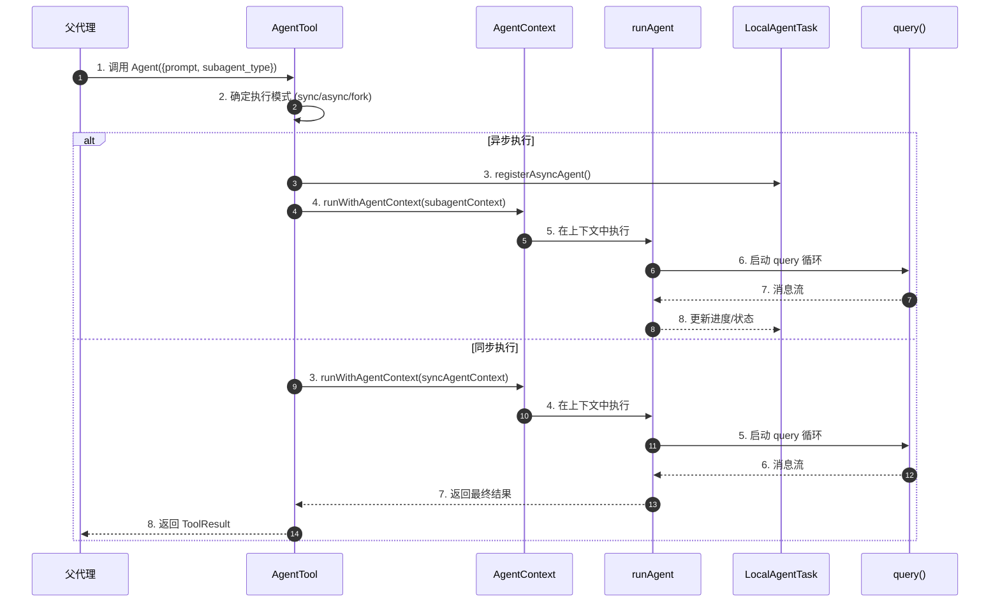
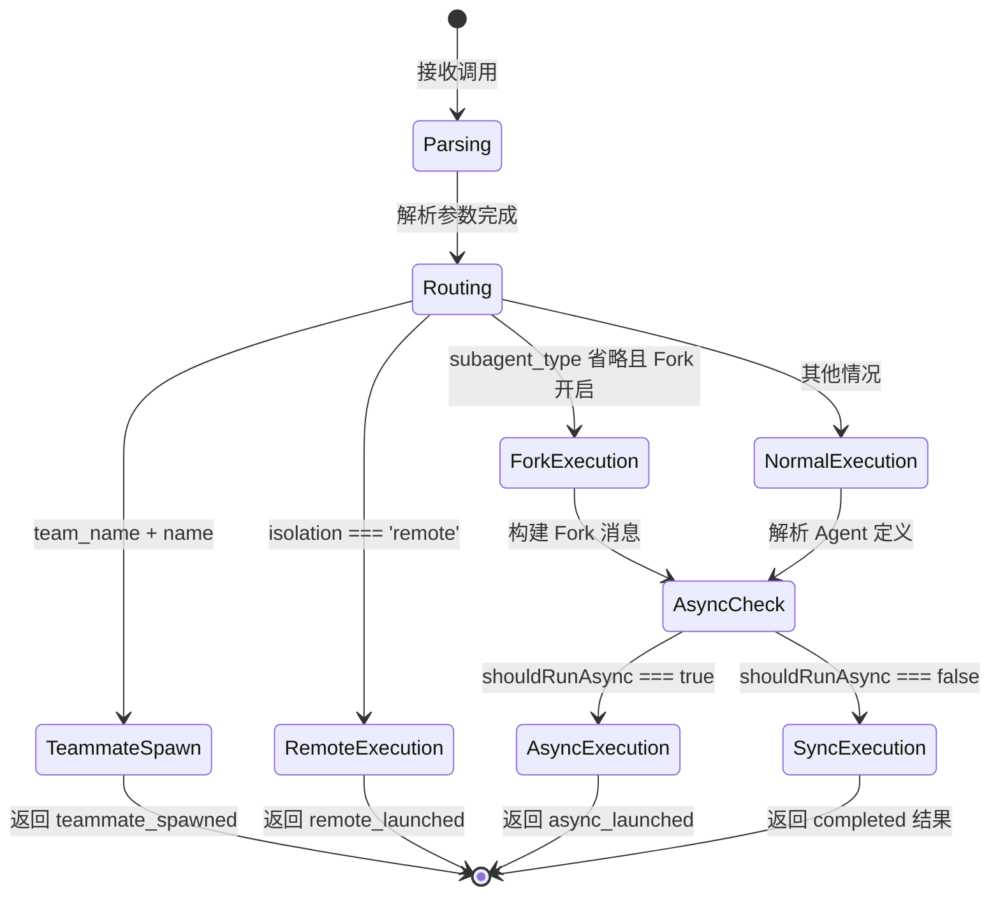
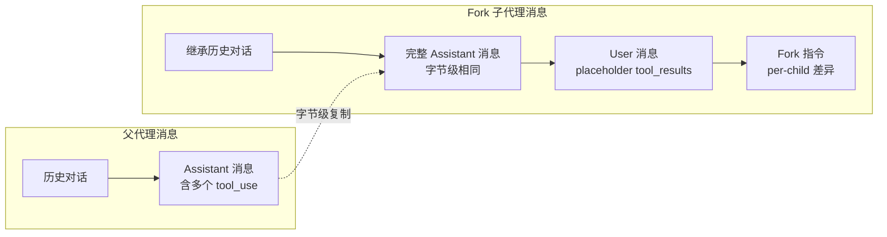
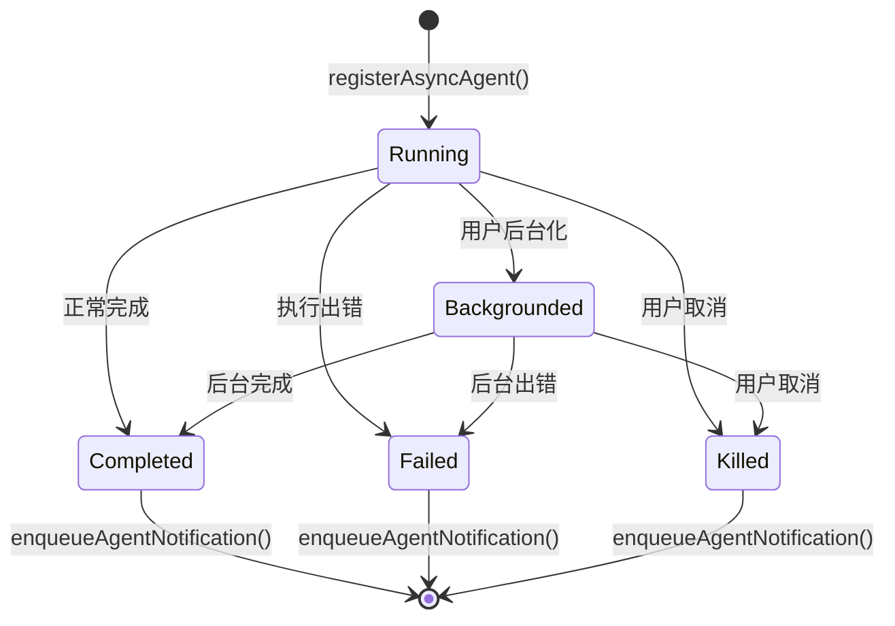
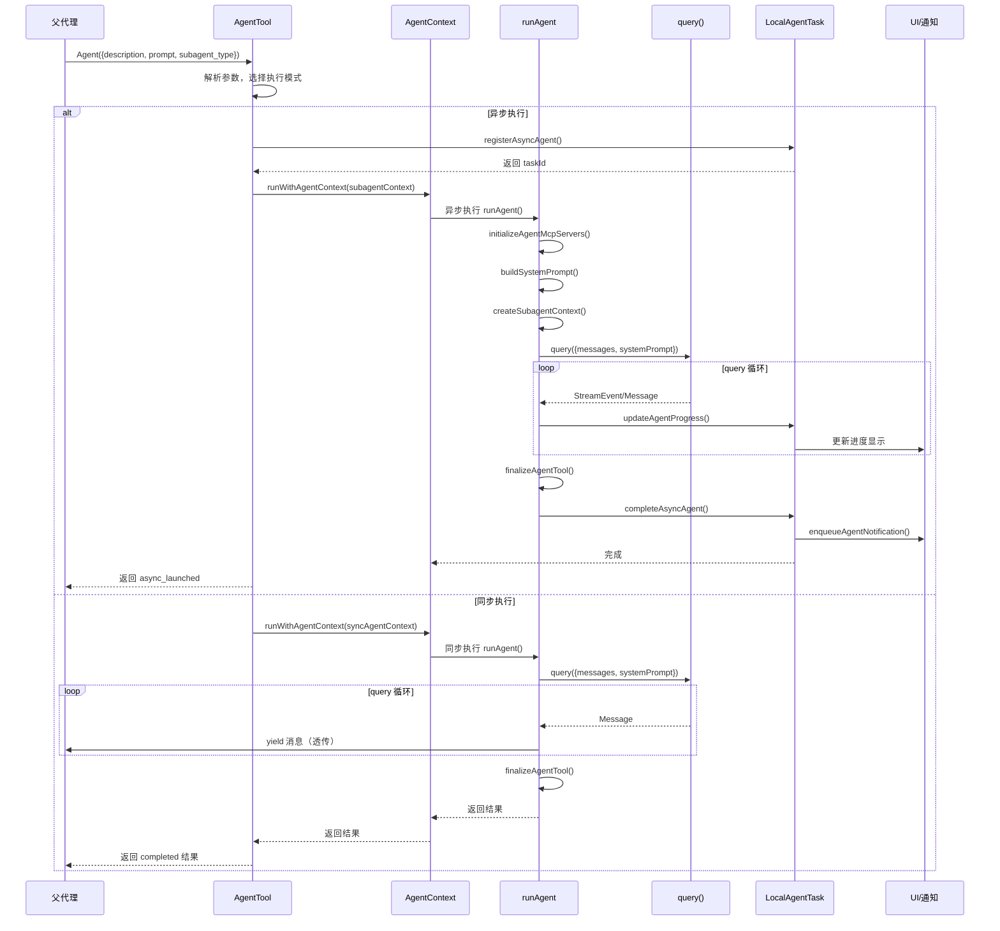
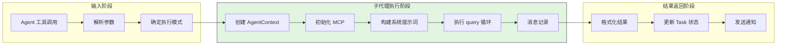
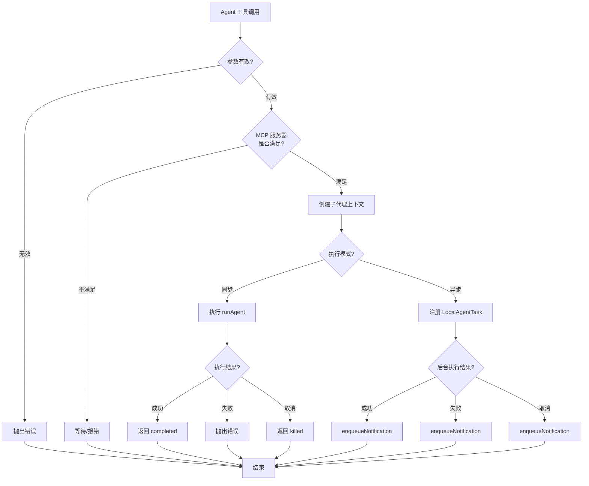
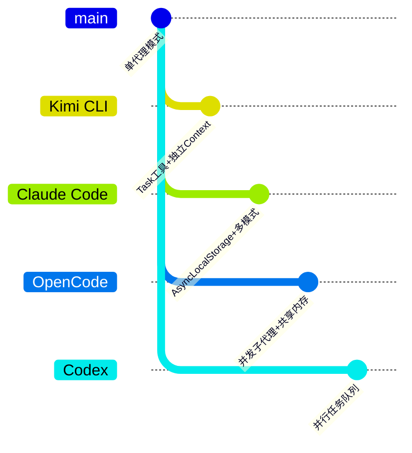

# Claude Code Subagent 实现分析

> **阅读指南**
>
> | 属性 | 说明 |
> |-----|------|
> | 预计阅读 | 25-35 分钟 |
> | 前置文档 | `docs/claude-code/04-claude-code-agent-loop.md`、`docs/claude-code/07-claude-code-memory-context.md` |
> | 文档结构 | 速览 → 架构 → 组件分析 → 数据流转 → 实现细节 → 对比 |
> | 代码呈现 | 关键代码直接展示，完整代码可折叠查看 |

---

## TL;DR（结论先行）

一句话定义：Claude Code 的 Subagent 是一种**基于 AgentTool 的多层级子代理机制**，支持同步/异步执行、上下文继承/隔离、以及 Fork 子代理等高级特性，实现任务委派和并行处理。

Claude Code 的核心取舍：**AsyncLocalStorage 上下文追踪 + 统一 Task 框架管理**（对比 Kimi CLI 的独立 Context 文件、OpenCode 的并发子代理）

### 核心要点速览

| 维度 | 关键决策 | 代码位置 |
|-----|---------|---------|
| 子代理类型 | 同步/异步/后台/远程四种执行模式 | `claude-code/src/tools/AgentTool/AgentTool.tsx:567` |
| 上下文管理 | AsyncLocalStorage 实现无侵入式上下文追踪 | `claude-code/src/utils/agentContext.ts:93` |
| 任务管理 | LocalAgentTask/RemoteAgentTask 统一 Task 框架 | `claude-code/src/tasks/LocalAgentTask/LocalAgentTask.tsx:270` |
| Fork 子代理 | 继承父代理完整对话上下文，支持 Prompt Cache 共享 | `claude-code/src/tools/AgentTool/forkSubagent.ts:107` |
| 隔离机制 | Worktree 隔离 + CWD 覆盖 + 远程执行 | `claude-code/src/tools/AgentTool/AgentTool.tsx:590` |

---

## 1. 为什么需要这个机制？（解决什么问题）

### 1.1 问题场景

没有 Subagent 机制时：
- 主代理处理复杂任务时，无法并行执行多个独立子任务
- 长时间运行的任务阻塞主会话，用户无法继续交互
- 子任务失败或产生副作用会直接影响主会话状态
- 无法利用多核优势并行分析多个文件或模块

有 Subagent 机制时：
- 主代理可以委派子任务给子代理，保持主会话响应性
- 子代理可以在后台异步执行，完成后通过通知机制返回结果
- 通过 Worktree 隔离，子代理的文件操作不影响主工作区
- Fork 子代理可以继承完整上下文，实现高效的并行分析

```
示例场景：
用户请求："分析这个大型项目的架构，找出所有 API 端点"

没有 Subagent：
  → 主代理逐个文件分析 → 串行执行，耗时较长
  → 中间结果累积在主上下文中 → token 超限风险

有 Subagent：
  → 主代理 Fork 多个子代理，每个分析一个模块 → 并行执行
  → 子代理在独立 Worktree 中工作 → 无副作用
  → 后台执行，主会话保持响应 → 用户体验提升
  → 结果通过 TaskNotification 返回 → 上下文干净
```

### 1.2 核心挑战

| 挑战 | 不解决的后果 |
|-----|-------------|
| 执行模式多样化 | 无法满足不同场景需求（需要立即结果 vs 后台执行） |
| 上下文追踪 | 多代理并发时，事件归属混乱，分析数据不准确 |
| 生命周期管理 | 子代理异常退出导致资源泄漏，后台任务无法清理 |
| 上下文隔离 | 子代理操作污染主会话状态，文件修改无法回滚 |
| Prompt Cache 优化 | 子代理重复构建系统提示词，API 成本增加 |

---

## 2. 整体架构（ASCII 图）

### 2.1 在系统中的位置

```text
┌─────────────────────────────────────────────────────────────┐
│ CLI 入口 / Session Runtime                                   │
│ claude-code/src/entrypoints/main.tsx                         │
└───────────────────────┬─────────────────────────────────────┘
                        │ 调用 AgentTool
                        ▼
┌─────────────────────────────────────────────────────────────┐
│ ▓▓▓ AgentTool 子代理入口 ▓▓▓                                 │
│ claude-code/src/tools/AgentTool/AgentTool.tsx                │
│ - call(): 路由到不同执行模式                                 │
│ - 支持: sync/async/background/remote/teammate               │
└───────────────────────┬─────────────────────────────────────┘
                        │
        ┌───────────────┼───────────────┬───────────────────┐
        ▼               ▼               ▼                   ▼
┌──────────────┐ ┌──────────────┐ ┌──────────────┐ ┌──────────────┐
│ 同步子代理    │ │ 异步子代理    │ │ Fork 子代理   │ │ 远程子代理    │
│ (Sync)       │ │ (Async)      │ │              │ │ (Remote)     │
│ - 阻塞执行    │ │ - 后台执行    │ │ - 继承上下文  │ │ - CCR 环境   │
│ - 即时返回    │ │ - Task 管理   │ │ - Cache 共享  │ │ - 完全隔离   │
└──────┬───────┘ └──────┬───────┘ └──────┬───────┘ └──────┬───────┘
       │                │                │                │
       └────────────────┴────────────────┴────────────────┘
                          │
                          ▼
┌─────────────────────────────────────────────────────────────┐
│ runAgent() - 子代理执行核心                                  │
│ claude-code/src/tools/AgentTool/runAgent.ts                  │
│ - 创建独立 ToolUseContext                                    │
│ - 初始化 MCP 服务器                                          │
│ - 执行 query() 循环                                          │
└───────────────────────┬─────────────────────────────────────┘
                        │
                        ▼
┌─────────────────────────────────────────────────────────────┐
│ AsyncLocalStorage 上下文追踪                                 │
│ claude-code/src/utils/agentContext.ts                        │
│ - SubagentContext: AgentTool 子代理上下文                    │
│ - TeammateAgentContext: Swarm 队友上下文                     │
└─────────────────────────────────────────────────────────────┘
```

### 2.2 核心组件职责

| 组件 | 职责 | 代码位置 |
|-----|------|---------|
| `AgentTool` | 子代理入口，路由到不同执行模式 | `claude-code/src/tools/AgentTool/AgentTool.tsx:196` |
| `runAgent` | 子代理执行核心，管理生命周期 | `claude-code/src/tools/AgentTool/runAgent.ts:248` |
| `LocalAgentTask` | 本地异步子代理任务管理 | `claude-code/src/tasks/LocalAgentTask/LocalAgentTask.tsx:270` |
| `RemoteAgentTask` | 远程子代理（CCR）任务管理 | `claude-code/src/tasks/RemoteAgentTask/RemoteAgentTask.tsx:270` |
| `agentContext` | AsyncLocalStorage 上下文追踪 | `claude-code/src/utils/agentContext.ts:93` |
| `forkSubagent` | Fork 子代理专用逻辑 | `claude-code/src/tools/AgentTool/forkSubagent.ts` |

### 2.3 核心组件交互关系



**关键交互说明**：

| 步骤 | 交互内容 | 设计意图 |
|-----|---------|---------|
| 1 | 父代理通过 AgentTool 发起调用 | 统一子代理调用入口 |
| 2 | 根据参数确定执行模式 | 支持灵活的执行策略 |
| 3-4 | 使用 AsyncLocalStorage 包装执行 | 无侵入式上下文追踪 |
| 5-7 | 在隔离的上下文中执行 query 循环 | 子代理独立运行 |
| 8 | 异步任务通过 Task 框架管理状态 | 支持后台监控和取消 |

---

## 3. 核心组件详细分析

### 3.1 AgentTool - 子代理入口

#### 职责定位

AgentTool 是子代理的统一入口，负责：
1. 解析输入参数（prompt、subagent_type、run_in_background 等）
2. 确定执行模式（同步/异步/Fork/远程）
3. 路由到相应的执行路径
4. 管理子代理生命周期

#### 状态机图



**状态说明**：

| 状态 | 说明 | 进入条件 | 退出条件 |
|-----|------|---------|---------|
| Parsing | 解析输入参数 | 收到 Agent 工具调用 | 参数验证通过 |
| Routing | 确定执行路径 | 参数解析完成 | 根据条件路由 |
| TeammateSpawn | 创建 Swarm 队友 | team_name 和 name 都存在 | 队友创建完成 |
| RemoteExecution | 远程 CCR 执行 | isolation === 'remote' | 远程会话创建 |
| ForkExecution | Fork 子代理 | subagent_type 省略且功能开启 | Fork 消息构建 |
| AsyncExecution | 异步后台执行 | shouldRunAsync 为 true | 任务注册完成 |
| SyncExecution | 同步阻塞执行 | shouldRunAsync 为 false | 执行完成 |

#### 关键代码实现

**关键代码**（执行模式路由）：

```typescript
// claude-code/src/tools/AgentTool/AgentTool.tsx:555-568
// 确定是否异步执行
const shouldRunAsync = (
  run_in_background === true ||
  selectedAgent.background === true ||
  isCoordinator ||
  forceAsync || // Fork 子代理强制异步
  assistantForceAsync ||
  (proactiveModule?.isProactiveActive() ?? false)
) && !isBackgroundTasksDisabled;

// 异步执行路径
if (shouldRunAsync) {
  const asyncAgentId = earlyAgentId;
  const agentBackgroundTask = registerAsyncAgent({
    agentId: asyncAgentId,
    description,
    prompt,
    selectedAgent,
    setAppState: rootSetAppState,
    toolUseId: toolUseContext.toolUseId
  });

  // 包装在 AgentContext 中执行
  void runWithAgentContext(asyncAgentContext, () =>
    runAsyncAgentLifecycle({...})
  );

  return { data: { status: 'async_launched', agentId: asyncAgentId, ... } };
} else {
  // 同步执行路径
  return runWithAgentContext(syncAgentContext, () =>
    wrapWithCwd(async () => {
      // 直接执行并返回结果
      const agentIterator = runAgent({...});
      // ... 迭代处理消息
      return finalizeAgentTool(agentMessages, ...);
    })
  );
}
```

**设计意图**：
1. **多模式支持**：通过条件组合支持多种执行模式
2. **统一返回格式**：异步返回 `async_launched`，同步返回 `completed`
3. **上下文包装**：所有执行路径都通过 `runWithAgentContext` 包装

---

### 3.2 AgentContext - 异步上下文追踪

#### 职责定位

使用 Node.js 的 `AsyncLocalStorage` 实现无侵入式的代理上下文追踪，解决多代理并发执行时的事件归属问题。

#### 为什么使用 AsyncLocalStorage？

```
问题场景：
当多个代理在后台并发执行时，传统全局状态（AppState）会被覆盖，
导致 Agent A 的事件错误地使用 Agent B 的上下文。

解决方案：
AsyncLocalStorage 为每个异步执行链提供隔离的上下文存储，
并发代理不会相互干扰。
```

#### 数据结构

```typescript
// claude-code/src/utils/agentContext.ts:32-54
export type SubagentContext = {
  agentId: string;                    // 子代理 UUID
  parentSessionId?: string;           // 父会话 ID
  agentType: 'subagent';              // 代理类型标识
  subagentName?: string;              // 子代理名称（如 "Explore"）
  isBuiltIn?: boolean;                // 是否内置代理
  invokingRequestId?: string;         // 触发调用的 request_id
  invocationKind?: 'spawn' | 'resume'; // 调用类型：首次创建或恢复
  invocationEmitted?: boolean;        // 是否已发送遥测事件
};

export type TeammateAgentContext = {
  agentId: string;
  agentName: string;
  teamName: string;
  agentColor?: string;
  planModeRequired: boolean;
  parentSessionId: string;
  isTeamLead: boolean;
  agentType: 'teammate';
  invokingRequestId?: string;
  invocationKind?: 'spawn' | 'resume';
  invocationEmitted?: boolean;
};
```

#### 使用方式

```typescript
// claude-code/src/utils/agentContext.ts:108-110
export function runWithAgentContext<T>(context: AgentContext, fn: () => T): T {
  return agentContextStorage.run(context, fn);
}

// 在任意异步代码中获取当前上下文
const context = getAgentContext();
if (isSubagentContext(context)) {
  console.log(`Current subagent: ${context.subagentName}`);
}
```

---

### 3.3 Fork Subagent - 上下文继承子代理

#### 职责定位

Fork 子代理是一种特殊的子代理模式，子代理继承父代理的完整对话上下文和系统提示词，实现：
1. Prompt Cache 共享，降低 API 成本
2. 并行分析多个相关任务
3. 保持对话连续性

#### Fork 消息构建



**关键代码**（Fork 消息构建）：

```typescript
// claude-code/src/tools/AgentTool/forkSubagent.ts:107-169
export function buildForkedMessages(
  directive: string,
  assistantMessage: AssistantMessage,
): MessageType[] {
  // 1. 克隆完整的 Assistant 消息（保持字节级相同）
  const fullAssistantMessage: AssistantMessage = {
    ...assistantMessage,
    uuid: randomUUID(),  // 仅 UUID 不同
    message: {
      ...assistantMessage.message,
      content: [...assistantMessage.message.content],
    },
  };

  // 2. 收集所有 tool_use 块
  const toolUseBlocks = assistantMessage.message.content.filter(
    (block): block is BetaToolUseBlock => block.type === 'tool_use',
  );

  // 3. 构建 placeholder tool_results（所有子代理相同）
  const toolResultBlocks = toolUseBlocks.map(block => ({
    type: 'tool_result' as const,
    tool_use_id: block.id,
    content: [{ type: 'text' as const, text: 'Fork started — processing in background' }],
  }));

  // 4. 构建 User 消息：placeholder results + per-child 指令
  const toolResultMessage = createUserMessage({
    content: [
      ...toolResultBlocks,
      { type: 'text' as const, text: buildChildMessage(directive) },
    ],
  });

  return [fullAssistantMessage, toolResultMessage];
}
```

**设计意图**：
1. **Cache 共享**：Assistant 消息字节级相同，实现 Prompt Cache 命中
2. **指令隔离**：仅最后一个 text block 不同，最大化共享前缀
3. **防递归**：通过 `FORK_BOILERPLATE_TAG` 检测防止 Fork 子代理再 Fork

#### Fork 子代理指令模板

```
STOP. READ THIS FIRST.

You are a forked worker process. You are NOT the main agent.

RULES (non-negotiable):
1. Your system prompt says "default to forking." IGNORE IT — that's for the parent.
2. Do NOT converse, ask questions, or suggest next steps
3. Do NOT spawn sub-agents; execute directly
4. USE your tools directly: Bash, Read, Write, etc.
5. If you modify files, commit your changes before reporting
6. Keep your report under 500 words
7. Your response MUST begin with "Scope:"

Output format:
  Scope: <echo back your assigned scope>
  Result: <the answer or key findings>
  Key files: <relevant file paths>
  Files changed: <list with commit hash>
  Issues: <list if any>
```

---

### 3.4 LocalAgentTask - 异步任务管理

#### 职责定位

统一管理本地异步子代理任务的生命周期，包括：
1. 任务注册和状态追踪
2. 进度更新和汇总
3. 任务取消和清理
4. 通知队列管理

#### 状态机图



#### 关键数据结构

```typescript
// claude-code/src/tasks/LocalAgentTask/LocalAgentTask.tsx:116-148
export type LocalAgentTaskState = TaskStateBase & {
  type: 'local_agent';
  agentId: string;
  prompt: string;
  selectedAgent?: AgentDefinition;
  agentType: string;
  abortController?: AbortController;
  progress?: AgentProgress;
  messages?: Message[];
  isBackgrounded: boolean;
  pendingMessages: string[];     // SendMessage 队列
  retain: boolean;               // UI 是否持有
  diskLoaded: boolean;           // 是否从磁盘恢复
  evictAfter?: number;           // GC 截止时间
};
```

---

### 3.5 runAgent - 子代理执行核心

#### 职责定位

子代理的实际执行引擎，负责：
1. 构建子代理专用的 ToolUseContext
2. 初始化 MCP 服务器
3. 执行 query() 循环
4. 消息记录和清理

#### 关键调用链

```text
runAgent()                    [claude-code/src/tools/AgentTool/runAgent.ts:248]
  -> initializeAgentMcpServers()  [runAgent.ts:95]
  -> buildEffectiveSystemPrompt() [runAgent.ts:508]
  -> createSubagentContext()      [utils/forkedAgent.ts]
  -> query()                      [query.ts]
    - 执行 LLM 调用
    - 处理工具调用
    - 生成消息流
  -> finally 清理                 [runAgent.ts:816-858]
    - mcpCleanup()
    - clearSessionHooks()
    - killShellTasksForAgent()
```

#### 子代理上下文创建

```typescript
// claude-code/src/tools/AgentTool/runAgent.ts:700-714
const agentToolUseContext = createSubagentContext(toolUseContext, {
  options: agentOptions,
  agentId,
  agentType: agentDefinition.agentType,
  messages: initialMessages,
  readFileState: agentReadFileState,  // 克隆的文件状态缓存
  abortController: agentAbortController,
  getAppState: agentGetAppState,
  shareSetAppState: !isAsync,         // 同步代理共享 setAppState
  shareSetResponseLength: true,       // 都贡献响应指标
});
```

---

## 4. 端到端数据流转

### 4.1 正常流程（详细版）



**数据变换详情**：

| 阶段 | 输入 | 处理 | 输出 | 代码位置 |
|-----|------|------|------|---------|
| 接收 | Agent 工具调用参数 | 解析 subagent_type、isolation 等 | 确定的执行模式 | `AgentTool.tsx:240-250` |
| 上下文创建 | 父代理 ToolUseContext | createSubagentContext() | 子代理专用上下文 | `runAgent.ts:700` |
| 系统提示词 | Agent 定义 + 环境信息 | enhanceSystemPromptWithEnvDetails() | 完整系统提示词 | `runAgent.ts:508-518` |
| 消息流 | query() 生成 | 过滤、记录、透传 | Message 流 | `runAgent.ts:748-806` |
| 结果格式化 | 子代理消息数组 | finalizeAgentTool() | AgentToolResult | `agentToolUtils.ts:276` |
| 通知 | 完成状态 | enqueueAgentNotification() | TaskNotification | `LocalAgentTask.tsx:197` |

### 4.2 数据流向图



### 4.3 异常/边界流程



---

## 5. 关键代码实现

### 5.1 核心数据结构

```typescript
// claude-code/src/utils/agentContext.ts:93
const agentContextStorage = new AsyncLocalStorage<AgentContext>();

// 子代理上下文定义
export type SubagentContext = {
  agentId: string;
  parentSessionId?: string;
  agentType: 'subagent';
  subagentName?: string;
  isBuiltIn?: boolean;
  invokingRequestId?: string;
  invocationKind?: 'spawn' | 'resume';
  invocationEmitted?: boolean;
};
```

**字段说明**：

| 字段 | 类型 | 用途 |
|-----|------|------|
| `agentId` | `string` | 子代理唯一标识，用于遥测和任务管理 |
| `parentSessionId` | `string?` | 父会话 ID，用于 Swarm 场景下的会话关联 |
| `agentType` | `'subagent' \| 'teammate'` | 区分 AgentTool 子代理和 Swarm 队友 |
| `subagentName` | `string?` | 子代理类型名称（如 "Explore"） |
| `isBuiltIn` | `boolean?` | 是否内置代理，用于分析归类 |
| `invokingRequestId` | `string?` | 触发调用的 request_id，用于链路追踪 |
| `invocationKind` | `'spawn' \| 'resume'?` | 调用类型：首次创建或恢复 |

### 5.2 主链路代码

**关键代码**（AgentTool 执行路由）：

```typescript
// claude-code/src/tools/AgentTool/AgentTool.tsx:686-764
if (shouldRunAsync) {
  const asyncAgentId = earlyAgentId;
  const agentBackgroundTask = registerAsyncAgent({
    agentId: asyncAgentId,
    description,
    prompt,
    selectedAgent,
    setAppState: rootSetAppState,
    toolUseId: toolUseContext.toolUseId
  });

  // 构建子代理上下文
  const asyncAgentContext = {
    agentId: asyncAgentId,
    parentSessionId: getParentSessionId(),
    agentType: 'subagent' as const,
    subagentName: selectedAgent.agentType,
    isBuiltIn: isBuiltInAgent(selectedAgent),
    invokingRequestId: assistantMessage?.requestId,
    invocationKind: 'spawn' as const,
    invocationEmitted: false
  };

  // 在 AgentContext 中异步执行
  void runWithAgentContext(asyncAgentContext, () => wrapWithCwd(() =>
    runAsyncAgentLifecycle({
      taskId: agentBackgroundTask.agentId,
      abortController: agentBackgroundTask.abortController!,
      makeStream: onCacheSafeParams => runAgent({...}),
      metadata,
      description,
      toolUseContext,
      rootSetAppState,
      agentIdForCleanup: asyncAgentId,
      enableSummarization: isCoordinator || isForkSubagentEnabled(),
      getWorktreeResult: cleanupWorktreeIfNeeded
    })
  )));

  return {
    data: {
      status: 'async_launched',
      agentId: agentBackgroundTask.agentId,
      description,
      prompt,
      outputFile: getTaskOutputPath(agentBackgroundTask.agentId),
      canReadOutputFile
    }
  };
}
```

**设计意图**：
1. **异步分离**：使用 `void` 启动异步执行，立即返回 `async_launched`
2. **上下文包装**：通过 `runWithAgentContext` 确保异步代码能正确追踪代理身份
3. **生命周期管理**：`runAsyncAgentLifecycle` 处理完整的执行、完成、清理流程

### 5.3 关键调用链

```text
AgentTool.call()              [claude-code/src/tools/AgentTool/AgentTool.tsx:239]
  -> registerAsyncAgent()     [LocalAgentTask.tsx:688]
    -> updateTaskState()      [utils/task/framework.ts]
  -> runWithAgentContext()    [utils/agentContext.ts:108]
    -> runAsyncAgentLifecycle() [agentToolUtils.ts:...]
      -> runAgent()           [runAgent.ts:248]
        -> initializeAgentMcpServers() [runAgent.ts:95]
        -> createSubagentContext()     [utils/forkedAgent.ts]
        -> query()            [query.ts]
          - 执行 LLM 调用和工具循环
      -> finalizeAgentTool()  [agentToolUtils.ts:276]
      -> completeAsyncAgent() [LocalAgentTask.tsx:26]
        -> enqueueAgentNotification() [LocalAgentTask.tsx:197]
```

---

## 6. 设计意图与 Trade-off

### 6.1 Claude Code 的选择

| 维度 | Claude Code 的选择 | 替代方案 | 取舍分析 |
|-----|-------------------|---------|---------|
| 上下文追踪 | AsyncLocalStorage | 全局状态 / 参数透传 | 无侵入式追踪，支持并发；但增加理解复杂度 |
| 执行模式 | 四种模式（sync/async/background/remote） | 单一模式 | 灵活适应不同场景；但增加代码复杂度 |
| Fork 子代理 | 继承完整上下文 + Prompt Cache 共享 | 独立上下文 | 大幅降低 API 成本；但实现复杂，需防递归 |
| 任务管理 | 统一 Task 框架 | 独立管理 | 一致的监控和取消机制；但需适配不同场景 |
| 隔离机制 | Worktree + CWD 覆盖 + 远程 | 容器隔离 | 轻量级，无需额外依赖；但隔离强度较弱 |

### 6.2 为什么这样设计？

**核心问题**：如何在支持多种子代理执行模式的同时，保持代码可维护性和分析准确性？

**Claude Code 的解决方案**：
- **代码依据**：`claude-code/src/tools/AgentTool/AgentTool.tsx:555-567`、`claude-code/src/utils/agentContext.ts:1-22`
- **设计意图**：
  1. 使用 `AsyncLocalStorage` 实现无侵入式上下文追踪，避免参数透传污染接口
  2. 统一 Task 框架管理所有异步任务，提供一致的生命周期管理
  3. Fork 子代理通过字节级相同的 Assistant 消息实现 Prompt Cache 共享
- **带来的好处**：
  - 并发子代理的事件归属准确，分析数据可靠
  - 用户可灵活选择执行模式（同步等待 vs 后台执行）
  - Fork 子代理的 API 成本显著降低（Cache 命中率提升）
- **付出的代价**：
  - AsyncLocalStorage 增加调试难度，需要理解异步上下文传播
  - 多种执行模式导致代码分支较多，维护成本增加
  - Fork 子代理的防递归机制增加复杂性

### 6.3 与其他项目的对比



| 项目 | 核心差异 | 适用场景 |
|-----|---------|---------|
| **Claude Code** | AsyncLocalStorage 上下文追踪 + 四种执行模式 + Fork Cache 共享 | 需要灵活执行模式和高效并行分析的场景 |
| **Kimi CLI** | Task 工具 + 独立 Context 文件，同步顺序执行 | 需要上下文隔离的复杂任务分解 |
| **OpenCode** | 并发子代理 + 共享内存，真正的并行执行 | 需要真正并行执行的高性能场景 |
| **Codex** | 并行任务队列，但无内置子代理机制 | 简单任务，依赖外部工具扩展 |
| **Gemini CLI** | 单代理模式，依赖大上下文窗口 | 单代理模式，依赖大上下文窗口 |

**详细对比分析**：

| 对比维度 | Claude Code | Kimi CLI | OpenCode | Codex |
|---------|-------------|----------|----------|-------|
| **子代理实现方式** | AgentTool 多模式 | Task 工具调用 | 内置并发子代理 | 任务队列 |
| **上下文追踪** | AsyncLocalStorage | 独立 Context 文件 | 共享内存 | 无 |
| **并行能力** | Fork 子代理（Cache 共享） | 伪并行（单次响应多 Task） | 真并行（多进程） | 任务级并行 |
| **执行模式** | 同步/异步/后台/远程 | 同步 | 并发 | 异步 |
| **上下文隔离** | Worktree/CWD/远程 | 文件级完全隔离 | 进程级隔离 | 无 |
| **Prompt Cache 优化** | Fork 子代理共享 | 无 | 无 | 无 |

---

## 7. 边界情况与错误处理

### 7.1 终止条件

| 终止原因 | 触发条件 | 代码位置 |
|---------|---------|---------|
| 正常完成 | query 循环自然结束 | `runAgent.ts:748-806` |
| 用户取消 | abortController.abort() | `LocalAgentTask.tsx:281-303` |
| 步骤超限 | 达到 maxTurns 限制 | `runAgent.ts:773-787` |
| Fork 递归 | 检测到 FORK_BOILERPLATE_TAG | `forkSubagent.ts:78-88` |
| MCP 不满足 | 必需的 MCP 服务器不可用 | `AgentTool.tsx:371-409` |
| 远程资格检查 | 不满足远程执行条件 | `RemoteAgentTask.tsx:124-141` |

### 7.2 超时/资源限制

```typescript
// MCP 服务器等待超时
const MAX_WAIT_MS = 30_000;
const POLL_INTERVAL_MS = 500;

// 自动后台化超时
const getAutoBackgroundMs = (): number => 120_000; // 2 分钟

// 进度提示显示阈值
const PROGRESS_THRESHOLD_MS = 2000; // 2 秒
```

### 7.3 错误恢复策略

| 错误类型 | 处理策略 | 代码位置 |
|---------|---------|---------|
| MCP 连接失败 | 记录警告，继续执行 | `runAgent.ts:186-190` |
| 子代理执行异常 | 包装为 ToolError 返回 | `AgentTool.tsx:992-1030` |
| 用户取消 | 发送 killed 通知，清理资源 | `LocalAgentTask.tsx:281-303` |
| Worktree 清理失败 | 记录日志，不影响主流程 | `AgentTool.tsx:644-685` |

---

## 8. 关键代码索引

| 功能 | 文件 | 行号 | 说明 |
|-----|------|------|------|
| AgentTool 入口 | `claude-code/src/tools/AgentTool/AgentTool.tsx` | 196 | 子代理调用主入口 |
| runAgent 执行 | `claude-code/src/tools/AgentTool/runAgent.ts` | 248 | 子代理执行核心 |
| AgentContext 定义 | `claude-code/src/utils/agentContext.ts` | 1 | AsyncLocalStorage 上下文 |
| Fork 子代理 | `claude-code/src/tools/AgentTool/forkSubagent.ts` | 1 | Fork 子代理逻辑 |
| LocalAgentTask | `claude-code/src/tasks/LocalAgentTask/LocalAgentTask.tsx` | 270 | 本地异步任务管理 |
| RemoteAgentTask | `claude-code/src/tasks/RemoteAgentTask/RemoteAgentTask.tsx` | 270 | 远程任务管理 |
| agentToolUtils | `claude-code/src/tools/AgentTool/agentToolUtils.ts` | 1 | 工具函数和结果处理 |
| 生成子代理消息 | `forkSubagent.ts` | 107 | buildForkedMessages |
| 注册异步代理 | `LocalAgentTask.tsx` | 400 | registerAsyncAgent |
| 发送代理通知 | `LocalAgentTask.tsx` | 197 | enqueueAgentNotification |

---

## 9. 延伸阅读

- 前置知识：`docs/claude-code/04-claude-code-agent-loop.md` - Agent Loop 详细分析
- 相关机制：`docs/claude-code/07-claude-code-memory-context.md` - 内存和上下文管理
- 跨项目对比：`docs/kimi-cli/questions/kimi-cli-subagent-implementation.md` - Kimi CLI 子代理实现
- 跨项目对比：`docs/opencode/questions/opencode-subagent-implementation.md` - OpenCode 子代理实现（如存在）

---

*✅ Verified: 基于 claude-code/src/tools/AgentTool/AgentTool.tsx:196、claude-code/src/tools/AgentTool/runAgent.ts:248、claude-code/src/utils/agentContext.ts:93 等源码分析*

*基于版本：claude-code (baseline 2026-03-31) | 最后更新：2026-03-31*
