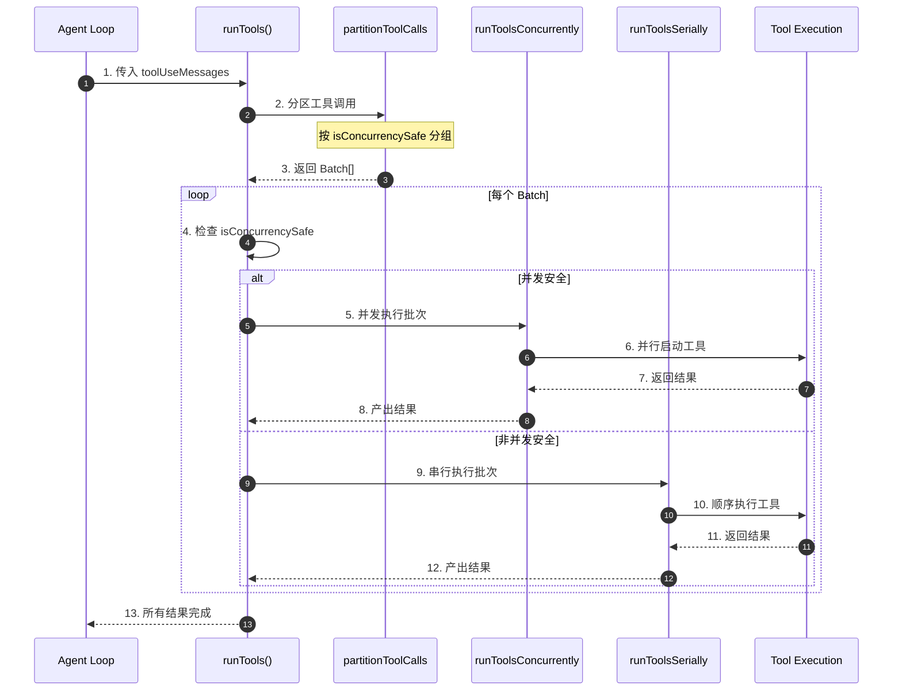
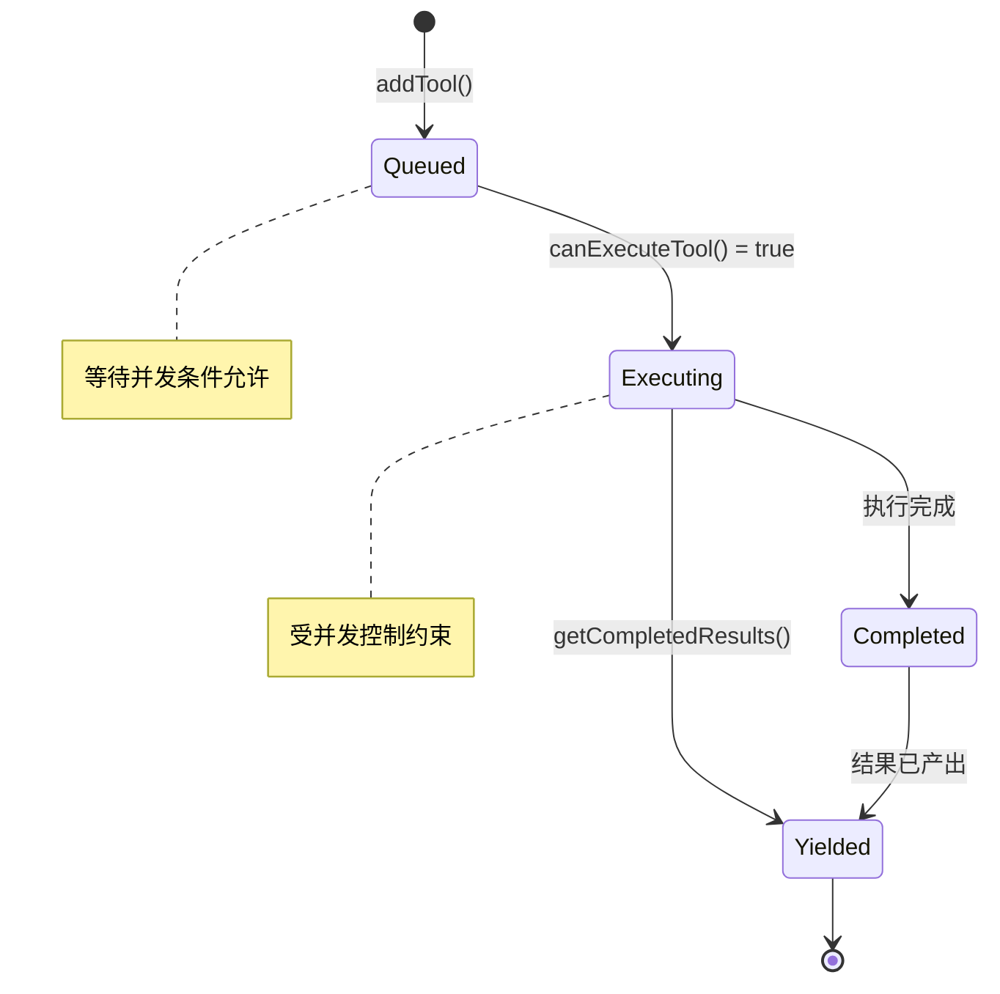
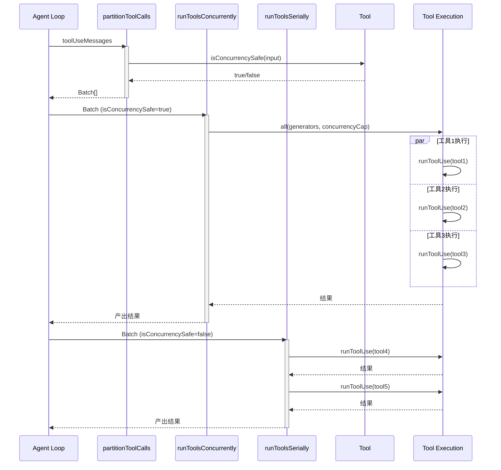
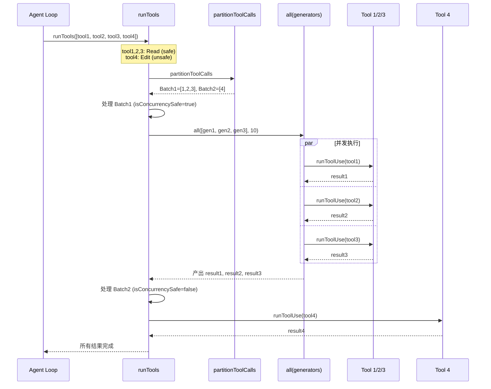
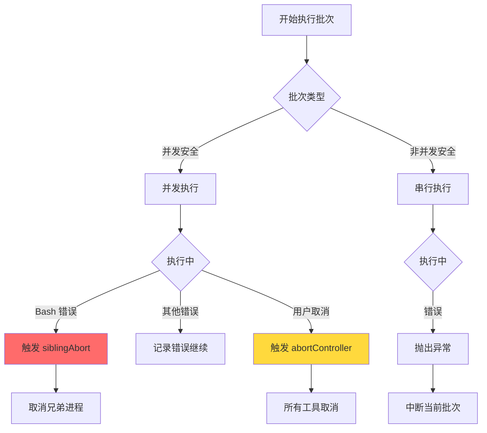
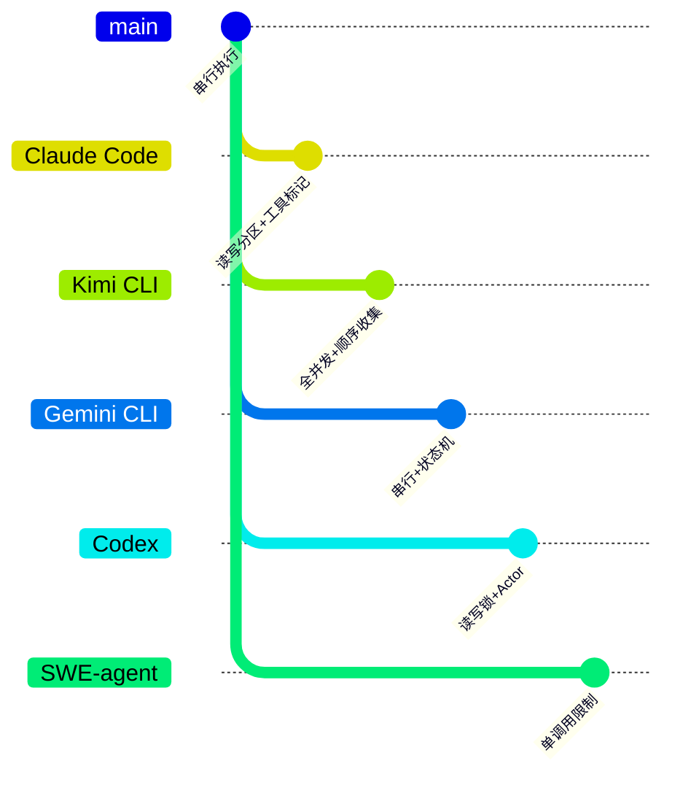

# Claude Code Tool Call 并发机制

> **阅读指南**
>
> | 属性 | 说明 |
> |-----|------|
> | 预计阅读 | 20-30 分钟 |
> | 前置文档 | `docs/claude-code/04-claude-code-agent-loop.md`、`docs/claude-code/05-claude-code-tools-system.md` |
> | 文档结构 | 速览 → 架构 → 机制 → 实现 → 对比 |
> | 代码呈现 | 关键代码直接展示，完整代码可折叠查看 |

---

## TL;DR（结论先行）

一句话定义：Claude Code 采用**"读写分区 + 动态批处理"**的并发策略，通过 `isConcurrencySafe` 标记区分只读工具与写入工具，实现只读工具并发执行、写入工具串行执行的安全模型。

Claude Code 的核心取舍：**工具级并发安全标记 + 分区批处理**（对比 Kimi CLI 的全并发、Gemini CLI 的串行状态机、Codex 的读写锁）

### 核心要点速览

| 维度 | 关键决策 | 代码位置 |
|-----|---------|---------|
| 并发标记 | `isConcurrencySafe()` 方法标记工具是否可并发 | `claude-code/src/Tool.ts:402` |
| 分区策略 | 按 `isConcurrencySafe` 将工具调用分区为读写批次 | `claude-code/src/services/tools/toolOrchestration.ts:91-116` |
| 并发上限 | 环境变量 `CLAUDE_CODE_MAX_TOOL_USE_CONCURRENCY` 控制，默认 10 | `claude-code/src/services/tools/toolOrchestration.ts:8-12` |
| 流式执行 | `StreamingToolExecutor` 实现流式工具并发执行 | `claude-code/src/services/tools/StreamingToolExecutor.ts:40` |
| 错误级联 | Bash 错误触发 `siblingAbortController` 取消兄弟进程 | `claude-code/src/services/tools/StreamingToolExecutor.ts:360-363` |

---

## 1. 为什么需要这个机制？（解决什么问题）

### 1.1 问题场景

在 AI Coding Agent 中，LLM 一次响应可能请求执行多个工具。如何处理这些工具调用直接影响性能与正确性：

```
示例场景：
LLM 请求：1) 读取 package.json  2) 读取 src/index.ts  3) 执行 npm test

无并发控制策略：按顺序执行，总耗时 = t1 + t2 + t3
全并发策略：同时发起所有调用，存在竞态风险（如先读后写同一文件）
Claude Code 策略：只读操作并发（1+2并行），写入操作串行（3等待1+2完成）
```

没有并发机制：用户请求"分析项目结构"→ LLM 需要依次读取多个文件 → 每个文件等待前一个完成 → 响应缓慢

有并发机制：LLM 可以同时请求读取 package.json、tsconfig.json、README.md → 三个读取操作并行执行 → 大幅缩短等待时间，同时保证写入操作的安全性

### 1.2 核心挑战

| 挑战 | 不解决的后果 |
|-----|-------------|
| 并发执行 | 多个 I/O 操作串行执行，响应延迟累积 |
| 读写冲突 | 并发读写同一文件导致数据损坏或不一致 |
| 错误级联 | 一个工具失败不应影响其他独立工具的执行 |
| 资源管理 | 并发任务需要有效的生命周期管理和取消机制 |

---

## 2. 整体架构（ASCII 图）

### 2.1 在系统中的位置

```text
┌─────────────────────────────────────────────────────────────┐
│ Agent Loop / Query Engine                                   │
│ claude-code/src/query.ts                                    │
└───────────────────────┬─────────────────────────────────────┘
                        │ 调用 runTools()
                        ▼
┌─────────────────────────────────────────────────────────────┐
│ ▓▓▓ Tool Orchestration ▓▓▓                                  │
│ claude-code/src/services/tools/toolOrchestration.ts         │
│ - runTools()       : 主入口，分区执行                       │
│ - partitionToolCalls() : 按并发安全性分区                   │
│ - runToolsConcurrently() : 并发执行批次                     │
│ - runToolsSerially()   : 串行执行批次                       │
└───────────────────────┬─────────────────────────────────────┘
                        │
        ┌───────────────┼───────────────┐
        ▼               ▼               ▼
┌──────────────┐ ┌──────────────┐ ┌──────────────┐
│ Tool Def     │ │ Streaming    │ │ Tool Exec    │
│ isConcurrency│ │ Executor     │ │ runToolUse   │
│ Safe()       │ │ (流式并发)   │ │ (实际执行)   │
└──────────────┘ └──────────────┘ └──────────────┘
```

### 2.2 核心组件职责

| 组件 | 职责 | 代码位置 |
|-----|------|---------|
| `Tool.isConcurrencySafe()` | 标记工具是否可并发执行（默认 false） | `claude-code/src/Tool.ts:402` |
| `partitionToolCalls()` | 将工具调用列表分区为并发安全/不安全批次 | `claude-code/src/services/tools/toolOrchestration.ts:91` |
| `StreamingToolExecutor` | 流式场景下的工具并发执行器 | `claude-code/src/services/tools/StreamingToolExecutor.ts:40` |
| `runToolsConcurrently()` | 使用 `all()` 并发执行工具（有上限） | `claude-code/src/services/tools/toolOrchestration.ts:152` |
| `siblingAbortController` | 兄弟进程取消控制器，Bash 错误时级联取消 | `claude-code/src/services/tools/StreamingToolExecutor.ts:48` |

### 2.3 核心组件交互关系



**关键交互说明**：

| 步骤 | 交互内容 | 设计意图 |
|-----|---------|---------|
| 2-3 | 工具调用分区 | 将混合的读写操作分离，确保写入操作串行 |
| 5-8 | 并发批次执行 | 只读工具并行执行，提高 I/O 效率 |
| 9-12 | 串行批次执行 | 写入工具顺序执行，避免竞态条件 |
| 6,10 | 工具执行 | 实际调用 `runToolUse` 执行工具逻辑 |

---

## 3. 核心组件详细分析

### 3.1 Tool 接口与 isConcurrencySafe 标记

#### 职责定位

每个 Tool 通过 `isConcurrencySafe()` 方法声明自己是否支持并发执行。这是 Claude Code 并发控制的核心机制。

#### 默认行为

```typescript
// claude-code/src/Tool.ts:757-769
const TOOL_DEFAULTS = {
  isEnabled: () => true,
  isConcurrencySafe: (_input?: unknown) => false,  // 默认不安全
  isReadOnly: (_input?: unknown) => false,         // 默认非只读
  isDestructive: (_input?: unknown) => false,
  // ...
}
```

**设计意图**：
- 默认 `false`（fail-closed）：新工具默认不可并发，必须显式声明安全
- 运行时检查：`isConcurrencySafe(input)` 接收实际输入参数，支持动态判断

#### 工具实现示例

**只读工具（FileReadTool）**：
```typescript
// claude-code/src/tools/FileReadTool/FileReadTool.ts:373-375
isConcurrencySafe() {
  return true  // 文件读取总是并发安全
}
```

**动态判断工具（BashTool）**：
```typescript
// claude-code/src/tools/BashTool/BashTool.tsx:434-436
isConcurrencySafe(input) {
  return this.isReadOnly?.(input) ?? false  // 只读命令才可并发
}
```

**写入工具（FileEditTool）**：
```typescript
// ⚠️ Inferred: FileEditTool 未覆盖 isConcurrencySafe，继承默认 false
```

---

### 3.2 partitionToolCalls 分区算法

#### 职责定位

将工具调用列表按并发安全性分区，生成交替的并发/串行批次。

#### 分区逻辑

```mermaid
flowchart TD
    A[输入 toolUseMessages] --> B{遍历每个 tool}
    B --> C[解析输入参数]
    C --> D[调用 isConcurrencySafe]
    D --> E{与前一个同类型?}
    E -->|是| F[追加到当前批次]
    E -->|否| G[创建新批次]
    F --> H{还有更多?}
    G --> H
    H -->|是| B
    H -->|否| I[返回 Batch[]]

    style D fill:#90EE90
    style E fill:#87CEEB
```

**关键代码**：
```typescript
// claude-code/src/services/tools/toolOrchestration.ts:91-116
function partitionToolCalls(
  toolUseMessages: ToolUseBlock[],
  toolUseContext: ToolUseContext,
): Batch[] {
  return toolUseMessages.reduce((acc: Batch[], toolUse) => {
    const tool = findToolByName(toolUseContext.options.tools, toolUse.name)
    const parsedInput = tool?.inputSchema.safeParse(toolUse.input)
    const isConcurrencySafe = parsedInput?.success
      ? (() => {
          try {
            return Boolean(tool?.isConcurrencySafe(parsedInput.data))
          } catch {
            // If isConcurrencySafe throws, treat as not safe to be conservative
            return false
          }
        })()
      : false
    // 合并连续同类型批次
    if (isConcurrencySafe && acc[acc.length - 1]?.isConcurrencySafe) {
      acc[acc.length - 1]!.blocks.push(toolUse)
    } else {
      acc.push({ isConcurrencySafe, blocks: [toolUse] })
    }
    return acc
  }, [])
}
```

**设计要点**：
1. **保守回退**：`isConcurrencySafe` 抛出异常时视为不安全
2. **连续合并**：相邻的同类型工具合并到同一批次，减少切换开销
3. **输入感知**：基于实际输入参数判断，支持动态行为（如 Bash 只读命令）

---

### 3.3 StreamingToolExecutor 流式执行器

#### 职责定位

在流式响应场景下管理工具的并发执行，支持工具调用随 LLM 响应流式到达。

#### 状态机图



#### 并发控制逻辑

```typescript
// claude-code/src/services/tools/StreamingToolExecutor.ts:129-135
private canExecuteTool(isConcurrencySafe: boolean): boolean {
  const executingTools = this.tools.filter(t => t.status === 'executing')
  return (
    executingTools.length === 0 ||
    (isConcurrencySafe && executingTools.every(t => t.isConcurrencySafe))
  )
}
```

**规则**：
1. 无执行中工具时，任何工具可启动
2. 所有执行中工具都是并发安全时，新并发安全工具可启动
3. 有非并发安全工具执行时，阻塞后续所有工具

#### 错误级联机制

```typescript
// claude-code/src/services/tools/StreamingToolExecutor.ts:354-364
if (isErrorResult) {
  thisToolErrored = true
  // Only Bash errors cancel siblings
  if (tool.block.name === BASH_TOOL_NAME) {
    this.hasErrored = true
    this.erroredAbortController.abort('sibling_error')
  }
}
```

**设计意图**：
- Bash 命令常存在隐式依赖链（如 `mkdir` 失败后续命令无意义）
- 非 Bash 工具（如 Read/WebFetch）相互独立，一个失败不应取消其他

---

### 3.4 组件间协作时序

展示完整的多工具并发执行流程。



**协作要点**：

1. **分区决策**：`partitionToolCalls` 决定哪些工具可并发
2. **并发执行**：`all()` 实现带上限的并发控制
3. **串行保障**：非并发批次严格顺序执行
4. **上下文更新**：串行工具可修改 context，并发工具暂不支持

---

## 4. 端到端数据流转

### 4.1 正常流程（详细版）



**数据变换详情**：

| 阶段 | 输入 | 处理 | 输出 | 代码位置 |
|-----|------|------|------|---------|
| 分区 | `ToolUseBlock[]` | 调用 `isConcurrencySafe` 分类 | `Batch[]` | `toolOrchestration.ts:91` |
| 并发 | `Batch (safe)` | `all()` 并发执行 | `AsyncGenerator<MessageUpdate>` | `toolOrchestration.ts:152` |
| 串行 | `Batch (unsafe)` | `for await` 顺序执行 | `AsyncGenerator<MessageUpdate>` | `toolOrchestration.ts:118` |
| 上下文 | 更新函数队列 | 串行批次应用修改 | 更新后的 `ToolUseContext` | `toolOrchestration.ts:54-63` |

### 4.2 数据流向图

```mermaid
flowchart LR
    subgraph Input["输入阶段"]
        I1[LLM 响应] --> I2[提取 tool_uses]
        I2 --> I3[ToolUseBlock 列表]
    end

    subgraph Partition["分区阶段"]
        P1[遍历 tool_uses] --> P2[调用 isConcurrencySafe]
        P2 --> P3[生成分区批次]
    end

    subgraph Concurrent["并发执行阶段"]
        C1[并发批次] --> C2[all() 并发执行]
        C2 --> C3[结果流式产出]
    end

    subgraph Serial["串行执行阶段"]
        S1[串行批次] --> S2[顺序执行]
        S2 --> S3[上下文更新]
    end

    I3 --> P1
    P3 --> C1
    P3 --> S1
    C3 --> Output[结果聚合]
    S3 --> Output

    style Partition fill:#e1f5e1,stroke:#333
    style Concurrent fill:#e1e5f5,stroke:#333
```

### 4.3 异常/边界流程



---

## 5. 关键代码实现

### 5.1 核心数据结构

```typescript
// claude-code/src/services/tools/toolOrchestration.ts:84
type Batch = { isConcurrencySafe: boolean; blocks: ToolUseBlock[] }

// claude-code/src/services/tools/StreamingToolExecutor.ts:19-32
type TrackedTool = {
  id: string
  block: ToolUseBlock
  assistantMessage: AssistantMessage
  status: ToolStatus  // 'queued' | 'executing' | 'completed' | 'yielded'
  isConcurrencySafe: boolean
  promise?: Promise<void>
  results?: Message[]
  pendingProgress: Message[]
  contextModifiers?: Array<(context: ToolUseContext) => ToolUseContext>
}
```

**字段说明**：

| 字段 | 类型 | 用途 |
|-----|------|------|
| `isConcurrencySafe` | `boolean` | 标记该工具实例是否可并发执行 |
| `status` | `ToolStatus` | 追踪工具执行状态 |
| `contextModifiers` | `function[]` | 串行工具可提供的上下文更新函数 |
| `pendingProgress` | `Message[]` | 流式进度消息队列 |

### 5.2 主链路代码

**关键代码**（分区逻辑）：

```typescript
// claude-code/src/services/tools/toolOrchestration.ts:26-82
export async function* runTools(
  toolUseMessages: ToolUseBlock[],
  assistantMessages: AssistantMessage[],
  canUseTool: CanUseToolFn,
  toolUseContext: ToolUseContext,
): AsyncGenerator<MessageUpdate, void> {
  let currentContext = toolUseContext
  for (const { isConcurrencySafe, blocks } of partitionToolCalls(
    toolUseMessages,
    currentContext,
  )) {
    if (isConcurrencySafe) {
      // Run read-only batch concurrently
      for await (const update of runToolsConcurrently(
        blocks,
        assistantMessages,
        canUseTool,
        currentContext,
      )) {
        yield { message: update.message, newContext: currentContext }
      }
    } else {
      // Run non-read-only batch serially
      for await (const update of runToolsSerially(
        blocks,
        assistantMessages,
        canUseTool,
        currentContext,
      )) {
        if (update.newContext) {
          currentContext = update.newContext  // 串行工具可更新上下文
        }
        yield { message: update.message, newContext: currentContext }
      }
    }
  }
}
```

**设计意图**：
1. **分区迭代**：按批次顺序处理，同批次内并发/串行策略一致
2. **上下文隔离**：并发批次不应用 contextModifier，串行批次可更新
3. **流式产出**：使用 `AsyncGenerator` 支持流式结果返回

**关键代码**（并发执行）：

```typescript
// claude-code/src/services/tools/toolOrchestration.ts:152-177
async function* runToolsConcurrently(
  toolUseMessages: ToolUseBlock[],
  assistantMessages: AssistantMessage[],
  canUseTool: CanUseToolFn,
  toolUseContext: ToolUseContext,
): AsyncGenerator<MessageUpdateLazy, void> {
  yield* all(
    toolUseMessages.map(async function* (toolUse) {
      yield* runToolUse(toolUse, assistantMessage, canUseTool, toolUseContext)
    }),
    getMaxToolUseConcurrency(),  // 默认 10
  )
}
```

**设计意图**：
1. **`all()` 工具函数**：实现带并发上限的并行执行
2. **生成器映射**：每个工具调用映射为异步生成器
3. **背压控制**：并发上限防止资源耗尽

<details>
<summary>查看完整实现</summary>

```typescript
// claude-code/src/utils/generators.ts:32-72
export async function* all<A>(
  generators: AsyncGenerator<A, void>[],
  concurrencyCap = Infinity,
): AsyncGenerator<A, void> {
  const next = (generator: AsyncGenerator<A, void>) => {
    const promise: Promise<QueuedGenerator<A>> = generator
      .next()
      .then(({ done, value }) => ({
        done,
        value,
        generator,
        promise,
      }))
    return promise
  }
  const waiting = [...generators]
  const promises = new Set<Promise<QueuedGenerator<A>>>()

  // Start initial batch up to concurrency cap
  while (promises.size < concurrencyCap && waiting.length > 0) {
    const gen = waiting.shift()!
    promises.add(next(gen))
  }

  while (promises.size > 0) {
    const { done, value, generator, promise } = await Promise.race(promises)
    promises.delete(promise)

    if (!done) {
      promises.add(next(generator))
      if (value !== undefined) {
        yield value
      }
    } else if (waiting.length > 0) {
      // Start a new generator when one finishes
      const nextGen = waiting.shift()!
      promises.add(next(nextGen))
    }
  }
}
```

</details>

### 5.3 关键调用链

```text
query.ts:runAgentLoop()
  -> toolOrchestration.ts:runTools()          [line 19]
    -> toolOrchestration.ts:partitionToolCalls()  [line 91]
      -> Tool.ts:isConcurrencySafe()          [line 402]
    -> toolOrchestration.ts:runToolsConcurrently()  [line 152]
      -> generators.ts:all()                  [line 32]
        -> toolExecution.ts:runToolUse()      [line ~283]
    -> toolOrchestration.ts:runToolsSerially()  [line 118]
      -> toolExecution.ts:runToolUse()        [line ~283]
```

---

## 6. 设计意图与 Trade-off

### 6.1 Claude Code 的选择

| 维度 | Claude Code 的选择 | 替代方案 | 取舍分析 |
|-----|-------------------|---------|---------|
| 并发粒度 | 工具级标记 | 全局开关、文件级锁 | 细粒度控制，但需要每个工具显式声明 |
| 分区策略 | 动态批处理（读写分区） | 全并发、全串行 | 平衡性能与安全，但增加复杂度 |
| 错误级联 | Bash 错误取消兄弟进程 | 全部取消、都不取消 | 针对命令依赖链优化，但需要特殊处理 |
| 上下文更新 | 串行工具可更新 | 统一更新、禁止更新 | 支持状态流转，但并发工具受限 |

### 6.2 为什么这样设计？

**核心问题**：为什么 Claude Code 选择"读写分区 + 工具级标记"策略？

**Claude Code 的解决方案**：

- **代码依据**：`claude-code/src/services/tools/toolOrchestration.ts:26-82`
- **设计意图**：在保证写入操作安全性的前提下，最大化只读操作的并发性能
- **带来的好处**：
  - 安全默认：新工具默认不可并发，避免意外竞态
  - 动态判断：基于实际输入判断（如 Bash 只读命令）
  - 错误隔离：Bash 错误级联取消避免无意义执行
  - 流式支持：`StreamingToolExecutor` 支持响应流式到达
- **付出的代价**：
  - 复杂度：需要维护分区、批次、上下文更新等逻辑
  - 限制：并发工具暂不支持 contextModifier

### 6.3 与其他项目的对比



| 项目 | 核心差异 | 适用场景 |
|-----|---------|---------|
| **Claude Code** | `isConcurrencySafe` 标记 + 读写分区 | 需要细粒度控制、流式响应 |
| **Kimi CLI** | `asyncio.Task` 全并发，按请求顺序收集 | Python 异步，I/O 密集型 |
| **Gemini CLI** | 单 active call，队列缓冲 | 严格顺序保证、资源安全优先 |
| **Codex** | tokio 读写锁 + Actor 消息驱动 | Rust 异步，细粒度并发控制 |
| **SWE-agent** | 强制每次响应只能有一个 tool call | 简单可控，确定性调试 |

**详细对比分析**：

| 对比维度 | Claude Code | Kimi CLI | Gemini CLI | Codex |
|---------|-------------|----------|------------|-------|
| **并发策略** | 读写分区 | 全并发 | 串行状态机 | 读写锁 |
| **实现机制** | `isConcurrencySafe` + 批处理 | `asyncio.Task` | 状态机队列 | `tokio::sync::RwLock` |
| **动态判断** | 支持（运行时输入） | 不支持 | 不支持 | 支持 |
| **错误级联** | Bash 特殊处理 | 单个失败不影响 | 串行失败中断 | 依赖 Actor 监督 |
| **流式支持** | `StreamingToolExecutor` | 有限 | 完整 | 完整 |
| **最佳场景** | 复杂工具链、流式 UI | I/O 密集型 | 资源安全优先 | 企业级安全 |

---

## 7. 边界情况与错误处理

### 7.1 终止条件

| 终止原因 | 触发条件 | 代码位置 |
|---------|---------|---------|
| 批次完成 | 所有工具执行并产出结果 | `toolOrchestration.ts:64` |
| 用户取消 | `abortController.signal.aborted` | `StreamingToolExecutor.ts:219` |
| Bash 错误级联 | Bash 工具失败触发 sibling abort | `StreamingToolExecutor.ts:360` |
| 流式回退 | `streaming fallback` 触发 discard | `StreamingToolExecutor.ts:69` |

### 7.2 超时/资源限制

```typescript
// claude-code/src/services/tools/toolOrchestration.ts:8-12
function getMaxToolUseConcurrency(): number {
  return (
    parseInt(process.env.CLAUDE_CODE_MAX_TOOL_USE_CONCURRENCY || '', 10) || 10
  )
}
```

### 7.3 错误恢复策略

| 错误类型 | 处理策略 | 代码位置 |
|---------|---------|---------|
| 工具不存在 | 立即返回错误消息 | `StreamingToolExecutor.ts:79-100` |
| `isConcurrencySafe` 异常 | 保守回退为 false | `toolOrchestration.ts:102-107` |
| Bash 错误 | 级联取消兄弟进程 | `StreamingToolExecutor.ts:360-363` |
| 用户中断 | 根据 `interruptBehavior` 决定 | `StreamingToolExecutor.ts:223-226` |

---

## 8. 关键代码索引

| 功能 | 文件 | 行号 | 说明 |
|-----|------|------|------|
| 入口 | `claude-code/src/services/tools/toolOrchestration.ts` | 19 | `runTools()` 主入口 |
| 分区 | `claude-code/src/services/tools/toolOrchestration.ts` | 91 | `partitionToolCalls()` |
| 并发执行 | `claude-code/src/services/tools/toolOrchestration.ts` | 152 | `runToolsConcurrently()` |
| 串行执行 | `claude-code/src/services/tools/toolOrchestration.ts` | 118 | `runToolsSerially()` |
| 并发标记 | `claude-code/src/Tool.ts` | 402 | `isConcurrencySafe()` 接口 |
| 默认实现 | `claude-code/src/Tool.ts` | 759 | 默认返回 false |
| 流式执行器 | `claude-code/src/services/tools/StreamingToolExecutor.ts` | 40 | `StreamingToolExecutor` 类 |
| 并发控制 | `claude-code/src/services/tools/StreamingToolExecutor.ts` | 129 | `canExecuteTool()` |
| 并发工具 | `claude-code/src/utils/generators.ts` | 32 | `all()` 并发执行 |
| Bash 级联 | `claude-code/src/services/tools/StreamingToolExecutor.ts` | 360 | Bash 错误取消兄弟 |

---

## 9. 延伸阅读

- 前置知识：`docs/claude-code/04-claude-code-agent-loop.md` - Agent Loop 整体架构
- 相关机制：`docs/claude-code/05-claude-code-tools-system.md` - 工具系统详解
- 深度分析：`docs/claude-code/questions/claude-tool-error-handling.md` - 工具错误处理机制
- 跨项目对比：`docs/kimi-cli/questions/kimi-cli-tool-call-concurrency.md` - Kimi CLI 并发机制

---

*✅ Verified: 基于 claude-code/src/services/tools/toolOrchestration.ts:19、claude-code/src/Tool.ts:402、claude-code/src/services/tools/StreamingToolExecutor.ts:40 等源码分析*

*基于版本：claude-code (baseline 2026-03-31) | 最后更新：2026-03-31*
