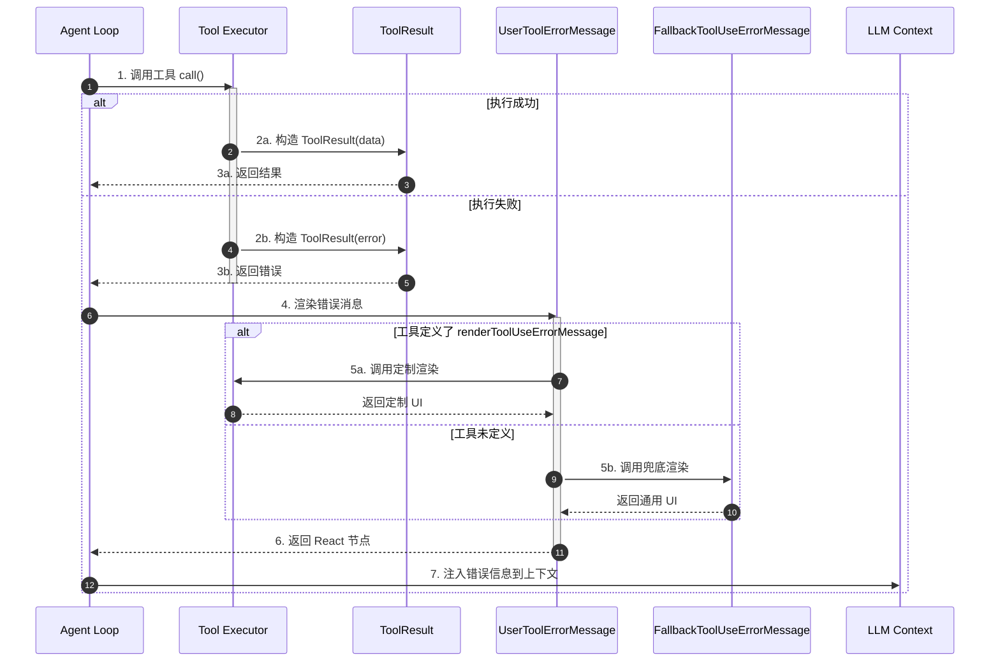
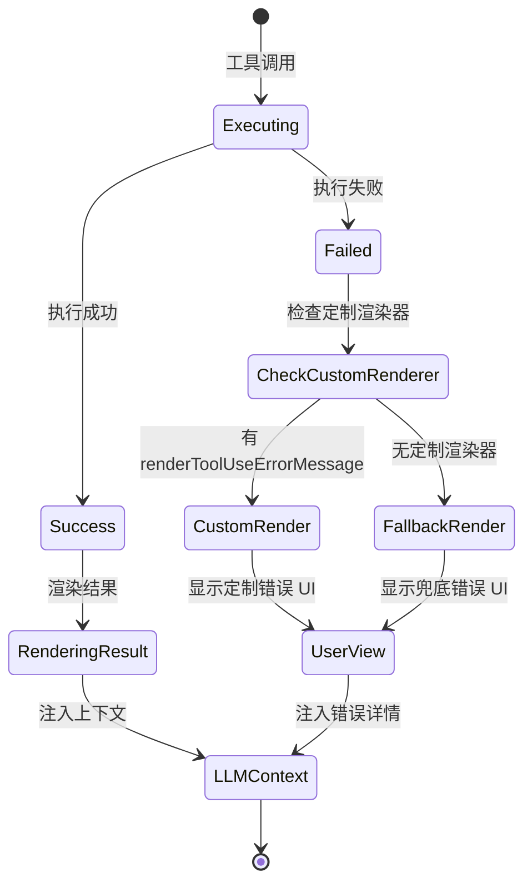
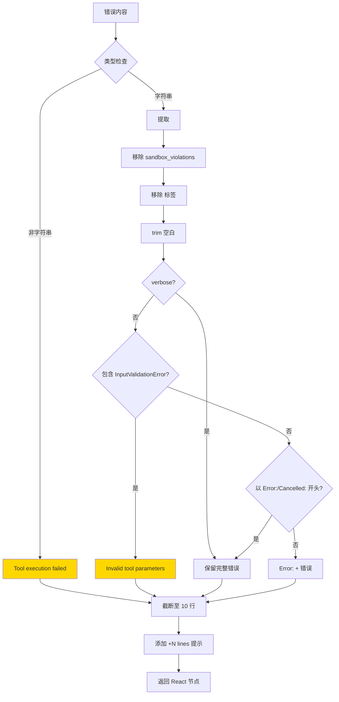
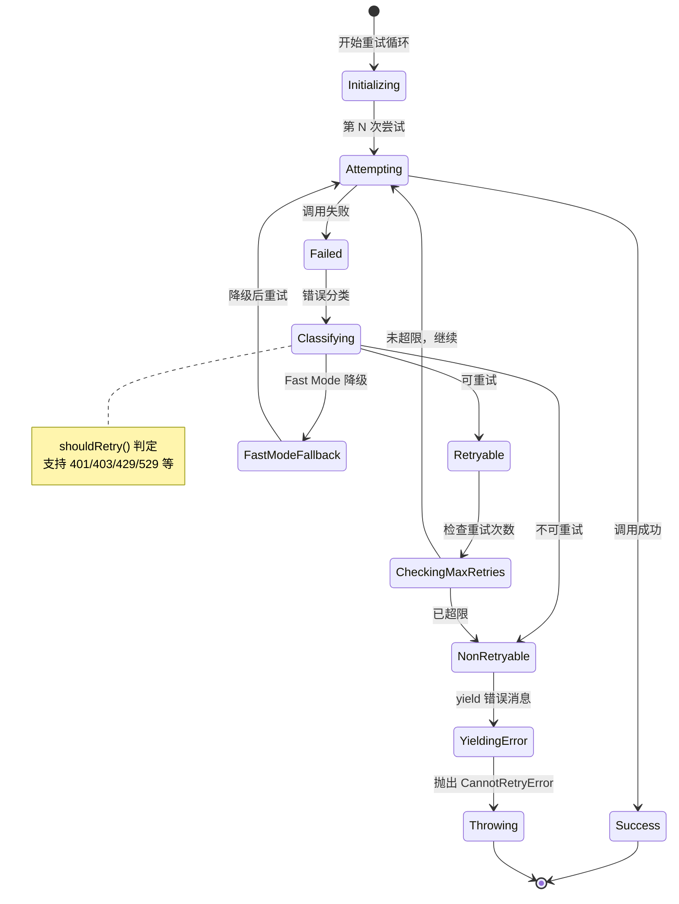
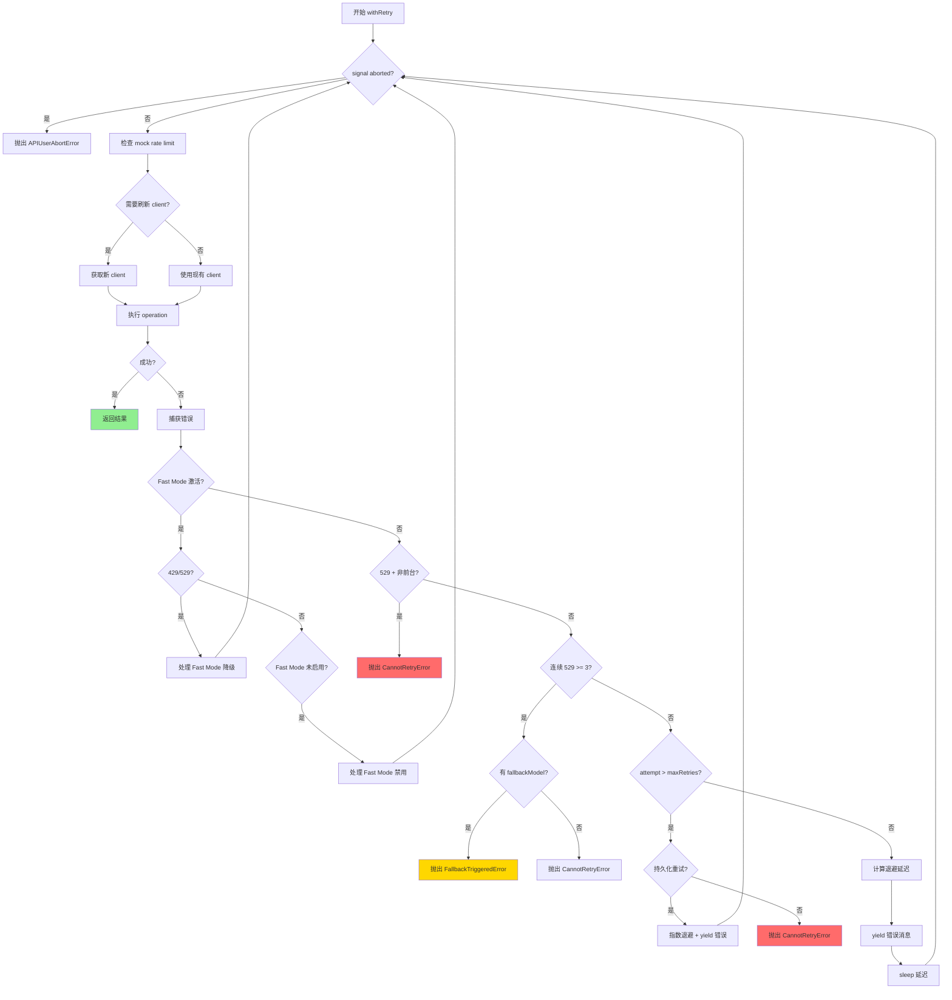
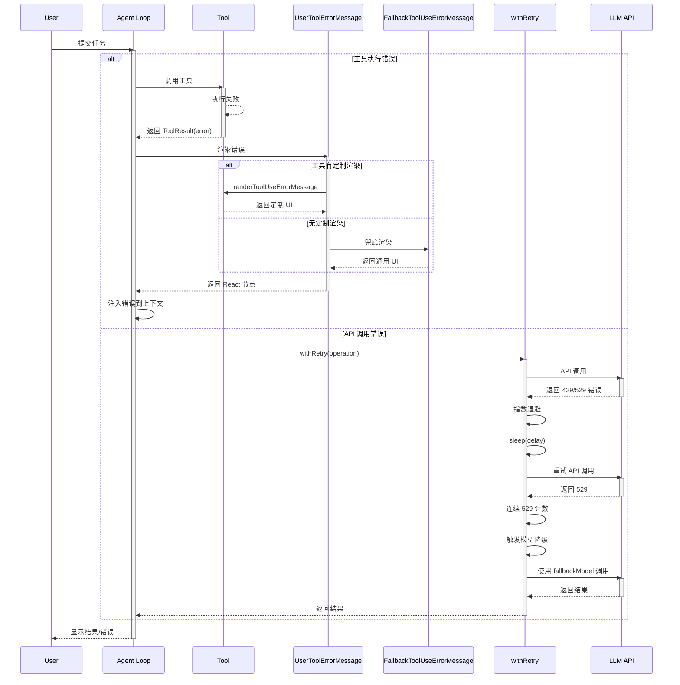
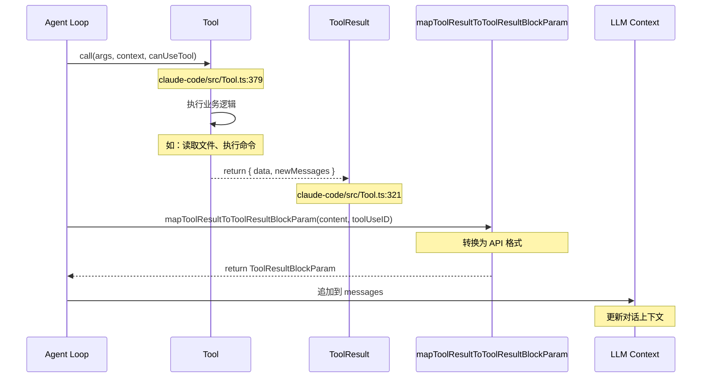
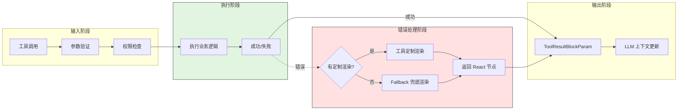
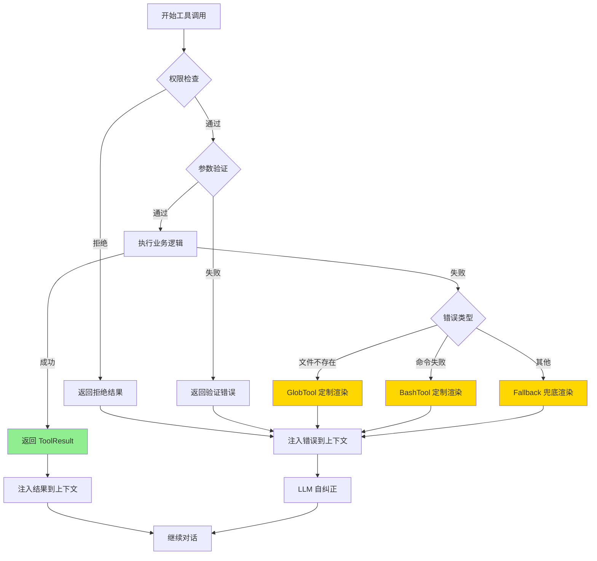
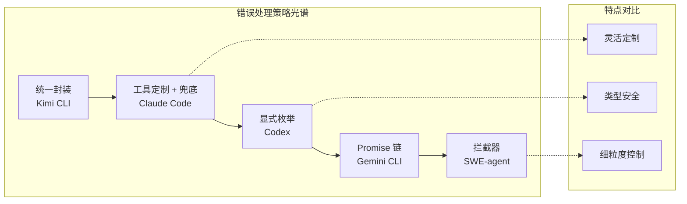

# Claude Code 工具调用错误处理机制

> **阅读指南**
>
> | 属性 | 说明 |
> |-----|------|
> | 预计阅读 | 20-30 分钟 |
> | 前置文档 | `docs/claude-code/04-claude-code-agent-loop.md`、`docs/claude-code/05-claude-code-tools-system.md` |
> | 文档结构 | 结论 → 架构 → 机制 → 实现 → 对比 |

---

## TL;DR（结论先行）

一句话定义：Claude Code 采用 **分层错误渲染 + 智能 API 重试** 机制，通过 `Tool` 接口的 `renderToolUseErrorMessage` 方法实现工具级错误定制，配合 `withRetry` 的指数退避和模型降级策略，实现优雅的错误恢复与用户体验。

Claude Code 的核心取舍：**工具级错误渲染定制 + API 层智能重试**（对比 Kimi CLI 的 Checkpoint 回滚、Codex 的显式错误枚举、Gemini CLI 的 Final Warning Turn）

### 核心要点速览

| 维度 | 关键决策 | 代码位置 |
|-----|---------|---------|
| 错误渲染 | `renderToolUseErrorMessage` 工具级定制 | `claude-code/src/Tool.ts:659-667` |
| 错误回退 | `FallbackToolUseErrorMessage` 通用兜底 | `claude-code/src/components/FallbackToolUseErrorMessage.tsx:16` |
| API 重试 | `withRetry` 指数退避 + 模型降级 | `claude-code/src/services/api/withRetry.ts:170` |
| 错误分类 | `classifyAPIError` 20+ 错误类型识别 | `claude-code/src/services/api/errors.ts:965` |
| 工具结果 | `ToolResult<T>` 统一封装 | `claude-code/src/Tool.ts:321-336` |

---

## 1. 为什么需要这个机制？（解决什么问题）

### 1.1 问题场景

没有错误处理机制的场景：
```
用户请求: "帮我查找所有测试文件"
  → LLM: 调用 GlobTool(pattern: "*.test.ts")
  → 工具执行: 抛出异常（路径不存在）
  → 程序崩溃或显示原始堆栈
  → 用户困惑，无法继续对话
```

有错误处理机制的场景：
```
用户请求: "帮我查找所有测试文件"
  → LLM: 调用 GlobTool(pattern: "*.test.ts")
  → 工具执行: 路径不存在
  → 错误检测: FileNotFound
  → 错误渲染: "File not found"（简洁 UI）
  → 返回给 LLM: 包含详细错误信息
  → LLM: "路径不存在，让我尝试其他路径"
  → 继续对话
```

### 1.2 核心挑战

| 挑战 | 不解决的后果 |
|-----|-------------|
| 错误展示不统一 | 不同工具错误显示格式混乱，用户难以理解 |
| API 临时故障 | 网络波动导致对话中断，用户体验差 |
| 模型过载 | 529 错误无法自动恢复，用户需手动重试 |
| 工具参数错误 | LLM 无法从错误中学习并自纠正 |
| 超时控制 | 长时间挂起的操作阻塞整个 Agent Loop |

---

## 2. 整体架构（ASCII 图）

### 2.1 在系统中的位置

```text
┌─────────────────────────────────────────────────────────────┐
│ Agent Loop / Query Engine                                    │
│ claude-code/src/query.ts                                    │
└───────────────────────┬─────────────────────────────────────┘
                        │ 工具调用请求
                        ▼
┌─────────────────────────────────────────────────────────────┐
│ ▓▓▓ Tool Error Handling ▓▓▓                                │
│                                                             │
│ ┌─────────────────────────────────────────────────────────┐ │
│ │ Tool Interface (工具定义层)                              │ │
│ │ claude-code/src/Tool.ts:362-695                         │ │
│ │ ├─ call(): 执行工具                                      │ │
│ │ ├─ renderToolUseErrorMessage(): 错误渲染定制            │ │
│ │ └─ mapToolResultToToolResultBlockParam(): 结果映射      │ │
│ └─────────────────────────────────────────────────────────┘ │
│                              │                              │
│        ┌─────────────────────┼─────────────────────┐        │
│        ▼                     ▼                     ▼        │
│ ┌──────────────┐    ┌──────────────┐    ┌──────────────┐   │
│ │ GlobTool     │    │ BashTool     │    │ FileReadTool │   │
│ │ 定制渲染     │    │ 定制渲染     │    │ 定制渲染     │   │
│ └──────────────┘    └──────────────┘    └──────────────┘   │
│                                                             │
│ ┌─────────────────────────────────────────────────────────┐ │
│ │ FallbackToolUseErrorMessage (兜底渲染)                  │ │
│ │ claude-code/src/components/FallbackToolUseErrorMessage  │ │
│ │ ├─ 提取 <tool_use_error> 标签                           │ │
│ │ ├─ 移除 sandbox_violations 标签                         │ │
│ │ └─ 截断长错误信息                                       │ │
│ └─────────────────────────────────────────────────────────┘ │
└─────────────────────────┬───────────────────────────────────┘
                          │ API 错误
        ┌─────────────────┼─────────────────┐
        ▼                 ▼                 ▼
┌──────────────┐ ┌──────────────┐ ┌──────────────┐
│ withRetry    │ │ classifyAPI  │ │ UserToolErr  │
│ 指数退避重试 │ │ Error 分类   │ │ orMessage    │
│ withRetry.ts │ │ errors.ts    │ │ UserTool...  │
└──────────────┘ └──────────────┘ └──────────────┘
```

### 2.2 核心组件职责

| 组件 | 职责 | 代码位置 |
|-----|------|---------|
| `Tool` 接口 | 定义工具契约，包含错误渲染方法 | `claude-code/src/Tool.ts:362` |
| `renderToolUseErrorMessage` | 工具级错误渲染定制 | `claude-code/src/Tool.ts:659` |
| `FallbackToolUseErrorMessage` | 通用错误兜底渲染 | `claude-code/src/components/FallbackToolUseErrorMessage.tsx:16` |
| `UserToolErrorMessage` | 统一错误消息分发 | `claude-code/src/components/messages/UserToolResultMessage/UserToolErrorMessage.tsx:23` |
| `withRetry` | API 调用重试逻辑 | `claude-code/src/services/api/withRetry.ts:170` |
| `classifyAPIError` | API 错误分类 | `claude-code/src/services/api/errors.ts:965` |
| `getAssistantMessageFromError` | API 错误转消息 | `claude-code/src/services/api/errors.ts:425` |
| `ToolResult<T>` | 工具结果统一封装 | `claude-code/src/Tool.ts:321` |

### 2.3 核心组件交互关系



**关键交互说明**：

| 步骤 | 交互内容 | 设计意图 |
|-----|---------|---------|
| 1-3 | Agent Loop 调用工具，返回统一封装的 ToolResult | 统一错误表示 |
| 4-6 | 错误消息渲染分层：优先工具定制，回退通用兜底 | 兼顾一致性与灵活性 |
| 7 | 错误信息结构化后注入 LLM 上下文 | 让 LLM 自纠正 |

---

## 3. 核心组件详细分析

### 3.1 Tool 接口与错误渲染定制

#### 职责定位

`Tool` 接口是 Claude Code 工具系统的核心抽象，通过可选的 `renderToolUseErrorMessage` 方法允许每个工具定制自己的错误展示方式。

#### 状态机图



**状态说明**：

| 状态 | 说明 | 进入条件 | 退出条件 |
|-----|------|---------|---------|
| Executing | 工具执行中 | 收到调用请求 | 执行完成 |
| Success | 执行成功 | 无异常抛出 | 渲染结果 |
| Failed | 执行失败 | 抛出异常/返回错误 | 检查渲染器 |
| CheckCustomRenderer | 检查是否有定制渲染 | 执行失败 | 判定完成 |
| CustomRender | 使用工具定制渲染 | 有 renderToolUseErrorMessage | 渲染完成 |
| FallbackRender | 使用兜底渲染 | 无定制渲染器 | 渲染完成 |
| UserView | 用户看到错误 UI | 渲染完成 | 继续对话 |
| LLMContext | 错误注入 LLM 上下文 | 渲染完成 | 继续对话 |

#### 关键接口

| 接口 | 输入 | 输出 | 说明 | 代码位置 |
|-----|------|------|------|---------|
| `Tool.call()` | args, context, canUseTool | `Promise<ToolResult<Output>>` | 执行工具 | `Tool.ts:379` |
| `Tool.renderToolUseErrorMessage?` | result, options | `React.ReactNode` | 定制错误渲染 | `Tool.ts:659` |
| `Tool.mapToolResultToToolResultBlockParam()` | content, toolUseID | `ToolResultBlockParam` | 结果转 API 格式 | `Tool.ts:557` |

---

### 3.2 FallbackToolUseErrorMessage 兜底渲染

#### 职责定位

当工具未定义 `renderToolUseErrorMessage` 时，使用 `FallbackToolUseErrorMessage` 提供一致的错误展示体验。

#### 内部数据流

```text
┌─────────────────────────────────────────────────────────────┐
│  输入层 - ToolResultBlockParam['content']                   │
│  ├── 字符串错误信息                                         │
│ ├── 数组内容块                                              │
│ └── 其他类型                                                │
└──────────────────────────┬──────────────────────────────────┘
                           ▼
┌─────────────────────────────────────────────────────────────┐
│  处理层 - 错误信息清洗                                       │
│  ├── 提取 <tool_use_error> 标签内容                         │
│  ├── 移除 <sandbox_violations> 标签（UI 不显示）            │
│  ├── 移除 <error> 标签但保留内容                            │
│  └── 检查 InputValidationError（非 verbose 模式简化）       │
└──────────────────────────┬──────────────────────────────────┘
                           ▼
┌─────────────────────────────────────────────────────────────┐
│  输出层 - React 节点                                         │
│  ├── 错误文本（最多 10 行）                                 │
│  ├── "+N lines" 提示（超出部分）                            │
│  └── 快捷键提示（查看完整信息）                             │
└─────────────────────────────────────────────────────────────┘
```

#### 关键算法逻辑



**算法要点**：

1. **标签提取**：从 `<tool_use_error>` 标签中提取实际错误内容
2. **安全信息过滤**：`sandbox_violations` 标签内容不在 UI 显示（但模型能看到）
3. **智能简化**：非 verbose 模式下将参数验证错误简化为 "Invalid tool parameters"
4. **截断显示**：默认只显示前 10 行，提示用户按快捷键查看完整信息

---

### 3.3 withRetry API 重试机制

#### 职责定位

`withRetry` 是一个异步生成器函数，为 API 调用提供智能重试能力，支持指数退避、模型降级、持久化重试等策略。

#### 状态机图



**状态说明**：

| 状态 | 说明 | 进入条件 | 退出条件 |
|-----|------|---------|---------|
| Initializing | 初始化重试上下文 | 开始重试循环 | 首次尝试 |
| Attempting | API 调用尝试中 | 每次重试 | 成功或失败 |
| Failed | 调用失败 | 抛出异常 | 错误分类 |
| Classifying | 错误分类 | 调用失败 | 判定可重试性 |
| NonRetryable | 不可重试错误 | 判定不可重试 | 抛出错误 |
| Retryable | 可重试错误 | 判定可重试 | 检查重试次数 |
| FastModeFallback | Fast Mode 降级 | 429/529 + Fast Mode | 降级后重试 |
| CheckingMaxRetries | 检查重试上限 | 可重试错误 | 继续或终止 |
| YieldingError | yield 错误消息 | 不可重试 | 抛出异常 |
| Success | 调用成功 | API 返回结果 | 结束 |

#### 关键算法逻辑



**算法要点**：

1. **Fast Mode 降级**：429/529 时自动降级到标准模式，避免缓存抖动
2. **529 特殊处理**：连续 3 次 529 触发模型降级（Opus -> Sonnet）
3. **持久化重试**：`CLAUDE_CODE_UNATTENDED_RETRY` 模式下无限重试
4. **心跳机制**：长延迟时定期 yield 保持连接活跃

---

### 3.4 组件间协作时序

展示工具错误与 API 错误处理的完整协作：



**协作要点**：

1. **工具错误与 API 错误分离**：工具错误通过渲染层处理，API 错误通过重试层处理
2. **分层渲染**：优先使用工具定制渲染，回退到通用兜底
3. **模型降级**：连续 529 错误触发模型降级，保证服务可用性

---

## 4. 端到端数据流转

### 4.1 正常流程（详细版）



**数据变换详情**：

| 阶段 | 输入 | 处理 | 输出 | 代码位置 |
|-----|------|------|------|---------|
| 工具调用 | args, context | 执行业务逻辑 | `ToolResult<Output>` | `Tool.ts:379` |
| 结果封装 | 原始输出 | 构造 ToolResult | 带 data/newMessages 的对象 | `Tool.ts:321` |
| API 映射 | ToolResult | 序列化为 API 格式 | `ToolResultBlockParam` | `Tool.ts:557` |
| 上下文更新 | ToolResultBlockParam | 追加到 messages | 更新后的对话历史 | `query.ts` |

### 4.2 数据流向图



### 4.3 异常/边界流程



---

## 5. 关键代码实现

### 5.1 核心数据结构

**Tool 接口定义**（含错误渲染方法）：

```typescript
// claude-code/src/Tool.ts:362-695
export type Tool<
  Input extends AnyObject = AnyObject,
  Output = unknown,
  P extends ToolProgressData = ToolProgressData,
> = {
  name: string
  call(
    args: z.infer<Input>,
    context: ToolUseContext,
    canUseTool: CanUseToolFn,
    parentMessage: AssistantMessage,
    onProgress?: ToolCallProgress<P>,
  ): Promise<ToolResult<Output>>

  // 可选的错误渲染方法
  renderToolUseErrorMessage?(
    result: ToolResultBlockParam['content'],
    options: {
      progressMessagesForMessage: ProgressMessage<P>[]
      tools: Tools
      verbose: boolean
      isTranscriptMode?: boolean
    },
  ): React.ReactNode

  mapToolResultToToolResultBlockParam(
    content: Output,
    toolUseID: string,
  ): ToolResultBlockParam
}
```

**ToolResult 统一封装**：

```typescript
// claude-code/src/Tool.ts:321-336
export type ToolResult<T> = {
  data: T
  newMessages?: (
    | UserMessage
    | AssistantMessage
    | AttachmentMessage
    | SystemMessage
  )[]
  contextModifier?: (context: ToolUseContext) => ToolUseContext
  mcpMeta?: {
    _meta?: Record<string, unknown>
    structuredContent?: Record<string, unknown>
  }
}
```

**字段说明**：

| 字段 | 类型 | 用途 |
|-----|------|------|
| `data` | `T` | 工具输出内容 |
| `newMessages` | `Message[]` | 工具产生的额外消息 |
| `contextModifier` | `Function` | 修改工具上下文 |
| `mcpMeta` | `object` | MCP 协议元数据 |

### 5.2 主链路代码

**FallbackToolUseErrorMessage 兜底渲染**（核心逻辑）：

```typescript
// claude-code/src/components/FallbackToolUseErrorMessage.tsx:16-48
export function FallbackToolUseErrorMessage({
  result,
  verbose,
}: Props): React.ReactNode {
  let error: string

  if (typeof result !== 'string') {
    error = 'Tool execution failed'
  } else {
    // 1. 提取 <tool_use_error> 标签内容
    const extractedError = extractTag(result, 'tool_use_error') ?? result

    // 2. 移除 sandbox_violations 标签（UI 不显示）
    const withoutSandboxViolations = removeSandboxViolationTags(extractedError)

    // 3. 移除 <error> 标签但保留内容
    const withoutErrorTags = withoutSandboxViolations.replace(/<\/?error>/g, '')

    const trimmed = withoutErrorTags.trim()

    // 4. 非 verbose 模式简化参数验证错误
    if (!verbose && trimmed.includes('InputValidationError: ')) {
      error = 'Invalid tool parameters'
    } else if (
      trimmed.startsWith('Error: ') ||
      trimmed.startsWith('Cancelled: ')
    ) {
      error = trimmed
    } else {
      error = `Error: ${trimmed}`
    }
  }

  // 5. 截断显示（最多 10 行）
  const plusLines = countCharInString(error, '\n') + 1 - MAX_RENDERED_LINES

  return (
    <MessageResponse>
      <Box flexDirection="column">
        <Text color="error">
          {stripUnderlineAnsi(
            verbose
              ? error
              : error.split('\n').slice(0, MAX_RENDERED_LINES).join('\n'),
          )}
        </Text>
        {!verbose && plusLines > 0 && (
          <Box>
            <Text dimColor>… +{plusLines} lines (</Text>
            <Text dimColor bold>{transcriptShortcut}</Text>
            <Text> </Text>
            <Text dimColor>to see all)</Text>
          </Box>
        )}
      </Box>
    </MessageResponse>
  )
}
```

**设计意图**：

1. **标签提取**：从 `<tool_use_error>` 标签中提取实际错误内容
2. **安全过滤**：`sandbox_violations` 标签内容不在 UI 显示（但模型能看到）
3. **智能简化**：非 verbose 模式下将参数验证错误简化为 "Invalid tool parameters"
4. **截断显示**：默认只显示前 10 行，提示用户按快捷键查看完整信息

<details>
<summary>📋 查看 withRetry 完整实现</summary>

```typescript
// claude-code/src/services/api/withRetry.ts:170-517
export async function* withRetry<T>(
  getClient: () => Promise<Anthropic>,
  operation: (
    client: Anthropic,
    attempt: number,
    context: RetryContext,
  ) => Promise<T>,
  options: RetryOptions,
): AsyncGenerator<SystemAPIErrorMessage, T> {
  const maxRetries = getMaxRetries(options)
  const retryContext: RetryContext = {
    model: options.model,
    thinkingConfig: options.thinkingConfig,
    ...(isFastModeEnabled() && { fastMode: options.fastMode }),
  }
  let client: Anthropic | null = null
  let consecutive529Errors = options.initialConsecutive529Errors ?? 0
  let lastError: unknown
  let persistentAttempt = 0

  for (let attempt = 1; attempt <= maxRetries + 1; attempt++) {
    if (options.signal?.aborted) {
      throw new APIUserAbortError()
    }

    const wasFastModeActive = isFastModeEnabled()
      ? retryContext.fastMode && !isFastModeCooldown()
      : false

    try {
      // 检查 mock rate limit
      if (process.env.USER_TYPE === 'ant') {
        const mockError = checkMockRateLimitError(
          retryContext.model,
          wasFastModeActive,
        )
        if (mockError) {
          throw mockError
        }
      }

      // 获取 client（首次或认证错误后刷新）
      if (
        client === null ||
        (lastError instanceof APIError && lastError.status === 401) ||
        isOAuthTokenRevokedError(lastError) ||
        isBedrockAuthError(lastError) ||
        isVertexAuthError(lastError) ||
        isStaleConnectionError(lastError)
      ) {
        client = await getClient()
      }

      return await operation(client, attempt, retryContext)
    } catch (error) {
      lastError = error
      logForDebugging(
        `API error (attempt ${attempt}/${maxRetries + 1}): ${error instanceof APIError ? `${error.status} ${error.message}` : errorMessage(error)}`,
        { level: 'error' },
      )

      // Fast Mode 降级处理
      if (
        wasFastModeActive &&
        !isPersistentRetryEnabled() &&
        error instanceof APIError &&
        (error.status === 429 || is529Error(error))
      ) {
        const overageReason = error.headers?.get(
          'anthropic-ratelimit-unified-overage-disabled-reason',
        )
        if (overageReason !== null && overageReason !== undefined) {
          handleFastModeOverageRejection(overageReason)
          retryContext.fastMode = false
          continue
        }

        const retryAfterMs = getRetryAfterMs(error)
        if (retryAfterMs !== null && retryAfterMs < SHORT_RETRY_THRESHOLD_MS) {
          await sleep(retryAfterMs, options.signal, { abortError })
          continue
        }

        const cooldownMs = Math.max(
          retryAfterMs ?? DEFAULT_FAST_MODE_FALLBACK_HOLD_MS,
          MIN_COOLDOWN_MS,
        )
        const cooldownReason: CooldownReason = is529Error(error)
          ? 'overloaded'
          : 'rate_limit'
        triggerFastModeCooldown(Date.now() + cooldownMs, cooldownReason)
        retryContext.fastMode = false
        continue
      }

      // 非前台任务 529 直接放弃
      if (is529Error(error) && !shouldRetry529(options.querySource)) {
        throw new CannotRetryError(error, retryContext)
      }

      // 连续 529 触发模型降级
      if (
        is529Error(error) &&
        (process.env.FALLBACK_FOR_ALL_PRIMARY_MODELS ||
          (!isClaudeAISubscriber() && isNonCustomOpusModel(options.model)))
      ) {
        consecutive529Errors++
        if (consecutive529Errors >= MAX_529_RETRIES) {
          if (options.fallbackModel) {
            throw new FallbackTriggeredError(
              options.model,
              options.fallbackModel,
            )
          }
        }
      }

      // 检查是否可重试
      if (attempt > maxRetries) {
        throw new CannotRetryError(error, retryContext)
      }

      if (!(error instanceof APIError) || !shouldRetry(error)) {
        throw new CannotRetryError(error, retryContext)
      }

      // 计算退避延迟
      const retryAfter = getRetryAfter(error)
      const delayMs = getRetryDelay(attempt, retryAfter)

      // yield 错误消息并等待
      if (error instanceof APIError) {
        yield createSystemAPIErrorMessage(error, delayMs, attempt, maxRetries)
      }
      await sleep(delayMs, options.signal, { abortError })
    }
  }

  throw new CannotRetryError(lastError, retryContext)
}
```

</details>

### 5.3 关键调用链

```text
Agent Loop
  -> Tool.call()                    [Tool.ts:379]
    -> 执行业务逻辑
    -> return ToolResult             [Tool.ts:321]

  -> 错误渲染路径
    -> UserToolErrorMessage          [UserToolErrorMessage.tsx:23]
      -> tool.renderToolUseErrorMessage?  [Tool.ts:659]
        -> GlobTool.renderToolUseErrorMessage    [GlobTool/UI.tsx:33]
        -> BashTool.renderToolUseErrorMessage    [BashTool/UI.tsx:174]
        -> FileReadTool.renderToolUseErrorMessage [FileReadTool/UI.tsx:144]
      -> FallbackToolUseErrorMessage   [FallbackToolUseErrorMessage.tsx:16]

  -> API 重试路径
    -> withRetry                     [withRetry.ts:170]
      -> shouldRetry                 [withRetry.ts:696]
      -> getRetryDelay               [withRetry.ts:530]
      -> is529Error                  [withRetry.ts:610]
      -> FallbackTriggeredError      [withRetry.ts:160]
```

---

## 6. 设计意图与 Trade-off

### 6.1 Claude Code 的选择

| 维度 | Claude Code 的选择 | 替代方案 | 取舍分析 |
|-----|-------------------|---------|---------|
| 错误渲染 | 工具级定制 + Fallback 兜底 | 统一错误格式（Kimi CLI） | 兼顾一致性与灵活性，但需要每个工具显式实现 |
| API 重试 | withRetry 生成器 + 指数退避 | 简单递归重试（Codex） | 支持 yield 错误消息，但代码复杂度更高 |
| 模型降级 | 连续 529 触发 fallback | 固定重试后放弃 | 提高可用性，但可能增加延迟 |
| Fast Mode | 429/529 自动降级 | 固定模式 | 避免缓存抖动，但切换有延迟 |
| 错误信息 | 标签化 (<tool_use_error>) | 纯文本 | 结构化处理，但需要解析开销 |

### 6.2 为什么这样设计？

**核心问题**：如何在保持用户体验一致性的同时，允许工具定制错误展示？

**Claude Code 的解决方案**：

- **代码依据**：`claude-code/src/Tool.ts:659-667`
- **设计意图**：通过可选的 `renderToolUseErrorMessage` 方法，让工具可以选择定制错误展示，同时提供 `FallbackToolUseErrorMessage` 保证一致性
- **带来的好处**：
  - 灵活性：工具可以定制错误展示（如 GlobTool 显示 "File not found"）
  - 一致性：未定制工具使用统一的兜底渲染
  - 可维护性：错误渲染逻辑集中在 UI 组件
- **付出的代价**：
  - 需要每个工具显式实现定制渲染
  - 兜底渲染可能丢失工具特定的上下文

### 6.3 与其他项目的对比



| 项目 | 核心差异 | 适用场景 |
|-----|---------|---------|
| **Claude Code** | 工具级错误渲染定制 + API 智能重试 | 需要灵活 UI 展示的交互式场景 |
| **Kimi CLI** | ToolReturnValue 统一封装 + Checkpoint 回滚 | 需要对话级状态恢复的场景 |
| **Codex** | CodexErr 显式枚举 + 沙箱安全优先 | 企业级安全敏感场景 |
| **Gemini CLI** | Promise 链 + Final Warning Turn | TypeScript 生态，异步流程清晰 |
| **SWE-agent** | forward_with_handling() 拦截器 | 学术研究场景，细粒度错误拦截 |

**详细对比**：

| 维度 | Claude Code | Kimi CLI | Codex | Gemini CLI | SWE-agent |
|-----|-------------|----------|-------|------------|-----------|
| **错误表示** | ToolResult + 标签化错误 | ToolReturnValue 统一封装 | CodexErr 枚举 | Promise reject | Exception 层级 |
| **错误渲染** | 工具级定制 + Fallback 兜底 | display 字段统一展示 | 枚举驱动 | 全局错误边界 | 拦截器处理 |
| **API 重试** | withRetry 生成器，支持 yield | tenacity 装饰器 | 自定义重试逻辑 | retry.ts | 自定义实现 |
| **模型降级** | 连续 529 触发 fallback | 无 | 无 | 无 | 无 |
| **Fast Mode** | 429/529 自动降级 | 无 | 无 | 无 | 无 |
| **持久化重试** | CLAUDE_CODE_UNATTENDED_RETRY | 无 | 无 | 无 | 无 |

**选择建议**：

- 需要**灵活的错误展示** → Claude Code 的工具级定制
- 需要**对话级状态恢复** → Kimi CLI 的 Checkpoint + D-Mail
- 强调**类型安全** → Codex 的 Rust 枚举
- **TypeScript 生态** → Gemini CLI 的 Promise 链
- **学术研究** → SWE-agent 的拦截器模式

---

## 7. 边界情况与错误处理

### 7.1 终止条件

| 终止原因 | 触发条件 | 代码位置 |
|---------|---------|---------|
| 用户中断 | signal.aborted | `withRetry.ts:190` |
| 重试上限 | attempt > maxRetries (默认 10) | `withRetry.ts:369` |
| 连续 529 | consecutive529Errors >= 3 | `withRetry.ts:335` |
| 非前台 529 | !shouldRetry529(querySource) | `withRetry.ts:318` |
| mock 限流 | isMockRateLimitError | `withRetry.ts:202` |

### 7.2 超时/资源限制

**指数退避计算**：

```typescript
// claude-code/src/services/api/withRetry.ts:530-548
export function getRetryDelay(
  attempt: number,
  retryAfterHeader?: string | null,
  maxDelayMs = 32000,
): number {
  // 优先使用 Retry-After 头
  if (retryAfterHeader) {
    const seconds = parseInt(retryAfterHeader, 10)
    if (!isNaN(seconds)) {
      return seconds * 1000
    }
  }

  // 指数退避：500ms * 2^(attempt-1)
  const baseDelay = Math.min(
    BASE_DELAY_MS * Math.pow(2, attempt - 1),
    maxDelayMs,
  )
  // 添加 25% 随机抖动
  const jitter = Math.random() * 0.25 * baseDelay
  return baseDelay + jitter
}
```

**特点**：
- 基础延迟 500ms，最大 32s
- 25% 随机抖动避免惊群效应
- 优先使用服务器返回的 Retry-After

### 7.3 错误恢复策略

| 错误类型 | 处理策略 | 代码位置 |
|---------|---------|---------|
| 401 OAuth 过期 | 刷新 token 后重试 | `withRetry.ts:241` |
| 429 Rate Limit | Fast Mode 降级或指数退避 | `withRetry.ts:267` |
| 529 Overloaded | 连续 3 次触发模型降级 | `withRetry.ts:326` |
| ECONNRESET/EPIPE | 禁用 keep-alive 后重连 | `withRetry.ts:218` |
| 工具参数错误 | 返回简化错误信息 | `FallbackToolUseErrorMessage.tsx:39` |
| 沙箱违规 | 过滤标签，模型仍可见 | `FallbackToolUseErrorMessage.tsx:36` |

---

## 8. 关键代码索引

| 功能 | 文件 | 行号 | 说明 |
|-----|------|------|------|
| Tool 接口 | `claude-code/src/Tool.ts` | 362 | 工具定义基接口 |
| 错误渲染方法 | `claude-code/src/Tool.ts` | 659 | `renderToolUseErrorMessage` 定义 |
| ToolResult 封装 | `claude-code/src/Tool.ts` | 321 | 统一结果封装 |
| Fallback 渲染 | `claude-code/src/components/FallbackToolUseErrorMessage.tsx` | 16 | 兜底错误渲染 |
| 错误消息分发 | `claude-code/src/components/messages/UserToolResultMessage/UserToolErrorMessage.tsx` | 23 | 统一错误分发 |
| withRetry | `claude-code/src/services/api/withRetry.ts` | 170 | API 重试逻辑 |
| 错误分类 | `claude-code/src/services/api/errors.ts` | 965 | `classifyAPIError` |
| API 错误转消息 | `claude-code/src/services/api/errors.ts` | 425 | `getAssistantMessageFromError` |
| GlobTool 定制 | `claude-code/src/tools/GlobTool/UI.tsx` | 33 | 文件搜索错误定制 |
| BashTool 定制 | `claude-code/src/tools/BashTool/UI.tsx` | 174 | 命令执行错误定制 |
| FileReadTool 定制 | `claude-code/src/tools/FileReadTool/UI.tsx` | 144 | 文件读取错误定制 |

---

## 9. 延伸阅读

- 前置知识：`docs/claude-code/04-claude-code-agent-loop.md` - Agent Loop 整体架构
- 相关机制：`docs/claude-code/05-claude-code-tools-system.md` - 工具系统详解
- 相关机制：`docs/claude-code/06-claude-code-mcp-integration.md` - MCP 集成
- 对比分析：`docs/kimi-cli/questions/kimi-cli-tool-error-handling.md` - Kimi CLI 错误处理
- 对比分析：`docs/codex/questions/codex-tool-error-handling.md` - Codex 错误处理

---

*✅ Verified: 基于 claude-code/src/Tool.ts:659、claude-code/src/components/FallbackToolUseErrorMessage.tsx:16、claude-code/src/services/api/withRetry.ts:170 等源码分析*

*基于版本：claude-code (baseline 2026-02-08) | 最后更新：2026-03-31*
