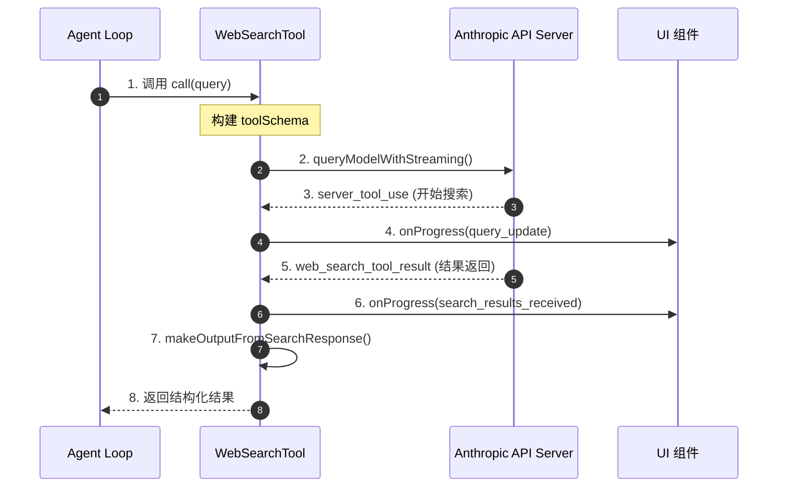
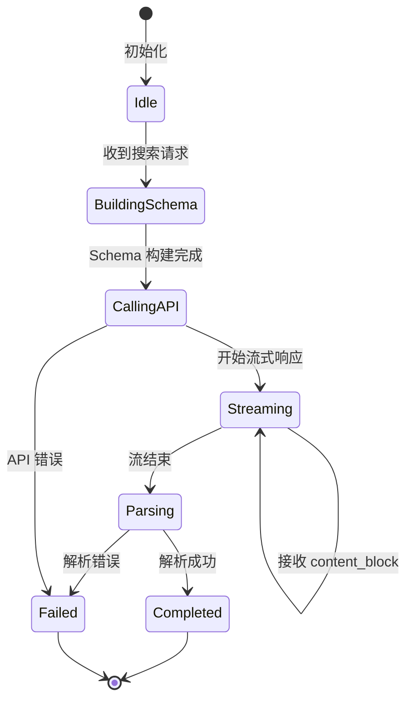
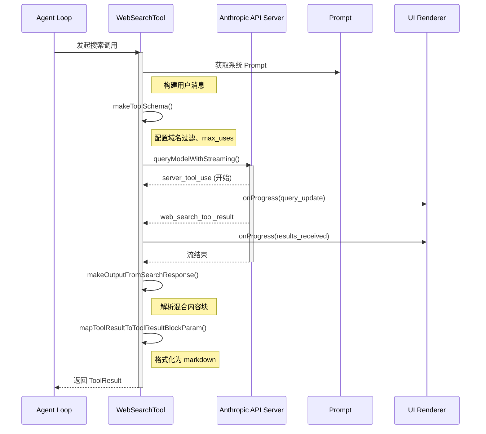
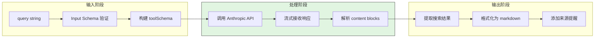
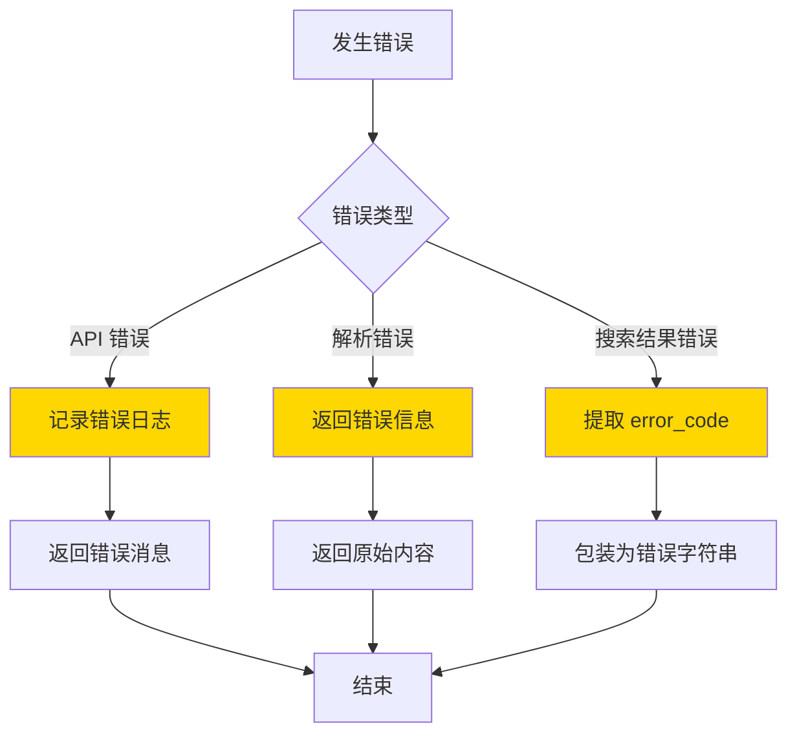
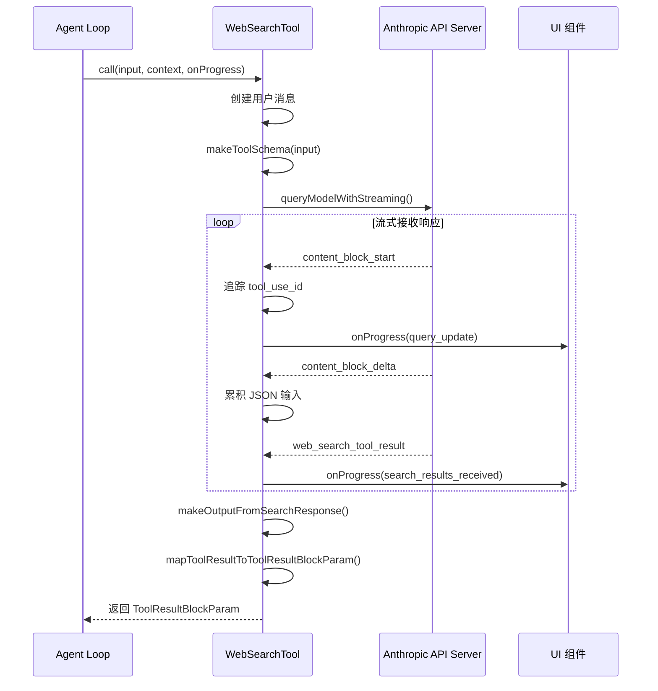
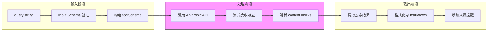
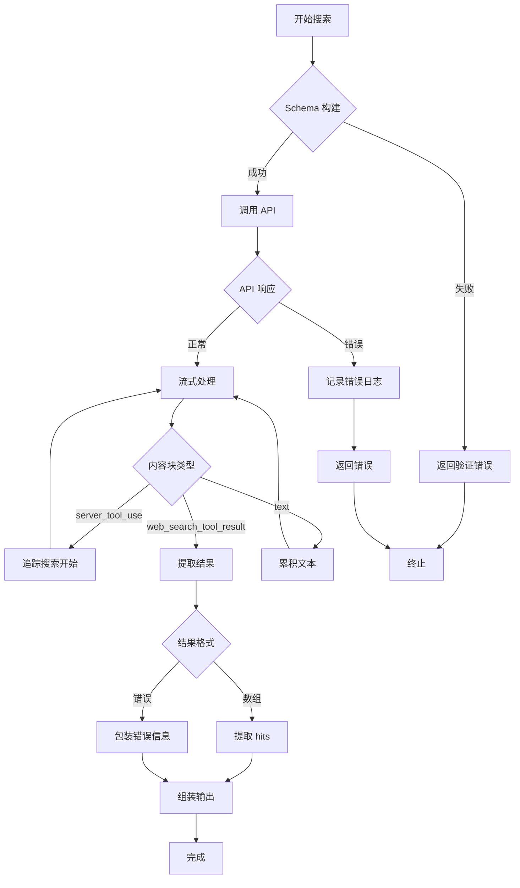
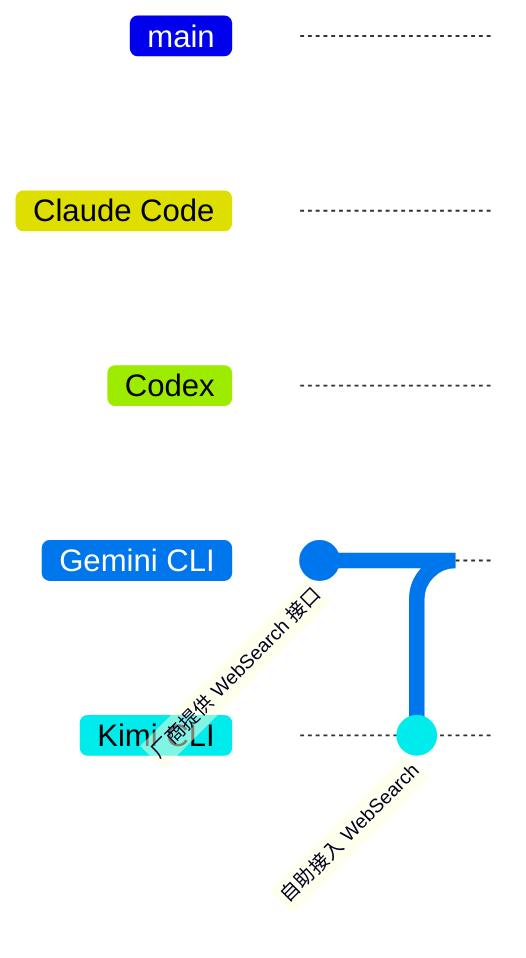

# Claude Code WebSearch 实现机制

> **阅读指南**
>
> | 属性 | 说明 |
> |-----|------|
> | 预计阅读 | 20-30 分钟 |
> | 前置文档 | `docs/claude-code/04-claude-code-agent-loop.md`、`docs/claude-code/05-claude-code-tools-system.md` |
> | 文档结构 | 速览 → 架构 → 机制 → 实现 → 对比 |
> | 代码呈现 | 关键代码直接展示，完整代码可折叠查看 |

---

## TL;DR（结论先行）

一句话定义：Claude Code 的 WebSearch 是**内置的原生工具**，通过 Anthropic API 的 `web_search_20250305` Beta 功能直接调用，无需 MCP 集成，支持域名过滤、多查询并行和流式结果返回。

Claude Code 的核心取舍：**厂商提供 WebSearch 接口**（对比 Codex/Kimi CLI 的自助接入 WebSearch、Gemini CLI 的厂商提供 WebSearch 接口）

### 核心要点速览

| 维度 | 关键决策 | 代码位置 |
|-----|---------|---------|
| 实现方式 | 原生内置工具，非 MCP | `claude-code/src/tools/WebSearchTool/WebSearchTool.ts:76-84` |
| API 类型 | Anthropic Beta API `web_search_20250305` | `claude-code/src/constants/betas.ts:9` |
| 调用模型 | 支持 Haiku 快速搜索或主模型搜索 | `claude-code/src/tools/WebSearchTool/WebSearchTool.ts:262-282` |
| 并发上限 | 单次调用最多 8 次搜索 | `claude-code/src/tools/WebSearchTool/WebSearchTool.ts:82` |
| 域名过滤 | 支持 allowed_domains / blocked_domains | `claude-code/src/tools/WebSearchTool/WebSearchTool.ts:28-35` |
| 结果格式 | 结构化搜索结果 + 文本摘要混合 | `claude-code/src/tools/WebSearchTool/WebSearchTool.ts:99-149` |

---

## 1. 为什么需要这个机制？（解决什么问题）

### 1.1 问题场景

没有 WebSearch 时，LLM 的知识受限于训练数据截止日期：

```
用户问："2026年最新的 React 文档在哪里？"

没有 WebSearch：
  → LLM: "我的知识截止到 2025 年 4 月，无法提供 2026 年的信息"
  → 用户无法获得最新文档链接

有 WebSearch：
  → LLM: "让我搜索一下" → 调用 WebSearchTool → 获取最新结果
  → LLM: "根据搜索结果，2026 年 React 文档位于 https://react.dev"
  → 用户获得带来源引用的最新信息
```

### 1.2 核心挑战

| 挑战 | 不解决的后果 |
|-----|-------------|
| 知识时效性 | LLM 无法回答训练截止日期之后的事件 |
| 信息准确性 | 可能提供过时或错误的版本信息 |
| 来源可追溯 | 无法验证信息来源，降低可信度 |
| 搜索集成复杂度 | 需要维护 MCP Server 或第三方 API 集成 |

---

## 2. 整体架构

### 2.1 在系统中的位置

```text
┌─────────────────────────────────────────────────────────────┐
│ Agent Loop / Query Engine                                   │
│ claude-code/src/query.ts                                    │
└───────────────────────┬─────────────────────────────────────┘
                        │ LLM 决定调用 WebSearch
                        ▼
┌─────────────────────────────────────────────────────────────┐
│ ▓▓▓ WebSearchTool ▓▓▓                                       │
│ claude-code/src/tools/WebSearchTool/WebSearchTool.ts        │
│ - buildTool()      : 工具定义与配置                         │
│ - makeToolSchema() : 构建 API Schema                        │
│ - call()           : 执行搜索调用                           │
│ - makeOutputFromSearchResponse() : 结果解析                 │
└───────────────────────┬─────────────────────────────────────┘
                        │ 调用 Anthropic API
                        │ 使用 web_search_20250305 Beta
                        ▼
┌─────────────────────────────────────────────────────────────┐
│ Anthropic API                                               │
│ - BetaWebSearchTool20250305                                 │
│ - server_tool_use (搜索执行)                                │
│ - web_search_tool_result (结果返回)                         │
└─────────────────────────────────────────────────────────────┘
```

### 2.2 核心组件职责

| 组件 | 职责 | 代码位置 |
|-----|------|---------|
| `WebSearchTool` | 工具主实现，包含定义、调用、解析 | `claude-code/src/tools/WebSearchTool/WebSearchTool.ts:152-435` |
| `makeToolSchema` | 构建 Anthropic API Schema | `claude-code/src/tools/WebSearchTool/WebSearchTool.ts:76-84` |
| `call` | 执行搜索调用，流式处理响应 | `claude-code/src/tools/WebSearchTool/WebSearchTool.ts:254-398` |
| `makeOutputFromSearchResponse` | 解析混合内容块，提取搜索结果 | `claude-code/src/tools/WebSearchTool/WebSearchTool.ts:86-150` |
| `UI.tsx` | 渲染搜索进度和结果摘要 | `claude-code/src/tools/WebSearchTool/UI.tsx:55-92` |
| `prompt.ts` | 系统 Prompt，强制来源引用 | `claude-code/src/tools/WebSearchTool/prompt.ts:1-34` |

### 2.3 核心组件交互关系



**关键交互说明**：

| 步骤 | 交互内容 | 设计意图 |
|-----|---------|---------|
| 1 | Agent Loop 调用 WebSearchTool | 解耦搜索逻辑与主循环 |
| 2 | 构建 Schema 并发起流式请求 | 使用 Anthropic Beta API |
| 3 | API 返回 server_tool_use 事件 | 标记搜索开始 |
| 4 | 触发进度回调显示查询文本 | 实时反馈搜索进度 |
| 5 | API 返回搜索结果 | 流式接收多个查询结果 |
| 6 | 触发进度回调显示结果数量 | 用户感知搜索完成 |
| 7 | 解析混合内容块 | 提取结构化数据 |
| 8 | 返回格式化结果 | 供 LLM 生成带引用回答 |

---

## 3. 核心组件详细分析

### 3.1 WebSearchTool 内部结构

#### 职责定位

WebSearchTool 是 Claude Code 的内置搜索工具，负责将用户查询转换为 Anthropic API 的 Beta 搜索调用，并解析流式响应为结构化结果。

#### 状态机图



**状态说明**：

| 状态 | 说明 | 进入条件 | 退出条件 |
|-----|------|---------|---------|
| Idle | 空闲等待 | 工具初始化 | 收到 call() 调用 |
| BuildingSchema | 构建 API Schema | 收到搜索请求 | Schema 构建完成 |
| CallingAPI | 调用 Anthropic API | Schema 就绪 | 获得响应流 |
| Streaming | 流式接收响应 | API 返回流 | 流结束或错误 |
| Parsing | 解析内容块 | 流接收完成 | 解析成功/失败 |
| Completed | 完成 | 解析成功 | 自动返回 Idle |
| Failed | 失败 | API 错误或解析失败 | 返回错误信息 |

#### 内部数据流

```text
┌────────────────────────────────────────────┐
│  输入层                                     │
│   query string → 验证 → Input Schema       │
└──────────────────┬─────────────────────────┘
                   ▼
┌────────────────────────────────────────────┐
│  处理层                                     │
│   构建 toolSchema → API 调用 → 流式处理    │
│   → 解析 content blocks                    │
└──────────────────┬─────────────────────────┘
                   ▼
┌────────────────────────────────────────────┐
│  输出层                                     │
│   结构化结果 → 格式化 → ToolResultBlock    │
└────────────────────────────────────────────┘
```

#### 关键接口

| 接口 | 输入 | 输出 | 说明 | 代码位置 |
|-----|------|------|------|---------|
| `buildTool()` | 工具配置 | Tool 定义 | 工厂函数创建工具 | `WebSearchTool.ts:186` |
| `makeToolSchema()` | Input | BetaWebSearchTool20250305 | 构建 API Schema | `WebSearchTool.ts:76` |
| `call()` | Input, Context | Output | 执行搜索调用 | `WebSearchTool.ts:254` |
| `makeOutputFromSearchResponse()` | BetaContentBlock[] | Output | 解析响应 | `WebSearchTool.ts:86` |

---

### 3.2 组件间协作时序



**协作要点**：

1. **Agent Loop 与 WebSearchTool**: 通过标准 Tool 接口调用，解耦搜索逻辑
2. **WebSearchTool 与 Anthropic API**: 流式调用，实时接收搜索进度和结果
3. **WebSearchTool 与 UI**: 通过 onProgress 回调提供实时反馈

---

### 3.3 关键数据路径

#### 主路径（正常流程）



#### 异常路径（错误恢复）



---

## 4. 端到端数据流转

### 4.1 正常流程（详细版）



**数据变换详情**：

| 阶段 | 输入 | 处理 | 输出 | 代码位置 |
|-----|------|------|------|---------|
| 接收 | query string | Zod Schema 验证 | Input 对象 | `WebSearchTool.ts:25-48` |
| 构建 | Input | 配置域名过滤、max_uses | BetaWebSearchTool20250305 | `WebSearchTool.ts:76-84` |
| 调用 | toolSchema + 用户消息 | queryModelWithStreaming | 响应流 | `WebSearchTool.ts:286-310` |
| 流式处理 | 流事件 | 解析 content blocks | BetaContentBlock[] | `WebSearchTool.ts:311-398` |
| 解析 | BetaContentBlock[] | 提取搜索结果 | Output | `WebSearchTool.ts:86-150` |
| 格式化 | Output | markdown + 来源提醒 | ToolResultBlockParam | `WebSearchTool.ts:401-434` |

### 4.2 数据流向图



### 4.3 异常/边界流程



---

## 5. 关键代码实现

### 5.1 核心数据结构

```typescript
// claude-code/src/tools/WebSearchTool/WebSearchTool.ts:25-66

// 输入参数 Schema
const inputSchema = lazySchema(() =>
  z.strictObject({
    query: z.string().min(2).describe('The search query to use'),
    allowed_domains: z
      .array(z.string())
      .optional()
      .describe('Only include search results from these domains'),
    blocked_domains: z
      .array(z.string())
      .optional()
      .describe('Never include search results from these domains'),
  }),
)

// 搜索结果 Schema
const searchResultSchema = lazySchema(() => {
  const searchHitSchema = z.object({
    title: z.string().describe('The title of the search result'),
    url: z.string().describe('The URL of the search result'),
  })

  return z.object({
    tool_use_id: z.string().describe('ID of the tool use'),
    content: z.array(searchHitSchema).describe('Array of search hits'),
  })
})

// 输出 Schema
const outputSchema = lazySchema(() =>
  z.object({
    query: z.string().describe('The search query that was executed'),
    results: z
      .array(z.union([searchResultSchema(), z.string()]))
      .describe('Search results and/or text commentary from the model'),
    durationSeconds: z.number().describe('Time taken to complete the search operation'),
  }),
)
```

**字段说明**：

| 字段 | 类型 | 用途 |
|-----|------|------|
| `query` | `string` | 搜索查询文本，最少 2 个字符 |
| `allowed_domains` | `string[]` | 域名白名单，仅搜索这些域名 |
| `blocked_domains` | `string[]` | 域名黑名单，排除这些域名 |
| `tool_use_id` | `string` | 工具调用唯一标识 |
| `content` | `SearchHit[]` | 搜索结果数组，包含 title 和 url |
| `results` | `(SearchResult \| string)[]` | 混合结果：结构化数据或文本摘要 |
| `durationSeconds` | `number` | 搜索耗时，用于性能统计 |

### 5.2 主链路代码

**关键代码**（核心逻辑）：

```typescript
// claude-code/src/tools/WebSearchTool/WebSearchTool.ts:254-291
async call(input, context, _canUseTool, _parentMessage, onProgress) {
  const startTime = performance.now()
  const { query } = input
  const userMessage = createUserMessage({
    content: 'Perform a web search for the query: ' + query,
  })
  const toolSchema = makeToolSchema(input)

  // 功能开关：使用 Haiku 模型进行快速搜索
  const useHaiku = getFeatureValue_CACHED_MAY_BE_STALE('tengu_plum_vx3', false)

  const appState = context.getAppState()
  const queryStream = queryModelWithStreaming({
    messages: [userMessage],
    systemPrompt: asSystemPrompt([
      'You are an assistant for performing a web search tool use',
    ]),
    thinkingConfig: useHaiku
      ? { type: 'disabled' as const }
      : context.options.thinkingConfig,
    tools: [],
    signal: context.abortController.signal,
    options: {
      getToolPermissionContext: async () => appState.toolPermissionContext,
      model: useHaiku ? getSmallFastModel() : context.options.mainLoopModel,
      toolChoice: useHaiku ? { type: 'tool', name: 'web_search' } : undefined,
      isNonInteractiveSession: context.options.isNonInteractiveSession,
      hasAppendSystemPrompt: !!context.options.appendSystemPrompt,
      extraToolSchemas: [toolSchema],  // 传入 WebSearch Schema
      querySource: 'web_search_tool',
      agents: context.options.agentDefinitions.activeAgents,
      mcpTools: [],
      agentId: context.agentId,
      effortValue: appState.effortValue,
    },
  })

  // 流式处理结果...
}
```

**设计意图**：
1. **双模型策略**: 通过 feature flag 切换 Haiku 快速搜索，降低延迟和成本
2. **流式调用**: 使用 queryModelWithStreaming 实现实时进度反馈
3. **Schema 注入**: 通过 extraToolSchemas 将 WebSearch Schema 传递给 API

<details>
<summary>查看完整实现（流式结果处理）</summary>

```typescript
// claude-code/src/tools/WebSearchTool/WebSearchTool.ts:293-398
const allContentBlocks: BetaContentBlock[] = []
let currentToolUseId = null
let currentToolUseJson = ''
let progressCounter = 0
const toolUseQueries = new Map() // tool_use_id -> query

for await (const event of queryStream) {
  if (event.type === 'assistant') {
    allContentBlocks.push(...event.message.content)
    continue
  }

  // 追踪 tool_use 开始
  if (event.type === 'stream_event' && event.event?.type === 'content_block_start') {
    const contentBlock = event.event.content_block
    if (contentBlock && contentBlock.type === 'server_tool_use') {
      currentToolUseId = contentBlock.id
      currentToolUseJson = ''
      continue
    }
  }

  // 累积 JSON 输入，提取查询文本
  if (currentToolUseId && event.type === 'stream_event' &&
      event.event?.type === 'content_block_delta') {
    const delta = event.event.delta
    if (delta?.type === 'input_json_delta' && delta.partial_json) {
      currentToolUseJson += delta.partial_json

      // 从部分 JSON 提取 query 字段用于进度显示
      try {
        const queryMatch = currentToolUseJson.match(/"query"\s*:\s*"((?:[^"\\]|\\.)*)",/)
        if (queryMatch && queryMatch[1]) {
          const query = jsonParse('"' + queryMatch[1] + '"')
          if (!toolUseQueries.has(currentToolUseId)) {
            toolUseQueries.set(currentToolUseId, query)
            progressCounter++
            if (onProgress) {
              onProgress({
                toolUseID: `search-progress-${progressCounter}`,
                data: { type: 'query_update', query },
              })
            }
          }
        }
      } catch {
        // 忽略部分 JSON 解析错误
      }
    }
  }

  // 搜索结果返回时触发进度回调
  if (event.type === 'stream_event' && event.event?.type === 'content_block_start') {
    const contentBlock = event.event.content_block
    if (contentBlock && contentBlock.type === 'web_search_tool_result') {
      const toolUseId = contentBlock.tool_use_id
      const actualQuery = toolUseQueries.get(toolUseId) || query
      const content = contentBlock.content

      progressCounter++
      if (onProgress) {
        onProgress({
          toolUseID: toolUseId || `search-progress-${progressCounter}`,
          data: {
            type: 'search_results_received',
            resultCount: Array.isArray(content) ? content.length : 0,
            query: actualQuery,
          },
        })
      }
    }
  }
}
```

</details>

### 5.3 关键调用链

```text
call()                    [WebSearchTool.ts:254]
  -> makeToolSchema()     [WebSearchTool.ts:76]
    -> queryModelWithStreaming()  [query.ts]
      -> 流式接收响应
        -> makeOutputFromSearchResponse()  [WebSearchTool.ts:86]
          - 解析 content blocks
          - 提取 search hits
          - 组装结构化输出
        -> mapToolResultToToolResultBlockParam()  [WebSearchTool.ts:401]
          - 格式化为 markdown
          - 添加来源提醒
```

---

## 6. 设计意图与 Trade-off

### 6.1 Claude Code 的选择

| 维度 | Claude Code 的选择 | 替代方案 | 取舍分析 |
|-----|-------------------|---------|---------|
| 集成方式 | 厂商提供 WebSearch 接口 | 自助接入 WebSearch | 低延迟、统一计费，但供应商锁定 |
| 搜索后端 | Anthropic 托管 | Brave/Exa/Google | 与模型深度优化，但无法切换 |
| 调用模型 | Haiku/主模型切换 | 单一模型 | 简单查询用 Haiku 降成本，但增加复杂度 |
| 结果处理 | 流式实时解析 | 批量返回 | 实时进度反馈，但需处理流状态 |
| 来源引用 | Prompt 强制 | 依赖模型自发 | 确保可追溯，但增加 Prompt 长度 |

### 6.2 为什么这样设计？

**核心问题**：如何在搜索功能与系统复杂度之间取得平衡？

**Claude Code 的解决方案**：
- 代码依据：`WebSearchTool.ts:76-84`
- 设计意图：直接使用 Anthropic 原生 Beta API，避免 MCP 中间层
- 带来的好处：
  - 更低的调用延迟（无中间层）
  - 统一的流式响应处理
  - 与 Anthropic 模型深度优化
  - 简化的部署和配置
- 付出的代价：
  - 供应商锁定（仅限 Anthropic 模型）
  - 无法灵活切换搜索后端
  - 功能受限于 API 演进速度

### 6.3 与其他项目的对比



| 项目 | 核心差异 | 适用场景 |
|-----|---------|---------|
| Claude Code | 厂商提供 WebSearch 接口，流式结果 | Anthropic 生态用户，追求低延迟 |
| Codex | 自助接入 WebSearch (Brave/Exa MCP) | 需要灵活切换搜索后端 |
| Kimi CLI | 自助接入 WebSearch (可配置 MCP) | 企业自定义搜索需求 |
| Gemini CLI | 厂商提供 WebSearch 接口 (Google Search API) | Google 生态用户 |
| OpenCode | 无 Web 搜索能力 (WebFetch 网页抓取) | 特定 URL 内容获取 |

**详细对比表**：

| 维度 | Claude Code | Codex | Kimi CLI | Gemini CLI |
|-----|-------------|-------|----------|------------|
| **集成深度** | 厂商提供 WebSearch 接口 | 自助接入 WebSearch | 自助接入 WebSearch | 厂商提供 WebSearch 接口 |
| **搜索后端** | Anthropic 托管 | Brave/Exa | 可配置 | Google |
| **并发能力** | 最多 8 次/调用 | 依赖 MCP | 依赖 MCP | 未明确 |
| **结果流式** | 是 | 依赖 MCP | 依赖 MCP | 未明确 |
| **来源引用** | Prompt 强制 | 依赖工具实现 | 依赖工具实现 | 未明确 |
| **域名过滤** | 内置支持 | 依赖 MCP | 依赖 MCP | 未明确 |
| **多模型** | Haiku/主模型切换 | 单一模型 | 单一模型 | 单一模型 |

---

## 7. 边界情况与错误处理

### 7.1 终止条件

| 终止原因 | 触发条件 | 代码位置 |
|---------|---------|---------|
| 流正常结束 | 接收完所有 content blocks | `WebSearchTool.ts:311-398` |
| API 错误 | Anthropic API 返回错误 | `WebSearchTool.ts:311` |
| 用户取消 | abortController 触发 | `WebSearchTool.ts:296` |
| 解析错误 | 搜索结果格式异常 | `WebSearchTool.ts:439-443` |
| 空结果 | 搜索无返回结果 | `WebSearchTool.ts:495-498` |

### 7.2 超时/资源限制

```typescript
// claude-code/src/tools/WebSearchTool/WebSearchTool.ts:82
function makeToolSchema(input: Input): BetaWebSearchTool20250305 {
  return {
    type: 'web_search_20250305',
    name: 'web_search',
    allowed_domains: input.allowed_domains,
    blocked_domains: input.blocked_domains,
    max_uses: 8, // 硬编码最多 8 次搜索
  }
}
```

### 7.3 错误恢复策略

| 错误类型 | 处理策略 | 代码位置 |
|---------|---------|---------|
| API 调用错误 | 抛出异常，由上层处理 | `WebSearchTool.ts:311` |
| 搜索结果错误 | 提取 error_code，包装为错误字符串 | `WebSearchTool.ts:439-443` |
| 部分 JSON 解析错误 | 忽略，继续累积 | `WebSearchTool.ts:371-373` |
| 空搜索结果 | 返回 "No links found" | `WebSearchTool.ts:495-498` |

---

## 8. 关键代码索引

| 功能 | 文件 | 行号 | 说明 |
|-----|------|------|------|
| 入口 | `WebSearchTool.ts` | 254 | call() 方法，搜索调用入口 |
| 核心 | `WebSearchTool.ts` | 76 | makeToolSchema() 构建 API Schema |
| 核心 | `WebSearchTool.ts` | 86 | makeOutputFromSearchResponse() 解析响应 |
| 核心 | `WebSearchTool.ts` | 401 | mapToolResultToToolResultBlockParam() 格式化输出 |
| 配置 | `betas.ts` | 9 | Beta 功能标识定义 |
| Prompt | `prompt.ts` | 1-34 | 系统 Prompt，强制来源引用 |
| UI | `UI.tsx` | 55 | renderToolUseProgressMessage() 进度显示 |
| UI | `UI.tsx` | 79 | renderToolResultMessage() 结果摘要 |
| 工具注册 | `tools.ts` | - | WebSearchTool 注册到工具池 |

---

## 9. 延伸阅读

- 前置知识：`docs/claude-code/04-claude-code-agent-loop.md`
- 相关机制：`docs/claude-code/05-claude-code-tools-system.md`
- 深度分析：`docs/comm/06-comm-mcp-integration.md`
- 对比文档：`docs/codex/06-codex-mcp-integration.md`、`docs/kimi-cli/06-kimi-cli-mcp-integration.md`

---

*✅ Verified: 基于 claude-code/src/tools/WebSearchTool/WebSearchTool.ts 等源码分析*
*基于版本：2025-04 | 最后更新：2026-04-12*
