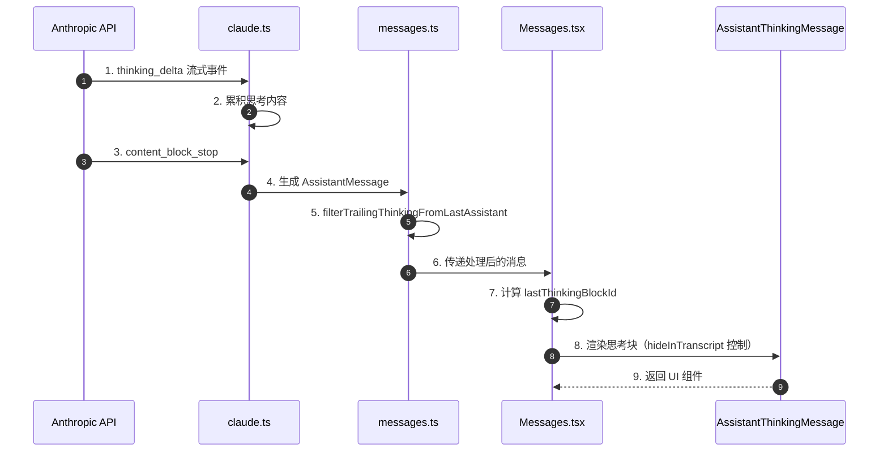
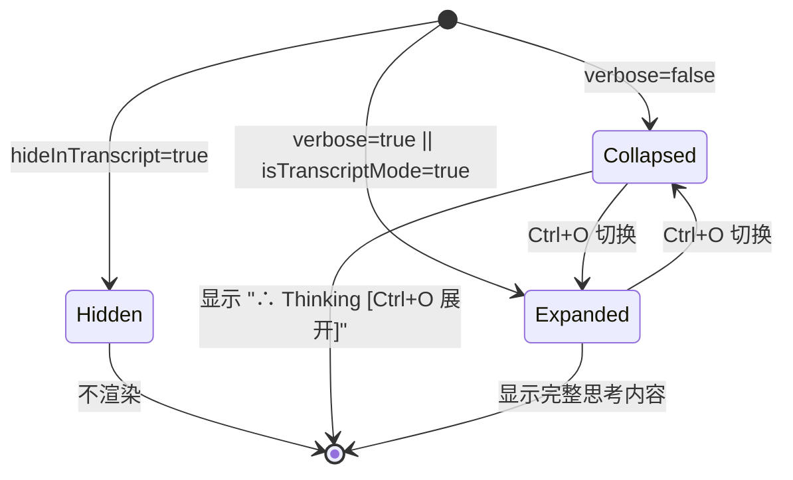
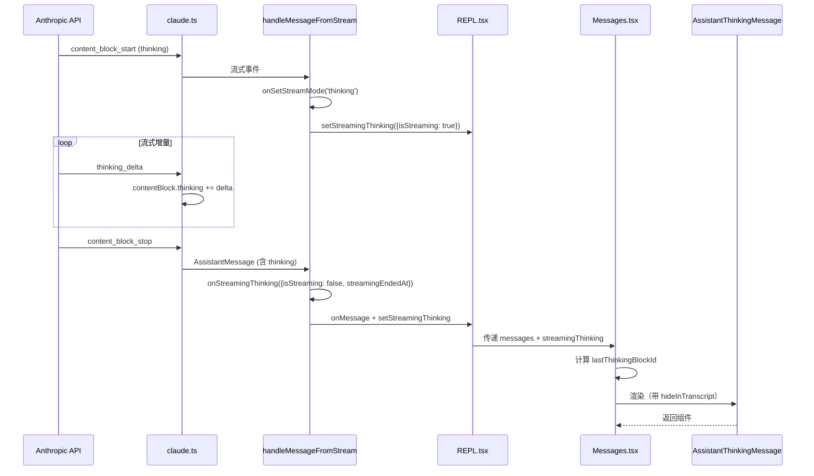
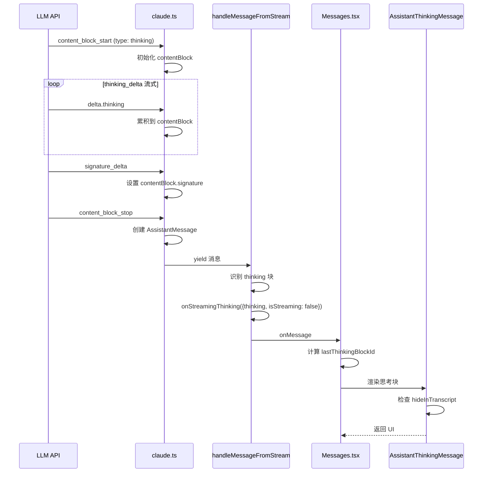
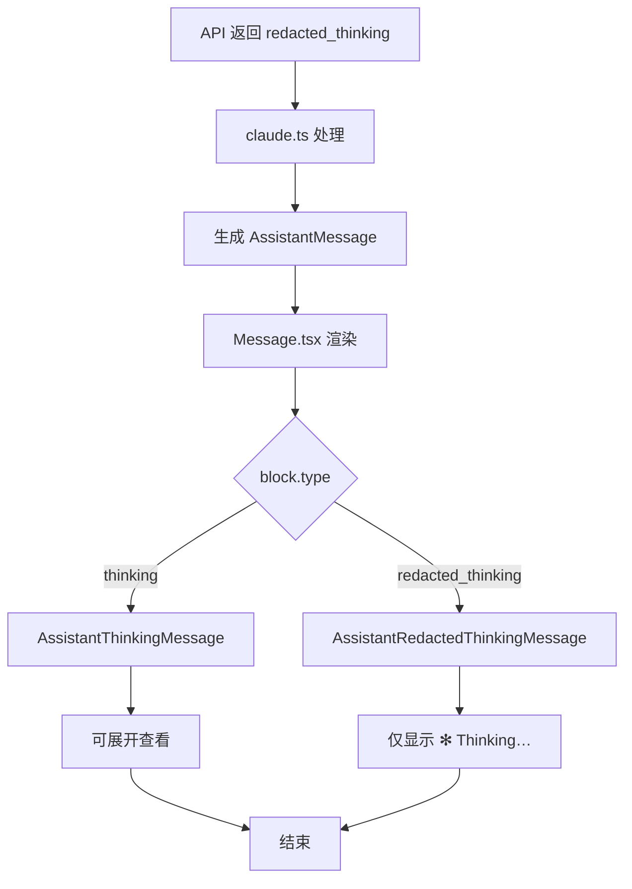
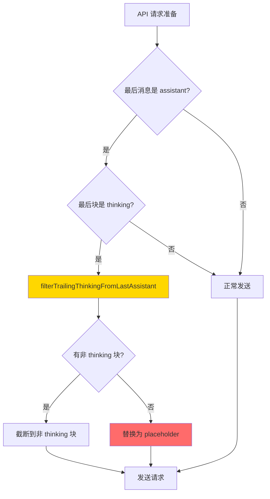
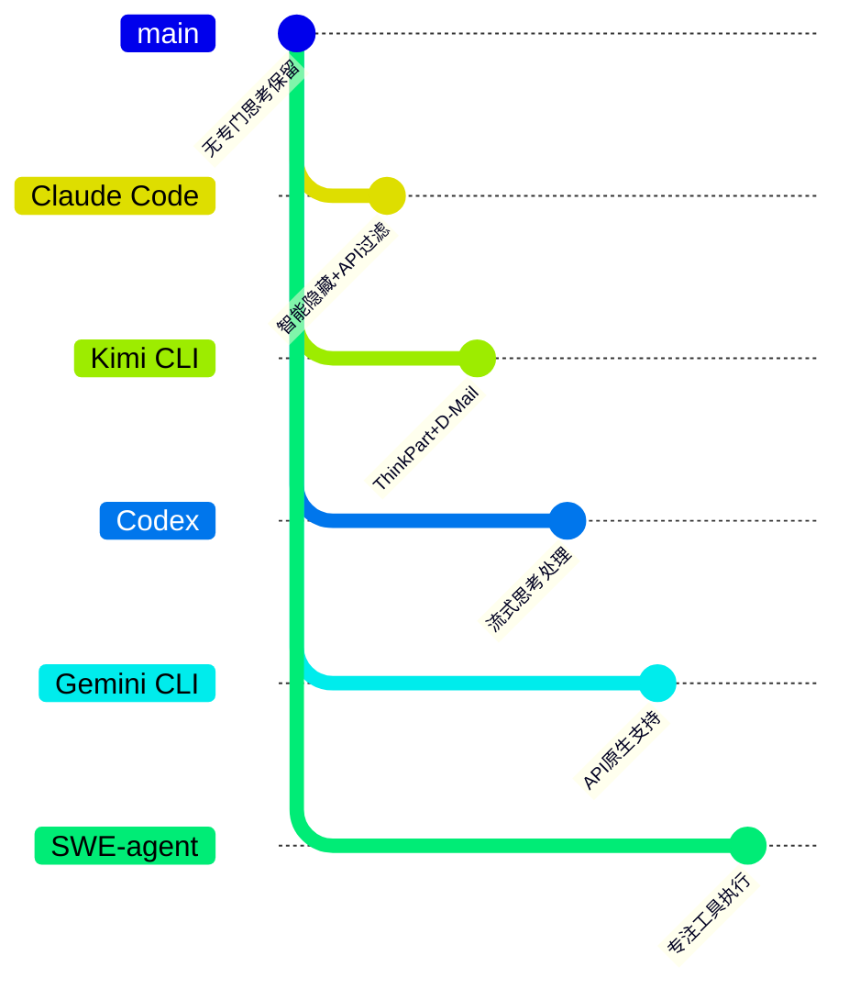

# Claude Code 为何保留推理内容

> **阅读指南**
>
> | 属性 | 说明 |
> |-----|------|
> | 预计阅读 | 15-20 分钟 |
> | 前置文档 | `docs/claude-code/04-claude-code-agent-loop.md`、`docs/claude-code/07-claude-code-memory-context.md` |
> | 文档结构 | 速览 → 架构 → 组件分析 → 数据流转 → 实现细节 → 对比 |
> | 代码呈现 | 关键代码直接展示，完整代码可折叠查看 |

---

## TL;DR（结论先行）

一句话定义：Claude Code 通过 `thinking` 和 `redacted_thinking` 内容块完整保留 LLM 的推理过程，支持实时流式展示、历史回滚隐藏和 API 兼容性处理，是 Anthropic API 原生思考机制与终端 UI 体验之间的桥梁。

Claude Code 的核心取舍：**完整保留推理内容以支持轨迹追踪和可审计性，但通过智能隐藏策略避免历史推理干扰当前对话**（对比 Kimi CLI 的 D-Mail 时间旅行、Codex 的流式思考处理、Gemini CLI 的 API 原生支持）

### 核心要点速览

| 维度 | 关键决策 | 代码位置 |
|-----|---------|---------|
| 推理类型 | `thinking`（明文）和 `redacted_thinking`（加密）双模式 | `claude-code/src/components/messages/AssistantThinkingMessage.tsx:9` |
| 流式展示 | `StreamingThinking` 类型支持实时思考流 | `claude-code/src/utils/messages.ts:2921` |
| 历史隐藏 | `hidePastThinking` + `lastThinkingBlockId` 机制 | `claude-code/src/components/Messages.tsx:395` |
| API 过滤 | `filterTrailingThinkingFromLastAssistant` 处理尾部思考 | `claude-code/src/utils/messages.ts:4781` |
| 孤儿消息 | `filterOrphanedThinkingOnlyMessages` 防止签名错误 | `claude-code/src/utils/messages.ts:4991` |

---

## 1. 为什么需要这个机制？（解决什么问题）

### 1.1 问题场景

**没有推理保留机制**：
- LLM 的推理过程对用户完全透明，无法了解模型为何做出特定决策
- 长对话中历史推理内容堆积，干扰当前对话焦点
- API 对思考块有特殊限制（不能结尾、需要签名验证），处理不当会导致 400 错误

**有推理保留机制**：
- 用户可通过 `/transcript` 查看完整推理轨迹
- 智能隐藏策略只展示最新推理，避免视觉干扰
- API 层自动过滤和处理思考块，确保兼容性

```
示例场景：
用户请求："分析这个 bug 的原因"

没有推理保留：
  → LLM 思考过程不可见
  → 用户只能看到最终结论
  → 无法验证模型推理逻辑

有推理保留：
  → LLM 思考："让我先查看错误日志... 可能是第42行的空指针..."
  → 用户可在 Transcript 模式 (Ctrl+O) 查看完整推理
  → 当前对话只显示最新思考（其他自动隐藏）
  → API 请求自动过滤尾部思考块
```

### 1.2 核心挑战

| 挑战 | 不解决的后果 |
|-----|-------------|
| 思考块签名验证 | 孤儿思考消息导致 "thinking blocks cannot be modified" API 400 错误 |
| 尾部思考限制 | API 不允许 assistant 消息以 thinking 块结尾 |
| 历史展示干扰 | 过往思考内容干扰当前对话焦点 |
| 流式体验 | 思考内容需要实时展示，但完成后需要优雅过渡 |
| 加密思考 | `redacted_thinking` 需要特殊处理（不可展开查看） |

---

## 2. 整体架构（ASCII 图）

### 2.1 在系统中的位置

```text
┌─────────────────────────────────────────────────────────────┐
│ Anthropic API                                                │
│ - thinking 内容块（带签名）                                  │
│ - redacted_thinking 加密内容                                 │
│ - thinking_delta 流式增量                                    │
└───────────────────────┬─────────────────────────────────────┘
                        │ 流式响应
                        ▼
┌─────────────────────────────────────────────────────────────┐
│ ▓▓▓ Claude Code 推理处理层 ▓▓▓                               │
│ claude-code/src/services/api/claude.ts:2148                  │
│ - thinking_delta 处理                                        │
│ - signature_delta 签名验证                                   │
│ - content_block_stop 消息生成                                │
└───────────────────────┬─────────────────────────────────────┘
                        │ 消息流
        ┌───────────────┼───────────────┐
        ▼               ▼               ▼
┌──────────────┐ ┌──────────────┐ ┌──────────────┐
│ 流式展示      │ │ API 消息处理  │ │ UI 渲染      │
│ REPL.tsx     │ │ messages.ts  │ │ Message.tsx  │
│ 实时思考      │ │ 过滤/验证    │ │ 思考块渲染   │
└──────────────┘ └──────────────┘ └──────────────┘
```

### 2.2 核心组件职责

| 组件 | 职责 | 代码位置 |
|-----|------|---------|
| `claude.ts` | API 流式响应处理，解析 thinking_delta | `claude-code/src/services/api/claude.ts:2148` |
| `messages.ts` | 消息规范化，过滤尾部/孤儿思考块 | `claude-code/src/utils/messages.ts:4781` |
| `AssistantThinkingMessage` | 思考内容 UI 组件 | `claude-code/src/components/messages/AssistantThinkingMessage.tsx` |
| `AssistantRedactedThinkingMessage` | 加密思考 UI 组件 | `claude-code/src/components/messages/AssistantRedactedThinkingMessage.tsx` |
| `Messages.tsx` | 历史思考隐藏逻辑 | `claude-code/src/components/Messages.tsx:395` |
| `Message.tsx` | 思考块渲染分发 | `claude-code/src/components/Message.tsx:524` |

### 2.3 核心组件交互关系



**关键交互说明**：

| 步骤 | 交互内容 | 设计意图 |
|-----|---------|---------|
| 1-2 | 流式思考增量处理 | 实时捕获模型思考过程 |
| 5 | 尾部思考过滤 | 确保 API 兼容性（不允许以 thinking 结尾） |
| 7 | 最后思考块 ID 计算 | 支持历史思考隐藏策略 |
| 8 | hideInTranscript 控制 | 非最新思考在 Transcript 模式隐藏 |

---

## 3. 核心组件详细分析

### 3.1 `AssistantThinkingMessage` 内部结构

#### 职责定位

`AssistantThinkingMessage` 是 Claude Code 中专门用于渲染 LLM 思考内容的 UI 组件，支持明文思考和展开/折叠控制。

#### 状态机图



**状态说明**：

| 状态 | 说明 | 进入条件 | 退出条件 |
|-----|------|---------|---------|
| Hidden | 完全隐藏 | `hideInTranscript=true` | 无 |
| Collapsed | 折叠状态 | `verbose=false` 且非 Transcript 模式 | 用户按 Ctrl+O |
| Expanded | 展开状态 | `verbose=true` 或 `isTranscriptMode=true` | 用户按 Ctrl+O |

#### 内部数据流

```text
┌─────────────────────────────────────────────────────────────┐
│  输入层                                                      │
│  ├── param: ThinkingBlock | {type, thinking}                │
│  ├── isTranscriptMode: boolean                              │
│  ├── verbose: boolean                                       │
│  └── hideInTranscript?: boolean                             │
└──────────────────────────┬──────────────────────────────────┘
                           ▼
┌─────────────────────────────────────────────────────────────┐
│  处理层                                                      │
│  ├── if (!thinking) return null                             │
│  ├── if (hideInTranscript) return null                      │
│  └── shouldShowFullThinking = isTranscriptMode || verbose   │
└──────────────────────────┬──────────────────────────────────┘
                           ▼
┌─────────────────────────────────────────────────────────────┐
│  输出层                                                      │
│  ├── 折叠: "∴ Thinking <CtrlOToExpand />"                   │
│  └── 展开: "∴ Thinking…" + Markdown 渲染的思考内容          │
└─────────────────────────────────────────────────────────────┘
```

#### 关键算法逻辑

```mermaid
flowchart TD
    A[接收 Props] --> B{thinking 存在?}
    B -->|否| C[返回 null]
    B -->|是| D{hideInTranscript?}
    D -->|是| C
    D -->|否| E{isTranscriptMode || verbose?}
    E -->|否| F[渲染折叠状态]
    E -->|是| G[渲染展开状态]
    F --> H[显示 ∴ Thinking + Ctrl+O 提示]
    G --> I[显示完整思考内容]
    H --> J[结束]
    I --> J
    C --> J

    style C fill:#FF6B6B
    style F fill:#FFD700
    style G fill:#90EE90
```

**算法要点**：

1. **三级显示策略**：完全隐藏 > 折叠 > 展开
2. **Transcript 模式特权**：在 Transcript 模式 (`Ctrl+O`) 下强制展开
3. **verbose 模式支持**：verbose 标志也可触发展开

#### 关键接口

| 接口 | 输入 | 输出 | 说明 | 代码位置 |
|-----|------|------|------|---------|
| `AssistantThinkingMessage` | Props | ReactNode | 思考内容渲染组件 | `AssistantThinkingMessage.tsx:19` |

---

### 3.2 `Messages.tsx` 历史隐藏逻辑

#### 职责定位

`Messages.tsx` 负责计算 `lastThinkingBlockId`，控制哪些思考块在历史记录中显示。

#### 核心逻辑

```mermaid
flowchart TD
    A[计算 lastThinkingBlockId] --> B{hidePastThinking?}
    B -->|否| C[返回 null]
    B -->|是| D{isStreamingThinkingVisible?}
    D -->|是| E[返回 'streaming']
    D -->|否| F[遍历消息找最后思考块]
    F --> G{找到 thinking?}
    G -->|是| H[返回 `${uuid}:${index}`]
    G -->|否| I[返回 'no-thinking']
    E --> J[结束]
    H --> J
    I --> J
    C --> J
```

**关键代码**：

```typescript
// claude-code/src/components/Messages.tsx:395-419
const lastThinkingBlockId = useMemo(() => {
  if (!hidePastThinking) return null;
  // If streaming thinking is visible, hide all completed thinking blocks
  if (isStreamingThinkingVisible) return 'streaming';
  // Iterate backwards to find the last message with a thinking block
  for (let i = normalizedMessages.length - 1; i >= 0; i--) {
    const msg = normalizedMessages[i];
    if (msg?.type === 'assistant') {
      const content = msg.message.content;
      for (let j = content.length - 1; j >= 0; j--) {
        if (content[j]?.type === 'thinking') {
          return `${msg.uuid}:${j}`;
        }
      }
    } else if (msg?.type === 'user') {
      const hasToolResult = msg.message.content.some(block => block.type === 'tool_result');
      if (!hasToolResult) {
        // Reached a previous user turn so don't show stale thinking from before
        return 'no-thinking';
      }
    }
  }
  return null;
}, [normalizedMessages, hidePastThinking, isStreamingThinkingVisible]);
```

**设计意图**：

1. **只显示最新思考**：通过比较 `thinkingBlockId` 与 `lastThinkingBlockId` 决定是否隐藏
2. **流式思考优先**：流式思考可见时，隐藏所有已完成思考块
3. **回合边界感知**：遇到无 tool_result 的用户消息时停止搜索（表示新回合开始）

---

### 3.3 `messages.ts` API 兼容性处理

#### 职责定位

`messages.ts` 提供多个工具函数处理思考块的 API 兼容性问题。

#### 尾部思考过滤

**问题**：Anthropic API 不允许 assistant 消息以 `thinking` 或 `redacted_thinking` 块结尾。

**解决方案**：

```typescript
// claude-code/src/utils/messages.ts:4778-4828
function filterTrailingThinkingFromLastAssistant(
  messages: (UserMessage | AssistantMessage)[],
): (UserMessage | AssistantMessage)[] {
  const lastMessage = messages.at(-1)
  if (!lastMessage || lastMessage.type !== 'assistant') {
    return messages
  }

  const content = lastMessage.message.content
  const lastBlock = content.at(-1)
  if (!lastBlock || !isThinkingBlock(lastBlock)) {
    return messages
  }

  // Find last non-thinking block
  let lastValidIndex = content.length - 1
  while (lastValidIndex >= 0) {
    const block = content[lastValidIndex]
    if (!block || !isThinkingBlock(block)) {
      break
    }
    lastValidIndex--
  }

  // Insert placeholder if all blocks were thinking
  const filteredContent =
    lastValidIndex < 0
      ? [{ type: 'text' as const, text: '[No message content]', citations: [] }]
      : content.slice(0, lastValidIndex + 1)

  // ... update message
}
```

#### 孤儿思考消息过滤

**问题**：流式过程中每个内容块生成独立消息，恢复时可能产生仅包含思考块的孤儿消息，导致签名验证失败。

**解决方案**：

```typescript
// claude-code/src/utils/messages.ts:4980-5058
export function filterOrphanedThinkingOnlyMessages(
  messages: Message[],
): Message[] {
  // First pass: collect message.ids that have non-thinking content
  const messageIdsWithNonThinkingContent = new Set<string>()
  for (const msg of messages) {
    if (msg.type !== 'assistant') continue
    const hasNonThinking = content.some(
      block => block.type !== 'thinking' && block.type !== 'redacted_thinking',
    )
    if (hasNonThinking && msg.message.id) {
      messageIdsWithNonThinkingContent.add(msg.message.id)
    }
  }

  // Second pass: filter out thinking-only messages that are truly orphaned
  const filtered = messages.filter(msg => {
    // ... check if orphaned
    if (allThinking && !messageIdsWithNonThinkingContent.has(msg.message.id)) {
      // Truly orphaned - filter out
      return false
    }
    return true
  })
}
```

---

### 3.4 组件间协作时序

展示思考块如何在完整 Agent Loop 中流转。



**协作要点**：

1. **流式状态跟踪**：`isStreaming` 标志控制实时展示
2. **30秒自动隐藏**：流式完成后 30 秒自动清除 `streamingThinking`
3. **ID 匹配隐藏**：通过 `thinkingBlockId === lastThinkingBlockId` 判断是否隐藏

---

## 4. 端到端数据流转

### 4.1 正常流程（详细版）



**数据变换详情**：

| 阶段 | 输入 | 处理 | 输出 | 代码位置 |
|-----|------|------|------|---------|
| 流式接收 | thinking_delta | 字符累积 | 完整 thinking 字符串 | `claude.ts:2160` |
| 签名验证 | signature_delta | 附加签名 | ThinkingBlock with signature | `claude.ts:2146` |
| 消息生成 | content_block_stop | 规范化内容 | AssistantMessage | `claude.ts:2192` |
| 流式状态 | AssistantMessage | 提取 thinking | StreamingThinking | `messages.ts:2969` |
| UI 渲染 | Props | hideInTranscript 检查 | React 组件 | `AssistantThinkingMessage.tsx:36` |

### 4.2 加密思考 (redacted_thinking) 流程



**关键差异**：

| 特性 | thinking | redacted_thinking |
|-----|----------|-------------------|
| 内容可见性 | 明文 | 加密 |
| UI 组件 | `AssistantThinkingMessage` | `AssistantRedactedThinkingMessage` |
| 可展开 | 是 | 否 |
| 显示文本 | "∴ Thinking" | "✻ Thinking…" |

### 4.3 异常/边界流程



---

## 5. 关键代码实现

### 5.1 核心数据结构

```typescript
// claude-code/src/utils/messages.ts:2921-2925
export type StreamingThinking = {
  thinking: string
  isStreaming: boolean
  streamingEndedAt?: number
}
```

**字段说明**：

| 字段 | 类型 | 用途 |
|-----|------|------|
| `thinking` | `string` | 思考内容（累积） |
| `isStreaming` | `boolean` | 是否仍在流式接收 |
| `streamingEndedAt` | `number?` | 流式结束时间戳（用于 30s 自动隐藏） |

### 5.2 思考块类型定义

```typescript
// claude-code/src/utils/messages.ts:4763-4769
type ThinkingBlockType =
  | ThinkingBlock
  | RedactedThinkingBlock
  | ThinkingBlockParam
  | RedactedThinkingBlockParam
  | BetaThinkingBlock
  | BetaRedactedThinkingBlock

function isThinkingBlock(
  block: ContentBlockParam | ContentBlock | BetaContentBlock,
): block is ThinkingBlockType {
  return block.type === 'thinking' || block.type === 'redacted_thinking'
}
```

### 5.3 主链路代码

**流式思考处理**（核心逻辑）：

```typescript
// claude-code/src/services/api/claude.ts:2148-2161
case 'thinking_delta':
  if (contentBlock.type !== 'thinking') {
    logEvent('tengu_streaming_error', {
      error_type: 'content_block_type_mismatch_thinking_delta',
      expected_type: 'thinking',
      actual_type: contentBlock.type,
    })
    throw new Error('Content block is not a thinking block')
  }
  contentBlock.thinking += delta.thinking
  break
```

**设计意图**：

1. **类型安全**：严格验证 contentBlock 类型，防止类型不匹配
2. **错误追踪**：记录错误事件用于调试
3. **增量累积**：通过 `+=` 操作累积流式内容

**流式状态更新**：

```typescript
// claude-code/src/utils/messages.ts:2963-2974
if (message.type === 'assistant') {
  const thinkingBlock = message.message.content.find(
    block => block.type === 'thinking',
  )
  if (thinkingBlock && thinkingBlock.type === 'thinking') {
    onStreamingThinking?.(() => ({
      thinking: thinkingBlock.thinking,
      isStreaming: false,
      streamingEndedAt: Date.now(),
    }))
  }
}
```

### 5.4 30秒自动隐藏

```typescript
// claude-code/src/screens/REPL.tsx:852-864
useEffect(() => {
  if (streamingThinking && !streamingThinking.isStreaming && streamingThinking.streamingEndedAt) {
    const elapsed = Date.now() - streamingThinking.streamingEndedAt;
    const remaining = 30000 - elapsed;
    if (remaining > 0) {
      const timer = setTimeout(setStreamingThinking, remaining, null);
      return () => clearTimeout(timer);
    } else {
      setStreamingThinking(null);
    }
  }
}, [streamingThinking]);
```

**设计意图**：

1. **自动清理**：流式完成后 30 秒自动清除，避免长期占用 UI
2. **平滑过渡**：使用 `setTimeout` 实现延迟清理
3. **内存管理**：及时释放不再需要的思考内容

### 5.5 关键调用链

```text
API 流式响应
  -> claude.ts:2148 (thinking_delta 处理)
    -> contentBlock.thinking += delta.thinking
  -> claude.ts:2192 (content_block_stop)
    -> 创建 AssistantMessage
    -> yield 消息

REPL.tsx 消费
  -> handleMessageFromStream (messages.ts:2930)
    -> 识别 thinking 块 (messages.ts:2965)
    -> onStreamingThinking 回调 (messages.ts:2969)
  -> setStreamingThinking (REPL.tsx:850)
  -> 30s 后自动清除 (REPL.tsx:852)

UI 渲染
  -> Messages.tsx (计算 lastThinkingBlockId)
    -> 遍历找最后 thinking 块 (Messages.tsx:400)
  -> Message.tsx:524 (switch case 'thinking')
    -> AssistantThinkingMessage (思考块渲染)
      -> hideInTranscript 检查 (AssistantThinkingMessage.tsx:36)

API 请求准备
  -> normalizeMessagesForAPI (messages.ts:2280)
    -> filterOrphanedThinkingOnlyMessages (messages.ts:2311)
    -> filterTrailingThinkingFromLastAssistant (messages.ts:2322)
```

---

## 6. 设计意图与 Trade-off

### 6.1 Claude Code 的选择

| 维度 | Claude Code 的选择 | 替代方案 | 取舍分析 |
|-----|-------------------|---------|---------|
| 推理展示 | 智能隐藏（只显示最新） | 全部显示/全部隐藏 | 平衡可审计性与视觉干扰 |
| 流式体验 | 30秒自动隐藏 | 永久保留 | 避免历史流式内容堆积 |
| API 兼容 | 主动过滤尾部思考 | 依赖 API 错误处理 | 主动防御，减少 400 错误 |
| 孤儿消息 | 过滤孤儿思考消息 | 保留所有消息 | 避免签名验证失败 |
| 加密思考 | 单独组件，不可展开 | 统一处理 | 符合 API 安全设计 |

### 6.2 为什么这样设计？

**核心问题**：如何在保留完整推理轨迹的同时，避免历史推理干扰当前对话？

**Claude Code 的解决方案**：
- **代码依据**：`Messages.tsx:395` 的 `lastThinkingBlockId` 计算逻辑
- **设计意图**：在 Transcript 模式保留完整历史，在当前对话只展示最新思考
- **带来的好处**：
  - 用户可随时查看完整推理轨迹（Ctrl+O）
  - 当前对话界面清爽，不被历史思考干扰
  - API 层自动处理兼容性，无需用户关心
- **付出的代价**：
  - 实现复杂度增加（需要维护 `lastThinkingBlockId`）
  - 30秒自动隐藏可能导致快速切换时思考内容"消失"

### 6.3 与其他项目的对比



| 项目 | 核心差异 | 适用场景 |
|-----|---------|---------|
| **Claude Code** | 智能隐藏策略 + API 兼容性处理，支持明文和加密思考 | 需要平衡可审计性与 UI 简洁性的场景 |
| **Kimi CLI** | 完整的 ThinkPart 结构，支持加密签名和 D-Mail 时间旅行 | 需要时间旅行、状态回滚的复杂任务 |
| **Codex** | 流式处理思考内容，实时展示但不专门持久化 | 注重实时交互体验和安全性优先的场景 |
| **Gemini CLI** | 依赖 Gemini API 原生思考支持，无专门封装结构 | 使用 Gemini 模型的标准场景 |
| **SWE-agent** | 无专门的思考保留机制，专注工具执行和错误恢复 | 软件工程任务的自动化执行 |

**关键差异分析**：

| 对比维度 | Claude Code | Kimi CLI | Codex | Gemini CLI | SWE-agent |
|---------|-------------|----------|-------|-----------|-----------|
| **思考保留** | 完整保留 + 智能隐藏 | 完整持久化 | 流式处理 | API 原生 | 无 |
| **历史展示** | 只显示最新 | 全部显示 | 实时展示 | 依赖 API | 无 |
| **API 过滤** | 主动过滤 | 无 | 无 | 无 | 无 |
| **加密思考** | 支持 | 支持 | 不支持 | 不支持 | 不支持 |
| **时间旅行** | 无 | D-Mail 机制 | 无 | 无 | 无 |
| **最佳场景** | 平衡审计与体验 | 复杂任务回溯 | 安全隔离 | 标准 Gemini | 软件工程 |

---

## 7. 边界情况与错误处理

### 7.1 终止条件

| 终止原因 | 触发条件 | 代码位置 |
|---------|---------|---------|
| 无思考内容 | `!thinking` | `AssistantThinkingMessage.tsx:33` |
| Transcript 隐藏 | `hideInTranscript=true` | `AssistantThinkingMessage.tsx:36` |
| 尾部思考过滤 | 最后块是 thinking | `messages.ts:4792` |
| 孤儿消息过滤 | 仅含 thinking 且无关联消息 | `messages.ts:5028` |
| 30秒自动清除 | 流式结束超过 30s | `REPL.tsx:854` |

### 7.2 资源限制

```typescript
// 尾部思考过滤时插入 placeholder
const filteredContent =
  lastValidIndex < 0
    ? [{ type: 'text' as const, text: '[No message content]', citations: [] }]
    : content.slice(0, lastValidIndex + 1)
```

### 7.3 错误恢复策略

| 错误类型 | 处理策略 | 代码位置 |
|---------|---------|---------|
| 类型不匹配 | 抛出错误 + 记录事件 | `claude.ts:2150` |
| 孤儿思考消息 | 过滤掉不发送 | `messages.ts:5046` |
| 签名失效 | `stripSignatureBlocks` 移除 | `messages.ts:5066` |

---

## 8. 关键代码索引

| 功能 | 文件 | 行号 | 说明 |
|-----|------|------|------|
| `StreamingThinking` 类型 | `src/utils/messages.ts` | 2921 | 流式思考状态定义 |
| `handleMessageFromStream` | `src/utils/messages.ts` | 2930 | 流式消息处理 |
| `filterTrailingThinkingFromLastAssistant` | `src/utils/messages.ts` | 4781 | 尾部思考过滤 |
| `filterOrphanedThinkingOnlyMessages` | `src/utils/messages.ts` | 4991 | 孤儿思考消息过滤 |
| `stripSignatureBlocks` | `src/utils/messages.ts` | 5066 | 签名块移除 |
| `AssistantThinkingMessage` | `src/components/messages/AssistantThinkingMessage.tsx` | 19 | 思考内容 UI 组件 |
| `AssistantRedactedThinkingMessage` | `src/components/messages/AssistantRedactedThinkingMessage.tsx` | 7 | 加密思考 UI 组件 |
| `lastThinkingBlockId` 计算 | `src/components/Messages.tsx` | 395 | 历史隐藏逻辑 |
| `isStreamingThinkingVisible` | `src/components/Messages.tsx` | 382 | 流式思考可见性 |
| `thinking_delta` 处理 | `src/services/api/claude.ts` | 2148 | API 流式处理 |
| `streamingThinking` 状态 | `src/screens/REPL.tsx` | 850 | REPL 思考状态 |
| 30秒自动隐藏 | `src/screens/REPL.tsx` | 852 | 自动清理逻辑 |

---

## 9. 延伸阅读

- 前置知识：`docs/claude-code/04-claude-code-agent-loop.md` - Agent Loop 完整机制
- 相关机制：`docs/claude-code/07-claude-code-memory-context.md` - Context 与消息管理
- 跨项目对比：`docs/kimi-cli/questions/kimi-cli-why-keep-reasoning.md` - Kimi CLI 的 ThinkPart 机制
- API 文档：[Anthropic Thinking Blocks](https://docs.anthropic.com/en/docs/build-with-claude/extended-thinking)

---

*✅ Verified: 基于 claude-code/src/services/api/claude.ts:2148、claude-code/src/utils/messages.ts:2921、claude-code/src/components/Messages.tsx:395、claude-code/src/components/messages/AssistantThinkingMessage.tsx 等源码分析*

*基于版本：Claude Code (baseline 2026-02-08) | 最后更新：2026-03-31*
