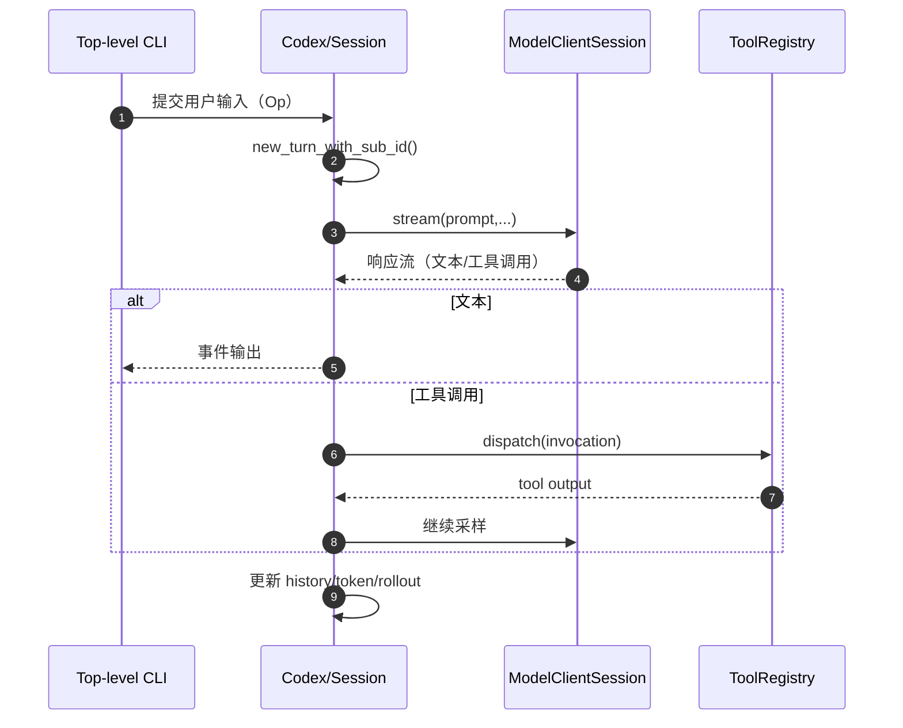
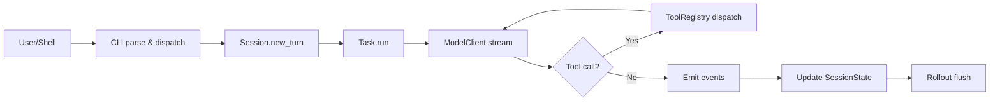

# Codex 概述

## TL;DR（结论先行）

一句话定义：Codex 是基于 Rust 的本地代码 Agent CLI，采用「**顶层 CLI 分发 + TUI 交互运行时 + Core 会话执行内核**」的分层架构。

核心取舍：
- 入口与交互解耦（`cli` vs `tui`）
- 会话运行时以一致性优先（单活跃 turn）
- 工具调用采用统一注册与门控执行

---

## 1. 为什么需要这个架构？

### 1.1 问题场景

```text
问题：同一个 Agent 既要支持交互式开发，又要支持自动化执行，还要保证安全与可恢复。

如果单层混合：
  参数解析、UI、任务执行、工具调用耦合在一起
  -> 难扩展，难定位故障，易引入状态污染

Codex 的分层做法：
  CLI 负责命令分发
  TUI 负责交互渲染
  Core 负责 Session/Turn/Tool/Model 主循环
```

### 1.2 核心挑战

| 挑战 | 不解决的后果 |
|-----|-------------|
| 安全边界 | 高风险命令缺少审批与门控 |
| 状态一致性 | 多轮对话和工具输出相互污染 |
| 可恢复性 | 崩溃后无法恢复上下文 |
| 扩展性 | 新子命令/新工具集成成本高 |

---

## 2. 整体架构

### 2.1 分层架构图

```text
┌─────────────────────────────────────────────────────────────┐
│ CLI Layer（codex-rs/cli）                                   │
│ main.rs                                                      │
│ - main()                                                     │
│ - MultitoolCli / Subcommand                                 │
│ - cli_main()                                                 │
└───────────────────────┬─────────────────────────────────────┘
                        │ 分发
                        ▼
┌─────────────────────────────────────────────────────────────┐
│ TUI Layer（codex-rs/tui）                                   │
│ - TuiCli 参数结构                                            │
│ - codex_tui::run_main()                                      │
│ - 交互渲染与输入事件                                          │
└───────────────────────┬─────────────────────────────────────┘
                        │ 事件/操作
                        ▼
┌─────────────────────────────────────────────────────────────┐
│ ▓▓▓ Core Agent Layer（codex-rs/core）▓▓▓                   │
│ codex.rs: Codex / Session / TurnContext                     │
│ tasks/mod.rs: spawn_task / abort_all_tasks                  │
│ tools/registry.rs: ToolRegistry::dispatch                   │
│ client.rs: ModelClientSession::stream                       │
└───────────────────────┬─────────────────────────────────────┘
                        │
        ┌───────────────┼───────────────┐
        ▼               ▼               ▼
┌──────────────┐ ┌──────────────┐ ┌──────────────┐
│ SessionState │ │ ToolRegistry │ │ ModelClient  │
│ history/token│ │ tool handler │ │ stream/fallback |
└──────────────┘ └──────────────┘ └──────────────┘
```

### 2.2 核心组件职责

| 组件 | 职责 | 代码位置 |
|-----|------|---------|
| `MultitoolCli` | 根命令参数解析与子命令分发 | `cli/src/main.rs:67` |
| `Codex` | 提交队列与事件队列封装 | `core/src/codex.rs:274` |
| `Session` | 会话生命周期与任务管理 | `core/src/codex.rs:525` |
| `TurnContext` | 单 turn 完整上下文 | `core/src/codex.rs:543` |
| `ToolRegistry` | 工具匹配、门控与执行 | `core/src/tools/registry.rs:58` |
| `ModelClient` | 会话级模型客户端 | `core/src/client.rs:175` |

### 2.3 组件交互时序



---

## 3. 核心机制概览

### 3.1 Agent 主循环（宏观）

```text
spawn Codex
  -> submission_loop
    -> 创建 TurnContext
    -> 运行 task（regular/review/...）
    -> 模型采样 + 工具调用 + 状态更新
    -> flush rollout + TurnComplete
```

代码依据：
- `core/src/codex.rs:300`（`Codex::spawn`）
- `core/src/codex.rs:1978`（`new_turn_with_sub_id`）
- `core/src/tasks/mod.rs:116`（`spawn_task`）

### 3.2 工具系统（门控执行）

```text
ToolRegistry::dispatch
  -> handler 查找
  -> is_mutating() 判断
  -> mutating 时等待 tool_call_gate
  -> handler.handle()
```

代码依据：`core/src/tools/registry.rs:79-223`。

### 3.3 会话状态与持久化

```rust
// core/src/state/session.rs（摘要）
pub(crate) struct SessionState {
    pub(crate) session_configuration: SessionConfiguration,
    pub(crate) history: ContextManager,
    pub(crate) latest_rate_limits: Option<RateLimitSnapshot>,
    pub(crate) server_reasoning_included: bool,
    pub(crate) dependency_env: HashMap<String, String>,
    pub(crate) mcp_dependency_prompted: HashSet<String>,
    previous_model: Option<String>,
    pub(crate) startup_regular_task: Option<RegularTask>,
    pub(crate) active_mcp_tool_selection: Option<Vec<String>>,
    pub(crate) active_connector_selection: HashSet<String>,
}
```

持久化组件：`RolloutRecorder`（JSONL 事件流）。
代码依据：`core/src/rollout/recorder.rs:70`。

---

## 4. 端到端数据流

### 4.1 数据流转图



### 4.2 关键数据结构

```rust
// protocol/src/protocol.rs
pub struct Event {
    pub id: String,
    pub msg: EventMsg,
}

pub enum EventMsg {
    ExecApprovalRequest(...),
    ItemStarted(...),
    ItemCompleted(...),
    // ...
}
```

代码依据：`protocol/src/protocol.rs:928`、`protocol/src/protocol.rs:941`。

---

## 5. 设计意图与 Trade-off

| 维度 | Codex 的选择 | 替代方案 | 取舍分析 |
|-----|-------------|---------|---------|
| 入口分层 | `cli` 分发 + `tui` 交互 | 单体入口 | 边界清晰，但模块更多 |
| 运行时并发 | 单活跃 turn | 多 turn 并发 | 一致性更好，但并行度有限 |
| 工具执行 | 统一 registry + mutating gate | 工具各自执行 | 审批与控制集中，但链路更长 |
| 持久化 | rollout 事件流 | 仅内存快照 | 恢复和审计更强，但有 IO 成本 |

---

## 6. 关键代码索引

| 组件 | 文件路径 | 行号 | 说明 |
|------|----------|------|------|
| CLI 入口 | `codex/codex-rs/cli/src/main.rs` | 545 | `main()` |
| CLI 分发 | `codex/codex-rs/cli/src/main.rs` | 555 | `cli_main()` |
| 根命令结构 | `codex/codex-rs/cli/src/main.rs` | 67 | `MultitoolCli` |
| Codex 主结构 | `codex/codex-rs/core/src/codex.rs` | 274 | `Codex` |
| Session | `codex/codex-rs/core/src/codex.rs` | 525 | 会话结构 |
| TurnContext | `codex/codex-rs/core/src/codex.rs` | 543 | 回合上下文 |
| 新建 turn | `codex/codex-rs/core/src/codex.rs` | 1978 | `new_turn_with_sub_id` |
| 任务调度 | `codex/codex-rs/core/src/tasks/mod.rs` | 116 | `spawn_task` |
| 工具注册表 | `codex/codex-rs/core/src/tools/registry.rs` | 58 | `ToolRegistry` |
| 模型流式调用 | `codex/codex-rs/core/src/client.rs` | 946 | `stream()` |
| SessionState | `codex/codex-rs/core/src/state/session.rs` | 17 | 状态结构 |
| RolloutRecorder | `codex/codex-rs/core/src/rollout/recorder.rs` | 70 | 持久化 |

### 子命令实现

| 命令 | 文件路径 |
|------|----------|
| exec/review | `codex/codex-rs/exec/src/lib.rs` |
| mcp | `codex/codex-rs/cli/src/mcp_cmd.rs` |

### 工具实现（示例）

| 工具类型 | 文件路径 |
|----------|----------|
| Shell | `codex/codex-rs/core/src/tools/handlers/shell.rs` |
| ReadFile | `codex/codex-rs/core/src/tools/handlers/read_file.rs` |
| Search(BM25) | `codex/codex-rs/core/src/tools/handlers/search_tool_bm25.rs` |

---

## 7. 延伸阅读

- CLI 入口：`02-codex-cli-entry.md`
- Session Runtime：`03-codex-session-runtime.md`
- Agent Loop：`04-codex-agent-loop.md`

---

*✅ Verified: 基于 codex/codex-rs/core/src/ 源码分析*  
*基于版本：2026-02-08 | 最后更新：2026-02-24*
