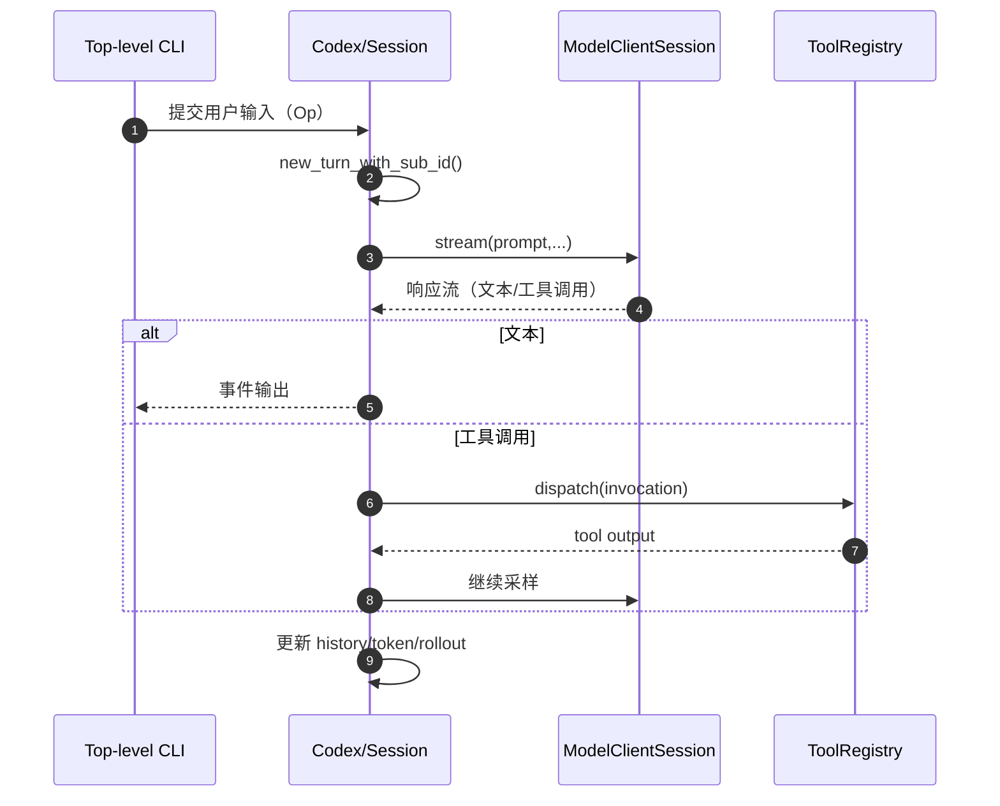
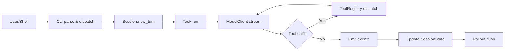
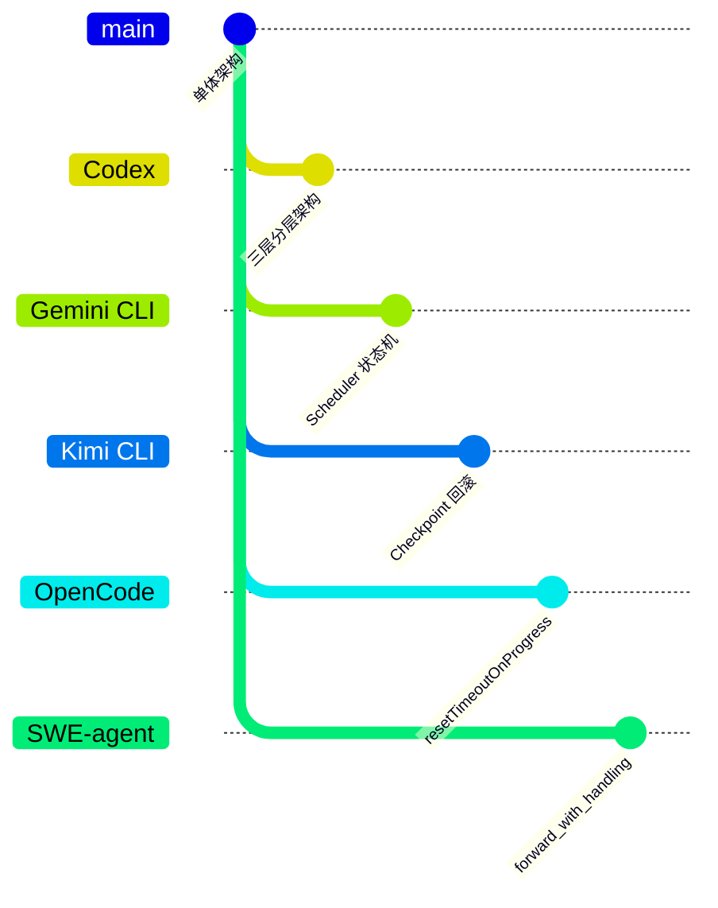

# Codex 概述

## TL;DR（结论先行）

一句话定义：Codex 是基于 Rust 的本地代码 Agent CLI，采用「**顶层 CLI 分发 + TUI 交互运行时 + Core 会话执行内核**」的分层架构。

核心取舍：
- **入口与交互解耦**（`cli` vs `tui`，对比 Gemini CLI 的单体入口、Kimi CLI 的 CLI 与 Agent 紧耦合）
- **会话运行时以一致性优先**（单活跃 turn，对比 Kimi CLI 的多 turn 并发、SWE-agent 的 autosubmit 连续执行）
- **工具调用采用统一注册与门控执行**（对比 OpenCode 的分散式工具处理）

---

## 1. 为什么需要这个架构？

### 1.1 问题场景

```text
问题：同一个 Agent 既要支持交互式开发，又要支持自动化执行，还要保证安全与可恢复。

如果单层混合：
  参数解析、UI、任务执行、工具调用耦合在一起
  -> 难扩展，难定位故障，易引入状态污染

Codex 的分层做法：
  CLI 负责命令分发
  TUI 负责交互渲染
  Core 负责 Session/Turn/Tool/Model 主循环
```

### 1.2 核心挑战

| 挑战 | 不解决的后果 |
|-----|-------------|
| 安全边界 | 高风险命令缺少审批与门控 |
| 状态一致性 | 多轮对话和工具输出相互污染 |
| 可恢复性 | 崩溃后无法恢复上下文 |
| 扩展性 | 新子命令/新工具集成成本高 |

---

## 2. 整体架构

### 2.1 分层架构图

```text
┌─────────────────────────────────────────────────────────────┐
│ CLI Layer（codex-rs/cli）                                   │
│ codex/codex-rs/cli/src/main.rs                              │
│ - main()                                                    │
│ - MultitoolCli / Subcommand                                 │
│ - cli_main()                                                │
└───────────────────────┬─────────────────────────────────────┘
                        │ 分发
                        ▼
┌─────────────────────────────────────────────────────────────┐
│ TUI Layer（codex-rs/tui）                                   │
│ - TuiCli 参数结构                                           │
│ - codex_tui::run_main()                                     │
│ - 交互渲染与输入事件                                        │
└───────────────────────┬─────────────────────────────────────┘
                        │ 事件/操作
                        ▼
┌─────────────────────────────────────────────────────────────┐
│ ▓▓▓ Core Agent Layer（codex-rs/core）▓▓▓                   │
│ codex/codex-rs/core/src/codex.rs: Codex / Session / TurnContext │
│ codex/codex-rs/core/src/tasks/mod.rs: spawn_task / abort_all_tasks │
│ codex/codex-rs/core/src/tools/registry.rs: ToolRegistry::dispatch │
│ codex/codex-rs/core/src/client.rs: ModelClientSession::stream │
└───────────────────────┬─────────────────────────────────────┘
                        │
        ┌───────────────┼───────────────┐
        ▼               ▼               ▼
┌──────────────┐ ┌──────────────┐ ┌──────────────┐
│ SessionState │ │ ToolRegistry │ │ ModelClient  │
│ history/token│ │ tool handler │ │ stream/fallback |
└──────────────┘ └──────────────┘ └──────────────┘
```

### 2.2 核心组件职责

| 组件 | 职责 | 代码位置 |
|-----|------|---------|
| `MultitoolCli` | 根命令参数解析与子命令分发 | `codex/codex-rs/cli/src/main.rs:67` |
| `Codex` | 提交队列与事件队列封装 | `codex/codex-rs/core/src/codex.rs:274` |
| `Session` | 会话生命周期与任务管理 | `codex/codex-rs/core/src/codex.rs:525` |
| `TurnContext` | 单 turn 完整上下文 | `codex/codex-rs/core/src/codex.rs:543` |
| `ToolRegistry` | 工具匹配、门控与执行 | `codex/codex-rs/core/src/tools/registry.rs:58` |
| `ModelClient` | 会话级模型客户端 | `codex/codex-rs/core/src/client.rs:175` |

### 2.3 组件交互时序



**关键交互说明**：

| 步骤 | 交互内容 | 设计意图 |
|-----|---------|---------|
| 1 | CLI 向 Core 提交用户操作 | 解耦命令解析与执行逻辑，支持多种触发源（交互式/自动化） |
| 2 | Core 创建 TurnContext | 隔离单次对话周期，确保状态不跨 turn 污染 |
| 3 | 调用模型流式接口 | 支持增量输出，提升用户体验 |
| 4-6 | 文本/工具调用分支处理 | 统一事件流输出，工具结果自动回注模型 |
| 7 | 更新会话状态与持久化 | 支持崩溃恢复和会话回放 |

---

## 3. 核心机制概览

### 3.1 Agent 主循环（宏观）

```text
spawn Codex
  -> submission_loop
    -> 创建 TurnContext
    -> 运行 task（regular/review/...）
    -> 模型采样 + 工具调用 + 状态更新
    -> flush rollout + TurnComplete
```

代码依据：
- `codex/codex-rs/core/src/codex.rs:300`（`Codex::spawn`）
- `codex/codex-rs/core/src/codex.rs:1978`（`new_turn_with_sub_id`）
- `codex/codex-rs/core/src/tasks/mod.rs:116`（`spawn_task`）

### 3.2 工具系统（门控执行）

```text
ToolRegistry::dispatch
  -> handler 查找
  -> is_mutating() 判断
  -> mutating 时等待 tool_call_gate
  -> handler.handle()
```

代码依据：`codex/codex-rs/core/src/tools/registry.rs:79-223`。

### 3.3 会话状态与持久化

```rust
// codex/codex-rs/core/src/state/session.rs（摘要）
pub(crate) struct SessionState {
    pub(crate) session_configuration: SessionConfiguration,
    pub(crate) history: ContextManager,
    pub(crate) latest_rate_limits: Option<RateLimitSnapshot>,
    pub(crate) server_reasoning_included: bool,
    pub(crate) dependency_env: HashMap<String, String>,
    pub(crate) mcp_dependency_prompted: HashSet<String>,
    previous_model: Option<String>,
    pub(crate) startup_regular_task: Option<RegularTask>,
    pub(crate) active_mcp_tool_selection: Option<Vec<String>>,
    pub(crate) active_connector_selection: HashSet<String>,
}
```

持久化组件：`RolloutRecorder`（JSONL 事件流）。
代码依据：`codex/codex-rs/core/src/rollout/recorder.rs:70`。

---

## 4. 端到端数据流

### 4.1 数据流转图



### 4.2 关键数据结构

```rust
// codex/codex-rs/protocol/src/protocol.rs
pub struct Event {
    pub id: String,
    pub msg: EventMsg,
}

pub enum EventMsg {
    ExecApprovalRequest(...),
    ItemStarted(...),
    ItemCompleted(...),
    // ...
}
```

代码依据：`codex/codex-rs/protocol/src/protocol.rs:928`、`codex/codex-rs/protocol/src/protocol.rs:941`。

---

## 5. 关键代码实现

本节详细分析见各专题文档，此处提供核心入口索引。

### 5.1 核心数据结构

**Event 结构**（协议层）：`codex/codex-rs/protocol/src/protocol.rs:928`

**SessionState 结构**（状态管理）：`codex/codex-rs/core/src/state/session.rs:17`

### 5.2 主链路代码

**Agent 主循环入口**：`codex/codex-rs/core/src/codex.rs:300`

**工具分发执行**：`codex/codex-rs/core/src/tools/registry.rs:79`

### 5.3 关键调用链

```text
main() @ cli/src/main.rs:545
  -> cli_main()
    -> codex_tui::run_main()
      -> Codex::spawn() @ core/src/codex.rs:300
        -> submission_loop
          -> new_turn_with_sub_id() @ core/src/codex.rs:1978
            -> spawn_task() @ core/src/tasks/mod.rs:116
              -> ModelClientSession::stream() @ core/src/client.rs:946
                -> ToolRegistry::dispatch() @ core/src/tools/registry.rs:58
```

---

## 6. 设计意图与 Trade-off

### 6.1 Codex 的架构选择

| 维度 | Codex 的选择 | 替代方案 | 取舍分析 |
|-----|-------------|---------|---------|
| 入口分层 | `cli` 分发 + `tui` 交互 | Gemini CLI 的单体入口、Kimi CLI 的 CLI 与 Agent 紧耦合 | 边界清晰，支持自动化与交互式两种模式，但模块更多，编译依赖更复杂 |
| 运行时并发 | 单活跃 turn | Kimi CLI 的多 turn 并发、SWE-agent 的 autosubmit 连续执行 | 状态一致性更好，避免竞态条件，但并行度有限，无法同时处理多个独立任务 |
| 工具执行 | 统一 registry + mutating gate | OpenCode 的分散式工具处理、SWE-agent 的 forward 拦截 | 审批与控制集中，安全策略统一，但调用链路更长，调试复杂度增加 |
| 持久化 | rollout 事件流 | Kimi CLI 的 Checkpoint 文件、仅内存快照 | 恢复和审计能力更强，支持完整回放，但有 IO 成本，文件体积随会话增长 |

### 6.2 为什么这样设计？

**核心问题**：如何在保证安全与可恢复的前提下，支持交互式和自动化两种使用模式？

**Codex 的解决方案**：
- **代码依据**：`codex/codex-rs/cli/src/main.rs:545`、`codex/codex-rs/core/src/codex.rs:274`
- **设计意图**：通过 CLI/TUI/Core 三层分离，让同一内核支持多种交互模式
- **带来的好处**：
  - 自动化场景（`codex exec`）无需加载 TUI，启动更快
  - 交互场景（`codex`）通过 TUI 提供富文本渲染和实时反馈
  - Core 层可独立测试和复用
- **付出的代价**：
  - 跨 crate 调用增加编译复杂度
  - 事件协议需要严格版本兼容

### 6.3 与其他项目的对比



| 项目 | 核心差异 | 适用场景 |
|-----|---------|---------|
| Codex | 三层分层（CLI/TUI/Core），单活跃 turn，统一工具注册 | 需要同时支持交互式和自动化执行，重视安全门控 |
| Gemini CLI | Scheduler 状态机驱动，递归 continuation | 复杂状态管理，需要精细控制执行流程 |
| Kimi CLI | Checkpoint 文件回滚，多 turn 并发 | 需要对话历史回滚，探索性编程场景 |
| OpenCode | resetTimeoutOnProgress，流式处理优化 | 长运行任务，需要防止超时中断 |
| SWE-agent | forward_with_handling 拦截，autosubmit | 自动化软件工程任务，批量处理 issue |

---

## 7. 边界情况与错误处理

### 7.1 终止条件

| 终止原因 | 触发条件 | 代码位置 |
|---------|---------|---------|
| 单 turn 超时 | 通过 `CancellationToken` 取消执行 | `codex/codex-rs/core/src/codex.rs:300` |
| 多 turn 并发冲突 | 单活跃 turn 设计天然避免 | `codex/codex-rs/core/src/codex.rs:525` |
| 模型调用失败 | 自动 fallback 到备用模型 | `codex/codex-rs/core/src/client.rs:946` |
| 工具执行异常 | 通过 `ToolResult` 封装错误信息 | `codex/codex-rs/core/src/tools/registry.rs:79` |

### 7.2 超时/资源限制

```text
┌─────────────────────────────────────────────────────────────┐
│ 资源限制机制                                                │
├─────────────────────────────────────────────────────────────┤
│ 1. CancellationToken                                        │
│    - 用于取消长时间运行的任务                               │
│    - 代码位置: codex/codex-rs/core/src/codex.rs:300         │
│                                                             │
│ 2. 单活跃 turn 限制                                         │
│    - 防止并发执行导致状态混乱                               │
│    - 代码位置: codex/codex-rs/core/src/codex.rs:525         │
└─────────────────────────────────────────────────────────────┘
```

### 7.3 错误恢复策略

| 错误类型 | 处理策略 | 代码位置 |
|---------|---------|---------|
| 工具执行异常 | 通过 `ToolResult` 封装错误信息 | `codex/codex-rs/core/src/tools/registry.rs:79` |
| 模型调用失败 | 自动 fallback 到备用模型 | `codex/codex-rs/core/src/client.rs:946` |
| 会话状态损坏 | 从 RolloutRecorder 事件流恢复 | `codex/codex-rs/core/src/rollout/recorder.rs:70` |

### 7.4 状态一致性保障

```text
┌─────────────────────────────────────────────────────────────┐
│ 状态一致性保障机制                                          │
├─────────────────────────────────────────────────────────────┤
│ 1. TurnContext 隔离                                         │
│    - 每个 turn 拥有独立的上下文和历史                       │
│    - turn 之间通过 SessionState 共享配置                    │
│    - 代码位置: codex/codex-rs/core/src/codex.rs:543         │
│                                                             │
│ 2. 事件流持久化                                             │
│    - RolloutRecorder 记录所有事件到 JSONL                   │
│    - 支持崩溃后从事件流恢复会话状态                         │
│    - 代码位置: codex/codex-rs/core/src/rollout/recorder.rs:70│
│                                                             │
│ 3. 工具门控                                                 │
│    - mutating 操作需等待用户审批                            │
│    - 防止意外修改导致状态不一致                             │
│    - 代码位置: codex/codex-rs/core/src/tools/registry.rs:79 │
└─────────────────────────────────────────────────────────────┘
```

---

## 8. 关键代码索引

### 8.1 核心文件

| 组件 | 文件路径 | 行号 | 说明 |
|------|----------|------|------|
| CLI 入口 | `codex/codex-rs/cli/src/main.rs` | 545 | `main()` |
| CLI 分发 | `codex/codex-rs/cli/src/main.rs` | 555 | `cli_main()` |
| 根命令结构 | `codex/codex-rs/cli/src/main.rs` | 67 | `MultitoolCli` |
| Codex 主结构 | `codex/codex-rs/core/src/codex.rs` | 274 | `Codex` |
| Session | `codex/codex-rs/core/src/codex.rs` | 525 | 会话结构 |
| TurnContext | `codex/codex-rs/core/src/codex.rs` | 543 | 回合上下文 |
| 新建 turn | `codex/codex-rs/core/src/codex.rs` | 1978 | `new_turn_with_sub_id` |
| 任务调度 | `codex/codex-rs/core/src/tasks/mod.rs` | 116 | `spawn_task` |
| 工具注册表 | `codex/codex-rs/core/src/tools/registry.rs` | 58 | `ToolRegistry` |
| 模型流式调用 | `codex/codex-rs/core/src/client.rs` | 946 | `stream()` |
| SessionState | `codex/codex-rs/core/src/state/session.rs` | 17 | 状态结构 |
| RolloutRecorder | `codex/codex-rs/core/src/rollout/recorder.rs` | 70 | 持久化 |

### 8.2 子命令实现

| 命令 | 文件路径 | 说明 |
|------|----------|------|
| exec/review | `codex/codex-rs/exec/src/lib.rs` | 执行与审查命令 |
| mcp | `codex/codex-rs/cli/src/mcp_cmd.rs` | MCP 子命令 |

### 8.3 工具实现（可选）

| 工具 | 文件路径 | 说明 |
|------|----------|------|
| Shell | `codex/codex-rs/core/src/tools/handlers/shell.rs` | Shell 命令执行 |
| ReadFile | `codex/codex-rs/core/src/tools/handlers/read_file.rs` | 文件读取 |
| Search(BM25) | `codex/codex-rs/core/src/tools/handlers/search_tool_bm25.rs` | BM25 搜索 |

---

## 9. 延伸阅读

- CLI 入口：`02-codex-cli-entry.md`
- Session Runtime：`03-codex-session-runtime.md`
- Agent Loop：`04-codex-agent-loop.md`
- MCP Integration：`06-codex-mcp-integration.md`
- Memory Context：`07-codex-memory-context.md`

---

*✅ Verified: 基于 codex/codex-rs/core/src/ 源码分析*
*基于版本：2026-02-08 | 最后更新：2026-02-25*
