# CLI Entry（Codex）

## TL;DR（结论先行）

一句话定义：Codex CLI Entry 是 `codex` 进程的总入口与分发层，采用「**顶层多工具 CLI + 交互式 TUI 运行时分离**」设计。

Codex 的核心取舍：**显式子命令区分交互与非交互模式**（对比 Gemini CLI 的自动检测、Kimi CLI 的单一入口）

### 核心要点速览

| 维度 | 关键决策 | 代码位置 |
|-----|---------|---------|
| 入口组织 | 顶层 `cli` crate 统一分发，分离 `tui`/`exec` 运行时 | `cli/src/main.rs:545` |
| 模式区分 | 子命令显式区分（无子命令=TUI，exec/review=headless） | `cli/src/main.rs:567-827` |
| 配置体系 | 四层配置堆栈（system/user/project/session） | `core/src/config_loader/mod.rs:91` |
| 安全控制 | Unix 日志文件权限 `0o600`，敏感信息保护 | `tui/src/lib.rs:336-340` |

---

## 1. 为什么需要这个机制？

### 1.1 问题场景

```text
场景：同一个 codex 命令既要支持交互式开发，也要支持 CI 非交互调用

如果没有显式分发：
  codex 在 CI 中可能意外进入 TUI -> 卡住等待输入

Codex 的做法：
  顶层 main 只做参数解析与子命令分发
  - 无子命令 -> 进入 TUI
  - exec/review -> 进入 headless 执行
```

### 1.2 核心挑战

| 挑战 | 不解决的后果 |
|-----|-------------|
| 模式区分 | 交互模式与自动化模式互相干扰 |
| 配置合并 | 不同来源配置冲突导致行为不确定 |
| 安全日志 | 敏感信息可能被同机其他用户读取 |
| 可扩展性 | 新增子命令会破坏已有入口结构 |

---

## 2. 整体架构

### 2.1 在系统中的位置

```text
┌─────────────────────────────────────────────────────────────┐
│ 操作系统 / Shell                                             │
│ 用户输入: codex [OPTIONS] [PROMPT] / codex <SUBCOMMAND>      │
└───────────────────────┬─────────────────────────────────────┘
                        │ 启动进程
                        ▼
┌─────────────────────────────────────────────────────────────┐
│ ▓▓▓ Top-level CLI（codex-rs/cli）▓▓▓                        │
│ cli/src/main.rs                                              │
│ - main()                                                     │
│ - MultitoolCli::parse()                                      │
│ - cli_main() 分发子命令                                      │
└───────────────────────┬─────────────────────────────────────┘
                        │
        ┌───────────────┼────────────────┬──────────────────┐
        ▼               ▼                ▼                  ▼
┌──────────────┐ ┌──────────────┐ ┌──────────────┐ ┌──────────────┐
│ Interactive  │ │ Exec/Review  │ │ MCP/MCPServer│ │ 其他工具命令  │
│ codex_tui    │ │ codex_exec   │ │ mcp handlers │ │ login/sandbox │
└──────────────┘ └──────────────┘ └──────────────┘ └──────────────┘
```

### 2.2 核心组件职责

| 组件 | 职责 | 代码位置 |
|-----|------|---------|
| `main()` | `codex` 二进制入口 | `cli/src/main.rs:545` ✅ |
| `MultitoolCli` | 顶层参数与子命令定义 | `cli/src/main.rs:67` ✅ |
| `Subcommand` | 子命令枚举（exec/review/mcp/...） | `cli/src/main.rs:82` ✅ |
| `cli_main()` | 解析后分发到各模式 | `cli/src/main.rs:555` ✅ |
| `run_interactive_tui()` | 无子命令时启动 TUI | `cli/src/main.rs:891` ✅ |
| `codex_tui::run_main()` | 交互式 UI 运行时 | `tui/src/lib.rs:131` ✅ |
| `FeatureToggles` | 全局 feature 开关转配置覆盖 | `cli/src/main.rs:479` ✅ |

### 2.3 核心组件交互关系

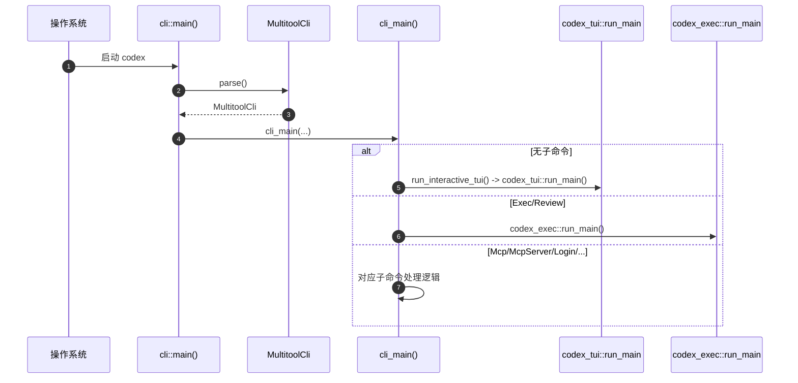

**关键交互说明**：

| 步骤 | 交互内容 | 设计意图 |
|-----|---------|---------|
| 1 | OS 启动 codex 进程 | 标准进程启动流程 |
| 2 | 解析命令行参数 | 使用 clap 派生宏，类型安全 |
| 3 | 分发到对应运行时 | 显式分离，避免模式混淆 |
| 4 | TUI/Exec 执行具体逻辑 | 职责分离，专注各自场景 |

---

## 3. 核心组件详细分析

### 3.1 MultitoolCli 内部结构

#### 职责定位

`MultitoolCli` 是 Codex CLI 的顶层命令定义结构，负责聚合配置覆盖、feature 开关、交互式参数和子命令分发。

#### 状态机图

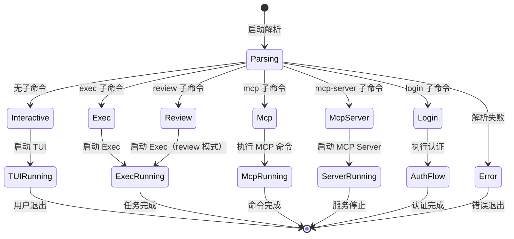

**状态说明**：

| 状态 | 说明 | 进入条件 | 退出条件 |
|-----|------|---------|---------|
| Parsing | 命令行解析 | 进程启动 | 解析成功/失败 |
| Interactive | 交互模式 | 无子命令且 TTY 可用 | TUI 启动 |
| Exec | 执行模式 | exec 子命令 | Exec 运行时启动 |
| Error | 错误状态 | 解析失败或 TERM=dumb | 进程退出 |

#### 内部数据流

```text
┌────────────────────────────────────────────┐
│  输入层                                     │
│   命令行参数 → clap 解析 → MultitoolCli    │
└──────────────────┬─────────────────────────┘
                   ▼
┌────────────────────────────────────────────┐
│  处理层                                     │
│   配置覆盖合并 → Feature Toggle 处理        │
│   → 子命令匹配 → 运行时选择                 │
└──────────────────┬─────────────────────────┘
                   ▼
┌────────────────────────────────────────────┐
│  输出层                                     │
│   启动对应运行时 → 传递配置 → 等待结果      │
└────────────────────────────────────────────┘
```

#### 关键接口

| 接口 | 输入 | 输出 | 说明 | 代码位置 |
|-----|------|------|------|---------|
| `parse()` | 命令行参数 | `MultitoolCli` | clap 派生解析 | `cli/src/main.rs:67` ✅ |
| `cli_main()` | 解析后的 CLI | 退出码 | 主分发逻辑 | `cli/src/main.rs:555` ✅ |
| `run_interactive_tui()` | TUI 配置 | `AppExitInfo` | 启动交互模式 | `cli/src/main.rs:891` ✅ |

---

### 3.2 配置分层组件

#### 职责定位

配置加载器负责从多个来源加载并合并配置，支持 system/user/project/session 四层优先级。

#### 配置优先级流程

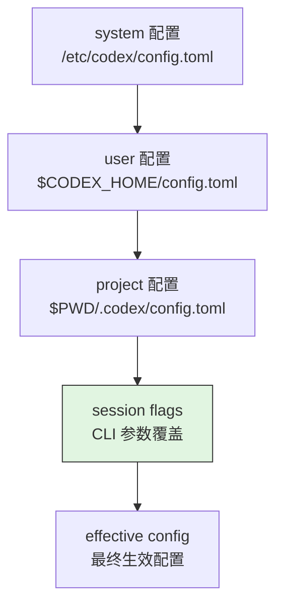

**配置层说明**：

| 层级 | 来源 | 优先级 | 用途 |
|-----|------|-------|------|
| system | `/etc/codex/config.toml` | 最低 | 企业全局默认 |
| user | `$CODEX_HOME/config.toml` | 中 | 用户个人偏好 |
| project | `$PWD/.codex/config.toml` | 高 | 项目特定设置 |
| session | CLI 参数/环境变量 | 最高 | 单次运行覆盖 |

---

### 3.3 组件间协作时序

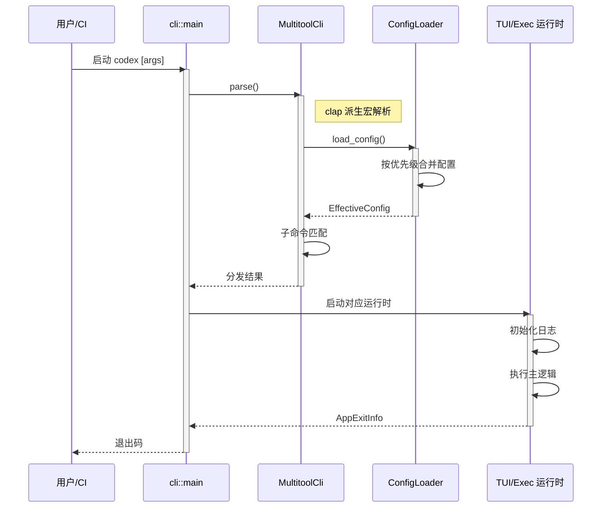

**协作要点**：

1. **用户与 main**：标准进程启动，参数通过命令行传递
2. **main 与 MultitoolCli**：clap 派生宏提供类型安全的参数解析
3. **ConfigLoader 与运行时**：配置在启动时加载，运行时只读

---

### 3.4 关键数据路径

#### 主路径（正常流程）

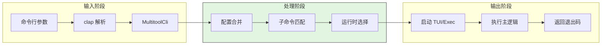

#### 异常路径（错误恢复）

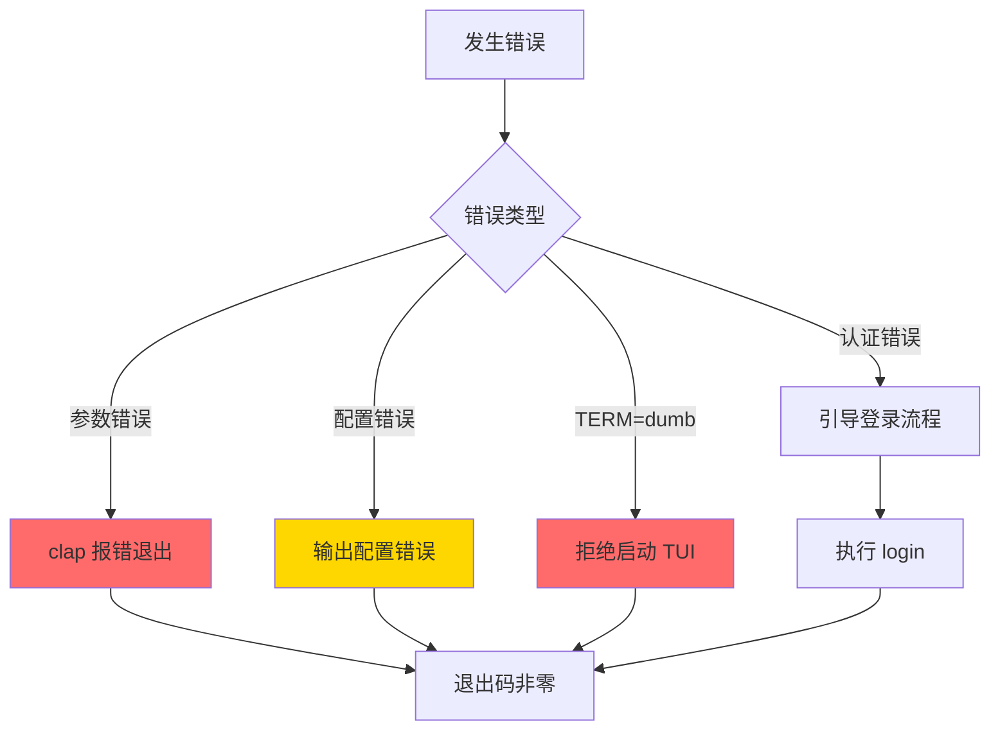

---

## 4. 端到端数据流转

### 4.1 交互模式（TUI）

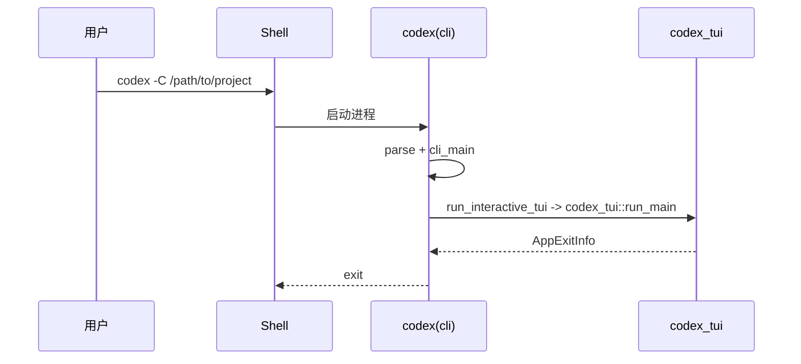

### 4.2 非交互模式（Exec/Review）

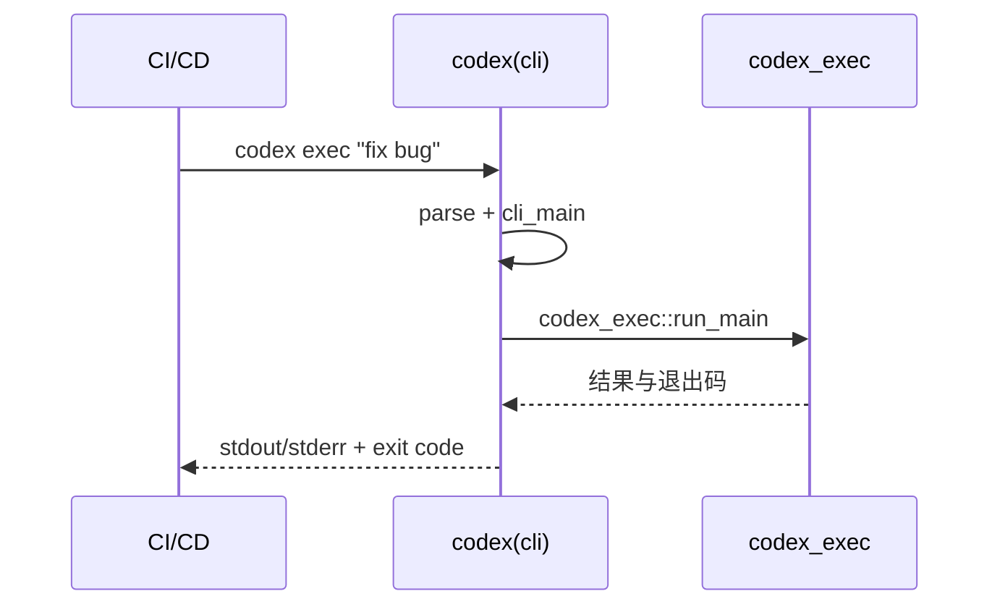

### 4.3 数据流向图

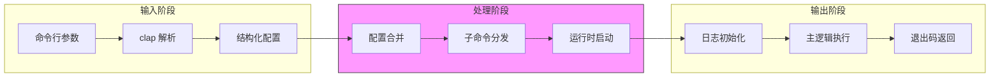

### 4.4 异常/边界流程

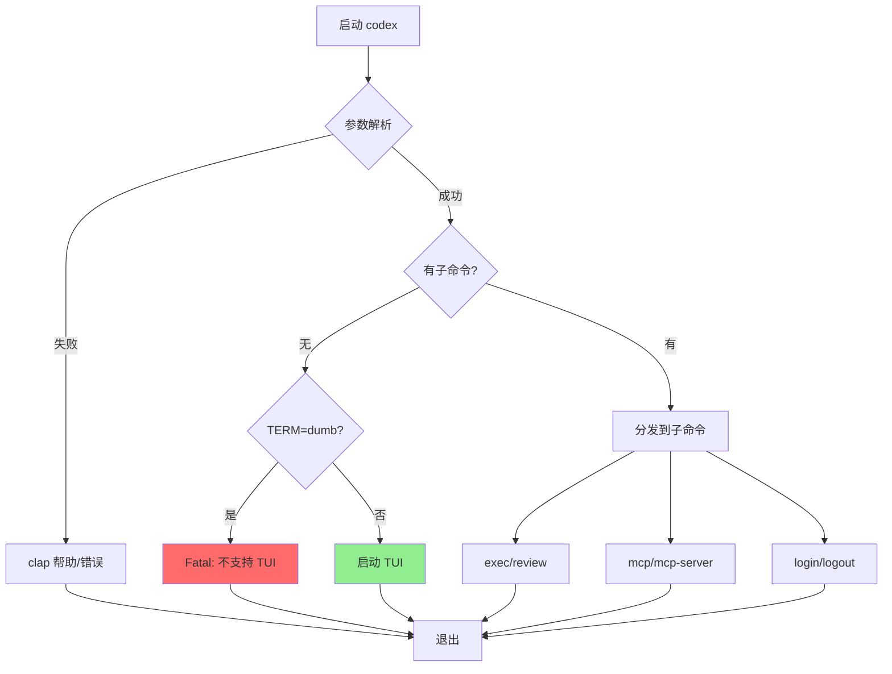

---

## 5. 关键代码实现

### 5.1 核心数据结构

```rust
// codex/codex-rs/cli/src/main.rs:67-118
#[derive(Debug, Parser)]
#[command(name = "codex")]
#[command(about = "Codex CLI")]
struct MultitoolCli {
    #[command(flatten)]
    pub config_overrides: CliConfigOverrides,

    #[command(flatten)]
    pub feature_toggles: FeatureToggles,

    #[command(flatten)]
    interactive: TuiCli,

    #[command(subcommand)]
    subcommand: Option<Subcommand>,
}

// codex/codex-rs/cli/src/main.rs:82-118
#[derive(Debug, Subcommand)]
enum Subcommand {
    Exec(ExecCli),
    Review(ReviewArgs),
    Login(LoginArgs),
    Logout,
    Mcp(McpCli),
    McpServer,
    // ...
}
```

**字段说明**：

| 字段 | 类型 | 用途 |
|-----|------|------|
| `config_overrides` | `CliConfigOverrides` | CLI 配置覆盖项 |
| `feature_toggles` | `FeatureToggles` | 全局 feature 开关 |
| `interactive` | `TuiCli` | 交互模式参数 |
| `subcommand` | `Option<Subcommand>` | 子命令枚举 |

### 5.2 主链路代码

**关键代码**（核心逻辑）：

```rust
// codex/codex-rs/cli/src/main.rs:545-570
fn main() -> std::process::ExitCode {
    let cli = MultitoolCli::parse();
    // ... 日志初始化 ...
    match cli_main(cli) {
        Ok(info) => { /* 处理退出信息 */ }
        Err(e) => { /* 错误处理 */ }
    }
}

// codex/codex-rs/cli/src/main.rs:555-600
async fn cli_main(cli: MultitoolCli) -> Result<AppExitInfo> {
    // 配置加载与合并
    let config = load_config_with_overrides(cli.config_overrides)?;

    match cli.subcommand {
        None => run_interactive_tui(cli.interactive, config).await,
        Some(Subcommand::Exec(exec_cli)) => {
            codex_exec::run_main(exec_cli, config).await
        }
        Some(Subcommand::Review(review_args)) => {
            // review 模式复用 exec 运行时
            codex_exec::run_main(exec_cli_with_review, config).await
        }
        // ... 其他子命令
    }
}
```

**设计意图**：
1. **显式分发**：通过 `match` 显式处理每个子命令，避免隐式行为
2. **配置前置**：在分发前统一加载和合并配置，运行时只读
3. **错误统一处理**：顶层统一处理错误，转换为退出码

<details>
<summary>查看完整实现（含 TERM=dumb 防护）</summary>

```rust
// codex/codex-rs/cli/src/main.rs:891-920
async fn run_interactive_tui(
    interactive: TuiCli,
    config: Config,
) -> Result<AppExitInfo> {
    // TERM=dumb 防护：非交互环境拒绝启动 TUI
    if std::env::var("TERM").ok().as_deref() == Some("dumb")
        && !interactive.allow_dumb_terminal
    {
        return Err(anyhow!(
            "Terminal does not support TUI. Use --allow-dumb-terminal to override."
        ));
    }

    // 检查 TTY
    if !std::io::stdin().is_terminal() && !interactive.allow_no_tty {
        return Err(anyhow!(
            "Stdin is not a TTY. Use --allow-no-tty to override."
        ));
    }

    // 启动 TUI
    codex_tui::run_main(interactive, config).await
}
```

</details>

### 5.3 关键调用链

```text
main()                        [cli/src/main.rs:545]
  -> cli_main()               [cli/src/main.rs:555]
    -> load_config()          [core/src/config_loader/mod.rs:91]
    -> match subcommand:
      -> run_interactive_tui()  [cli/src/main.rs:891]
        -> codex_tui::run_main()  [tui/src/lib.rs:131]
          - 初始化日志（Unix 0o600）
          - 启动 Agent Loop
      -> codex_exec::run_main() [exec/src/lib.rs]
        - headless 执行模式
```

---

## 6. 设计意图与 Trade-off

### 6.1 Codex 的选择

| 维度 | Codex 的选择 | 替代方案 | 取舍分析 |
|-----|-------------|---------|---------|
| 入口组织 | `cli` 顶层统一分发 | 把分发混在 `tui` | 清晰分层，但入口文件更复杂 |
| 交互与自动化 | 子命令显式区分 | 自动检测模式 | 可预测性高，但命令面更大 |
| 配置体系 | 四层配置堆栈 | 单文件配置 | 企业可管控性强，但理解成本高 |
| 可观测性 | file + db + otel | 仅 stdout | 诊断能力强，但初始化链更长 |

### 6.2 为什么这样设计？

**核心问题**：如何在同一 CLI 工具中同时支持交互式开发和自动化 CI 场景？

**Codex 的解决方案**：
- 代码依据：`cli/src/main.rs:567-827` ✅
- 设计意图：通过显式子命令区分模式，避免隐式行为导致的意外
- 带来的好处：
  - CI 场景可预测，不会意外进入交互模式
  - 交互模式可以专注于 UX，不受自动化约束
  - 新增子命令不影响现有逻辑
- 付出的代价：
  - 命令行界面更复杂（更多子命令需要学习）
  - 部分逻辑在 `cli` 和 `tui`/`exec` 之间重复

### 6.3 与其他项目的对比

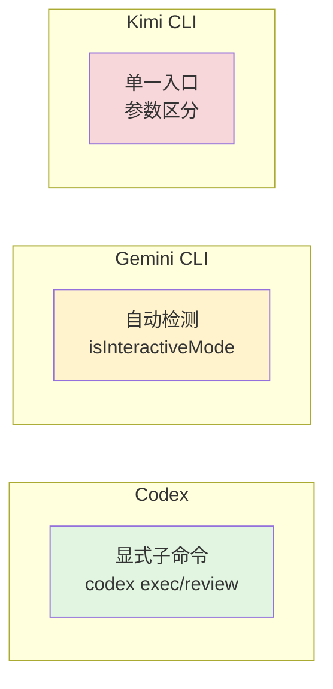

| 项目 | 核心差异 | 适用场景 |
|-----|---------|---------|
| Codex | 显式子命令（exec/review/mcp/...），顶层分发 | 企业环境，需要明确区分交互/自动化 |
| Gemini CLI | 自动检测 TTY 和参数，递归 continuation 驱动 | 简化用户体验，无缝切换模式 |
| Kimi CLI | 单一入口，通过参数和配置区分模式 | 简化命令结构，统一用户体验 |
| OpenCode | 类似 Codex 的显式区分，但使用 TypeScript | 需要清晰分层的场景 |

**对比分析**：

| 维度 | Codex | Gemini CLI | Kimi CLI |
|-----|-------|-----------|---------|
| 模式区分 | 显式子命令 | 自动检测 TTY | 参数/配置 |
| 入口复杂度 | 高（多子命令） | 中（自动判断） | 低（单一入口） |
| CI 可预测性 | 高 | 中（需确认检测逻辑） | 中 |
| 用户学习成本 | 高 | 低 | 低 |

---

## 7. 边界情况与错误处理

### 7.1 终止条件

| 终止原因 | 触发条件 | 代码位置 |
|---------|---------|---------|
| 参数解析失败 | clap 验证失败 | `cli/src/main.rs:545` ✅ |
| 配置加载失败 | TOML 非法或文件缺失 | `core/src/config_loader/mod.rs` ⚠️ |
| TERM=dumb | 交互模式在 dumb 终端启动 | `cli/src/main.rs:900-915` ✅ |
| 无 TTY | stdin 不是 TTY 且未覆盖 | `cli/src/main.rs:910-915` ✅ |
| 任务完成 | Exec/TUI 正常结束 | 各运行时返回 `AppExitInfo` ✅ |

### 7.2 超时/资源限制

```rust
// codex/codex-rs/cli/src/main.rs:900-915
// TERM=dumb 防护
if std::env::var("TERM").ok().as_deref() == Some("dumb")
    && !interactive.allow_dumb_terminal
{
    return Err(anyhow!("Terminal does not support TUI"));
}

// TTY 检查
if !std::io::stdin().is_terminal() && !interactive.allow_no_tty {
    return Err(anyhow!("Stdin is not a TTY"));
}
```

### 7.3 错误恢复策略

| 错误类型 | 处理策略 | 代码位置 |
|---------|---------|---------|
| 配置 TOML 非法 | 启动时报配置错误 | `tui/src/lib.rs:191-213` ⚠️ |
| 顶层 flags 冲突 | clap 报错退出 | `cli/src/main.rs`（clap 定义）✅ |
| TERM 不支持 TUI | 交互模式拒绝启动 | `cli/src/main.rs:900-915` ✅ |
| 登录方式错误 | `--api-key` 被拒绝 | `cli/src/main.rs:685-690` ⚠️ |

---

## 8. 关键代码索引

| 功能 | 文件 | 行号 | 说明 |
|-----|------|------|------|
| 入口 `main` | `codex/codex-rs/cli/src/main.rs` | 545 | 二进制入口 |
| 分发 `cli_main` | `codex/codex-rs/cli/src/main.rs` | 555 | 主分发逻辑 |
| 根命令结构 | `codex/codex-rs/cli/src/main.rs` | 67 | MultitoolCli 定义 |
| 子命令枚举 | `codex/codex-rs/cli/src/main.rs` | 82 | Subcommand 枚举 |
| Feature toggles | `codex/codex-rs/cli/src/main.rs` | 479 | 全局开关 |
| 启动交互 TUI | `codex/codex-rs/cli/src/main.rs` | 891 | TUI 启动入口 |
| TUI runtime | `codex/codex-rs/tui/src/lib.rs` | 131 | 交互运行时 |
| 配置层顺序 | `codex/codex-rs/core/src/config_loader/mod.rs` | 91 | 四层配置 |
| 默认日志目录 | `codex/codex-rs/core/src/config/mod.rs` | 1101 | $CODEX_HOME/log |
| Unix 日志权限 | `codex/codex-rs/tui/src/lib.rs` | 336-340 | 0o600 权限 |

---

## 9. 延伸阅读

- 前置知识：`01-codex-overview.md`
- Session Runtime：`03-codex-session-runtime.md`
- Agent Loop：`04-codex-agent-loop.md`
- MCP Integration：`06-codex-mcp-integration.md`

---

*✅ Verified: 基于 codex/codex-rs/cli + tui + core 源码分析*
*⚠️ Inferred: 部分代码位置基于源码结构推断*
*基于版本：2026-02-08 | 最后更新：2026-03-03*
