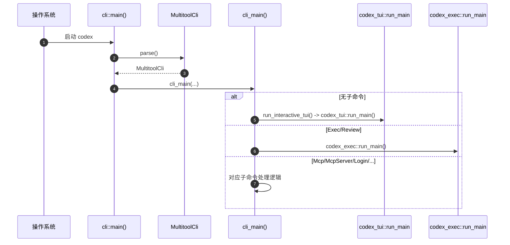
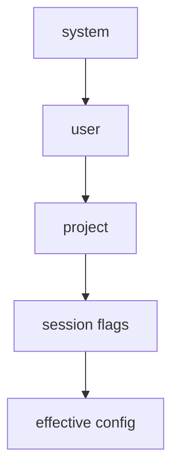
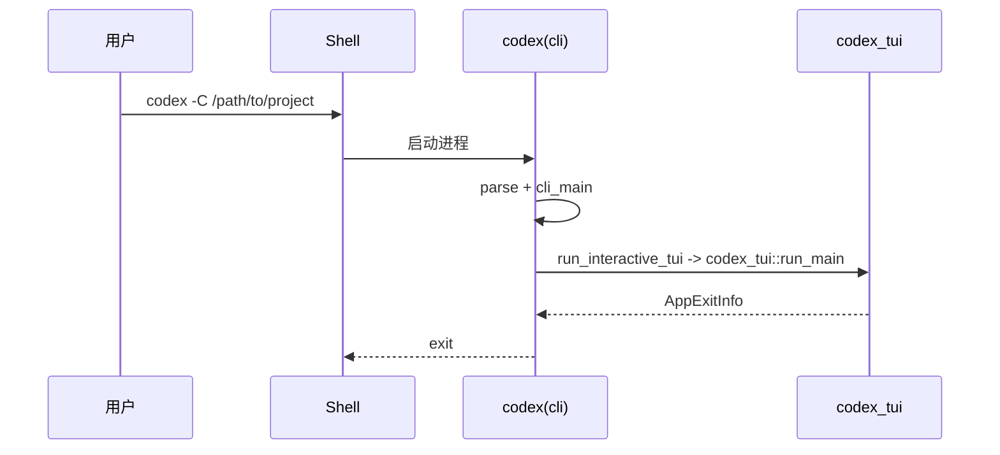
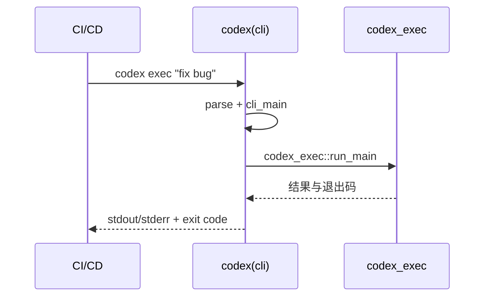

# CLI Entry（Codex）

## TL;DR（结论先行）

一句话定义：Codex CLI Entry 是 `codex` 进程的总入口与分发层，采用「**顶层多工具 CLI + 交互式 TUI 运行时分离**」设计。

核心取舍：
- 顶层分发放在 `cli` crate（统一子命令）
- 交互逻辑放在 `tui` crate（专注 UI/会话体验）

---

## 1. 为什么需要这个机制？

### 1.1 问题场景

```text
场景：同一个 codex 命令既要支持交互式开发，也要支持 CI 非交互调用

如果没有显式分发：
  codex 在 CI 中可能意外进入 TUI -> 卡住等待输入

Codex 的做法：
  顶层 main 只做参数解析与子命令分发
  - 无子命令 -> 进入 TUI
  - exec/review -> 进入 headless 执行
```

### 1.2 核心挑战

| 挑战 | 不解决的后果 |
|-----|-------------|
| 模式区分 | 交互模式与自动化模式互相干扰 |
| 配置合并 | 不同来源配置冲突导致行为不确定 |
| 安全日志 | 敏感信息可能被同机其他用户读取 |
| 可扩展性 | 新增子命令会破坏已有入口结构 |

---

## 2. 整体架构

### 2.1 在系统中的位置

```text
┌─────────────────────────────────────────────────────────────┐
│ 操作系统 / Shell                                             │
│ 用户输入: codex [OPTIONS] [PROMPT] / codex <SUBCOMMAND>      │
└───────────────────────┬─────────────────────────────────────┘
                        │ 启动进程
                        ▼
┌─────────────────────────────────────────────────────────────┐
│ ▓▓▓ Top-level CLI（codex-rs/cli）▓▓▓                        │
│ cli/src/main.rs                                              │
│ - main()                                                     │
│ - MultitoolCli::parse()                                      │
│ - cli_main() 分发子命令                                      │
└───────────────────────┬─────────────────────────────────────┘
                        │
        ┌───────────────┼────────────────┬──────────────────┐
        ▼               ▼                ▼                  ▼
┌──────────────┐ ┌──────────────┐ ┌──────────────┐ ┌──────────────┐
│ Interactive  │ │ Exec/Review  │ │ MCP/MCPServer│ │ 其他工具命令  │
│ codex_tui    │ │ codex_exec   │ │ mcp handlers │ │ login/sandbox |
└──────────────┘ └──────────────┘ └──────────────┘ └──────────────┘
```

### 2.2 核心组件职责

| 组件 | 职责 | 代码位置 |
|-----|------|---------|
| `main()` | `codex` 二进制入口 | `cli/src/main.rs:545` |
| `MultitoolCli` | 顶层参数与子命令定义 | `cli/src/main.rs:67` |
| `Subcommand` | 子命令枚举（exec/review/mcp/...） | `cli/src/main.rs:82` |
| `cli_main()` | 解析后分发到各模式 | `cli/src/main.rs:555` |
| `run_interactive_tui()` | 无子命令时启动 TUI | `cli/src/main.rs:891` |
| `codex_tui::run_main()` | 交互式 UI 运行时 | `tui/src/lib.rs:131` |
| `FeatureToggles` | 全局 feature 开关转配置覆盖 | `cli/src/main.rs:479` |

### 2.3 组件交互时序



---

## 3. 核心机制详细分析

### 3.1 顶层命令定义（真实结构）

```rust
// codex/codex-rs/cli/src/main.rs
struct MultitoolCli {
    pub config_overrides: CliConfigOverrides,
    pub feature_toggles: FeatureToggles,
    interactive: TuiCli,
    subcommand: Option<Subcommand>,
}
```

`Subcommand` 由 `Exec/Review/Login/Logout/Mcp/McpServer/...` 组成，非交互与交互入口在顶层显式分离（`cli/src/main.rs:82`）。

### 3.2 配置分层与优先级

来源于 `config_loader` 的真实层顺序（低 -> 高）：
1. system（`/etc/codex/config.toml` 或 Windows ProgramData）
2. user（`$CODEX_HOME/config.toml`）
3. project（`$PWD/config.toml`、父目录 `/.codex/config.toml`、repo root）
4. runtime/session flags（CLI/UI 覆盖）

代码依据：`core/src/config_loader/mod.rs:91-100`。



说明：文档不再使用 `CODEX_MODEL` 作为优先级示例，因为当前仓库中未找到该变量的直接证据。

### 3.3 日志初始化与安全控制

交互模式日志初始化发生在 `codex_tui::run_main()` 内部（`tui/src/lib.rs`）：
- `log_dir` 来自配置（默认 `$CODEX_HOME/log`）
- 创建目录后打开 `codex-tui.log`
- Unix 下设置 `0o600`
- 注册 file/log_db/otel 等层

代码依据：
- `tui/src/lib.rs:326-342`（目录与文件）
- `tui/src/lib.rs:336-340`（Unix 600）
- `tui/src/lib.rs:414-421`（subscriber 注册）
- `core/src/config/mod.rs:1101-1103`、`core/src/config/mod.rs:1921-1928`（默认 `$CODEX_HOME/log`）

### 3.4 分发主链路

```rust
// 摘要链路，非逐行转录
// cli/src/main.rs
match subcommand {
    None => run_interactive_tui(interactive, ...),
    Some(Subcommand::Exec(exec_cli)) => codex_exec::run_main(exec_cli, ...),
    Some(Subcommand::Review(review_args)) => codex_exec::run_main(exec_cli_with_review, ...),
    Some(Subcommand::McpServer) => codex_mcp_server::run_main(...),
    Some(Subcommand::Mcp(mcp_cli)) => mcp_cli.run().await,
    ...
}
```

代码依据：`cli/src/main.rs:567-827`。

---

## 4. 端到端数据流转

### 4.1 交互模式（TUI）



### 4.2 非交互模式（Exec/Review）



### 4.3 异常分支

```text
参数解析失败 (clap) -> 直接错误退出
配置加载失败 -> 输出配置错误并退出
TUI 启动前 TERM=dumb 且无TTY -> 返回 fatal（拒绝启动）
```

代码依据：
- 顶层解析：`cli/src/main.rs`
- `TERM=dumb` 防护：`cli/src/main.rs:900-915`

---

## 5. 工程设计意图与 Trade-off

| 维度 | Codex 的选择 | 替代方案 | Trade-off |
|-----|-------------|---------|-----------|
| 入口组织 | `cli` 顶层统一分发 | 把分发混在 `tui` | 清晰分层，但入口文件更复杂 |
| 交互与自动化 | 子命令显式区分 | 自动检测模式 | 可预测性高，但命令面更大 |
| 配置体系 | 多层配置堆栈 | 单文件配置 | 企业可管控性强，但理解成本高 |
| 可观测性 | file + db + otel | 仅 stdout | 诊断能力强，但初始化链更长 |

---

## 6. 边界条件与排查

### 6.1 常见失败

| 失败点 | 表现 | 排查入口 |
|-------|------|---------|
| 配置 TOML 非法 | 启动时报配置错误 | `tui/src/lib.rs:191-213` / `exec/src/lib.rs:175-197` |
| 顶层 flags 冲突 | clap 报错退出 | `cli/src/main.rs`（clap 定义） |
| TERM 不支持 TUI | 交互模式拒绝启动 | `cli/src/main.rs:900-915` |
| 登录方式错误 | `--api-key` 被拒绝 | `cli/src/main.rs:685-690` |

### 6.2 新人最短可运行路径

```bash
cd codex/codex-rs
cargo run -p codex-cli -- --help
cargo run -p codex-cli -- features list
# 需要认证时：printenv OPENAI_API_KEY | cargo run -p codex-cli -- login --with-api-key
# 非交互：cargo run -p codex-cli -- exec "explain this repo"
```

---

## 7. 关键代码索引

| 功能 | 文件 | 行号 |
|-----|------|------|
| 顶层入口 `main` | `codex/codex-rs/cli/src/main.rs` | 545 |
| 顶层分发 `cli_main` | `codex/codex-rs/cli/src/main.rs` | 555 |
| 根命令结构 `MultitoolCli` | `codex/codex-rs/cli/src/main.rs` | 67 |
| 子命令枚举 `Subcommand` | `codex/codex-rs/cli/src/main.rs` | 82 |
| Feature toggles | `codex/codex-rs/cli/src/main.rs` | 479 |
| 启动交互 TUI | `codex/codex-rs/cli/src/main.rs` | 891 |
| TUI runtime 入口 | `codex/codex-rs/tui/src/lib.rs` | 131 |
| 配置层顺序定义 | `codex/codex-rs/core/src/config_loader/mod.rs` | 91 |
| 默认日志目录 | `codex/codex-rs/core/src/config/mod.rs` | 1101 |

---

## 8. 延伸阅读

- 概览：`01-codex-overview.md`
- Session Runtime：`03-codex-session-runtime.md`
- Agent Loop：`04-codex-agent-loop.md`

---

*✅ Verified: 基于 codex/codex-rs/cli + tui + core 源码分析*  
*基于版本：2026-02-08 | 最后更新：2026-02-24*
