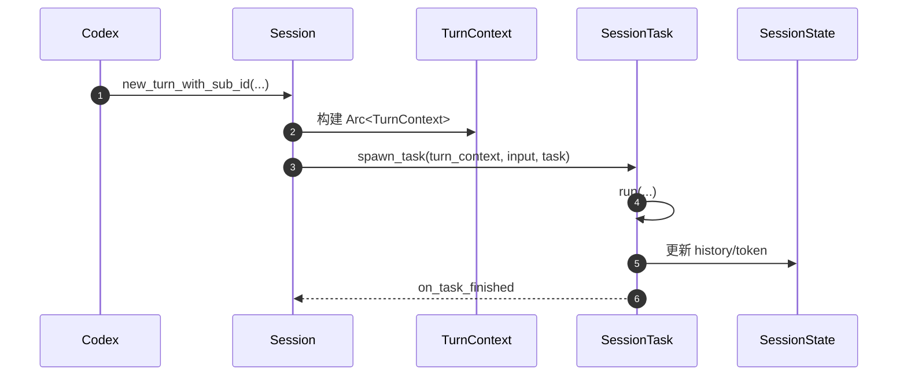
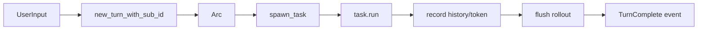
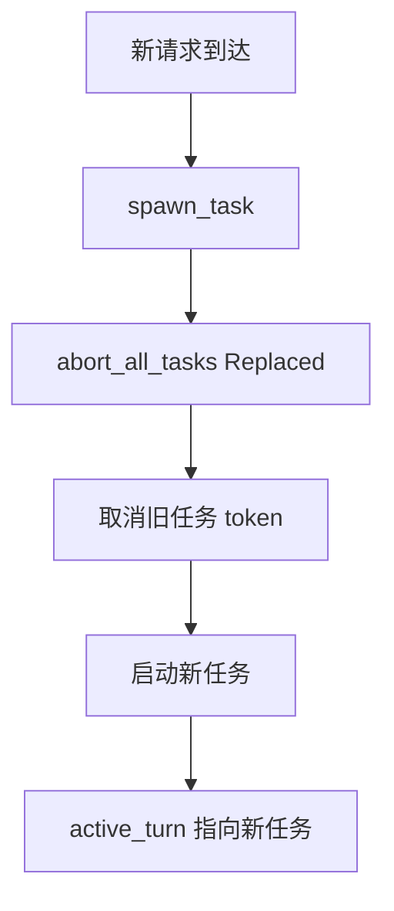
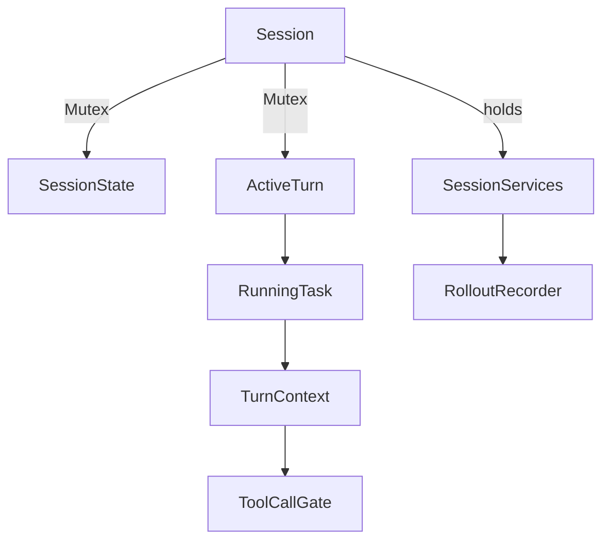

# Session Runtime（Codex）

## TL;DR（结论先行）

一句话定义：Codex Session Runtime 采用「**单 Session 下单活跃 Turn + 可中断任务**」模型，用 `active_turn` 管理运行任务，并通过 Rollout 事件持久化支持恢复。

核心取舍：
- 用显式取消换状态一致性（新任务启动会替换旧任务）
- 用事件流持久化换可恢复与可审计

---

## 1. 为什么需要这个机制？

### 1.1 问题场景

```text
场景：用户持续多轮交互，并在中途插入新请求

如果允许多个 turn 并行写状态：
  - 历史记录竞态
  - 工具调用顺序紊乱
  - 恢复点不确定

Codex 的做法：
  - 会话层只保留单活跃 turn
  - 新任务先 abort 旧任务再启动
```

### 1.2 核心挑战

| 挑战 | 不解决的后果 |
|-----|-------------|
| 并发控制 | 多任务争用同一会话状态 |
| 状态隔离 | Turn 间上下文污染 |
| 可恢复性 | 崩溃后无法回放并恢复 |
| 取消语义 | 用户中断后资源无法优雅回收 |

---

## 2. 整体架构

### 2.1 在系统中的位置

```text
┌─────────────────────────────────────────────────────────────┐
│ Core Agent Layer（core/src/codex.rs）                       │
│ Codex::spawn() -> Session::new()                            │
└───────────────────────┬─────────────────────────────────────┘
                        │
                        ▼
┌─────────────────────────────────────────────────────────────┐
│ ▓▓▓ Session Runtime ▓▓▓                                     │
│ Session (conversation_id, state, active_turn, services)      │
│ TurnContext (单次 turn 的完整执行上下文)                      │
└───────────────────────┬─────────────────────────────────────┘
                        │
        ┌───────────────┼──────────────────────┐
        ▼               ▼                      ▼
┌──────────────┐ ┌──────────────┐       ┌──────────────┐
│ tasks/mod.rs │ │ SessionState │       │ RolloutRecorder │
│ spawn/abort  │ │ history/token│       │ 事件持久化      │
└──────────────┘ └──────────────┘       └──────────────┘
```

### 2.2 核心组件职责

| 组件 | 职责 | 代码位置 |
|-----|------|---------|
| `Session` | 会话生命周期与任务切换 | `core/src/codex.rs:525` |
| `TurnContext` | 单 turn 执行上下文 | `core/src/codex.rs:543` |
| `SessionState` | 会话级可变状态（history/token 等） | `core/src/state/session.rs:17` |
| `spawn_task` | 启动新任务前替换旧任务 | `core/src/tasks/mod.rs:116` |
| `abort_all_tasks` | 取消当前运行任务 | `core/src/tasks/mod.rs:179` |
| `RolloutRecorder` | 事件 JSONL 持久化 | `core/src/rollout/recorder.rs:70` |

### 2.3 核心交互时序



---

## 3. 核心机制详细分析

### 3.1 Session 与 TurnContext（真实结构）

```rust
// core/src/codex.rs（摘要）
pub(crate) struct Session {
    pub(crate) conversation_id: ThreadId,
    tx_event: Sender<Event>,
    state: Mutex<SessionState>,
    pub(crate) active_turn: Mutex<Option<ActiveTurn>>,
    pub(crate) services: SessionServices,
}

pub(crate) struct TurnContext {
    pub(crate) sub_id: String,
    pub(crate) model_info: ModelInfo,
    pub(crate) cwd: PathBuf,
    pub(crate) approval_policy: Constrained<AskForApproval>,
    pub(crate) sandbox_policy: Constrained<SandboxPolicy>,
    pub(crate) tools_config: ToolsConfig,
    pub(crate) tool_call_gate: Arc<ReadinessFlag>,
    // ... 其他 turn 级配置
}
```

代码依据：`core/src/codex.rs:525-577`。

### 3.2 任务调度与取消（真实主链路）

`spawn_task` 的关键行为不是“并行堆叠”，而是“替换式启动”：
1. `abort_all_tasks(TurnAbortReason::Replaced)`
2. 启动新 task（tokio）
3. 注册为当前 `active_turn`

```rust
// core/src/tasks/mod.rs（摘要）
pub async fn spawn_task<T: SessionTask>(...) {
    self.abort_all_tasks(TurnAbortReason::Replaced).await;
    // spawn + register_new_active_task
}
```

代码依据：`core/src/tasks/mod.rs:116-177`、`core/src/tasks/mod.rs:226-231`。

### 3.3 SessionState（当前字段）

```rust
// core/src/state/session.rs（摘要）
pub(crate) struct SessionState {
    pub(crate) session_configuration: SessionConfiguration,
    pub(crate) history: ContextManager,
    pub(crate) latest_rate_limits: Option<RateLimitSnapshot>,
    pub(crate) server_reasoning_included: bool,
    pub(crate) dependency_env: HashMap<String, String>,
    pub(crate) mcp_dependency_prompted: HashSet<String>,
    previous_model: Option<String>,
    pub(crate) startup_regular_task: Option<RegularTask>,
    pub(crate) active_mcp_tool_selection: Option<Vec<String>>,
    pub(crate) active_connector_selection: HashSet<String>,
}
```

代码依据：`core/src/state/session.rs:17-32`。

### 3.4 自动压缩（compact）触发链路

Turn 执行后会检查 token 使用量并与 `auto_compact_limit` 对比：
- 达到阈值且仍需 follow-up -> `run_auto_compact(...)`
- `run_auto_compact` 根据 provider 选择 inline 或 remote compact 实现

代码依据：
- token 检查：`core/src/codex.rs:4728-4757`
- pre-sampling compact：`core/src/codex.rs:4855-4874`
- compact 路由：`core/src/codex.rs:4923-4944`

---

## 4. 端到端数据流转

### 4.1 正常路径



### 4.2 取消路径（新任务替换）



### 4.3 数据关系图



---

## 5. 工程设计意图与 Trade-off

| 维度 | Codex 的选择 | 替代方案 | Trade-off |
|-----|-------------|---------|-----------|
| Turn 并发 | 单活跃 turn（替换式） | 多 turn 并行 | 一致性更强，但吞吐受限 |
| 取消策略 | `CancellationToken` + graceful timeout | 直接 kill | 更安全，但实现复杂 |
| 状态管理 | `Mutex<SessionState>` | 完全事件溯源内存态 | 直观易维护，但需谨慎锁粒度 |
| 持久化 | Rollout JSONL + 状态 DB | 仅内存 | 恢复能力强，但 IO 成本更高 |

---

## 6. 边界条件与错误处理

### 6.1 常见终止/中断原因

| 场景 | 触发条件 | 代码位置 |
|-----|---------|---------|
| 新任务替换旧任务 | 新 `spawn_task` 到达 | `core/src/tasks/mod.rs:122` |
| 用户中断 | `Interrupted` 取消原因 | `core/src/tasks/mod.rs:183-185` |
| 任务未优雅结束 | 超时后强制 abort handle | `core/src/tasks/mod.rs:265-274` |
| turn 执行异常 | 发送 `EventMsg::Error` | `core/src/codex.rs:4842-4847` |

### 6.2 恢复相关

- Rollout 以 JSONL 持久化，支持 resume/fork。
- `RolloutRecorder` 负责持久化命令队列与 flush/shutdown 语义。

代码依据：`core/src/rollout/recorder.rs:60-105`。

---

## 7. 关键代码索引

| 功能 | 文件 | 行号 |
|-----|------|------|
| `Session` 结构 | `codex/codex-rs/core/src/codex.rs` | 525 |
| `TurnContext` 结构 | `codex/codex-rs/core/src/codex.rs` | 543 |
| `new_turn_with_sub_id` | `codex/codex-rs/core/src/codex.rs` | 1978 |
| `spawn_task` | `codex/codex-rs/core/src/tasks/mod.rs` | 116 |
| `abort_all_tasks` | `codex/codex-rs/core/src/tasks/mod.rs` | 179 |
| `on_task_finished` | `codex/codex-rs/core/src/tasks/mod.rs` | 188 |
| `SessionState` 结构 | `codex/codex-rs/core/src/state/session.rs` | 17 |
| 自动 compact 主链路 | `codex/codex-rs/core/src/codex.rs` | 4728 |
| `run_auto_compact` | `codex/codex-rs/core/src/codex.rs` | 4923 |
| Rollout 记录器 | `codex/codex-rs/core/src/rollout/recorder.rs` | 70 |

---

## 8. 延伸阅读

- 概览：`01-codex-overview.md`
- CLI Entry：`02-codex-cli-entry.md`
- Agent Loop：`04-codex-agent-loop.md`

---

*✅ Verified: 基于 codex/codex-rs/core/src/ 源码分析*  
*基于版本：2026-02-08 | 最后更新：2026-02-24*
