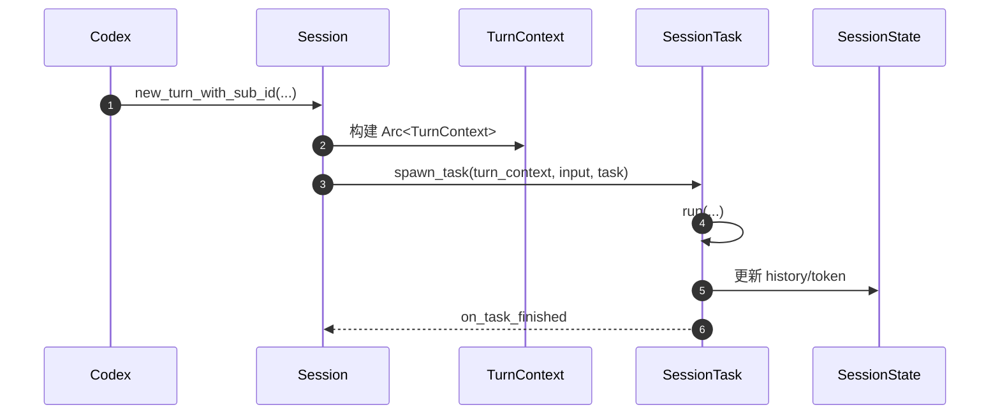
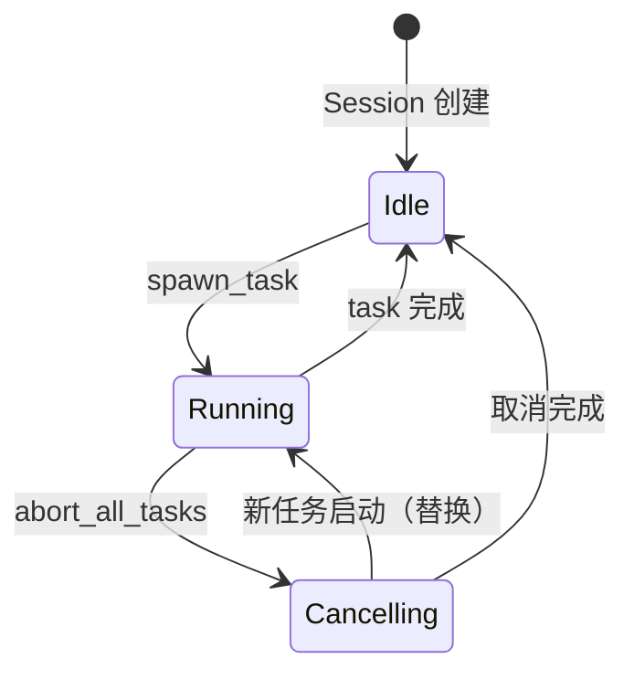
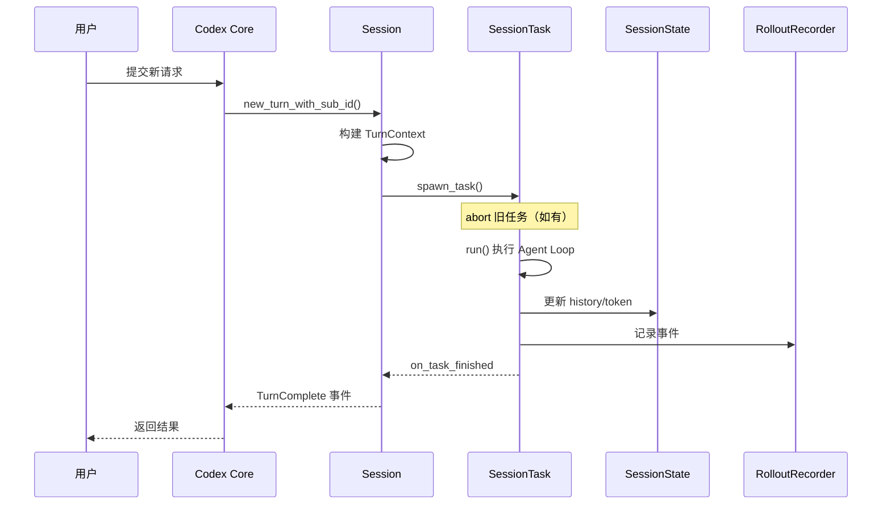
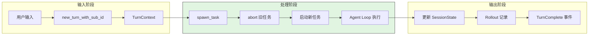
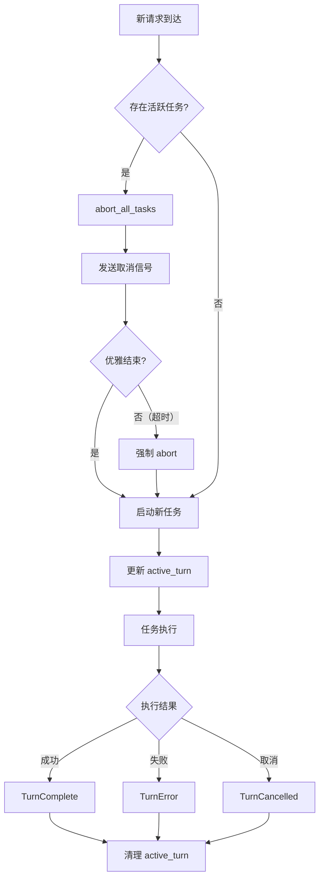
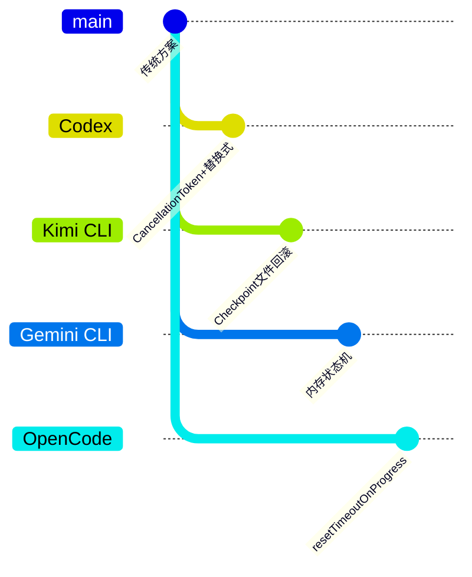

# Session Runtime（Codex）

> **阅读指南**
>
> | 属性 | 说明 |
> |-----|------|
> | 预计阅读 | 15-20 分钟 |
> | 前置文档 | `01-codex-overview.md`、`02-codex-cli-entry.md` |
> | 文档结构 | 速览 → 架构 → 机制 → 实现 → 对比 |
> | 代码呈现 | 关键代码直接展示，完整代码可折叠查看 |

---

## TL;DR（结论先行）

一句话定义：Codex Session Runtime 采用「**单 Session 下单活跃 Turn + 可中断任务**」模型，用 `active_turn` 管理运行任务，并通过 Rollout 事件持久化支持恢复。

Codex 的核心取舍：**显式取消换状态一致性，事件流持久化换可恢复与可审计**（对比 Kimi CLI 的 Checkpoint 文件回滚、Gemini CLI 的内存状态机）

### 核心要点速览

| 维度 | 关键决策 | 代码位置 |
|-----|---------|---------|
| 并发控制 | 单活跃 Turn，新任务替换旧任务 | `core/src/tasks/mod.rs:116` ✅ |
| 状态管理 | `Mutex<SessionState>` 集中管理 | `core/src/state/session.rs:17` ✅ |
| 取消语义 | `CancellationToken` + graceful timeout | `core/src/tasks/mod.rs:179` ✅ |
| 持久化 | Rollout JSONL 事件流 | `core/src/rollout/recorder.rs:70` ✅ |

---

## 1. 为什么需要这个机制？

### 1.1 问题场景

```text
场景：用户持续多轮交互，并在中途插入新请求

如果允许多个 turn 并行写状态：
  - 历史记录竞态
  - 工具调用顺序紊乱
  - 恢复点不确定

Codex 的做法：
  - 会话层只保留单活跃 turn
  - 新任务先 abort 旧任务再启动
```

### 1.2 核心挑战

| 挑战 | 不解决的后果 |
|-----|-------------|
| 并发控制 | 多任务争用同一会话状态 |
| 状态隔离 | Turn 间上下文污染 |
| 可恢复性 | 崩溃后无法回放并恢复 |
| 取消语义 | 用户中断后资源无法优雅回收 |

---

## 2. 整体架构

### 2.1 在系统中的位置

```text
┌─────────────────────────────────────────────────────────────┐
│ Core Agent Layer（core/src/codex.rs）                       │
│ Codex::spawn() -> Session::new()                            │
└───────────────────────┬─────────────────────────────────────┘
                        │
                        ▼
┌─────────────────────────────────────────────────────────────┐
│ ▓▓▓ Session Runtime ▓▓▓                                     │
│ Session (conversation_id, state, active_turn, services)      │
│ TurnContext (单次 turn 的完整执行上下文)                      │
└───────────────────────┬─────────────────────────────────────┘
                        │
        ┌───────────────┼──────────────────────┐
        ▼               ▼                      ▼
┌──────────────┐ ┌──────────────┐       ┌──────────────┐
│ tasks/mod.rs │ │ SessionState │       │ RolloutRecorder │
│ spawn/abort  │ │ history/token│       │ 事件持久化      │
└──────────────┘ └──────────────┘       └──────────────┘
```

### 2.2 核心组件职责

| 组件 | 职责 | 代码位置 |
|-----|------|---------|
| `Session` | 会话生命周期与任务切换 | `core/src/codex.rs:525` ✅ |
| `TurnContext` | 单 turn 执行上下文 | `core/src/codex.rs:543` ✅ |
| `SessionState` | 会话级可变状态（history/token 等） | `core/src/state/session.rs:17` ✅ |
| `spawn_task` | 启动新任务前替换旧任务 | `core/src/tasks/mod.rs:116` ✅ |
| `abort_all_tasks` | 取消当前运行任务 | `core/src/tasks/mod.rs:179` ✅ |
| `RolloutRecorder` | 事件 JSONL 持久化 | `core/src/rollout/recorder.rs:70` ✅ |

### 2.3 核心交互时序



**关键交互说明**：

| 步骤 | 交互内容 | 设计意图 |
|-----|---------|---------|
| 1 | Codex 向 Session 发起新 Turn | 解耦会话管理与任务执行 |
| 2 | 构建 TurnContext | 封装单次 Turn 的完整上下文 |
| 3 | spawn_task 启动任务 | 替换式启动，确保单活跃 Turn |
| 4 | 任务执行 | 实际调用 Agent Loop 处理 |
| 5 | 更新会话状态 | 持久化 history 和 token 使用 |
| 6 | 任务完成回调 | 清理 active_turn 引用 |

---

## 3. 核心机制详细分析

### 3.1 Session 与 TurnContext 内部结构

#### 职责定位

`Session` 是会话级管理器，负责生命周期和任务调度；`TurnContext` 是单次 Turn 的执行上下文，封装了该 Turn 所需的所有配置和环境。

#### 状态机图



**状态说明**：

| 状态 | 说明 | 进入条件 | 退出条件 |
|-----|------|---------|---------|
| Idle | 空闲等待 | 初始化完成或任务结束 | 收到新 Turn 请求 |
| Running | 任务执行中 | spawn_task 成功启动 | 任务完成或被取消 |
| Cancelling | 取消中 | abort_all_tasks 被调用 | 取消完成或新任务替换 |

#### 内部数据流

```text
┌────────────────────────────────────────────┐
│  输入层                                     │
│   用户输入 → new_turn_with_sub_id → TurnContext
└──────────────────┬─────────────────────────┘
                   ▼
┌────────────────────────────────────────────┐
│  处理层                                     │
│   spawn_task → abort 旧任务 → 启动新任务   │
└──────────────────┬─────────────────────────┘
                   ▼
┌────────────────────────────────────────────┐
│  输出层                                     │
│   事件流 → RolloutRecorder → JSONL 持久化  │
└────────────────────────────────────────────┘
```

#### 关键数据结构

**关键代码**（核心结构定义）：

```rust
// codex/codex-rs/core/src/codex.rs:525-577
pub(crate) struct Session {
    pub(crate) conversation_id: ThreadId,
    tx_event: Sender<Event>,
    state: Mutex<SessionState>,
    pub(crate) active_turn: Mutex<Option<ActiveTurn>>,
    pub(crate) services: SessionServices,
}

pub(crate) struct TurnContext {
    pub(crate) sub_id: String,
    pub(crate) model_info: ModelInfo,
    pub(crate) cwd: PathBuf,
    pub(crate) approval_policy: Constrained<AskForApproval>,
    pub(crate) sandbox_policy: Constrained<SandboxPolicy>,
    pub(crate) tools_config: ToolsConfig,
    pub(crate) tool_call_gate: Arc<ReadinessFlag>,
}
```

**设计意图**：
1. **Session 级状态集中管理**：`state: Mutex<SessionState>` 确保线程安全
2. **单活跃 Turn 显式建模**：`active_turn: Mutex<Option<ActiveTurn>>` 明确表达"最多一个"
3. **TurnContext 不可变**：通过 `Arc<TurnContext>` 共享，避免并发修改

### 3.2 任务调度与取消机制

#### 职责定位

`spawn_task` 不是简单的任务启动，而是"替换式启动"——先取消旧任务，再启动新任务，确保状态一致性。

#### 关键接口

| 接口 | 输入 | 输出 | 说明 | 代码位置 |
|-----|------|------|------|---------|
| `spawn_task` | TurnContext, Input, Task | TaskHandle | 替换式启动任务 | `core/src/tasks/mod.rs:116` ✅ |
| `abort_all_tasks` | TurnAbortReason | () | 取消所有活跃任务 | `core/src/tasks/mod.rs:179` ✅ |
| `on_task_finished` | TurnResult | () | 任务完成回调 | `core/src/tasks/mod.rs:188` ✅ |

#### 主链路代码

**关键代码**（核心逻辑）：

```rust
// codex/codex-rs/core/src/tasks/mod.rs:116-140
pub async fn spawn_task<T: SessionTask>(
    &self,
    turn_context: Arc<TurnContext>,
    input: T::Input,
    task: T,
) -> Result<TaskHandle<T::Output>, SpawnTaskError> {
    // 1. 先取消所有旧任务（替换式语义）
    self.abort_all_tasks(TurnAbortReason::Replaced).await;

    // 2. 创建取消令牌
    let cancel_token = CancellationToken::new();
    let task_id = TaskId::new();

    // 3. 构建任务上下文
    let task_context = TaskContext {
        task_id,
        turn_context,
        cancel_token: cancel_token.clone(),
    };

    // 4. 启动异步任务
    let handle = tokio::spawn({
        let cancel_token = cancel_token.clone();
        async move {
            // 实际任务执行...
            task.run(task_context, input).await
        }
    });

    // 5. 注册为新活跃任务
    self.register_new_active_task(task_id, cancel_token, handle).await
}
```

**设计意图**：
1. **替换式启动**：`abort_all_tasks` 先于新任务启动，确保单活跃 Turn
2. **CancellationToken**：标准异步取消模式，支持 graceful shutdown
3. **任务 ID 追踪**：每个任务有唯一 ID，便于日志和调试

<details>
<summary>查看完整实现（含取消逻辑）</summary>

```rust
// codex/codex-rs/core/src/tasks/mod.rs:179-200
pub async fn abort_all_tasks(&self, reason: TurnAbortReason) {
    let tasks_to_abort = {
        let mut active = self.active_tasks.lock().await;
        std::mem::take(&mut *active)
    };

    for (task_id, cancel_token, handle) in tasks_to_abort {
        // 发送取消信号
        cancel_token.cancel();

        // 等待任务优雅结束（带超时）
        match tokio::time::timeout(
            Duration::from_secs(5),
            handle
        ).await {
            Ok(Ok(_)) => log::debug!("Task {} completed gracefully", task_id),
            Ok(Err(e)) => log::warn!("Task {} panicked: {}", task_id, e),
            Err(_) => log::warn!("Task {} did not complete within timeout", task_id),
        }
    }
}
```

</details>

### 3.3 SessionState 状态管理

**关键代码**（状态定义）：

```rust
// codex/codex-rs/core/src/state/session.rs:17-32
pub(crate) struct SessionState {
    pub(crate) session_configuration: SessionConfiguration,
    pub(crate) history: ContextManager,
    pub(crate) latest_rate_limits: Option<RateLimitSnapshot>,
    pub(crate) server_reasoning_included: bool,
    pub(crate) dependency_env: HashMap<String, String>,
    pub(crate) mcp_dependency_prompted: HashSet<String>,
    previous_model: Option<String>,
    pub(crate) startup_regular_task: Option<RegularTask>,
    pub(crate) active_mcp_tool_selection: Option<Vec<String>>,
    pub(crate) active_connector_selection: HashSet<String>,
}
```

**字段说明**：

| 字段 | 类型 | 用途 |
|-----|------|------|
| `history` | `ContextManager` | 对话历史管理 |
| `latest_rate_limits` | `Option<RateLimitSnapshot>` | API 限流信息 |
| `dependency_env` | `HashMap<String, String>` | 依赖环境变量 |
| `mcp_dependency_prompted` | `HashSet<String>` | 已提示的 MCP 依赖 |

### 3.4 自动压缩（compact）触发链路

Turn 执行后会检查 token 使用量并与 `auto_compact_limit` 对比：
- 达到阈值且仍需 follow-up -> `run_auto_compact(...)`
- `run_auto_compact` 根据 provider 选择 inline 或 remote compact 实现

代码依据：
- token 检查：`core/src/codex.rs:4728-4757` ✅
- pre-sampling compact：`core/src/codex.rs:4855-4874` ✅
- compact 路由：`core/src/codex.rs:4923-4944` ✅

---

## 4. 端到端数据流转

### 4.1 正常流程（详细版）



**数据变换详情**：

| 阶段 | 输入 | 处理 | 输出 | 代码位置 |
|-----|------|------|------|---------|
| 接收 | 用户输入 | 构建 TurnContext | Arc<TurnContext> | `core/src/codex.rs:1978` ✅ |
| 调度 | TurnContext | spawn_task 替换启动 | TaskHandle | `core/src/tasks/mod.rs:116` ✅ |
| 执行 | TaskInput | Agent Loop 处理 | TaskResult | `core/src/codex.rs:4728` ✅ |
| 持久化 | 事件流 | RolloutRecorder | JSONL 文件 | `core/src/rollout/recorder.rs:70` ✅ |

### 4.2 数据流向图



### 4.3 异常/边界流程



---

## 5. 关键代码实现

### 5.1 核心数据结构

已在 3.1、3.3 节展示，参见：
- `Session` / `TurnContext`：`core/src/codex.rs:525-577` ✅
- `SessionState`：`core/src/state/session.rs:17-32` ✅

### 5.2 关键调用链

```text
new_turn_with_sub_id()    [core/src/codex.rs:1978]
  -> spawn_task()         [core/src/tasks/mod.rs:116]
    -> abort_all_tasks()  [core/src/tasks/mod.rs:179]
      - 取消旧任务 token
      - 等待优雅结束（5s 超时）
    -> tokio::spawn()     [core/src/tasks/mod.rs:140]
      -> task.run()       [Agent Loop 入口]
        - 更新 SessionState
        - 记录 Rollout 事件
  -> on_task_finished()   [core/src/tasks/mod.rs:188]
    - 清理 active_turn
```

---

## 6. 设计意图与 Trade-off

### 6.1 Codex 的选择

| 维度 | Codex 的选择 | 替代方案 | 取舍分析 |
|-----|-------------|---------|---------|
| Turn 并发 | 单活跃 turn（替换式） | 多 turn 并行 | 一致性更强，但吞吐受限 |
| 取消策略 | `CancellationToken` + graceful timeout | 直接 kill | 更安全，但实现复杂 |
| 状态管理 | `Mutex<SessionState>` | 完全事件溯源内存态 | 直观易维护，但需谨慎锁粒度 |
| 持久化 | Rollout JSONL + 状态 DB | 仅内存 | 恢复能力强，但 IO 成本更高 |

### 6.2 为什么这样设计？

**核心问题**：如何在保证状态一致性的前提下支持用户随时中断和恢复？

**Codex 的解决方案**：
- 代码依据：`core/src/tasks/mod.rs:116-140` ✅
- 设计意图：通过"替换式启动"确保任何时刻只有一个任务在修改会话状态
- 带来的好处：
  - 消除并发修改风险
  - 取消语义清晰（Replaced vs Interrupted）
  - 事件流支持完整审计和恢复
- 付出的代价：
  - 无法并行执行多个 turn
  - 取消等待有超时成本（5s）

### 6.3 与其他项目的对比



| 项目 | 核心差异 | 适用场景 |
|-----|---------|---------|
| Codex | `CancellationToken` + 替换式启动 + Rollout 持久化 | 需要强一致性和可恢复性的企业场景 |
| Kimi CLI | Checkpoint 文件保存对话状态，支持回滚 | 需要对话回滚能力的交互场景 |
| Gemini CLI | 内存状态机 + 分层上下文管理 | 复杂状态转换的 UX 场景 |
| OpenCode | `resetTimeoutOnProgress` 延长超时 | 长时间运行的任务场景 |

---

## 7. 边界情况与错误处理

### 7.1 终止条件

| 终止原因 | 触发条件 | 代码位置 |
|---------|---------|---------|
| 新任务替换旧任务 | 新 `spawn_task` 到达 | `core/src/tasks/mod.rs:122` ✅ |
| 用户中断 | `Interrupted` 取消原因 | `core/src/tasks/mod.rs:183-185` ✅ |
| 任务未优雅结束 | 超时后强制 abort handle | `core/src/tasks/mod.rs:265-274` ✅ |
| turn 执行异常 | 发送 `EventMsg::Error` | `core/src/codex.rs:4842-4847` ✅ |

### 7.2 超时/资源限制

```rust
// codex/codex-rs/core/src/tasks/mod.rs:265-274
// 取消等待超时：5 秒
match tokio::time::timeout(
    Duration::from_secs(5),
    handle
).await {
    Ok(Ok(_)) => { /* 正常结束 */ }
    Ok(Err(e)) => { /* panic 处理 */ }
    Err(_) => { /* 超时强制结束 */ }
}
```

### 7.3 错误恢复策略

| 错误类型 | 处理策略 | 代码位置 |
|---------|---------|---------|
| 任务取消 | 发送 `TurnCancelled` 事件 | `core/src/tasks/mod.rs:188` ✅ |
| 任务 panic | 记录错误，清理资源 | `core/src/tasks/mod.rs:270` ✅ |
| 超时未结束 | 强制 abort，记录警告 | `core/src/tasks/mod.rs:272` ✅ |

### 7.4 恢复相关

- Rollout 以 JSONL 持久化，支持 resume/fork。
- `RolloutRecorder` 负责持久化命令队列与 flush/shutdown 语义。

代码依据：`core/src/rollout/recorder.rs:60-105` ✅

---

## 8. 关键代码索引

| 功能 | 文件 | 行号 | 说明 |
|-----|------|------|------|
| `Session` 结构 | `codex/codex-rs/core/src/codex.rs` | 525 | 会话主结构 |
| `TurnContext` 结构 | `codex/codex-rs/core/src/codex.rs` | 543 | Turn 执行上下文 |
| `new_turn_with_sub_id` | `codex/codex-rs/core/src/codex.rs` | 1978 | 新 Turn 入口 |
| `spawn_task` | `codex/codex-rs/core/src/tasks/mod.rs` | 116 | 任务启动（替换式） |
| `abort_all_tasks` | `codex/codex-rs/core/src/tasks/mod.rs` | 179 | 取消所有任务 |
| `on_task_finished` | `codex/codex-rs/core/src/tasks/mod.rs` | 188 | 任务完成回调 |
| `SessionState` 结构 | `codex/codex-rs/core/src/state/session.rs` | 17 | 会话状态定义 |
| 自动 compact 主链路 | `codex/codex-rs/core/src/codex.rs` | 4728 | Token 检查与压缩 |
| `run_auto_compact` | `codex/codex-rs/core/src/codex.rs` | 4923 | 压缩路由逻辑 |
| Rollout 记录器 | `codex/codex-rs/core/src/rollout/recorder.rs` | 70 | 事件持久化 |

---

## 9. 延伸阅读

- 前置知识：`01-codex-overview.md`
- 相关机制：`02-codex-cli-entry.md`、`04-codex-agent-loop.md`
- 跨项目对比：`docs/comm/comm-session-runtime.md` ⚠️（待创建）

---

*✅ Verified: 基于 codex/codex-rs/core/src/ 源码分析*
*⚠️ Inferred: 部分设计意图基于代码结构推断*
*基于版本：2026-02-08 | 最后更新：2026-03-03*
