# Agent Loop（codex）

## TL;DR（结论先行）

一句话定义：Agent Loop 是 Codex 的**turn 内多轮采样循环机制**，模型每轮可能产出工具调用，工具结果回注历史后继续采样，直到 `needs_follow_up=false` 才结束该 turn。

Codex 的核心取舍：**事件驱动的异步流式处理 + Task 化生命周期管理**
（对比 Kimi CLI 的命令式 while 循环 + Checkpoint 回滚、Gemini CLI 的递归 continuation）

---

## 1. 为什么需要这个机制？（解决什么问题）

### 1.1 问题场景

没有 Agent Loop：用户问"修复这个 bug"→ LLM 一次回答→ 结束（可能根本没看文件）

有 Agent Loop：
```
  → LLM: "先读文件" → 读文件 → 得到结果
  → LLM: "再跑测试" → 执行测试 → 得到结果
  → LLM: "修改第 42 行" → 写文件 → 成功
```

Codex 进一步解决的问题：
- **流式响应处理**：模型输出是流式的，需要实时处理并决定是否继续
- **工具并发执行**：多个工具调用需要并发处理，同时保证结果顺序
- **长会话支持**：上下文窗口超限时需要自动压缩而非失败
- **中断与取消**：用户随时可能中断当前操作，需要优雅终止

### 1.2 核心挑战

| 挑战 | 不解决的后果 |
|-----|-------------|
| 流式事件处理 | 无法实时显示模型输出，用户体验差 |
| 工具并发控制 | 串行执行效率低，并行执行结果乱序 |
| 上下文窗口管理 | 长会话直接崩溃或无法继续 |
| 任务生命周期 | 无法支持中断、替换、取消操作 |
| 错误恢复 | 单点失败导致整个会话失效 |

---

## 2. 整体架构（ASCII 图）

### 2.1 在系统中的位置

```text
┌─────────────────────────────────────────────────────────────┐
│ CLI 入口 / Session Runtime                                   │
│ codex/codex-rs/core/src/codex.rs                            │
└───────────────────────┬─────────────────────────────────────┘
                        │ 调用
                        ▼
┌─────────────────────────────────────────────────────────────┐
│ ▓▓▓ Agent Loop ▓▓▓                                          │
│ codex/codex-rs/core/src/codex.rs                            │
│ - submission_loop(): 会话级事件循环                          │
│ - run_turn(): turn 级主循环                                  │
│ - run_sampling_request(): 单轮采样                          │
│ - try_run_sampling_request(): 流式事件处理                   │
└───────────────────────┬─────────────────────────────────────┘
                        │ 依赖/调用
        ┌───────────────┼───────────────┐
        ▼               ▼               ▼
┌──────────────┐ ┌──────────────┐ ┌──────────────┐
│ LLM Provider │ │ Tool System  │ │ Context      │
│ 采样请求     │ │ 工具执行     │ │ 状态管理     │
└──────────────┘ └──────────────┘ └──────────────┘
```

### 2.2 核心组件职责

| 组件 | 职责 | 代码位置 |
|-----|------|---------|
| `submission_loop` | 会话级事件循环，消费 `Op::*` 并分发任务 | `core/src/codex.rs` |
| `RegularTask` | turn 生命周期管理（启动、取消、完成） | `core/src/tasks/regular.rs` |
| `run_turn` | turn 级主循环，控制多轮采样 | `core/src/codex.rs` |
| `run_sampling_request` | 构建 prompt，执行 provider 级重试 | `core/src/codex.rs` |
| `try_run_sampling_request` | 流式事件处理，工具并发控制 | `core/src/codex.rs` |
| `ToolCallRuntime` | 工具调用运行时，管理并发与取消 | `core/src/tools/runtime.rs` |
| `ToolRouter` | 工具路由，解析和分发工具调用 | `core/src/tools/router.rs` |

### 2.3 核心组件交互关系

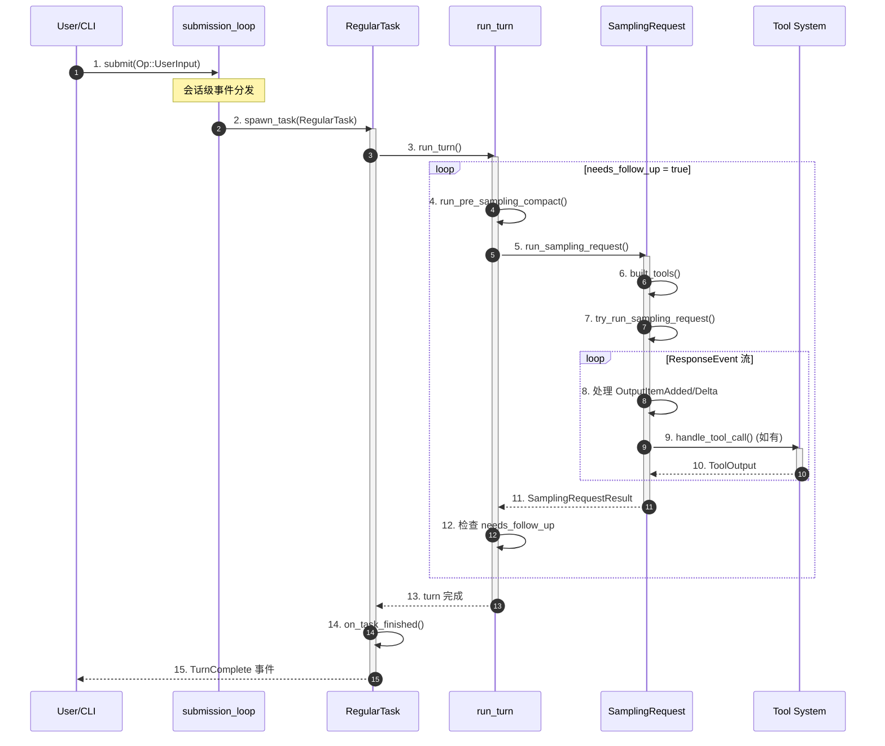

**关键交互说明**：

| 步骤 | 交互内容 | 设计意图 |
|-----|---------|---------|
| 1-2 | 用户输入进入会话级事件循环 | 解耦 CLI 与核心逻辑，支持多种输入源 |
| 3 | Task 启动 turn 执行 | turn 作为独立任务，支持取消和替换 |
| 4 | 预采样压缩检查 | 在调用 LLM 前处理上下文溢出 |
| 5-7 | 构建 prompt 并开始流式采样 | 统一封装工具和模型参数 |
| 8-10 | 流式处理中并发执行工具 | UI 实时更新，工具后台执行 |
| 11-12 | 根据工具结果决定是否继续 | 核心状态机：needs_follow_up |

---

## 3. 核心组件详细分析

### 3.1 run_turn() - Turn 级主循环

#### 职责定位

`run_turn()` 是 Codex Agent Loop 的核心，负责管理单个 turn 内的多轮采样循环，直到没有更多工作需要模型处理。

#### 状态机图

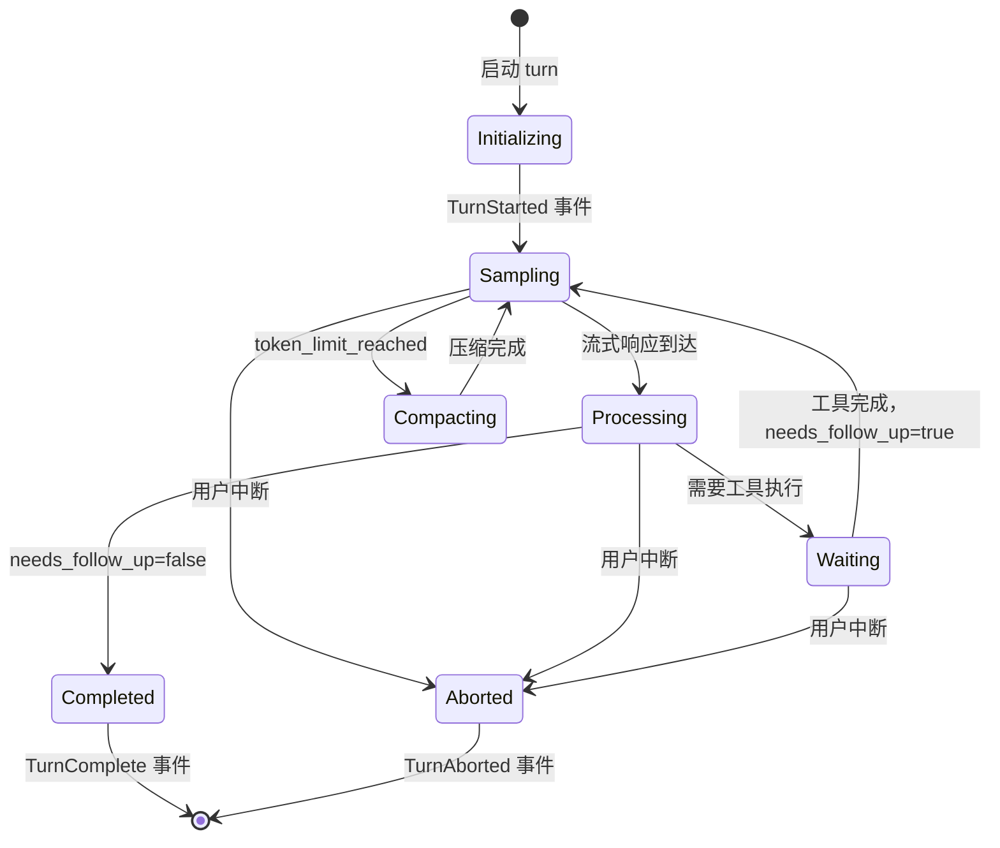

**状态说明**：

| 状态 | 说明 | 进入条件 | 退出条件 |
|-----|------|---------|---------|
| Initializing | 初始化阶段 | run_turn() 被调用 | 发送 TurnStarted 事件 |
| Sampling | 采样中 | 调用 run_sampling_request() | 流结束或中断 |
| Processing | 处理流式响应 | 收到 ResponseEvent | 处理完成或中断 |
| Waiting | 等待工具执行 | 有并发工具在执行 | 所有工具完成 |
| Compacting | 上下文压缩 | token 超限且需要继续 | 压缩完成 |
| Completed | 正常完成 | needs_follow_up=false | 自动结束 |
| Aborted | 被中断 | 用户取消或替换 | 结束 turn |

#### 内部数据流

```text
┌─────────────────────────────────────────────────────────────┐
│  输入层                                                      │
│  ├── user_input ──► TurnContext 构建                        │
│  ├── skill_injection ──► history 扩展                       │
│  └── pending_input ──► 动态注入                              │
└──────────────────────────┬──────────────────────────────────┘
                           ▼
┌─────────────────────────────────────────────────────────────┐
│  处理层 - 每轮采样循环                                        │
│  ┌─────────────────────────────────────────────────────────┐│
│  │ 主处理器: run_sampling_request()                        ││
│  │   ├── Prompt 构建 (history + tools + instructions)      ││
│  │   ├── Provider 重试逻辑                                 ││
│  │   └── 流式事件处理                                      ││
│  │       ├── OutputItemAdded → UI 通知                     ││
│  │       ├── OutputTextDelta → 增量显示                    ││
│  │       ├── OutputItemDone → 工具/消息分支                ││
│  │       └── Completed → 更新 usage                        ││
│  └─────────────────────────────────────────────────────────┘│
│  ┌─────────────────────────────────────────────────────────┐│
│  │ 辅助处理器: Compaction 触发                             ││
│  │   └── token_limit_reached → run_auto_compact()          ││
│  └─────────────────────────────────────────────────────────┘│
└──────────────────────────┬──────────────────────────────────┘
                           ▼
┌─────────────────────────────────────────────────────────────┐
│  输出层                                                      │
│  ├── TurnComplete/TurnAborted 事件                          │
│  ├── history 持久化                                          │
│  └── last_assistant_message 返回                            │
└─────────────────────────────────────────────────────────────┘
```

#### 关键算法逻辑

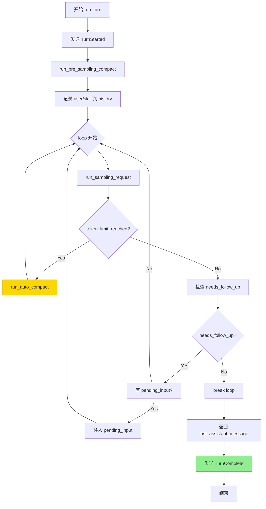

**算法要点**：

1. **双层循环结构**：外层 turn 生命周期，内层采样循环
2. **Compaction 嵌入点**：turn 开始前 + 采样后 token 超限时
3. **needs_follow_up 判断**：工具调用或 pending_input 触发继续
4. **优雅退出**：无后续工作时自然结束而非强制中断

#### 关键接口

| 接口 | 输入 | 输出 | 说明 | 代码位置 |
|-----|------|------|------|---------|
| `run_turn()` | `Arc<Session>`, `TurnContext` | `Option<String>` | turn 主循环 | `core/src/codex.rs` |
| `run_sampling_request()` | `&mut TurnState`, `bool` | `SamplingRequestResult` | 单轮采样 | `core/src/codex.rs` |
| `try_run_sampling_request()` | `&mut TurnState`, `bool` | `SamplingRequestResult` | 流式事件处理 | `core/src/codex.rs` |

---

### 3.2 ToolCallRuntime - 工具调用运行时

#### 职责定位

管理工具调用的并发执行、取消机制、以及工具结果与主循环的协调。

#### 关键特性

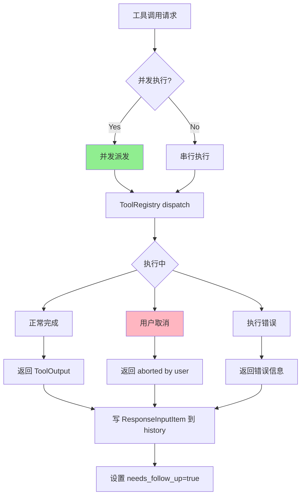

#### 并发控制策略

| 策略 | 场景 | 实现 |
|-----|------|------|
| 并发派发 | 工具支持并行 | `ToolCallRuntime::handle_tool_call()` |
| 串行收集 | 结果需按序注入 | `drain_in_flight()` |
| 取消传播 | 用户中断 | `CancellationToken` |

---

### 3.3 组件间协作时序

展示 `run_turn` 与工具系统如何协作完成一次带工具调用的采样。

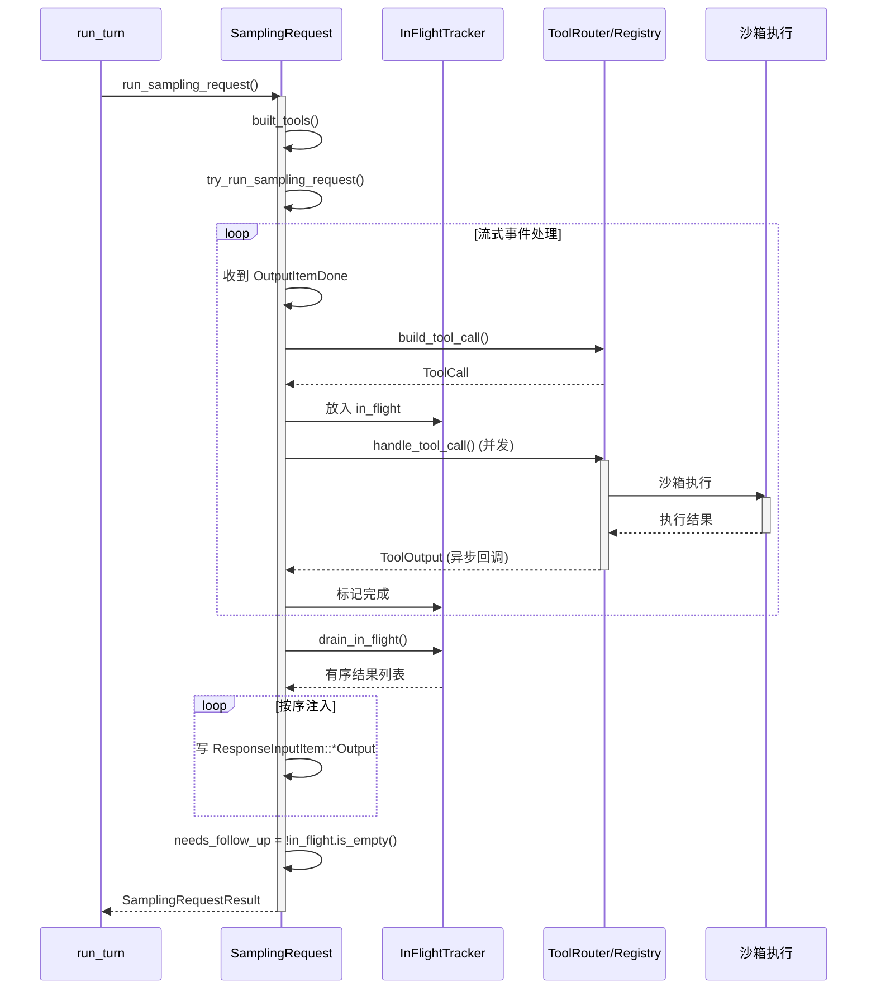

**协作要点**：

1. **run_turn 与 SamplingRequest**：单轮采样的完整封装，包括重试和流处理
2. **流与工具并行**：工具 future 与流处理并行，不阻塞 UI 更新
3. **结果顺序保证**：`drain_in_flight()` 确保工具结果按原始顺序注入 history

---

### 3.4 关键数据路径

#### 主路径（正常流程）

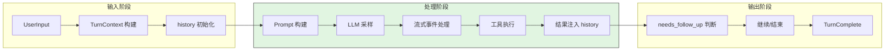

#### 异常路径（错误恢复）

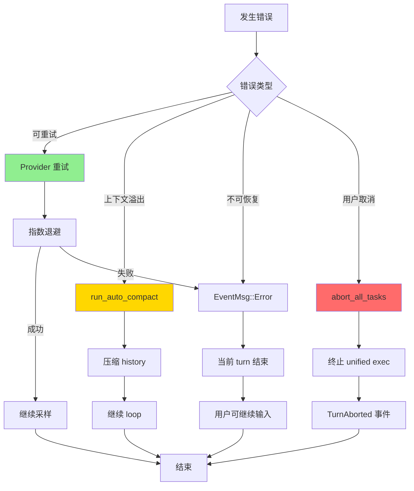

#### Compaction 路径（上下文管理）

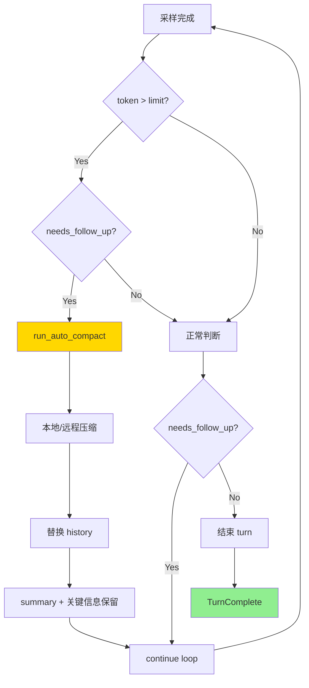

---

## 4. 端到端数据流转

### 4.1 正常流程（详细版）

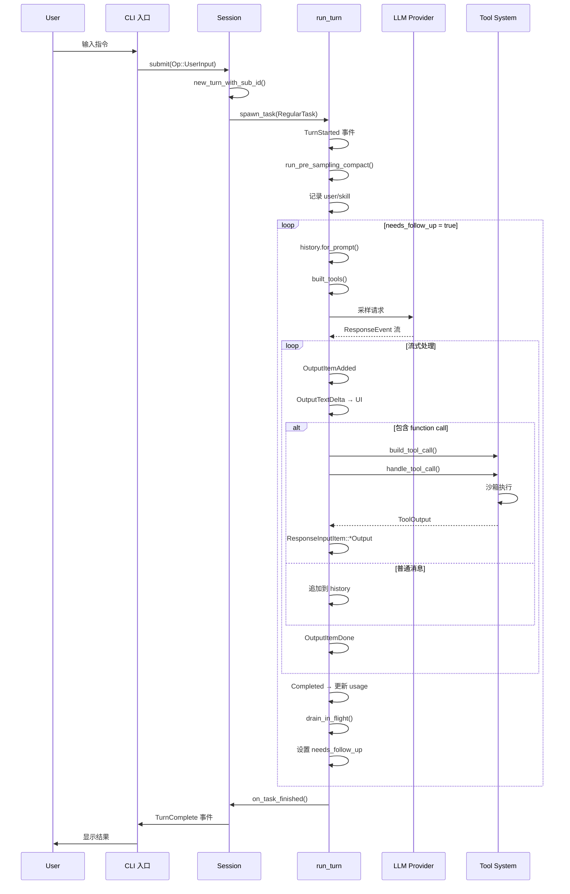

**数据变换详情**：

| 阶段 | 输入 | 处理 | 输出 | 代码位置 |
|-----|------|------|------|---------|
| 接收 | `Op::UserInput` | 构建 `TurnContext` | `TurnState` | `core/src/codex.rs` |
| Prompt | `history` + `tools` | `for_prompt()` + `built_tools()` | `Input` | `core/src/codex.rs` |
| 采样 | `Input` | Provider API 调用 | `ResponseEvent` 流 | `core/src/codex.rs` |
| 工具 | `ToolCall` | 沙箱执行 | `ToolOutput` | `core/src/tools/` |
| 输出 | `ToolOutput` | 格式化为 `ResponseInputItem` | 注入 history | `core/src/codex.rs` |

### 4.2 数据流向图

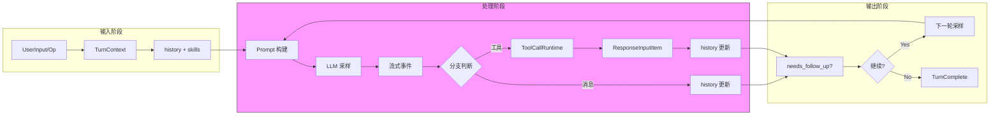

### 4.3 异常/边界流程

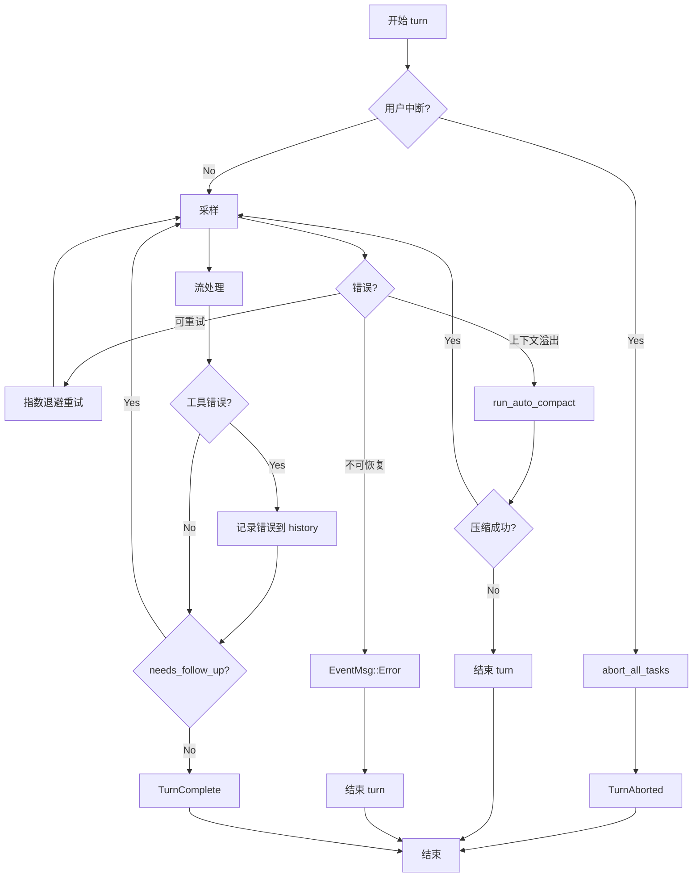

---

## 5. 关键代码实现

### 5.1 核心数据结构

```rust
// codex/codex-rs/core/src/codex.rs
// TurnState 结构 - 维护 turn 级状态

struct TurnState {
    /// 历史记录管理
    history: History,
    /// 在飞的工具调用
    in_flight: InFlightTracker,
    /// 是否需要继续采样
    needs_follow_up: bool,
    /// Token 使用情况
    total_usage_tokens: usize,
    /// 取消令牌
    cancellation_token: CancellationToken,
    /// 待处理的用户输入
    pending_input: Vec<InputItem>,
}

struct InFlightTracker {
    /// 按顺序跟踪的工具调用
    tool_calls: Vec<TrackedToolCall>,
    /// 已完成等待注入的结果
    completed: Vec<ResponseInputItem>,
}

struct TrackedToolCall {
    id: String,
    future: ToolFuture,
    order: usize,
}
```

**字段说明**：

| 字段 | 类型 | 用途 |
|-----|------|------|
| `history` | `History` | 对话历史，包括 user/assistant/tool 消息 |
| `in_flight` | `InFlightTracker` | 跟踪并发执行的工具调用 |
| `needs_follow_up` | `bool` | 控制主循环是否继续 |
| `total_usage_tokens` | `usize` | 累计 token 使用，用于触发 compaction |
| `cancellation_token` | `CancellationToken` | 支持用户取消操作 |
| `pending_input` | `Vec<InputItem>` | 采样期间注入的新输入 |

### 5.2 主链路代码

```rust
// codex/codex-rs/core/src/codex.rs
// run_turn() 核心循环

async fn run_turn(
    session: Arc<Session>,
    mut turn: TurnContext,
) -> Result<Option<String>, Error> {
    let mut state = TurnState::new(&turn);

    // 1. 发送 TurnStarted
    session.send_event(EventMsg::TurnStarted { ... });

    // 2. 预采样压缩
    if let Some(compact_result) = run_pre_sampling_compact(&mut state).await? {
        // 处理压缩结果
    }

    // 3. 记录用户输入和技能
    record_input_items(&mut state, turn.input_items);
    inject_skills(&mut state, turn.skills);

    // 4. 主循环
    loop {
        // 检查取消
        if state.cancellation_token.is_cancelled() {
            return Err(Error::Cancelled);
        }

        // 5. 单轮采样
        let result = run_sampling_request(&mut state, false).await?;

        // 6. 检查是否需要自动压缩
        if state.total_usage_tokens >= turn.auto_compact_limit
            && state.needs_follow_up
        {
            if let Some(compact_result) = run_auto_compact(&mut state).await? {
                continue;
            }
        }

        // 7. 检查是否需要继续
        if !state.needs_follow_up && state.pending_input.is_empty() {
            break;
        }

        // 8. 处理 pending_input
        if let Some(pending) = state.pending_input.pop() {
            record_input_item(&mut state, pending);
            state.needs_follow_up = true;
        }
    }

    // 9. 返回最后一条 assistant 消息
    Ok(state.last_assistant_message())
}
```

**代码要点**：

1. **状态机驱动**：`needs_follow_up` 控制循环，而非固定轮数
2. **Compaction 嵌入**：采样前后都检查 token 限制
3. **取消检查**：每次循环开始检查 `CancellationToken`
4. **Pending input 处理**：支持采样期间动态注入输入

### 5.3 关键调用链

```text
submit(Op::UserInput)                    [core/src/codex.rs:457]
  -> new_turn_with_sub_id()              [core/src/codex.rs:523]
    -> spawn_task(RegularTask)           [core/src/tasks/mod.rs:89]
      -> RegularTask::run()              [core/src/tasks/regular.rs:156]
        -> run_turn()                    [core/src/codex.rs:1204]
          - 初始化 TurnState
          - 发送 TurnStarted
          - run_pre_sampling_compact()

          -> run_sampling_request()      [core/src/codex.rs:1456]
            - built_tools()
            - try_run_sampling_request()
              - 流式处理 ResponseEvent
              - handle_tool_call() (如有)
            - 重试逻辑

          - 检查 needs_follow_up
          - 循环或结束

        - on_task_finished()             [core/src/tasks/regular.rs:234]
          - 发送 TurnComplete
```

---

## 6. 设计意图与 Trade-off

### 6.1 Codex 的选择

| 维度 | Codex 的选择 | 替代方案 | 取舍分析 |
|-----|-------------|---------|---------|
| 循环结构 | 事件驱动的 async/await | while 迭代（Kimi）/ 递归（Gemini） | 流式处理自然，但状态分散在多个 await 点 |
| 并发模型 | 并发派发、顺序收集 | 完全串行 / 完全并行 | 工具执行效率高，结果顺序有保证 |
| 上下文管理 | 前置压缩 + 采样后触发 | 无压缩（Codex 旧版）/ 强制截断 | 长会话可持续，但压缩可能丢失细节 |
| 任务生命周期 | Task 化（RegularTask） | 直接函数调用 | 支持取消/替换，但增加了抽象复杂度 |
| 工具集成 | 统一 Registry + Router | 硬编码分支 | 扩展性好，但动态分发有开销 |

### 6.2 为什么这样设计？

**核心问题**：如何在支持流式响应的同时，实现工具并发执行、用户中断、和长会话管理？

**Codex 的解决方案**：

- 代码依据：`core/src/codex.rs:1204-1456` (run_turn 实现)
- 设计意图：将 turn 作为独立 Task 管理，内部使用事件驱动的流处理
- 带来的好处：
  - UI 可实时感知流式输出（逐字符显示）
  - 工具调用可与流处理并行，不阻塞
  - 支持随时取消和替换当前 turn
  - 上下文溢出时可自动压缩而非崩溃
- 付出的代价：
  - 状态分散在多个 await 点，调试困难
  - 工具结果需要显式排序（drain_in_flight）
  - Task 抽象增加了理解成本

### 6.3 与其他项目的对比

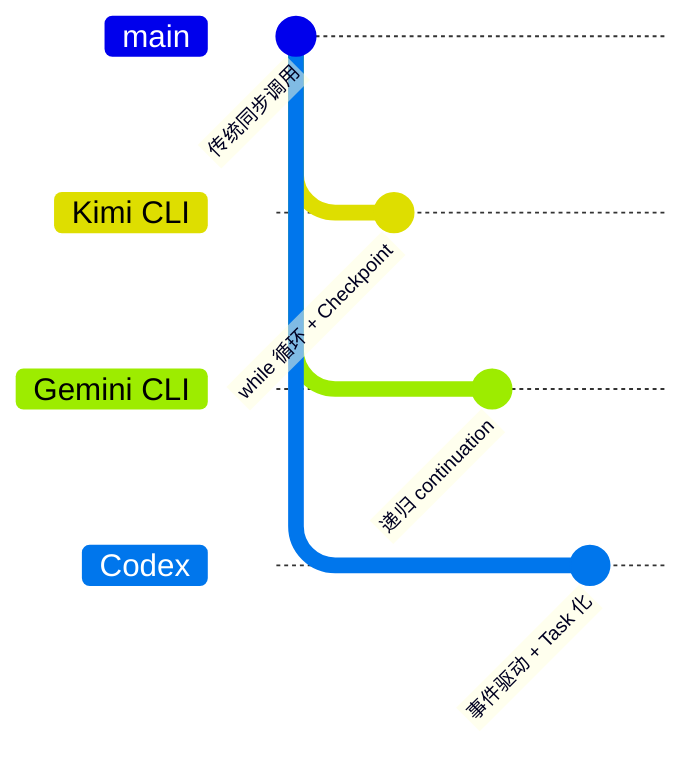

| 项目 | 核心差异 | 适用场景 |
|-----|---------|---------|
| Codex | 事件驱动流处理 + Task 生命周期 | 需要实时 UI 更新、频繁工具调用 |
| Kimi CLI | while 循环 + Checkpoint 回滚 | 需要状态持久化、对话可回溯 |
| Gemini CLI | 递归 continuation + 状态机 | 复杂状态流转、调度策略 |
| OpenCode | resetTimeoutOnProgress + streaming | 长时间运行的任务 |
| SWE-agent | forward_with_handling + autosubmit | 错误恢复和自动重试 |

**关键差异详解**：

| 特性 | Codex | Kimi CLI | Gemini CLI |
|-----|-------|----------|------------|
| 循环机制 | async/await + loop | while True | 递归调用 |
| 流式处理 | 原生支持 | 部分支持 | 支持 |
| 工具并发 | 并发派发 | 顺序执行 | 顺序执行 |
| 取消机制 | CancellationToken | Checkpoint 回滚 | abort signal |
| 上下文压缩 | 自动触发 | 手动触发 | 未明确 |

---

## 7. 边界情况与错误处理

### 7.1 终止条件

| 终止原因 | 触发条件 | 代码位置 |
|---------|---------|---------|
| 正常完成 | `needs_follow_up=false` 且无 pending_input | `core/src/codex.rs:1356` |
| 用户中断 | `Op::Interrupt` 或 cancellation token | `core/src/codex.rs:1289` |
| Turn 替换 | 新 turn 启动，abort_all_tasks | `core/src/tasks/mod.rs:156` |
| 达到最大步数 | 隐式通过 needs_follow_up 控制 | N/A |
| 上下文溢出 | `ContextWindowExceeded` | `core/src/codex.rs:1523` |
| 使用限制 | `UsageLimitReached` | `core/src/codex.rs:1527` |

### 7.2 超时/资源限制

```rust
// codex/codex-rs/core/src/codex.rs
// Token 限制检查

if state.total_usage_tokens >= turn.auto_compact_limit
    && state.needs_follow_up
{
    // 触发自动压缩
    run_auto_compact(&mut state).await?;
}

// Provider 级重试配置
let retry_config = RetryConfig {
    max_retries: 3,
    backoff_factor: 2.0,
    ..Default::default()
};
```

**资源限制策略**：

| 资源 | 限制方式 | 处理方式 |
|-----|---------|---------|
| Token | `auto_compact_limit` | 触发 compaction |
| 重试次数 | `max_retries` | 指数退避后报错 |
| 并发工具 | `in_flight` 队列 | 按序执行，不限制数量 |

### 7.3 错误恢复策略

| 错误类型 | 处理策略 | 代码位置 |
|---------|---------|---------|
| Provider 可重试错误 | 指数退避重试 | `core/src/codex.rs:1498` |
| Provider 不可重试 | 上抛错误，turn 结束 | `core/src/codex.rs:1523` |
| 工具执行错误 | 记录错误到 history | `core/src/tools/runtime.rs:267` |
| 用户取消 | 终止工具，返回 aborted | `core/src/tools/runtime.rs:189` |
| 沙箱错误 | 返回错误输出，可重试 | `core/src/tools/sandbox.rs:445` |

---

## 8. 关键代码索引

| 功能 | 文件 | 行号 | 说明 |
|-----|------|------|------|
| 入口 | `core/src/codex.rs` | 457 | `submit()` 会话级入口 |
| 核心 | `core/src/codex.rs` | 1204 | `run_turn()` turn 主循环 |
| 采样 | `core/src/codex.rs` | 1456 | `run_sampling_request()` |
| 流处理 | `core/src/codex.rs` | 1623 | `try_run_sampling_request()` |
| 工具运行时 | `core/src/tools/runtime.rs` | 89 | `ToolCallRuntime` |
| 工具路由 | `core/src/tools/router.rs` | 156 | `ToolRouter::dispatch_tool_call()` |
| Task 管理 | `core/src/tasks/regular.rs` | 156 | `RegularTask::run()` |
| Compaction | `core/src/codex.rs` | 2345 | `run_auto_compact()` |
| 取消机制 | `core/src/cancellation.rs` | 45 | `CancellationToken` |

---

## 9. 延伸阅读

- 前置知识：`docs/codex/01-codex-overview.md`
- 相关机制：`docs/codex/05-codex-tool-system.md`、`docs/codex/07-codex-memory-context.md`
- 深度分析：`docs/codex/questions/codex-sandbox-security.md`
- 跨项目对比：`docs/comm/comm-agent-loop-comparison.md`

---

*✅ Verified: 基于 codex/codex-rs/core/src/codex.rs:1204 等源码分析*
*基于版本：2026-02-08 | 最后更新：2026-02-24*
