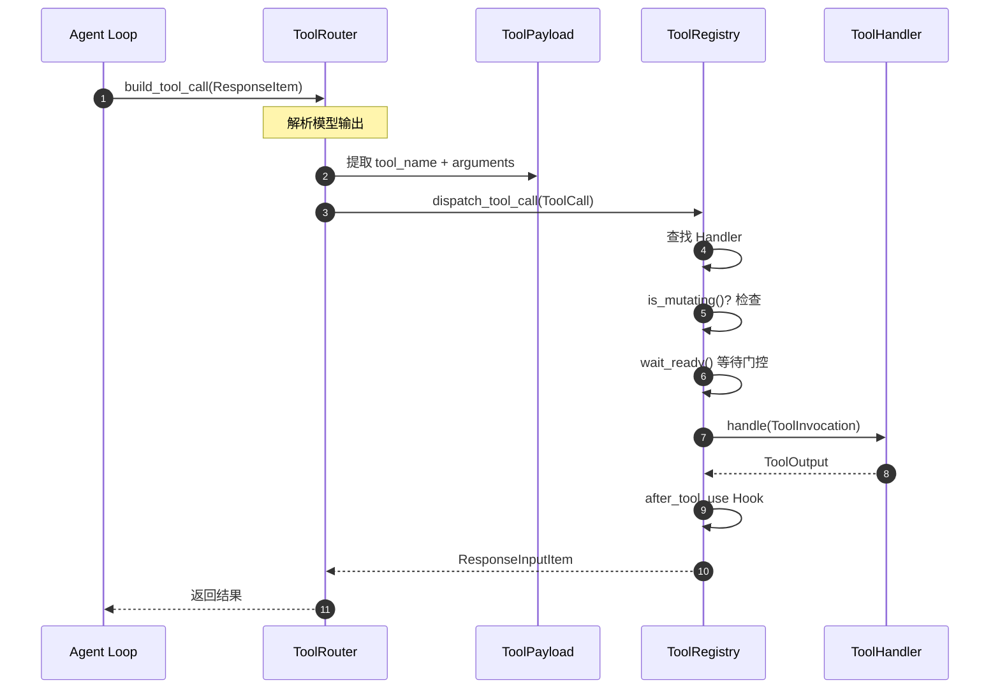
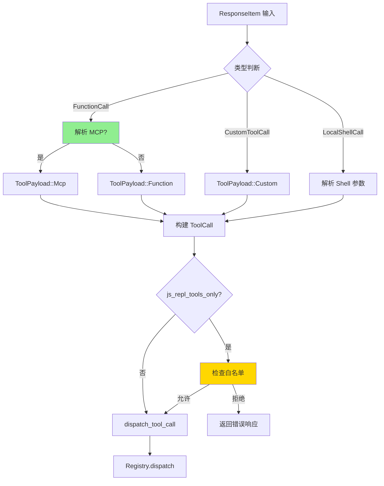
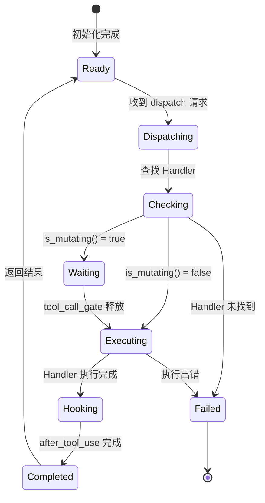
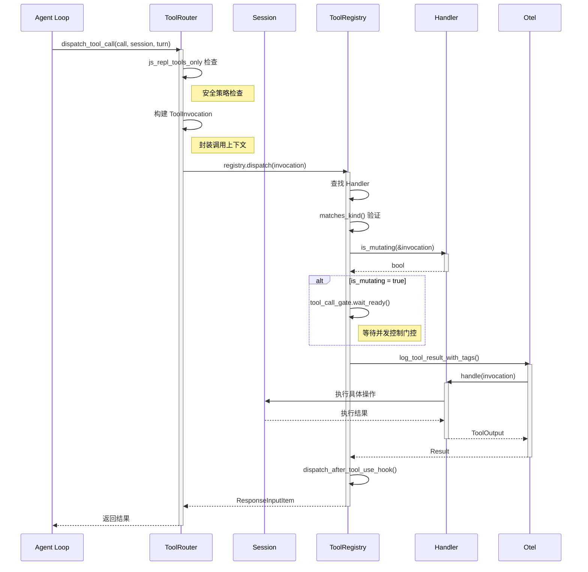
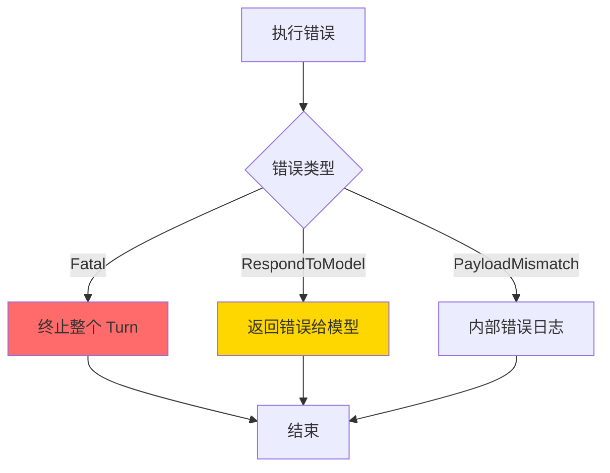
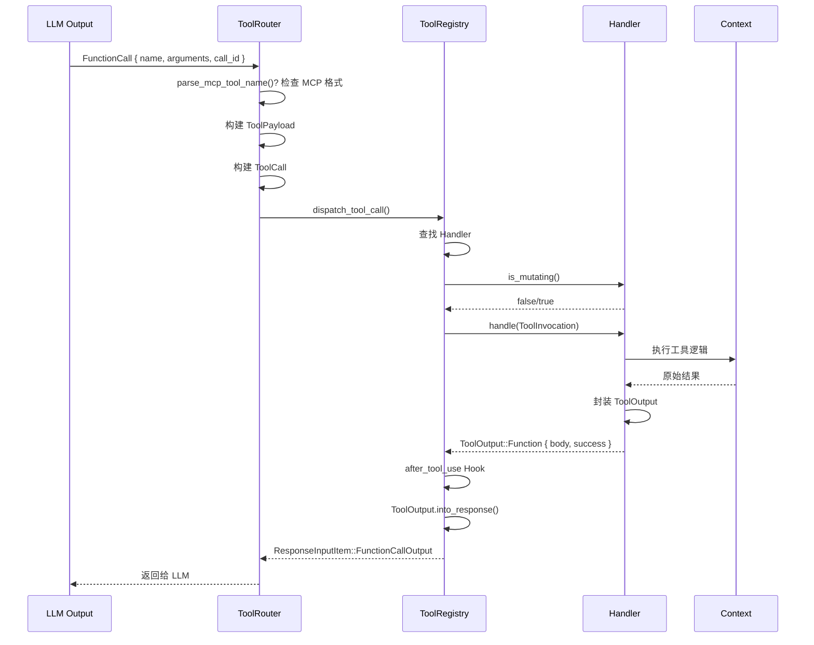
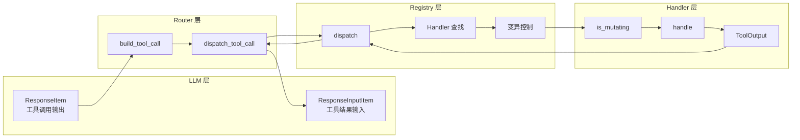

# Tool System（codex）

## TL;DR（结论先行）

一句话定义：Codex 的 Tool System 是**配置驱动的工具注册与调度框架**，实现从模型输出到工具执行的完整链路。

Codex 的核心取舍：**配置驱动 + Handler 注册 + 统一调度**（对比 Gemini CLI 的 Zod Schema 定义、Kimi CLI 的 YAML 配置）

---

## 1. 为什么需要这个机制？（解决什么问题）

### 1.1 问题场景

没有 Tool System：模型输出工具调用指令 → 需要手动解析 → 手动执行 → 手动格式化结果返回

有 Tool System：
```
模型输出: {"name": "shell", "arguments": "{\"command\": \"ls\"}"}
  ↓ ToolRouter 自动解析为 ToolCall
  ↓ ToolRegistry 查找对应 Handler
  ↓ ShellHandler 执行命令
  ↓ 结果自动格式化为 ResponseInputItem 返回给模型
```

### 1.2 核心挑战

| 挑战 | 不解决的后果 |
|-----|-------------|
| 工具发现 | 模型不知道有哪些工具可用 |
| 调用解析 | 模型输出格式不统一，难以解析 |
| 并发控制 | 变异工具并发执行导致数据竞争 |
| 扩展性 | 新增工具需要修改核心代码 |
| 可观测性 | 无法追踪工具调用链 |

---

## 2. 整体架构（ASCII 图）

### 2.1 在系统中的位置

```text
┌─────────────────────────────────────────────────────────────┐
│ Agent Loop / Session Runtime                                 │
│ codex-rs/core/src/loop.rs                                    │
└───────────────────────┬─────────────────────────────────────┘
                        │ 调用 ToolRouter
                        ▼
┌─────────────────────────────────────────────────────────────┐
│ ▓▓▓ Tool System ▓▓▓                                         │
│ codex-rs/core/src/tools/                                     │
│ - ToolRouter    : 工具调用解析与分发                         │
│ - ToolRegistry  : Handler 注册与执行                         │
│ - ToolSpec      : 工具定义与配置                             │
└───────────────────────┬─────────────────────────────────────┘
                        │ 依赖/调用
        ┌───────────────┼───────────────┐
        ▼               ▼               ▼
┌──────────────┐ ┌──────────────┐ ┌──────────────┐
│ Shell Handler│ │ MCP Handler  │ │ File Handler │
│ 命令执行     │ │ 外部工具     │ │ 文件操作     │
└──────────────┘ └──────────────┘ └──────────────┘
```

### 2.2 核心组件职责

| 组件 | 职责 | 代码位置 |
|-----|------|---------|
| `ToolRouter` | 工具调用解析与分发入口 | `tools/router.rs:1` |
| `ToolRegistry` | Handler 注册管理与执行调度 | `tools/registry.rs:1` |
| `ToolHandler` | 工具执行抽象接口 | `tools/registry.rs:160` |
| `ToolsConfig` | 工具集配置定义 | `tools/spec.rs:97` |
| `ToolInvocation` | 工具调用上下文 | `tools/context.rs:424` |

### 2.3 核心组件交互关系



**关键交互说明**：

| 步骤 | 交互内容 | 设计意图 |
|-----|---------|---------|
| 1 | Agent Loop 发起工具调用解析 | 统一入口，解耦模型输出格式 |
| 2 | 解析为结构化 ToolCall | 标准化内部表示 |
| 3 | Registry 分发执行 | 集中管理所有工具 Handler |
| 4-5 | 变异检测与门控等待 | 确保写操作线程安全 |
| 6 | Handler 执行具体逻辑 | 职责分离，易于扩展 |
| 7 | Hook 触发 | 可插拔的后处理机制 |
| 8 | 返回标准化响应 | 统一格式，便于 LLM 消费 |

---

## 3. 核心组件详细分析

### 3.1 ToolRouter 内部结构

#### 职责定位

ToolRouter 是 Tool System 的入口，负责从模型输出解析工具调用，并分发到 Registry 执行。

#### 内部数据流

```text
┌─────────────────────────────────────────────────────────────┐
│  输入层                                                      │
│  ├── ResponseItem::FunctionCall ──► 解析参数                 │
│  ├── ResponseItem::CustomToolCall ──► 自定义处理             │
│  └── ResponseItem::LocalShellCall ──► Shell 参数提取         │
└──────────────────────────┬──────────────────────────────────┘
                           ▼
┌─────────────────────────────────────────────────────────────┐
│  处理层                                                      │
│  ├── 工具名解析: mcp__server__tool 格式处理                   │
│  ├── Payload 封装: ToolPayload::Function/Custom/LocalShell/Mcp│
│  └── 调用构建: ToolCall { name, call_id, payload }           │
└──────────────────────────┬──────────────────────────────────┘
                           ▼
┌─────────────────────────────────────────────────────────────┐
│  输出层                                                      │
│  ├── dispatch_tool_call() 分发到 Registry                    │
│  └── 错误处理: failure_response() 格式化                     │
└─────────────────────────────────────────────────────────────┘
```

#### 关键算法逻辑



#### 关键接口

| 接口 | 输入 | 输出 | 说明 | 代码位置 |
|-----|------|------|------|---------|
| `from_config()` | ToolsConfig + MCP tools | ToolRouter | 从配置构建 | `router.rs:283` |
| `build_tool_call()` | ResponseItem | Option<ToolCall> | 解析工具调用 | `router.rs:310` |
| `dispatch_tool_call()` | ToolCall + Session | ResponseInputItem | 分发执行 | `router.rs:372` |
| `specs()` | - | Vec<ToolSpec> | 获取工具定义列表 | `router.rs:295` |

### 3.2 ToolRegistry 内部结构

#### 职责定位

ToolRegistry 负责管理所有 ToolHandler 的注册，并执行工具调度的核心逻辑，包括变异检测和门控控制。

#### 状态机图



#### 关键算法逻辑

```rust
// tools/registry.rs:194-231
pub async fn dispatch(&self, invocation: ToolInvocation) -> Result<...> {
    // 1. 查找 Handler
    let handler = self.handler(tool_name.as_ref())?;

    // 2. 类型匹配检查
    if !handler.matches_kind(&invocation.payload) {
        return Err(FunctionCallError::Fatal(...));
    }

    // 3. 变异检测
    let is_mutating = handler.is_mutating(&invocation).await;

    // 4. 变异操作门控
    if is_mutating {
        invocation.turn.tool_call_gate.wait_ready().await;
    }

    // 5. 执行工具
    let result = handler.handle(invocation).await;

    // 6. Hook 触发
    dispatch_after_tool_use_hook(...).await;

    result
}
```

**算法要点**：

1. **门控机制**：变异操作需等待 `tool_call_gate`，确保并发安全
2. **类型安全**：`matches_kind()` 在运行时验证 Handler 与 Payload 匹配
3. **Hook 扩展**：`after_tool_use` 支持可插拔的后处理逻辑
4. **错误分类**：`FunctionCallError` 区分 Fatal（终止）和 RespondToModel（可恢复）

### 3.3 组件间协作时序



### 3.4 关键数据路径

#### 主路径（正常流程）

```mermaid
flowchart LR
    subgraph Input["输入阶段"]
        I1[ResponseItem] --> I2[ToolRouter.build_tool_call]
        I2 --> I3[ToolCall]
    end

    subgraph Process["处理阶段"]
        P1[ToolRegistry.dispatch] --> P2[Handler.is_mutating]
        P2 --> P3[tool_call_gate.wait]
        P3 --> P4[Handler.handle]
        P4 --> P5[after_tool_use Hook]
    end

    subgraph Output["输出阶段"]
        O1[ToolOutput] --> O2[ResponseInputItem]
        O2 --> O3[返回 Agent Loop]
    end

    I3 --> P1
    P5 --> O1

    style Process fill:#e1f5e1,stroke:#333
```



#### 异常路径（错误恢复）



---

## 4. 端到端数据流转

### 4.1 正常流程（详细版）



**数据变换详情**：

| 阶段 | 输入 | 处理 | 输出 | 代码位置 |
|-----|------|------|------|---------|
| 解析 | ResponseItem | 提取 name/args/call_id | ToolCall | `router.rs:310` |
| 分发 | ToolCall | 查找 Handler + 变异检查 | ToolInvocation | `router.rs:398` |
| 执行 | ToolInvocation | Handler 具体逻辑 | ToolOutput | `registry.rs:220` |
| 响应 | ToolOutput | 格式化为模型输入 | ResponseInputItem | `context.rs:491` |

### 4.2 数据流向图



---

## 5. 关键代码实现

### 5.1 核心数据结构

```rust
// codex-rs/core/src/tools/context.rs:424-431
pub struct ToolInvocation {
    pub session: Arc<Session>,           // 会话上下文
    pub turn: Arc<TurnContext>,          // Turn 上下文
    pub tracker: SharedTurnDiffTracker,  // 变更追踪
    pub call_id: String,                 // 调用 ID
    pub tool_name: String,               // 工具名
    pub payload: ToolPayload,            // 调用负载
}

// codex-rs/core/src/tools/context.rs:437-452
pub enum ToolPayload {
    Function { arguments: String },
    Custom { input: String },
    LocalShell { params: ShellToolCallParams },
    Mcp { server: String, tool: String, raw_arguments: String },
}
```

**字段说明**：

| 字段 | 类型 | 用途 |
|-----|------|------|
| `session` | `Arc<Session>` | 共享会话状态 |
| `turn` | `Arc<TurnContext>` | 当前 Turn 上下文，包含 tool_call_gate |
| `tracker` | `SharedTurnDiffTracker` | 文件变更追踪 |
| `payload` | `ToolPayload` | 支持多种调用格式 |

### 5.2 主链路代码

```rust
// codex-rs/core/src/tools/registry.rs:194-231
impl ToolRegistry {
    pub async fn dispatch(
        &self,
        invocation: ToolInvocation,
    ) -> Result<ResponseInputItem, FunctionCallError> {
        let tool_name = invocation.tool_name.clone();

        // 1. 查找 Handler
        let handler = match self.handler(tool_name.as_ref()) {
            Some(handler) => handler,
            None => return Err(FunctionCallError::RespondToModel(...)),
        };

        // 2. 检查 Payload 类型匹配
        if !handler.matches_kind(&invocation.payload) {
            return Err(FunctionCallError::Fatal(...));
        }

        // 3. 检查是否为变异操作
        let is_mutating = handler.is_mutating(&invocation).await;

        // 4. 如果是变异操作，等待 tool_call_gate
        if is_mutating {
            invocation.turn.tool_call_gate.wait_ready().await;
        }

        // 5. 执行工具
        let result = handler.handle(invocation).await;

        // 6. 触发 after_tool_use hook
        dispatch_after_tool_use_hook(...).await;

        // 7. 返回结果
        match result {
            Ok(output) => Ok(output.into_response(...)),
            Err(err) => Err(err),
        }
    }
}
```

**代码要点**：

1. **双层查找**：先查 Handler，再验证类型匹配，防止误调用
2. **变异门控**：`is_mutating()` + `tool_call_gate` 确保写操作串行化
3. **错误分类**：`RespondToModel` 可恢复错误返回给 LLM，`Fatal` 终止执行
4. **Hook 扩展**：`after_tool_use` 支持监控、审计等后处理

### 5.3 关键调用链

```text
dispatch_tool_call()      [router.rs:372]
  -> ToolRegistry::dispatch()    [registry.rs:194]
    -> handler.is_mutating()     [registry.rs:212]
      - ShellHandler: 检测命令是否为写操作
    -> tool_call_gate.wait_ready()  [turn.rs:?]
      - 等待并发控制信号
    -> handler.handle()          [handlers/*.rs]
      - ShellHandler::handle()   [handlers/shell.rs:?]
      - McpHandler::handle()     [handlers/mcp.rs:256]
      - FileHandler::handle()    [handlers/file.rs:?]
```

---

## 6. 设计意图与 Trade-off

### 6.1 Codex 的选择

| 维度 | Codex 的选择 | 替代方案 | 取舍分析 |
|-----|-------------|---------|---------|
| 工具定义 | Rust struct + ToolsConfig | Zod Schema (Gemini) / YAML (Kimi) | 编译期类型安全，但需要重新编译 |
| Handler 模式 | Trait-based 注册 | 函数映射表 / 反射调用 | 统一接口，易于单元测试 |
| 并发控制 | tool_call_gate 门控 | 无控制 (Gemini) / 完全串行 | 读操作并行，写操作串行 |
| MCP 支持 | 原生集成 | 插件化 (Kimi) | 开箱即用，但增加核心复杂度 |
| 错误处理 | 分层错误类型 | 统一错误码 | 精确区分可恢复/致命错误 |

### 6.2 为什么这样设计？

**核心问题**：如何在保证安全的前提下，支持灵活的扩展和高效的并发？

**Codex 的解决方案**：
- 代码依据：`registry.rs:212-217` 的 `is_mutating()` 检查 + `tool_call_gate.wait_ready()`
- 设计意图：通过声明式的变异检测，让 Handler 决定是否需要串行执行
- 带来的好处：
  - 读操作可以并行（如多个文件读取）
  - 写操作自动串行（避免数据竞争）
  - Handler 可自定义变异判断逻辑（如某些 shell 命令是只读的）
- 付出的代价：
  - Handler 需要正确实现 `is_mutating()`
  - 门控增加了调用延迟

### 6.3 与其他项目的对比

| 项目 | 核心差异 | 适用场景 |
|-----|---------|---------|
| Codex | Trait-based Handler + 变异门控 | 需要精细并发控制的场景 |
| Gemini CLI | Zod Schema 定义工具 | 快速原型，TypeScript 生态 |
| Kimi CLI | YAML 配置 + 命令映射 | 简单工具，快速扩展 |
| OpenCode | 插件化工具系统 | 高度可扩展的第三方工具 |

---

## 7. 边界情况与错误处理

### 7.1 终止条件

| 终止原因 | 触发条件 | 代码位置 |
|---------|---------|---------|
| Handler 未找到 | tool_name 不在 registry 中 | `registry.rs:201` |
| Payload 类型不匹配 | handler.kind() 与 payload 不匹配 | `registry.rs:207` |
| Hook 中止 | after_tool_use 返回 FailedAbort | `registry.rs:545` |
| 执行错误 | handler.handle() 返回 Err | `registry.rs:220` |

### 7.2 并发控制

```rust
// 变异操作门控（概念代码）
if is_mutating {
    // 等待其他变异操作完成
    invocation.turn.tool_call_gate.wait_ready().await;
}
// 执行变异操作
let result = handler.handle(invocation).await;
```

### 7.3 错误恢复策略

| 错误类型 | 处理策略 | 代码位置 |
|---------|---------|---------|
| `RespondToModel` | 将错误信息返回给 LLM，继续对话 | `router.rs:411` |
| `Fatal` | 向上传播，终止当前 Turn | `router.rs:410` |
| `MissingLocalShellCallId` | 返回格式错误给模型 | `router.rs:344` |
| `PayloadMismatch` | 记录内部错误，返回 Fatal | `registry.rs:209` |

---

## 8. 关键代码索引

| 功能 | 文件 | 行号 | 说明 |
|-----|------|------|------|
| 入口 | `tools/router.rs` | 372 | ToolRouter::dispatch_tool_call |
| 核心 | `tools/registry.rs` | 194 | ToolRegistry::dispatch |
| Handler Trait | `tools/registry.rs` | 163 | ToolHandler trait 定义 |
| 配置 | `tools/spec.rs` | 97 | ToolsConfig 结构定义 |
| 上下文 | `tools/context.rs` | 424 | ToolInvocation 结构 |
| MCP Handler | `tools/handlers/mcp.rs` | 256 | McpHandler::handle |
| Shell Handler | `tools/handlers/shell.rs` | - | ShellHandler 实现 |

---

## 9. 延伸阅读

- 前置知识：`04-codex-agent-loop.md`
- 相关机制：`06-codex-mcp-integration.md`
- 深度分析：`docs/codex/questions/codex-tool-security.md`

---

*✅ Verified: 基于 codex/codex-rs/core/src/tools/ 源码分析*
*基于版本：2026-02-08 | 最后更新：2026-02-24*
