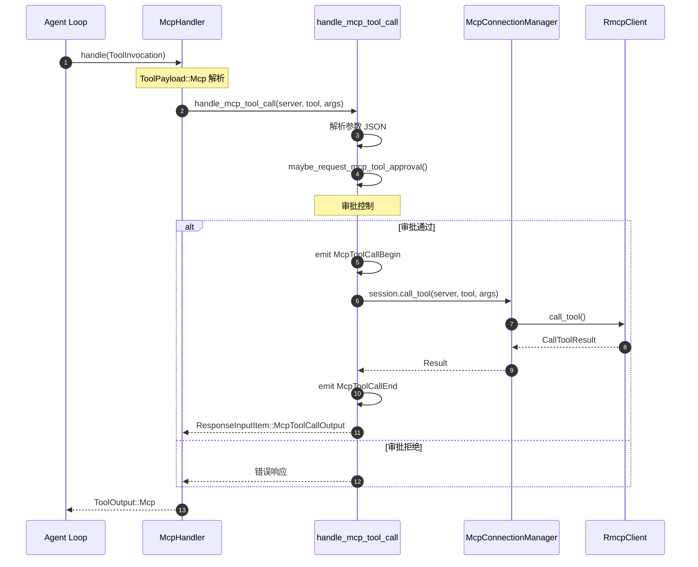
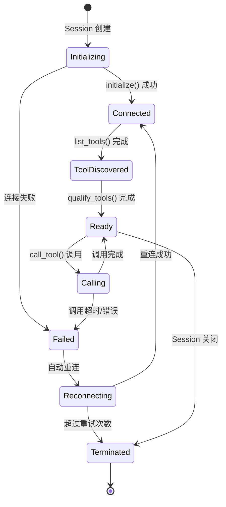
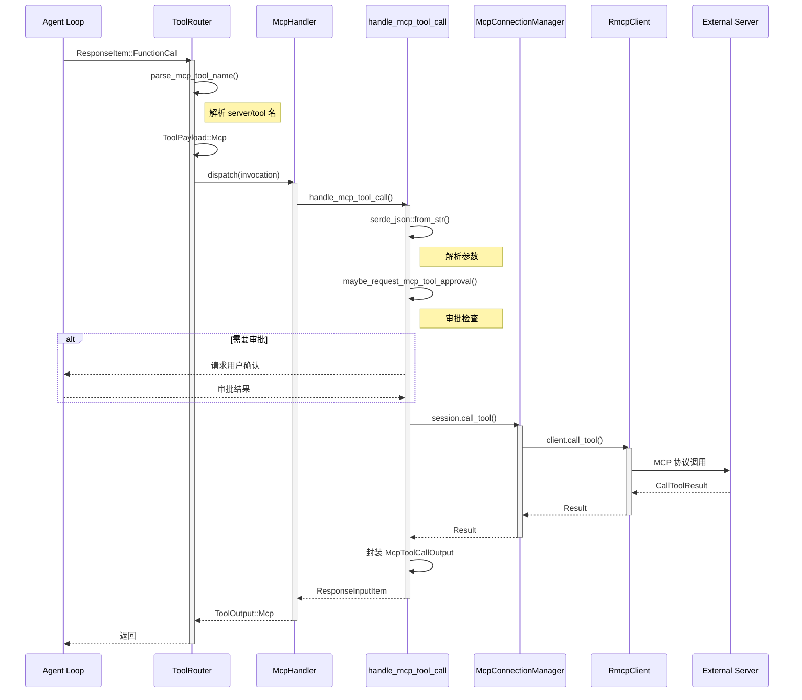
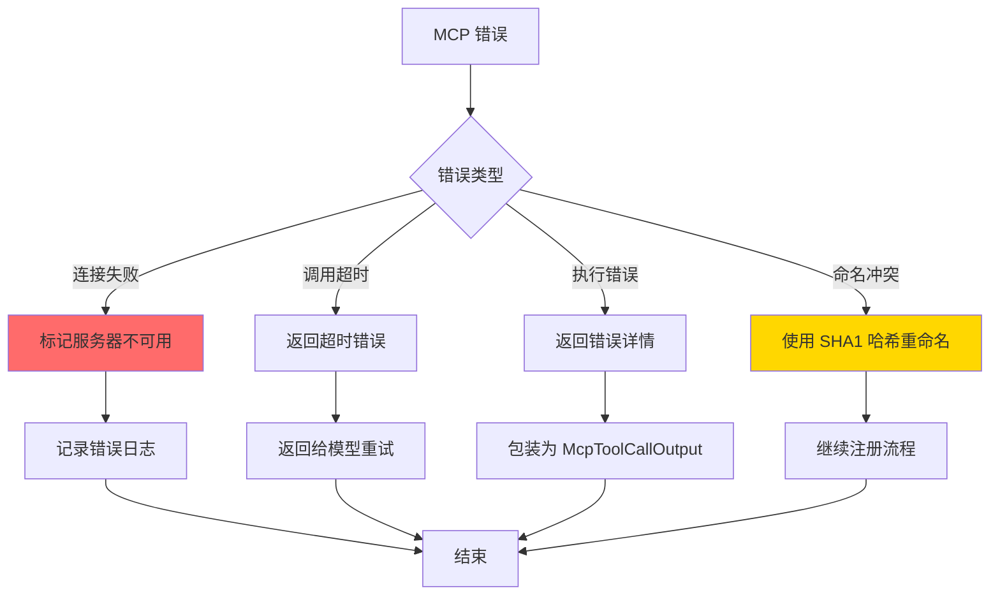
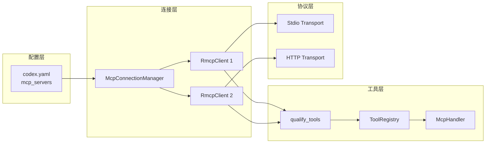

# MCP 集成（codex）

## TL;DR（结论先行）

一句话定义：Codex 的 MCP 集成是**中心化管理的外部工具接入框架**，通过标准化协议将 MCP 服务器的能力无缝融入 Agent Loop。

Codex 的核心取舍：**中心化连接管理 + 统一命名空间 + 原生集成**（对比 Kimi CLI 的插件化 MCP、OpenCode 的独立 MCP 进程）

---

## 1. 为什么需要这个机制？（解决什么问题）

### 1.1 问题场景

没有 MCP 集成：每个外部工具需要单独开发和维护适配代码

有 MCP 集成：
```
配置: mcp_servers: { filesystem: { command: npx ... } }
  ↓ 自动发现: list_tools() 获取服务器工具列表
  ↓ 自动注册: 工具名 mcp__filesystem__read_file 注册到 ToolRegistry
  ↓ 自动调用: 模型输出 → McpHandler → call_tool() → 远程执行
  ↓ 自动响应: 结果格式化为 ResponseInputItem 返回
```

### 1.2 核心挑战

| 挑战 | 不解决的后果 |
|-----|-------------|
| 服务器管理 | 多服务器连接生命周期复杂 |
| 工具命名冲突 | 不同服务器同名工具互相覆盖 |
| 传输协议 | 需要支持多种通信方式 (stdio/http) |
| 审批控制 | 外部工具可能执行危险操作 |
| 错误隔离 | 单个服务器故障影响整体稳定性 |

---

## 2. 整体架构（ASCII 图）

### 2.1 在系统中的位置

```text
┌─────────────────────────────────────────────────────────────┐
│ Agent Loop / Session Runtime                                 │
│ codex-rs/core/src/loop.rs                                    │
└───────────────────────┬─────────────────────────────────────┘
                        │ 调用 MCP 工具
                        ▼
┌─────────────────────────────────────────────────────────────┐
│ ▓▓▓ MCP Integration ▓▓▓                                     │
│ codex-rs/core/src/mcp*.rs                                   │
│ - McpConnectionManager : 多服务器连接管理                    │
│ - McpHandler           : 统一工具处理器                      │
│ - handle_mcp_tool_call : 工具调用执行                        │
└───────────────────────┬─────────────────────────────────────┘
                        │ 依赖/调用
        ┌───────────────┼───────────────┐
        ▼               ▼               ▼
┌──────────────┐ ┌──────────────┐ ┌──────────────┐
│ RmcpClient   │ │ RmcpClient   │ │ ...          │
│ (stdio)      │ │ (http)       │ │              │
└──────┬───────┘ └──────┬───────┘ └──────────────┘
       │                │
       ▼                ▼
┌──────────────┐ ┌──────────────┐
│ MCP Server 1 │ │ MCP Server 2 │
│ filesystem   │ │ github       │
└──────────────┘ └──────────────┘
```

### 2.2 核心组件职责

| 组件 | 职责 | 代码位置 |
|-----|------|---------|
| `McpConnectionManager` | 多服务器连接生命周期管理 | `mcp_connection_manager.rs:225` |
| `McpHandler` | 统一处理所有 MCP 工具调用 | `tools/handlers/mcp.rs:248` |
| `handle_mcp_tool_call` | 执行具体 MCP 工具调用逻辑 | `mcp_tool_call.rs:285` |
| `qualify_tools` | 工具命名空间处理 | `mcp_connection_manager.rs:181` |
| `AsyncManagedClient` | rmcp SDK 客户端包装 | `mcp_connection_manager.rs:226` |

### 2.3 核心组件交互关系



**关键交互说明**：

| 步骤 | 交互内容 | 设计意图 |
|-----|---------|---------|
| 1 | McpHandler 接收调用 | 统一入口，解耦具体服务器 |
| 2 | 参数解析 | 验证 JSON 格式，提前发现错误 |
| 3 | 审批检查 | 危险工具需要用户确认 |
| 4-5 | 调用远程服务器 | 通过 ConnectionManager 路由到正确服务器 |
| 6 | 事件通知 | UI 可展示调用进度 |
| 7 | 结果封装 | 统一格式返回 |

---

## 3. 核心组件详细分析

### 3.1 McpConnectionManager 内部结构

#### 职责定位

McpConnectionManager 是 MCP 集成的核心枢纽，负责管理多个 MCP 服务器的连接、工具发现和生命周期。

#### 状态机图



#### 内部数据流

```text
┌─────────────────────────────────────────────────────────────┐
│  输入层                                                      │
│  ├── codex.yaml 配置加载                                     │
│  │   └── mcp_servers: { server1, server2, ... }             │
│  └── 默认配置合并 (Codex Apps MCP)                          │
└──────────────────────────┬──────────────────────────────────┘
                           ▼
┌─────────────────────────────────────────────────────────────┐
│  处理层                                                      │
│  ├── 为每个 server 创建 RmcpClient                           │
│  │   ├── Stdio transport: command + args                    │
│  │   └── StreamableHttp: url + bearer_token                 │
│  ├── initialize() MCP 握手                                   │
│  ├── list_tools() 获取工具列表                              │
│  └── qualify_tools() 命名空间处理                           │
│       └── mcp__{server}__{tool} 格式转换                     │
└──────────────────────────┬──────────────────────────────────┘
                           ▼
┌─────────────────────────────────────────────────────────────┐
│  输出层                                                      │
│  ├── HashMap<String, AsyncManagedClient>                    │
│  ├── HashMap<String, ToolInfo> (qualified_tools)            │
│  └── 工具注册到 ToolRegistry                                │
└─────────────────────────────────────────────────────────────┘
```

#### 关键算法逻辑

```rust
// mcp_connection_manager.rs:181-202
fn qualify_tools<I>(tools: I) -> HashMap<String, ToolInfo>
where I: IntoIterator<Item = ToolInfo> {
    for tool in tools {
        // 原始格式: mcp__{server_name}__{tool_name}
        let qualified_name_raw = format!(
            "mcp{}{}{}{}",
            MCP_TOOL_NAME_DELIMITER,
            tool.server_name,
            MCP_TOOL_NAME_DELIMITER,
            tool.tool_name
        );

        // 清理非法字符（OpenAI API 限制：^[a-zA-Z0-9_-]+$）
        let mut qualified_name = sanitize_responses_api_tool_name(&qualified_name_raw);

        // 长度限制处理（超过64字符使用 SHA1 哈希）
        if qualified_name.len() > MAX_TOOL_NAME_LENGTH {
            let sha1_str = sha1_hex(&qualified_name_raw);
            let prefix_len = MAX_TOOL_NAME_LENGTH - sha1_str.len();
            qualified_name = format!("{}{}", &qualified_name[..prefix_len], sha1_str);
        }

        qualified_tools.insert(qualified_name, tool);
    }
}
```

**算法要点**：

1. **命名空间隔离**：`mcp__server__tool` 格式避免跨服务器冲突
2. **字符清理**：移除 OpenAI API 不允许的特殊字符
3. **长度处理**：64 字符限制，超长使用 SHA1 哈希保证唯一性
4. **元数据保留**：原始工具信息保留在 ToolInfo 中

### 3.2 McpHandler 内部结构

#### 职责定位

McpHandler 是 ToolHandler trait 的实现，统一处理所有 MCP 工具调用，是 MCP 与 Tool System 的桥梁。

#### 关键接口

| 接口 | 输入 | 输出 | 说明 | 代码位置 |
|-----|------|------|------|---------|
| `kind()` | - | ToolKind::Mcp | 标识为 MCP 类型 | `handlers/mcp.rs:252` |
| `matches_kind()` | ToolPayload | bool | 验证类型匹配 | `registry.rs:167` |
| `handle()` | ToolInvocation | ToolOutput | 执行工具调用 | `handlers/mcp.rs:256` |

### 3.3 组件间协作时序



### 3.4 关键数据路径

#### 主路径（正常流程）

```mermaid
flowchart LR
    subgraph Input["输入阶段"]
        I1[codex.yaml 配置] --> I2[McpConnectionManager::new]
        I2 --> I3[initialize + list_tools]
    end

    subgraph Process["处理阶段"]
        P1[qualify_tools 命名] --> P2[ToolRegistry 注册]
        P2 --> P3[Agent Loop 工具发现]
        P3 --> P4[模型输出 tool_call]
        P4 --> P5[McpHandler::handle]
        P5 --> P6[call_tool 远程执行]
    end

    subgraph Output["输出阶段"]
        O1[CallToolResult] --> O2[McpToolCallOutput]
        O2 --> O3[返回模型]
    end

    I3 --> P1
    P6 --> O1

    style Process fill:#e1f5e1,stroke:#333
```



#### 异常路径（错误恢复）



---

## 4. 端到端数据流转

### 4.1 正常流程（详细版）

```mermaid
sequenceDiagram
    participant Config as codex.yaml
    participant Session as Session::new
    participant Mgr as McpConnectionManager
    participant Router as ToolRouter
    participant Loop as Agent Loop
    participant LLM as LLM

    Config->>Session: mcp_servers 配置
    Session->>Mgr: new(config)

    loop 每个服务器
        Mgr->>Mgr: 创建 RmcpClient
        Mgr->>Mgr: initialize()
        Mgr->>Mgr: list_tools()
    end

    Mgr->>Mgr: qualify_tools()
    Mgr->>Router: 注册到 ToolRegistry

    Router->>Loop: specs() 获取工具列表
    Loop->>LLM: 发送 tools 定义
    LLM->>Loop: 输出 tool_call

    Loop->>Router: build_tool_call()
    Router->>Router: parse_mcp_tool_name()
    Router->>Router: ToolPayload::Mcp
    Router->>Mgr: dispatch_tool_call()

    Mgr->>Mgr: call_tool()
    Mgr-->>Router: CallToolResult

    Router->>Router: 格式化为 ResponseInputItem
    Router-->>Loop: 返回结果
    Loop->>LLM: 发送执行结果
```

**数据变换详情**：

| 阶段 | 输入 | 处理 | 输出 | 代码位置 |
|-----|------|------|------|---------|
| 配置 | codex.yaml | 解析服务器配置 | McpServerConfig | `config/types.rs:128` |
| 发现 | RmcpClient | list_tools() | Vec<Tool> | `mcp_connection_manager.rs` |
| 命名 | ToolInfo | qualify_tools() | qualified_name | `mcp_connection_manager.rs:181` |
| 解析 | FunctionCall | parse_mcp_tool_name() | (server, tool) | `session/mod.rs:?` |
| 调用 | server, tool, args | call_tool() | CallToolResult | `mcp_connection_manager.rs` |
| 响应 | CallToolResult | 封装 | McpToolCallOutput | `mcp_tool_call.rs:309` |

### 4.2 数据流向图



---

## 5. 关键代码实现

### 5.1 核心数据结构

```rust
// codex-rs/core/src/config/types.rs:128-155
pub struct McpServerConfig {
    #[serde(flatten)]
    pub transport: McpServerTransportConfig,
    pub enabled: bool,
    pub required: bool,
    pub startup_timeout_sec: Option<Duration>,
    pub tool_timeout_sec: Option<Duration>,
    pub enabled_tools: Option<Vec<String>>,
    pub disabled_tools: Option<Vec<String>>,
}

pub enum McpServerTransportConfig {
    Stdio { command: String, args: Vec<String>, env: Option<HashMap<String, String>> },
    StreamableHttp { url: String, bearer_token_env_var: Option<String> },
}
```

**字段说明**：

| 字段 | 类型 | 用途 |
|-----|------|------|
| `transport` | `McpServerTransportConfig` | 传输协议配置 |
| `enabled_tools` | `Option<Vec<String>>` | 允许列表（白名单） |
| `disabled_tools` | `Option<Vec<String>>` | 禁止列表（黑名单） |
| `tool_timeout_sec` | `Option<Duration>` | 工具调用超时 |

### 5.2 主链路代码

```rust
// codex-rs/core/src/mcp_tool_call.rs:285-314
pub(crate) async fn handle_mcp_tool_call(
    sess: Arc<Session>,
    turn_context: &TurnContext,
    call_id: String,
    server: String,
    tool_name: String,
    arguments: String,
) -> ResponseInputItem {
    // 1. 解析参数
    let arguments_value = serde_json::from_str::<serde_json::Value>(&arguments)?;

    // 2. 检查审批（destructive/open_world 工具）
    if let Some(decision) = maybe_request_mcp_tool_approval(...).await {
        match decision {
            McpToolApprovalDecision::Accept => {
                // 3. 发送开始事件
                emit_event(McpToolCallBegin { ... });

                // 4. 执行工具调用
                let result = sess.call_tool(&server, &tool_name, arguments_value).await;

                // 5. 发送结束事件
                emit_event(McpToolCallEnd { ... });

                ResponseInputItem::McpToolCallOutput { call_id, result }
            }
            McpToolApprovalDecision::Decline => {
                // 处理拒绝
                ResponseInputItem::McpToolCallOutput { ... }
            }
        }
    }
}
```

**代码要点**：

1. **参数验证**：早期 JSON 解析失败可快速返回错误
2. **审批集成**：`maybe_request_mcp_tool_approval` 统一处理危险工具确认
3. **事件驱动**：`McpToolCallBegin/End` 支持 UI 展示调用进度
4. **错误封装**：所有结果统一包装为 `McpToolCallOutput`

### 5.3 关键调用链

```text
dispatch_tool_call()          [tools/router.rs:372]
  -> ToolPayload::Mcp 匹配
  -> McpHandler::handle()     [tools/handlers/mcp.rs:256]
    -> handle_mcp_tool_call() [mcp_tool_call.rs:285]
      - 解析参数
      - maybe_request_mcp_tool_approval() [mcp_tool_call.rs:?]
      - emit McpToolCallBegin
      -> session.call_tool()  [session/mod.rs:?]
        -> McpConnectionManager::call_tool() [mcp_connection_manager.rs]
          -> AsyncManagedClient::call_tool()
            -> rmcp SDK 调用
      - emit McpToolCallEnd
      -> ResponseInputItem::McpToolCallOutput
```

---

## 6. 设计意图与 Trade-off

### 6.1 Codex 的选择

| 维度 | Codex 的选择 | 替代方案 | 取舍分析 |
|-----|-------------|---------|---------|
| 集成方式 | 原生集成到 core | 插件化 (Kimi) / 独立进程 | 性能更好，但增加核心体积 |
| 命名空间 | mcp__server__tool 格式 | 无命名空间 / UUID | 可读性好，但增加长度限制处理 |
| 连接管理 | 中心化 McpConnectionManager | 每个 Handler 独立管理 | 统一生命周期，但单点风险 |
| 传输支持 | stdio + streamable_http | 仅 stdio / 自定义协议 | 覆盖主要场景，但配置复杂 |
| 错误处理 | 统一封装为 McpToolCallOutput | 透传原始错误 | 格式统一，但丢失部分信息 |

### 6.2 为什么这样设计？

**核心问题**：如何在单一 Agent 中高效管理多个外部 MCP 服务器？

**Codex 的解决方案**：
- 代码依据：`mcp_connection_manager.rs:225-238` 的 HashMap 管理多客户端
- 设计意图：中心化连接管理，统一工具发现和调用
- 带来的好处：
  - 生命周期统一管理（启动、重连、关闭）
  - 工具聚合（list_all_tools 一次性返回）
  - 配置集中（codex.yaml 一处配置）
- 付出的代价：
  - 单点故障风险（Manager 故障影响所有 MCP）
  - 启动时间增加（需要初始化所有服务器）

### 6.3 与其他项目的对比

| 项目 | 核心差异 | 适用场景 |
|-----|---------|---------|
| Codex | 原生集成 + 中心化连接管理 | 需要稳定高性能的企业场景 |
| Kimi CLI | 插件化 MCP | 灵活扩展，第三方工具生态 |
| OpenCode | 独立 MCP 进程 | 进程隔离，安全要求高 |
| Gemini CLI | 内置工具为主，MCP 为辅 | 官方工具优先的场景 |

---

## 7. 边界情况与错误处理

### 7.1 终止条件

| 终止原因 | 触发条件 | 代码位置 |
|---------|---------|---------|
| 服务器启动超时 | startup_timeout_sec 超时 | `mcp_connection_manager.rs` |
| 服务器未启用 | enabled = false | `config/types.rs:132` |
| 工具被禁用 | 在 disabled_tools 列表中 | `config/types.rs:138` |
| 调用超时 | tool_timeout_sec 超时 | `mcp_connection_manager.rs` |
| 命名冲突 | 不同服务器同名工具 | `mcp_connection_manager.rs:181` |

### 7.2 超时/资源限制

```rust
// 配置层超时设置
pub struct McpServerConfig {
    pub startup_timeout_sec: Option<Duration>,  // 服务器启动超时
    pub tool_timeout_sec: Option<Duration>,     // 工具调用超时
}

// 长度限制
const MAX_TOOL_NAME_LENGTH: usize = 64;  // OpenAI API 限制
```

### 7.3 错误恢复策略

| 错误类型 | 处理策略 | 代码位置 |
|---------|---------|---------|
| 连接失败 | 标记服务器不可用，记录日志 | `mcp_connection_manager.rs` |
| 调用超时 | 返回超时错误给模型 | `mcp_tool_call.rs` |
| 参数解析失败 | 返回格式错误 | `mcp_tool_call.rs:294` |
| 审批拒绝 | 返回拒绝原因 | `mcp_tool_call.rs:311` |
| 服务器断开 | 自动重连或标记失效 | `mcp_connection_manager.rs` |

---

## 8. 关键代码索引

| 功能 | 文件 | 行号 | 说明 |
|-----|------|------|------|
| 配置 | `config/types.rs` | 128 | McpServerConfig 结构 |
| 连接管理 | `mcp_connection_manager.rs` | 225 | McpConnectionManager |
| 工具命名 | `mcp_connection_manager.rs` | 181 | qualify_tools 函数 |
| Handler | `tools/handlers/mcp.rs` | 248 | McpHandler 结构 |
| 调用执行 | `mcp_tool_call.rs` | 285 | handle_mcp_tool_call |
| 审批控制 | `mcp_tool_call.rs` | 297 | maybe_request_mcp_tool_approval |
| 工具解析 | `session/mod.rs` | - | parse_mcp_tool_name |

---

## 9. 延伸阅读

- 前置知识：`05-codex-tools-system.md`
- 相关机制：`04-codex-agent-loop.md`
- 传输协议：[MCP Specification](https://modelcontextprotocol.io/specification)

---

*✅ Verified: 基于 codex/codex-rs/core/src/mcp*.rs 源码分析*
*基于版本：2026-02-08 | 最后更新：2026-02-24*
