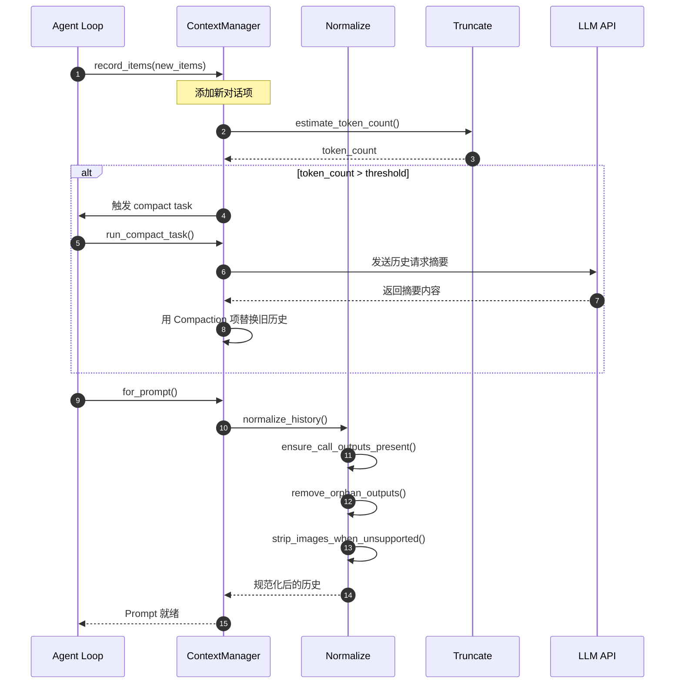
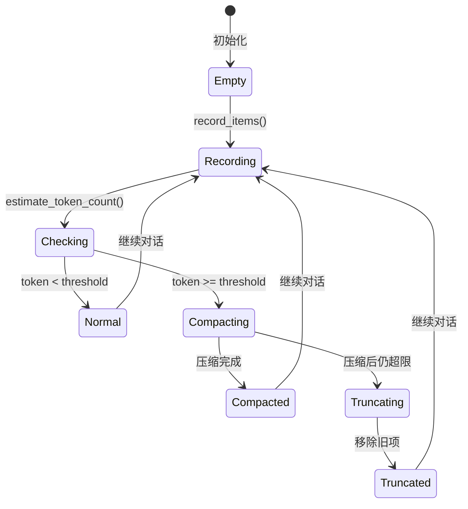
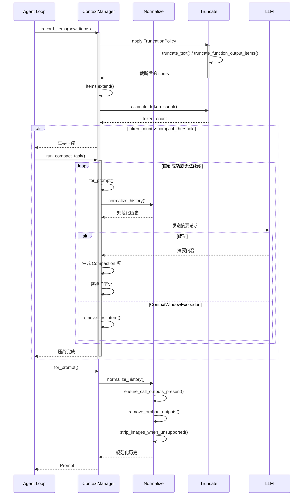
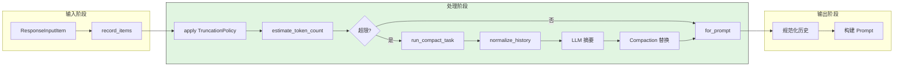
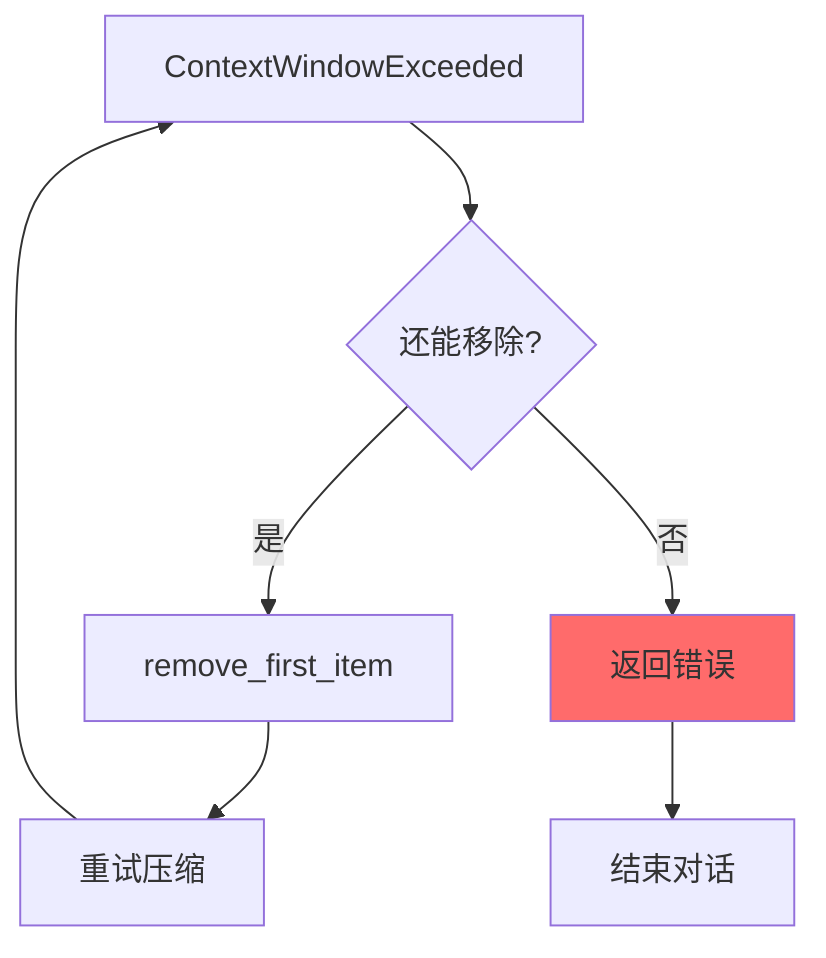
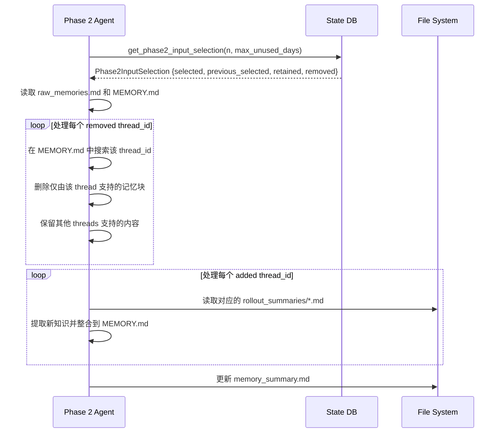
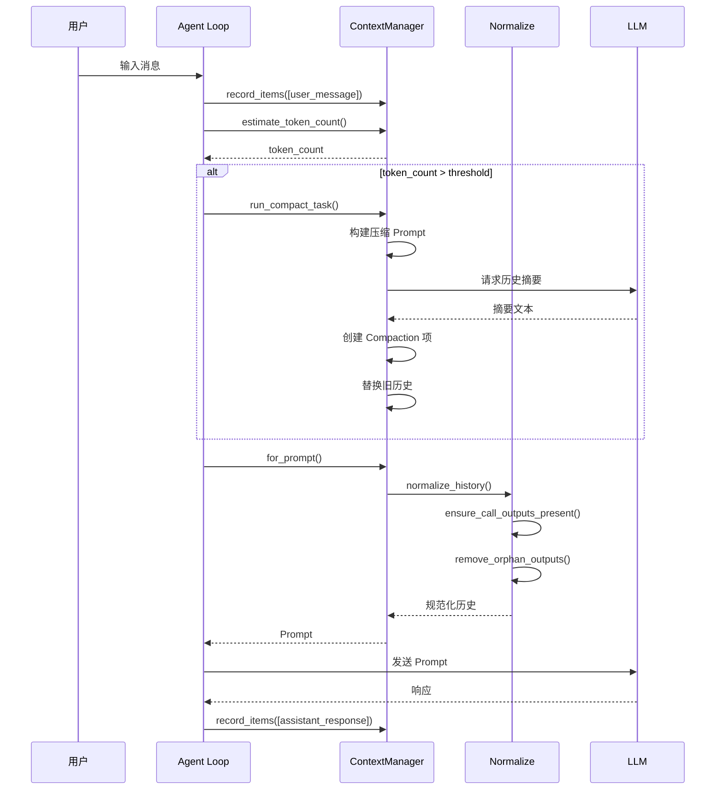
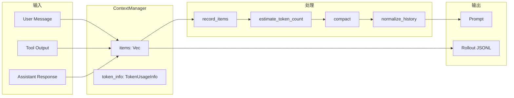

# Memory Context 管理（codex）

## TL;DR（结论先行）

一句话定义：Codex 的 Memory Context 是**双层存储 + 惰性压缩 + 可配置记忆系统**的对话历史管理方案，在内存中维护完整历史，通过字节启发式估算 Token 使用量，接近上下文窗口限制时触发 LLM 驱动的摘要压缩；同时支持跨会话的长期记忆（Memories），通过两阶段提取（Phase 1 原始记忆生成 + Phase 2 合并整理）实现知识的持久化与渐进式遗忘。

Codex 的核心取舍：**内存完整存储 + 惰性压缩 + 可选长期记忆**（对比 Gemini CLI 的分层记忆、Kimi CLI 的 Checkpoint 回滚）

---

## 1. 为什么需要这个机制？（解决什么问题）

### 1.1 问题场景

没有 Memory Context 管理：
```
长对话 → 历史累积 → Token 超限 → 模型报错 → 对话中断
```

有 Memory Context 管理：
```
长对话 → Token 接近阈值 → 触发压缩 → 历史摘要化 → 对话继续
         ↓ 压缩后仍超限
         移除最旧历史项 → 保证上下文窗口内
```

### 1.2 核心挑战

| 挑战 | 不解决的后果 |
|-----|-------------|
| Token 估算 | 无法准确判断是否接近上下文限制 |
| 历史规范化 | 孤立的 call/output 导致模型困惑 |
| 上下文压缩 | 超限后无法继续对话 |
| 持久化恢复 | 程序重启后丢失对话历史 |
| 多模态支持 | 图片等非文本内容处理复杂 |

---

## 2. 整体架构（ASCII 图）

### 2.1 在系统中的位置

```text
┌─────────────────────────────────────────────────────────────┐
│ Agent Loop                                                   │
│ codex-rs/core/src/loop.rs                                    │
└───────────────────────┬─────────────────────────────────────┘
                        │
        ┌───────────────┼───────────────┐
        ▼               ▼               ▼
┌──────────────┐ ┌──────────────┐ ┌──────────────┐
│ ContextManager│ │ Compact Task │ │ RolloutRecorder│
│ 历史管理     │ │ 上下文压缩   │ │ 持久化存储   │
└──────┬───────┘ └──────┬───────┘ └──────┬───────┘
       │                │                │
       ▼                ▼                ▼
┌─────────────────────────────────────────────────────────────┐
│ ▓▓▓ Memory Context ▓▓▓                                      │
│ codex-rs/core/src/context_manager/                           │
│ - history.rs    : ContextManager 核心结构                   │
│ - normalize.rs  : 历史规范化处理                             │
│ - compact.rs    : 上下文压缩逻辑                             │
└───────────────────────┬─────────────────────────────────────┘
                        │ 依赖
        ┌───────────────┼───────────────┐
        ▼               ▼               ▼
┌──────────────┐ ┌──────────────┐ ┌──────────────┐
│ truncate.rs  │ │ truncate.rs  │ │ protocol/src │
│ Token 估算   │ │ 截断策略     │ │ RolloutItem  │
└──────────────┘ └──────────────┘ └──────────────┘
```

### 2.2 核心组件职责

| 组件 | 职责 | 代码位置 |
|-----|------|---------|
| `ContextManager` | 对话历史的内存存储与管理 | `context_manager/history.rs:106` |
| `normalize` | 历史规范化（call/output 配对） | `context_manager/normalize.rs` |
| `compact` | 上下文压缩任务执行 | `compact.rs:64` |
| `truncate` | Token 估算与截断策略 | `truncate.rs` |
| `RolloutRecorder` | 持久化存储（JSON Lines） | `protocol/src/protocol.rs` |
| **MemoriesConfig** | **记忆系统配置（启用/禁用、Phase 2 模型等）** | **`config/types.rs:396`** |
| **Phase 1** | **原始记忆提取（单线程摘要生成）** | **`memories/phase_one.rs`** |
| **Phase 2** | **记忆合并整理（跨线程知识整合）** | **`memories/phase2.rs:43`** |

### 2.3 核心组件交互关系



**关键交互说明**：

| 步骤 | 交互内容 | 设计意图 |
|-----|---------|---------|
| 1 | 记录新对话项 | 完整保存所有交互 |
| 2-3 | Token 估算 | 提前发现超限风险 |
| 4-7 | 触发压缩 | 将旧历史转换为摘要 |
| 8 | Prompt 构建请求 | 准备发送给模型 |
| 9-12 | 历史规范化 | 保证 call/output 配对完整性 |

---

## 3. 核心组件详细分析

### 3.1 ContextManager 内部结构

#### 职责定位

ContextManager 是 Memory Context 的核心，在内存中维护完整的对话历史，提供 Token 估算、历史记录和 Prompt 构建功能。

#### 状态机图



#### 内部数据流

```text
┌─────────────────────────────────────────────────────────────┐
│  输入层                                                      │
│  ├── ResponseInputItem::Message { role, content }           │
│  ├── ResponseInputItem::FunctionCallOutput { ... }          │
│  ├── ResponseItem::FunctionCall { ... }                     │
│  └── ResponseItem::Compaction { summary }                   │
└──────────────────────────┬──────────────────────────────────┘
                           ▼
┌─────────────────────────────────────────────────────────────┐
│  处理层                                                      │
│  ├── record_items()                                         │
│  │   └── apply TruncationPolicy                            │
│  ├── estimate_token_count()                                 │
│  │   └── approx_token_count() 字节启发式估算                │
│  └── for_prompt()                                           │
│      └── normalize_history()                                │
│          ├── ensure_call_outputs_present()                  │
│          ├── remove_orphan_outputs()                        │
│          └── strip_images_when_unsupported()                │
└──────────────────────────┬──────────────────────────────────┘
                           ▼
┌─────────────────────────────────────────────────────────────┐
│  输出层                                                      │
│  ├── Vec<ResponseItem> (用于 Prompt 构建)                   │
│  ├── TokenUsageInfo (Token 使用统计)                        │
│  └── 触发 compact task (如果超限)                           │
└─────────────────────────────────────────────────────────────┘
```

#### 关键接口

| 接口 | 输入 | 输出 | 说明 | 代码位置 |
|-----|------|------|------|---------|
| `new()` | - | ContextManager | 创建空管理器 | `history.rs:113` |
| `record_items()` | Vec<ResponseInputItem> | - | 记录新项 | `history.rs:?` |
| `for_prompt()` | modalities | Vec<ResponseItem> | 构建 Prompt | `history.rs:?` |
| `estimate_token_count()` | BaseInstructions | Option<i64> | Token 估算 | `history.rs:398` |
| `remove_first_item()` | - | Option<ResponseItem> | 移除最旧项 | `history.rs:?` |

### 3.2 历史规范化 (Normalize) 内部结构

#### 职责定位

在构建 Prompt 前执行三项规范化，确保历史数据的一致性和完整性。

#### 关键算法逻辑

```rust
// context_manager/normalize.rs
fn normalize_history(&mut self, input_modalities: &[InputModality]) {
    // 1. 确保每个 function call 都有对应的 output
    normalize::ensure_call_outputs_present(&mut self.items);

    // 2. 移除孤立的 outputs（没有对应 call 的）
    normalize::remove_orphan_outputs(&mut self.items);

    // 3. 当模型不支持图片时，从消息中移除图片
    normalize::strip_images_when_unsupported(input_modalities, &mut self.items);
}
```

**算法要点**：

1. **Call/Output 配对**：每个工具调用必须有对应的结果，否则模型无法关联
2. **孤儿清理**：移除无效的历史项，减少 Token 消耗
3. **多模态处理**：根据模型能力动态调整内容

### 3.3 上下文压缩 (Compact) 内部结构

#### 职责定位

当 Token 接近上下文窗口限制时，触发 LLM 驱动的历史摘要，将旧历史替换为 Compaction 项。

#### 关键算法逻辑

```rust
// compact.rs:64-120
pub(crate) async fn run_compact_task_inner(...) -> CodexResult<()> {
    // 1. 克隆当前历史
    let mut history = sess.clone_history().await;

    // 2. 记录压缩提示词
    history.record_items(&[initial_input_for_turn.into()], policy);

    loop {
        // 3. 构建压缩 Prompt
        let turn_input = history.for_prompt(&turn_context.model_info.input_modalities);
        let prompt = Prompt {
            input: turn_input,
            base_instructions: sess.get_base_instructions().await,
            ..Default::default()
        };

        // 4. 发送给模型生成摘要
        match drain_to_completed(&sess, turn_context, ...).await {
            Ok(()) => break,
            Err(CodexErr::ContextWindowExceeded) => {
                // 5. 超出窗口则移除最旧项重试
                history.remove_first_item();
                continue;
            }
            Err(e) => return Err(e),
        }
    }
}
```

**算法要点**：

1. **渐进式压缩**：优先尝试完整压缩，失败则移除最旧项重试
2. **自洽循环**：使用相同的 LLM API 进行摘要生成
3. **幂等替换**：用 Compaction 项原子替换旧历史

### 3.4 组件间协作时序



### 3.4 关键数据路径

#### 主路径（正常流程）



#### 异常路径（压缩失败）



---

### 3.5 记忆系统配置（MemoriesConfig）

#### 职责定位

MemoriesConfig 控制 Codex 长期记忆系统的行为，允许用户通过配置文件启用/禁用记忆功能，并调整记忆提取和合并的参数。

#### 配置结构

```rust
// codex-rs/core/src/config/types.rs:396-406
#[derive(Debug, Clone, PartialEq, Eq)]
pub struct MemoriesConfig {
    pub generate_memories: bool,      // 是否生成新记忆
    pub use_memories: bool,           // 是否在 Prompt 中使用记忆
    pub max_raw_memories_for_global: usize,  // Phase 2 最大原始记忆数
    pub max_unused_days: i64,         // 记忆最大未使用天数
    pub max_rollout_age_days: i64,    // 最大 rollout 年龄
    pub max_rollouts_per_startup: usize,
    pub min_rollout_idle_hours: i64,
    pub phase_1_model: Option<String>, // Phase 1 提取模型
    pub phase_2_model: Option<String>, // Phase 2 合并模型
}
```

#### 配置项说明

| 配置项 | 类型 | 默认值 | 说明 |
|-------|------|--------|------|
| `generate_memories` | bool | true | 新线程是否存储记忆到 state DB |
| **use_memories** | **bool** | **true** | **是否在开发者提示词中注入记忆使用说明** |
| `max_raw_memories_for_global` | usize | 256 | Phase 2 合并时保留的最大原始记忆数 |
| `max_unused_days` | i64 | 30 | 超过此天数未使用的记忆不参与 Phase 2 |
| `max_rollout_age_days` | i64 | 30 | 用于记忆的 rollout 最大年龄 |
| `min_rollout_idle_hours` | i64 | 6 | 生成记忆前的最小空闲时间 |
| `phase_1_model` | Option<String> | None | Phase 1 提取使用的模型 |
| `phase_2_model` | Option<String> | None | Phase 2 合并使用的模型 |

#### 配置示例（config.toml）

```toml
[memories]
generate_memories = true
use_memories = true
max_raw_memories_for_global = 256
max_unused_days = 30
min_rollout_idle_hours = 6
phase_2_model = "o3-mini"
```

#### use_memories 的作用

当 `use_memories = false` 时，Codex 会跳过记忆使用说明的注入（`codex.rs:2989-2994`）：

```rust
// codex-rs/core/src/codex.rs:2989-2994
if turn_context.features.enabled(Feature::MemoryTool)
    && turn_context.config.memories.use_memories
    && let Some(memory_prompt) =
        build_memory_tool_developer_instructions(&turn_context.config.codex_home).await
{
    developer_sections.push(memory_prompt);
}
```

**设计意图**：允许用户完全禁用记忆功能，避免记忆内容影响当前对话，同时保留已生成的记忆文件供后续启用时使用。

---

### 3.6 记忆遗忘机制（Memory Forgetting）

#### 职责定位

Codex 的记忆系统支持基于差异（diff-based）的遗忘机制，在 Phase 2（合并阶段）通过对比当前选择与前一次成功的选择，识别需要移除的记忆条目。

#### 核心数据结构

```rust
// codex-rs/state/src/model/memories.rs:32-38
#[derive(Debug, Clone, PartialEq, Eq, Default)]
pub struct Phase2InputSelection {
    pub selected: Vec<Stage1Output>,         // 当前选中的记忆
    pub previous_selected: Vec<Stage1Output>, // 前一次选中的记忆
    pub retained_thread_ids: Vec<ThreadId>,  // 保留的线程 ID
    pub removed: Vec<Stage1OutputRef>,       // 需要移除的记忆引用
}
```

#### 遗忘判定逻辑

```rust
// codex-rs/state/src/runtime/memories.rs:294-422
pub async fn get_phase2_input_selection(
    &self,
    n: usize,
    max_unused_days: i64,
) -> anyhow::Result<Phase2InputSelection> {
    // 1. 查询当前符合条件的记忆（按使用频率和时间排序）
    let current_rows = sqlx::query(...)

    // 2. 查询前一次 Phase 2 成功时选中的记忆
    let previous_rows = sqlx::query(...)

    // 3. 计算 retained_thread_ids（当前仍在前 N 的线程）
    let retained_thread_ids = ...

    // 4. 计算 removed（之前选中但现在不在前 N 的线程）
    let mut removed = Vec::new();
    for row in &previous_rows {
        let thread_id: String = row.try_get("thread_id")?;
        if current_thread_ids.contains(thread_id.as_str()) {
            continue;  // 仍被选中，保留
        }
        removed.push(stage1_output_ref_from_parts(...));  // 标记为移除
    }

    Ok(Phase2InputSelection {
        selected,
        previous_selected,
        retained_thread_ids,
        removed,
    })
}
```

#### 合并提示词中的遗忘指令

合并代理（Consolidation Agent）通过提示词模板接收差异信息：

```markdown
<!-- codex-rs/core/templates/memories/consolidation.md:124-143 -->

Incremental thread diff snapshot (computed before the current artifact sync rewrites local files):

**Diff since last consolidation:**
{{ phase2_input_selection }}

Incremental update and forgetting mechanism:
- Use the diff provided
- For each added thread id, search it in `raw_memories.md`...
- For each removed thread id, search it in `MEMORY.md` and delete only the memory supported by that thread
```

#### 差异渲染格式

```rust
// codex-rs/core/src/memories/prompts.rs:56-90
fn render_phase2_input_selection(selection: &Phase2InputSelection) -> String {
    let retained = selection.retained_thread_ids.len();
    let added = selection.selected.len().saturating_sub(retained);

    format!(
        "- selected inputs this run: {}\n\
         - newly added since the last successful Phase 2 run: {added}\n\
         - retained from the last successful Phase 2 run: {retained}\n\
         - removed from the last successful Phase 2 run: {}\n\
         ...",
        selection.selected.len(),
        selection.removed.len(),
    )
}
```

#### 遗忘执行流程



**设计意图**：
1. **渐进式遗忘**：基于使用频率和时间自动淘汰旧记忆，避免记忆库无限增长
2. **精确清理**：通过 thread_id 精确追踪每条记忆的来源，仅删除真正"孤儿"的内容
3. **保留共享内容**：如果一条记忆由多个 threads 支持，仅删除对特定 thread 的引用，保留其他内容

---

## 4. 端到端数据流转

### 4.1 正常流程（详细版）



**数据变换详情**：

| 阶段 | 输入 | 处理 | 输出 | 代码位置 |
|-----|------|------|------|---------|
| 记录 | ResponseInputItem | 应用 TruncationPolicy | 存储到 items | `history.rs:?` |
| 估算 | BaseInstructions + items | approx_token_count() | token_count | `history.rs:398` |
| 压缩 | 完整历史 | LLM 摘要 + 替换 | Compaction 项 | `compact.rs:64` |
| 规范化 | raw items | ensure/remove/strip | clean items | `normalize.rs` |
| 持久化 | TurnItem | RolloutRecorder | JSON Lines | `protocol.rs` |

### 4.2 数据流向图



---

## 5. 关键代码实现

### 5.1 核心数据结构

```rust
// codex-rs/core/src/context_manager/history.rs:106-119
#[derive(Debug, Clone, Default)]
pub(crate) struct ContextManager {
    /// The oldest items are at the beginning of the vector.
    items: Vec<ResponseItem>,
    token_info: Option<TokenUsageInfo>,
}

// codex-rs/core/src/context_manager/history.rs:398-417
pub(crate) fn estimate_token_count(
    &self,
    base_instructions: &BaseInstructions,
) -> Option<i64> {
    // 基础指令 Token（系统提示）
    let base_tokens =
        i64::try_from(approx_token_count(&base_instructions.text))
            .unwrap_or(i64::MAX);

    // 历史项 Token
    let items_tokens = self
        .items
        .iter()
        .map(estimate_item_token_count)
        .fold(0i64, i64::saturating_add);

    Some(base_tokens.saturating_add(items_tokens))
}
```

**字段说明**：

| 字段 | 类型 | 用途 |
|-----|------|------|
| `items` | `Vec<ResponseItem>` | 对话历史存储（旧→新） |
| `token_info` | `Option<TokenUsageInfo>` | Token 使用统计 |

### 5.2 主链路代码

```rust
// codex-rs/core/src/context_manager/normalize.rs
fn normalize_history(&mut self, input_modalities: &[InputModality]) {
    // 1. 确保每个 function call 都有对应的 output
    normalize::ensure_call_outputs_present(&mut self.items);

    // 2. 移除孤立的 outputs（没有对应 call 的）
    normalize::remove_orphan_outputs(&mut self.items);

    // 3. 当模型不支持图片时，从消息中移除图片
    normalize::strip_images_when_unsupported(input_modalities, &mut self.items);
}
```

**代码要点**：

1. **配对保证**：确保每个工具调用都有对应的结果返回
2. **孤儿清理**：移除无效的历史项，减少 Token 浪费
3. **多模态适配**：根据模型输入模态能力动态过滤

### 5.3 关键调用链

```text
Agent Loop::run_turn()
  -> ContextManager::record_items()    [context_manager/history.rs]
    -> apply TruncationPolicy           [truncate.rs]
    -> items.extend()
  -> ContextManager::estimate_token_count() [history.rs:398]
    -> approx_token_count()             [truncate.rs]
    -> estimate_item_token_count()
  -> [if needed] run_compact_task()     [compact.rs:64]
    -> clone_history()
    -> for_prompt() -> normalize_history() [normalize.rs]
    -> drain_to_completed() -> LLM
    -> 生成 Compaction 项
  -> ContextManager::for_prompt()       [history.rs]
    -> normalize_history()              [normalize.rs]
    -> return items for Prompt
```

---

## 6. 设计意图与 Trade-off

### 6.1 Codex 的选择

| 维度 | Codex 的选择 | 替代方案 | 取舍分析 |
|-----|-------------|---------|---------|
| 存储方式 | 内存完整存储 | 数据库存储 (Gemini) / 文件映射 | 访问快，但受限于内存 |
| Token 估算 | 字节启发式 | 精确 Tokenizer | 快速近似，但可能不准 |
| 压缩策略 | 惰性压缩（触发式） | 实时压缩 (Gemini) | 减少压缩频率，但可能突增 |
| 压缩粒度 | 整段历史摘要 | 逐条摘要 / 分层记忆 | 简单有效，但粒度粗 |
| 持久化 | JSON Lines | 数据库 / 二进制 | 可读性好，但体积大 |
| **长期记忆** | **两阶段提取 + Diff 遗忘** | **实时分层 (Gemini)** | **后台异步处理，渐进式清理** |

### 6.2 为什么这样设计？

**核心问题**：如何在有限的上下文窗口内支持长对话？

**Codex 的解决方案**：
- 代码依据：`compact.rs:64-120` 的渐进式压缩逻辑
- 设计意图：优先保留完整信息，超限后智能摘要
- 带来的好处：
  - 短对话无压缩开销
  - 长对话通过摘要保留关键信息
  - 渐进式处理确保不丢失全部历史
- 付出的代价：
  - 压缩时机不可预测（触发式）
  - 摘要可能丢失细节
  - 压缩过程需要额外的 LLM 调用

### 6.3 与其他项目的对比

| 项目 | 核心差异 | 适用场景 |
|-----|---------|---------|
| Codex | 惰性压缩 + 字节估算 + 可选长期记忆 | 通用场景，平衡性能与精度；需要跨会话知识积累 |
| Gemini CLI | 分层记忆 (Working/Short/Long) | 需要精细记忆管理的场景 |
| Kimi CLI | Checkpoint 回滚 | 需要精确状态恢复的场景 |
| OpenCode | 简单截断 | 资源受限的场景 |

---

## 7. 边界情况与错误处理

### 7.1 终止条件

| 终止原因 | 触发条件 | 代码位置 |
|---------|---------|---------|
| 历史为空 | 对话刚开始 | `history.rs:106` |
| 压缩后仍超限 | 移除所有可移除项后仍超限 | `compact.rs` |
| Token 估算溢出 | i64::MAX 上限 | `history.rs:398` |
| 规范化后为空 | 所有项被过滤 | `normalize.rs` |

### 7.2 截断策略

```rust
// truncate.rs
pub struct TruncationPolicy {
    pub max_output_bytes: usize,
    pub max_item_bytes: usize,
}

impl TruncationPolicy {
    pub fn truncate_text(text: &str, max_bytes: usize) -> String {
        if text.len() <= max_bytes {
            text.to_string()
        } else {
            // 保留开头和结尾，中间用 ... 省略
            let head_len = max_bytes / 2;
            let tail_len = max_bytes - head_len - 3;
            format!("{}...{}", &text[..head_len], &text[text.len()-tail_len..])
        }
    }
}
```

### 7.3 错误恢复策略

| 错误类型 | 处理策略 | 代码位置 |
|---------|---------|---------|
| 上下文超限 | 触发压缩任务 | `agent_loop.rs` |
| 压缩失败 | 移除最旧项重试 | `compact.rs` |
| 孤儿 output | 移除孤立项 | `normalize.rs` |
| 图片不支持 | 从消息中移除 | `normalize.rs` |

### 7.4 记忆系统边界情况

| 边界情况 | 处理策略 | 代码位置 |
|---------|---------|---------|
| **记忆功能禁用** | `use_memories = false` 时跳过记忆提示注入 | `codex.rs:2989` |
| **Phase 2 无输入** | `raw_memories.is_empty()` 时直接标记成功 | `phase2.rs:115-127` |
| **记忆提取失败** | 标记 job 失败并记录错误原因 | `phase2.rs:59-68` |
| **合并代理失败** | 心跳丢失时标记失败并关闭代理 | `phase2.rs:370-384` |
| **记忆过期** | 超过 `max_unused_days` 的记忆不参与 Phase 2 | `memories.rs:320` |

---

## 8. 关键代码索引

| 功能 | 文件 | 行号 | 说明 |
|-----|------|------|------|
| 核心结构 | `context_manager/history.rs` | 106 | ContextManager 定义 |
| Token 估算 | `context_manager/history.rs` | 398 | estimate_token_count |
| 规范化 | `context_manager/normalize.rs` | - | ensure/remove/strip |
| 压缩 | `compact.rs` | 64 | run_compact_task_inner |
| 截断 | `truncate.rs` | - | TruncationPolicy |
| 持久化 | `protocol/src/protocol.rs` | - | RolloutItem |
| Token 计算 | `truncate.rs` | - | approx_token_count |
| **记忆配置** | **`config/types.rs`** | **396** | **MemoriesConfig 定义** |
| **use_memories 使用** | **`codex.rs`** | **2989** | **记忆提示注入控制** |
| **Phase 2 执行** | **`memories/phase2.rs`** | **43** | **记忆合并主流程** |
| **差异选择** | **`state/src/runtime/memories.rs`** | **312** | **Phase2InputSelection 查询** |
| **差异数据结构** | **`state/src/model/memories.rs`** | **32** | **Phase2InputSelection 定义** |
| **合并提示词** | **`templates/memories/consolidation.md`** | **124** | **遗忘指令模板** |
| **差异渲染** | **`memories/prompts.rs`** | **56** | **render_phase2_input_selection** |

---

## 9. 延伸阅读

- 前置知识：`04-codex-agent-loop.md`
- 相关机制：`05-codex-tools-system.md`（工具输出也进入历史）
- 深度分析：`docs/codex/questions/codex-context-compaction.md`

---

*✅ Verified: 基于 codex/codex-rs/core/src/context_manager/ 和 memories/ 源码分析*
*基于版本：2026-02-08 | 最后更新：2026-03-02（新增 use_memories 配置和记忆遗忘机制）*
