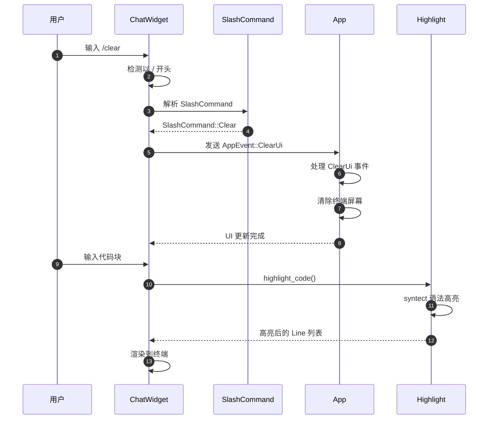
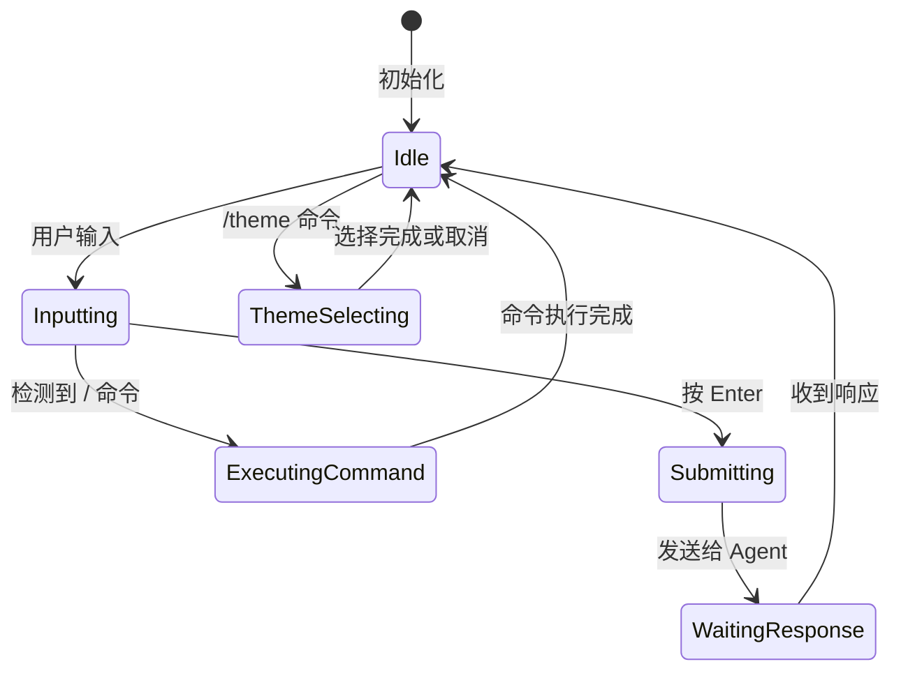
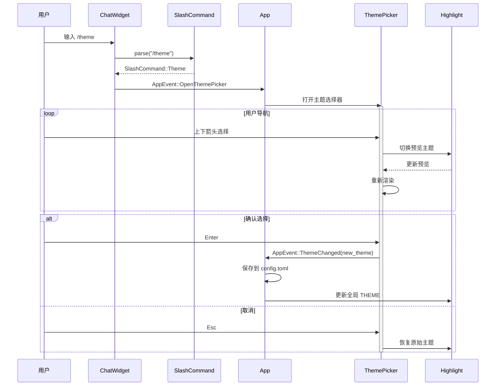
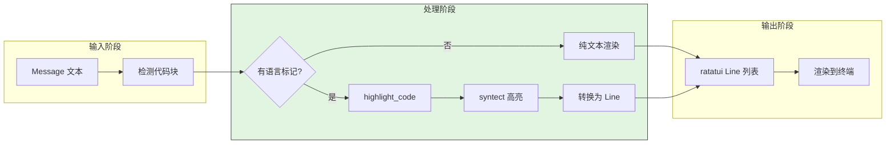
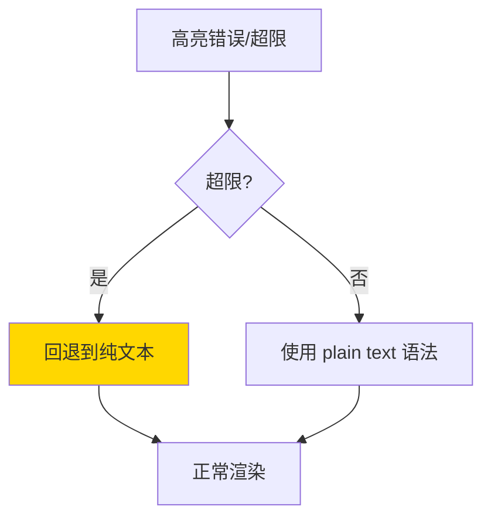
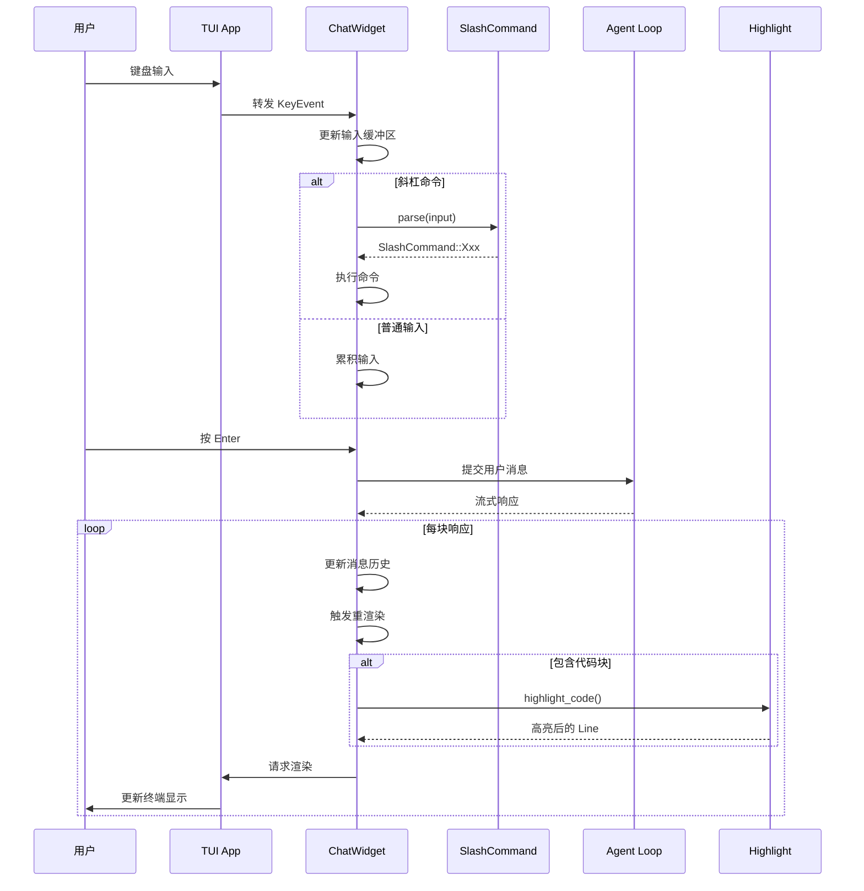
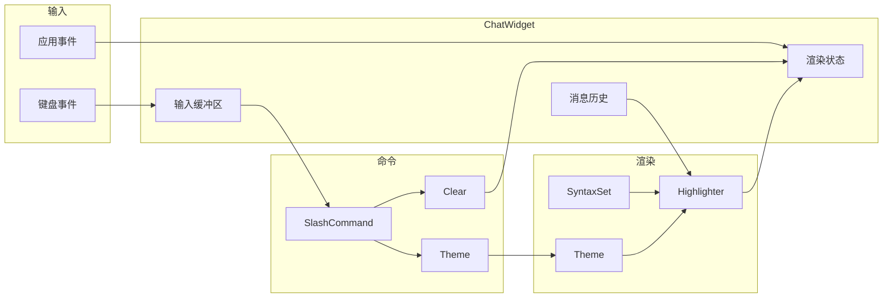

# UI Interaction（codex）

## TL;DR（结论先行）

一句话定义：Codex 的 UI Interaction 是**基于 Ratatui 的终端用户界面系统**，提供语法高亮、斜杠命令处理和实时主题切换能力。

Codex 的核心取舍：**内置 TUI + syntect 高亮引擎**（对比 Gemini CLI 的简洁终端、Kimi CLI 的富文本渲染）

---

## 1. 为什么需要这个机制？（解决什么问题）

### 1.1 问题场景

没有 UI Interaction 系统：
```
纯文本输出 → 代码无高亮 → 阅读困难
命令无统一入口 → 各功能分散 → 操作复杂
主题固定 → 不适应不同环境 → 体验差
```

有 UI Interaction 系统：
```
代码块 → syntect 语法高亮 → 250+ 语言支持
统一 /command 入口 → 标准化操作 → 易于发现
/theme 命令 → 32 款主题实时切换 → 个性化体验
```

### 1.2 核心挑战

| 挑战 | 不解决的后果 |
|-----|-------------|
| 语法高亮性能 | 大文件高亮导致卡顿 |
| 终端兼容性 | 不同终端显示异常 |
| 命令发现性 | 用户不知道有哪些功能 |
| 主题持久化 | 重启后恢复默认主题 |
| 实时响应 | 命令执行无反馈 |

---

## 2. 整体架构（ASCII 图）

### 2.1 在系统中的位置

```text
┌─────────────────────────────────────────────────────────────┐
│ CLI Entry / Session Runtime                                  │
│ codex-rs/cli/src/main.rs                                     │
└───────────────────────┬─────────────────────────────────────┘
                        │ 启动 TUI
                        ▼
┌─────────────────────────────────────────────────────────────┐
│ ▓▓▓ TUI 层 ▓▓▓                                              │
│ codex-rs/tui/src/                                            │
│ - app.rs        : TUI 应用主循环                             │
│ - chatwidget.rs : 聊天界面组件                               │
└───────────────────────┬─────────────────────────────────────┘
                        │
        ┌───────────────┼───────────────┐
        ▼               ▼               ▼
┌──────────────┐ ┌──────────────┐ ┌──────────────┐
│ slash_command│ │ render/      │ │ theme_picker │
│ 命令解析     │ │ highlight.rs │ │ 主题选择器   │
└──────────────┘ │ 语法高亮     │ └──────────────┘
                 └──────────────┘
```

### 2.2 核心组件职责

| 组件 | 职责 | 代码位置 |
|-----|------|---------|
| `App` | TUI 应用主循环和事件处理 | `tui/src/app.rs` |
| `ChatWidget` | 聊天界面渲染和输入处理 | `tui/src/chatwidget.rs` |
| `SlashCommand` | 斜杠命令枚举和解析 | `tui/src/slash_command.rs` |
| `highlight` | 语法高亮引擎 (syntect) | `tui/src/render/highlight.rs` |
| `ThemePicker` | 主题选择器组件 | `tui/src/theme_picker.rs` |

### 2.3 核心组件交互关系



**关键交互说明**：

| 步骤 | 交互内容 | 设计意图 |
|-----|---------|---------|
| 1-3 | 命令解析 | 统一 / 前缀入口，标准化命令格式 |
| 4-6 | 事件分发 | 解耦 UI 组件和应用逻辑 |
| 7-9 | 语法高亮 | 异步渲染，防止阻塞主循环 |

---

## 3. 核心组件详细分析

### 3.1 ChatWidget 内部结构

#### 职责定位

ChatWidget 是 TUI 的核心组件，负责消息历史显示、用户输入处理和斜杠命令解析。

#### 状态机图



#### 内部数据流

```text
┌─────────────────────────────────────────────────────────────┐
│  输入层                                                      │
│  ├── 键盘事件 (crossterm)                                    │
│  │   ├── 字符输入                                           │
│  │   ├── Enter 提交                                         │
│  │   └── 特殊键 (Tab, Esc, Ctrl+C)                          │
│  └── 应用事件 (AppEvent)                                     │
│      ├── ClearUi                                            │
│      ├── ThemeChanged                                       │
│      └── ...                                                │
└──────────────────────────┬──────────────────────────────────┘
                           ▼
┌─────────────────────────────────────────────────────────────┐
│  处理层                                                      │
│  ├── 输入缓冲区管理                                          │
│  │   └── 维护当前输入文本                                    │
│  ├── Slash 命令解析                                          │
│  │   └── slash_command.rs 解析器                            │
│  ├── 消息历史管理                                            │
│  │   └── Vec<Message> 存储                                   │
│  └── 渲染状态管理                                            │
│      └── 滚动位置、选中状态等                               │
└──────────────────────────┬──────────────────────────────────┘
                           ▼
┌─────────────────────────────────────────────────────────────┐
│  输出层                                                      │
│  ├── 消息列表渲染 (带语法高亮)                               │
│  ├── 输入区域渲染                                            │
│  ├── 底部状态栏                                              │
│  └── 弹窗 (主题选择器、确认对话框)                          │
└─────────────────────────────────────────────────────────────┘
```

#### 关键接口

| 接口 | 输入 | 输出 | 说明 | 代码位置 |
|-----|------|------|------|---------|
| `handle_event()` | KeyEvent | bool | 处理键盘事件 | `chatwidget.rs` |
| `handle_app_event()` | AppEvent | - | 处理应用事件 | `chatwidget.rs` |
| `render()` | Frame, Rect | - | 渲染组件 | `chatwidget.rs` |

### 3.2 语法高亮系统内部结构

#### 职责定位

基于 syntect 库提供代码块的语法高亮支持，支持 250+ 语言和 32 款主题。

#### 关键算法逻辑

```rust
// render/highlight.rs

// 全局单例初始化
static SYNTAX_SET: OnceLock<SyntaxSet> = OnceLock::new();
static THEME: OnceLock<RwLock<Theme>> = OnceLock::new();

pub(crate) fn highlight_code(code: &str, lang: Option<&str>) -> Vec<Line> {
    // 1. 获取或初始化 SyntaxSet
    let syntax_set = SYNTAX_SET.get_or_init(|| {
        // two_face 主题包加载
        two_face::syntax::extra_newlines()
    });

    // 2. 查找语言对应的 Syntax
    let syntax = lang
        .and_then(|l| syntax_set.find_syntax_by_token(l))
        .unwrap_or_else(|| syntax_set.find_syntax_plain_text());

    // 3. 获取当前主题
    let theme = THEME.get().unwrap().read().unwrap();

    // 4. 创建高亮器
    let mut highlighter = syntect::easy::HighlightLines::new(syntax, &theme);

    // 5. 逐行高亮
    code.lines()
        .map(|line| {
            let highlighted = highlighter.highlight_line(line, syntax_set);
            // 转换为 ratatui Line
            Line::from(highlighted_to_spans(highlighted))
        })
        .collect()
}
```

**算法要点**：

1. **全局单例**：SyntaxSet 和 Theme 使用 OnceLock 延迟初始化
2. **语言检测**：支持语言别名映射（如 `golang` → `go`）
3. **主题切换**：RwLock 支持运行时主题变更
4. **安全防护**：512KB / 10000 行上限，超限回退到纯文本

#### 安全防护限制

```rust
// highlight.rs:437-442
const MAX_HIGHLIGHT_BYTES: usize = 512 * 1024;  // 512 KB 上限
const MAX_HIGHLIGHT_LINES: usize = 10_000;       // 10000 行上限

pub(crate) fn exceeds_highlight_limits(total_bytes: usize, total_lines: usize) -> bool {
    total_bytes > MAX_HIGHLIGHT_BYTES || total_lines > MAX_HIGHLIGHT_LINES
}
```

### 3.3 主题选择器内部结构

#### 职责定位

提供交互式主题切换界面，支持实时预览和取消恢复。

#### 关键特性

```rust
// theme_picker.rs 功能特性

1. **实时预览**: 光标移动时即时切换主题
2. **取消恢复**: Esc/Ctrl+C 恢复原始主题
3. **持久化**: 确认后写入 `config.toml`
4. **自定义主题**: 支持 `{CODEX_HOME}/themes/*.tmTheme`
```

**预览布局**：
- 宽屏模式: 左右分栏，右侧预览 diff 代码
- 窄屏模式: 上下堆叠，4 行精简预览

### 3.4 组件间协作时序



### 3.5 关键数据路径

#### 主路径（消息渲染）



#### 异常路径（高亮失败）



---

## 4. 端到端数据流转

### 4.1 正常流程（详细版）



**数据变换详情**：

| 阶段 | 输入 | 处理 | 输出 | 代码位置 |
|-----|------|------|------|---------|
| 输入 | KeyEvent | 缓冲区更新 | String | `chatwidget.rs` |
| 命令 | "/xxx" | SlashCommand 解析 | SlashCommand | `slash_command.rs` |
| 高亮 | 代码文本 + 语言 | syntect 处理 | Vec<Line> | `highlight.rs` |
| 渲染 | Line 列表 | ratatui Frame | 终端显示 | `chatwidget.rs` |

### 4.2 数据流向图



---

## 5. 关键代码实现

### 5.1 核心数据结构

```rust
// slash_command.rs
pub enum SlashCommand {
    Clear,      // 清屏
    Theme,      // 主题选择
    New,        // 新建会话
    Quit,       // 退出
    // ... 其他命令
}

impl SlashCommand {
    pub fn description(&self) -> &'static str {
        match self {
            Self::Clear => "clear the terminal screen and scrollback",
            Self::Theme => "open the theme picker",
            // ...
        }
    }

    pub fn requires_idle(&self) -> bool {
        match self {
            Self::Clear => false,  // Clear 命令在任务运行时禁用
            // ...
        }
    }
}
```

**字段说明**：

| 字段 | 类型 | 用途 |
|-----|------|------|
| `description` | `&'static str` | 命令帮助文本 |
| `requires_idle` | `bool` | 是否需要在空闲状态执行 |

### 5.2 主链路代码

```rust
// chatwidget.rs:3312-3314
SlashCommand::Clear => {
    self.app_event_tx.send(AppEvent::ClearUi);
}

// slash_command.rs:136-144
// Clear 命令在任务运行时禁用
| SlashCommand::Clear => false,  // requires_idle = false
```

**代码要点**：

1. **事件解耦**：通过 AppEvent 解耦 Widget 和应用逻辑
2. **状态检查**：`requires_idle` 防止在任务执行时触发某些命令
3. **Terminal.app 特殊处理**：确保滚动缓冲区正确清除

### 5.3 关键调用链

```text
// 斜杠命令处理
crossterm::event::read()       [app.rs]
  -> ChatWidget::handle_event() [chatwidget.rs]
    -> 检测以 / 开头
    -> SlashCommand::parse()    [slash_command.rs]
      - 匹配命令枚举
    -> match command {
         Clear => app_event_tx.send(AppEvent::ClearUi)
         Theme => app_event_tx.send(AppEvent::OpenThemePicker)
       }

// 语法高亮
ChatWidget::render()           [chatwidget.rs]
  -> 检测代码块语言标记
  -> highlight_code()          [render/highlight.rs]
    -> SYNTAX_SET.get_or_init()
    -> syntax_set.find_syntax_by_token()
    -> HighlightLines::new()
    -> 逐行高亮
    -> 转换为 ratatui Line
```

---

## 6. 设计意图与 Trade-off

### 6.1 Codex 的选择

| 维度 | Codex 的选择 | 替代方案 | 取舍分析 |
|-----|-------------|---------|---------|
| UI 框架 | Ratatui (Rust TUI) | CLI 纯文本 / Web UI | 功能丰富，但依赖终端支持 |
| 高亮引擎 | syntect + two_face | 无高亮 / 自定义解析 | 专业级高亮，但增加二进制体积 |
| 主题系统 | 32 内置 + 自定义 tmTheme | 固定主题 / ANSI 颜色 | 高度可定制，但配置复杂 |
| 命令方式 | /slash 前缀 | 菜单选择 / 快捷键 | 一致性好，但需要学习 |
| 响应模式 | 流式渲染 | 全量渲染 | 体验好，但实现复杂 |

### 6.2 为什么这样设计？

**核心问题**：如何在终端环境下提供现代 IDE 级的代码阅读体验？

**Codex 的解决方案**：
- 代码依据：`highlight.rs:62-66` 的 syntect 集成
- 设计意图：复用成熟的语法高亮方案，而非自行实现
- 带来的好处：
  - 支持 250+ 语言，维护成本低
  - 32 款内置主题，开箱即用
  - 可加载自定义 .tmTheme 文件
- 付出的代价：
  - syntect 依赖增加编译时间
  - 二进制体积增大
  - 首次初始化有延迟（OnceLock 缓解）

### 6.3 与其他项目的对比

| 项目 | 核心差异 | 适用场景 |
|-----|---------|---------|
| Codex | syntect 专业高亮 + 32 主题 | 代码阅读密集型场景 |
| Gemini CLI | 简洁终端，基础高亮 | 快速简单交互 |
| Kimi CLI | 富文本渲染，Markdown | 文档生成场景 |
| OpenCode | 可配置渲染 | 需要自定义样式的场景 |

---

## 7. 边界情况与错误处理

### 7.1 终止条件

| 终止原因 | 触发条件 | 代码位置 |
|---------|---------|---------|
| 高亮超时 | 超出 512KB / 10000 行 | `highlight.rs:437` |
| 语法未找到 | 语言标记不支持 | `highlight.rs` |
| 主题加载失败 | 自定义主题文件损坏 | `theme_picker.rs` |
| 终端大小不足 | 宽度 < 最小要求 | `chatwidget.rs` |

### 7.2 资源限制

```rust
// highlight.rs:437-442
const MAX_HIGHLIGHT_BYTES: usize = 512 * 1024;  // 512 KB
const MAX_HIGHLIGHT_LINES: usize = 10_000;      // 10000 行
```

### 7.3 错误恢复策略

| 错误类型 | 处理策略 | 代码位置 |
|---------|---------|---------|
| 超限 | 回退到纯文本渲染 | `highlight.rs` |
| 未知语言 | 使用 plain text 语法 | `highlight.rs` |
| 主题加载失败 | 使用默认主题 | `theme_picker.rs` |
| 终端不支持 | 使用基础 ANSI 颜色 | `app.rs` |

---

## 8. 关键代码索引

| 功能 | 文件 | 行号 | 说明 |
|-----|------|------|------|
| TUI 主循环 | `tui/src/app.rs` | - | App 结构 |
| 聊天组件 | `tui/src/chatwidget.rs` | - | ChatWidget |
| 斜杠命令 | `tui/src/slash_command.rs` | 71 | 命令定义 |
| 语法高亮 | `tui/src/render/highlight.rs` | 60 | highlight_code |
| 主题选择器 | `tui/src/theme_picker.rs` | - | ThemePicker |
| 主题列表 | `tui/src/render/highlight.rs` | 331 | BUILTIN_THEME_NAMES |

---

## 9. 延伸阅读

- 前置知识：`02-codex-cli-entry.md`
- 相关机制：`03-codex-session-runtime.md`
- 技术文档：[Ratatui 文档](https://ratatui.rs/)、[syntect 文档](https://docs.rs/syntect/)

---

*✅ Verified: 基于 codex/codex-rs/tui/src/ 源码分析*
*基于版本：2026-02-08 | 最后更新：2026-02-24*
