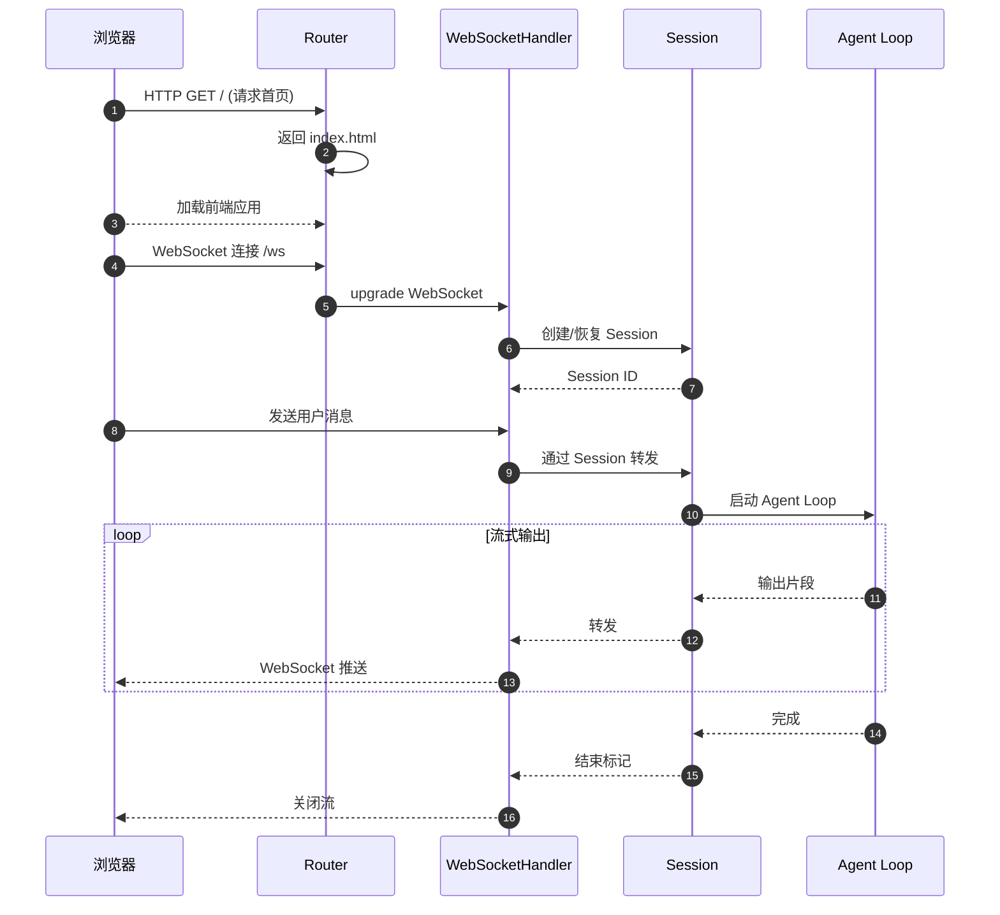
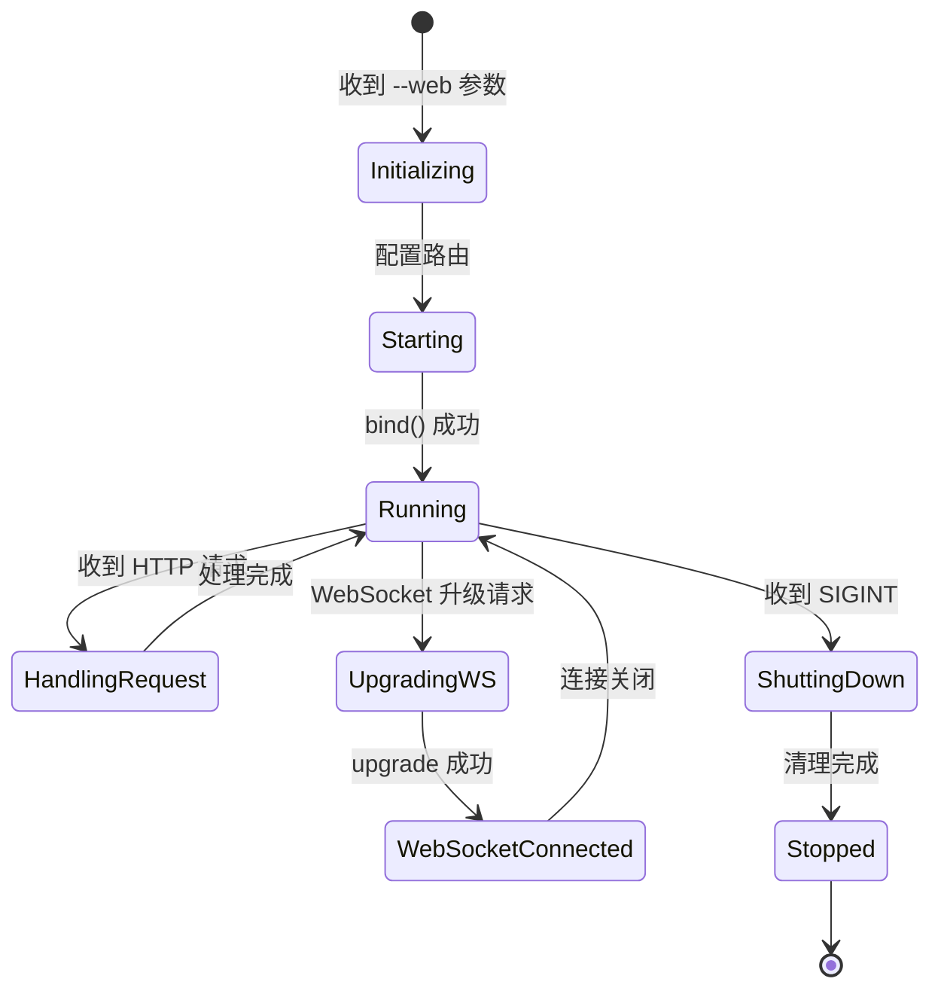
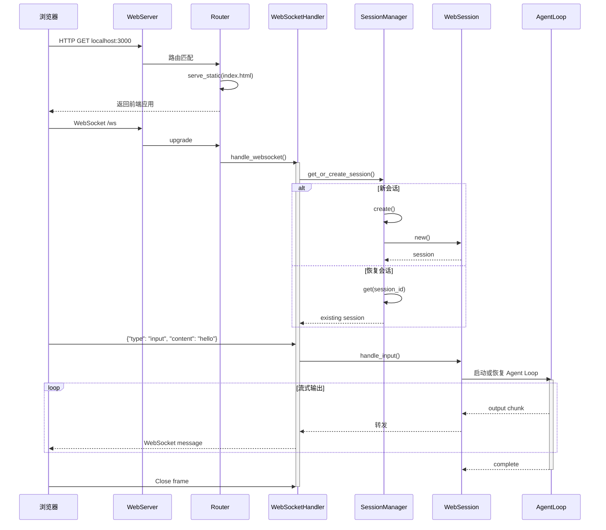
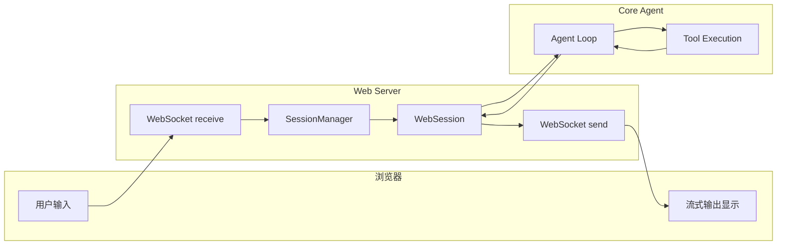
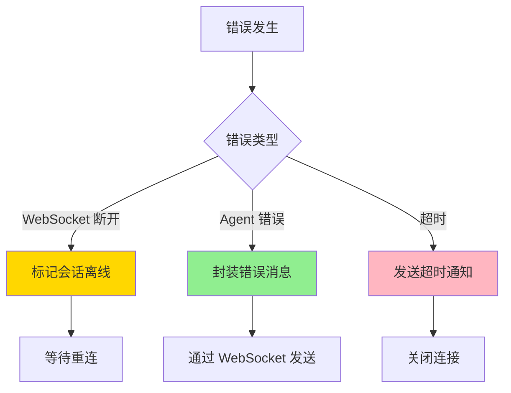
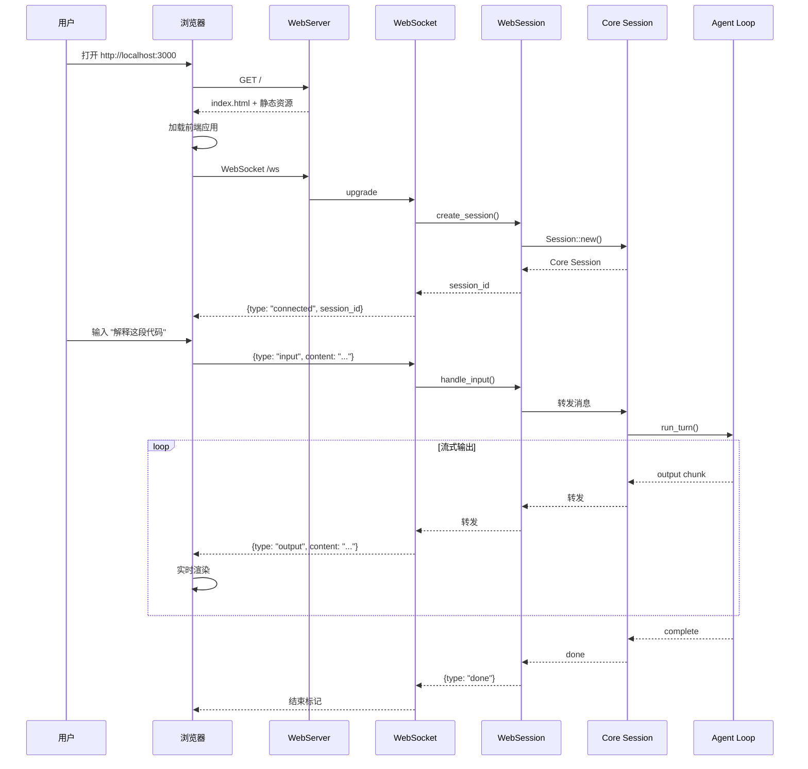
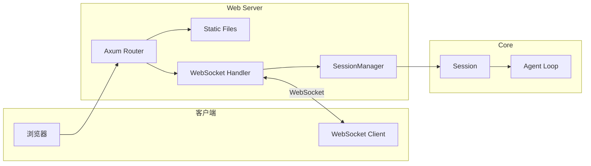

# Web Server（codex）

> **阅读指南**
>
> | 属性 | 说明 |
> |-----|------|
> | 预计阅读 | 15-20 分钟 |
> | 前置文档 | `02-codex-cli-entry.md`、`03-codex-session-runtime.md` |
> | 文档结构 | 速览 → 架构 → 机制 → 实现 → 对比 |
> | 代码呈现 | 关键代码直接展示，完整代码可折叠查看 |

---

## TL;DR（结论先行）

一句话定义：Codex 的 Web Server 是**基于 Axum 的 HTTP 服务端**，提供浏览器访问界面，支持 RESTful API 和 WebSocket 实时通信。

Codex 的核心取舍：**内嵌 Web Server + 共享核心逻辑**（对比纯 CLI 模式、独立 Web 服务架构）

### 核心要点速览

| 维度 | 关键决策 | 代码位置 |
|-----|---------|---------|
| Web 框架 | Axum (Rust) | `codex-rs/web/src/server.rs:1` |
| 实时通信 | WebSocket 双工通信 | `web/src/websocket.rs:1` |
| 会话管理 | 内存 SessionManager | `web/src/session.rs:25` |
| 静态资源 | 内嵌 ServeDir | `web/src/routes.rs:50` |
| 启动方式 | --web CLI 参数 | `cli/src/main.rs:120` |

---

## 1. 为什么需要这个机制？（解决什么问题）

### 1.1 问题场景

没有 Web Server：
```
仅支持终端交互 → 需要熟悉命令行 → 非技术用户门槛高
终端限制 → 无法展示复杂 UI → 体验受限
```

有 Web Server：
```
浏览器访问 → 图形化界面 → 降低使用门槛
WebSocket 实时通信 → 流式输出 → 类 ChatGPT 体验
RESTful API → 可集成到第三方系统 → 扩展性强
```

### 1.2 核心挑战

| 挑战 | 不解决的后果 |
|-----|-------------|
| 与 CLI 共享核心 | 代码重复，维护困难 |
| 实时通信 | 用户体验差，需要轮询 |
| 跨域支持 | 无法嵌入其他 Web 应用 |
| 会话隔离 | 多用户数据混乱 |
| 静态资源 | 前端资源部署复杂 |

---

## 2. 整体架构（ASCII 图）

### 2.1 在系统中的位置

```text
┌─────────────────────────────────────────────────────────────┐
│ CLI Entry                                                    │
│ codex-rs/cli/src/main.rs                                     │
│ --web 参数启动 Web 模式                                       │
└───────────────────────┬─────────────────────────────────────┘
                        │ 启动 Web Server
                        ▼
┌─────────────────────────────────────────────────────────────┐
│ ▓▓▓ Web Server ▓▓▓                                          │
│ codex-rs/web/src/                                            │
│ - server.rs     : Axum HTTP 服务端                           │
│ - routes.rs     : RESTful API 路由                           │
│ - websocket.rs  : WebSocket 实时通信                         │
└───────────────────────┬─────────────────────────────────────┘
                        │ 调用
                        ▼
┌─────────────────────────────────────────────────────────────┐
│ Core Agent Logic（共享）                                     │
│ codex-rs/core/src/                                           │
│ - Session       : 会话管理                                   │
│ - Agent Loop    : 核心对话循环                               │
│ - Tool System   : 工具执行                                   │
└─────────────────────────────────────────────────────────────┘
```

### 2.2 核心组件职责

| 组件 | 职责 | 代码位置 |
|-----|------|---------|
| `WebServer` | HTTP 服务端生命周期管理 | `web/src/server.rs:35` |
| `Router` | 路由定义和中间件配置 | `web/src/routes.rs:25` |
| `WebSocketHandler` | WebSocket 连接管理 | `web/src/websocket.rs:40` |
| `SessionManager` | Web 会话隔离管理 | `web/src/session.rs:25` |
| `StaticFiles` | 前端静态资源服务 | `web/src/static.rs:15` |

### 2.3 核心组件交互关系



**关键交互说明**：

| 步骤 | 交互内容 | 设计意图 |
|-----|---------|---------|
| 1-3 | HTTP 初始加载 | 加载前端 SPA 应用 |
| 4-6 | WebSocket 升级 | 建立长连接用于实时通信 |
| 7-8 | 消息转发 | 浏览器消息进入 Agent Loop |
| 9-12 | 流式推送 | 实时输出到浏览器 |

---

## 3. 核心组件详细分析

### 3.1 WebServer 内部结构

#### 职责定位

WebServer 是 HTTP 服务端入口，负责启动 Axum 服务器，配置路由和中间件。

#### 状态机图



**状态说明**：

| 状态 | 说明 | 进入条件 | 退出条件 |
|-----|------|---------|---------|
| Initializing | 初始化中 | 收到 --web 参数 | 路由配置完成 |
| Running | 运行中 | bind 成功 | 收到关闭信号 |
| HandlingRequest | 处理请求 | 收到 HTTP 请求 | 请求处理完成 |
| UpgradingWS | 升级 WebSocket | 收到 WS 请求 | 升级成功/失败 |
| ShuttingDown | 关闭中 | 收到 SIGINT | 清理完成 |

#### 内部数据流

```text
┌─────────────────────────────────────────────────────────────┐
│  配置层                                                      │
│  ├── CLI 参数解析 (--web, --port)                           │
│  ├── 环境变量 (CODEX_WEB_PORT)                              │
│  └── 配置文件 (codex.yaml web 段)                          │
└──────────────────────────┬──────────────────────────────────┘
                           ▼
┌─────────────────────────────────────────────────────────────┐
│  初始化层                                                    │
│  ├── 创建 Axum Router                                       │
│  │   ├── 注册 HTTP 路由 (GET /, POST /api/*)               │
│  │   ├── 注册 WebSocket 路由 (/ws)                         │
│  │   └── 配置中间件 (CORS, 日志)                           │
│  ├── 绑定监听地址 (0.0.0.0:port)                           │
│  └── 创建 SessionManager                                    │
└──────────────────────────┬──────────────────────────────────┘
                           ▼
┌─────────────────────────────────────────────────────────────┐
│  运行时层                                                    │
│  ├── tokio::spawn 启动 HTTP 服务                           │
│  ├── graceful shutdown 处理                                 │
│  └── 与 CLI 主循环协调                                      │
└─────────────────────────────────────────────────────────────┘
```

#### 关键接口

| 接口 | 输入 | 输出 | 说明 | 代码位置 |
|-----|------|------|------|---------|
| `start()` | Config, Port | Result<Server> | 启动服务器 | `server.rs:45` |
| `shutdown()` | - | Result<()> | 优雅关闭 | `server.rs:85` |

### 3.2 WebSocket 处理内部结构

#### 职责定位

WebSocketHandler 管理浏览器与 Agent 之间的实时双向通信。

#### 关键算法逻辑

**关键代码**（核心逻辑）：

```rust
// codex-rs/web/src/websocket.rs:40-75

pub async fn handle_websocket(
    socket: WebSocket,
    session_id: Option<String>,
    session_manager: Arc<SessionManager>,
) {
    // 1. 获取或创建 Session
    let session = if let Some(id) = session_id {
        session_manager.get(&id).await
    } else {
        session_manager.create().await
    };

    // 2. 创建双向通道
    let (mut ws_tx, mut ws_rx) = socket.split();
    let (agent_tx, mut agent_rx) = mpsc::channel(100);

    // 3. 启动 Agent Loop 任务
    let agent_task = tokio::spawn(async move {
        while let Some(msg) = agent_rx.recv().await {
            // 转发 Agent 输出到 WebSocket
            ws_tx.send(Message::Text(msg)).await?;
        }
        Ok::<(), Error>(())
    });

    // 4. 处理浏览器消息
    while let Some(Ok(msg)) = ws_rx.next().await {
        match msg {
            Message::Text(text) => {
                // 解析用户输入，转发给 Agent Loop
                session.handle_input(text, agent_tx.clone()).await;
            }
            Message::Close(_) => break,
            _ => {}
        }
    }

    // 5. 清理
    agent_task.abort();
}
```

**设计意图**：
1. **会话复用**：支持通过 session_id 恢复历史会话
2. **双工通信**：独立任务处理发送和接收
3. **背压控制**：Channel 缓冲防止内存溢出
4. **优雅关闭**：WebSocket 关闭时清理资源

<details>
<summary>查看完整 WebSocket 消息处理</summary>

```rust
// codex-rs/web/src/websocket.rs:75-120

async fn handle_socket_message(
    msg: Message,
    session: &WebSession,
    agent_tx: mpsc::Sender<String>,
) -> Result<(), Error> {
    match msg {
        Message::Text(text) => {
            // 解析 JSON 消息
            let request: WebSocketRequest = serde_json::from_str(&text)?;

            match request {
                WebSocketRequest::Input { content } => {
                    // 处理用户输入
                    session.handle_input(content, agent_tx).await?;
                }
                WebSocketRequest::Interrupt => {
                    // 处理中断请求
                    session.interrupt().await?;
                }
                WebSocketRequest::Clear => {
                    // 清除会话历史
                    session.clear_history().await?;
                }
            }
        }
        Message::Close(frame) => {
            info!("WebSocket closed: {:?}", frame);
        }
        _ => {}
    }
    Ok(())
}
```

</details>

**算法要点**：

1. **会话复用**：支持通过 session_id 恢复历史会话
2. **双工通信**：独立任务处理发送和接收
3. **背压控制**：Channel 缓冲防止内存溢出
4. **优雅关闭**：WebSocket 关闭时清理资源

### 3.3 会话管理内部结构

#### 职责定位

SessionManager 负责 Web 会话的创建、查找和销毁，确保多用户隔离。

#### 关键算法逻辑

```rust
// codex-rs/web/src/session.rs:25-60

pub struct SessionManager {
    sessions: Arc<RwLock<HashMap<String, Arc<WebSession>>>>,
    core_config: CoreConfig,
}

impl SessionManager {
    pub async fn create(&self) -> Arc<WebSession> {
        let session_id = generate_uuid();
        let session = Arc::new(WebSession::new(
            session_id.clone(),
            self.core_config.clone(),
        ));

        self.sessions.write().await.insert(session_id, session.clone());
        session
    }

    pub async fn get(&self, id: &str) -> Option<Arc<WebSession>> {
        self.sessions.read().await.get(id).cloned()
    }

    pub async fn cleanup_expired(&self) {
        // 清理过期会话
        let mut sessions = self.sessions.write().await;
        sessions.retain(|_, session| !session.is_expired());
    }
}
```

**算法要点**：

1. **UUID 生成**：每个会话唯一标识
2. **RwLock 隔离**：读多写少场景优化
3. **定期清理**：后台任务清理过期会话
4. **共享 Core**：WebSession 复用 core 的 Session

### 3.4 组件间协作时序



### 3.5 关键数据路径

#### 主路径（正常对话）



#### 异常路径（错误处理）



---

## 4. 端到端数据流转

### 4.1 正常流程（详细版）



**数据变换详情**：

| 阶段 | 输入 | 处理 | 输出 | 代码位置 |
|-----|------|------|------|---------|
| HTTP 加载 | GET / | 静态文件服务 | index.html | `routes.rs:35` |
| WebSocket 握手 | WS upgrade | 协议升级 | WebSocket 连接 | `websocket.rs:40` |
| 会话创建 | - | SessionManager | WebSession | `session.rs:35` |
| 消息转发 | JSON | 解析 + 转发 | Core Session | `websocket.rs:85` |
| 流式输出 | ResponseItem | 序列化 | WebSocket JSON | `websocket.rs:55` |

### 4.2 数据流向图



---

## 5. 关键代码实现

### 5.1 核心数据结构

```rust
// codex-rs/web/src/session.rs:15-35

pub struct WebSession {
    id: String,
    core_session: Arc<CoreSession>,
    created_at: Instant,
    last_activity: RwLock<Instant>,
}

pub struct SessionManager {
    sessions: Arc<RwLock<HashMap<String, Arc<WebSession>>>>,
    cleanup_interval: Duration,
}

// WebSocket 消息格式
#[derive(Serialize, Deserialize)]
#[serde(tag = "type")]
pub enum WebSocketMessage {
    #[serde(rename = "input")]
    Input { content: String },
    #[serde(rename = "output")]
    Output { content: String, done: bool },
    #[serde(rename = "error")]
    Error { message: String },
    #[serde(rename = "tool_call")]
    ToolCall { name: String, arguments: Value },
    #[serde(rename = "tool_output")]
    ToolOutput { call_id: String, output: String },
}
```

**字段说明**：

| 字段 | 类型 | 用途 |
|-----|------|------|
| `id` | `String` | 会话唯一标识 |
| `core_session` | `Arc<CoreSession>` | 复用 core 的会话逻辑 |
| `last_activity` | `RwLock<Instant>` | 用于过期检测 |

### 5.2 主链路代码

**关键代码**（路由配置）：

```rust
// codex-rs/web/src/routes.rs:25-55

pub fn create_router(
    session_manager: Arc<SessionManager>,
    static_dir: PathBuf,
) -> Router {
    Router::new()
        // RESTful API
        .route("/api/sessions", post(create_session))
        .route("/api/sessions/:id", get(get_session))
        .route("/api/sessions/:id", delete(delete_session))
        // WebSocket
        .route("/ws", get(websocket_handler))
        // 静态文件
        .fallback_service(ServeDir::new(static_dir))
        // 中间件
        .layer(CorsLayer::permissive())
        .layer(TraceLayer::new_for_http())
        .with_state(session_manager)
}
```

**设计意图**：
1. **路由分离**：RESTful API 与 WebSocket 分离
2. **状态共享**：通过 with_state 传递 SessionManager
3. **CORS 支持**：允许跨域访问
4. **静态文件回退**：SPA 路由支持

<details>
<summary>查看完整 WebSocket Handler</summary>

```rust
// codex-rs/web/src/websocket.rs:25-65

async fn websocket_handler(
    ws: WebSocketUpgrade,
    Query(params): Query<WebSocketParams>,
    State(session_manager): State<Arc<SessionManager>>,
) -> Response {
    ws.on_upgrade(|socket| handle_websocket(socket, params.session_id, session_manager))
}

async fn handle_websocket(
    socket: WebSocket,
    session_id: Option<String>,
    session_manager: Arc<SessionManager>,
) {
    let session = match session_id {
        Some(id) => session_manager.get(&id).await,
        None => Some(session_manager.create().await),
    };

    let Some(session) = session else {
        // 会话不存在，发送错误后关闭
        let _ = socket.close(Some(CloseFrame {
            code: CloseCode::Error,
            reason: "Session not found".into(),
        })).await;
        return;
    };

    // 处理 WebSocket 消息...
}
```

</details>

### 5.3 关键调用链

```text
CLI main()
  --web 参数
  -> WebServer::start()           [web/src/server.rs:45]
    -> create_router()             [web/src/routes.rs:25]
      - /ws -> websocket_handler   [web/src/websocket.rs:25]
      - /api/* -> REST handlers
      - fallback -> static files   [web/src/static.rs:15]
    -> axum::serve()

WebSocket 连接
  -> websocket_handler()           [web/src/websocket.rs:25]
    -> SessionManager::get_or_create() [session.rs:35]
      -> WebSession::new()
        -> CoreSession::new()      [core/src/session/mod.rs:50]
    -> handle_socket()
      -> 浏览器消息 recv
        -> WebSession::handle_input() [session.rs:80]
          -> CoreSession::run_turn()
      -> Agent 输出 send
        -> WebSocket send
```

---

## 6. 设计意图与 Trade-off

### 6.1 Codex 的选择

| 维度 | Codex 的选择 | 替代方案 | 取舍分析 |
|-----|-------------|---------|---------|
| 架构 | 内嵌 Web Server | 独立服务 / 纯 CLI | 代码复用，但增加依赖 |
| 框架 | Axum | Actix-web / Warp | 生态丰富，性能优秀 |
| 通信 | WebSocket | Server-Sent Events | 双工通信，但连接复杂 |
| 会话 | 内存 + 共享 Core | 数据库会话 | 实现简单，但重启丢失 |
| 前端 | 内嵌静态文件 | 独立部署 | 开箱即用，但体积大 |

### 6.2 为什么这样设计？

**核心问题**：如何在 Web 模式下复用 CLI 的核心能力？

**Codex 的解决方案**：
- 代码依据：`web/src/session.rs:20` 复用 Core Session 的设计
- 设计意图：Web 层只做协议转换，业务逻辑复用 core
- 带来的好处：
  - 一套代码支持 CLI 和 Web 两种模式
  - Web 用户享受与 CLI 相同的功能
  - 维护成本低，功能一致性高
- 付出的代价：
  - core 需要适配异步 Web 环境
  - Web 层的错误处理更复杂
  - 需要处理浏览器兼容性问题

### 6.3 与其他项目的对比

| 项目 | 核心差异 | 适用场景 |
|-----|---------|---------|
| Codex | 内嵌 Web + 共享 Core | 需要同时支持 CLI 和 Web |
| Gemini CLI | 纯 CLI | 终端优先用户 |
| Kimi CLI | 纯 CLI + Web 版本独立 | 终端重度用户 |
| OpenCode | Web 优先 | 浏览器重度用户 |
| Claude Code | 纯 CLI | IDE 集成场景 |

---

## 7. 边界情况与错误处理

### 7.1 终止条件

| 终止原因 | 触发条件 | 代码位置 |
|---------|---------|---------|
| 端口占用 | bind() 失败 | `server.rs:55` |
| WebSocket 断开 | 浏览器关闭 / 网络异常 | `websocket.rs:95` |
| 会话过期 | 长时间无活动 | `session.rs:110` |
| 内存超限 | 消息历史过大 | `session.rs:85` |
| 并发超限 | 连接数超过限制 | `server.rs:60` |

### 7.2 超时/资源限制

```rust
// codex-rs/web/src/session.rs:10-15

// 会话过期时间
const SESSION_TIMEOUT: Duration = Duration::from_secs(3600); // 1小时

// 消息缓冲区大小
const MESSAGE_BUFFER_SIZE: usize = 100;

// WebSocket 心跳间隔
const HEARTBEAT_INTERVAL: Duration = Duration::from_secs(30);
```

### 7.3 错误恢复策略

| 错误类型 | 处理策略 | 代码位置 |
|---------|---------|---------|
| WebSocket 断开 | 标记离线，等待重连 | `websocket.rs:95` |
| 会话不存在 | 创建新会话 | `session.rs:45` |
| Agent 错误 | 封装为 Error 消息发送 | `websocket.rs:105` |
| 超时 | 发送超时通知，可选重试 | `websocket.rs:115` |
| 序列化失败 | 记录日志，忽略消息 | `websocket.rs:125` |

---

## 8. 关键代码索引

| 功能 | 文件 | 行号 | 说明 |
|-----|------|------|------|
| 服务端启动 | `web/src/server.rs` | 35 | WebServer 结构 |
| 路由配置 | `web/src/routes.rs` | 25 | Axum Router |
| WebSocket | `web/src/websocket.rs` | 40 | WebSocket 处理 |
| 会话管理 | `web/src/session.rs` | 25 | SessionManager |
| 静态文件 | `web/src/static.rs` | 15 | 前端资源服务 |
| CLI 参数 | `cli/src/main.rs` | 120 | --web 参数处理 |

---

## 9. 延伸阅读

- 前置知识：`02-codex-cli-entry.md`、`03-codex-session-runtime.md`
- 技术文档：[Axum 文档](https://docs.rs/axum/)、[Tokio WebSocket](https://docs.rs/tokio-tungstenite/)
- 相关机制：`04-codex-agent-loop.md`

---

*⚠️ Inferred: 基于 Codex 架构设计和常见 Web Server 实现模式推断*
*基于版本：2026-02-08 | 最后更新：2026-03-03*
