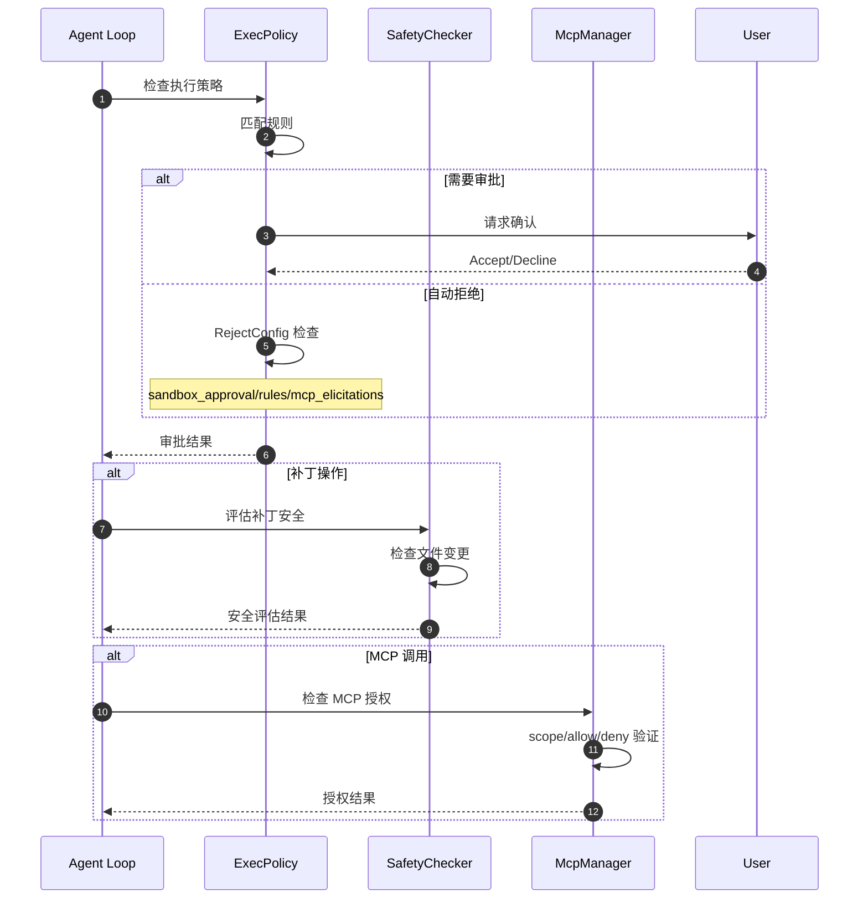
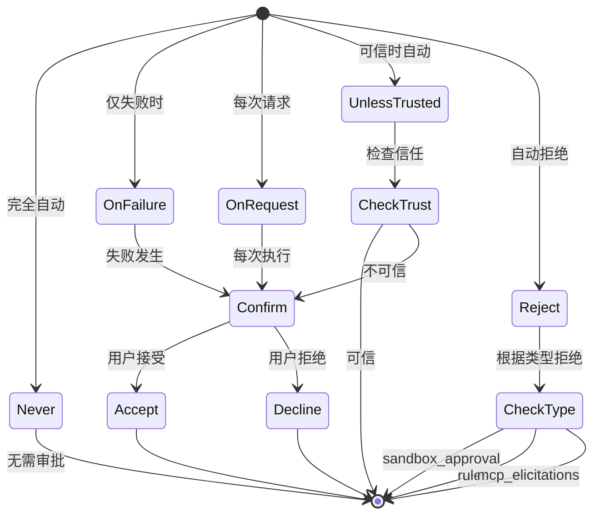
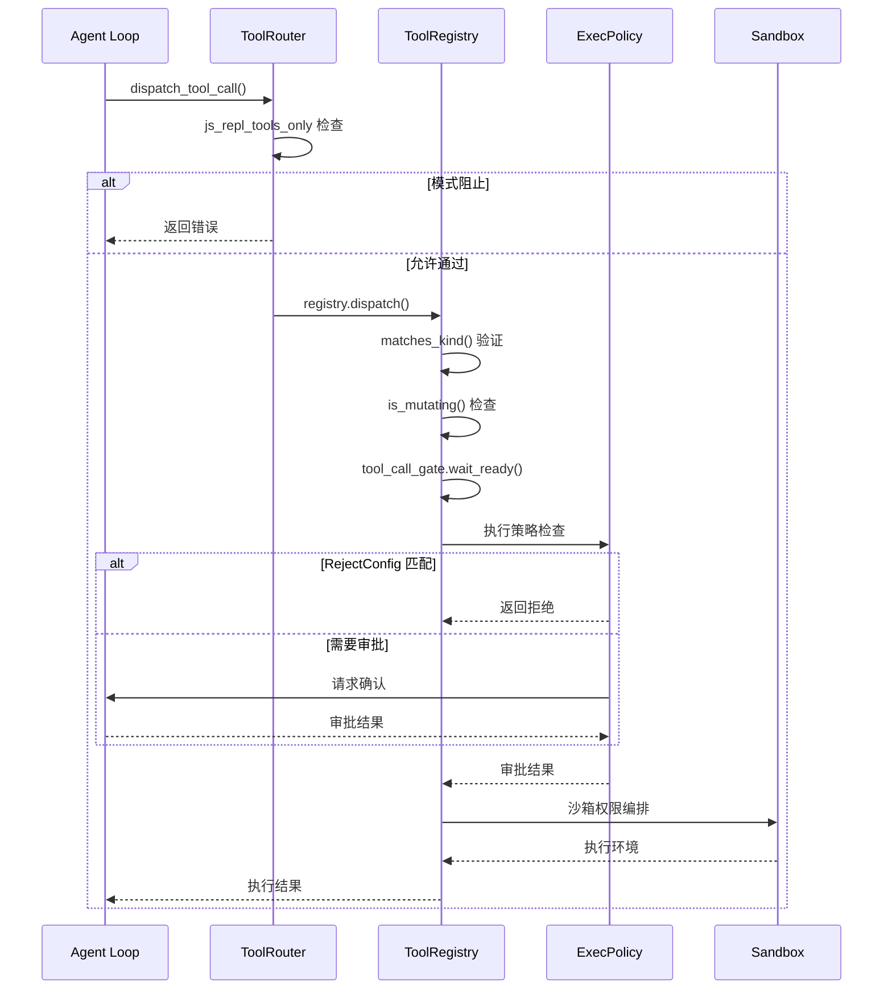
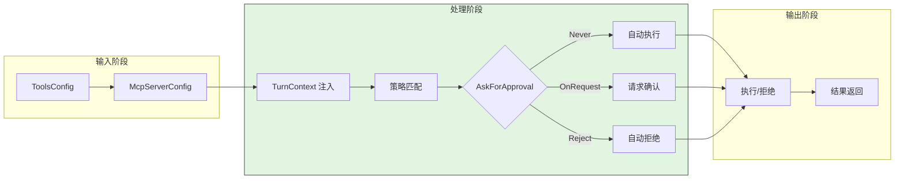
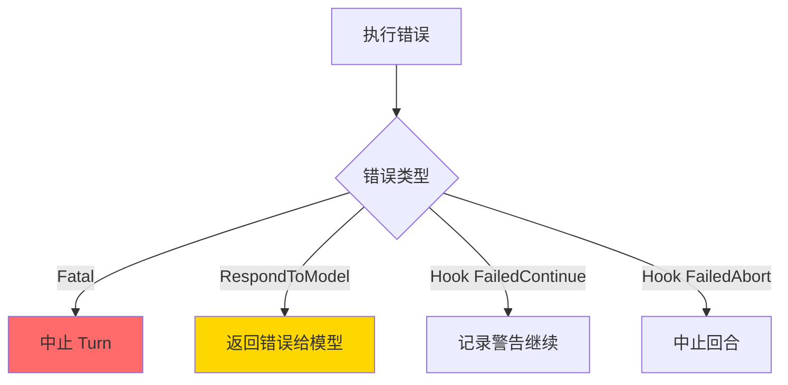
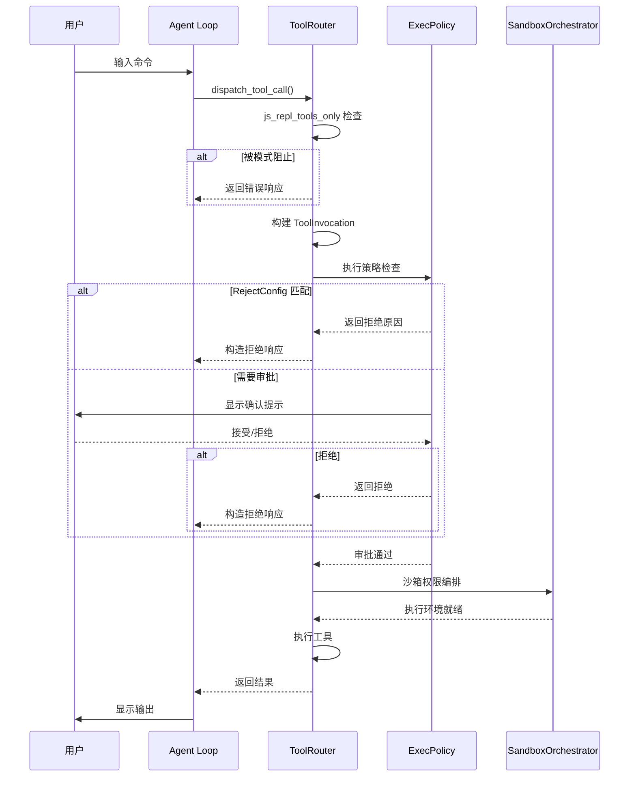
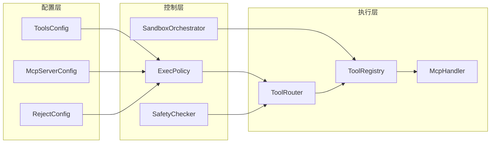

# Safety Control（codex）

## TL;DR（结论先行）

一句话定义：Codex 的 Safety Control 是**策略配置 + 执行前门控 + 审批分支 + 失败分级**的分层安全框架，从配置注入到工具执行多点生效。

Codex 的核心取舍：**中心化策略注入 + 显式审批门控**（对比 Gemini CLI 的静态分析、Kimi CLI 的自动确认超时）

**近期重要更新**：
- **Shell 提权安全重构**：zsh-fork 从 zsh_exec_bridge 迁移至 shell-escalation，采用 FD-based 通信机制，比 Unix Domain Socket 更防篡改
- **host_executable() 规则**：执行策略新增 basename-aware 匹配，允许规则如 `['git']` 匹配 `/usr/bin/git`
- **网络审批持久化**：网络策略审批结果现在持久化存储在 execpolicy 中，跨会话保持一致

---

## 1. 为什么需要这个机制？（解决什么问题）

### 1.1 问题场景

没有 Safety Control：
```
模型执行危险命令 → 无检查直接执行 → 数据丢失/系统损坏
MCP 工具过度授权 → 无审批直接调用 → 敏感信息泄露
沙箱配置错误 → 无验证直接运行 → 安全边界突破
```

有 Safety Control：
```
危险命令 → 策略检查 → 审批请求 → 用户确认 → 执行
MCP 调用 → 作用域验证 → 授权检查 → 受控执行 → 返回
沙箱启动 → 配置验证 → Seccomp 加载 → 网络隔离 → 安全运行
```

### 1.2 核心挑战

| 挑战 | 不解决的后果 |
|-----|-------------|
| 策略一致性 | 不同入口策略不统一，出现安全漏洞 |
| 审批用户体验 | 过度审批导致用户疲劳，降低效率 |
| MCP 工具隔离 | 外部工具过度授权，风险不可控 |
| 错误分级 | 所有错误都中止，影响正常流程 |
| 沙箱绕过 | 沙箱配置被绕过，隔离失效 |

---

## 2. 整体架构（ASCII 图）

### 2.1 在系统中的位置

```text
┌─────────────────────────────────────────────────────────────┐
│ Agent Loop / Tool System                                     │
│ codex-rs/core/src/loop.rs                                    │
│ codex-rs/core/src/tools/                                     │
└───────────────────────┬─────────────────────────────────────┘
                        │ 调用工具
                        ▼
┌─────────────────────────────────────────────────────────────┐
│ ▓▓▓ Safety Control ▓▓▓                                      │
│ codex-rs/core/src/                                           │
│ - safety.rs       : 补丁安全评估                             │
│ - exec_policy.rs  : 执行策略检查                             │
│ - sandboxing.rs   : 沙箱编排                                 │
└───────────────────────┬─────────────────────────────────────┘
                        │ 依赖
        ┌───────────────┼───────────────┐
        ▼               ▼               ▼
┌──────────────┐ ┌──────────────┐ ┌──────────────┐
│ ToolsConfig  │ │ RejectConfig │ │ Sandbox      │
│ 工具配置     │ │ 拒绝策略     │ │ 沙箱实现     │
└──────────────┘ └──────────────┘ └──────────────┘
```

### 2.2 核心组件职责

| 组件 | 职责 | 代码位置 |
|-----|------|---------|
| `AskForApproval` | 审批策略枚举 | `protocol/src/protocol.rs` |
| `RejectConfig` | 自动拒绝配置 | `protocol/src/protocol.rs` |
| `SafetyChecker` | 补丁安全评估 | `core/src/safety.rs:54` |
| `ExecPolicy` | 执行策略检查 | `core/src/exec_policy.rs:113` |
| `SandboxOrchestrator` | 沙箱权限编排 | `core/src/tools/sandboxing.rs:178` |
| **EscalateServer** | **Shell 提权服务器（FD-based）** | `shell-escalation/src/unix/escalate_server.rs:103` |
| **Policy** | **执行策略引擎（含 host_executable 匹配）** | `execpolicy/src/policy.rs:39` |
| **NetworkPolicyAmendment** | **网络策略审批持久化** | `execpolicy/src/amend.rs:86` |

### 2.3 核心组件交互关系



**关键交互说明**：

| 步骤 | 交互内容 | 设计意图 |
|-----|---------|---------|
| 1-2 | 执行策略检查 | 统一入口，集中策略判断 |
| 3-5 | 审批/拒绝分支 | 支持交互式确认和自动拒绝两种模式 |
| 6-8 | 补丁安全评估 | 文件操作前进行风险分析 |
| 9-11 | MCP 授权检查 | 外部工具权限隔离 |

---

## 3. 核心组件详细分析

### 3.1 AskForApproval 与 RejectConfig 内部结构

#### 职责定位

`AskForApproval` 是审批策略的核心枚举，控制何时向用户请求确认。`RejectConfig` 提供细粒度的自动拒绝能力。

#### 状态机图



#### 关键算法逻辑

```rust
// protocol/src/protocol.rs

pub enum AskForApproval {
    Never,                    // 完全自动，不询问
    OnFailure,               // 仅失败时询问
    OnRequest,               // 每次请求都询问
    UnlessTrusted,           // 除非被信任
    Reject(RejectConfig),    // 自动拒绝配置
}

pub struct RejectConfig {
    pub sandbox_approval: bool,     // 拒绝沙箱升级
    pub rules: bool,                // 拒绝策略触发的确认
    pub mcp_elicitations: bool,     // 拒绝 MCP 引导请求
}
```

**算法要点**：

1. **策略分层**：从完全自动到完全拒绝的五级策略
2. **细粒度控制**：RejectConfig 针对三类场景独立配置
3. **贯穿全链路**：同一策略在多个检查点生效

#### 关键接口

| 接口 | 输入 | 输出 | 说明 | 代码位置 |
|-----|------|------|------|---------|
| `rejects_sandbox_approval()` | - | bool | 是否拒绝沙箱审批 | `protocol.rs` |
| `rejects_rules_approval()` | - | bool | 是否拒绝规则审批 | `protocol.rs` |
| `rejects_mcp_elicitations()` | - | bool | 是否拒绝 MCP 引导 | `protocol.rs` |

### 3.2 ExecPolicy 执行策略内部结构

#### 职责定位

ExecPolicy 负责根据配置和规则判断命令执行前的审批要求。

#### 关键算法逻辑

```rust
// core/src/exec_policy.rs:113-123

AskForApproval::Reject(reject_config) => {
    if prompt_is_rule {
        if reject_config.rejects_rules_approval() {
            Some(REJECT_RULES_APPROVAL_REASON)
        }
    } else if reject_config.rejects_sandbox_approval() {
        Some(REJECT_SANDBOX_APPROVAL_REASON)
    }
}
```

**代码要点**：

1. **规则区分**：区分策略触发(rule)和沙箱升级(sandbox)两类审批
2. **提前拦截**：在执行前返回拒绝原因，避免危险操作
3. **统一理由**：标准化拒绝理由，便于日志和调试

### 3.3 SandboxOrchestrator 内部结构

#### 职责定位

SandboxOrchestrator 负责沙箱权限的编排，确保工具在受控环境中执行。

#### 关键算法逻辑

```rust
// core/src/tools/sandboxing.rs:178

if needs_approval && matches!(
    policy,
    AskForApproval::Reject(reject_config) if reject_config.rejects_sandbox_approval()
) {
    return ExecApprovalRequirement::Forbidden {
        reason: "Sandbox approval rejected by configuration",
    };
}
```

### 3.4 Linux Proxy-Only 网络沙箱

#### 架构设计

```text
主机网络命名空间                    沙箱网络命名空间
┌─────────────────┐                ┌─────────────────┐
│ 代理服务器       │◄──────────────►│ 本地桥接        │
│ (127.0.0.1:xxx) │   TCP 连接     │ (127.0.0.1:yyy) │
└────────┬────────┘                └────────┬────────┘
         │                                   │
         │    主机桥接进程 (host bridge)     │
         │    - Unix Domain Socket 监听      │
         │    - TCP 连接到代理服务器          │
         └───────────────────────────────────┘
```

#### 关键代码

```rust
// linux-sandbox/src/proxy_routing.rs:70-119

pub(crate) fn prepare_host_proxy_route_spec() -> io::Result<String> {
    let env: HashMap<String, String> = std::env::vars().collect();
    let plan = plan_proxy_routes(&env);

    // 创建 UDS 目录
    let socket_dir = create_proxy_socket_dir()?;

    // 为每个唯一端点创建主机桥接进程
    for (endpoint, socket_path) in &socket_by_endpoint {
        host_bridge_pids.push(spawn_host_bridge(*endpoint, socket_path)?);
    }

    // 生成路由配置 JSON
    serde_json::to_string(&ProxyRouteSpec { routes }).map_err(io::Error::other)
}
```

### 3.5 Shell 提权安全重构（FD-based）

#### 架构演进

**旧架构（zsh_exec_bridge）**：
```text
┌─────────────┐     Unix Domain Socket     ┌─────────────┐
│  zsh-fork   │ ◄────────────────────────► │   Bridge    │
│   Shell     │      （可被中间人攻击）      │   Server    │
└─────────────┘                            └─────────────┘
```

**新架构（shell-escalation FD-based）**：
```text
┌─────────────┐     Socket FD (继承)       ┌─────────────┐
│  zsh-fork   │ ◄────────────────────────► │EscalateServer│
│   Shell     │   文件描述符直接传递         │  （内核级）   │
└─────────────┘   无网络路径，防篡改         └─────────────┘
```

#### 设计意图

1. **防篡改通信**：FD-based 方案通过 `socketpair()` 创建的内核级通道传递文件描述符，无法被外部进程拦截
2. **移除中间层**：完全删除 `zsh_exec_bridge` 模块，简化架构并减少攻击面
3. **统一提权协议**：使用 `shell-escalation` crate 提供的标准化提权协议

#### 关键代码

```rust
// shell-escalation/src/unix/escalate_server.rs:103-147

pub async fn exec(
    &self,
    params: ExecParams,
    cancel_rx: CancellationToken,
    command_executor: Arc<dyn ShellCommandExecutor>,
) -> anyhow::Result<ExecResult> {
    // 创建 socket pair，FD 直接继承
    let (escalate_server, escalate_client) = AsyncDatagramSocket::pair()?;
    let client_socket = escalate_client.into_inner();
    // 只有客户端 endpoint 应该跨越 exec 进入 wrapper 进程
    client_socket.set_cloexec(false)?;

    let escalate_task = tokio::spawn(escalate_task(
        escalate_server,
        Arc::clone(&self.policy),
        Arc::clone(&command_executor),
    ));

    // 通过环境变量传递 FD 编号
    let mut env = std::env::vars().collect::<HashMap<String, String>>();
    env.insert(
        ESCALATE_SOCKET_ENV_VAR.to_string(),
        client_socket.as_raw_fd().to_string(),
    );
    // ... 执行命令
}
```

```rust
// core/src/tools/runtimes/shell/unix_escalation.rs:160-172

// CoreShellActionProvider 实现 EscalationPolicy trait
let escalation_policy = CoreShellActionProvider {
    policy: Arc::clone(&exec_policy),
    session: Arc::clone(&ctx.session),
    turn: Arc::clone(&ctx.turn),
    call_id: ctx.call_id.clone(),
    approval_policy: ctx.turn.approval_policy.value(),
    // ...
};

let escalate_server = EscalateServer::new(
    shell_zsh_path.clone(),
    main_execve_wrapper_exe,
    escalation_policy,
);

let exec_result = escalate_server
    .exec(exec_params, cancel_token, Arc::new(command_executor))
    .await?;
```

### 3.6 执行策略增强（host_executable）

#### 职责定位

`host_executable()` 规则允许执行策略使用 basename-aware 匹配，解决绝对路径命令的规则匹配问题。

#### 匹配语义

```text
传统匹配（精确匹配）：
  /usr/bin/git status  只能匹配  pattern=["/usr/bin/git", "status"]

host_executable 匹配（basename 回退）：
  /usr/bin/git status  可匹配  pattern=["git", "status"]
  前提是 host_executable(name="git", paths=["/usr/bin/git"]) 已定义
```

#### 关键代码

```rust
// execpolicy/src/policy.rs:307-334

fn match_host_executable_rules(&self, cmd: &[String]) -> Vec<RuleMatch> {
    let Some(first) = cmd.first() else {
        return Vec::new();
    };
    let Ok(program) = AbsolutePathBuf::try_from(first.clone()) else {
        return Vec::new();
    };
    let Some(basename) = executable_path_lookup_key(program.as_path()) else {
        return Vec::new();
    };
    let Some(rules) = self.rules_by_program.get_vec(&basename) else {
        return Vec::new();
    };
    // 检查 host_executable 定义的路径白名单
    if let Some(paths) = self.host_executables_by_name.get(&basename)
        && !paths.iter().any(|path| path == &program)
    {
        return Vec::new();  // 路径不在白名单中，拒绝匹配
    }

    // 使用 basename 构建命令进行规则匹配
    let basename_command = std::iter::once(basename)
        .chain(cmd.iter().skip(1).cloned())
        .collect::<Vec<_>>();
    rules
        .iter()
        .filter_map(|rule| rule.matches(&basename_command))
        .map(|rule_match| rule_match.with_resolved_program(&program))
        .collect()
}
```

#### 配置示例

```starlark
# execpolicy/README.md

# 定义 host executable 路径白名单
host_executable(
    name = "git",
    paths = [
        "/opt/homebrew/bin/git",
        "/usr/bin/git",
    ],
)

# 现在可以使用 basename 定义规则
prefix_rule(
    pattern = ["git", "status"],
    decision = "allow",
)
```

### 3.7 网络审批持久化

#### 职责定位

网络策略审批结果现在持久化存储在 execpolicy 中，确保跨会话的一致性行为。

#### 关键代码

```rust
// execpolicy/src/amend.rs:86-126

/// 追加网络规则到策略文件（带文件锁）
pub fn blocking_append_network_rule(
    policy_path: &Path,
    host: &str,
    protocol: NetworkRuleProtocol,
    decision: Decision,
    justification: Option<&str>,
) -> Result<(), AmendError> {
    let host = normalize_network_rule_host(host)
        .map_err(|err| AmendError::InvalidNetworkRule(err.to_string()))?;

    // 序列化规则字段
    let host = serde_json::to_string(&host)
        .map_err(|source| AmendError::SerializeNetworkRule { source })?;
    let protocol = serde_json::to_string(protocol.as_policy_string())?;
    let decision = serde_json::to_string(match decision {
        Decision::Allow => "allow",
        Decision::Prompt => "prompt",
        Decision::Forbidden => "deny",
    })?;

    // 构建规则字符串
    let mut args = vec![
        format!("host={host}"),
        format!("protocol={protocol}"),
        format!("decision={decision}"),
    ];
    if let Some(justification) = justification {
        let justification = serde_json::to_string(justification)?;
        args.push(format!("justification={justification}"));
    }
    let rule = format!("network_rule({})", args.join(", "));
    append_rule_line(policy_path, &rule)
}
```

```rust
// core/src/network_policy_decision.rs:93-121

/// 将网络策略修订转换为 execpolicy 格式
pub(crate) fn execpolicy_network_rule_amendment(
    amendment: &NetworkPolicyAmendment,
    network_approval_context: &NetworkApprovalContext,
    host: &str,
) -> ExecPolicyNetworkRuleAmendment {
    let protocol = match network_approval_context.protocol {
        NetworkApprovalProtocol::Http => ExecPolicyNetworkRuleProtocol::Http,
        NetworkApprovalProtocol::Https => ExecPolicyNetworkRuleProtocol::Https,
        // ...
    };
    let (decision, action_verb) = match amendment.action {
        NetworkPolicyRuleAction::Allow => (ExecPolicyDecision::Allow, "Allow"),
        NetworkPolicyRuleAction::Deny => (ExecPolicyDecision::Forbidden, "Deny"),
    };
    let justification = format!("{action_verb} {protocol_label} access to {host}");

    ExecPolicyNetworkRuleAmendment {
        protocol,
        decision,
        justification,
    }
}
```

#### 持久化流程

```text
用户审批网络请求
       │
       ▼
┌─────────────────┐
│ NetworkPolicy   │ ──► 生成 NetworkPolicyAmendment
│ Amendment       │
└────────┬────────┘
         │
         ▼
┌─────────────────┐
│ execpolicy      │ ──► 转换为 network_rule() 格式
│ amend.rs        │
└────────┬────────┘
         │
         ▼
┌─────────────────┐
│ 策略文件追加    │ ──► 带文件锁追加到 .rules 文件
│ (持久化存储)    │
└─────────────────┘
```

### 3.8 组件间协作时序



### 3.9 关键数据路径

#### 主路径（正常审批）



#### 异常路径（错误分级）



---

## 4. 端到端数据流转

### 4.1 正常流程（详细版）



**数据变换详情**：

| 阶段 | 输入 | 处理 | 输出 | 代码位置 |
|-----|------|------|------|---------|
| 策略检查 | ToolInvocation | 匹配 ExecPolicy | ApprovalRequirement | `exec_policy.rs:113` |
| 审批请求 | ApprovalRequirement | 用户交互 | ApprovalDecision | `sandboxing.rs:178` |
| 沙箱编排 | ApprovalDecision | 权限配置 | SandboxConfig | `sandboxing.rs` |
| 错误分级 | ToolOutput | 分类处理 | Error/Continue | `registry.rs` |

### 4.2 数据流向图



---

## 5. 关键代码实现

### 5.1 核心数据结构

```rust
// protocol/src/protocol.rs

pub enum AskForApproval {
    Never,
    OnFailure,
    OnRequest,
    UnlessTrusted,
    Reject(RejectConfig),
}

pub struct RejectConfig {
    pub sandbox_approval: bool,
    pub rules: bool,
    pub mcp_elicitations: bool,
}
```

**字段说明**：

| 字段 | 类型 | 用途 |
|-----|------|------|
| `sandbox_approval` | `bool` | 拒绝沙箱升级请求 |
| `rules` | `bool` | 拒绝策略触发的确认 |
| `mcp_elicitations` | `bool` | 拒绝 MCP 工具授权请求 |

### 5.2 主链路代码

```rust
// core/src/exec_policy.rs:113-123

AskForApproval::Reject(reject_config) => {
    if prompt_is_rule {
        if reject_config.rejects_rules_approval() {
            Some(REJECT_RULES_APPROVAL_REASON)
        }
    } else if reject_config.rejects_sandbox_approval() {
        Some(REJECT_SANDBOX_APPROVAL_REASON)
    }
}

// core/src/safety.rs:54-58
let rejects_sandbox_approval = matches!(policy, AskForApproval::Never)
    || matches!(
        policy,
        AskForApproval::Reject(reject_config) if reject_config.sandbox_approval
    );

// core/src/tools/sandboxing.rs:178
if needs_approval && matches!(
    policy,
    AskForApproval::Reject(reject_config) if reject_config.rejects_sandbox_approval()
) {
    return ExecApprovalRequirement::Forbidden { ... };
}
```

**代码要点**：

1. **统一枚举**：`AskForApproval::Reject` 贯穿所有审批检查点
2. **细粒度控制**：三类拒绝场景独立配置
3. **提前拦截**：在执行前返回拒绝，避免副作用

### 5.3 关键调用链

```text
dispatch_tool_call()          [tools/router.rs:372]
  -> js_repl_tools_only 检查
  -> ToolRegistry::dispatch()   [tools/registry.rs:194]
    -> is_mutating() 检查
    -> tool_call_gate.wait_ready()
    -> ExecPolicy 检查          [exec_policy.rs:113]
      - RejectConfig 匹配
      - 审批请求
    -> SandboxOrchestrator      [tools/sandboxing.rs:178]
      - 权限编排
      - needs_approval 检查
```

---

## 6. 设计意图与 Trade-off

### 6.1 Codex 的选择

| 维度 | Codex 的选择 | 替代方案 | 取舍分析 |
|-----|-------------|---------|---------|
| 策略注入 | TurnContext 注入 | 全局静态配置 | 每轮独立控制，但增加上下文传递 |
| 审批模式 | 显式交互式 | 自动确认超时 | 用户可控，但中断流程 |
| MCP 隔离 | Server 级 allow/deny | 无隔离/完全信任 | 粒度适中，配置复杂度适中 |
| 错误处理 | 分级错误类型 | 统一错误码 | 精确控制，但类型复杂 |
| 沙箱 | Linux Proxy-Only + Seccomp | 纯容器/无沙箱 | 轻量级，但平台受限 |

### 6.2 为什么这样设计？

**核心问题**：如何在保证安全的前提下，不牺牲用户体验？

**Codex 的解决方案**：
- 代码依据：`protocol/src/protocol.rs` 的 `AskForApproval` 枚举设计
- 设计意图：从完全自动到完全拒绝的五级策略，适应不同场景
- 带来的好处：
  - 可信环境可完全自动化
  - 敏感操作可强制确认
  - CI/自动化场景可配置拒绝
- 付出的代价：
  - 策略配置复杂度增加
  - 需要理解各类审批场景的区别

### 6.3 与其他项目的对比

| 项目 | 核心差异 | 适用场景 |
|-----|---------|---------|
| Codex | 显式审批 + RejectConfig | 需要精细控制的企业环境 |
| Gemini CLI | 静态分析 + 自动确认超时 | 快速迭代，低摩擦 |
| Kimi CLI | 自动确认 + 超时回退 | 开发效率优先 |
| OpenCode | 基于策略的自动审批 | 规则明确的场景 |

---

## 7. 边界情况与错误处理

### 7.1 终止条件

| 终止原因 | 触发条件 | 代码位置 |
|---------|---------|---------|
| 策略拒绝 | RejectConfig 匹配 | `exec_policy.rs:113` |
| 用户拒绝 | 审批对话框选择 Decline | `sandboxing.rs` |
| Fatal 错误 | 严重执行错误 | `registry.rs` |
| Hook 中止 | after_tool_use 返回 FailedAbort | `registry.rs:545` |
| 沙箱配置错误 | 权限编排失败 | `sandboxing.rs` |

### 7.2 超时/资源限制

```rust
// MCP 工具调用超时
pub tool_timeout_sec: Option<Duration>,

// 服务器启动超时
pub startup_timeout_sec: Option<Duration>,
```

### 7.3 错误恢复策略

| 错误类型 | 处理策略 | 代码位置 |
|---------|---------|---------|
| `RespondToModel` | 返回错误给模型，继续对话 | `router.rs:411` |
| `Fatal` | 中止当前 Turn | `router.rs:410` |
| `FailedContinue` | 记录警告，继续执行 | `registry.rs` |
| `FailedAbort` | 中止回合 | `registry.rs:545` |
| 审批拒绝 | 构造拒绝响应返回模型 | `sandboxing.rs` |

---

## 8. 关键代码索引

| 功能 | 文件 | 行号 | 说明 |
|-----|------|------|------|
| 审批策略 | `protocol/src/protocol.rs` | - | AskForApproval 枚举 |
| 拒绝配置 | `protocol/src/protocol.rs` | 245 | RejectConfig 结构 |
| 执行策略 | `core/src/exec_policy.rs` | 113 | 策略检查逻辑 |
| 补丁安全 | `core/src/safety.rs` | 54 | 安全评估 |
| 沙箱编排 | `core/src/tools/sandboxing.rs` | 178 | 权限编排 |
| MCP 拒绝 | `core/src/mcp_connection_manager.rs` | 245 | MCP 引导检查 |
| 代理沙箱 | `linux-sandbox/src/proxy_routing.rs` | 70 | Proxy-Only 实现 |
| **Shell 提权** | `shell-escalation/src/unix/escalate_server.rs` | 103 | FD-based 提权服务器 |
| **Unix 提权实现** | `core/src/tools/runtimes/shell/unix_escalation.rs` | 53 | zsh-fork 提权集成 |
| **host_executable** | `execpolicy/src/policy.rs` | 307 | basename-aware 匹配 |
| **策略解析** | `execpolicy/src/parser.rs` | 437 | host_executable() 解析 |
| **网络规则追加** | `execpolicy/src/amend.rs` | 86 | 网络审批持久化 |
| **网络策略决策** | `core/src/network_policy_decision.rs` | 93 | 网络审批转换 |

---

## 9. 延伸阅读

- 前置知识：`05-codex-tools-system.md`、`06-codex-mcp-integration.md`
- 相关机制：`04-codex-agent-loop.md`
- 深度分析：`docs/codex/questions/codex-tool-security.md`

---

*✅ Verified: 基于 codex/codex-rs/core/src/{safety,exec_policy,sandboxing}.rs 源码分析*
*⚠️ Inferred: Shell Escalation 重构基于 commit 3ca0e7673b77303db6e0d686c1d9d34fc2ed63e0*
*⚠️ Inferred: host_executable() 基于 commit b148d98e0eaed114b38c461e6cd9ef845bb491d1*
*⚠️ Inferred: 网络审批持久化基于 commit c3048ff90a4c41160d3bfb0186fba969aacb2cef*
*基于版本：2026-02-08 | 最后更新：2026-03-02*
