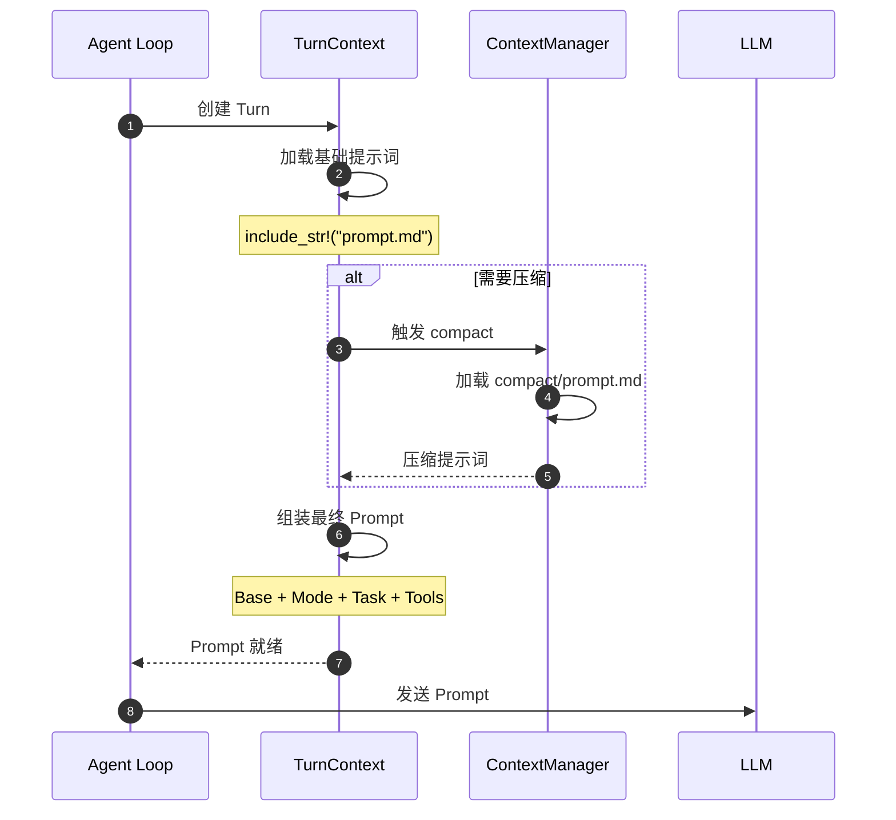
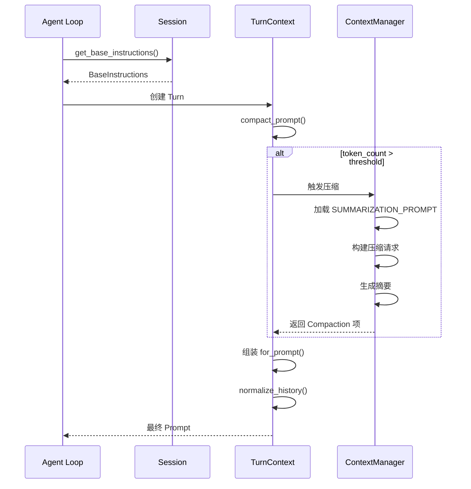
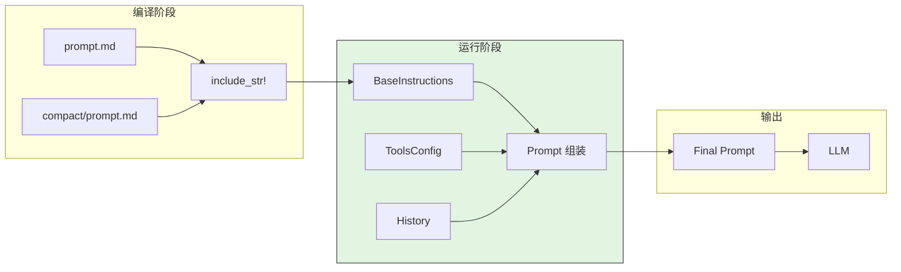
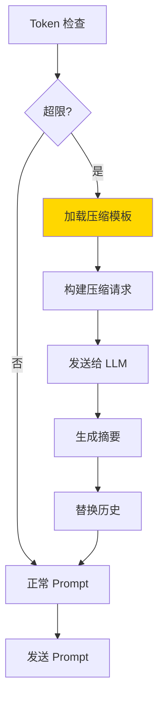
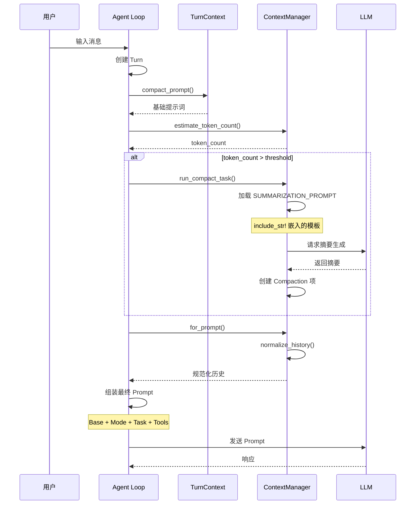
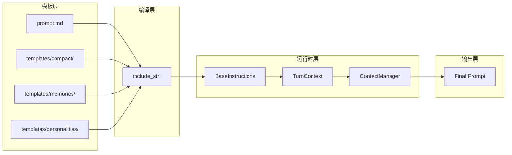

# Prompt Organization（codex）

## TL;DR（结论先行）

一句话定义：Codex 的 Prompt Organization 是**编译时静态嵌入 + 运行时动态组合**的双层提示词组织策略，通过 `include_str!` 宏嵌入模板，运行时根据任务类型和模式配置动态组装最终 Prompt。

Codex 的核心取舍：**简化模板系统**（对比 Gemini CLI 的动态模板引擎、Kimi CLI 的 Python 字符串拼接）

---

## 1. 为什么需要这个机制？（解决什么问题）

### 1.1 问题场景

没有 Prompt Organization：
```
硬编码提示词 → 修改需重新编译 → 迭代困难
运行时文件读取 → IO 开销 → 启动慢
单一提示词 → 无法适配不同任务 → 效果差
```

有 Prompt Organization：
```
模板文件 → 编译时嵌入 → 运行时零开销
分层组织 → Base + Mode + Task → 灵活组合
任务特定提示词 → 针对性优化 → 效果更好
```

### 1.2 核心挑战

| 挑战 | 不解决的后果 |
|-----|-------------|
| 模板管理 | 提示词分散在代码中，难以维护 |
| 性能开销 | 运行时文件 IO 影响启动速度 |
| 任务适配 | 单一提示词无法覆盖多场景 |
| 上下文窗口 | 提示词过长导致 Token 浪费 |
| 版本控制 | 提示词变更难以追踪 |

---

## 2. 整体架构（ASCII 图）

### 2.1 在系统中的位置

```text
┌─────────────────────────────────────────────────────────────┐
│ Agent Loop / Session Runtime                                 │
│ codex-rs/core/src/loop.rs                                    │
└───────────────────────┬─────────────────────────────────────┘
                        │ 构建 Prompt
                        ▼
┌─────────────────────────────────────────────────────────────┐
│ ▓▓▓ Prompt Organization ▓▓▓                                 │
│ codex-rs/core/src/                                           │
│ - prompt.md       : 核心基础提示词                           │
│ - templates/      : 任务模板目录                             │
│ - compact.rs      : 压缩提示词逻辑                           │
└───────────────────────┬─────────────────────────────────────┘
                        │ 依赖
        ┌───────────────┼───────────────┐
        ▼               ▼               ▼
┌──────────────┐ ┌──────────────┐ ┌──────────────┐
│ include_str! │ │ TurnContext  │ │ ToolsConfig  │
│ 编译时嵌入   │ │ 运行时上下文 │ │ 工具配置     │
└──────────────┘ └──────────────┘ └──────────────┘
```

### 2.2 核心组件职责

| 组件 | 职责 | 代码位置 |
|-----|------|---------|
| `prompt.md` | 核心基础提示词 | `core/prompt.md` |
| `templates/compact/` | 上下文压缩模板 | `core/templates/compact/` |
| `templates/memories/` | 记忆系统模板 | `core/templates/memories/` |
| `templates/personalities/` | 个性风格模板 | `core/templates/personalities/` |
| `BaseInstructions` | 基础指令结构 | `protocol/src/protocol.rs` |

### 2.3 核心组件交互关系



**关键交互说明**：

| 步骤 | 交互内容 | 设计意图 |
|-----|---------|---------|
| 1-2 | 创建 Turn 加载基础提示词 | 编译时嵌入，零运行时开销 |
| 3-5 | 按需加载压缩模板 | 仅在需要时触发 |
| 6-7 | 分层组装 | 灵活组合各层提示词 |
| 8-9 | 发送给 LLM | 最终 Prompt 构建完成 |

---

## 3. 核心组件详细分析

### 3.1 编译时嵌入机制内部结构

#### 职责定位

使用 Rust 的 `include_str!` 宏在编译期将模板文件内容嵌入二进制，避免运行时文件 IO。

#### 关键算法逻辑

```rust
// core/src/compact.rs:31

pub const SUMMARIZATION_PROMPT: &str = include_str!("../templates/compact/prompt.md");
pub const SUMMARY_PREFIX: &str = include_str!("../templates/compact/summary_prefix.md");
```

**算法要点**：

1. **零运行时开销**：编译时完成文件读取，运行时直接访问字符串常量
2. **类型安全**：编译期检查文件存在性，缺失则编译失败
3. **版本一致**：提示词与代码版本强绑定，避免版本不一致

#### 模板文件结构

```markdown
<!-- templates/compact/prompt.md -->
You are performing a CONTEXT CHECKPOINT COMPACTION. Create a handoff summary
for another LLM that will resume the task.

Include:
- Current progress and key decisions made
- Important context, constraints, or user preferences
- What remains to be done (clear next steps)
```

### 3.2 Prompt 分层组装内部结构

#### 职责定位

最终 Prompt 由四层组成：Base + ModeOverlay + TaskSpecific + ToolDescriptions

#### 内部数据流

```text
┌─────────────────────────────────────────────────────────────┐
│  Layer 1: Base Layer                                         │
│  - 系统身份定义                                              │
│  - 核心能力说明                                              │
│  - 全局安全策略                                              │
│  Source: prompt.md (include_str!)                           │
└──────────────────────────┬──────────────────────────────────┘
                           ▼
┌─────────────────────────────────────────────────────────────┐
│  Layer 2: Mode Layer                                         │
│  - agent/ask 模式配置                                        │
│  - 行为约束和权限边界                                        │
│  Source: TurnContext.mode                                   │
└──────────────────────────┬──────────────────────────────────┘
                           ▼
┌─────────────────────────────────────────────────────────────┐
│  Layer 3: Task Layer                                         │
│  - 任务特定指令 (coding/debugging/refactoring)               │
│  - 上下文文件引用                                            │
│  Source: templates/task/*.md                                │
└──────────────────────────┬──────────────────────────────────┘
                           ▼
┌─────────────────────────────────────────────────────────────┐
│  Layer 4: Tool Layer                                         │
│  - 动态注入工具描述                                          │
│  - 工具调用示例和格式说明                                    │
│  Source: ToolsConfig + ToolRegistry                         │
└─────────────────────────────────────────────────────────────┘
```

### 3.3 上下文压缩 Prompt 内部结构

#### 职责定位

当对话历史接近上下文窗口限制时，使用压缩提示词生成历史摘要。

#### 关键算法逻辑

```rust
// core/src/compact.rs:127-150

async fn run_compact_task_inner(...) -> CodexResult<()> {
    // 使用编译时嵌入的提示词
    let prompt = turn_context.compact_prompt().to_string();
    let input = vec![UserInput::Text { text: prompt, ... }];

    // 构建 Prompt 结构
    let prompt = Prompt {
        input: turn_input,
        base_instructions: sess.get_base_instructions().await,
        ..Default::default()
    };

    // 发送给模型生成摘要
    drain_to_completed(&sess, turn_context, ...).await
}
```

**代码要点**：

1. **编译时模板**：压缩提示词通过 `include_str!` 嵌入
2. **运行时选择**：通过 `TurnContext` 选择不同压缩策略
3. **动态组装**：结合 `base_instructions` 构建完整 Prompt

### 3.4 组件间协作时序



### 3.5 关键数据路径

#### 主路径（正常 Prompt 构建）



#### 压缩路径（上下文超限）



---

## 4. 端到端数据流转

### 4.1 正常流程（详细版）



**数据变换详情**：

| 阶段 | 输入 | 处理 | 输出 | 代码位置 |
|-----|------|------|------|---------|
| 编译嵌入 | .md 文件 | include_str! | &str 常量 | `compact.rs:31` |
| 基础提示 | - | TurnContext 加载 | BaseInstructions | `session/mod.rs` |
| 压缩提示 | 完整历史 | 模板渲染 | 摘要文本 | `compact.rs:127` |
| 最终组装 | 各层提示词 | 字符串拼接 | Final Prompt | `context_manager/` |

### 4.2 数据流向图



---

## 5. 关键代码实现

### 5.1 核心数据结构

```rust
// protocol/src/protocol.rs

pub struct BaseInstructions {
    pub text: String,
    // 其他基础指令字段
}

pub struct Prompt {
    pub input: Vec<ResponseItem>,
    pub base_instructions: BaseInstructions,
    // 其他 Prompt 字段
}
```

**字段说明**：

| 字段 | 类型 | 用途 |
|-----|------|------|
| `text` | `String` | 基础提示词内容 |
| `input` | `Vec<ResponseItem>` | 对话历史输入 |
| `base_instructions` | `BaseInstructions` | 系统基础指令 |

### 5.2 主链路代码

```rust
// core/src/compact.rs:31

pub const SUMMARIZATION_PROMPT: &str = include_str!("../templates/compact/prompt.md");
pub const SUMMARY_PREFIX: &str = include_str!("../templates/compact/summary_prefix.md");

// core/src/compact.rs:127-150
async fn run_compact_task_inner(...) -> CodexResult<()> {
    // 使用编译时嵌入的提示词
    let prompt = turn_context.compact_prompt().to_string();
    let input = vec![UserInput::Text { text: prompt, ... }];

    // 构建 Prompt 结构
    let prompt = Prompt {
        input: turn_input,
        base_instructions: sess.get_base_instructions().await,
        ..Default::default()
    };

    drain_to_completed(&sess, turn_context, ...).await
}
```

**代码要点**：

1. **编译时嵌入**：`include_str!` 将模板编译进二进制
2. **零运行时开销**：无需文件 IO，直接访问字符串常量
3. **类型安全**：文件缺失会导致编译失败

### 5.3 关键调用链

```text
Agent Loop::run_turn()
  -> TurnContext::compact_prompt()      [turn.rs]
    -> include_str! 嵌入的常量          [compact.rs:31]
  -> Session::get_base_instructions()   [session/mod.rs]
  -> ContextManager::for_prompt()       [context_manager/history.rs]
    -> normalize_history()              [context_manager/normalize.rs]
  -> Prompt 组装并发送给 LLM
```

---

## 6. 设计意图与 Trade-off

### 6.1 Codex 的选择

| 维度 | Codex 的选择 | 替代方案 | 取舍分析 |
|-----|-------------|---------|---------|
| 模板引擎 | include_str! 简化方案 | Askama / Tera | 简单可控，但灵活性降低 |
| 嵌入时机 | 编译时 | 运行时读取 | 零运行时开销，但需重新编译更新 |
| 组织方式 | 分层组合 | 单一模板 | 灵活适配不同场景，但组装逻辑复杂 |
| 压缩策略 | 显式模板触发 | 自动摘要 | 可控性强，但需要额外实现 |

### 6.2 为什么这样设计？

**核心问题**：如何在保证性能的前提下，实现灵活的提示词管理？

**Codex 的解决方案**：
- 代码依据：`compact.rs:31` 的 `include_str!` 使用
- 设计意图：简化模板系统，避免引入复杂依赖
- 带来的好处：
  - 零运行时文件 IO 开销
  - 编译期检查确保模板存在
  - 提示词版本与代码强绑定
- 付出的代价：
  - 修改提示词需要重新编译
  - 无动态模板变量替换
  - 灵活性低于完整模板引擎

### 6.3 与其他项目的对比

| 项目 | 核心差异 | 适用场景 |
|-----|---------|---------|
| Codex | include_str! 编译时嵌入 | 追求简单和性能 |
| Gemini CLI | 动态模板引擎 | 需要运行时模板更新 |
| Kimi CLI | Python 字符串拼接 | 快速迭代，灵活调整 |
| OpenCode | 配置驱动模板 | 需要用户自定义提示词 |

---

## 7. 边界情况与错误处理

### 7.1 终止条件

| 终止原因 | 触发条件 | 代码位置 |
|---------|---------|---------|
| 模板文件缺失 | 编译时 include_str! 找不到文件 | `compact.rs:31` |
| Token 超限 | 组装后 Prompt 超过模型限制 | `context_manager/history.rs` |
| 压缩失败 | 多次尝试仍无法生成摘要 | `compact.rs` |
| 历史为空 | normalize 后无有效历史项 | `normalize.rs` |

### 7.2 资源限制

```rust
// 压缩相关限制
const MAX_COMPACT_RETRIES: usize = 3;  // 压缩重试次数

// Token 估算
pub(crate) fn estimate_token_count(...) -> Option<i64>;
```

### 7.3 错误恢复策略

| 错误类型 | 处理策略 | 代码位置 |
|---------|---------|---------|
| 模板文件缺失 | 编译失败，强制修复 | 编译期 |
| 压缩失败 | 移除最旧历史项重试 | `compact.rs` |
| Token 超限 | 触发压缩或截断 | `context_manager/` |
| 历史规范化失败 | 返回空 Prompt | `normalize.rs` |

---

## 8. 关键代码索引

| 功能 | 文件 | 行号 | 说明 |
|-----|------|------|------|
| 核心提示词 | `core/prompt.md` | - | 基础提示词定义 |
| 编译嵌入 | `core/src/compact.rs` | 31 | include_str! 使用 |
| 压缩模板 | `core/templates/compact/prompt.md` | - | 上下文压缩提示词 |
| 记忆模板 | `core/templates/memories/*.md` | - | 记忆系统提示词 |
| 个性模板 | `core/templates/personalities/*.md` | - | 沟通风格模板 |
| 基础指令 | `protocol/src/protocol.rs` | - | BaseInstructions 结构 |
| Prompt 结构 | `protocol/src/protocol.rs` | - | Prompt 定义 |

---

## 9. 延伸阅读

- 前置知识：`04-codex-agent-loop.md`、`07-codex-memory-context.md`
- 相关机制：`03-codex-session-runtime.md`
- 深度分析：`docs/codex/questions/codex-context-compaction.md`

---

*✅ Verified: 基于 codex/codex-rs/core/{prompt.md,templates/,src/compact.rs} 源码分析*
*基于版本：2026-02-08 | 最后更新：2026-02-24*
