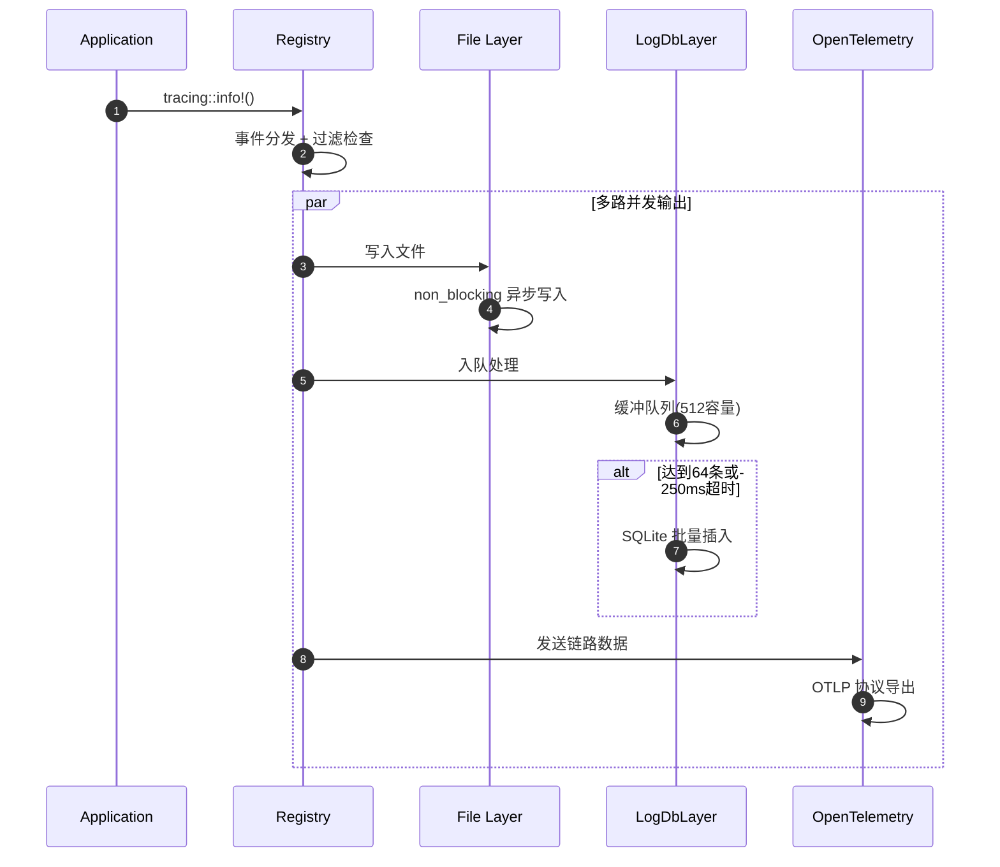
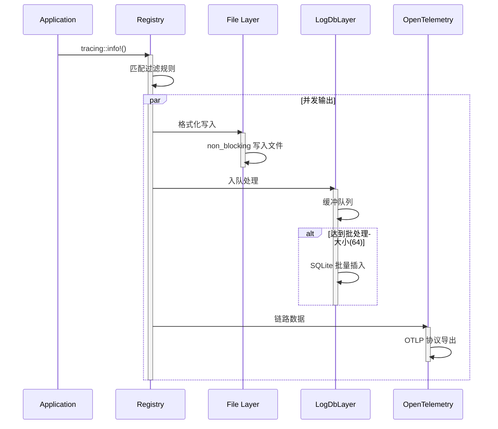
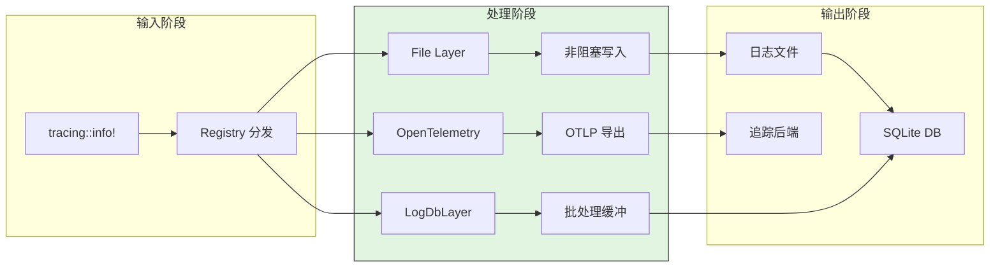
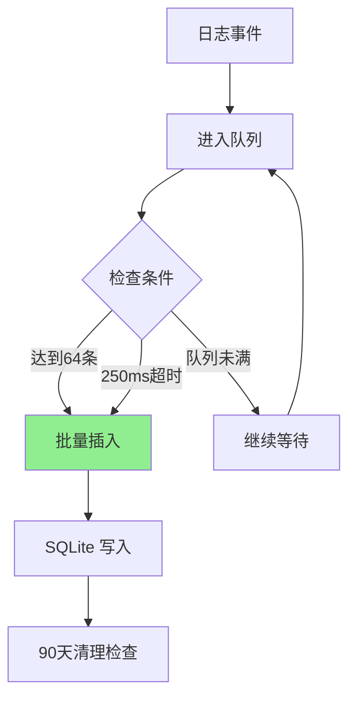
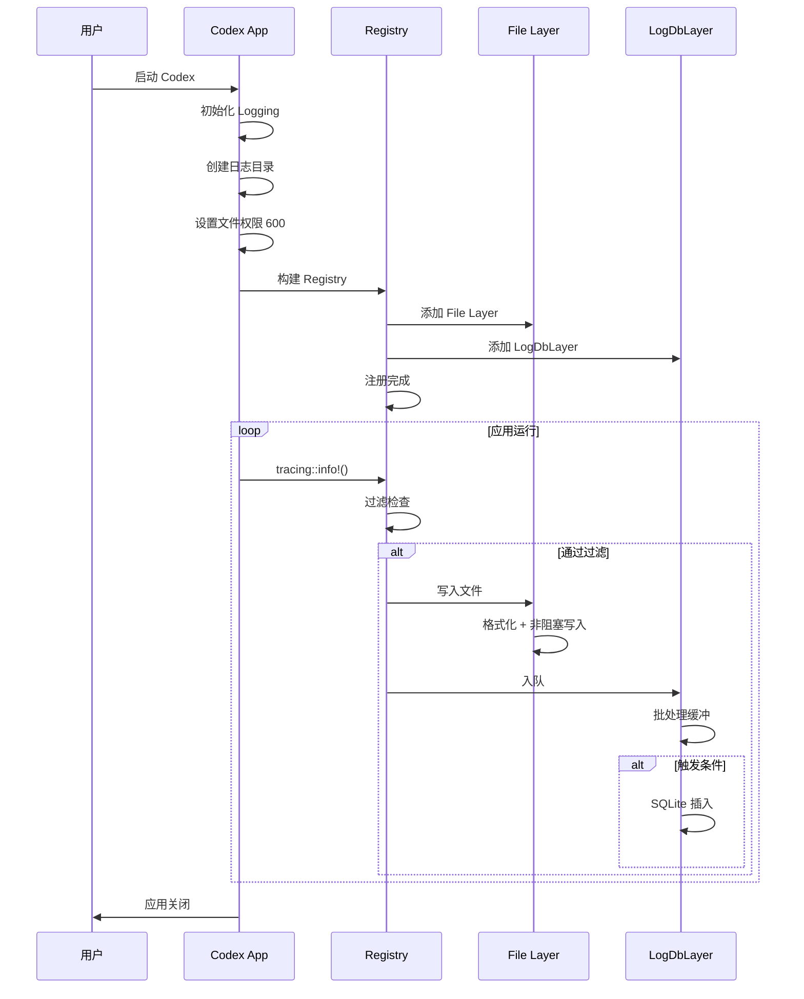
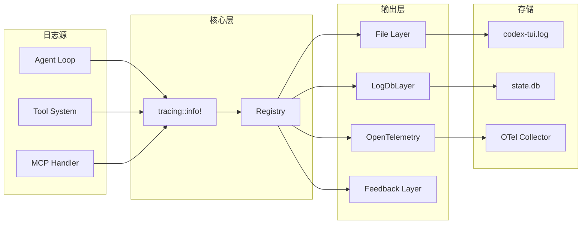
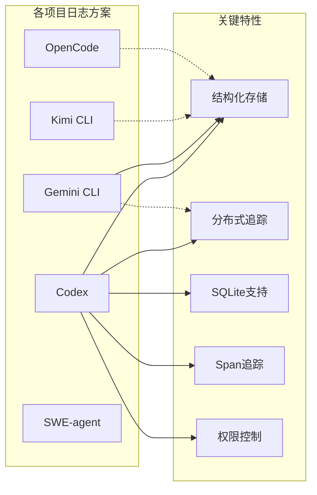

# Codex Logging 机制

> **阅读指南**
>
> | 属性 | 说明 |
> |-----|------|
> | 预计阅读 | 15-20 分钟 |
> | 前置文档 | `01-codex-overview.md`、`04-codex-agent-loop.md` |
> | 文档结构 | TL;DR → 架构 → 组件分析 → 数据流转 → 代码实现 → 对比 |
> | 代码呈现 | 关键代码直接展示，完整代码可折叠查看 |

---

## TL;DR（结论先行）

**一句话定义**：Codex 的 Logging 是**基于 Rust tracing 框架的多层 subscriber 架构**，同时支持文件日志、SQLite 持久化存储和 OpenTelemetry 分布式追踪，实现企业级可观测性。

Codex 的核心取舍：**结构化存储 + 分布式追踪原生支持**（对比传统文本日志、简单打印输出）

### 核心要点速览

| 维度 | 关键决策 | 代码位置 |
|-----|---------|---------|
| 日志框架 | Rust tracing + 多层 subscriber | `tui/src/lib.rs:325` |
| 存储方式 | SQLite 结构化 + 文件日志双轨 | `state/src/log_db.rs:1` |
| 并发处理 | non_blocking 写入 + 批处理缓冲 | `tui/src/lib.rs:345`、`log_db.rs:200` |
| 可观测性 | OpenTelemetry 原生集成 | `core/src/otel_init.rs` |
| 安全合规 | Unix 600 权限 + 90天自动清理 | `tui/src/lib.rs:336`、`log_db.rs:256` |

---

## 1. 为什么需要这个机制？（解决什么问题）

### 1.1 问题场景

没有 Logging：
```
并发工具调用 → 日志混在一起 → 无法追踪
生产环境问题 → 无日志可查 → 难以调试
性能问题 → 无耗时数据 → 无法优化
跨服务调用 → 无链路追踪 → 无法定位
```

有 Logging：
```
Span 追踪 → 并发日志清晰归属 → 易于调试
SQLite 存储 → 结构化查询 → 高效检索
OpenTelemetry → 分布式链路 → 全栈可观测
批处理写入 → 异步非阻塞 → 不影响性能
```

### 1.2 核心挑战

| 挑战 | 不解决的后果 |
|-----|-------------|
| 并发日志归属 | 无法区分不同工具调用的日志 |
| 性能影响 | 日志阻塞主流程，影响响应 |
| 存储效率 | 日志文件过大，检索困难 |
| 可观测性 | 无法集成到企业监控体系 |
| 安全合规 | 敏感信息泄露，权限不当 |

---

## 2. 整体架构（ASCII 图）

### 2.1 在系统中的位置

```text
┌─────────────────────────────────────────────────────────────┐
│ Application Code                                             │
│ Agent Loop / Tool System / MCP Handler                       │
│ tracing::info! / tracing::debug!                             │
└───────────────────────┬─────────────────────────────────────┘
                        │ 日志事件
                        ▼
┌─────────────────────────────────────────────────────────────┐
│ ▓▓▓ Logging System ▓▓▓                                      │
│ codex-rs/                                                   │
│ - tui/src/lib.rs:325   : Subscriber 初始化                   │
│ - state/src/log_db.rs  : SQLite 日志存储                     │
│ - core/src/otel_init.rs: OpenTelemetry 集成                  │
└───────────────────────┬─────────────────────────────────────┘
                        │ 多路输出
        ┌───────────────┼───────────────┐
        ▼               ▼               ▼
┌──────────────┐ ┌──────────────┐ ┌──────────────┐
│ File Layer   │ │ LogDbLayer   │ │ OpenTelemetry│
│ 文件日志     │ │ SQLite 存储  │ │ 链路追踪     │
│ ~600权限     │ │ 批处理+清理  │ │ OTLP导出     │
└──────────────┘ └──────────────┘ └──────────────┘
```

### 2.2 核心组件职责

| 组件 | 职责 | 代码位置 |
|-----|------|---------|
| `Registry` | 中央事件分发器，路由日志到各 Layer | `tracing_subscriber::Registry` |
| `File Layer` | 非阻塞文件日志，带 Span 事件追踪 | `tui/src/lib.rs:325` |
| `LogDbLayer` | SQLite 结构化存储，支持 SQL 查询 | `state/src/log_db.rs:1` |
| `OpenTelemetry` | 分布式链路追踪，OTLP 协议导出 | `core/src/otel_init.rs` |
| `Feedback Layer` | 用户反馈收集，用于产品改进 | `codex_feedback` crate |

### 2.3 核心组件交互关系



**关键交互说明**：

| 步骤 | 交互内容 | 设计意图 |
|-----|---------|---------|
| 1 | 应用代码产生日志事件 | 标准 tracing API，零侵入 |
| 2 | Registry 分发事件 | 中心化事件路由，支持动态过滤 |
| 3-4 | 文件层非阻塞写入 | 避免 IO 阻塞主流程 |
| 5-6 | SQLite 批处理缓冲 | 提高写入效率，减少数据库压力 |
| 7-8 | OpenTelemetry 导出 | 分布式追踪集成，企业级可观测 |

---

## 3. 核心组件详细分析

### 3.1 Subscriber 初始化内部结构

#### 职责定位

在 TUI 启动时初始化多层 subscriber，配置各种输出层，确保日志系统就绪后才执行主逻辑。

#### 内部数据流

```text
┌─────────────────────────────────────────────────────────────┐
│  准备阶段                                                    │
│  ├── 创建日志目录 (~/.codex/logs/)                          │
│  ├── 设置文件权限 (Unix 600)                                │
│  └── 打开日志文件                                           │
└──────────────────────────┬──────────────────────────────────┘
                           ▼
┌─────────────────────────────────────────────────────────────┐
│  Layer 构建                                                  │
│  ├── File Layer (non_blocking + FmtSpan)                   │
│  ├── Feedback Layer (用户反馈)                              │
│  ├── OpenTelemetry Layer (可选)                            │
│  └── LogDbLayer (SQLite 存储)                              │
└──────────────────────────┬──────────────────────────────────┘
                           ▼
┌─────────────────────────────────────────────────────────────┐
│  注册阶段                                                    │
│  └── Registry::with(file_layer)                            │
│      .with(feedback_layer)                                 │
│      .with(log_db_layer)                                   │
│      .with(otel_layer)                                     │
│      .try_init()                                           │
└─────────────────────────────────────────────────────────────┘
```

#### 关键算法逻辑

**关键代码**（核心初始化逻辑）：

```rust
// codex/codex-rs/tui/src/lib.rs:325-380

// 1. 创建日志目录并设置文件权限
let log_dir = codex_core::config::log_dir(&config)?;
std::fs::create_dir_all(&log_dir)?;

let mut log_file_opts = OpenOptions::new();
log_file_opts.create(true).append(true);

// Unix 系统设置 600 权限（仅所有者可读写）
#[cfg(unix)]
{
    use std::os::unix::fs::OpenOptionsExt;
    log_file_opts.mode(0o600);  // 安全：防止敏感日志泄露
}

let log_file = log_file_opts.open(log_dir.join("codex-tui.log"))?;

// 2. 非阻塞文件写入器（避免 IO 阻塞主流程）
let (non_blocking, _guard) = non_blocking(log_file);

// 3. RUST_LOG 环境变量过滤（动态日志级别控制）
let env_filter = || {
    EnvFilter::try_from_default_env().unwrap_or_else(|_| {
        EnvFilter::new("codex_core=info,codex_tui=info,codex_rmcp_client=info")
    })
};

// 4. 文件日志 Layer（带 Span 生命周期追踪）
let file_layer = tracing_subscriber::fmt::layer()
    .with_writer(non_blocking)
    .with_target(true)
    .with_ansi(false)
    .with_span_events(FmtSpan::NEW | FmtSpan::CLOSE)
    .with_filter(env_filter());
```

**设计意图**：

1. **权限安全**：Unix 600 权限，仅所有者可读写，防止敏感信息泄露
2. **非阻塞写入**：使用 `tracing_appender::non_blocking` 避免 IO 阻塞主流程
3. **环境过滤**：支持 `RUST_LOG` 环境变量动态控制日志级别
4. **Span 事件**：记录 Span 创建和关闭，支持调用链追踪

<details>
<summary>查看完整初始化代码</summary>

```rust
// codex/codex-rs/tui/src/lib.rs:325-420
let log_dir = codex_core::config::log_dir(&config)?;
std::fs::create_dir_all(&log_dir)?;

let mut log_file_opts = OpenOptions::new();
log_file_opts.create(true).append(true);

#[cfg(unix)]
{
    use std::os::unix::fs::OpenOptionsExt;
    log_file_opts.mode(0o600);
}

let log_file = log_file_opts.open(log_dir.join("codex-tui.log"))?;
let (non_blocking, _guard) = non_blocking(log_file);

let env_filter = || {
    EnvFilter::try_from_default_env().unwrap_or_else(|_| {
        EnvFilter::new("codex_core=info,codex_tui=info")
    })
};

let file_layer = tracing_subscriber::fmt::layer()
    .with_writer(non_blocking)
    .with_target(true)
    .with_ansi(false)
    .with_span_events(FmtSpan::NEW | FmtSpan::CLOSE)
    .with_filter(env_filter());

// 注册所有 Layer
tracing_subscriber::registry()
    .with(file_layer)
    .with(log_db_layer)
    .with(otel_layer)
    .try_init();
```

</details>

---

### 3.2 LogDbLayer SQLite 存储内部结构

#### 职责定位

提供结构化日志存储，支持 SQL 查询、自动清理，实现高效的日志检索和分析。

#### 关键参数

```rust
// codex/codex-rs/state/src/log_db.rs

const LOG_QUEUE_CAPACITY: usize = 512;      // 内存队列容量
const LOG_BATCH_SIZE: usize = 64;           // 批处理大小
const LOG_FLUSH_INTERVAL: Duration = Duration::from_millis(250);  // 刷新间隔
const LOG_RETENTION_DAYS: i64 = 90;         // 保留天数（GDPR合规）
```

#### 存储结构

**关键代码**（核心数据结构）：

```rust
// codex/codex-rs/state/src/log_db.rs

struct LogEntry {
    ts: i64,                    // 秒级时间戳
    ts_nanos: i64,              // 纳秒部分
    level: String,              // 日志级别
    target: String,             // 目标模块
    message: String,            // 消息内容
    thread_id: Option<String>,  // 线程ID
    process_uuid: Option<String>,  // 进程UUID
    module_path: Option<String>,
    file: Option<String>,
    line: Option<i64>,
}
```

**字段说明**：

| 字段 | 类型 | 用途 |
|-----|------|------|
| `ts` | `i64` | 秒级时间戳，用于时间范围查询 |
| `ts_nanos` | `i64` | 纳秒精度，用于精确排序 |
| `level` | `String` | 日志级别（ERROR/WARN/INFO/DEBUG） |
| `target` | `String` | 目标模块，用于过滤特定组件日志 |
| `thread_id` | `Option<String>` | 线程标识，用于并发问题追踪 |
| `process_uuid` | `Option<String>` | 进程标识，用于分布式追踪关联 |

#### 批处理与清理机制

**关键代码**（批处理逻辑）：

```rust
// codex/codex-rs/state/src/log_db.rs:200-267
async fn run_inserter(
    state_db: Arc<StateRuntime>,
    mut receiver: mpsc::Receiver<LogEntry>,
) {
    let mut buffer = Vec::with_capacity(LOG_BATCH_SIZE);
    let mut ticker = tokio::time::interval(LOG_FLUSH_INTERVAL);
    loop {
        tokio::select! {
            maybe_entry = receiver.recv() => {
                match maybe_entry {
                    Some(entry) => {
                        buffer.push(entry);
                        if buffer.len() >= LOG_BATCH_SIZE {
                            flush(&state_db, &mut buffer).await;
                        }
                    }
                    None => {
                        flush(&state_db, &mut buffer).await;
                        break;
                    }
                }
            }
            _ = ticker.tick() => {
                flush(&state_db, &mut buffer).await;
            }
        }
    }
}

// 90天自动清理（GDPR合规）
async fn run_retention_cleanup(state_db: Arc<StateRuntime>) {
    let cutoff = Utc::now().checked_sub_signed(
        ChronoDuration::days(LOG_RETENTION_DAYS)
    );
    let _ = state_db.delete_logs_before(cutoff.timestamp()).await;
}
```

**算法要点**：

1. **批处理优化**：64条批量插入 + 250ms 定时刷新，平衡延迟和吞吐量
2. **内存缓冲**：512条队列容量，防止内存无限增长
3. **自动清理**：90天保留策略，符合 GDPR 数据保留要求
4. **结构化存储**：支持按级别、模块、时间等多维度查询

---

### 3.3 Span 追踪内部结构

#### 职责定位

使用 tracing 的 Span 机制追踪并发操作的上下文，实现分布式链路追踪。

#### 关键算法逻辑

```rust
// Span 创建与上下文传播
let span = tracing::info_span!("agent_turn", thread_id = ?thread_id);
let _enter = span.enter();

// 子 Span 自动继承父 Span 上下文
tracing::info!(parent: &span, "processing user request");

// Span 字段提取用于存储
impl<S> Layer<S> for LogDbLayer {
    fn on_new_span(&self, attrs: &Attributes<'_>, id: &Id, ctx: Context<'_, S>) {
        let mut visitor = SpanFieldVisitor::default();
        attrs.record(&mut visitor);

        if let Some(span) = ctx.span(id) {
            span.extensions_mut().insert(SpanLogContext {
                thread_id: visitor.thread_id,
            });
        }
    }
}
```

---

### 3.4 组件间协作时序



**协作要点**：

1. **应用与 Registry**: 通过标准 tracing API 产生日志事件
2. **Registry 分发**: 中心化路由，支持动态过滤和多层输出
3. **各 Layer 独立处理**: 文件层非阻塞、SQLite 批处理、OTel 异步导出

---

### 3.5 关键数据路径

#### 主路径（正常日志记录）



#### 批处理路径（SQLite 写入）



---

## 4. 端到端数据流转

### 4.1 正常流程（详细版）



**数据变换详情**：

| 阶段 | 输入 | 处理 | 输出 | 代码位置 |
|-----|------|------|------|---------|
| 初始化 | Config | 目录创建 + 权限设置 | 日志环境就绪 | `tui/src/lib.rs:325` |
| 事件产生 | 代码调用 | 格式化 | Log 事件 | Application |
| 过滤 | Log 事件 | EnvFilter 匹配 | 通过/丢弃 | Registry |
| 文件写入 | 日志内容 | 格式化 + 非阻塞 IO | 日志文件 | `fmt::layer()` |
| SQLite | 日志内容 | 批处理 + SQL 插入 | state.db | `log_db.rs` |

### 4.2 数据流向图



---

## 5. 关键代码实现

### 5.1 核心数据结构

```rust
// codex/codex-rs/state/src/log_db.rs

struct LogEntry {
    ts: i64,
    ts_nanos: i64,
    level: String,
    target: String,
    message: String,
    thread_id: Option<String>,
    process_uuid: Option<String>,
    module_path: Option<String>,
    file: Option<String>,
    line: Option<i64>,
}

// 核心参数
const LOG_QUEUE_CAPACITY: usize = 512;
const LOG_BATCH_SIZE: usize = 64;
const LOG_FLUSH_INTERVAL: Duration = Duration::from_millis(250);
const LOG_RETENTION_DAYS: i64 = 90;
```

### 5.2 主链路代码

**关键代码**（Subscriber 初始化）：

```rust
// codex/codex-rs/tui/src/lib.rs:325-380

// 1. 创建日志目录并设置文件权限
let log_dir = codex_core::config::log_dir(&config)?;
std::fs::create_dir_all(&log_dir)?;

let mut log_file_opts = OpenOptions::new();
log_file_opts.create(true).append(true);

#[cfg(unix)]
{
    use std::os::unix::fs::OpenOptionsExt;
    log_file_opts.mode(0o600);  // 安全：仅所有者可读写
}

let log_file = log_file_opts.open(log_dir.join("codex-tui.log"))?;

// 2. 非阻塞文件写入器
let (non_blocking, _guard) = non_blocking(log_file);

// 3. 环境变量过滤
let env_filter = || {
    EnvFilter::try_from_default_env().unwrap_or_else(|_| {
        EnvFilter::new("codex_core=info,codex_tui=info")
    })
};

// 4. 文件日志 Layer
let file_layer = tracing_subscriber::fmt::layer()
    .with_writer(non_blocking)
    .with_target(true)
    .with_ansi(false)
    .with_span_events(FmtSpan::NEW | FmtSpan::CLOSE)
    .with_filter(env_filter());
```

**设计意图**：

1. **安全权限**：Unix 600 权限，仅所有者可读写
2. **非阻塞 IO**：避免日志写入阻塞主流程
3. **灵活过滤**：支持 RUST_LOG 环境变量
4. **Span 追踪**：记录 Span 生命周期

### 5.3 关键调用链

```text
Application::run()
  -> init_logging()               [tui/src/lib.rs:325]
    -> create log dir
    -> set file permissions 600   [tui/src/lib.rs:336]
    -> non_blocking file writer   [tui/src/lib.rs:345]
    -> build File Layer
    -> build LogDbLayer           [state/src/log_db.rs]
      - start inserter task
      - batch processing          [log_db.rs:200]
    -> build OpenTelemetry Layer  [core/src/otel_init.rs]
    -> Registry::with().try_init()

Runtime logging
  -> tracing::info!()
    -> Registry dispatch
      -> File Layer write
      -> LogDbLayer queue
        - batch insert to SQLite  [log_db.rs:240]
      -> OpenTelemetry export
```

---

## 6. 设计意图与 Trade-off

### 6.1 Codex 的选择

| 维度 | Codex 的选择 | 替代方案 | 取舍分析 |
|-----|-------------|---------|---------|
| 日志框架 | Rust tracing | log crate / 自定义 | 结构化 + 异步原生支持，但学习曲线陡峭 |
| 存储方式 | SQLite 结构化 | 纯文本 | 可查询 + 高效，但依赖 SQLite |
| 输出模式 | 多层 subscriber | 单一输出 | 灵活组合，但初始化复杂 |
| 并发处理 | non_blocking + 批处理 | 同步写入 | 高性能，但有延迟（250ms） |
| 可观测性 | OpenTelemetry 原生 | 自定义协议 | 生态丰富，但配置复杂 |
| 安全合规 | Unix 600 + 90天清理 | 无权限控制 | 符合企业安全要求 |

### 6.2 为什么这样设计？

**核心问题**：如何在不影响性能的前提下，实现企业级可观测性？

**Codex 的解决方案**：
- **代码依据**：`tui/src/lib.rs:325-420` 的多层 subscriber 初始化
- **设计意图**：单一事件源，多路输出，各层独立优化
- **带来的好处**：
  - 文件日志用于本地调试
  - SQLite 支持结构化查询
  - OpenTelemetry 集成企业监控
  - 批处理 + 非阻塞确保性能
- **付出的代价**：
  - 初始化代码复杂
  - 需要理解 tracing 生态
  - 多路输出增加资源消耗

### 6.3 与其他项目的对比



| 项目 | 核心差异 | 适用场景 |
|-----|---------|---------|
| Codex | tracing + SQLite + OTel + Span追踪 | 企业级可观测性，需要链路追踪 |
| Gemini CLI | 结构化日志文件 + 简单控制台输出 | 简单本地调试，快速迭代 |
| Kimi CLI | Python logging + 文件日志 | 快速开发迭代，简单场景 |
| OpenCode | 可配置日志级别 + 结构化输出 | 灵活控制，可集成外部系统 |
| SWE-agent | 简单打印 + 文件日志 | 自动化任务，无需复杂可观测性 |

---

## 7. 边界情况与错误处理

### 7.1 终止条件

| 终止原因 | 触发条件 | 代码位置 |
|---------|---------|---------|
| 日志目录创建失败 | 权限不足 | `tui/src/lib.rs:329` |
| 文件打开失败 | 磁盘满/权限 | `tui/src/lib.rs:342` |
| SQLite 初始化失败 | 数据库损坏 | `log_db.rs` |
| 队列满 | 写入速度过慢 | `log_db.rs` |
| OTel 导出失败 | 网络不可用 | `otel_init.rs` |

### 7.2 资源限制

```rust
// codex/codex-rs/state/src/log_db.rs
const LOG_QUEUE_CAPACITY: usize = 512;      // 内存队列上限
const LOG_BATCH_SIZE: usize = 64;           // 批处理大小
const LOG_FLUSH_INTERVAL: Duration = Duration::from_millis(250);
const LOG_RETENTION_DAYS: i64 = 90;         // 保留天数
```

### 7.3 错误恢复策略

| 错误类型 | 处理策略 | 代码位置 |
|---------|---------|---------|
| 文件写入失败 | 忽略错误，继续运行 | File Layer |
| SQLite 失败 | 降级为仅文件日志 | LogDbLayer |
| OTel 失败 | 静默失败，不影响主流程 | OTel Layer |
| 队列满 | 丢弃旧日志，记录警告 | LogDbLayer |

---

## 8. 关键代码索引

| 功能 | 文件 | 行号 | 说明 |
|-----|------|------|------|
| 初始化 | `codex/codex-rs/tui/src/lib.rs` | 325-420 | Subscriber 初始化 |
| 文件权限 | `codex/codex-rs/tui/src/lib.rs` | 336-340 | Unix 600 权限设置 |
| 非阻塞写入 | `codex/codex-rs/tui/src/lib.rs` | 345 | non_blocking |
| LogDbLayer | `codex/codex-rs/state/src/log_db.rs` | 1-307 | SQLite 日志实现 |
| 批处理 | `codex/codex-rs/state/src/log_db.rs` | 200-253 | 批量插入逻辑 |
| 自动清理 | `codex/codex-rs/state/src/log_db.rs` | 256-261 | 90天清理 |
| OpenTelemetry | `codex/codex-rs/core/src/otel_init.rs` | - | OTel 初始化 |
| 环境过滤 | `codex/codex-rs/tui/src/lib.rs` | 348-352 | RUST_LOG 支持 |

---

## 9. 延伸阅读

- 前置知识：`docs/codex/02-codex-cli-entry.md`、`docs/codex/03-codex-session-runtime.md`
- 相关机制：`docs/codex/04-codex-agent-loop.md`、`docs/codex/05-codex-tools-system.md`
- 技术文档：[tracing 文档](https://docs.rs/tracing/)、[OpenTelemetry Rust](https://opentelemetry.io/docs/instrumentation/rust/)

---

*✅ Verified: 基于 codex/codex-rs/{tui/src/lib.rs,state/src/log_db.rs,core/src/otel_init.rs} 源码分析*
*基于版本：2026-02-08 | 最后更新：2026-03-03*
