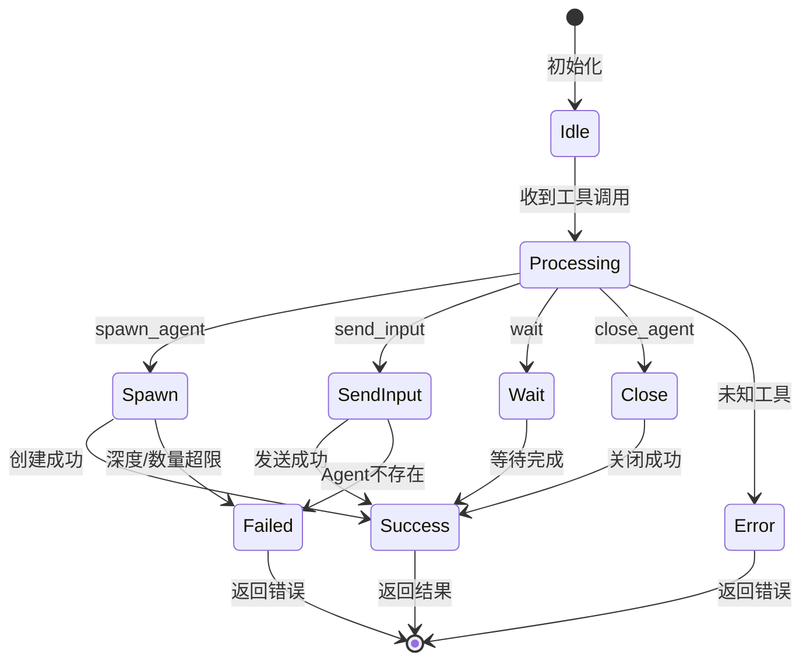
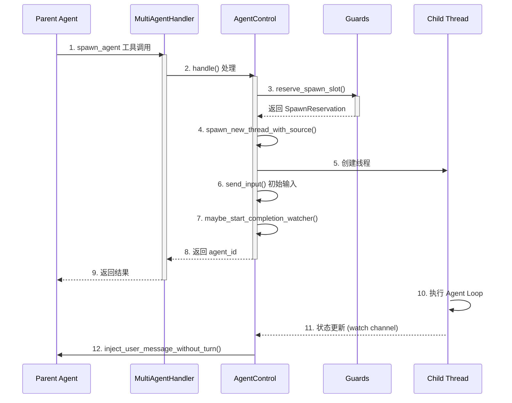
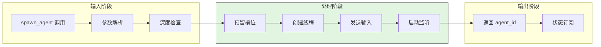
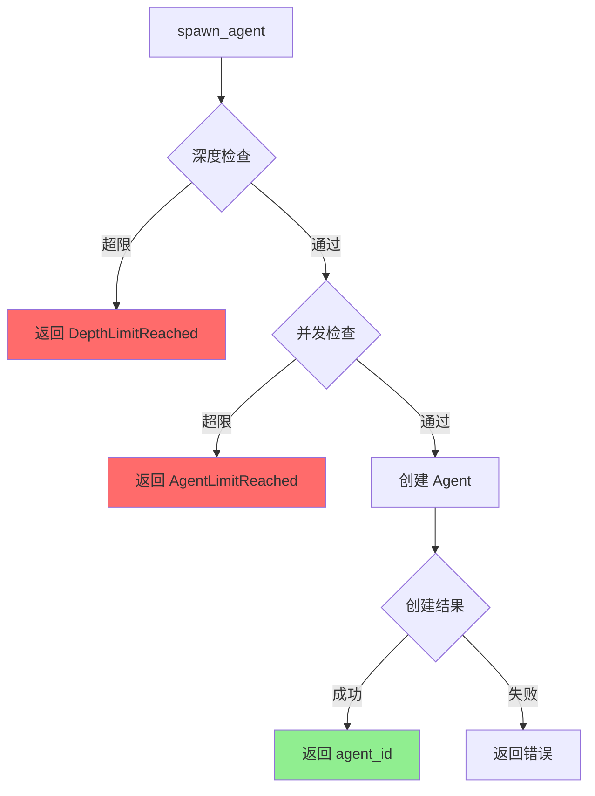
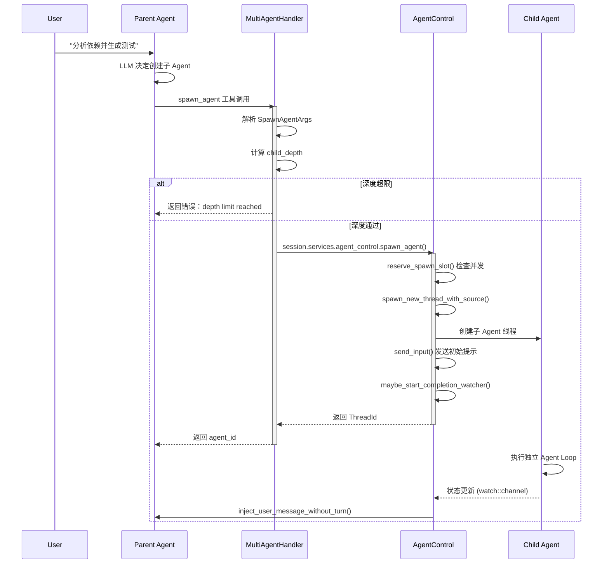
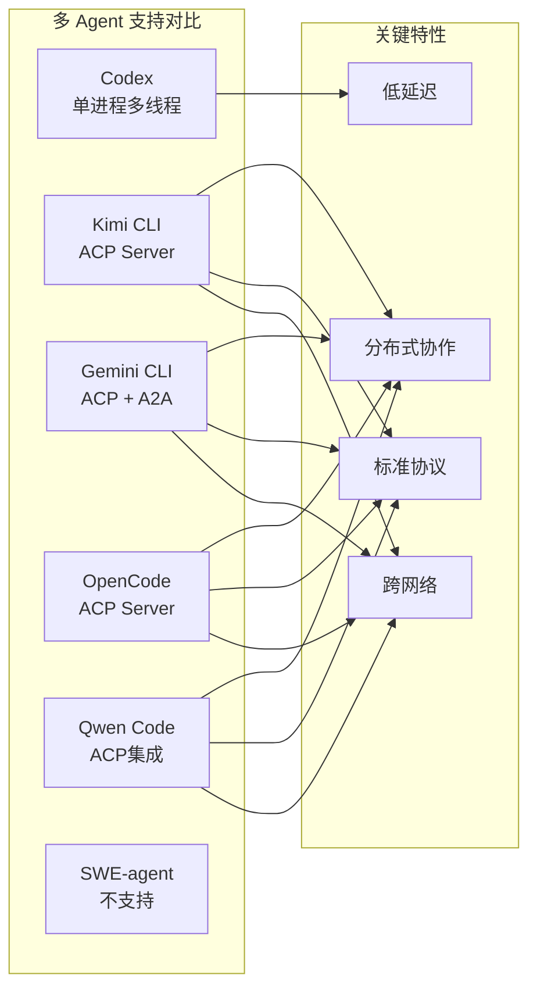

# Codex ACP 与多 Agent 协作机制

> **阅读指南**
>
> | 属性 | 说明 |
> |-----|------|
> | 预计阅读 | 20-25 分钟 |
> | 前置文档 | `01-codex-overview.md`、`04-codex-agent-loop.md` |
> | 文档结构 | TL;DR → 架构 → 组件分析 → 数据流转 → 代码实现 → 对比 |
> | 代码呈现 | 关键代码直接展示，完整代码可折叠查看 |

---

## TL;DR（结论先行）

**一句话定义**：Codex 未实现 ACP (Agent Client Protocol) 协议，但提供了**实验性的进程内多 Agent 协作机制**（Sub-agent/Collab），通过 `multi_agent` feature flag 控制，允许父 Agent 在同一进程中创建、通信和管理子 Agent，而非通过网络协议进行远程通信。

Codex 的核心取舍：**单进程多线程架构优先于分布式 Agent 协议**，通过共享内存和消息队列实现低延迟父子通信（对比：Kimi/OpenCode/Qwen/Gemini 的 ACP 模式）

### 核心要点速览

| 维度 | 关键决策 | 代码位置 |
|-----|---------|---------|
| 功能开关 | `Feature::Collab` 实验性功能 | `core/src/features.rs:573` |
| 进程模型 | 单进程多线程（非分布式） | `core/src/agent/control.rs:55` |
| 通信方式 | 共享内存 + 消息队列 | `core/src/agent/control.rs:172` |
| 生命周期 | `AgentControl` 统一管理 | `core/src/agent/control.rs:37` |
| 资源限制 | `Guards` 限制并发和嵌套深度 | `core/src/agent/guards.rs:21` |

---

## 1. 为什么需要这个机制？（解决什么问题）

### 1.1 问题场景

当用户要求 Codex 完成复杂任务时（如"重构整个代码库"或"并行分析多个文件"），单 Agent 架构面临以下限制：

**没有多 Agent 协作：**
```
所有任务串行执行 → 无法并行处理独立子任务
单个 Agent 上下文过载 → 难以管理复杂项目的多个方面
无法分而治之 → 大任务难以分解给专门的子 Agent
```

**有多 Agent 协作：**
```
父 Agent 创建专门子 Agent → 处理独立任务（分析依赖、生成测试）
子 Agent 并行执行 → 父 Agent 协调结果
每个子 Agent 独立上下文 → 避免父 Agent 上下文膨胀
```

### 1.2 核心挑战

| 挑战 | 不解决的后果 |
|-----|-------------|
| 子 Agent 生命周期管理 | 资源泄漏，僵尸 Agent 持续占用内存和线程 |
| 父子通信机制 | 无法同步状态，子 Agent 结果无法通知父 Agent |
| 并发数量控制 | 无限制的子 Agent 创建导致系统资源耗尽 |
| 嵌套深度限制 | 无限递归创建子 Agent 导致栈溢出或死锁 |

---

## 2. 整体架构（ASCII 图）

### 2.1 在系统中的位置

```text
┌─────────────────────────────────────────────────────────────┐
│ CLI 入口 / TUI 渲染层                                        │
│ codex/codex-rs/tui/src/multi_agents.rs                       │
└───────────────────────┬─────────────────────────────────────┘
                        │ 事件渲染
                        ▼
┌─────────────────────────────────────────────────────────────┐
│ ▓▓▓ 多 Agent 协作机制 (Collab/Sub-agent) ▓▓▓                 │
│ codex/codex-rs/core/src/tools/handlers/multi_agents.rs       │
│ - MultiAgentHandler: 工具处理器                              │
│ - spawn_agent(): 创建子 Agent                                │
│ - send_input(): 发送消息                                     │
│ - wait/close_agent(): 等待/关闭                              │
└───────────────────────┬─────────────────────────────────────┘
                        │ 调用
                        ▼
┌─────────────────────────────────────────────────────────────┐
│ AgentControl (控制平面)                                      │
│ codex/codex-rs/core/src/agent/control.rs                     │
│ - spawn_agent(): 生命周期管理                                │
│ - subscribe_status(): 状态监听                               │
└───────────────────────┬─────────────────────────────────────┘
                        │ 管理
        ┌───────────────┼───────────────┐
        ▼               ▼               ▼
┌──────────────┐ ┌──────────────┐ ┌──────────────┐
│ Guards       │ │ ThreadManager│ │ SessionSource│
│ 资源限制     │ │ 线程管理     │ │ 来源追踪     │
│ 并发+深度    │ │ 创建/销毁    │ │ 父子关系     │
└──────────────┘ └──────────────┘ └──────────────┘
```

### 2.2 核心组件职责

| 组件 | 职责 | 代码位置 |
|-----|------|---------|
| `MultiAgentHandler` | 处理多 Agent 工具调用（spawn_agent, send_input 等） | `core/src/tools/handlers/multi_agents.rs:40` |
| `AgentControl` | 控制平面，管理子 Agent 生命周期和通信 | `core/src/agent/control.rs:37` |
| `Guards` | 限制并发子 Agent 数量和嵌套深度 | `core/src/agent/guards.rs:21` |
| `Feature::Collab` | 功能开关，控制 multi_agent 启用 | `core/src/features.rs:125` |
| `SessionSource` | 追踪 Agent 来源，记录父子关系 | `protocol/src/protocol.rs` |

### 2.3 多 Agent 协作 vs ACP 的区别

```text
┌─────────────────────────────────────────────────────────────────────────────┐
│                        ACP (Agent Client Protocol)                           │
│  ┌──────────────┐                    HTTP/gRPC/WS                    ┌──────────────┐
│  │   Agent A    │ ◄────────────────────────────────────────────────► │   Agent B    │
│  │  (Process 1) │              跨进程/跨网络通信                      │  (Process 2) │
│  └──────────────┘                                                    └──────────────┘
│                                                                              │
│  特点：                                                                       │
│  - Agent 作为独立服务运行                                                       │
│  - 支持远程调用和跨网络协作                                                      │
│  - 标准化协议（如：A2A, MCP 的 Agent 扩展）                                       │
└─────────────────────────────────────────────────────────────────────────────┘

┌─────────────────────────────────────────────────────────────────────────────┐
│                     Codex Multi-Agent (Sub-agent)                            │
│                                                                              │
│  ┌─────────────────────────────────────────────────────────────────────┐    │
│  │                         同一进程 (Process)                           │    │
│  │                                                                      │    │
│  │   ┌──────────────┐      AgentControl       ┌──────────────┐         │    │
│  │   │  Parent Agent│ ───────────────────────► │  Child Agent │         │    │
│  │   │  (Thread A)  │    spawn_agent()        │  (Thread B)  │         │    │
│  │   └──────────────┘                         └──────────────┘         │    │
│  │          │                                        │                 │    │
│  │          │ send_input() / wait() / close_agent()  │                 │    │
│  │          ▼                                        ▼                 │    │
│  │   ┌──────────────────────────────────────────────────────────┐     │    │
│  │   │              ThreadManagerState (共享状态)                 │     │    │
│  │   │   threads: HashMap<ThreadId, Arc<CodexThread>>           │     │    │
│  │   └──────────────────────────────────────────────────────────┘     │    │
│  └─────────────────────────────────────────────────────────────────────┘    │
│                                                                              │
│  特点：                                                                       │
│  - 子 Agent 在同一进程内运行（独立线程）                                          │
│  - 通过共享内存和消息队列通信                                                     │
│  - 非标准化协议，Codex 内部实现                                                   │
└─────────────────────────────────────────────────────────────────────────────┘
```

---

## 3. 核心组件详细分析

### 3.1 MultiAgentHandler 内部结构

#### 职责定位

`MultiAgentHandler` 是多 Agent 工具的中央处理器，负责将 LLM 的工具调用分发到对应的处理函数。

#### 状态机图



**状态说明**：

| 状态 | 说明 | 进入条件 | 退出条件 |
|-----|------|---------|---------|
| Idle | 等待工具调用 | 初始化完成 | 收到工具调用 |
| Processing | 路由分发 | 收到工具调用 | 匹配到处理函数 |
| Spawn | 创建子 Agent | spawn_agent 调用 | 创建完成或失败 |
| Success | 处理成功 | 操作完成 | 返回结果 |
| Failed | 处理失败 | 资源限制或错误 | 返回错误 |

#### 关键接口

| 接口 | 输入 | 输出 | 说明 | 代码位置 |
|-----|------|------|------|---------|
| `handle()` | tool_name, arguments | ToolOutput | 工具路由入口 | `multi_agents.rs:62` |
| `spawn_agent` | agent_type, message | agent_id | 创建子 Agent | `multi_agents.rs:114` |
| `send_input` | agent_id, message | status | 发送输入 | `multi_agents.rs` |
| `wait` | agent_id | result | 等待完成 | `multi_agents.rs` |
| `close_agent` | agent_id | status | 关闭 Agent | `multi_agents.rs` |

#### 关键算法逻辑

**关键代码**（工具路由逻辑）：

```rust
// codex/codex-rs/core/src/tools/handlers/multi_agents.rs:81-91
match tool_name.as_str() {
    "spawn_agent" => spawn::handle(session, turn, call_id, arguments).await,
    "send_input" => send_input::handle(session, turn, call_id, arguments).await,
    "resume_agent" => resume_agent::handle(session, turn, call_id, arguments).await,
    "wait" => wait::handle(session, turn, call_id, arguments).await,
    "close_agent" => close_agent::handle(session, turn, call_id, arguments).await,
    other => Err(FunctionCallError::RespondToModel(format!(
        "unsupported collab tool {other}"
    ))),
}
```

**设计意图**：

1. **简单路由**：基于工具名直接匹配，无复杂路由逻辑
2. **统一错误处理**：未知工具返回模型可理解的错误
3. **模块化设计**：每个工具独立处理函数，便于维护

---

### 3.2 AgentControl 控制平面

#### 职责定位

`AgentControl` 是子 Agent 生命周期的中央管理器，提供 spawn、send_input、interrupt、shutdown 等操作。

#### 内部数据流

```text
┌─────────────────────────────────────────────────────────────┐
│  请求层                                                      │
│  ├── spawn_agent() ──► 参数验证 ──► 深度检查                │
│  ├── send_input() ──► Agent查找 ──► 消息发送                │
│  └── shutdown_agent() ──► 状态检查 ──► 关闭通知             │
└──────────────────────────┬──────────────────────────────────┘
                           ▼
┌─────────────────────────────────────────────────────────────┐
│  管理层                                                      │
│  ├── Guards::reserve_spawn_slot() ──► 并发限制              │
│  ├── ThreadManagerState::spawn_new_thread() ──► 线程创建    │
│  └── watch channel ──► 状态订阅                             │
└──────────────────────────┬──────────────────────────────────┘
                           ▼
┌─────────────────────────────────────────────────────────────┐
│  执行层                                                      │
│  ├── CodexThread ──► 独立 Agent Loop                        │
│  ├── SessionSource ──► 父子关系追踪                         │
│  └── CompletionWatcher ──► 完成通知                         │
└─────────────────────────────────────────────────────────────┘
```

#### 关键接口

| 接口 | 输入 | 输出 | 说明 | 代码位置 |
|-----|------|------|------|---------|
| `spawn_agent()` | Config, UserInput items, SessionSource | ThreadId | 创建子 Agent | `control.rs:55` |
| `send_input()` | ThreadId, UserInput items | String | 发送输入 | `control.rs:172` |
| `interrupt_agent()` | ThreadId | String | 中断任务 | `control.rs:195` |
| `shutdown_agent()` | ThreadId | String | 关闭 Agent | `control.rs:201` |
| `get_status()` | ThreadId | AgentStatus | 获取状态 | `control.rs:210` |
| `subscribe_status()` | ThreadId | watch::Receiver | 订阅状态更新 | `control.rs:239` |

---

### 3.3 Guards 资源限制

#### 职责定位

`Guards` 结构用于限制多 Agent 能力，防止资源耗尽，包括并发数量限制和嵌套深度限制。

#### 关键算法逻辑

**关键代码**（并发限制实现）：

```rust
// codex/codex-rs/core/src/agent/guards.rs:51-67
pub(crate) fn reserve_spawn_slot(
    self: &Arc<Self>,
    max_threads: Option<usize>,
) -> Result<SpawnReservation> {
    if let Some(max_threads) = max_threads {
        if !self.try_increment_spawned(max_threads) {
            return Err(CodexErr::AgentLimitReached { max_threads });
        }
    }
    // 返回预留槽位，Drop 时自动释放
    Ok(SpawnReservation { guards: self.clone() })
}

// codex/codex-rs/core/src/agent/guards.rs:130-146
fn try_increment_spawned(&self, max_threads: usize) -> bool {
    let mut current = self.total_count.load(Ordering::Acquire);
    loop {
        if current >= max_threads {
            return false;
        }
        match self.total_count.compare_exchange_weak(
            current,
            current + 1,
            Ordering::AcqRel,
            Ordering::Acquire,
        ) {
            Ok(_) => return true,
            Err(updated) => current = updated,
        }
    }
}
```

**设计意图**：

1. **原子操作**：使用 `compare_exchange_weak` 实现无锁并发计数
2. **自动释放**：`SpawnReservation` 实现 Drop，确保槽位正确释放
3. **可配置**：通过 `max_threads` 参数灵活配置限制

---

### 3.4 组件间协作时序



**协作要点**：

1. **Parent Agent 与 MultiAgentHandler**: 通过工具调用机制触发，使用标准 ToolHandler 接口
2. **MultiAgentHandler 与 AgentControl**: Handler 调用 control 的方法执行实际操作
3. **AgentControl 与 Guards**: 预留槽位确保资源限制
4. **AgentControl 与 Child Thread**: 通过 ThreadManagerState 创建和管理线程，使用消息队列通信

---

### 3.5 关键数据路径

#### 主路径（spawn_agent 正常流程）



#### 异常路径（资源限制）



---

## 4. 端到端数据流转

### 4.1 正常流程（spawn_agent 详细版）



**数据变换详情**：

| 阶段 | 输入 | 处理 | 输出 | 代码位置 |
|-----|------|------|------|---------|
| 工具调用 | spawn_agent 参数 | 解析参数，检查深度限制 | SpawnAgentArgs | `multi_agents.rs:120` |
| 槽位预留 | max_threads | 原子计数检查 | SpawnReservation | `guards.rs:51` |
| 线程创建 | Config, SessionSource | 创建 CodexThread | ThreadId | `control.rs:86` |
| 输入发送 | UserInput items | 序列化，发送 Op | submission_id | `control.rs:178` |
| 状态监听 | ThreadId | watch channel 订阅 | AgentStatus 流 | `control.rs:275` |

### 4.2 父子关系与深度追踪

**关键代码**（子 Agent 来源追踪）：

```rust
// codex/codex-rs/protocol/src/protocol.rs
pub enum SessionSource {
    Cli,
    VSCode,
    Exec,
    Mcp,
    SubAgent(SubAgentSource),  // <-- 子 Agent 来源
    Unknown,
}

pub enum SubAgentSource {
    Review,
    Compact,
    ThreadSpawn {
        parent_thread_id: ThreadId,
        depth: i32,              // <-- 嵌套深度
        agent_nickname: Option<String>,
        agent_role: Option<String>,
    },
    MemoryConsolidation,
    Other(String),
}
```

深度限制检查：
```rust
// codex/codex-rs/core/src/agent/guards.rs:46-48
pub(crate) fn exceeds_thread_spawn_depth_limit(depth: i32, max_depth: i32) -> bool {
    depth > max_depth
}
```

---

## 5. 关键代码实现

### 5.1 功能开关

**关键代码**（Feature::Collab 定义）：

```rust
// codex/codex-rs/core/src/features.rs:573-582
FeatureSpec {
    id: Feature::Collab,
    key: "multi_agent",
    stage: Stage::Experimental {
        name: "Multi-agents",
        menu_description: "Ask Codex to spawn multiple agents to parallelize the work...",
        announcement: "NEW: Multi-agents can now be spawned by Codex...",
    },
    default_enabled: false,
}
```

启用方式：
```toml
# ~/.codex/config.toml
[features]
multi_agent = true
```

### 5.2 工具注册

**关键代码**（多 Agent 工具注册）：

```rust
// codex/codex-rs/core/src/tools/spec.rs:1600-1606
if config.collab_tools {
    let multi_agent_handler = Arc::new(MultiAgentHandler);
    builder.push_spec(create_spawn_agent_tool(config));
    builder.push_spec(create_send_input_tool());
    builder.push_spec(create_resume_agent_tool());
    builder.push_spec(create_wait_tool());
    builder.push_spec(create_close_agent_tool());
    builder.register_handler("spawn_agent", multi_agent_handler.clone());
    // ... 其他工具注册
}
```

### 5.3 主链路代码

**关键代码**（spawn_agent 处理逻辑）：

```rust
// codex/codex-rs/core/src/tools/handlers/multi_agents.rs:114-145
pub async fn handle(
    session: Arc<Session>,
    turn: Arc<TurnContext>,
    call_id: String,
    arguments: String,
) -> Result<ToolOutput, FunctionCallError> {
    let args: SpawnAgentArgs = parse_arguments(&arguments)?;
    let role_name = args.agent_type.as_deref().map(str::trim).filter(|r| !r.is_empty());
    let input_items = parse_collab_input(args.message, args.items)?;
    let session_source = turn.session_source.clone();
    let child_depth = next_thread_spawn_depth(&session_source);

    // 深度限制检查（前置拦截）
    if exceeds_thread_spawn_depth_limit(child_depth, turn.config.agent_max_depth) {
        return Err(FunctionCallError::RespondToModel(
            "Agent depth limit reached. Solve the task yourself.".to_string(),
        ));
    }

    // 创建子 Agent
    let agent_control = session.services.agent_control.clone();
    let thread_id = agent_control
        .spawn_agent(
            turn.config.clone(),
            input_items,
            SessionSource::SubAgent(SubAgentSource::ThreadSpawn {
                parent_thread_id: turn.thread_id,
                depth: child_depth,
                agent_nickname: None,
                agent_role: role_name.map(String::from),
            }),
        )
        .await?;

    // 返回 agent_id
    Ok(ToolOutput::new(
        call_id,
        format!("Agent spawned with ID: {}", thread_id),
    ))
}
```

**设计意图**：

1. **深度检查前置**：在创建 Agent 前检查嵌套深度，防止无限递归
2. **角色应用**：支持通过 agent_type 为子 Agent 应用特定角色配置
3. **事件通知**：通过 CollabAgentSpawnBegin/EndEvent 通知客户端

### 5.4 关键调用链

```text
spawn_agent 工具调用
  -> MultiAgentHandler::handle()     [multi_agents.rs:62]
    -> spawn::handle()                [multi_agents.rs:114]
      -> session.services.agent_control.spawn_agent()  [control.rs:55]
        -> Guards::reserve_spawn_slot() [guards.rs:51]
        -> ThreadManagerState::spawn_new_thread_with_source()
        -> AgentControl::send_input()   [control.rs:172]
        -> maybe_start_completion_watcher() [control.rs:262]
```

---

## 6. 设计意图与 Trade-off

### 6.1 Codex 的选择

| 维度 | Codex 的选择 | 替代方案 | 取舍分析 |
|-----|-------------|---------|---------|
| 进程模型 | 单进程多线程 | 多进程/分布式 | 低延迟通信，简化部署，但无法跨机器协作 |
| 通信方式 | 共享内存 + 消息队列 | HTTP/gRPC/WS | 无网络开销，但仅限于同一进程内 |
| 协议标准 | 内部实现 | ACP/A2A 标准 | 灵活定制，但无法与其他 Agent 互操作 |
| 部署模式 | 本地 CLI | 服务化/云原生 | 适合个人开发者，不支持多用户协作 |
| 功能状态 | Experimental | 稳定发布 | 快速迭代，但 API 可能变化 |

### 6.2 为什么这样设计？

**核心问题**：如何在本地 CLI 环境中实现多 Agent 协作？

**Codex 的解决方案**：
- **代码依据**：`codex/codex-rs/core/src/agent/control.rs:55`
- **设计意图**：在单进程内通过线程隔离实现"伪分布式"协作，避免网络栈复杂性
- **带来的好处**：
  - 零网络延迟，父子通信微秒级
  - 共享文件系统状态，无需远程同步
  - 简化沙箱实现，统一安全边界
- **付出的代价**：
  - 无法跨进程/跨网络协作
  - 单进程内存限制
  - 不支持标准的 ACP 协议互操作

### 6.3 与其他项目的对比



| 项目 | 多 Agent 支持 | ACP 实现 | 架构特点 | 适用场景 |
|-----|--------------|---------|---------|---------|
| **Codex** | 进程内 Sub-agent | 无 | 单进程多线程，共享内存通信 | 本地开发，低延迟需求 |
| **Kimi CLI** | ACP 会话内协作 | ✅ | 原生 ACP Server 架构 | 企业集成，标准化需求 |
| **Gemini CLI** | SubAgent + A2A | ✅（实验性） | ACP(IDE) + 本地/远程 Agent 双路径 | IDE 集成，灵活部署 |
| **OpenCode** | 内置多 Agent | ✅ | `task` 工具 + ACP Server 并存 | 混合场景 |
| **Qwen Code** | TaskTool + SubAgentTracker | ✅ | ACP 集成层 + IDE Companion | IDE 生态 |
| **SWE-agent** | 不支持 | 无 | 严格单 Agent + Retry 机制 | 简单自动化任务 |

**注**：跨项目中已有多个 ACP 实现；本结论仅指 **Codex 自身** 当前未实现 ACP，采用进程内协作模型。

---

## 7. 边界情况与错误处理

### 7.1 终止条件

| 终止原因 | 触发条件 | 代码位置 |
|---------|---------|---------|
| 任务完成 | 子 Agent 执行完毕，状态为 Completed | `control.rs:280` |
| 手动关闭 | 父 Agent 调用 close_agent 工具 | `multi_agents.rs:close_agent` |
| 深度超限 | 嵌套深度超过 agent_max_depth | `multi_agents.rs:130` |
| 数量超限 | 并发子 Agent 超过 max_threads | `guards.rs:56` |
| 内部错误 | 子 Agent 发生错误 | `control.rs:187` |
| 中断信号 | 用户发送 Interrupt 操作 | `control.rs:195` |

### 7.2 资源限制

**关键代码**（资源限制配置）：

```rust
// codex/codex-rs/core/src/agent/guards.rs:130-146
fn try_increment_spawned(&self, max_threads: usize) -> bool {
    let mut current = self.total_count.load(Ordering::Acquire);
    loop {
        if current >= max_threads {
            return false;
        }
        match self.total_count.compare_exchange_weak(
            current,
            current + 1,
            Ordering::AcqRel,
            Ordering::Acquire,
        ) {
            Ok(_) => return true,
            Err(updated) => current = updated,
        }
    }
}
```

配置项：
```toml
[agents]
max_threads = 10  # 最大并发子 Agent 数
agent_max_depth = 3  # 最大嵌套深度
default = true    # 是否默认启用
```

### 7.3 错误恢复策略

| 错误类型 | 处理策略 | 代码位置 |
|---------|---------|---------|
| AgentLimitReached | 返回错误给 LLM，建议自行处理 | `guards.rs:56` |
| ThreadNotFound | 返回 NotFound 状态 | `control.rs:216` |
| InternalAgentDied | 清理线程，释放槽位 | `control.rs:187-189` |
| DepthLimitReached | 返回提示，要求父 Agent 自行解决 | `multi_agents.rs:131` |

---

## 8. 关键代码索引

| 功能 | 文件 | 行号 | 说明 |
|-----|------|------|------|
| 功能开关定义 | `codex/codex-rs/core/src/features.rs` | 573-582 | Feature::Collab 定义，key="multi_agent" |
| 工具处理器 | `codex/codex-rs/core/src/tools/handlers/multi_agents.rs` | 40-92 | MultiAgentHandler 结构及路由逻辑 |
| spawn_agent 处理 | `codex/codex-rs/core/src/tools/handlers/multi_agents.rs` | 114-200 | 创建子 Agent 的完整流程 |
| AgentControl | `codex/codex-rs/core/src/agent/control.rs` | 37-311 | 子 Agent 生命周期管理 |
| spawn_agent 方法 | `codex/codex-rs/core/src/agent/control.rs` | 55-102 | 创建子 Agent 核心逻辑 |
| Guards 资源限制 | `codex/codex-rs/core/src/agent/guards.rs` | 21-197 | 并发限制和昵称分配 |
| 深度限制检查 | `codex/codex-rs/core/src/agent/guards.rs` | 46-48 | exceeds_thread_spawn_depth_limit |
| 工具注册 | `codex/codex-rs/core/src/tools/spec.rs` | 1600-1606 | collab_tools 条件注册 |
| SessionSource 定义 | `codex/codex-rs/protocol/src/protocol.rs` | - | 子 Agent 来源追踪枚举 |
| TUI 渲染 | `codex/codex-rs/tui/src/multi_agents.rs` | - | 多 Agent 事件渲染 |

---

## 9. 延伸阅读

- 前置知识：`docs/codex/01-codex-overview.md`
- 相关机制：`docs/codex/04-codex-agent-loop.md`（Agent Loop 机制）
- 相关机制：`docs/codex/06-codex-mcp-integration.md`（MCP 工具集成）
- 深度分析：`docs/codex/questions/codex-multi-agent-vs-acp.md`（多 Agent 与 ACP 对比）
- 跨项目对比：`docs/comm/comm-acp-comparison.md`

---

*✅ Verified: 基于 codex/codex-rs/core/src/agent/control.rs:55 等源码分析*
*基于版本：2026-02-27 | 最后更新：2026-03-03*
