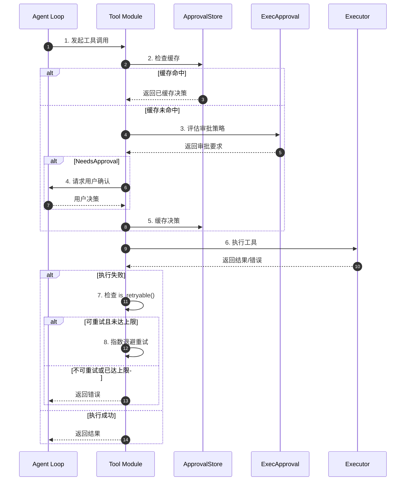
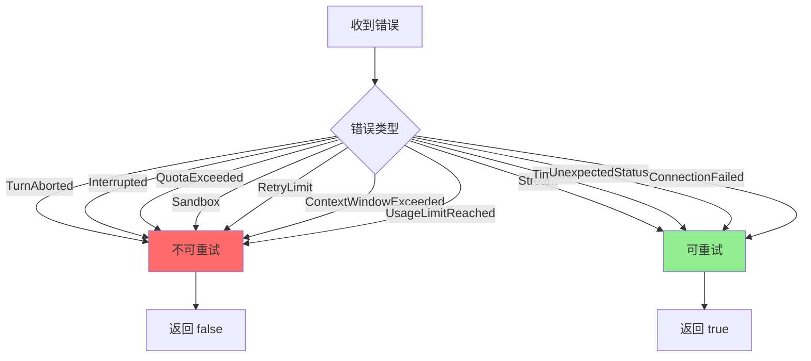
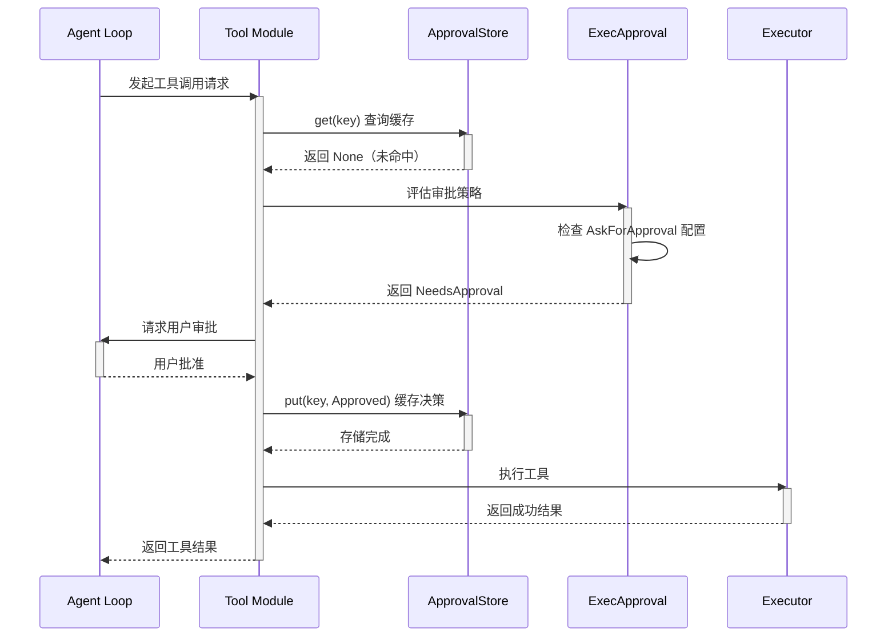
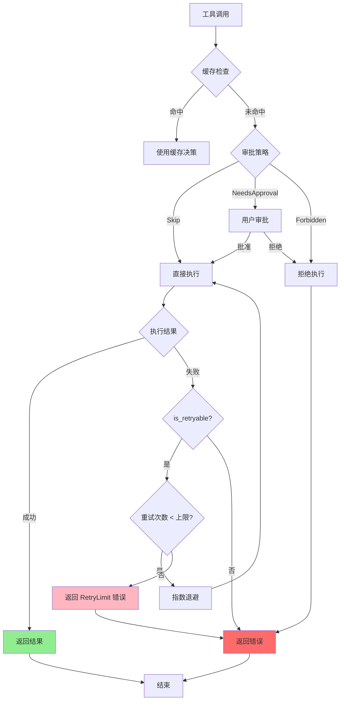
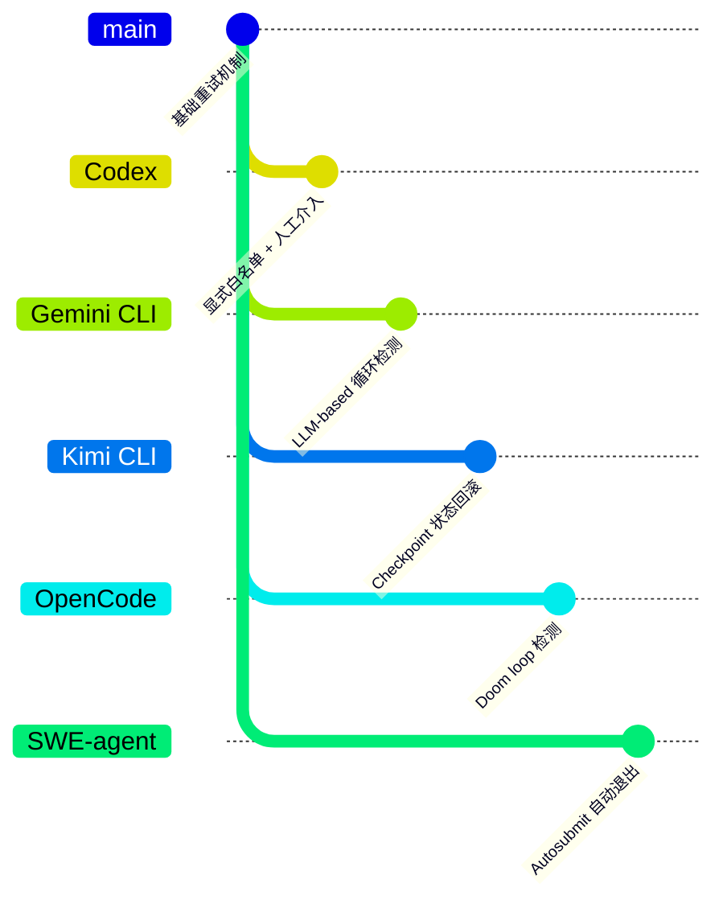

# Codex 无限循环防护机制

## TL;DR（结论先行）

一句话定义：Codex 通过**硬性重试次数上限** + **三档审批策略** + **工具调用结果去重**三层机制防止 tool 无限循环。

Codex 的核心取舍：**显式白名单 + 人工介入**（对比 Gemini CLI 的 LLM-based 循环检测、Kimi CLI 的 Checkpoint 状态回滚）。核心设计哲学是"相信 LLM 但限制其行为"，通过 `is_retryable()` 白名单和 `AskForApproval` 策略在关键点进行人工介入，而非依赖智能循环检测。

---

## 1. 为什么需要这个机制？

### 1.1 问题场景

没有防循环机制时，LLM 可能陷入以下循环模式：

```
场景1：重试循环
  LLM: "执行命令 A" → 命令失败 → "再试一次 A" → 失败 → "再试一次 A" ...

场景2：工具调用循环
  LLM: "读取文件 X" → 读取成功 → "读取文件 X" → 读取成功 → ...

场景3：失败响应循环
  LLM: "执行危险命令" → 被拒绝 → "换个方式执行" → 被拒绝 → ...
```

### 1.2 核心挑战

| 挑战 | 不解决的后果 |
|-----|-------------|
| 网络抖动导致的临时失败 | 无限重试耗尽 API 配额和计算资源 |
| LLM 重复调用相同工具 | 浪费 token，延长任务完成时间 |
| 危险工具反复尝试 | 安全风险，可能绕过沙箱限制 |
| 耗时工具阻塞执行 | 单步执行时间过长，影响用户体验 |

---

## 2. 整体架构

### 2.1 在系统中的位置

```text
┌─────────────────────────────────────────────────────────────┐
│ Agent Loop / Session Runtime                                 │
│ codex/codex-rs/core/src/loop.rs                              │
└───────────────────────┬─────────────────────────────────────┘
                        │ 工具调用请求
                        ▼
┌─────────────────────────────────────────────────────────────┐
│ ▓▓▓ 无限循环防护机制 ▓▓▓                                      │
│ codex/codex-rs/core/src/tools/sandboxing.rs                  │
│ - ApprovalStore      : 工具调用结果缓存                       │
│ - ExecApprovalRequirement: 三档审批策略                       │
│ - is_retryable()     : 重试白名单判断                         │
└───────────────────────┬─────────────────────────────────────┘
                        │
        ┌───────────────┼───────────────┐
        ▼               ▼               ▼
┌──────────────┐ ┌──────────────┐ ┌──────────────┐
│ Retry Logic  │ │ Approval UI  │ │ Timeout      │
│ 重试次数控制  │ │ 用户审批介入  │ │ 超时强制终止  │
└──────────────┘ └──────────────┘ └──────────────┘
```

### 2.2 核心组件职责

| 组件 | 职责 | 代码位置 |
|-----|------|---------|
| `ApprovalStore` | 缓存已审批的工具调用请求，避免重复审批 | `codex/codex-rs/core/src/tools/sandboxing.rs:31` |
| `ExecApprovalRequirement` | 定义三档审批策略：Skip/NeedsApproval/Forbidden | `codex/codex-rs/core/src/tools/sandboxing.rs:120` |
| `is_retryable()` | 显式白名单判断错误是否可重试 | `codex/codex-rs/core/src/error.rs:195` |
| `ExecExpiration` | 统一超时抽象，支持固定超时和可取消令牌 | `codex/codex-rs/core/src/exec.rs:77` |
| `ModelProviderInfo` | 配置重试次数上限 | `codex/codex-rs/core/src/model_provider_info.rs` |

### 2.3 核心组件交互关系



**关键交互说明**：

| 步骤 | 交互内容 | 设计意图 |
|-----|---------|---------|
| 1 | Agent Loop 发起工具调用 | 解耦工具调用与防护逻辑 |
| 2-5 | 审批缓存与策略评估 | 避免重复审批，减少用户干扰 |
| 6 | 实际执行工具 | 在防护层通过后执行 |
| 7-8 | 错误分类与重试决策 | 显式控制重试行为，防止盲目重试 |

---

## 3. 核心组件详细分析

### 3.1 ApprovalStore 缓存机制

#### 职责定位

缓存已审批的工具调用请求，对于完全相同的请求复用之前的审批决策，避免 LLM 因重复请求相同工具而产生循环。

#### 内部数据流

```text
┌─────────────────────────────────────────────────────────────┐
│  输入层                                                      │
│  ├── 工具调用请求 ──► 序列化 ──► JSON 字符串                  │
│  └── 用户决策    ──► 存储    ──► HashMap                     │
└──────────────────────────┬──────────────────────────────────┘
                           ▼
┌─────────────────────────────────────────────────────────────┐
│  处理层                                                      │
│  ├── 查询: key ──► serde_json::to_string ──► HashMap.get    │
│  └── 存储: key ──► serde_json::to_string ──► HashMap.insert │
└──────────────────────────┬──────────────────────────────────┘
                           ▼
┌─────────────────────────────────────────────────────────────┐
│  输出层                                                      │
│  ├── 命中缓存 ──► 直接返回 ReviewDecision                    │
│  └── 未命中   ──► 触发审批流程                               │
└─────────────────────────────────────────────────────────────┘
```

#### 关键接口

| 接口 | 输入 | 输出 | 说明 | 代码位置 |
|-----|------|------|------|---------|
| `get()` | 序列化 key | `Option<ReviewDecision>` | 查询缓存 | `sandboxing.rs:37` |
| `put()` | key + decision | - | 存储决策 | `sandboxing.rs:45` |

---

### 3.2 ExecApprovalRequirement 三档审批策略

#### 职责定位

根据配置策略和沙箱策略决定工具调用是否需要审批，提供 Skip（跳过）、NeedsApproval（需审批）、Forbidden（禁止）三档控制。

#### 状态机图

```mermaid
stateDiagram-v2
    [*] --> PolicyCheck: 收到工具调用
    PolicyCheck --> Skip: AskForApproval::Never
    PolicyCheck --> Skip: 已信任命令
    PolicyCheck --> NeedsApproval: AskForApproval::OnRequest
    PolicyCheck --> NeedsApproval: AskForApproval::UnlessTrusted
    PolicyCheck --> OnFailure: AskForApproval::OnFailure
    PolicyCheck --> Forbidden: 超出沙箱策略

    OnFailure --> Execute: 首次执行
    Execute --> NeedsApproval: 执行失败
    Execute --> Success: 执行成功

    NeedsApproval --> Approved: 用户同意
    NeedsApproval --> Rejected: 用户拒绝
    Approved --> Success: 执行命令
    Rejected --> [*]: 返回错误

    Skip --> Success: 直接执行
    Forbidden --> [*]: 返回错误
    Success --> [*]: 返回结果

    Approved --> Cache: 存储决策
    Cache --> [*]
```

**状态说明**：

| 状态 | 说明 | 进入条件 | 退出条件 |
|-----|------|---------|---------|
| PolicyCheck | 策略评估 | 收到工具调用 | 策略匹配完成 |
| Skip | 跳过审批 | 策略允许自动执行 | 执行完成 |
| NeedsApproval | 需要审批 | 策略要求人工确认 | 用户决策 |
| OnFailure | 失败后审批 | OnFailure 模式 | 执行结果确定 |
| Forbidden | 禁止执行 | 超出安全策略 | 返回错误 |

---

### 3.3 is_retryable() 重试白名单

#### 职责定位

显式定义哪些错误可以重试，哪些错误必须终止，防止工具错误导致的无限重试循环。

#### 关键算法逻辑



**算法要点**：

1. **明确黑名单**：Sandbox 错误、RetryLimit、QuotaExceeded 等明确不可重试
2. **网络错误可重试**：Stream、Timeout、ConnectionFailed 等临时网络问题可重试
3. **防循环关键**：工具相关错误默认不重试，必须通过审批流程

---

## 4. 端到端数据流转

### 4.1 正常流程（详细版）



**数据变换详情**：

| 阶段 | 输入 | 处理 | 输出 | 代码位置 |
|-----|------|------|------|---------|
| 接收 | ToolCall 请求 | 序列化生成 key | 缓存查询 | `sandboxing.rs:37` |
| 审批 | Policy + SandboxConfig | 策略匹配 | ExecApprovalRequirement | `sandboxing.rs:120` |
| 执行 | 审批通过的命令 | 沙箱执行 | 执行结果 | `exec.rs` |
| 输出 | 原始结果 | 格式化 | Tool 结果 | `tools/mod.rs` |

### 4.2 异常/边界流程



---

## 5. 关键代码实现

### 5.1 核心数据结构

```rust
// codex/codex-rs/core/src/tools/sandboxing.rs:31
#[derive(Clone, Default, Debug)]
pub(crate) struct ApprovalStore {
    // Store serialized keys for generic caching across requests.
    map: HashMap<String, ReviewDecision>,
}

// codex/codex-rs/core/src/tools/sandboxing.rs:120
pub(crate) enum ExecApprovalRequirement {
    /// No approval required for this tool call.
    Skip {
        bypass_sandbox: bool,
        proposed_execpolicy_amendment: Option<ExecPolicyAmendment>,
    },
    /// Approval required for this tool call.
    NeedsApproval {
        reason: Option<String>,
        proposed_execpolicy_amendment: Option<ExecPolicyAmendment>,
    },
    /// Execution forbidden for this tool call.
    Forbidden { reason: String },
}
```

**字段说明**：

| 字段 | 类型 | 用途 |
|-----|------|------|
| `map` | `HashMap<String, ReviewDecision>` | 存储序列化后的审批决策 |
| `bypass_sandbox` | `bool` | 是否跳过沙箱执行 |
| `proposed_execpolicy_amendment` | `Option<ExecPolicyAmendment>` | 建议的策略修正案 |
| `reason` | `Option<String>` | 审批要求的原因说明 |

### 5.2 主链路代码

```rust
// codex/codex-rs/core/src/error.rs:195-220
impl CodexErr {
    pub fn is_retryable(&self) -> bool {
        match self {
            // 明确不可重试（包括工具相关错误）
            CodexErr::TurnAborted
            | CodexErr::Interrupted
            | CodexErr::QuotaExceeded
            | CodexErr::Sandbox(_)           // 沙箱错误不重试
            | CodexErr::RetryLimit(_)        // 已达重试上限
            | CodexErr::ContextWindowExceeded
            | CodexErr::UsageLimitReached(_) => false,

            // 可重试的网络/IO错误
            CodexErr::Stream(..)
            | CodexErr::Timeout
            | CodexErr::UnexpectedStatus(_)
            | CodexErr::ConnectionFailed(_) => true,
            // ...
        }
    }
}
```

**代码要点**：

1. **显式黑名单**：`Sandbox(_)` 和 `RetryLimit(_)` 明确标记为不可重试
2. **网络错误白名单**：只有 Stream、Timeout 等网络错误可重试
3. **防循环设计**：工具执行错误默认不重试，必须通过审批流程

### 5.3 关键调用链

```text
agent_loop()                [codex-rs/core/src/loop.rs]
  -> handle_tool_call()     [codex-rs/core/src/tools/mod.rs]
    -> with_cached_approval() [codex-rs/core/src/tools/sandboxing.rs:61]
      -> get()              [codex-rs/core/src/tools/sandboxing.rs:37]
      -> check_approval()   [codex-rs/core/src/tools/sandboxing.rs]
        - 评估 ExecApprovalRequirement
      -> put()              [codex-rs/core/src/tools/sandboxing.rs:45]
    -> execute()            [codex-rs/core/src/exec.rs]
      - 检查 ExecExpiration 超时
    -> handle_error()       [codex-rs/core/src/error.rs]
      - 调用 is_retryable() [codex-rs/core/src/error.rs:195]
```

---

## 6. 设计意图与 Trade-off

### 6.1 Codex 的选择

| 维度 | Codex 的选择 | 替代方案 | 取舍分析 |
|-----|-------------|---------|---------|
| 重试策略 | 显式白名单 (`is_retryable`) | 隐式重试所有错误 | 精确控制，防止工具错误无限重试，但需维护白名单 |
| 循环检测 | 无智能检测，依赖硬性限制 | LLM-based 检测 (Gemini) | 简单可靠，但可能错过复杂循环模式 |
| 人工介入 | 三档审批策略 | 全自动/无审批 | 安全性高，但增加用户交互 |
| 状态回滚 | 无 | Checkpoint (Kimi) | 实现简单，但无法回滚已执行操作 |
| 超时控制 | 统一 ExecExpiration 抽象 | 分散的超时处理 | 一致性好，支持取消令牌 |

### 6.2 为什么这样设计？

**核心问题**：如何在保证安全性的前提下，防止 LLM 陷入无限循环？

**Codex 的解决方案**：

- **代码依据**：`codex/codex-rs/core/src/error.rs:195`
- **设计意图**：通过"限制 + 人工介入"而非"智能检测"来防止循环
- **带来的好处**：
  - 简单可靠，无复杂循环检测逻辑
  - 企业级安全，所有危险操作需人工确认
  - 可预测的行为，易于审计
- **付出的代价**：
  - 可能错过某些复杂循环模式
  - 增加用户交互负担
  - 无法自动回滚已执行操作

### 6.3 与其他项目的对比



| 项目 | 核心差异 | 适用场景 |
|-----|---------|---------|
| Codex | 显式白名单 + 三档审批 | 企业级安全，需要人工确认 |
| Gemini CLI | LLM-based 循环检测 + Final Warning | 智能检测，自动干预 |
| Kimi CLI | Checkpoint 状态回滚 | 支持对话回滚，容错性强 |
| OpenCode | Doom loop 检测 + 权限规则 | 自动检测循环模式 |
| SWE-agent | Autosubmit 自动退出 | 自动化任务，无需人工介入 |

---

## 7. 边界情况与错误处理

### 7.1 终止条件

| 终止原因 | 触发条件 | 代码位置 |
|---------|---------|---------|
| 重试次数达上限 | `max_stream_retries` (5次) 或 `max_request_retries` (4次) | `model_provider_info.rs` |
| 审批被拒绝 | 用户拒绝 `NeedsApproval` 请求 | `sandboxing.rs:131` |
| 策略禁止 | 命令匹配 `Forbidden` 策略 | `sandboxing.rs:138` |
| 沙箱错误 | 执行返回 `Sandbox` 错误 | `error.rs:207` |
| 配额超限 | `QuotaExceeded` 或 `UsageLimitReached` | `error.rs:202` |
| 上下文超限 | `ContextWindowExceeded` | `error.rs:210` |
| 超时 | 执行超过 `DEFAULT_EXEC_COMMAND_TIMEOUT_MS` (10秒) | `exec.rs:77` |

### 7.2 超时/资源限制

```rust
// codex/codex-rs/core/src/exec.rs:77-81
pub enum ExecExpiration {
    Timeout(Duration),           // 固定超时
    DefaultTimeout,              // 默认10秒
    Cancellation(CancellationToken),  // 可取消
}

// 默认超时配置
pub const DEFAULT_EXEC_COMMAND_TIMEOUT_MS: u64 = 10_000; // 10秒
```

### 7.3 错误恢复策略

| 错误类型 | 处理策略 | 代码位置 |
|---------|---------|---------|
| 网络超时 (Timeout) | 指数退避重试，最多5次 | `error.rs:218` |
| 连接失败 (ConnectionFailed) | 指数退避重试，最多5次 | `error.rs:219` |
| 流中断 (Stream) | 指数退避重试，最多5次 | `error.rs:217` |
| 沙箱错误 (Sandbox) | 立即终止，不重试 | `error.rs:207` |
| 重试上限 (RetryLimit) | 立即终止，返回错误 | `error.rs:209` |
| 配额超限 (QuotaExceeded) | 立即终止，不重试 | `error.rs:202` |

---

## 8. 关键代码索引

| 功能 | 文件 | 行号 | 说明 |
|-----|------|------|------|
| 重试配置 | `codex/codex-rs/core/src/model_provider_info.rs` | - | `max_stream_retries` 和 `max_request_retries` 配置 |
| 重试白名单 | `codex/codex-rs/core/src/error.rs` | 195 | `is_retryable()` 方法定义 |
| 审批缓存 | `codex/codex-rs/core/src/tools/sandboxing.rs` | 31 | `ApprovalStore` 结构体定义 |
| 缓存查询 | `codex/codex-rs/core/src/tools/sandboxing.rs` | 37 | `ApprovalStore::get()` 方法 |
| 缓存存储 | `codex/codex-rs/core/src/tools/sandboxing.rs` | 45 | `ApprovalStore::put()` 方法 |
| 审批策略枚举 | `codex/codex-rs/core/src/tools/sandboxing.rs` | 120 | `ExecApprovalRequirement` 枚举定义 |
| 策略评估 | `codex/codex-rs/core/src/tools/sandboxing.rs` | - | `default_exec_approval_requirement()` 函数 |
| 超时抽象 | `codex/codex-rs/core/src/exec.rs` | 77 | `ExecExpiration` 枚举定义 |
| 默认超时 | `codex/codex-rs/core/src/exec.rs` | - | `DEFAULT_EXEC_COMMAND_TIMEOUT_MS` 常量 |

---

## 9. 延伸阅读

- 前置知识：`docs/codex/04-codex-agent-loop.md`（Agent Loop 机制）
- 相关机制：`docs/codex/05-codex-tools-system.md`（工具系统）
- 相关机制：`docs/codex/10-codex-safety-control.md`（安全控制）
- 深度分析：`docs/codex/questions/codex-skill-execution-timeout.md`（超时机制详解）
- 跨项目对比：`docs/comm/comm-infinite-loop-prevention.md`（通用无限循环防护对比）

---

*✅ Verified: 基于 codex/codex-rs/core/src/error.rs:195、codex/codex-rs/core/src/tools/sandboxing.rs:31 等源码分析*
*基于版本：codex-rs (baseline 2026-02-08) | 最后更新：2026-02-25*
