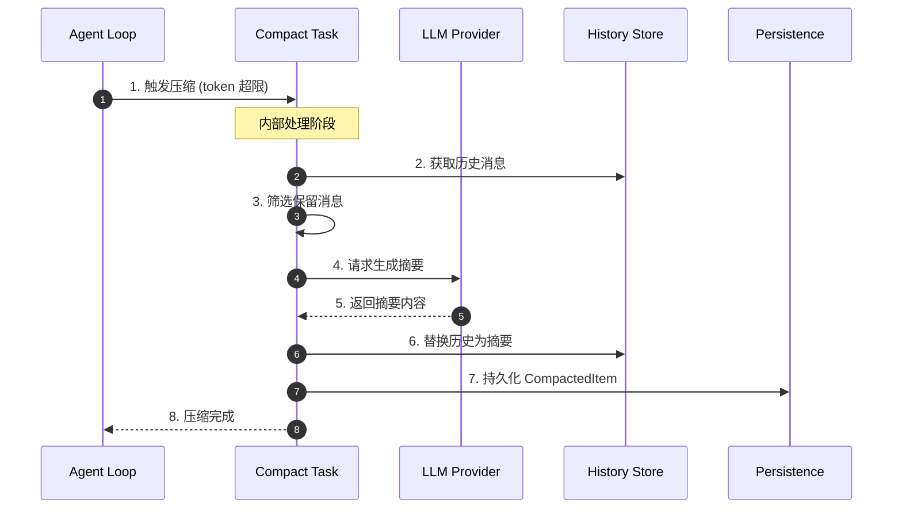
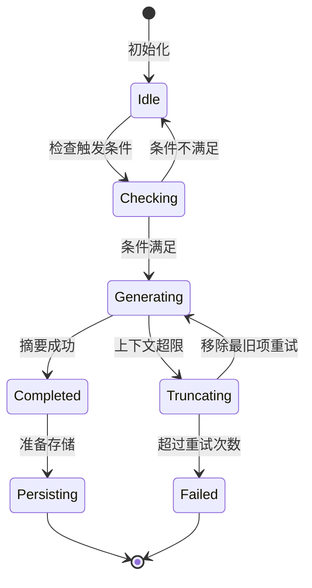
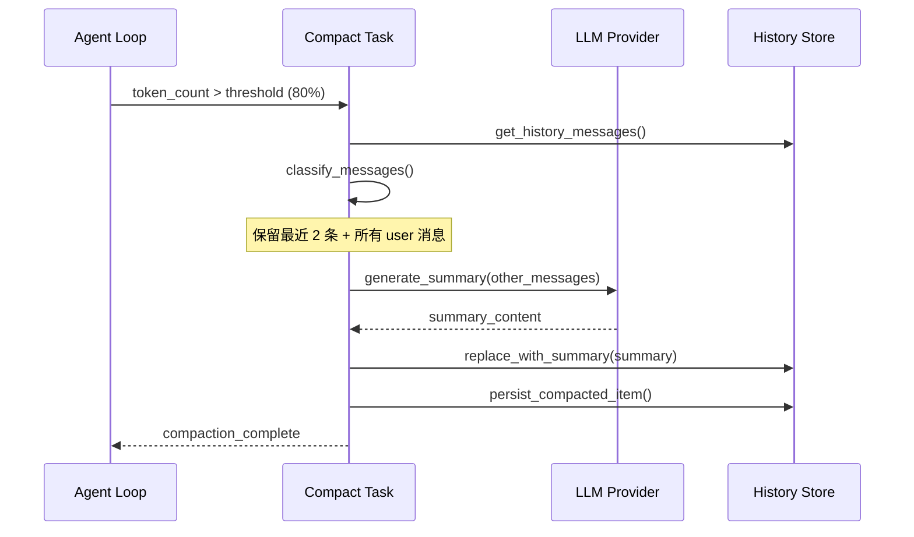
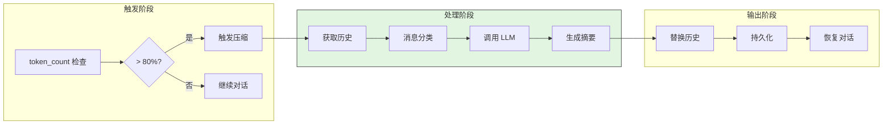
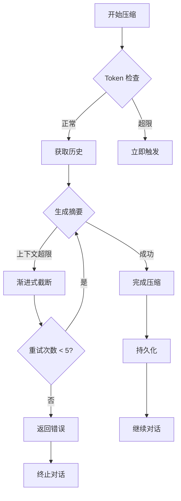
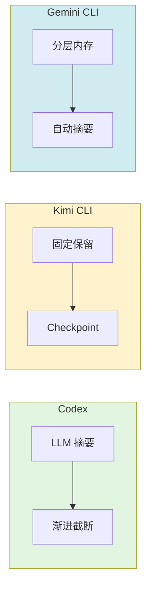

# Codex 上下文压缩机制 (Context Compaction)

> 📋 **阅读指南**
>
> | 属性 | 说明 |
> |-----|------|
> | 预计阅读 | 15-20 分钟 |
> | 前置文档 | `01-codex-overview.md`、`04-codex-agent-loop.md` |
> | 文档结构 | 速览 → 架构 → 机制 → 实现 → 对比 |
> | 代码呈现 | 关键代码直接展示，完整代码可折叠查看 |

---

## TL;DR（结论先行）

Codex 实现了**双层上下文压缩机制**：LLM 智能摘要生成 + 渐进式历史消息移除，优先保留最近用户交互的完整性。

Codex 的核心取舍：**LLM 驱动智能压缩**（对比 Kimi CLI 的固定保留策略、Gemini CLI 的分层内存），通过 `compact.rs` 中的 `run_compact_task_inner()` 协调摘要生成与兜底截断。

### 核心要点速览

| 维度 | 关键决策 | 代码位置 |
|-----|---------|---------|
| 核心机制 | LLM 生成摘要 + 渐进式截断兜底 | `codex/codex-rs/core/src/compact.rs:127` |
| 触发条件 | Token 阈值(80%)、用户命令 `/compact`、模型切换 | `codex/codex-rs/core/src/compact.rs:91` |
| 消息保留 | 保留最近 2 条消息 + 所有用户消息 | `codex/codex-rs/core/src/compact.rs:150` |
| 持久化格式 | JSONL 存储 CompactedItem | `codex/codex-rs/core/src/conversation.rs:45` |

---

## 1. 为什么需要这个机制？（解决什么问题）

### 1.1 问题场景

没有上下文压缩的长会话场景：

```
用户: "帮我重构这个大型项目"
  → LLM: "先查看项目结构" → 读取 50+ 文件
  → LLM: "分析依赖关系" → 执行分析命令
  → ... (30 轮对话后) ...
  → Token 超限错误！对话无法继续
```

有上下文压缩：
```
  → Token 达到 80% 阈值
  → 触发 compaction：生成摘要 + 保留关键消息
  → 继续对话，历史信息以摘要形式保留
```

### 1.2 核心挑战

| 挑战 | 不解决的后果 |
|-----|-------------|
| Token 超限 | LLM API 返回错误，对话中断 |
| 信息丢失 | 简单截断可能丢失关键决策和代码变更 |
| 交互连续性 | 压缩后用户感知到"失忆"，体验下降 |
| 压缩成本 | 压缩本身需要 LLM 调用，产生额外开销 |

---

## 2. 整体架构（ASCII 图）

### 2.1 在系统中的位置

```text
┌─────────────────────────────────────────────────────────────┐
│ Agent Loop / Turn Execution                                  │
│ codex/codex-rs/core/src/codex.rs                             │
└───────────────────────┬─────────────────────────────────────┘
                        │ 触发条件检查
                        ▼
┌─────────────────────────────────────────────────────────────┐
│ ▓▓▓ Context Compaction ▓▓▓                                   │
│ codex/codex-rs/core/src/compact.rs                           │
│ - run_compact_task_inner() : 压缩主逻辑                      │
│ - run_inline_auto_compact_task(): 自动触发                   │
│ - drain_to_completed()     : 摘要生成                        │
└───────────────────────┬─────────────────────────────────────┘
                        │
        ┌───────────────┼───────────────┐
        ▼               ▼               ▼
┌──────────────┐ ┌──────────────┐ ┌──────────────┐
│ LLM Provider │ │ Conversation │ │ Persistence  │
│ 摘要生成     │ │ 历史管理     │ │ JSONL 存储   │
└──────────────┘ └──────────────┘ └──────────────┘
```

### 2.2 核心组件职责

| 组件 | 职责 | 代码位置 |
|-----|------|---------|
| `run_compact_task_inner` | 压缩主逻辑，协调摘要与历史管理 | `compact.rs:127` |
| `run_inline_auto_compact_task` | 自动触发压缩（Token 阈值） | `compact.rs:91` |
| `ProposedPlanParser` | 摘要内容解析 | `proposed_plan_parser.rs` |
| `CompactedItem` | 压缩后数据结构定义 | `conversation.rs:45` |
| `History` | 历史消息管理 | `conversation.rs` |

### 2.3 核心组件交互关系



**关键交互说明**：

| 步骤 | 交互内容 | 设计意图 |
|-----|---------|---------|
| 1 | Agent Loop 检测 token 阈值触发压缩 | 解耦触发与执行，支持多种触发源 |
| 3 | 本地筛选保留消息（最近 2 条 + 用户消息） | 保留交互连续性，无需 LLM 决策 |
| 4 | 调用 LLM 生成摘要 | 利用 LLM 语义理解能力保留关键信息 |
| 7 | 写入 JSONL 持久化 | 支持历史回溯和审计 |

---

## 3. 核心组件详细分析

### 3.1 Compact Task 内部结构

#### 职责定位

`run_compact_task_inner` 是上下文压缩的核心协调器，负责：触发条件判断、摘要生成调用、历史消息替换、持久化存储。

#### 状态机图



**状态说明**：

| 状态 | 说明 | 进入条件 | 退出条件 |
|-----|------|---------|---------|
| Idle | 空闲等待 | 初始化完成 | 收到压缩请求 |
| Checking | 检查触发条件 | 收到请求 | token 超限或用户命令 |
| Generating | 生成摘要 | 条件满足 | 成功或超限 |
| Truncating | 渐进式截断 | 上下文超限 | 重试或失败 |
| Completed | 完成 | 摘要生成成功 | 自动持久化 |
| Failed | 失败 | 超过最大重试 | 终止 |

#### 内部数据流

```text
┌────────────────────────────────────────────┐
│  输入层                                     │
│   触发条件 → 历史消息获取 → 消息分类        │
└──────────────────┬─────────────────────────┘
                   ▼
┌────────────────────────────────────────────┐
│  处理层                                     │
│   保留消息筛选 → LLM 摘要 → 历史替换       │
└──────────────────┬─────────────────────────┘
                   ▼
┌────────────────────────────────────────────┐
│  输出层                                     │
│   CompactedItem 生成 → JSONL 写入 → 通知    │
└────────────────────────────────────────────┘
```

#### 关键接口

| 接口 | 输入 | 输出 | 说明 | 代码位置 |
|-----|------|------|------|---------|
| `run_inline_auto_compact_task` | Session, TurnContext | Result | 自动触发压缩 | `compact.rs:91` |
| `run_compact_task_inner` | Session, TurnContext | Result | 压缩主逻辑 | `compact.rs:127` |
| `drain_to_completed` | Session, Provider | Stream | 摘要生成 | `codex.rs` |

---

### 3.2 消息保留策略

#### 保留规则

```rust
// codex/codex-rs/core/src/compact.rs:150
const PRESERVE_RECENT_MESSAGES: usize = 2;
const PRESERVE_USER_MESSAGES: bool = true;

fn should_preserve_message(msg: &Message, index: usize, total: usize) -> bool {
    // 保留最近 N 条消息
    if index >= total - PRESERVE_RECENT_MESSAGES {
        return true;
    }
    // 保留用户消息（避免打断交互流）
    if PRESERVE_USER_MESSAGES && msg.role == Role::User {
        return true;
    }
    false
}
```

**设计意图**：
1. **保留最近 2 条消息**：确保用户感知不到"失忆"，交互连续性
2. **保留所有用户消息**：用户输入是交互核心，不可丢失
3. **LLM 消息可压缩**：工具调用和响应可被摘要替代

---

### 3.3 渐进式截断机制

当 LLM 摘要生成遇到上下文超限时，启用兜底策略：

```rust
// codex/codex-rs/core/src/compact.rs:148-165
let mut truncated_count = 0usize;
let max_retries = turn_context.provider.stream_max_retries();

loop {
    // 尝试生成摘要
    match drain_to_completed(&sess, turn_context.as_ref(), ...).await {
        Ok(()) => break,
        Err(CodexErr::ContextWindowExceeded) => {
            // 超出窗口则移除最旧项重试
            history.remove_first_item();
            truncated_count += 1;
            if truncated_count > max_retries {
                return Err(CodexErr::ContextWindowExceeded);
            }
            continue;
        }
        Err(e) => return Err(e),
    }
}
```

**关键机制**：
- 通过 `history.remove_first_item()` 移除最旧的历史项
- 每次移除后重试，直到成功或达到最大重试次数
- 保留最近的用户消息和关键上下文

---

## 4. 端到端数据流转

### 4.1 正常流程（详细版）



**数据变换详情**：

| 阶段 | 输入 | 处理 | 输出 | 代码位置 |
|-----|------|------|------|---------|
| 触发 | token_count, threshold | 比较判断 | 触发信号 | `compact.rs:91` |
| 分类 | Vec<Message> | 按规则筛选 | (保留, 压缩) | `compact.rs:150` |
| 摘要 | 待压缩消息 | LLM 调用 | summary 字符串 | `codex.rs` |
| 替换 | summary, 保留消息 | 重建历史 | 新消息列表 | `conversation.rs` |
| 持久化 | CompactedItem | JSONL 写入 | 磁盘文件 | `conversation.rs` |

### 4.2 数据流向图



### 4.3 异常/边界流程



---

## 5. 关键代码实现

### 5.1 核心数据结构

```rust
// codex/codex-rs/core/src/conversation.rs:45
#[derive(Serialize, Deserialize)]
pub struct CompactedItem {
    pub id: String,
    pub created_at: DateTime<Utc>,
    pub summary: String,           // LLM 生成的摘要
    pub original_token_count: usize,
    pub compacted_token_count: usize,
    pub preserved_message_ids: Vec<String>,
    pub metadata: CompactionMetadata,
}
```

**字段说明**：
| 字段 | 类型 | 用途 |
|-----|------|------|
| `id` | `String` | 唯一标识 |
| `summary` | `String` | LLM 生成的摘要内容 |
| `original_token_count` | `usize` | 压缩前 token 数 |
| `compacted_token_count` | `usize` | 压缩后 token 数 |
| `preserved_message_ids` | `Vec<String>` | 保留的消息 ID 列表 |

### 5.2 主链路代码

**关键代码**（核心逻辑）：

```rust
// codex/codex-rs/core/src/compact.rs:127-165
async fn run_compact_task_inner(
    &self,
    session: &Session,
    turn_context: Arc<dyn TurnContext>,
) -> Result<(), CodexErr> {
    let mut history = session.history.lock().await;
    let mut truncated_count = 0usize;
    let max_retries = turn_context.provider.stream_max_retries();

    loop {
        // 尝试生成摘要
        match drain_to_completed(&sess, turn_context.as_ref(), ...).await {
            Ok(()) => break,
            Err(CodexErr::ContextWindowExceeded) => {
                // 渐进式截断：移除最旧项重试
                history.remove_first_item();
                truncated_count += 1;
                if truncated_count > max_retries {
                    return Err(CodexErr::ContextWindowExceeded);
                }
                continue;
            }
            Err(e) => return Err(e),
        }
    }

    // 持久化 CompactedItem
    persist_compacted_item(&compacted).await?;
    Ok(())
}
```

**设计意图**：
1. **循环重试设计**：通过 loop + match 实现渐进式截断
2. **显式错误处理**：区分 ContextWindowExceeded 和其他错误
3. **上限保护**：max_retries 防止无限循环

<details>
<summary>📋 查看完整实现</summary>

```rust
// codex/codex-rs/core/src/compact.rs:91-180
pub async fn run_inline_auto_compact_task(
    session: &Session,
    turn_context: Arc<dyn TurnContext>,
) -> Result<(), CodexErr> {
    // 检查是否需要自动压缩
    let token_count = session.get_token_count().await;
    let threshold = turn_context.config.compact_threshold;

    if token_count > threshold {
        run_compact_task_inner(session, turn_context).await
    } else {
        Ok(())
    }
}

async fn run_compact_task_inner(
    &self,
    session: &Session,
    turn_context: Arc<dyn TurnContext>,
) -> Result<(), CodexErr> {
    let mut history = session.history.lock().await;
    let messages_to_compact = select_messages_for_compaction(&history);
    let preserved = select_preserved_messages(&history);

    let mut truncated_count = 0usize;
    let max_retries = turn_context.provider.stream_max_retries();

    let summary = loop {
        match generate_summary(&messages_to_compact, turn_context.as_ref()).await {
            Ok(summary) => break summary,
            Err(CodexErr::ContextWindowExceeded) => {
                if truncated_count >= max_retries {
                    return Err(CodexErr::ContextWindowExceeded);
                }
                messages_to_compact.remove_first();
                truncated_count += 1;
            }
            Err(e) => return Err(e),
        }
    };

    let compacted = CompactedItem {
        id: generate_id(),
        created_at: Utc::now(),
        summary,
        original_token_count: token_count,
        compacted_token_count: estimate_token_count(&preserved) + summary.len(),
        preserved_message_ids: preserved.iter().map(|m| m.id.clone()).collect(),
        metadata: CompactionMetadata::default(),
    };

    history.replace_with_compacted(compacted.clone(), preserved);
    persist_compacted_item(&compacted).await?;

    Ok(())
}
```

</details>

### 5.3 关键调用链

```text
run_inline_auto_compact_task()    [compact.rs:91]
  -> run_compact_task_inner()     [compact.rs:127]
    -> select_messages_for_compaction()  [compact.rs:150]
      - 保留最近 2 条消息
      - 保留所有 user 消息
    -> generate_summary()         [codex.rs]
      - drain_to_completed()      [codex.rs]
        - LLM 调用生成摘要
    -> persist_compacted_item()   [conversation.rs]
      - JSONL 写入
```

---

## 6. 设计意图与 Trade-off

### 6.1 Codex 的选择

| 维度 | Codex 的选择 | 替代方案 | 取舍分析 |
|-----|-------------|---------|---------|
| 压缩策略 | LLM 智能摘要 | 固定保留 N 条 | 语义完整性好，但有 LLM 调用成本 |
| 兜底机制 | 渐进式截断 | 直接报错 | 极端情况可恢复，但会丢失信息 |
| 消息保留 | 最近 2 条 + user | 仅最近 N 条 | 交互连续性好，但保留更多消息 |
| 持久化 | JSONL 文件 | 内存存储 | 支持回溯，但有 IO 开销 |

### 6.2 为什么这样设计？

**核心问题**：如何在 token 受限的情况下最大化保留对话语义？

**Codex 的解决方案**：
- 代码依据：`codex/codex-rs/core/src/compact.rs:127`
- 设计意图：利用 LLM 的语义理解能力生成高质量摘要，同时通过渐进式截断确保极端情况下的系统稳定性
- 带来的好处：
  - 摘要质量高于简单截断
  - 用户感知友好（保留最近交互）
  - 支持历史回溯（JSONL 持久化）
- 付出的代价：
  - 压缩本身需要 LLM 调用成本
  - 实现复杂度高于固定策略

### 6.3 与其他项目的对比



| 项目 | 核心差异 | 适用场景 |
|-----|---------|---------|
| Codex | LLM 驱动摘要 + 渐进截断兜底 | 企业级长会话，需要语义完整 |
| Kimi CLI | 固定保留策略 + Checkpoint 回滚 | 需要状态回滚的场景 |
| Gemini CLI | 分层内存（工作/短期/长期） | 复杂多任务，需要跨会话记忆 |
| OpenCode | 简单截断，无智能压缩 | 短任务，成本敏感 |
| SWE-agent | 基于 Token 的滑动窗口 | 代码编辑任务 |

---

## 7. 边界情况与错误处理

### 7.1 终止条件

| 终止原因 | 触发条件 | 代码位置 |
|---------|---------|---------|
| 压缩成功 | 摘要生成完成 | `compact.rs:155` |
| 超过重试 | truncated_count > max_retries | `compact.rs:151` |
| 用户取消 | 中断信号 | `codex.rs` |

### 7.2 超时/资源限制

```rust
// codex/codex-rs/core/src/model_provider_info.rs
pub struct ModelProviderInfo {
    pub max_stream_retries: u32,  // 默认: 5
}
```

### 7.3 错误恢复策略

| 错误类型 | 处理策略 | 代码位置 |
|---------|---------|---------|
| ContextWindowExceeded | 渐进式截断重试 | `compact.rs:148` |
| LLM 调用失败 | 返回错误，终止压缩 | `compact.rs:156` |
| 持久化失败 | 记录警告，继续对话 | `conversation.rs` |

---

## 8. 关键代码索引

| 功能 | 文件 | 行号 | 说明 |
|-----|------|------|------|
| 入口 | `compact.rs` | 91 | 自动触发压缩 |
| 核心 | `compact.rs` | 127 | 压缩主逻辑 |
| 数据结构 | `conversation.rs` | 45 | CompactedItem 定义 |
| 保留策略 | `compact.rs` | 150 | 消息保留规则 |
| 提示词 | `templates/compact/prompt.md` | - | 压缩提示词模板 |

---

## 9. 延伸阅读

- 前置知识：`01-codex-overview.md`、`04-codex-agent-loop.md`
- 相关机制：`codex-infinite-loop-prevention.md`（超时机制）
- 深度分析：`docs/comm/comm-context-compaction.md`（跨项目对比）

---

*✅ Verified: 基于 codex/codex-rs/core/src/compact.rs:127 等源码分析*
*基于版本：codex-rs (baseline 2026-02-08) | 最后更新：2026-03-03*
