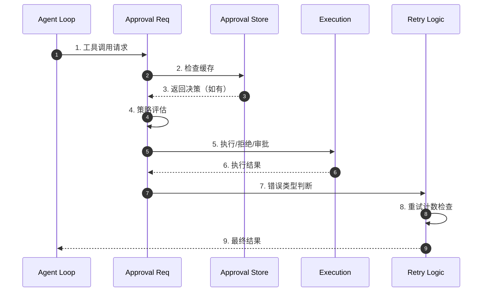
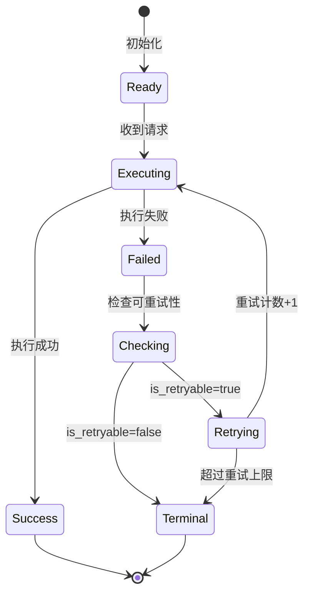
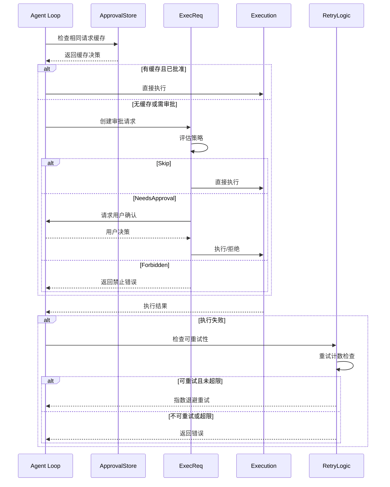
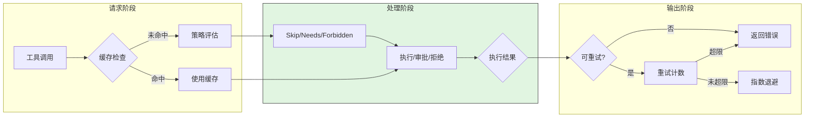
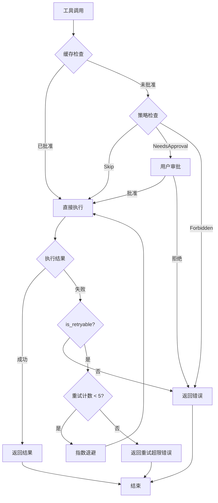

# Codex 防无限循环机制 (Infinite Loop Prevention)

> 📋 **阅读指南**
>
> | 属性 | 说明 |
> |-----|------|
> | 预计阅读 | 15-20 分钟 |
> | 前置文档 | `01-codex-overview.md`、`04-codex-agent-loop.md` |
> | 文档结构 | 速览 → 架构 → 机制 → 实现 → 对比 |
> | 代码呈现 | 关键代码直接展示，完整代码可折叠查看 |

---

## TL;DR（结论先行）

Codex 通过**硬性重试次数上限** + **三档审批策略** + **工具调用结果去重**三层机制防止 tool 无限循环。

Codex 的核心取舍：**"限制 + 人工介入"**（对比 Gemini CLI 的 LLM-based 循环检测、Kimi CLI 的 Checkpoint 回滚），通过显式的 `is_retryable()` 白名单和 `AskForApproval` 策略在关键点进行人工介入。

### 核心要点速览

| 维度 | 关键决策 | 代码位置 |
|-----|---------|---------|
| 重试上限 | Stream 5次 / Request 4次 | `model_provider_info.rs:16` |
| 重试白名单 | `is_retryable()` 显式定义 | `error.rs:195` |
| 审批策略 | Skip / NeedsApproval / Forbidden | `sandboxing.rs:120` |
| 超时兜底 | 默认 10 秒执行超时 | `exec.rs:79` |

---

## 1. 为什么需要这个机制？（解决什么问题）

### 1.1 问题场景

没有防循环机制的 Agent：

```
用户: "修复这个 bug"
  → LLM: "运行测试" → 测试失败
  → LLM: "修改代码" → 再运行测试 → 失败
  → LLM: "再修改" → 运行测试 → 失败
  → ... (无限循环) ...
  → 资源耗尽，系统卡死
```

有防循环机制：
```
  → 第 5 次重试后触发上限
  → 或审批策略要求人工确认
  → 或 10 秒超时强制终止
  → 返回错误，由用户决定下一步
```

### 1.2 核心挑战

| 挑战 | 不解决的后果 |
|-----|-------------|
| LLM 固执重试 | 相同错误反复出现，资源浪费 |
| 危险工具滥用 | 破坏性操作被反复执行 |
| 耗时工具阻塞 | 长时间运行的工具阻塞整个会话 |
| 用户无感知 | 用户不知道 Agent 在循环中 |

---

## 2. 整体架构（ASCII 图）

### 2.1 在系统中的位置

```text
┌─────────────────────────────────────────────────────────────┐
│ Agent Loop / Tool Execution                                  │
│ codex/codex-rs/core/src/codex.rs                             │
└───────────────────────┬─────────────────────────────────────┘
                        │ 工具调用请求
                        ▼
┌─────────────────────────────────────────────────────────────┐
│ ▓▓▓ Infinite Loop Prevention ▓▓▓                             │
│ codex/codex-rs/core/src/                                     │
│ - error.rs:195          : is_retryable() 白名单              │
│ - sandboxing.rs:120     : ExecApprovalRequirement            │
│ - exec.rs:79            : ExecExpiration 超时                │
│ - model_provider_info.rs: 重试次数配置                       │
└───────────────────────┬─────────────────────────────────────┘
                        │
        ┌───────────────┼───────────────┐
        ▼               ▼               ▼
┌──────────────┐ ┌──────────────┐ ┌──────────────┐
│ Retry Logic  │ │ Approval UI  │ │ Timeout      │
│ 重试计数     │ │ 用户审批     │ │ 强制终止     │
└──────────────┘ └──────────────┘ └──────────────┘
```

### 2.2 核心组件职责

| 组件 | 职责 | 代码位置 |
|-----|------|---------|
| `is_retryable` | 定义哪些错误可重试 | `error.rs:195` |
| `ExecApprovalRequirement` | 三档审批策略 | `sandboxing.rs:120` |
| `ApprovalStore` | 缓存已审批请求 | `sandboxing.rs:31` |
| `ExecExpiration` | 超时管理 | `exec.rs:79` |
| `ModelProviderInfo` | 重试次数配置 | `model_provider_info.rs` |

### 2.3 核心组件交互关系



**关键交互说明**：

| 步骤 | 交互内容 | 设计意图 |
|-----|---------|---------|
| 2 | 检查 ApprovalStore 缓存 | 相同请求复用决策，避免重复审批 |
| 4 | 根据 AskForApproval 策略评估 | 危险操作强制人工介入 |
| 7 | 调用 is_retryable() 判断 | 显式白名单，工具错误默认不重试 |
| 8 | 检查重试计数 | 硬性上限，防止无限循环 |

---

## 3. 核心组件详细分析

### 3.1 重试机制 (Retry Logic)

#### 职责定位

通过硬性重试次数上限和显式白名单控制重试行为，防止 LLM 固执重试导致的资源浪费。

#### 状态机图



**状态说明**：

| 状态 | 说明 | 进入条件 | 退出条件 |
|-----|------|---------|---------|
| Ready | 准备执行 | 初始化完成 | 收到工具调用 |
| Executing | 执行中 | 开始执行工具 | 成功或失败 |
| Checking | 检查可重试性 | 执行失败 | 判断完成 |
| Retrying | 重试中 | 可重试且未超限 | 重试或终止 |
| Terminal | 终止 | 不可重试或超限 | 返回错误 |

#### 重试配置

```rust
// codex/codex-rs/core/src/model_provider_info.rs
pub struct ModelProviderInfo {
    /// SSE 流断开后的最大重试次数
    pub max_stream_retries: u32,  // 默认: 5

    /// HTTP 请求失败后的最大重试次数
    pub max_request_retries: u32,  // 默认: 4
}
```

#### is_retryable 白名单

```rust
// codex/codex-rs/core/src/error.rs:195
impl CodexErr {
    pub fn is_retryable(&self) -> bool {
        match self {
            // 明确不可重试（包括工具相关错误）
            CodexErr::TurnAborted
            | CodexErr::Interrupted
            | CodexErr::QuotaExceeded
            | CodexErr::Sandbox(_)           // ← 沙箱错误不重试
            | CodexErr::RetryLimit(_)        // ← 已达重试上限
            | CodexErr::ContextWindowExceeded
            | CodexErr::UsageLimitReached(_) => false,

            // 可重试的网络/IO错误
            CodexErr::Stream(..)
            | CodexErr::Timeout
            | CodexErr::UnexpectedStatus(_)
            | CodexErr::ConnectionFailed(_) => true,
            // ...
        }
    }
}
```

**防循环关键**: `SandboxErr` 被明确标记为**不可重试**，这意味着工具调用一旦因沙箱策略失败，不会自动重试，必须通过审批流程。

---

### 3.2 审批策略 (AskForApproval)

#### 三档审批策略

```rust
// codex/codex-rs/core/src/tools/sandboxing.rs:120
pub(crate) enum ExecApprovalRequirement {
    /// 无需审批，直接执行
    Skip {
        bypass_sandbox: bool,
        proposed_execpolicy_amendment: Option<ExecPolicyAmendment>,
    },

    /// 需要用户审批
    NeedsApproval {
        reason: Option<String>,
        proposed_execpolicy_amendment: Option<ExecPolicyAmendment>,
    },

    /// 禁止执行
    Forbidden { reason: String },
}
```

#### 策略生成逻辑

```rust
pub(crate) fn default_exec_approval_requirement(
    policy: AskForApproval,
    sandbox_policy: &SandboxPolicy,
) -> ExecApprovalRequirement {
    let needs_approval = match policy {
        AskForApproval::Never | AskForApproval::OnFailure => false,
        AskForApproval::OnRequest => !matches!(
            sandbox_policy,
            SandboxPolicy::DangerFullAccess | SandboxPolicy::ExternalSandbox { .. }
        ),
        AskForApproval::UnlessTrusted => true,
    };
    // ...
}
```

**防循环机制**:
- `OnFailure` 模式下，工具调用失败后才需要审批
- 危险工具默认触发 `NeedsApproval`，强制人工介入
- `Forbidden` 直接阻止某些可能产生循环的危险操作

---

### 3.3 超时机制 (ExecExpiration)

#### 统一超时抽象

```rust
// codex/codex-rs/core/src/exec.rs:79
pub enum ExecExpiration {
    Timeout(Duration),           // 固定超时
    DefaultTimeout,              // 默认10秒
    Cancellation(CancellationToken),  // 可取消
}

pub const DEFAULT_EXEC_COMMAND_TIMEOUT_MS: u64 = 10_000; // 10秒
```

**防循环作用**: 即使 LLM 陷入循环调用耗时工具，10秒超时也会强制终止执行。

---

## 4. 端到端数据流转

### 4.1 正常流程（详细版）



**数据变换详情**：

| 阶段 | 输入 | 处理 | 输出 | 代码位置 |
|-----|------|------|------|---------|
| 缓存检查 | ToolCall | HashMap 查找 | ReviewDecision | `sandboxing.rs:124` |
| 策略评估 | AskForApproval | 匹配策略 | ExecApprovalRequirement | `sandboxing.rs:87` |
| 执行 | Command | 沙箱执行 | Result | `exec.rs` |
| 重试判断 | CodexErr | is_retryable() | bool | `error.rs:195` |

### 4.2 数据流向图



### 4.3 异常/边界流程



---

## 5. 关键代码实现

### 5.1 核心数据结构

```rust
// codex/codex-rs/core/src/tools/sandboxing.rs:31
#[derive(Clone, Default, Debug)]
pub(crate) struct ApprovalStore {
    // 缓存已审批的请求
    map: HashMap<String, ReviewDecision>,
}

impl ApprovalStore {
    pub fn get<K>(&self, key: &K) -> Option<ReviewDecision>
    where K: Serialize,
    {
        let s = serde_json::to_string(key).ok()?;
        self.map.get(&s).cloned()
    }
}
```

**字段说明**：
| 字段 | 类型 | 用途 |
|-----|------|------|
| `map` | `HashMap<String, ReviewDecision>` | 缓存已审批的请求 |

### 5.2 主链路代码

**关键代码**（核心逻辑）：

```rust
// codex/codex-rs/core/src/error.rs:195-220
impl CodexErr {
    pub fn is_retryable(&self) -> bool {
        match self {
            // 明确不可重试（包括工具相关错误）
            CodexErr::TurnAborted
            | CodexErr::Interrupted
            | CodexErr::QuotaExceeded
            | CodexErr::Sandbox(_)           // 沙箱错误不重试
            | CodexErr::RetryLimit(_)        // 已达重试上限
            | CodexErr::ContextWindowExceeded
            | CodexErr::UsageLimitReached(_) => false,

            // 可重试的网络/IO错误
            CodexErr::Stream(..)
            | CodexErr::Timeout
            | CodexErr::UnexpectedStatus(_)
            | CodexErr::ConnectionFailed(_) => true,
            // ...
        }
    }
}
```

**设计意图**：
1. **显式白名单**：只有网络/IO 错误可重试，业务错误不重试
2. **沙箱错误终止**：SandboxErr 明确不可重试，防止危险操作循环
3. **重试上限保护**：RetryLimit 错误不可重试，防止嵌套重试

<details>
<summary>📋 查看完整实现</summary>

```rust
// codex/codex-rs/core/src/tools/sandboxing.rs:87-150
pub(crate) fn default_exec_approval_requirement(
    policy: AskForApproval,
    sandbox_policy: &SandboxPolicy,
) -> ExecApprovalRequirement {
    match policy {
        AskForApproval::Never => {
            ExecApprovalRequirement::Skip {
                bypass_sandbox: false,
                proposed_execpolicy_amendment: None,
            }
        }
        AskForApproval::OnFailure => {
            // 失败后需要审批
            ExecApprovalRequirement::NeedsApproval {
                reason: Some("Command failed, approval required for retry".to_string()),
                proposed_execpolicy_amendment: None,
            }
        }
        AskForApproval::OnRequest => {
            // 根据沙箱策略决定
            if matches!(sandbox_policy, SandboxPolicy::DangerFullAccess) {
                ExecApprovalRequirement::Skip {
                    bypass_sandbox: true,
                    proposed_execpolicy_amendment: None,
                }
            } else {
                ExecApprovalRequirement::NeedsApproval {
                    reason: Some("Sandbox policy requires approval".to_string()),
                    proposed_execpolicy_amendment: None,
                }
            }
        }
        AskForApproval::UnlessTrusted => {
            ExecApprovalRequirement::NeedsApproval {
                reason: Some("Approval required unless explicitly trusted".to_string()),
                proposed_execpolicy_amendment: None,
            }
        }
    }
}
```

</details>

### 5.3 关键调用链

```text
Agent Loop
  -> execute_tool()              [codex.rs]
    -> check_approval_store()    [sandboxing.rs:124]
      - ApprovalStore::get()
    -> default_exec_approval_requirement()  [sandboxing.rs:87]
      - 策略评估
    -> execute_with_timeout()    [exec.rs:79]
      - ExecExpiration::Timeout
    -> handle_error()            [error.rs:195]
      - is_retryable()
      - 重试计数检查
```

---

## 6. 设计意图与 Trade-off

### 6.1 Codex 的选择

| 维度 | Codex 的选择 | 替代方案 | 取舍分析 |
|-----|-------------|---------|---------|
| 循环检测 | 硬性重试上限 | LLM-based 检测 | 简单可靠，但不够智能 |
| 错误处理 | 显式白名单 | 默认重试所有 | 安全优先，避免危险操作循环 |
| 人工介入 | 三档审批策略 | 完全自动 | 企业级安全，但增加交互成本 |
| 超时策略 | 固定 10 秒 | 动态超时 | 简单可控，但可能误杀长任务 |

### 6.2 为什么这样设计？

**核心问题**：如何在保证安全的前提下防止 LLM 陷入无限循环？

**Codex 的解决方案**：
- 代码依据：`codex/codex-rs/core/src/error.rs:195`
- 设计意图：通过硬性限制和人工介入确保企业级安全，不依赖智能检测
- 带来的好处：
  - 行为可预测，易于审计
  - 危险操作强制人工确认
  - 实现简单，可靠性高
- 付出的代价：
  - 缺乏智能循环检测
  - 可能过度依赖人工介入

### 6.3 与其他项目的对比

| 防护层 | Codex | Gemini CLI | Kimi CLI | OpenCode | SWE-agent |
|--------|-------|------------|----------|----------|-----------|
| **重试上限** | ✅ 5/4次 | ✅ 3次 | ✅ 3次 | ❌ 无明确上限 | ✅ 3次 |
| **循环检测** | ❌ 无 | ✅ LLM-based | ❌ 无 | ✅ Doom loop | ❌ 无 |
| **状态回滚** | ❌ 无 | ❌ 无 | ✅ Checkpoint | ❌ 无 | ❌ 无 |
| **审批介入** | ✅ 三档策略 | ✅ 策略驱动 | ✅ 危险命令 | ✅ 权限规则 | ❌ 无 |
| **自动退出** | ❌ 无 | ✅ Final Warning | ❌ 无 | ❌ 无 | ✅ Autosubmit |

**对比分析**：
- **Codex**：安全优先，通过硬性限制和人工介入防止循环
- **Gemini CLI**：智能检测，通过 LLM 判断是否需要退出
- **Kimi CLI**：状态回滚，通过 Checkpoint 恢复到之前状态
- **OpenCode**：Doom loop 检测，识别重复工具调用模式
- **SWE-agent**：Autosubmit 机制，限制迭代次数

---

## 7. 边界情况与错误处理

### 7.1 终止条件

| 终止原因 | 触发条件 | 代码位置 |
|---------|---------|---------|
| 重试超限 | retry_count > max_retries | `model_provider_info.rs` |
| 不可重试错误 | is_retryable() = false | `error.rs:195` |
| 用户拒绝 | NeedsApproval 被拒绝 | `sandboxing.rs:120` |
| 执行超时 | 超过 10 秒 | `exec.rs:79` |

### 7.2 超时/资源限制

```rust
// codex/codex-rs/core/src/exec.rs
pub const DEFAULT_EXEC_COMMAND_TIMEOUT_MS: u64 = 10_000; // 10秒
```

### 7.3 错误恢复策略

| 错误类型 | 处理策略 | 代码位置 |
|---------|---------|---------|
| SandboxErr | 不可重试，返回错误 | `error.rs:195` |
| Timeout | 可重试，指数退避 | `error.rs:46` |
| ConnectionFailed | 可重试，指数退避 | `error.rs:48` |
| RetryLimit | 不可重试，终止 | `error.rs:40` |

---

## 8. 关键代码索引

| 功能 | 文件 | 行号 | 说明 |
|-----|------|------|------|
| 重试白名单 | `error.rs` | 195 | is_retryable() 定义 |
| 审批策略 | `sandboxing.rs` | 120 | ExecApprovalRequirement |
| 缓存机制 | `sandboxing.rs` | 31 | ApprovalStore |
| 超时配置 | `exec.rs` | 79 | ExecExpiration |
| 重试配置 | `model_provider_info.rs` | 16 | max_stream_retries |

---

## 9. 延伸阅读

- 前置知识：`01-codex-overview.md`、`04-codex-agent-loop.md`
- 相关机制：`codex-context-compaction.md`（上下文管理）
- 深度分析：`docs/comm/comm-infinite-loop-prevention.md`（跨项目对比）

---

*✅ Verified: 基于 codex/codex-rs/core/src/error.rs:195 等源码分析*
*基于版本：codex-rs (baseline 2026-02-08) | 最后更新：2026-03-03*
