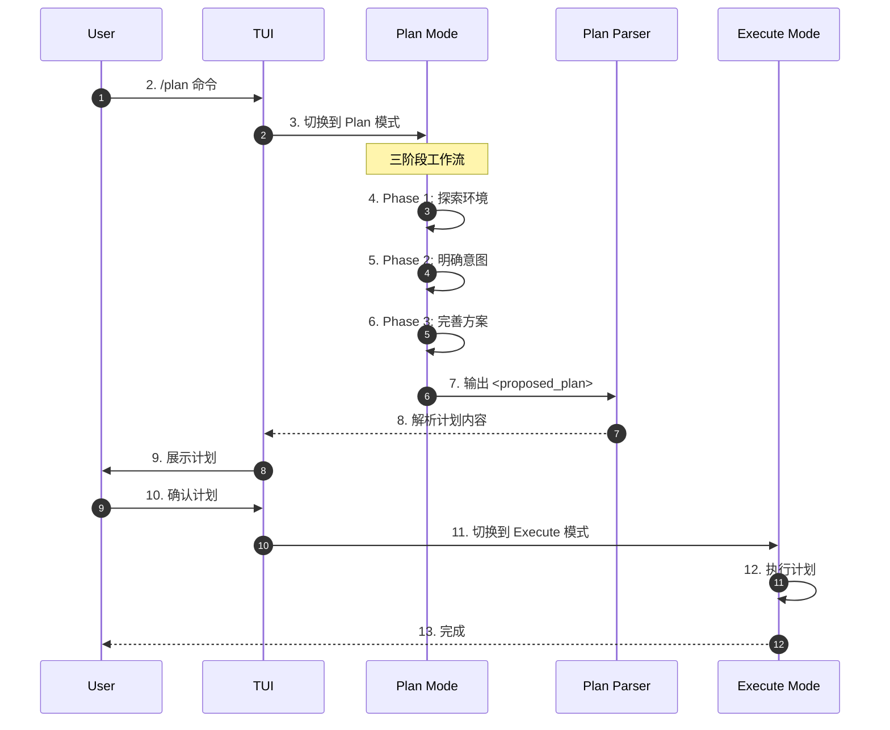
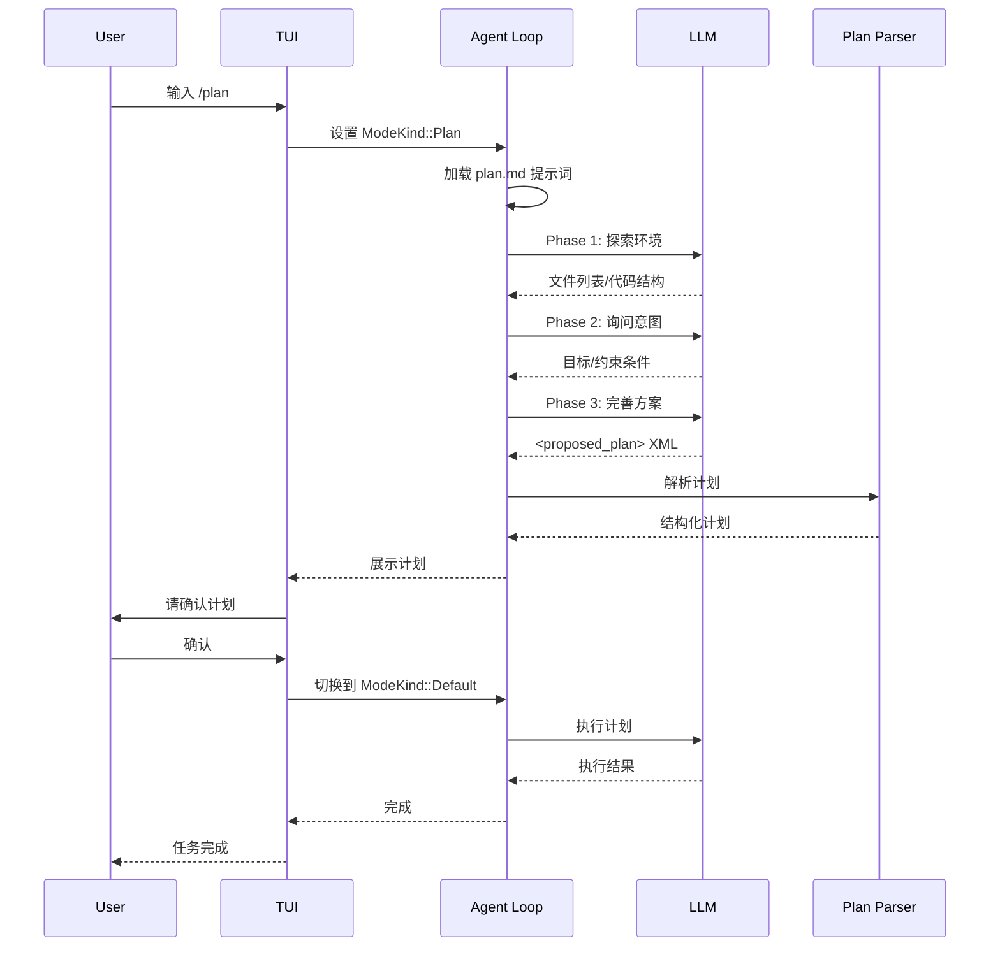
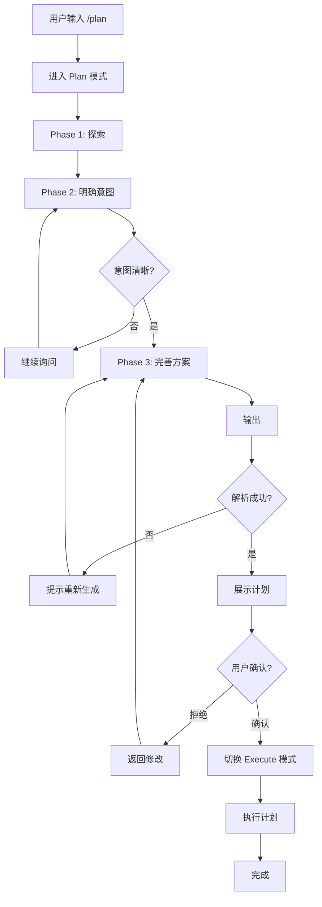

# Codex Plan and Execute 模式

> 📋 **阅读指南**
>
> | 属性 | 说明 |
> |-----|------|
> | 预计阅读 | 20-30 分钟 |
> | 前置文档 | `01-codex-overview.md`、`04-codex-agent-loop.md` |
> | 文档结构 | 速览 → 架构 → 机制 → 实现 → 对比 |
> | 代码呈现 | 关键代码直接展示，完整代码可折叠查看 |

---

## TL;DR（结论先行）

Codex 实现了**生产级的 Plan and Execute 模式**，通过 `ModeKind` 枚举严格区分 Plan 模式和 Default 模式。

Codex 的核心取舍：**"先计划后执行"的严格阶段分离**（对比其他项目的混合模式），Plan 模式下禁止任何文件修改操作，只允许读取和探索，计划通过 `<proposed_plan>` XML 标签块输出，用户确认后切换到 Default 模式执行。

### 核心要点速览

| 维度 | 关键决策 | 代码位置 |
|-----|---------|---------|
| 模式定义 | `ModeKind` 枚举区分 Plan/Default | `protocol/src/config_types.rs:17` |
| 权限隔离 | Plan 模式禁止编辑/副作用操作 | `core/templates/collaboration_mode/plan.md` |
| 计划格式 | `<proposed_plan>` XML 标签块 | `core/src/proposed_plan_parser.rs:86` |
| 用户确认 | 模式切换需用户显式确认 | `tui/src/collaboration_modes.rs` |

---

## 1. 为什么需要这个机制？（解决什么问题）

### 1.1 问题场景

没有 Plan and Execute 的 Agent：

```
用户: "帮我重构这个模块"
  → LLM: 直接开始修改文件 A
  → LLM: 修改文件 B
  → LLM: 发现设计有问题，回滚...
  → 最终代码混乱，用户不满意
```

有 Plan and Execute：
```
  → Plan 模式：探索 → 明确意图 → 输出计划
  → 用户确认计划
  → Execute 模式：按计划执行
  → 结果符合预期
```

### 1.2 核心挑战

| 挑战 | 不解决的后果 |
|-----|-------------|
| 意图误解 | LLM 误解用户需求，执行错误方向 |
| 范围蔓延 | 修改超出预期，影响无关代码 |
| 不可逆操作 | 直接修改后难以回滚 |
| 用户失控 | 用户不知道 Agent 要做什么 |

---

## 2. 整体架构（ASCII 图）

### 2.1 在系统中的位置

```text
┌─────────────────────────────────────────────────────────────┐
│ TUI / CLI 入口                                               │
│ codex/codex-rs/tui/src/                                      │
└───────────────────────┬─────────────────────────────────────┘
                        │ /plan 命令
                        ▼
┌─────────────────────────────────────────────────────────────┐
│ ▓▓▓ Plan and Execute ▓▓▓                                     │
│ codex/codex-rs/core/src/                                     │
│ - config_types.rs:17       : ModeKind 枚举                   │
│ - plan.md                  : 三阶段工作流提示词              │
│ - proposed_plan_parser.rs  : XML 标签解析                    │
│ - collaboration_modes.rs   : 模式切换逻辑                    │
└───────────────────────┬─────────────────────────────────────┘
                        │
        ┌───────────────┼───────────────┐
        ▼               ▼               ▼
┌──────────────┐ ┌──────────────┐ ┌──────────────┐
│ Plan Mode    │ │ User Confirm │ │ Execute Mode │
│ 只读探索     │ │ 用户确认     │ │ 实际执行     │
└──────────────┘ └──────────────┘ └──────────────┘
```

### 2.2 核心组件职责

| 组件 | 职责 | 代码位置 |
|-----|------|---------|
| `ModeKind` | 模式枚举定义 | `protocol/src/config_types.rs:17` |
| `plan.md` | Plan 模式三阶段提示词 | `core/templates/collaboration_mode/plan.md` |
| `ProposedPlanParser` | `<proposed_plan>` 标签解析 | `core/src/proposed_plan_parser.rs` |
| `CollaborationModeMask` | 模式预设配置 | `collaboration_mode_presets.rs:206` |
| `SlashCommand` | `/plan` 斜杠命令 | `tui/src/slash_command.rs:165` |

### 2.3 核心组件交互关系



**关键交互说明**：

| 步骤 | 交互内容 | 设计意图 |
|-----|---------|---------|
| 3 | 切换到 Plan 模式 | 严格分离计划与执行阶段 |
| 4-6 | 三阶段工作流 | 确保计划决策完整 |
| 7 | XML 标签块输出 | 结构化计划内容，便于解析 |
| 10 | 用户确认 | 人工介入确保计划符合预期 |
| 11 | 模式切换 | 切换后允许实际执行操作 |

---

## 3. 核心组件详细分析

### 3.1 ModeKind 枚举

#### 职责定位

定义可用的协作模式，区分 Plan（计划）和 Default（执行）两种核心模式。

#### 状态机图

```mermaid
stateDiagram-v2
    [*] --> Default: 初始状态
    Default --> Plan: /plan 命令
    Plan --> Default: 用户确认计划
    Plan --> Plan: 继续完善计划
    Default --> Default: 继续执行
    Default --> [*]: 任务完成
```

**状态说明**：

| 状态 | 说明 | 进入条件 | 退出条件 |
|-----|------|---------|---------|
| Default | 默认执行模式 | 初始化或计划确认 | /plan 命令 |
| Plan | 计划模式 | /plan 命令 | 用户确认计划 |

#### 枚举定义

```rust
// codex/codex-rs/protocol/src/config_types.rs:17
#[derive(Clone, Copy, Debug, Serialize, Deserialize, PartialEq, Eq, Hash, JsonSchema, TS, Default)]
#[serde(rename_all = "snake_case")]
pub enum ModeKind {
    Plan,
    #[default]
    #[serde(
        alias = "code",
        alias = "pair_programming",
        alias = "execute",
        alias = "custom"
    )]
    Default,
    PairProgramming,
    Execute,
}

pub const TUI_VISIBLE_COLLABORATION_MODES: [ModeKind; 2] = [ModeKind::Default, ModeKind::Plan];
```

**关键设计**:
- `Plan`: 专门用于制定详细计划，禁止执行变更操作
- `Default`: 默认执行模式，允许实际编码和文件修改
- TUI 仅显示 Plan 和 Default 两种模式，其他模式为隐藏模式

---

### 3.2 Plan 模式三阶段工作流

#### 提示词模板

```markdown
## PHASE 1 — Ground in the environment (探索优先)
- 通过探索环境而非询问用户来消除未知
- 执行非变更性探索命令（读取文件、搜索、检查配置）

## PHASE 2 — Intent chat (明确意图)
- 询问目标、成功标准、范围、约束条件
- 使用 request_user_input 工具进行关键决策

## PHASE 3 — Implementation chat (完善方案)
- 确定实现细节：接口、数据流、边界情况、测试标准
- 生成决策完整的计划（decision complete）

## Finalization rule
- 仅当计划决策完整时才输出 <proposed_plan> 块
- 计划必须包含：标题、摘要、API 变更、测试场景、明确假设
```

#### 操作权限隔离

| 操作类型 | Plan 模式 | Default 模式 |
|---------|----------|-------------|
| 读取文件 | 允许 | 允许 |
| 搜索代码 | 允许 | 允许 |
| 静态分析 | 允许 | 允许 |
| 测试构建 | 允许 | 允许 |
| 编辑文件 | **禁止** | 允许 |
| 运行格式化 | **禁止** | 允许 |
| 应用补丁 | **禁止** | 允许 |
| 执行副作用命令 | **禁止** | 允许 |

---

### 3.3 计划解析器 (ProposedPlanParser)

#### 职责定位

解析 LLM 输出的 `<proposed_plan>` XML 标签块，提取结构化计划内容。

#### 数据结构

```rust
// codex/codex-rs/core/src/proposed_plan_parser.rs:86
const OPEN_TAG: &str = "<proposed_plan>";
const CLOSE_TAG: &str = "</proposed_plan>";

pub struct ProposedPlanParser {
    // 流式解析 <proposed_plan> 标签块
}

pub struct ProposedPlanSegment {
    pub items: Vec<ProposedPlanItem>,
}
```

#### 计划内容示例

```xml
<proposed_plan>
# 功能实现计划：用户认证模块

## 摘要
实现基于 JWT 的用户认证系统

## API 变更
- POST /api/auth/login - 用户登录
- POST /api/auth/register - 用户注册
- GET /api/auth/me - 获取当前用户

## 测试场景
1. 正常登录流程
2. 错误密码处理
3. Token 过期处理

## 假设
- 使用现有的 User 数据表
- JWT secret 已配置在环境变量
</proposed_plan>
```

---

## 4. 端到端数据流转

### 4.1 正常流程（详细版）



**数据变换详情**：

| 阶段 | 输入 | 处理 | 输出 | 代码位置 |
|-----|------|------|------|---------|
| 模式切换 | /plan 命令 | 设置 ModeKind | Plan 状态 | `slash_command.rs:165` |
| 探索 | 用户输入 | 读取文件/搜索 | 环境信息 | `plan.md` |
| 计划生成 | 环境信息 | LLM 生成 | XML 字符串 | `codex.rs` |
| 解析 | XML 字符串 | 标签解析 | PlanItem 列表 | `proposed_plan_parser.rs:86` |
| 执行 | PlanItem | 工具调用 | 执行结果 | `codex.rs` |

### 4.2 数据流向图

```mermaid
flowchart LR
    subgraph Input["输入阶段"]
        I1[/plan 命令] --> I2[设置 Plan 模式]
        I2 --> I3[加载提示词]
    end

    subgraph Process["处理阶段"]
        P1[Phase 1: 探索] --> P2[Phase 2: 明确意图]
        P2 --> P3[Phase 3: 完善方案]
        P3 --> P4[生成 XML]
        P4 --> P5[解析计划]
    end

    subgraph Output["输出阶段"]
        O1[用户确认] --> O2[切换 Execute 模式]
        O2 --> O3[执行计划]
        O3 --> O4[返回结果]
    end

    I3 --> P1
    P5 --> O1

    style Process fill:#e1f5e1,stroke:#333
```

### 4.3 异常/边界流程



---

## 5. 关键代码实现

### 5.1 核心数据结构

```rust
// codex/codex-rs/protocol/src/config_types.rs:17
#[derive(Clone, Copy, Debug, Serialize, Deserialize, PartialEq, Eq, Hash, JsonSchema, TS, Default)]
#[serde(rename_all = "snake_case")]
pub enum ModeKind {
    Plan,
    #[default]
    #[serde(
        alias = "code",
        alias = "pair_programming",
        alias = "execute",
        alias = "custom"
    )]
    Default,
    PairProgramming,
    Execute,
}

// codex/codex-rs/core/src/models_manager/collaboration_mode_presets.rs:206
fn plan_preset() -> CollaborationModeMask {
    CollaborationModeMask {
        name: ModeKind::Plan.display_name().to_string(),
        mode: Some(ModeKind::Plan),
        model: None,
        reasoning_effort: Some(Some(ReasoningEffort::Medium)),
        developer_instructions: Some(Some(COLLABORATION_MODE_PLAN.to_string())),
    }
}
```

**字段说明**：
| 字段 | 类型 | 用途 |
|-----|------|------|
| `Plan` | enum variant | 计划模式 |
| `Default` | enum variant | 默认执行模式 |
| `reasoning_effort` | `Option<ReasoningEffort>` | Plan 模式使用 Medium 级别 |
| `developer_instructions` | `Option<String>` | 注入 plan.md 提示词 |

### 5.2 主链路代码

**关键代码**（斜杠命令处理）：

```rust
// codex/codex-rs/tui/src/slash_command.rs:165
pub enum SlashCommand {
    Plan,  // 切换到 Plan 模式
    Collab, // 更改协作模式
    // ...
}

impl SlashCommand {
    pub fn description(self) -> &'static str {
        match self {
            SlashCommand::Plan => "switch to Plan mode",
            // ...
        }
    }
}
```

**设计意图**：
1. **显式命令**：通过 `/plan` 命令显式进入计划模式
2. **用户控制**：模式切换由用户主动触发，非自动切换
3. **状态可见**：TUI 显示当前模式，用户始终知情

<details>
<summary>📋 查看完整实现</summary>

```rust
// codex/codex-rs/tui/src/collaboration_modes.rs
pub(crate) fn plan_mask(models_manager: &ModelsManager) -> Option<CollaborationModeMask> {
    mask_for_kind(models_manager, ModeKind::Plan)
}

pub(crate) fn next_mask(
    models_manager: &ModelsManager,
    current: Option<&CollaborationModeMask>,
) -> Option<CollaborationModeMask> {
    // 在可用模式间循环切换
    let modes = vec![ModeKind::Default, ModeKind::Plan];
    // ...
}

// codex/codex-rs/core/src/tools/handlers/plan.rs
pub static PLAN_TOOL: LazyLock<ToolSpec> = LazyLock::new(|| {
    ToolSpec::Function(ResponsesApiTool {
        name: "update_plan".to_string(),
        description: r#"Updates the task plan.
Provide an optional explanation and a list of plan items, each with a step and status.
At most one step can be in_progress at a time."#,
        // ...
    })
});

// Plan 模式下禁止使用 update_plan 工具
if turn_context.collaboration_mode.mode == ModeKind::Plan {
    return Err(FunctionCallError::RespondToModel(
        "update_plan is a TODO/checklist tool and is not allowed in Plan mode".to_string(),
    ));
}
```

</details>

### 5.3 关键调用链

```text
User Input /plan
  -> SlashCommand::Plan            [slash_command.rs:165]
    -> plan_mask()                 [collaboration_modes.rs]
      -> mask_for_kind(ModeKind::Plan)
    -> set_collaboration_mode()
      -> 加载 plan.md 提示词
Agent Loop
  -> execute_turn()
    -> 根据 ModeKind 执行不同逻辑
      -> Plan: 禁止编辑操作
      -> Default: 允许所有操作
  -> ProposedPlanParser            [proposed_plan_parser.rs:86]
    -> parse_xml_tags()
      -> 提取 <proposed_plan> 内容
```

---

## 6. 设计意图与 Trade-off

### 6.1 Codex 的选择

| 维度 | Codex 的选择 | 替代方案 | 取舍分析 |
|-----|-------------|---------|---------|
| 阶段分离 | 严格 Plan/Execute 分离 | 混合模式 | 计划更清晰，但切换成本 |
| 权限控制 | Plan 禁止所有变更 | 仅警告 | 更安全，但限制探索能力 |
| 计划格式 | XML 标签块 | JSON/YAML | 自然语言友好，但需解析 |
| 用户确认 | 显式模式切换 | 自动切换 | 用户控制强，但增加步骤 |

### 6.2 为什么这样设计？

**核心问题**：如何在保证用户控制的前提下实现"先计划后执行"？

**Codex 的解决方案**：
- 代码依据：`codex/codex-rs/protocol/src/config_types.rs:17`
- 设计意图：通过严格的模式分离和权限控制，确保计划阶段只读，执行阶段按确认的计划进行
- 带来的好处：
  - 计划决策完整，减少返工
  - 用户始终知情并控制
  - 避免不可逆的误操作
- 付出的代价：
  - 增加交互步骤
  - Plan 模式无法做探索性修改

### 6.3 与其他项目的对比

| 项目 | Plan 模式 | Execute 模式 | 特点 |
|-----|-----------|--------------|------|
| **Codex** | 严格只读 | 完全执行 | 阶段分离明确，用户控制强 |
| **Kimi CLI** | 无专门模式 | 混合执行 | 通过 Checkpoint 支持回滚 |
| **Gemini CLI** | 无专门模式 | 递归 continuation | 动态调整，无显式计划阶段 |
| **OpenCode** | 无专门模式 | 直接执行 | 简单直接，无计划概念 |
| **SWE-agent** | 无专门模式 | 自动执行 | 通过 autosubmit 限制迭代 |

**对比分析**：
- **Codex**：唯一实现严格 Plan/Execute 分离的项目，适合需要详细规划和用户确认的场景
- **其他项目**：多采用混合或自动模式，适合快速迭代和探索性任务

---

## 7. 边界情况与错误处理

### 7.1 终止条件

| 终止原因 | 触发条件 | 代码位置 |
|---------|---------|---------|
| 计划完成 | 输出 `<proposed_plan>` | `plan.md` |
| 用户取消 | 拒绝计划或取消命令 | `tui/src/` |
| 模式切换 | 用户确认后切换 | `collaboration_modes.rs` |
| 工具禁止 | Plan 模式下尝试编辑 | `plan.rs` |

### 7.2 工具使用限制

```rust
// codex/codex-rs/core/src/tools/handlers/plan.rs
if turn_context.collaboration_mode.mode == ModeKind::Plan {
    return Err(FunctionCallError::RespondToModel(
        "update_plan is a TODO/checklist tool and is not allowed in Plan mode".to_string(),
    ));
}
```

**重要区别**: Plan 模式 与 `update_plan` 工具是完全独立的机制。Plan 模式用于制定计划，`update_plan` 用于在执行过程中跟踪任务进度。

### 7.3 错误恢复策略

| 错误类型 | 处理策略 | 代码位置 |
|---------|---------|---------|
| XML 解析失败 | 提示重新生成 | `proposed_plan_parser.rs` |
| 计划被拒绝 | 返回 Plan 模式继续完善 | `tui/src/` |
| 工具被禁止 | 返回错误提示 | `plan.rs` |

---

## 8. 关键代码索引

| 功能 | 文件 | 行号 | 说明 |
|-----|------|------|------|
| 模式定义 | `protocol/src/config_types.rs` | 17 | ModeKind 枚举 |
| 提示词 | `core/templates/collaboration_mode/plan.md` | - | 三阶段工作流 |
| 计划解析 | `core/src/proposed_plan_parser.rs` | 86 | XML 标签解析 |
| 斜杠命令 | `tui/src/slash_command.rs` | 165 | /plan 命令 |
| 模式切换 | `tui/src/collaboration_modes.rs` | - | 模式切换逻辑 |
| 预设配置 | `collaboration_mode_presets.rs` | 206 | Plan 模式预设 |

---

## 9. 延伸阅读

- 前置知识：`01-codex-overview.md`、`04-codex-agent-loop.md`
- 相关机制：`codex-context-compaction.md`（上下文管理）
- 深度分析：`docs/comm/comm-plan-and-execute.md`（跨项目对比）

---

*✅ Verified: 基于 codex/codex-rs/protocol/src/config_types.rs:17 等源码分析*
*基于版本：codex-rs (baseline 2026-02-08) | 最后更新：2026-03-03*
