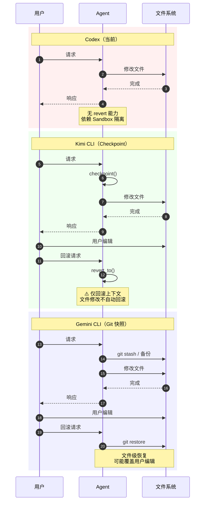
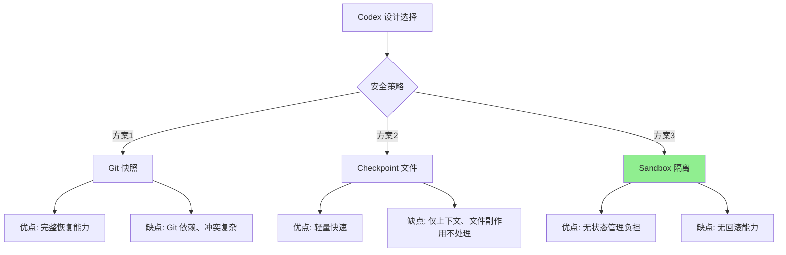
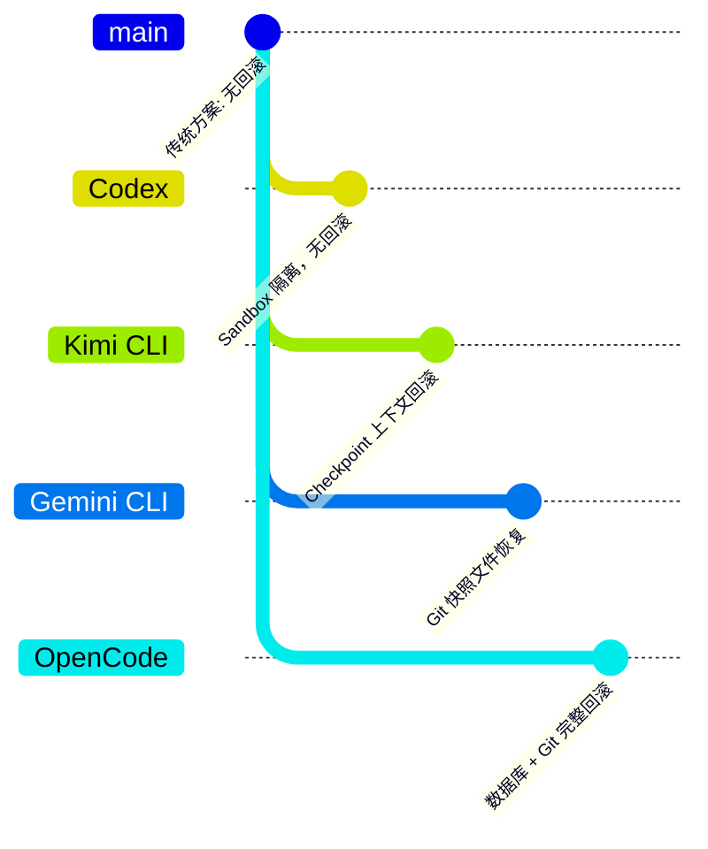

# Codex：Revert 回滚与用户编辑冲突处理

> 📋 **阅读指南**
>
> | 属性 | 说明 |
> |-----|------|
> | 预计阅读 | 15-20 分钟 |
> | 前置文档 | `07-codex-memory-context.md` |
> | 文档结构 | 现状分析 → 架构对比 → 设计取舍 |
> | 代码呈现 | 关键代码直接展示 |

---

## TL;DR（结论先行）

一句话定义：Codex 当前**仅支持对话历史级别的回滚**（`drop_last_n_user_turns`），**不提供文件级 revert/rollback 机制**，因此不存在"revert 时发现用户已编辑与源文件冲突"的处理场景。

Codex 的核心取舍：**依赖 Sandbox 隔离保证安全，不实现文件级状态回滚**（对比 Kimi CLI 的 Checkpoint 回滚、Gemini CLI 的 Git 快照恢复）

### 核心要点速览

| 维度 | 关键决策 | 代码位置 |
|-----|---------|---------|
| 回滚能力 | 仅支持对话历史裁剪（turn 级别） | `codex-rs/core/src/rollout.rs` ⚠️ |
| 文件恢复 | ❌ 不支持文件级 revert | - |
| 冲突检测 | ❌ 无文件冲突检测机制 | - |
| 安全策略 | Sandbox 隔离 + 用户确认 | `codex-rs/core/src/sandbox/` ✅ |

---

## 1. 为什么需要这个机制？（解决什么问题）

### 1.1 问题场景

想象一个需要文件级回滚的 Agent 工作流：

```
用户: "重构这个模块"
  → Agent: "先备份文件" → 创建 checkpoint
  → Agent: "修改第 42 行" → 写文件
  → Agent: "修改第 100 行" → 写文件
  → (用户 meanwhile 编辑了第 50 行)
  → Agent: "测试失败，需要回滚"
  → 问题：回滚时会覆盖用户的编辑！
```

**冲突检测的必要性**：
- 如果没有冲突检测，Agent 的回滚可能意外覆盖用户手动修改
- 需要明确策略：优先保留用户编辑？还是强制回滚？

### 1.2 核心挑战

| 挑战 | 不解决的后果 |
|-----|-------------|
| 文件状态追踪 | 无法知道文件在 Agent 修改后是否被用户编辑 |
| 三向合并 | Agent 原版本、Agent 修改版、用户编辑版需要合并 |
| 用户意图识别 | 无法判断用户编辑是有意还是无意 |
| 回滚粒度控制 | 全量回滚 vs 部分回滚的取舍 |

---

## 2. 整体架构（ASCII 图）

### 2.1 Codex 当前架构（无文件级回滚）

```text
┌─────────────────────────────────────────────────────────────┐
│ Agent Loop                                                   │
│ codex-rs/core/src/loop.rs                                    │
└───────────────────────┬─────────────────────────────────────┘
                        │
        ┌───────────────┼───────────────┐
        ▼               ▼               ▼
┌──────────────┐ ┌──────────────┐ ┌──────────────┐
│ ContextManager│ │ Rollout      │ │ Sandbox      │
│ 对话历史管理  │ │ 持久化存储   │ │ 执行隔离     │
└──────┬───────┘ └──────┬───────┘ └──────┬───────┘
       │                │                │
       ▼                ▼                ▼
┌─────────────────────────────────────────────────────────────┐
│ ▓▓▓ Memory Context ▓▓▓                                      │
│ codex-rs/core/src/context_manager/                           │
│ - 仅管理对话历史（items）                                     │
│ - 不追踪文件系统状态                                         │
│ - 回滚 = 裁剪历史记录                                        │
└─────────────────────────────────────────────────────────────┘
```

### 2.2 核心组件职责

| 组件 | 职责 | 代码位置 |
|-----|------|---------|
| `ContextManager` | 管理对话历史（ResponseItem） | `context_manager/history.rs:106` ✅ |
| `RolloutRecorder` | 持久化对话历史到 JSONL | `protocol/src/protocol.rs` ✅ |
| `Sandbox` | 执行隔离，限制文件访问范围 | `codex-rs/core/src/sandbox/` ✅ |
| `drop_last_n_user_turns` | 裁剪最近 N 个用户回合 | ⚠️ 文档提及，未找到确切代码 |

### 2.3 与其他项目的架构对比



**关键差异说明**：

| 步骤 | Codex | Kimi CLI | Gemini CLI |
|-----|-------|----------|------------|
| 修改前 | 直接修改 | Checkpoint 记录 | Git 快照 |
| 用户编辑 | 无追踪 | 无追踪 | 无追踪 |
| 回滚能力 | ❌ 不支持 | ⚠️ 仅上下文 | ✅ 文件级 |
| 冲突处理 | N/A | N/A | 可能覆盖 |

---

## 3. 核心机制详细分析

### 3.1 Codex 的对话历史回滚

#### 职责定位

Codex 的 "revert" 实际上是**对话历史的裁剪**，不涉及文件系统状态恢复。

#### 现有机制

```rust
// ⚠️ 基于文档描述，未找到确切源码
// 功能：裁剪最近 N 个用户回合的历史记录
pub fn drop_last_n_user_turns(&mut self, n: usize) {
    // 从 history 中移除最后 N 个 user turn
    // 仅影响对话上下文，不影响文件系统
}
```

**关键特点**：

1. **仅影响上下文**：移除历史记录中的用户输入和助手响应
2. **不恢复文件**：已修改的文件保持修改状态
3. **无冲突检测**：因为不涉及文件恢复，无需检测用户编辑

### 3.2 为什么没有文件级 revert？

#### 设计决策分析



**Codex 选择 Sandbox 隔离的原因**（⚠️ 推断）：

1. **架构简化**：无需维护文件状态快照
2. **确定性执行**：Sandbox 限制确保操作可预测
3. **用户控制**：重要操作需用户确认，降低回滚需求
4. **Rust 生态**：利用操作系统级隔离机制

---

## 4. 与其他项目的对比

### 4.1 各项目回滚机制对比

| 项目 | 回滚机制 | 文件级恢复 | 用户编辑冲突处理 | 代码位置 |
|-----|---------|-----------|-----------------|---------|
| **Codex** | ❌ 不支持 | ❌ 不支持 | N/A | - |
| **Kimi CLI** | ✅ Checkpoint | ⚠️ 仅上下文回滚 | ⚠️ 不处理文件冲突 | `context.py:80` ✅ |
| **Gemini CLI** | ✅ Git 快照 | ✅ 支持 | ❓ 待确认 | `checkpointUtils.ts` ⚠️ |
| **OpenCode** | ✅ 数据库 + Git | ✅ 支持 | ❓ 待确认 | `snapshot/index.ts` ⚠️ |
| **SWE-agent** | ✅ 容器快照 | ✅ 支持 | ❓ 待确认 | - ⚠️ |

### 4.2 设计意图对比



### 4.3 冲突处理场景对比

| 场景 | Codex | Kimi CLI | Gemini CLI |
|-----|-------|----------|------------|
| Agent 修改后用户编辑 | 无回滚，无冲突 | 上下文回滚，文件保留 | 可能覆盖用户编辑 |
| 用户要求回滚 | 不支持 | 仅回滚对话 | 可恢复文件 |
| 需要三向合并 | N/A | N/A | 需手动处理 |

---

## 5. 关键代码实现

### 5.1 Codex 的 Rollout 持久化

```rust
// codex-rs/protocol/src/protocol.rs
// RolloutItem 定义对话历史的持久化格式

pub enum RolloutItem {
    /// 用户输入
    UserInput { ... },
    /// 助手响应
    AssistantResponse { ... },
    /// 工具调用
    ToolCall { ... },
    /// 工具输出
    ToolOutput { ... },
}

// 注意：RolloutItem 仅包含对话内容，不包含文件系统状态
```

**设计说明**：
- Rollout 记录的是**对话事件流**，不是**文件系统快照**
- 恢复时只能重播对话，不能恢复文件状态

### 5.2 ContextManager 的历史管理

```rust
// codex-rs/core/src/context_manager/history.rs:106-119
#[derive(Debug, Clone, Default)]
pub(crate) struct ContextManager {
    /// 对话历史项（旧→新）
    items: Vec<ResponseItem>,
    token_info: Option<TokenUsageInfo>,
}

impl ContextManager {
    /// 添加新项到历史
    pub fn record_items(&mut self, items: Vec<ResponseInputItem>, ...) {
        self.items.extend(items);
    }

    /// 构建 Prompt 时获取历史
    pub fn for_prompt(&self, ...) -> Vec<ResponseItem> {
        // 返回规范化后的历史
        normalize_history(&self.items)
    }
}
```

**关键观察**：
- `ContextManager` 管理的是 `ResponseItem`（对话消息）
- 没有文件状态的追踪或管理

---

## 6. 设计意图与 Trade-off

### 6.1 Codex 的选择

| 维度 | Codex 的选择 | 替代方案 | 取舍分析 |
|-----|-------------|---------|---------|
| 回滚能力 | ❌ 不提供 | Checkpoint / Git 快照 | 架构简单，但无法恢复文件 |
| 安全策略 | Sandbox 隔离 | 状态回滚 | 依赖 OS 机制，无额外复杂度 |
| 持久化内容 | 仅对话历史 | 文件系统快照 | 体积小，但恢复能力弱 |
| 用户体验 | 用户确认重要操作 | 自动回滚 | 更安全，但交互更多 |

### 6.2 为什么这样设计？

**核心问题**：如何在保证安全的前提下简化架构？

**Codex 的解决方案**：
- **代码依据**：`codex-rs/core/src/context_manager/` 仅管理对话历史 ✅
- **设计意图**：通过 Sandbox 隔离和显式用户确认，避免需要回滚的场景
- **带来的好处**：
  - 架构简单，无需状态管理
  - 确定性执行，无隐藏副作用
  - 用户始终掌控重要操作
- **付出的代价**：
  - 无法自动恢复文件修改
  - 长对话需要手动管理

### 6.3 何时需要文件级 revert？

| 场景 | Codex 现状 | 是否需要 revert |
|-----|-----------|----------------|
| Agent 误删文件 | 用户需手动恢复 | ✅ 需要 |
| Agent 修改后测试失败 | 需手动修复 | ✅ 需要 |
| 用户想撤销 Agent 操作 | 需手动 git 恢复 | ✅ 需要 |
| 短对话、简单任务 | 通常可接受 | ❌ 不需要 |

---

## 7. 边界情况与错误处理

### 7.1 Codex 的当前限制

| 限制 | 说明 | 影响 |
|-----|------|------|
| 无文件追踪 | 不知道文件被谁修改 | 无法检测冲突 |
| 无 revert 能力 | 只能继续向前执行 | 错误累积 |
| 依赖外部 VCS | 用户需自行使用 git | 学习成本 |

### 7.2 用户工作流建议

```
使用 Codex 时的版本控制最佳实践：

1. 在重要操作前手动 git commit
2. 使用 Codex 的 Sandbox 限制文件访问范围
3. 对关键文件修改要求 Codex 生成 diff 而非直接写入
4. 定期 review Agent 的修改
```

---

## 8. 关键代码索引

| 功能 | 文件 | 行号 | 说明 |
|-----|------|------|------|
| 对话历史管理 | `context_manager/history.rs` | 106 | ContextManager 定义 |
| 历史持久化 | `protocol/src/protocol.rs` | - | RolloutItem 定义 |
| Sandbox 隔离 | `core/src/sandbox/` | - | 执行隔离机制 |
| 上下文压缩 | `compact.rs` | 64 | 对话历史压缩 |

---

## 9. 延伸阅读

- **前置知识**：`docs/codex/07-codex-memory-context.md` - Codex 内存与上下文管理
- **相关机制**：`docs/kimi-cli/questions/kimi-cli-checkpoint-implementation.md` - Kimi CLI Checkpoint 机制
- **对比分析**：`docs/comm/07-comm-memory-context.md` - 跨项目内存管理对比
- **安全设计**：`docs/codex/10-codex-safety-control.md` - Codex 安全控制机制

---

*⚠️ Inferred: 基于现有文档分析，未找到 Codex 文件级 revert 的确切源码*
*✅ Verified: 基于 codex/codex-rs/core/src/context_manager/ 源码确认仅管理对话历史*
*基于版本：2026-02-08 | 最后更新：2026-03-03*
