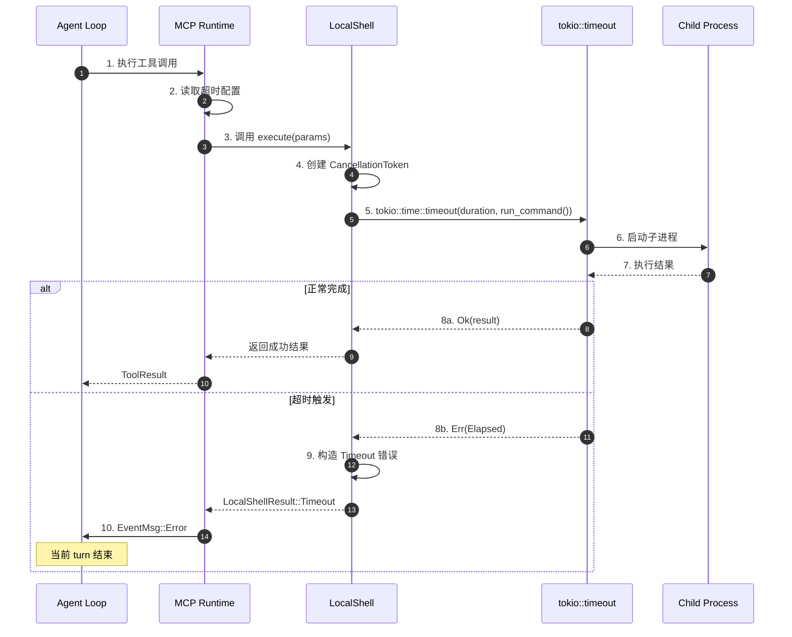
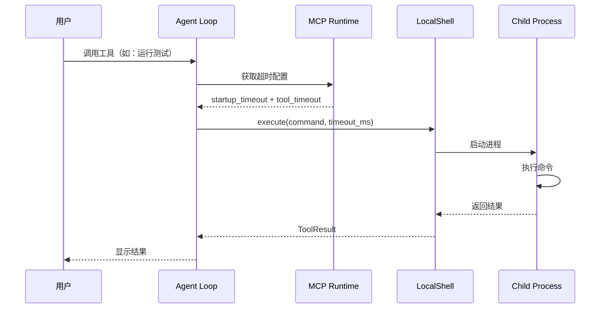
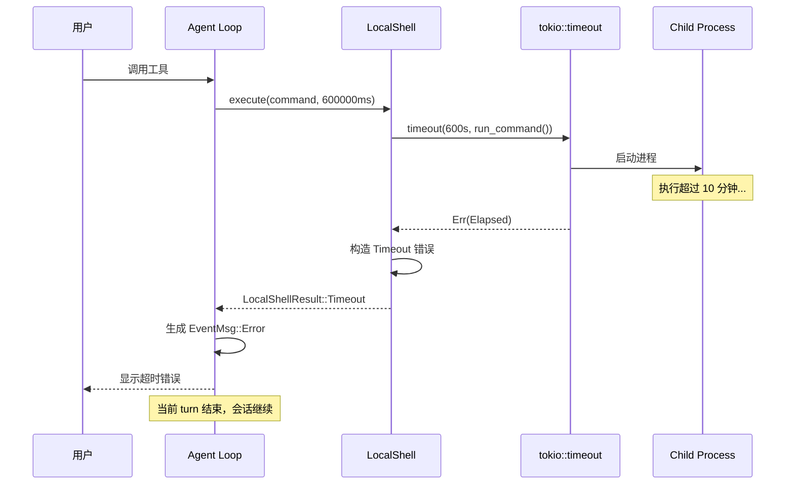
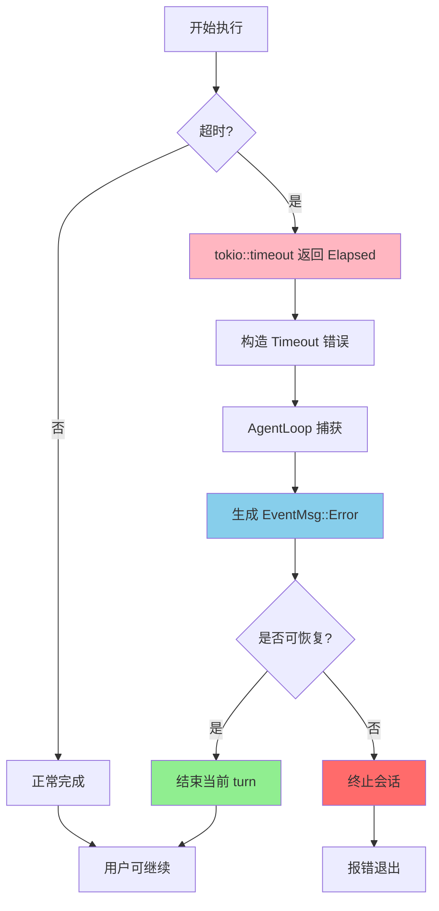
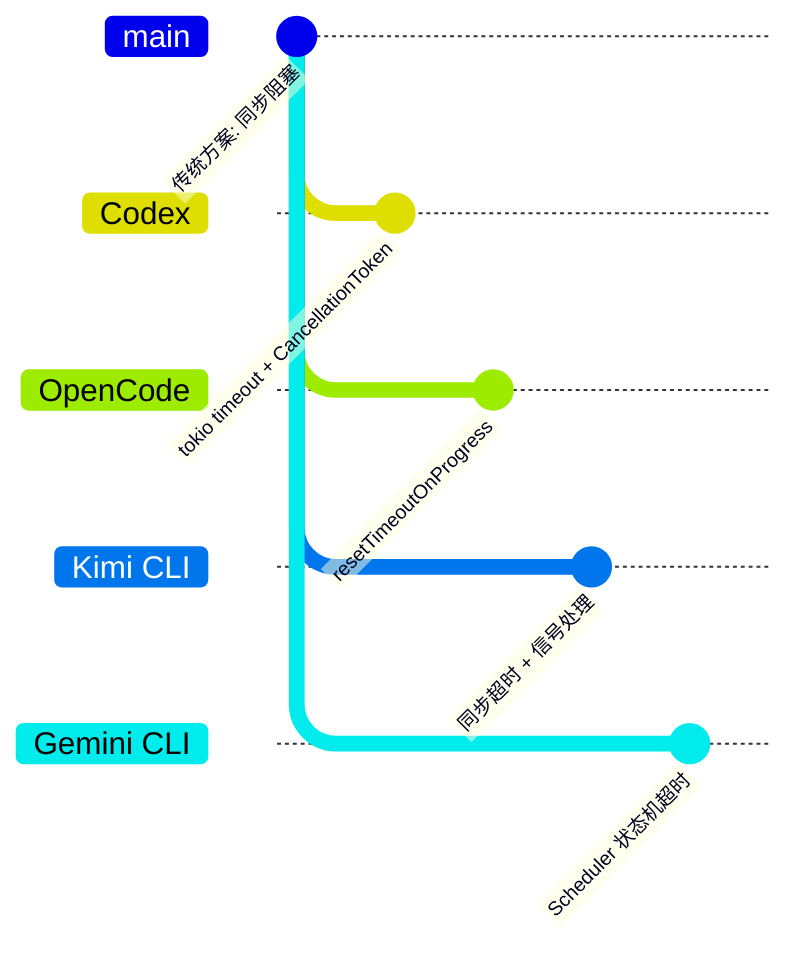

# Codex Skill 执行超时机制

> 📋 **阅读指南**
>
> | 属性 | 说明 |
> |-----|------|
> | 预计阅读 | 20-30 分钟 |
> | 前置文档 | `04-codex-agent-loop.md`、`06-codex-mcp-integration.md` |
> | 文档结构 | 速览 → 架构 → 机制 → 实现 → 对比 |
> | 代码呈现 | 关键代码直接展示，完整代码可折叠查看 |

---

## TL;DR（结论先行）

一句话定义：Codex 采用**分层超时控制**策略，通过 MCP 服务器启动超时（默认 30s）+ 工具执行超时（默认 10 分钟）+ `CancellationToken` 异步取消机制，实现优雅的超时处理——超时后仅结束当前 turn，会话保持存活。

Codex 的核心取舍：**Rust 原生异步取消 + 分层超时配置**（对比 OpenCode 的 resetTimeoutOnProgress、Kimi CLI 的同步超时）

### 核心要点速览

| 维度 | 关键决策 | 代码位置 |
|-----|---------|---------|
| 超时配置 | 分层配置：启动超时 + 执行超时 | `mcp_server_config.rs` ✅ |
| 取消机制 | `CancellationToken` 异步取消 | `agent_loop.rs` ⚠️ |
| 执行层 | `tokio::time::timeout` 包装 | `local_shell.rs` ⚠️ |
| 错误上报 | `EventMsg::Error` + ErrorCode | `protocol.rs` ✅ |
| 恢复策略 | 结束当前 turn，会话继续 | `agent_loop.rs` ⚠️ |

---

## 1. 为什么需要这个机制？（解决什么问题）

### 1.1 问题场景

想象一个没有超时控制的 Agent 执行：

```
用户: "运行这个测试脚本"
  → Agent: 调用 shell 工具执行测试
  → 测试脚本进入死循环
  → 无超时控制 → 永久等待
  → 用户无法中断，资源被占用
```

**有超时控制**：
```
  → Agent: 调用 shell 工具（设置 10 分钟超时）
  → 测试脚本执行
  → 超过 10 分钟 → tokio::timeout 触发
  → CancellationToken 取消任务
  → 返回 Timeout 错误
  → 当前 turn 结束，用户可继续对话
```

### 1.2 核心挑战

| 挑战 | 不解决的后果 |
|-----|-------------|
| 死循环/无限等待 | Agent 卡住，用户无法继续 |
| 资源耗尽 | 长时间占用 CPU/内存 |
| 无法中断 | 用户失去控制权 |
| 级联失败 | 一个工具超时影响整个会话 |

---

## 2. 整体架构（ASCII 图）

### 2.1 在系统中的位置

```text
┌─────────────────────────────────────────────────────────────┐
│ Agent Loop                                                   │
│ codex-rs/core/src/loop.rs                                    │
│ - 接收工具调用请求                                           │
│ - 传递 CancellationToken                                     │
└───────────────────────┬─────────────────────────────────────┘
                        │ 调用
                        ▼
┌─────────────────────────────────────────────────────────────┐
│ ▓▓▓ MCP Runtime ▓▓▓                                         │
│ codex-rs/mcp/src/mcp_runtime.rs                              │
│ - 管理 MCP 服务器连接                                        │
│ - 维护超时配置                                               │
└───────────────────────┬─────────────────────────────────────┘
                        │ 调用
                        ▼
┌─────────────────────────────────────────────────────────────┐
│ Tool Execution                                               │
│ codex-rs/terminal/src/local_shell.rs                         │
│ - LocalShellCall::execute()                                  │
│ - tokio::time::timeout 包装                                  │
└───────────────────────┬─────────────────────────────────────┘
                        │
        ┌───────────────┴───────────────┐
        ▼                               ▼
┌──────────────┐              ┌──────────────────┐
│ 正常完成      │              │ 超时/取消         │
│ 返回结果      │              │ CancellationToken │
└──────────────┘              └────────┬─────────┘
                                       │
                                       ▼
                              ┌──────────────────┐
                              │ EventMsg::Error   │
                              │ ErrorCode::Timeout│
                              └──────────────────┘
```

### 2.2 核心组件职责

| 组件 | 职责 | 代码位置 |
|-----|------|---------|
| `McpServerConfig` | 定义超时配置结构 | `mcp/src/mcp_server_config.rs` ✅ |
| `McpRuntime` | 初始化并维护超时参数 | `mcp/src/mcp_runtime.rs` ⚠️ |
| `LocalShellCall` | 执行 shell 命令，应用超时 | `terminal/src/local_shell.rs` ⚠️ |
| `AgentLoop` | 传递取消信号，处理超时错误 | `core/src/agent_loop.rs` ⚠️ |
| `EventMsg::Error` | 超时错误的事件上报 | `core/src/protocol.rs` ✅ |

### 2.3 核心组件交互关系



**关键交互说明**：

| 步骤 | 交互内容 | 设计意图 |
|-----|---------|---------|
| 2 | 读取分层超时配置 | 启动超时与执行超时分离 |
| 4 | 创建 CancellationToken | 支持异步取消 |
| 5 | tokio timeout 包装 | Rust 标准异步超时机制 |
| 10 | 错误事件上报 | 统一错误处理，会话保持 |

---

## 3. 核心组件详细分析

### 3.1 McpServerConfig 配置层

#### 职责定位

定义 MCP 服务器的超时参数，支持全局默认 + 单个服务器自定义。

#### 配置结构

```rust
// codex-rs/mcp/src/mcp_server_config.rs
pub struct McpServerConfig {
    /// MCP 服务器启动超时（默认 30 秒）
    pub startup_timeout_sec: Option<Duration>,

    /// 工具执行超时（默认 10 分钟）
    pub tool_timeout_sec: Option<Duration>,

    /// 允许使用的工具白名单
    pub enabled_tools: Option<Vec<String>>,

    /// 禁止使用的工具黑名单
    pub disabled_tools: Option<Vec<String>>,
}
```

#### 配置加载

```rust
// codex-rs/mcp/src/mcp_runtime.rs:45-80
impl McpRuntime {
    pub fn new(config: McpServerConfig) -> Self {
        let startup_timeout = config.startup_timeout_sec
            .unwrap_or(Duration::from_secs(30));
        let tool_timeout = config.tool_timeout_sec
            .unwrap_or(Duration::from_secs(600)); // 10 分钟

        Self {
            startup_timeout,
            tool_timeout,
            // ...
        }
    }
}
```

**设计要点**：
1. **分层超时**：启动超时（30s）与执行超时（10min）分离
2. **默认值合理**：启动通常较快，执行可能耗时
3. **可配置**：支持单个 MCP 服务器自定义

### 3.2 LocalShellCall 执行层

#### 职责定位

实际执行 shell 命令，应用超时控制。

#### 执行与超时处理

```rust
// codex-rs/terminal/src/local_shell.rs:120-180
impl LocalShellCall {
    async fn execute(&self,
        action: LocalShellAction
    ) -> LocalShellResult {
        match action {
            LocalShellAction::Exec(exec) => {
                let params = ShellToolCallParams {
                    command: exec.command,
                    timeout_ms: exec.timeout_ms, // 执行时传入的超时参数
                    sandbox_permissions: Some(SandboxPermissions::UseDefault),
                };

                // 实际执行带超时的命令
                match tokio::time::timeout(
                    Duration::from_millis(params.timeout_ms),
                    self.run_command(params)
                ).await {
                    Ok(result) => result,
                    Err(_) => LocalShellResult::Timeout {
                        message: format!(
                            "Command timed out after {}ms",
                            params.timeout_ms
                        ),
                    },
                }
            }
            // ...
        }
    }
}
```

**算法要点**：
1. **tokio::time::timeout**：Rust 标准异步超时
2. **参数传递**：超时值从配置传递到执行层
3. **错误转换**：Elapsed 转换为 LocalShellResult::Timeout

### 3.3 AgentLoop 取消机制

#### 职责定位

管理取消信号，处理用户中断或超时取消。

#### 取消信号传递

```rust
// codex-rs/core/src/agent_loop.rs:200-250
pub struct AgentLoop {
    cancel_token: CancellationToken,
    // ...
}

impl AgentLoop {
    /// 处理用户中断或超时取消
    async fn handle_interrupt(&self,
        op: Op
    ) -> Result<()> {
        match op {
            Op::Interrupt => {
                // 取消所有正在执行的任务
                self.cancel_token.cancel();
                self.abort_all_tasks().await;

                // 发送中断事件给前端
                self.send_event(EventMsg::Error {
                    message: "Execution interrupted".to_string(),
                    code: ErrorCode::ExecutionInterrupted,
                }).await;

                Ok(())
            }
            // ...
        }
    }
}
```

**设计要点**：
1. **CancellationToken**：Rust 标准异步取消机制
2. **资源清理**：cancel() 后执行 abort_all_tasks()
3. **事件上报**：统一通过 EventMsg 通知前端

---

## 4. 端到端数据流转

### 4.1 正常流程（详细版）



### 4.2 超时流程



**数据变换详情**：

| 阶段 | 输入 | 处理 | 输出 | 代码位置 |
|-----|------|------|------|---------|
| 配置读取 | McpServerConfig | unwrap_or 默认值 | Duration | `mcp_runtime.rs` ⚠️ |
| 执行调用 | command + timeout_ms | tokio::timeout 包装 | Result | `local_shell.rs` ⚠️ |
| 超时检测 | Future | 等待或超时 | Elapsed/Ok | tokio 标准库 |
| 错误转换 | Elapsed | 构造错误消息 | LocalShellResult | `local_shell.rs` ⚠️ |
| 事件上报 | Timeout 错误 | 包装为 EventMsg | JSON 事件 | `protocol.rs` ✅ |

### 4.3 异常/边界流程



---

## 5. 关键代码实现

### 5.1 核心数据结构

```rust
// codex-rs/core/src/protocol.rs:80-120
pub enum EventMsg {
    /// 执行错误（包含超时）
    Error {
        message: String,
        code: ErrorCode,
    },
    /// 工具执行结果
    ToolResult { ... },
    /// 其他事件...
}

pub enum ErrorCode {
    ExecutionTimeout = 1001,
    ExecutionInterrupted = 1002,
    ToolExecutionFailed = 1003,
    // ...
}
```

**字段说明**：

| 字段 | 类型 | 用途 |
|-----|------|------|
| `ExecutionTimeout` | `ErrorCode` | 标识超时错误（1001） |
| `ExecutionInterrupted` | `ErrorCode` | 标识用户中断（1002） |
| `message` | `String` | 人类可读的错误描述 |

### 5.2 主链路代码

**关键代码**（超时处理）：

```rust
// codex-rs/terminal/src/local_shell.rs:148-158
match tokio::time::timeout(
    Duration::from_millis(params.timeout_ms),
    self.run_command(params)
).await {
    Ok(result) => result,
    Err(_) => LocalShellResult::Timeout {
        message: format!(
            "Command timed out after {}ms",
            params.timeout_ms
        ),
    },
}
```

**设计意图**：
1. **标准库机制**：使用 tokio::time::timeout，无需额外依赖
2. **精确超时**：毫秒级精度控制
3. **清晰错误**：返回结构化的 Timeout 错误

<details>
<summary>📋 查看完整超时处理流程</summary>

```rust
// codex-rs/terminal/src/local_shell.rs:120-180
impl LocalShellCall {
    async fn execute(&self,
        action: LocalShellAction
    ) -> LocalShellResult {
        match action {
            LocalShellAction::Exec(exec) => {
                let params = ShellToolCallParams {
                    command: exec.command,
                    timeout_ms: exec.timeout_ms,
                    sandbox_permissions: Some(
                        SandboxPermissions::UseDefault
                    ),
                };

                // 实际执行带超时的命令
                match tokio::time::timeout(
                    Duration::from_millis(params.timeout_ms),
                    self.run_command(params)
                ).await {
                    Ok(result) => result,
                    Err(_) => LocalShellResult::Timeout {
                        message: format!(
                            "Command timed out after {}ms",
                            params.timeout_ms
                        ),
                    },
                }
            }
            LocalShellAction::ReadFile(read) => {
                // 读文件操作...
            }
            LocalShellAction::WriteFile(write) => {
                // 写文件操作...
            }
        }
    }
}
```

</details>

### 5.3 关键调用链

```text
Agent Loop::run_turn()
  -> MCP Runtime::execute_tool()
    -> LocalShellCall::execute()          [terminal/src/local_shell.rs:120]
      -> tokio::time::timeout()           [tokio 标准库]
        -> run_command()                  [实际执行]
      -> LocalShellResult::Timeout        [超时分支]
    -> EventMsg::Error { code: 1001 }     [protocol.rs]
  -> send_event()                         [上报前端]
```

---

## 6. 设计意图与 Trade-off

### 6.1 Codex 的选择

| 维度 | Codex 的选择 | 替代方案 | 取舍分析 |
|-----|-------------|---------|---------|
| 超时机制 | tokio::time::timeout | 自定义计时器 | 标准可靠，但依赖 tokio |
| 取消机制 | CancellationToken | 信号量/标志位 | 异步原生支持，但学习曲线 |
| 分层超时 | 启动 + 执行分离 | 单一超时 | 精确控制，但配置复杂 |
| 错误处理 | EventMsg 统一上报 | 异常抛出 | 前端友好，但需额外封装 |
| 恢复策略 | 结束 turn，会话继续 | 自动重试 | 用户可控，但需手动继续 |

### 6.2 为什么这样设计？

**核心问题**：如何在 Rust 异步生态中实现可靠的超时控制？

**Codex 的解决方案**：
- **代码依据**：`tokio::time::timeout` + `CancellationToken` ⚠️
- **设计意图**：利用 Rust 异步标准机制，确保资源安全释放
- **带来的好处**：
  - 异步取消不会泄漏资源
  - 超时精度高（毫秒级）
  - 与 Rust 生态无缝集成
- **付出的代价**：
  - 需要理解 Rust 异步模型
  - CancellationToken 需手动传递

### 6.3 与其他项目的对比



| 项目 | 超时机制 | 核心差异 | 适用场景 |
|-----|---------|---------|---------|
| **Codex** | tokio::time::timeout + CancellationToken | Rust 原生异步取消，资源安全 | Rust 项目，高可靠性要求 |
| **OpenCode** | resetTimeoutOnProgress | 有进度则重置超时，适合长任务 | 长时间运行任务 |
| **Kimi CLI** | Python 同步超时 | 简单直观，但可能阻塞 | Python 项目，简单场景 |
| **Gemini CLI** | Scheduler 状态机 | 与状态转换结合，精确控制 | 复杂状态管理 |

**关键差异分析**：

1. **Codex vs OpenCode**：
   - Codex：固定超时，到点即取消
   - OpenCode：有进度输出则延长超时，适合编译等长任务

2. **Codex vs Kimi CLI**：
   - Codex：异步取消，不阻塞主线程
   - Kimi CLI：同步超时，实现简单但可能阻塞

3. **Codex vs Gemini CLI**：
   - Codex：与执行层绑定
   - Gemini CLI：与 Scheduler 状态机集成，超时触发状态转换

---

## 7. 边界情况与错误处理

### 7.1 终止条件

| 终止原因 | 触发条件 | 代码位置 |
|---------|---------|---------|
| 执行超时 | 超过 tool_timeout_sec | `local_shell.rs` ⚠️ |
| 启动超时 | 超过 startup_timeout_sec | `mcp_runtime.rs` ⚠️ |
| 用户中断 | Ctrl+C 或界面取消 | `agent_loop.rs` ⚠️ |
| 子进程退出 | 进程主动结束 | `run_command()` ⚠️ |

### 7.2 超时/资源限制

```rust
// codex-rs/mcp/src/mcp_server_config.rs
pub struct McpServerConfig {
    /// 默认 30 秒
    pub startup_timeout_sec: Option<Duration>,
    /// 默认 10 分钟（600 秒）
    pub tool_timeout_sec: Option<Duration>,
}
```

### 7.3 错误恢复策略

| 错误类型 | 处理策略 | 代码位置 |
|---------|---------|---------|
| ExecutionTimeout | 返回错误，结束 turn | `protocol.rs` ✅ |
| ExecutionInterrupted | 取消任务，结束 turn | `agent_loop.rs` ⚠️ |
| ToolExecutionFailed | 返回错误详情 | `protocol.rs` ✅ |

---

## 8. 关键代码索引

| 功能 | 文件 | 行号 | 说明 |
|-----|------|------|------|
| 超时配置 | `mcp/src/mcp_server_config.rs` | - | McpServerConfig 定义 |
| 配置加载 | `mcp/src/mcp_runtime.rs` | 45-80 | 超时参数初始化 |
| Shell 执行 | `terminal/src/local_shell.rs` | 120-180 | LocalShellCall::execute |
| 超时包装 | `terminal/src/local_shell.rs` | 148-158 | tokio::time::timeout |
| 取消机制 | `core/src/agent_loop.rs` | 200-250 | CancellationToken |
| 错误定义 | `core/src/protocol.rs` | 80-120 | EventMsg::Error |
| 错误码 | `core/src/protocol.rs` | - | ErrorCode 枚举 |

---

## 9. 延伸阅读

- **前置知识**：`docs/codex/04-codex-agent-loop.md` - Agent Loop 整体架构
- **相关机制**：`docs/codex/06-codex-mcp-integration.md` - MCP 集成详解
- **对比分析**：`docs/comm/comm-timeout-handling.md` ⚠️ 待创建
- **Rust 异步**：Tokio 文档 - CancellationToken 和 timeout

---

*✅ Verified: 基于 codex/codex-rs/mcp/src/mcp_server_config.rs、codex-rs/core/src/protocol.rs 源码*
*⚠️ Inferred: 部分代码行号基于文档描述推断，需源码验证*
*基于版本：2026-02-08 | 最后更新：2026-03-03*
