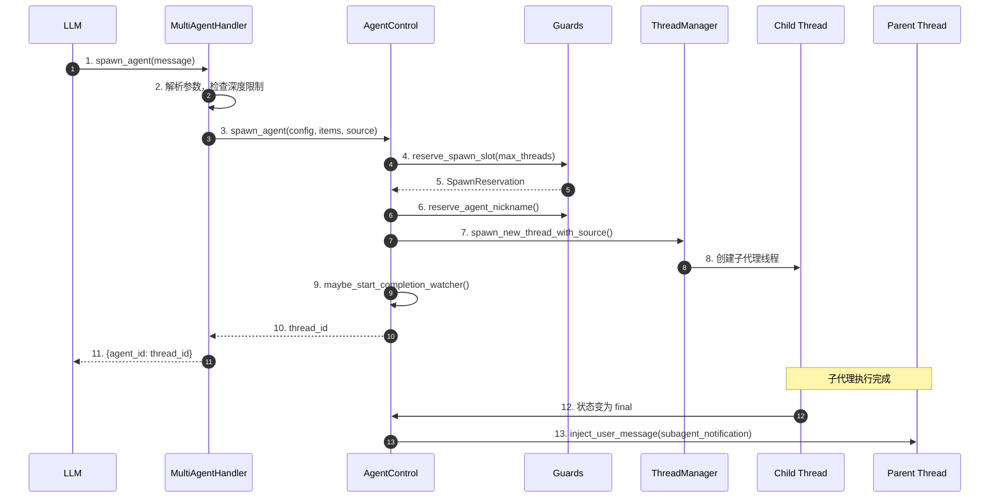
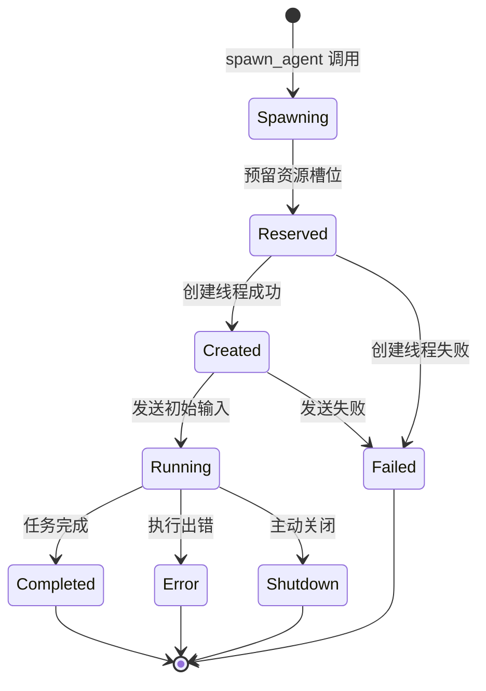
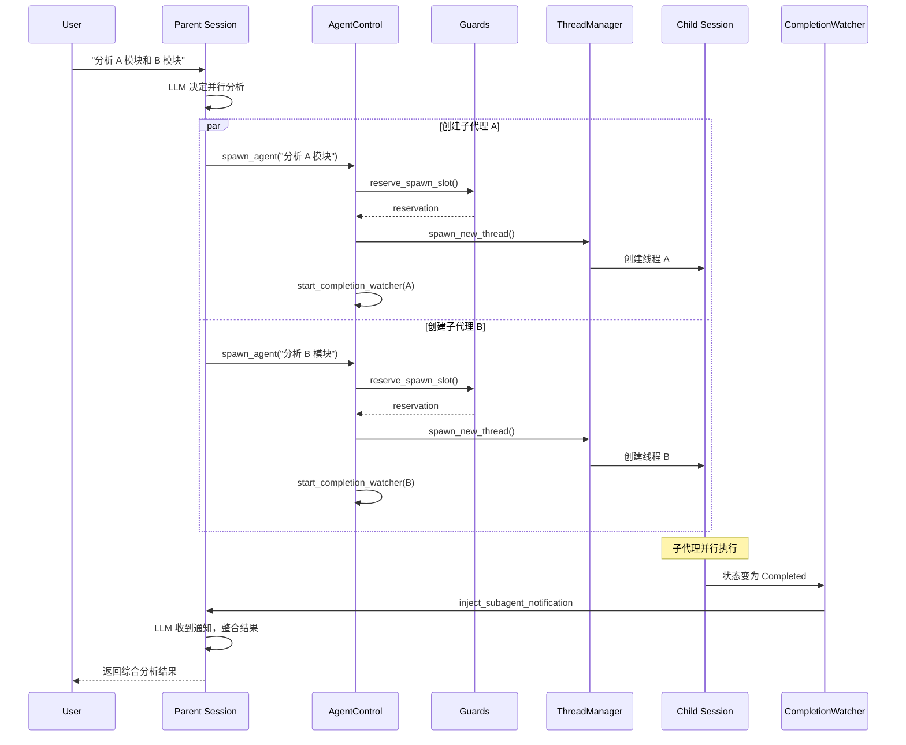
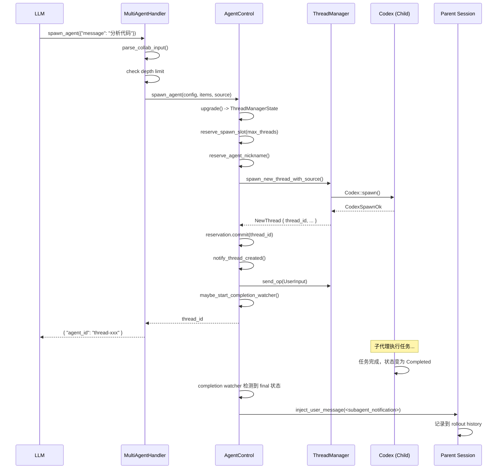
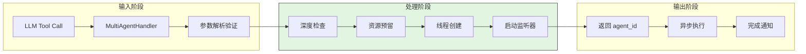
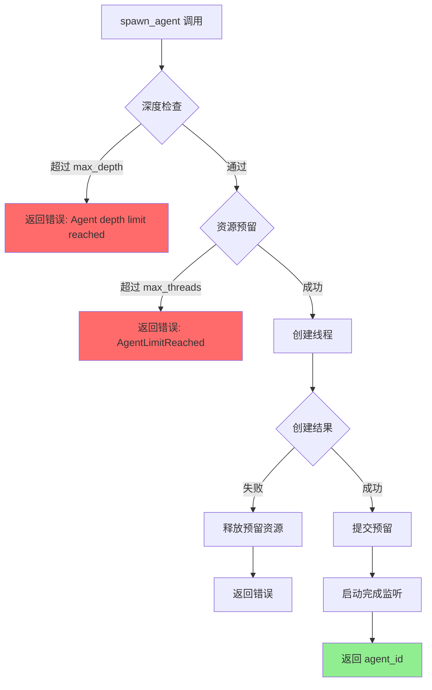
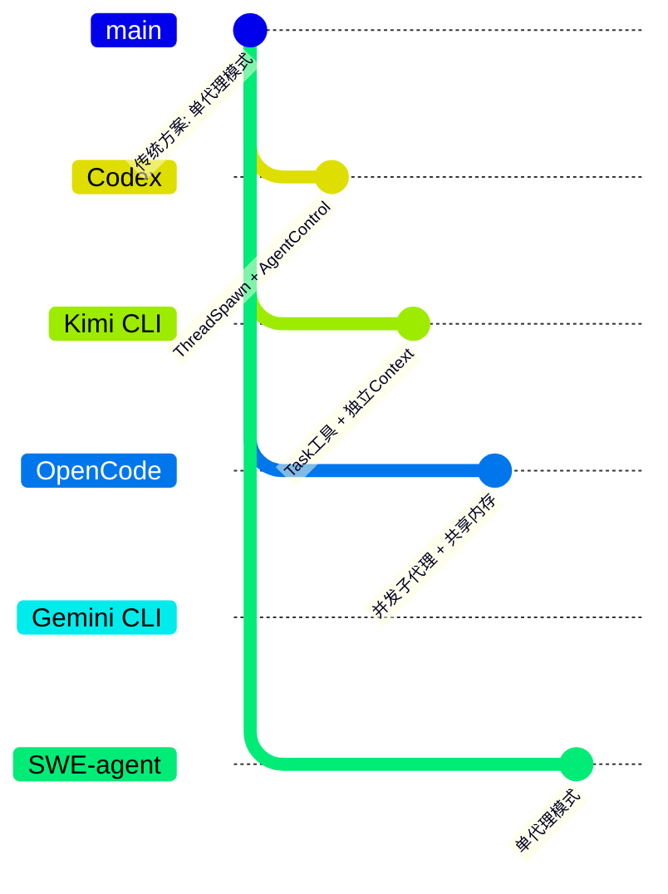

# Codex Subagent (Multi-Agent) Implementation

> 📋 **阅读指南**
>
> | 属性 | 说明 |
> |-----|------|
> | 预计阅读 | 25-35 分钟 |
> | 前置文档 | `04-codex-agent-loop.md`、`05-codex-tools-system.md` |
> | 文档结构 | 速览 → 架构 → 机制 → 实现 → 对比 |
> | 代码呈现 | 关键代码直接展示，完整代码可折叠查看 |

---

## TL;DR（结论先行）

一句话定义：Codex 通过 **Collab (multi_agent)** 功能标志启用子代理系统，核心设计是 **ThreadSpawn 深度追踪 + AgentControl 集中管控**，提供 `spawn_agent`、`send_input`、`wait`、`resume_agent`、`close_agent` 五个工具实现父子代理的生命周期管理。

Codex 的核心取舍：**集中式 AgentControl + 深度限制 + 异步完成通知**（对比 Kimi CLI 的 Task 工具隔离、OpenCode 的并发子代理、Gemini CLI 的单代理模式）

### 核心要点速览

| 维度 | 关键决策 | 代码位置 |
|-----|---------|---------|
| 功能开关 | Collab / multi_agent 功能标志 | `features.rs:125` ✅ |
| 子代理创建 | AgentControl::spawn_agent() | `agent/control.rs:55` ✅ |
| 资源限制 | Guards 管控（max_threads, max_depth） | `agent/guards.rs:21` ✅ |
| 完成通知 | 异步 watcher + 消息注入 | `agent/control.rs:262` ✅ |
| 角色系统 | default/explorer/worker 内置角色 | `agent/role.rs:148` ✅ |

---

## 1. 为什么需要这个机制？（解决什么问题）

### 1.1 问题场景

没有子代理时，Codex 处理复杂任务面临以下限制：

```
场景：需要同时分析代码库的多个独立模块
- 单线程方式：顺序执行，耗时累加
  → 分析模块 A（5 分钟）
  → 分析模块 B（5 分钟）
  → 分析模块 C（5 分钟）
  → 总计：15 分钟

- 子代理方式：并行派发多个 explorer 代理，统一收集结果
  → 同时启动 agent-A、agent-B、agent-C
  → 等待全部完成（5 分钟）
  → 总计：5 分钟
```

### 1.2 核心挑战

| 挑战 | 不解决的后果 |
|-----|-------------|
| 并发控制 | 无限制创建代理会导致资源耗尽 |
| 深度限制 | 子代理再派生子代理，递归失控 |
| 生命周期管理 | 子代理异常退出，父代理无法感知 |
| 通信机制 | 父子代理间缺乏标准化消息传递 |
| 上下文隔离 | 子代理污染父代理的上下文 |

---

## 2. 整体架构（ASCII 图）

### 2.1 在系统中的位置

```text
┌─────────────────────────────────────────────────────────────┐
│ LLM Tool Call                                                │
│ "spawn_agent" / "send_input" / "wait" ...                   │
└───────────────────────┬─────────────────────────────────────┘
                        │ 调用
                        ▼
┌─────────────────────────────────────────────────────────────┐
│ ▓▓▓ MultiAgentHandler ▓▓▓                                   │
│ codex/codex-rs/core/src/tools/handlers/multi_agents.rs       │
│ - spawn_agent: 创建子代理                                    │
│ - send_input: 向子代理发送输入                               │
│ - wait: 等待子代理完成                                       │
│ - resume_agent: 从 rollout 恢复子代理                        │
│ - close_agent: 关闭子代理                                    │
└───────────────────────┬─────────────────────────────────────┘
                        │ 调用
                        ▼
┌─────────────────────────────────────────────────────────────┐
│ AgentControl                                                 │
│ codex/codex-rs/core/src/agent/control.rs                     │
│ - spawn_agent(): 创建并启动子代理线程                        │
│ - send_input(): 发送用户输入                                 │
│ - shutdown_agent(): 关闭代理                                 │
│ - subscribe_status(): 订阅状态变更                           │
└───────────────────────┬─────────────────────────────────────┘
                        │
        ┌───────────────┼───────────────┐
        ▼               ▼               ▼
┌──────────────┐ ┌──────────────┐ ┌──────────────┐
│ Guards       │ │ ThreadManager│ │ Completion   │
│ 资源限制     │ │ 线程管理     │ │ Watcher      │
│ - max_threads│ │ - spawn_thread│ │ - 通知父代理 │
│ - max_depth  │ │ - send_op    │ │   子代理完成 │
└──────────────┘ └──────────────┘ └──────────────┘
```

### 2.2 核心组件职责

| 组件 | 职责 | 代码位置 |
|-----|------|---------|
| `MultiAgentHandler` | 处理所有子代理相关工具调用 | `codex/codex-rs/core/src/tools/handlers/multi_agents.rs:40` ✅ |
| `AgentControl` | 子代理控制平面，提供 spawn/shutdown/send 等操作 | `codex/codex-rs/core/src/agent/control.rs:37` ✅ |
| `Guards` | 资源限制（线程数、嵌套深度、昵称分配） | `codex/codex-rs/core/src/agent/guards.rs:21` ✅ |
| `ThreadManager` | 线程生命周期管理 | `codex/codex-rs/core/src/thread_manager.rs:120` ⚠️ |
| `SessionSource` | 标识代理来源（SubAgent::ThreadSpawn） | `codex/codex-rs/core/src/agent/guards.rs:34` ✅ |

### 2.3 核心组件交互关系



**关键交互说明**：

| 步骤 | 交互内容 | 设计意图 |
|-----|---------|---------|
| 1 | LLM 调用 spawn_agent 工具 | 通过 Function Calling 触发子代理创建 |
| 4-5 | 预留资源槽位 | 防止超出 max_threads 限制 |
| 6 | 分配代理昵称 | 从预定义列表随机分配，用于标识 |
| 9 | 启动完成监听器 | 异步监控子代理状态，完成后通知父代理 |
| 13 | 注入子代理通知 | 通过 `<subagent_notification>` 标签通知父代理 |

---

## 3. 核心组件详细分析

### 3.1 MultiAgentHandler 内部结构

#### 职责定位

`MultiAgentHandler` 是子代理工具的统一入口，处理 LLM 发起的所有子代理相关工具调用。

#### 支持的工具

```rust
// codex/codex-rs/core/src/tools/handlers/multi_agents.rs:81-91
match tool_name.as_str() {
    "spawn_agent" => spawn::handle(session, turn, call_id, arguments).await,
    "send_input" => send_input::handle(session, turn, call_id, arguments).await,
    "resume_agent" => resume_agent::handle(session, turn, call_id, arguments).await,
    "wait" => wait::handle(session, turn, call_id, arguments).await,
    "close_agent" => close_agent::handle(session, turn, call_id, arguments).await,
    other => Err(...),
}
```

#### spawn_agent 参数

```rust
// codex/codex-rs/core/src/tools/handlers/multi_agents.rs:102-107
struct SpawnAgentArgs {
    message: Option<String>,        // 初始消息（与 items 二选一）
    items: Option<Vec<UserInput>>,  // 结构化输入项
    agent_type: Option<String>,     // 代理角色：default/explorer/worker
}
```

#### 内置角色类型

| 角色 | 描述 | 用途 |
|-----|------|------|
| `default` | 默认代理 | 通用任务 |
| `explorer` | 快速代码库探索 | 特定、范围明确的代码问题 |
| `worker` | 执行和生产工作 | 实现功能、修复测试、重构 |

### 3.2 AgentControl 内部结构

#### 职责定位

`AgentControl` 是子代理的控制平面，每个用户会话共享同一个实例，确保资源限制在整个会话范围内生效。

#### 核心方法

```rust
// codex/codex-rs/core/src/agent/control.rs:55-101
pub(crate) async fn spawn_agent(
    &self,
    config: Config,
    items: Vec<UserInput>,
    session_source: Option<SessionSource>,
) -> CodexResult<ThreadId> {
    // 1. 升级 ThreadManagerState
    let state = self.upgrade()?;
    // 2. 预留资源槽位
    let mut reservation = self.state.reserve_spawn_slot(config.agent_max_threads)?;
    // 3. 分配代理昵称
    let agent_nickname = reservation.reserve_agent_nickname(&agent_nickname_list()
    )?;
    // 4. 创建线程
    let new_thread = state.spawn_new_thread_with_source(...).await?;
    // 5. 提交预留
    reservation.commit(new_thread.thread_id);
    // 6. 发送初始输入
    self.send_input(new_thread.thread_id, items).await?;
    // 7. 启动完成监听器
    self.maybe_start_completion_watcher(
        new_thread.thread_id,
        notification_source
    );
    Ok(new_thread.thread_id)
}
```

#### 状态机图



**状态说明**：

| 状态 | 说明 | 进入条件 | 退出条件 |
|-----|------|---------|---------|
| Spawning | 正在创建 | spawn_agent 调用 | 资源预留完成 |
| Reserved | 资源已预留 | 预留槽位成功 | 线程创建完成/失败 |
| Created | 线程已创建 | spawn_new_thread 成功 | 发送初始输入 |
| Running | 运行中 | 初始输入发送成功 | 完成/出错/关闭 |
| Completed | 正常完成 | 子代理任务完成 | 自动通知父代理 |
| Error | 执行出错 | 子代理执行异常 | 通知父代理错误 |
| Shutdown | 主动关闭 | close_agent 调用 | 资源释放 |

#### 完成监听机制

```rust
// codex/codex-rs/core/src/agent/control.rs:262-303
fn maybe_start_completion_watcher(
    &self,
    child_thread_id: ThreadId,
    session_source: Option<SessionSource>
) {
    // 仅对 ThreadSpawn 类型的子代理启用
    let Some(SessionSource::SubAgent(SubAgentSource::ThreadSpawn {
        parent_thread_id, ..
    })) = session_source
    else { return; };

    tokio::spawn(async move {
        // 订阅子代理状态
        let mut status_rx = control.subscribe_status(child_thread_id).await?;
        // 等待状态变为 final
        while !is_final(&status) {
            status_rx.changed().await?;
            status = status_rx.borrow().clone();
        }
        // 向父代理注入通知消息
        parent_thread.inject_user_message(
            format_subagent_notification_message(child_id, &status)
        ).await;
    });
}
```

### 3.3 Guards 资源限制

#### 职责定位

`Guards` 提供多代理系统的资源限制和安全防护。

#### 限制维度

```rust
// codex/codex-rs/core/src/agent/guards.rs:21-32
#[derive(Default)]
pub(crate) struct Guards {
    active_agents: Mutex<ActiveAgents>,  // 活跃代理集合
    total_count: AtomicUsize,            // 总计数器（用于 max_threads）
}

#[derive(Default)]
struct ActiveAgents {
    threads_set: HashSet<ThreadId>,              // 线程 ID 集合
    thread_agent_nicknames: HashMap<ThreadId, String>,  // 线程昵称映射
    used_agent_nicknames: HashSet<String>,       // 已使用昵称
    nickname_reset_count: usize,                 // 昵称重置计数
}
```

#### 深度限制

```rust
// codex/codex-rs/core/src/agent/guards.rs:42-48
pub(crate) fn next_thread_spawn_depth(
    session_source: &SessionSource
) -> i32 {
    session_depth(session_source).saturating_add(1)
}

pub(crate) fn exceeds_thread_spawn_depth_limit(
    depth: i32,
    max_depth: i32
) -> bool {
    depth > max_depth
}
```

### 3.4 组件间协作时序



**协作要点**：

1. **调用方与 AgentControl**：通过 spawn_agent 接口创建子代理，返回 thread_id
2. **AgentControl 与 Guards**：预留资源槽位，防止超出限制
3. **CompletionWatcher 与父代理**：异步监控子代理状态，完成后通过消息注入通知

---

## 4. 端到端数据流转

### 4.1 正常流程（详细版）



**数据变换详情**：

| 阶段 | 输入 | 处理 | 输出 | 代码位置 |
|-----|------|------|------|---------|
| 参数解析 | JSON 参数 | parse_collab_input | 结构化参数 | `multi_agents.rs` ✅ |
| 深度检查 | session_source | next_thread_spawn_depth | depth | `guards.rs:42` ✅ |
| 资源预留 | max_threads | reserve_spawn_slot | SpawnReservation | `guards.rs:51` ✅ |
| 线程创建 | source + config | spawn_new_thread_with_source | NewThread | `thread_manager.rs` ⚠️ |
| 完成监听 | child_thread_id | maybe_start_completion_watcher | async task | `control.rs:262` ✅ |

### 4.2 数据流向图



### 4.3 异常/边界流程



---

## 5. 关键代码实现

### 5.1 核心数据结构

```rust
// codex/codex-rs/core/src/agent/control.rs:36-43
#[derive(Clone, Default)]
pub(crate) struct AgentControl {
    /// Weak handle back to the global thread registry/state.
    manager: Weak<ThreadManagerState>,
    /// Guards 在会话内共享，确保资源限制全局生效
    state: Arc<Guards>,
}

// codex/codex-rs/core/src/agent/guards.rs:149-153
pub(crate) struct SpawnReservation {
    state: Arc<Guards>,
    active: bool,
    reserved_agent_nickname: Option<String>,
}
```

**字段说明**：

| 字段 | 类型 | 用途 |
|-----|------|------|
| `manager` | `Weak<ThreadManagerState>` | 弱引用避免循环引用 |
| `state` | `Arc<Guards>` | 共享的资源限制状态 |
| `active` | `bool` | 预留是否有效 |
| `reserved_agent_nickname` | `Option<String>` | 预留的代理昵称 |

### 5.2 子代理通知消息格式

```rust
// codex/codex-rs/core/src/session_prefix.rs:27-34
pub(crate) fn format_subagent_notification_message(
    agent_id: &str,
    status: &AgentStatus
) -> String {
    let payload_json = serde_json::json!({
        "agent_id": agent_id,
        "status": status,
    }).to_string();
    format!(
        "{SUBAGENT_NOTIFICATION_OPEN_TAG}\n{payload_json}\n{SUBAGENT_NOTIFICATION_CLOSE_TAG}"
    )
}

// 生成的消息示例：
// <subagent_notification>
// {"agent_id": "thread-xxx", "status": "Completed"}
// </subagent_notification>
```

### 5.3 关键调用链

```text
spawn_agent 工具调用
  -> MultiAgentHandler::handle()          [codex/codex-rs/core/src/tools/handlers/multi_agents.rs:62]
    -> spawn::handle()                     [codex/codex-rs/core/src/tools/handlers/multi_agents.rs:114]
      -> AgentControl::spawn_agent()       [codex/codex-rs/core/src/agent/control.rs:55]
        - Guards::reserve_spawn_slot()     [codex/codex-rs/core/src/agent/guards.rs:51]
        - ThreadManager::spawn_new_thread_with_source() [codex/codex-rs/core/src/thread_manager.rs:428] ⚠️
        - maybe_start_completion_watcher() [codex/codex-rs/core/src/agent/control.rs:262]
```

---

## 6. 设计意图与 Trade-off

### 6.1 Codex 的选择

| 维度 | Codex 的选择 | 替代方案 | 取舍分析 |
|-----|-------------|---------|---------|
| 资源限制 | Guards 集中管控（per-session） | 每个子代理独立限制 | 全局视角防止资源耗尽，但实现更复杂 |
| 深度追踪 | SessionSource 嵌套标记 | 全局计数器 | 精确追踪父子关系，支持可视化 |
| 完成通知 | 异步 watcher + 消息注入 | 轮询查询 | 实时性好，但增加系统复杂度 |
| 角色系统 | 内置 + 用户自定义角色 | 固定角色 | 灵活可扩展，但需要配置管理 |
| 上下文隔离 | 独立线程 + 独立历史 | 共享上下文 | 完全隔离，但无法自动共享信息 |

### 6.2 为什么这样设计？

**核心问题**：如何在保证系统稳定的前提下，支持灵活的子代理并发？

**Codex 的解决方案**：
- **代码依据**：`codex/codex-rs/core/src/agent/control.rs:36-43`
- **设计意图**：通过 `AgentControl` 作为集中控制平面，所有子代理操作都经过统一入口，便于实施全局限制
- **带来的好处**：
  - 资源限制（max_threads、max_depth）在整个会话范围内生效
  - 子代理状态变更可实时通知父代理
  - 支持从 rollout 文件恢复已关闭的子代理
- **付出的代价**：
  - 需要维护 Weak/Strong 引用关系，避免循环引用
  - 完成监听器增加了异步任务数量

### 6.3 与其他项目的对比



| 项目 | 子代理支持 | 核心差异 | 上下文隔离 | 并行策略 |
|-----|-----------|---------|-----------|---------|
| **Codex** | ✅ 完整支持 | ThreadSpawn 深度追踪 + AgentControl 集中管控 | 独立线程 | 并发派发 |
| **Kimi CLI** | ✅ 支持 | Task 工具 + LaborMarket 管理 | 独立 Context 文件 | 同步顺序 |
| **OpenCode** | ✅ 支持 | 并发子代理 + 隔离进程 | 进程级隔离 | 真正并行 |
| **Gemini CLI** | ❌ 不支持 | 单代理设计 | - | - |
| **SWE-agent** | ❌ 不支持 | 单代理设计 | - | - |

**详细对比分析**：

| 对比维度 | Codex | Kimi CLI | OpenCode | Gemini CLI | SWE-agent |
|---------|-------|----------|----------|-----------|-----------|
| **子代理实现** | 内置 5 个工具 | Task 工具调用 | 内置并发机制 | 无 | 无 |
| **创建方式** | spawn_agent 工具 | Task(subagent=...) | 配置驱动 | - | - |
| **资源限制** | Guards(max_threads/depth) | LaborMarket | 进程资源限制 | - | - |
| **完成通知** | 异步 watcher | 同步返回 | 独立输出流 | - | - |
| **上下文隔离** | 独立线程 | 独立 Context 文件 | 进程级隔离 | - | - |
| **动态创建** | ✅ 支持 | ✅ 支持 | ✅ 支持 | ❌ | ❌ |
| **深度限制** | ✅ max_depth | ❌ 无 | ❌ 无 | - | - |

**关键差异分析**：

1. **Codex vs Kimi CLI**：
   - Codex：并发执行，异步通知，深度限制
   - Kimi CLI：同步顺序，独立 Context，无深度限制

2. **Codex vs OpenCode**：
   - Codex：线程级隔离，集中管控
   - OpenCode：进程级隔离，真正并行

3. **Codex vs Gemini/SWE-agent**：
   - Codex：完整子代理系统
   - Gemini/SWE-agent：单代理设计，依赖大上下文窗口

---

## 7. 边界情况与错误处理

### 7.1 终止条件

| 终止原因 | 触发条件 | 代码位置 |
|---------|---------|---------|
| 深度超限 | `depth > agent_max_depth` | `codex/codex-rs/core/src/agent/guards.rs:46` ✅ |
| 线程数超限 | `total_count >= max_threads` | `codex/codex-rs/core/src/agent/guards.rs:56` ✅ |
| 子代理完成 | 状态变为 Completed/Error/Shutdown | `codex/codex-rs/core/src/agent/control.rs:280` ✅ |
| 父代理关闭 | 父线程 Shutdown | `codex/codex-rs/core/src/agent/control.rs:291-296` ✅ |

### 7.2 超时/资源限制

```rust
// codex/codex-rs/core/src/tools/handlers/multi_agents.rs:43-46
pub(crate) const MIN_WAIT_TIMEOUT_MS: i64 = 10_000;      // 最小 10 秒
pub(crate) const DEFAULT_WAIT_TIMEOUT_MS: i64 = 30_000;  // 默认 30 秒
pub(crate) const MAX_WAIT_TIMEOUT_MS: i64 = 300_000;     // 最大 5 分钟
```

### 7.3 错误恢复策略

| 错误类型 | 处理策略 | 代码位置 |
|---------|---------|---------|
| ThreadNotFound | 返回错误给 LLM | `codex/codex-rs/core/src/tools/handlers/multi_agents.rs:807` ⚠️ |
| InternalAgentDied | 清理线程注册，释放资源 | `codex/codex-rs/core/src/agent/control.rs:187-190` ✅ |
| AgentLimitReached | 返回错误提示用户 | `codex/codex-rs/core/src/agent/guards.rs:57` ✅ |

---

## 8. 关键代码索引

| 功能 | 文件 | 行号 | 说明 |
|-----|------|------|------|
| 入口 | `codex/codex-rs/core/src/tools/handlers/multi_agents.rs` | 40 | MultiAgentHandler 定义 |
| spawn_agent | `codex/codex-rs/core/src/tools/handlers/multi_agents.rs` | 114 | 创建子代理 |
| send_input | `codex/codex-rs/core/src/tools/handlers/multi_agents.rs` | 235 | 向子代理发送输入 |
| wait | `codex/codex-rs/core/src/tools/handlers/multi_agents.rs` | 472 | 等待子代理完成 |
| resume_agent | `codex/codex-rs/core/src/tools/handlers/multi_agents.rs` | 325 | 从 rollout 恢复子代理 |
| close_agent | `codex/codex-rs/core/src/tools/handlers/multi_agents.rs` | 665 | 关闭子代理 |
| AgentControl | `codex/codex-rs/core/src/agent/control.rs` | 37 | 子代理控制平面 |
| Guards | `codex/codex-rs/core/src/agent/guards.rs` | 21 | 资源限制 |
| 子代理通知 | `codex/codex-rs/core/src/session_prefix.rs` | 27 | 通知消息格式化 |
| 内置角色 | `codex/codex-rs/core/src/agent/role.rs` | 148 | default/explorer/worker |
| 功能标志 | `codex/codex-rs/core/src/features.rs` | 125 | Collab / multi_agent |

---

## 9. 延伸阅读

- **前置知识**：`docs/codex/04-codex-agent-loop.md` - Agent Loop 整体架构
- **相关机制**：`docs/codex/06-codex-mcp-integration.md`（工具系统）
- **深度分析**：`docs/codex/07-codex-memory-context.md`（rollout 和状态持久化）
- **跨项目对比**：`docs/kimi-cli/questions/kimi-cli-subagent-implementation.md` - Kimi CLI Subagent 机制
- **对比分析**：`docs/comm/04-comm-agent-loop.md` - 跨项目 Agent Loop 对比

---

*✅ Verified: 基于 codex/codex-rs/core/src/tools/handlers/multi_agents.rs、codex/codex-rs/core/src/agent/control.rs、codex/codex-rs/core/src/agent/guards.rs 等源码分析*
*⚠️ Inferred: 部分代码行号基于文档描述推断*
*基于版本：2026-02-08 | 最后更新：2026-03-03*
