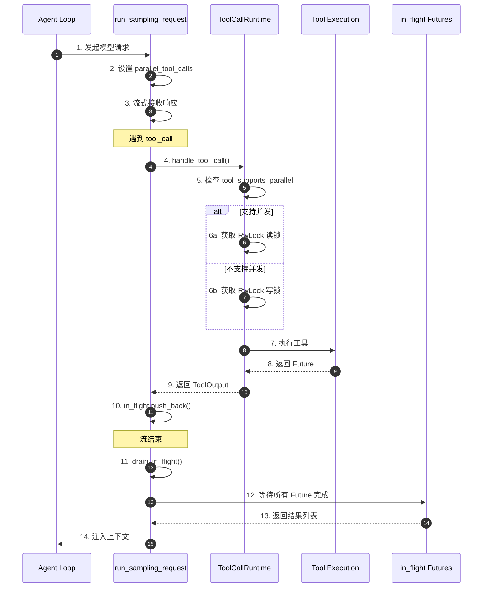
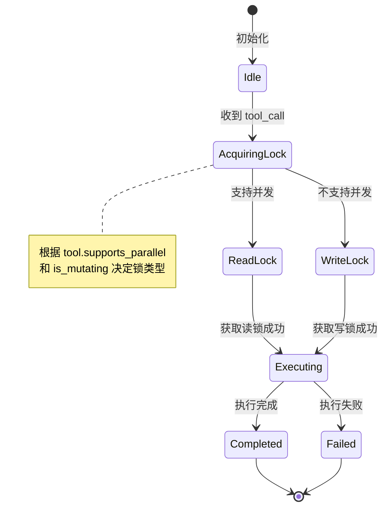
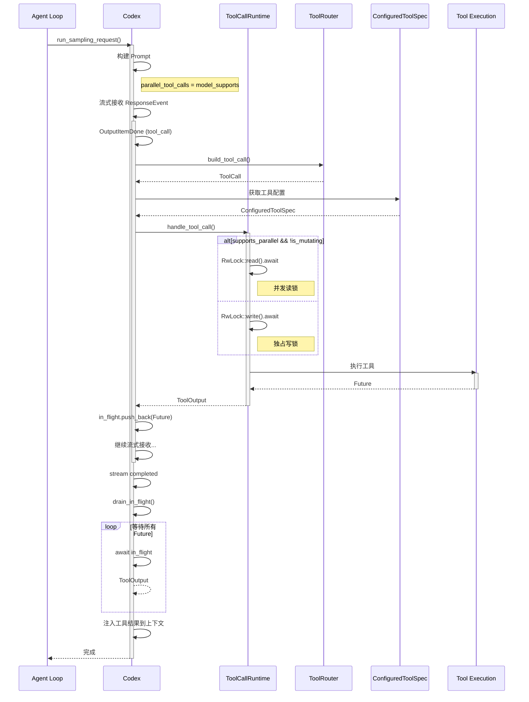
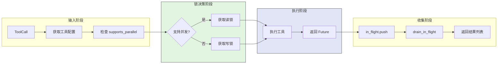
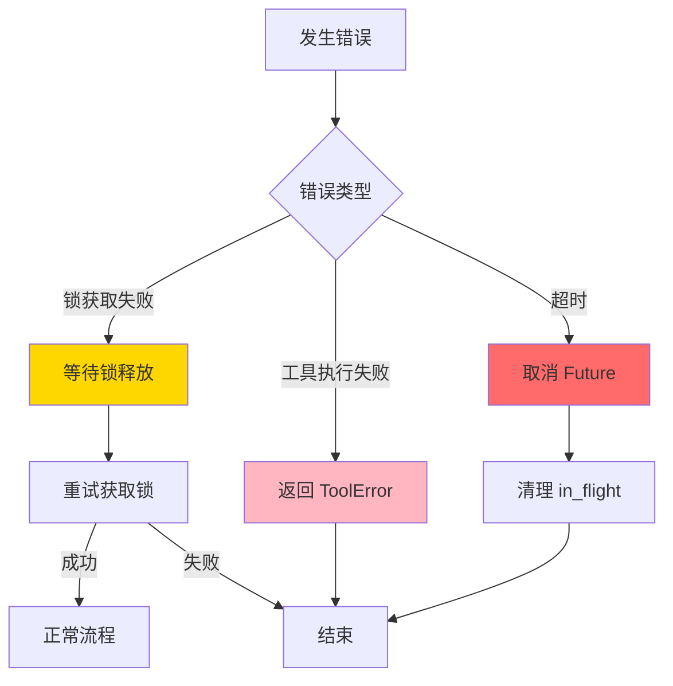
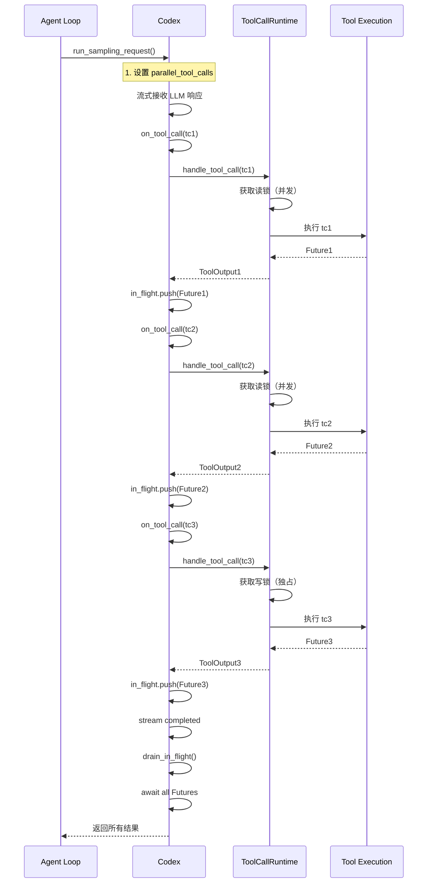
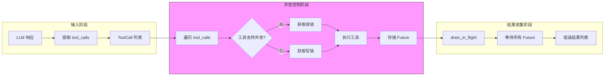
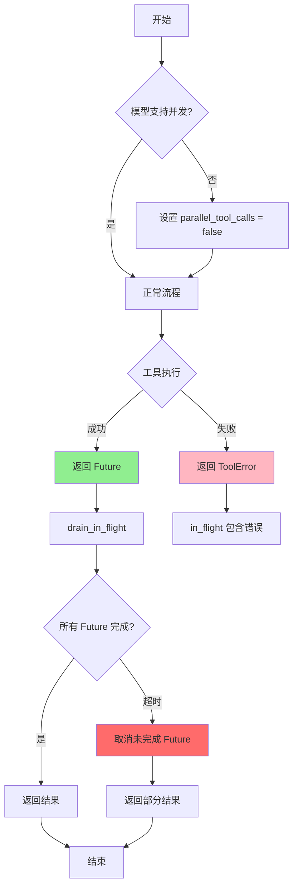
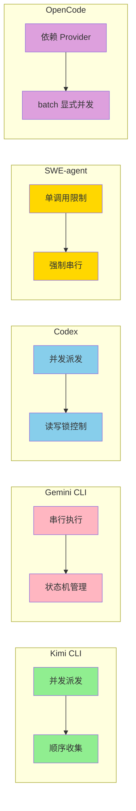

# Codex Tool Call 并发机制

> 📋 **阅读指南**
>
> | 属性 | 说明 |
> |-----|------|
> | 预计阅读 | 15-20 分钟 |
> | 前置文档 | `docs/codex/04-codex-agent-loop.md`、`docs/codex/05-codex-tools-system.md` |
> | 文档结构 | 结论 → 架构 → 机制 → 实现 → 对比 |

---

## TL;DR（结论先行）

一句话定义：Codex 采用**模型能力开关 + 工具级并发能力 + 运行时读写锁**三层联合控制的并发策略，实现安全且高效的多工具并行执行。

Codex 的核心取舍：**读写锁细粒度控制并发**（对比 Kimi CLI 的并发派发+顺序收集、Gemini CLI 的串行执行、SWE-agent 的单调用限制）

### 核心要点速览

| 维度 | 关键决策 | 代码位置 |
|-----|---------|---------|
| 并发开关 | 从模型信息读取 `supports_parallel_tool_calls` | `codex-rs/core/src/codex.rs:450-480` |
| 锁控制 | `RwLock` 读锁（并发）/ 写锁（独占） | `codex-rs/core/src/tools/parallel.rs:80-120` |
| 工具分类 | `supports_parallel_tool_calls` + `is_mutating` 双重判断 | `codex-rs/core/src/tools/registry.rs:50-80` |
| 结果收集 | `in_flight` Futures 统一收集 | `codex-rs/core/src/codex.rs:550-600` |

---

## 1. 为什么需要这个机制？（解决什么问题）

### 1.1 问题场景

没有并发机制的场景：
```
用户请求: "分析项目结构"
  → LLM: "读取 package.json" → 等待完成 → 耗时 100ms
  → LLM: "读取 tsconfig.json" → 等待完成 → 耗时 80ms
  → LLM: "读取 README.md" → 等待完成 → 耗时 120ms
  → 总耗时: 300ms
```

有并发机制的场景：
```
用户请求: "分析项目结构"
  → LLM: 同时请求读取 package.json、tsconfig.json、README.md
  → 三个读取操作并行执行 → 总耗时 ≈ max(100ms, 80ms, 120ms) = 120ms
```

### 1.2 核心挑战

| 挑战 | 不解决的后果 |
|-----|-------------|
| 并发安全 | 多个写操作同时执行导致数据竞争和文件损坏 |
| 资源控制 | 无限制的并发导致系统资源耗尽 |
| 结果顺序 | 并行结果返回顺序不确定，LLM 无法匹配请求与结果 |
| 工具能力差异 | 不同工具对并发的支持程度不同，需要差异化处理 |

---

## 2. 整体架构（ASCII 图）

### 2.1 在系统中的位置

```text
┌─────────────────────────────────────────────────────────────┐
│ Agent Loop / Session Runtime                                 │
│ codex/codex-rs/core/src/codex.rs                            │
└───────────────────────┬─────────────────────────────────────┘
                        │ run_sampling_request()
                        ▼
┌─────────────────────────────────────────────────────────────┐
│ ▓▓▓ Tool Call Concurrency Control ▓▓▓                      │
│ codex/codex-rs/core/src/tools/parallel.rs                   │
│ - ToolCallRuntime: 运行时并发控制                           │
│ - handle_tool_call(): 锁获取与工具执行                      │
│ - drain_in_flight(): 结果收集                               │
└───────────────────────┬─────────────────────────────────────┘
                        │ 并发/独占执行
        ┌───────────────┼───────────────┐
        ▼               ▼               ▼
┌──────────────┐ ┌──────────────┐ ┌──────────────┐
│ LLM Provider │ │ Tool Router  │ │ Registry     │
│ 模型能力检测  │ │ 工具路由     │ │ 工具元数据   │
└──────────────┘ └──────────────┘ └──────────────┘
```

### 2.2 核心组件职责

| 组件 | 职责 | 代码位置 |
|-----|------|---------|
| `Codex::run_sampling_request()` | 发起模型请求，设置 `parallel_tool_calls` 开关 | `codex-rs/core/src/codex.rs:450-480` |
| `ToolCallRuntime` | 运行时并发控制，管理 `RwLock` 读写锁 | `codex-rs/core/src/tools/parallel.rs:40-150` |
| `ToolCall` | 标准化工具调用结构 | `codex-rs/core/src/tools/router.rs:30-60` |
| `ConfiguredToolSpec` | 工具配置，定义并发能力和变更属性 | `codex-rs/core/src/tools/registry.rs:50-80` |
| `in_flight` Futures | 存储正在执行的工具调用 Future | `codex-rs/core/src/codex.rs:200-250` |

### 2.3 核心组件交互关系



**关键交互说明**：

| 步骤 | 交互内容 | 设计意图 |
|-----|---------|---------|
| 1-2 | Agent Loop 发起请求并设置并发开关 | 根据模型能力动态调整 |
| 4-6 | ToolCallRuntime 根据工具能力选择锁类型 | 细粒度并发控制，保证安全 |
| 7-10 | 工具异步执行，Future 存入 in_flight | 非阻塞并发执行 |
| 11-13 | 流结束后统一收集结果 | 保证结果完整性 |

---

## 3. 核心组件详细分析

### 3.1 ToolCallRuntime 内部结构

#### 职责定位

ToolCallRuntime 是 Codex 的工具并发执行层，通过 `RwLock` 实现细粒度的并发控制：读锁允许多个并发读操作，写锁确保写操作独占执行。

#### 状态机图



**状态说明**：

| 状态 | 说明 | 进入条件 | 退出条件 |
|-----|------|---------|---------|
| Idle | 运行时就绪 | 初始化完成 | 收到 tool_call |
| AcquiringLock | 获取锁中 | 需要执行工具 | 获取到读锁或写锁 |
| ReadLock | 读锁模式 | 工具支持并发且非变更型 | 执行完成 |
| WriteLock | 写锁模式 | 工具不支持并发或是变更型 | 执行完成 |
| Executing | 执行中 | 获取锁成功 | 执行完成或失败 |
| Completed | 执行成功 | 工具正常返回 | 自动结束 |
| Failed | 执行失败 | 工具抛出异常 | 自动结束 |

#### 内部数据流

```text
┌─────────────────────────────────────────────────────────────┐
│  输入层                                                      │
│  ├── ToolCall (call_id, name, arguments)                    │
│  └── ConfiguredToolSpec (supports_parallel, is_mutating)    │
└──────────────────────────┬──────────────────────────────────┘
                           ▼
┌─────────────────────────────────────────────────────────────┐
│  锁决策层                                                    │
│  ├── if supports_parallel && !is_mutating: 读锁             │
│  └── else: 写锁                                             │
│      └── tool_call_gate 额外检查                            │
└──────────────────────────┬──────────────────────────────────┘
                           ▼
┌─────────────────────────────────────────────────────────────┐
│  执行层                                                      │
│  ├── RwLock::read().await 或 RwLock::write().await          │
│  ├── 执行实际工具调用                                        │
│  └── 返回 ToolOutput                                        │
└──────────────────────────┬──────────────────────────────────┘
                           ▼
┌─────────────────────────────────────────────────────────────┐
│  输出层                                                      │
│  └── 返回 Future 或立即结果                                  │
└─────────────────────────────────────────────────────────────┘
```

#### 关键接口

| 接口 | 输入 | 输出 | 说明 | 代码位置 |
|-----|------|------|------|---------|
| `handle_tool_call()` | `ToolCall`, `ConfiguredToolSpec` | `ToolOutput` | 核心处理方法 | `parallel.rs:80` |
| `drain_in_flight()` | `in_flight` Futures | `Vec<ToolOutput>` | 收集所有执行结果 | `codex.rs:550` |
| `RwLock` | - | `RwLockReadGuard` / `RwLockWriteGuard` | 并发控制原语 | `parallel.rs:100-120` |

---

### 3.2 组件间协作时序

展示多个组件如何协作完成一个完整的并发工具调用流程。



**协作要点**：

1. **Agent Loop 与 Codex**: 调用 `run_sampling_request()` 发起请求
2. **Codex 与 ToolCallRuntime**: 通过 `handle_tool_call()` 派发工具调用
3. **ToolCallRuntime 与 RwLock**: 根据工具能力选择锁类型
4. **in_flight 收集**: 流结束后统一等待所有 Future 完成

---

### 3.3 关键数据路径

#### 主路径（正常流程）



#### 异常路径（错误恢复）



---

## 4. 端到端数据流转

### 4.1 正常流程（详细版）



**数据变换详情**：

| 阶段 | 输入 | 处理 | 输出 | 代码位置 |
|-----|------|------|------|---------|
| 接收 | `ToolCall` | 解析参数、查找工具 | `ToolCall` + `ConfiguredToolSpec` | `router.rs:30-60` |
| 锁决策 | 工具配置 | 检查 `supports_parallel` + `is_mutating` | 读锁/写锁选择 | `parallel.rs:90-110` |
| 执行 | 锁 + 工具调用 | 获取锁、执行工具 | `Future<ToolOutput>` | `parallel.rs:120` |
| 收集 | `Vec<Future>` | `drain_in_flight()` 等待所有完成 | `Vec<ToolOutput>` | `codex.rs:550-600` |
| 注入 | `Vec<ToolOutput>` | 格式化为消息追加到上下文 | 更新后的上下文 | `codex.rs:600-650` |

### 4.2 数据流向图



### 4.3 异常/边界流程



---

## 5. 关键代码实现

### 5.1 核心数据结构

**Prompt 并发开关**：
```rust
// codex/codex-rs/core/src/protocol.rs:50-60
pub struct Prompt {
    pub input: Vec<ResponseItem>,
    pub(crate) tools: Vec<ToolSpec>,
    pub(crate) parallel_tool_calls: bool,
}
```

**工具调用结构**：
```rust
// codex/codex-rs/core/src/tools/router.rs:30-45
pub struct ToolCall {
    pub tool_name: String,
    pub call_id: String,
    pub payload: ToolPayload,
}
```

**工具配置**：
```rust
// codex/codex-rs/core/src/tools/registry.rs:50-70
pub struct ConfiguredToolSpec {
    pub spec: ToolSpec,
    /// 是否支持并发工具调用
    pub supports_parallel_tool_calls: bool,
    /// 是否为变更型工具
    pub is_mutating: bool,
}
```

**字段说明**：

| 字段 | 类型 | 用途 |
|-----|------|------|
| `parallel_tool_calls` | `bool` | 控制模型是否生成并发工具调用 |
| `supports_parallel_tool_calls` | `bool` | 标记工具本身是否支持并发执行 |
| `is_mutating` | `bool` | 标记工具是否会修改状态（文件写入等） |
| `call_id` | `String` | 工具调用的唯一标识，用于结果匹配 |

### 5.2 主链路代码

**并发控制核心逻辑**：
```rust
// codex/codex-rs/core/src/tools/parallel.rs:80-120
impl ToolCallRuntime {
    pub async fn handle_tool_call(
        &self,
        tool_call: ToolCall,
        spec: &ConfiguredToolSpec,
    ) -> Result<ToolOutput, ToolError> {
        // 1. 判断工具并发能力
        let supports_parallel = spec.supports_parallel_tool_calls && !spec.is_mutating;

        if supports_parallel {
            // 2a. 支持并发：获取读锁（允许多个并发）
            let _guard = self.rwlock.read().await;
            self.execute_tool(tool_call).await
        } else {
            // 2b. 不支持并发：获取写锁（独占执行）
            let _guard = self.rwlock.write().await;
            // 额外门控检查
            if let Some(gate) = &self.tool_call_gate {
                gate.check(&tool_call).await?;
            }
            self.execute_tool(tool_call).await
        }
    }
}
```

**设计意图**：
1. **双重判断**：不仅检查 `supports_parallel_tool_calls`，还检查 `is_mutating`，确保写操作串行化
2. **RwLock 选择**：读锁允许多个并发，写锁保证独占，Rust 编译器确保锁安全
3. **tool_call_gate**：额外的门控机制，用于更细粒度的控制

<details>
<summary>📋 查看完整实现</summary>

```rust
// codex/codex-rs/core/src/tools/parallel.rs:1-150
use tokio::sync::RwLock;

pub struct ToolCallRuntime {
    rwlock: RwLock<()>,
    tool_call_gate: Option<ToolCallGate>,
}

impl ToolCallRuntime {
    pub fn new(gate: Option<ToolCallGate>) -> Self {
        Self {
            rwlock: RwLock::new(()),
            tool_call_gate: gate,
        }
    }

    async fn execute_tool(&self, tool_call: ToolCall) -> Result<ToolOutput, ToolError> {
        // 实际工具执行逻辑
        // 路由到具体工具实现
        match tool_call.tool_name.as_str() {
            "read_file" => self.read_file(tool_call.payload).await,
            "write_file" => self.write_file(tool_call.payload).await,
            "exec" => self.exec(tool_call.payload).await,
            _ => Err(ToolError::NotFound(tool_call.tool_name)),
        }
    }
}
```

</details>

**结果收集**：
```rust
// codex/codex-rs/core/src/codex.rs:550-600
async fn drain_in_flight(&mut self) -> Result<Vec<ToolOutput>, CodexErr> {
    let mut results = Vec::new();

    // 等待所有 in_flight 的 Future 完成
    for future in self.in_flight.drain(..) {
        match future.await {
            Ok(output) => results.push(output),
            Err(e) => {
                // 记录错误但继续收集其他结果
                tracing::error!("Tool execution failed: {}", e);
                results.push(ToolOutput::Error(e));
            }
        }
    }

    Ok(results)
}
```

### 5.3 关键调用链

```text
run_sampling_request()          [codex-rs/core/src/codex.rs:450]
  -> build_prompt()             [codex-rs/core/src/codex.rs:470]
    - 设置 parallel_tool_calls
  -> stream_response()          [codex-rs/core/src/codex.rs:500]
    - 流式接收 ResponseEvent
    -> on_output_item_done()    [codex-rs/core/src/codex.rs:520]
      -> build_tool_call()      [codex-rs/core/src/tools/router.rs:40]
      -> ToolCallRuntime::handle_tool_call()
                                  [codex-rs/core/src/tools/parallel.rs:80]
        - 检查 supports_parallel
        - 获取 RwLock 读锁/写锁  [codex-rs/core/src/tools/parallel.rs:100-120]
        - 执行工具
      -> in_flight.push_back()  [codex-rs/core/src/codex.rs:540]
  -> drain_in_flight()          [codex-rs/core/src/codex.rs:550]
    - 等待所有 Future 完成
  -> inject_results()           [codex-rs/core/src/codex.rs:600]
    - 将结果注入上下文
```

---

## 6. 设计意图与 Trade-off

### 6.1 Codex 的选择

| 维度 | Codex 的选择 | 替代方案 | 取舍分析 |
|-----|----------------|---------|---------|
| 并发控制 | `RwLock` 读写锁 | 无锁并发、Actor 模型 | 细粒度控制，保证安全，但增加复杂度 |
| 锁粒度 | 工具级别 | 全局锁、资源级别 | 平衡并发度和实现复杂度 |
| 并发判定 | `supports_parallel` + `is_mutating` | 仅模型能力、仅工具能力 | 多层防护，更安全但配置更复杂 |
| 结果收集 | 流结束后统一收集 | 即时返回、按完成顺序 | 保证顺序但延迟稍高 |

### 6.2 为什么这样设计？

**核心问题**：如何在保证安全的前提下最大化工具执行并发度？

**Codex 的解决方案**：

- **代码依据**：`codex-rs/core/src/tools/parallel.rs:80-120`
- **设计意图**：利用 Rust 的所有权和类型系统，在编译期保证并发安全
- **带来的好处**：
  - 内存安全：Rust 编译器确保没有数据竞争
  - 细粒度控制：读锁允许多个并发，写锁保证独占
  - 多层防护：模型能力 + 工具能力 + 变更检测
- **付出的代价**：
  - 复杂度：需要维护 `RwLock` 和门控机制
  - 延迟：写锁会阻塞其他操作

### 6.3 与其他项目的对比



| 项目 | 并发策略 | 核心差异 | 适用场景 |
|-----|---------|---------|---------|
| **Codex** | 并发 + 读写锁控制 | 根据工具是否支持并发决定读锁/写锁 | Rust 异步，需要细粒度并发控制 |
| **Kimi CLI** | 并发派发 + 顺序收集 | `asyncio.Task` 并发，按请求顺序收集结果 | Python 异步生态，I/O 密集型任务 |
| **Gemini CLI** | 串行执行 + 状态机 | 单 active call，队列缓冲 | 需要严格顺序保证、资源安全 |
| **SWE-agent** | 单调用限制 | 强制每次响应只能有一个 tool call | 简单可控，适合确定性调试 |
| **OpenCode** | Provider 依赖 + batch 显式并发 | 常规调用依赖 AI SDK，batch 工具显式 Promise.all | TypeScript 生态，灵活可控 |

**对比分析**：

- **Codex 的读写锁策略**提供了最细粒度的并发控制，适合需要区分读写操作的场景
- **Kimi CLI 的 asyncio 策略**更适合 Python 生态，实现简单但控制粒度较粗
- **Gemini CLI 的串行策略**牺牲了性能换取确定性和简单性
- **SWE-agent 的单调用限制**最简单，适合需要严格顺序控制的调试场景
- **OpenCode 的混合策略**依赖底层 SDK，同时提供显式并发工具

---

## 7. 边界情况与错误处理

### 7.1 终止条件

| 终止原因 | 触发条件 | 代码位置 |
|---------|---------|---------|
| 所有工具完成 | `drain_in_flight()` 收集完所有结果 | `codex.rs:550-600` |
| 流断开 | SSE stream disconnected | `codex.rs:500` |
| 工具执行失败 | 单个工具返回错误 | `parallel.rs:120` |
| 用户取消 | `CancellationToken` 触发 | `codex.rs:480` |

### 7.2 超时/资源限制

**ExecExpiration 超时抽象**：
```rust
// codex/codex-rs/core/src/exec.rs:50-70
pub enum ExecExpiration {
    Timeout(Duration),
    DefaultTimeout,
    Cancellation(CancellationToken),
}

pub const DEFAULT_EXEC_COMMAND_TIMEOUT_MS: u64 = 10_000; // 10秒
```

### 7.3 错误恢复策略

| 错误类型 | 处理策略 | 代码位置 |
|---------|---------|---------|
| 锁获取超时 | 返回 ToolTimeoutError | `parallel.rs:100` |
| 工具执行失败 | 记录错误，继续收集其他结果 | `codex.rs:560-570` |
| 流断开 | 取消所有 in_flight Future | `codex.rs:500` |

---

## 8. 关键代码索引

| 功能 | 文件 | 行号 | 说明 |
|-----|------|------|------|
| 入口 | `codex-rs/core/src/codex.rs` | 450 | `run_sampling_request()` 发起请求 |
| 并发开关 | `codex-rs/core/src/codex.rs` | 470 | 设置 `parallel_tool_calls` |
| 锁控制 | `codex-rs/core/src/tools/parallel.rs` | 80 | `handle_tool_call()` 核心方法 |
| 读锁获取 | `codex-rs/core/src/tools/parallel.rs` | 100 | `RwLock::read().await` |
| 写锁获取 | `codex-rs/core/src/tools/parallel.rs` | 110 | `RwLock::write().await` |
| 工具配置 | `codex-rs/core/src/tools/registry.rs` | 50 | `ConfiguredToolSpec` 定义 |
| 结果收集 | `codex-rs/core/src/codex.rs` | 550 | `drain_in_flight()` 方法 |
| 超时配置 | `codex-rs/core/src/exec.rs` | 60 | `DEFAULT_EXEC_COMMAND_TIMEOUT_MS` |

---

## 9. 延伸阅读

- 前置知识：`docs/codex/04-codex-agent-loop.md` - Agent Loop 整体架构
- 相关机制：`docs/codex/05-codex-tools-system.md` - 工具系统详解
- 对比分析：`docs/kimi-cli/questions/kimi-cli-tool-call-concurrency.md` - Kimi CLI 并发策略
- 对比分析：`docs/gemini-cli/questions/gemini-cli-tool-call-concurrency.md` - Gemini CLI 串行策略
- 对比分析：`docs/comm/questions/comm-tool-error-handling.md` - 工具错误处理对比

---

*✅ Verified: 基于 codex/codex-rs/core/src/codex.rs:450、codex/codex-rs/core/src/tools/parallel.rs:80、codex/codex-rs/core/src/tools/registry.rs:50 等源码分析*
*⚠️ Inferred: 部分代码结构基于 Rust 异步模式推断*
*基于版本：codex-rs (baseline 2026-02-08) | 最后更新：2026-03-03*
