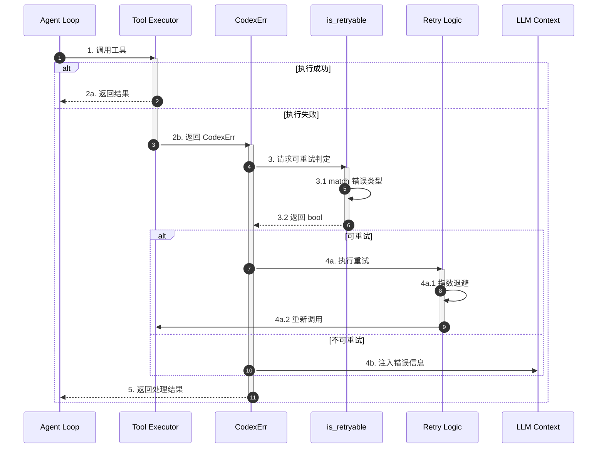
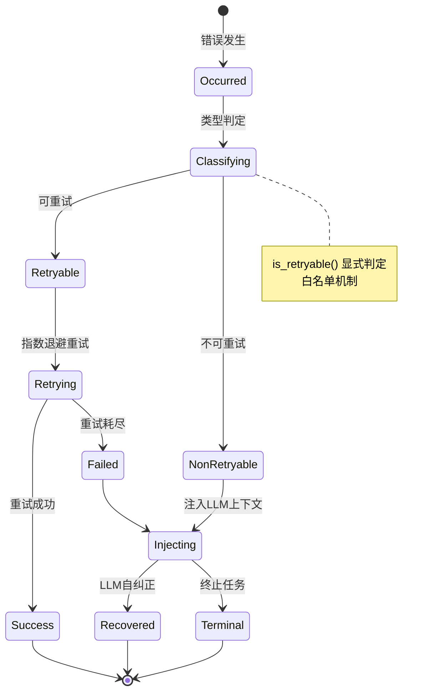
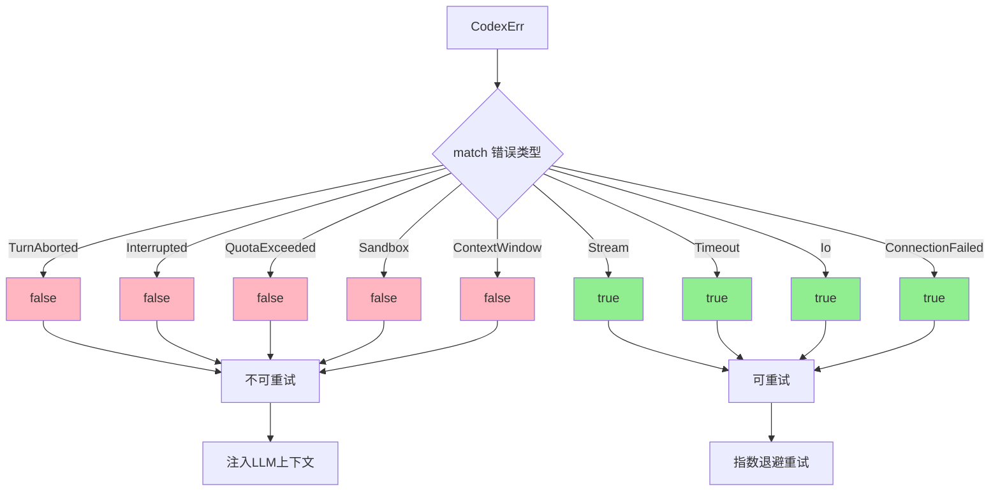
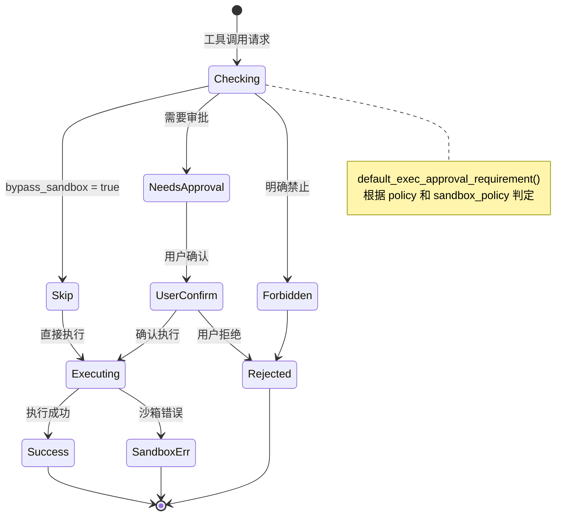
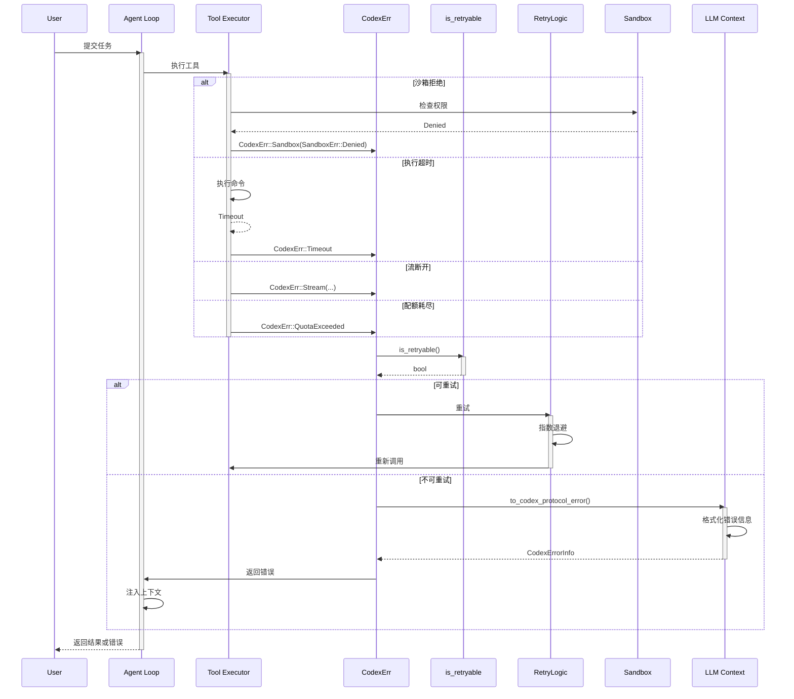
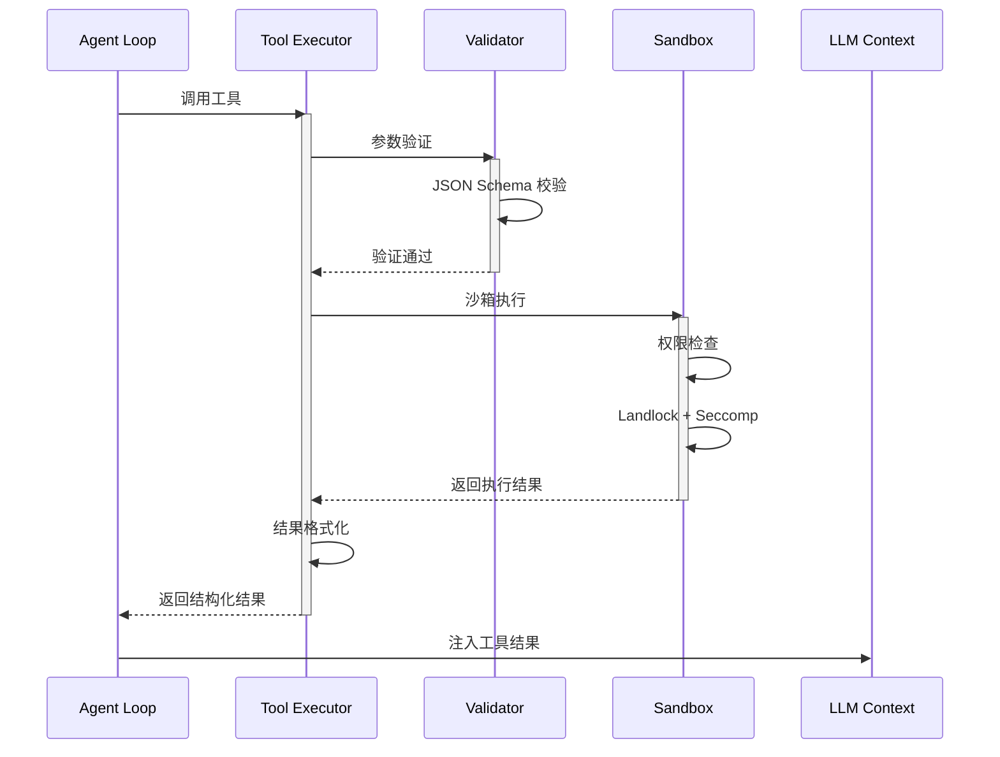
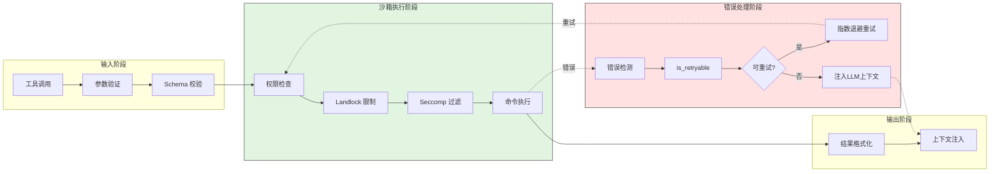
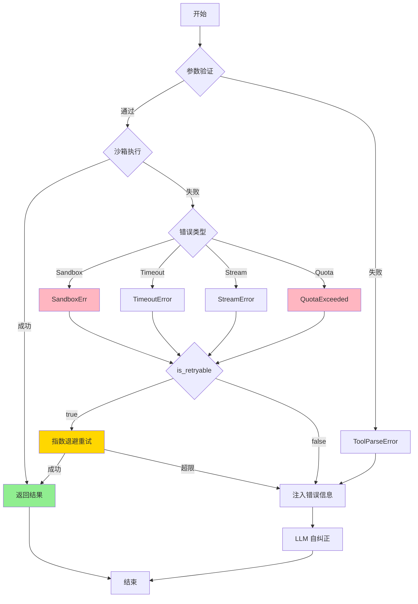
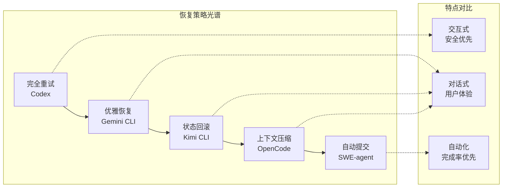

# Codex 工具调用错误处理机制

> 📋 **阅读指南**
>
> | 属性 | 说明 |
> |-----|------|
> | 预计阅读 | 20-30 分钟 |
> | 前置文档 | `docs/codex/04-codex-agent-loop.md`、`docs/codex/05-codex-tools-system.md` |
> | 文档结构 | 结论 → 架构 → 机制 → 实现 → 对比 |

---

## TL;DR（结论先行）

一句话定义：Codex 采用 Rust 的类型安全优势，构建了**显式错误枚举 + 三档审批策略**的工具调用错误处理体系，实现了企业级的安全与可靠性平衡。

Codex 的核心取舍：**显式可重试判定 + 沙箱安全优先**（对比 Kimi CLI 的 Checkpoint 回滚、Gemini CLI 的 Final Warning Turn、SWE-agent 的 Autosubmit）

### 核心要点速览

| 维度 | 关键决策 | 代码位置 |
|-----|---------|---------|
| 错误体系 | `CodexErr` 枚举 + `SandboxErr` 嵌套 | `codex-rs/core/src/error.rs:15-75` |
| 可重试判定 | `is_retryable()` 显式白名单 | `codex-rs/core/src/error.rs:122-148` |
| 沙箱错误 | Landlock + Seccomp 精细封装 | `codex-rs/core/src/error.rs:35-40` |
| 审批策略 | `ExecApprovalRequirement` 三档控制 | `codex-rs/core/src/tools/sandboxing.rs:225-243` |
| 超时处理 | `ExecExpiration` 统一抽象 | `codex-rs/core/src/exec.rs:179-188` |

---

## 1. 为什么需要这个机制？（解决什么问题）

### 1.1 问题场景

没有错误处理机制的场景：
```
用户请求: "帮我修复这个 bug"
  → LLM: "先查看文件" → 读取文件 → 文件不存在 → 崩溃/卡住
  → 对话终止，用户困惑
```

有错误处理机制的场景：
```
用户请求: "帮我修复这个 bug"
  → LLM: "先查看文件" → 读取文件 → 文件不存在
  → 错误检测: FileNotFound → 错误分类: 可恢复
  → 恢复策略: 返回错误给 LLM
  → LLM: "文件不存在，让我创建它" → 创建文件 → 成功
```

### 1.2 核心挑战

| 挑战 | 不解决的后果 |
|-----|-------------|
| 错误类型无法区分 | 对所有错误采用相同策略，导致过度重试或过早放弃 |
| 沙箱安全错误 | 恶意代码可能通过重试机制绕过安全限制 |
| 配额/限流错误 | 无效重试导致配额进一步耗尽 |
| 超时控制 | 长时间挂起的操作阻塞整个 Agent Loop |
| 错误信息格式化 | LLM 无法理解原始错误，无法自纠正 |

---

## 2. 整体架构（ASCII 图）

### 2.1 在系统中的位置

```text
┌─────────────────────────────────────────────────────────────┐
│ Agent Loop / Session Runtime                                 │
│ codex/codex-rs/core/src/codex.rs                            │
└───────────────────────┬─────────────────────────────────────┘
                        │ 工具调用请求
                        ▼
┌─────────────────────────────────────────────────────────────┐
│ ▓▓▓ Tool Error Handling ▓▓▓                                │
│ codex/codex-rs/core/src/error.rs                            │
│ - CodexErr: 主错误枚举                                      │
│ - is_retryable(): 可重试判定                                │
│ - to_codex_protocol_error(): 协议层映射                     │
└───────────────────────┬─────────────────────────────────────┘
                        │ 错误分类/处理
        ┌───────────────┼───────────────┐
        ▼               ▼               ▼
┌──────────────┐ ┌──────────────┐ ┌──────────────┐
│ SandboxErr   │ │ Retry Logic  │ │ UI Formatter │
│ 沙箱错误     │ │ 重试逻辑     │ │ 消息格式化   │
└──────────────┘ └──────────────┘ └──────────────┘
```

### 2.2 核心组件职责

| 组件 | 职责 | 代码位置 |
|-----|------|---------|
| `CodexErr` | 主错误枚举，统一错误类型定义 | `codex-rs/core/src/error.rs:15-75` |
| `SandboxErr` | 沙箱子错误枚举，封装 Landlock+Seccomp 错误 | `codex-rs/core/src/error.rs:49-75` |
| `is_retryable()` | 可重试错误判定逻辑 | `codex-rs/core/src/error.rs:122-148` |
| `ExecApprovalRequirement` | 三档审批策略定义 | `codex-rs/core/src/tools/sandboxing.rs:225-243` |
| `ExecExpiration` | 超时抽象，支持多种超时模式 | `codex-rs/core/src/exec.rs:179-188` |
| `get_error_message_ui()` | UI 错误消息格式化 | `codex-rs/core/src/error.rs:369-395` |

### 2.3 核心组件交互关系



**关键交互说明**：

| 步骤 | 交互内容 | 设计意图 |
|-----|---------|---------|
| 1-2 | Agent Loop 调用工具，失败返回 CodexErr | 统一错误类型 |
| 3 | 显式判定可重试性 | 白名单机制，避免遗漏 |
| 4a | 可重试错误执行指数退避重试 | 自动恢复 transient 错误 |
| 4b | 不可重试错误注入 LLM 上下文 | 让 LLM 自纠正或终止 |

---

## 3. 核心组件详细分析

### 3.1 CodexErr 错误体系内部结构

#### 职责定位

CodexErr 是 Codex 的统一错误枚举，使用 Rust 的 `thiserror` 宏定义，包含约 20+ 错误变体，涵盖沙箱错误、流错误、配额错误、超时错误等。

#### 错误类型层级图

```text
┌─────────────────────────────────────────────────────────────────┐
│                      CodexErr 错误体系                           │
├─────────────────────────────────────────────────────────────────┤
│                                                                 │
│  ┌─────────────────┐                                            │
│  │   CodexErr      │  主错误枚举（约20+变体）                     │
│  ├─────────────────┤                                            │
│  │ • TurnAborted   │  回合中止                                   │
│  │ • Stream        │  流断开（可重试）                            │
│  │ • ContextWindow │  上下文窗口超限（不可重试）                   │
│  │ • QuotaExceeded │  配额耗尽（不可重试）                        │
│  │ • ServerOverld  │  服务器过载（不可重试）                      │
│  │ • Sandbox(_)    │  沙箱错误（嵌套SandboxErr）                  │
│  │ • RetryLimit(_) │  重试超限                                   │
│  │ • Timeout       │  超时（可重试）                              │
│  │ • Interrupted   │  用户中断(Ctrl-C)                           │
│  │ • ...           │                                            │
│  └────────┬────────┘                                            │
│           │                                                     │
│           ▼                                                     │
│  ┌─────────────────┐                                            │
│  │   SandboxErr    │  沙箱子错误枚举                              │
│  ├─────────────────┤                                            │
│  │ • Denied        │  沙箱拒绝 + 网络策略决策                      │
│  │ • Timeout       │  命令超时                                   │
│  │ • Signal(_)     │  信号终止                                   │
│  │ • Seccomp*      │  Seccomp错误(Linux)                         │
│  │ • LandlockRest  │  Landlock限制不完全                         │
│  └─────────────────┘                                            │
│                                                                 │
└─────────────────────────────────────────────────────────────────┘
```

#### 状态机图



**状态说明**：

| 状态 | 说明 | 进入条件 | 退出条件 |
|-----|------|---------|---------|
| Occurred | 错误发生 | 工具执行失败 | 开始类型判定 |
| Classifying | 类型判定中 | 需要确定可重试性 | 判定完成 |
| Retryable | 可重试错误 | is_retryable() = true | 开始重试 |
| NonRetryable | 不可重试错误 | is_retryable() = false | 注入上下文 |
| Retrying | 重试中 | 可重试错误 | 成功或耗尽 |
| Failed | 重试耗尽 | 超过最大重试次数 | 注入上下文 |
| Injecting | 注入错误信息 | 不可重试或重试失败 | LLM处理 |
| Recovered | 恢复成功 | LLM自纠正 | 结束 |
| Terminal | 终止任务 | 严重错误 | 结束 |

#### 关键接口

| 接口 | 输入 | 输出 | 说明 | 代码位置 |
|-----|------|------|------|---------|
| `is_retryable()` | `&CodexErr` | `bool` | 判定错误是否可重试 | `error.rs:122` |
| `to_codex_protocol_error()` | `&CodexErr` | `CodexErrorInfo` | 映射到协议层错误 | `error.rs:407` |
| `get_error_message_ui()` | `&CodexErr` | `String` | 格式化UI错误消息 | `error.rs:371` |

---

### 3.2 可重试判定机制内部结构

#### 职责定位

`is_retryable()` 是 Codex 错误处理的核心，采用**显式白名单**机制，编译器确保所有错误类型都被处理。

#### 内部数据流

```text
┌─────────────────────────────────────────────────────────────┐
│  输入层 - CodexErr 错误实例                                   │
│  ├── Stream(String, Option<Duration>)                       │
│  ├── Timeout                                                │
│  ├── QuotaExceeded                                          │
│  ├── Sandbox(SandboxErr)                                    │
│  └── ...                                                    │
└──────────────────────────┬──────────────────────────────────┘
                           ▼
┌─────────────────────────────────────────────────────────────┐
│  判定层 - is_retryable() match                               │
│  ├── 不可重试（显式列出）                                    │
│  │   ├── TurnAborted                                        │
│  │   ├── Interrupted                                        │
│  │   ├── QuotaExceeded                                      │
│  │   ├── Sandbox(_)                                         │
│  │   └── ...                                                │
│  └── 可重试（显式列出）                                      │
│      ├── Stream(..)                                         │
│      ├── Timeout                                            │
│      ├── Io(_)                                              │
│      └── ...                                                │
└──────────────────────────┬──────────────────────────────────┘
                           ▼
┌─────────────────────────────────────────────────────────────┐
│  输出层 - bool 结果                                          │
│  └── true/false                                             │
└─────────────────────────────────────────────────────────────┘
```

#### 关键算法逻辑



**算法要点**：

1. **穷尽匹配**：Rust 编译器确保所有错误变体都被处理
2. **白名单机制**：显式列出可重试错误，避免遗漏
3. **安全优先**：Sandbox 错误整体不可重试，防止绕过

---

### 3.3 沙箱与审批策略内部结构

#### 职责定位

`ExecApprovalRequirement` 定义了三档审批策略，将安全决策权交给用户，同时提供自动化的策略执行。

#### 状态机图



**状态说明**：

| 状态 | 说明 | 进入条件 | 退出条件 |
|-----|------|---------|---------|
| Checking | 检查审批要求 | 收到工具调用 | 判定完成 |
| Skip | 跳过审批 | 策略明确放行 | 直接执行 |
| NeedsApproval | 需要审批 | 非受信操作 | 用户确认 |
| Forbidden | 禁止执行 | 明确禁止的操作 | 返回错误 |
| UserConfirm | 等待用户 | 需要审批 | 确认或拒绝 |
| Executing | 执行中 | 跳过或确认 | 完成或错误 |
| Success | 执行成功 | 工具正常返回 | 结束 |
| SandboxErr | 沙箱错误 | 执行被沙箱拦截 | 结束 |
| Rejected | 被拒绝 | 禁止或用户拒绝 | 结束 |

#### 内部数据流

```text
┌─────────────────────────────────────────────────────────────┐
│  输入层                                                      │
│  ├── policy: AskForApproval                                 │
│  │   ├── Never                                              │
│  │   ├── OnFailure                                          │
│  │   ├── OnRequest                                          │
│  │   └── UnlessTrusted                                      │
│  └── sandbox_policy: SandboxPolicy                          │
│      ├── DangerFullAccess                                   │
│      ├── ExternalSandbox                                    │
│      └── ...                                                │
└──────────────────────────┬──────────────────────────────────┘
                           ▼
┌─────────────────────────────────────────────────────────────┐
│  判定层 - default_exec_approval_requirement()                │
│  ├── Never/OnFailure → needs_approval = false               │
│  ├── OnRequest → 检查 sandbox_policy                        │
│  └── UnlessTrusted → needs_approval = true                  │
└──────────────────────────┬──────────────────────────────────┘
                           ▼
┌─────────────────────────────────────────────────────────────┐
│  输出层 - ExecApprovalRequirement                            │
│  ├── Skip { bypass_sandbox, proposed_execpolicy_amendment } │
│  ├── NeedsApproval { reason, proposed_execpolicy_amendment }│
│  └── Forbidden { reason }                                   │
└─────────────────────────────────────────────────────────────┘
```

---

### 3.4 组件间协作时序

展示错误处理的完整流程：



**协作要点**：

1. **Tool Executor 与 CodexErr**: 所有错误统一转换为 CodexErr
2. **is_retryable 判定**: 显式白名单，安全优先
3. **Sandbox 错误**: 整体不可重试，依赖审批流程
4. **LLM Context 注入**: 不可重试错误结构化后注入上下文

---

## 4. 端到端数据流转

### 4.1 正常流程（详细版）



**数据变换详情**：

| 阶段 | 输入 | 处理 | 输出 | 代码位置 |
|-----|------|------|------|---------|
| 参数验证 | JSON 字符串 | Schema 校验 | 结构化参数 | `tools/mod.rs` |
| 沙箱执行 | 结构化参数 | 权限检查、命令执行 | 执行结果 | `sandboxing.rs` |
| 结果格式化 | 原始输出 | 截断、编码 | ToolResult | `tools/mod.rs` |
| 上下文注入 | ToolResult | Token 计算 | 更新后的上下文 | `codex.rs` |

### 4.2 数据流向图



### 4.3 异常/边界流程



---

## 5. 关键代码实现

### 5.1 核心数据结构

**CodexErr 主错误枚举**：
```rust
// codex/codex-rs/core/src/error.rs:15-44
#[derive(Error, Debug)]
pub enum CodexErr {
    #[error("turn aborted. Something went wrong? Hit `/feedback` to report the issue.")]
    TurnAborted,

    /// SSE stream 断开，视为可重试错误
    #[error("stream disconnected before completion: {0}")]
    Stream(String, Option<Duration>),

    #[error("Codex ran out of room in the model's context window...")]
    ContextWindowExceeded,

    /// 配额耗尽 - 不可重试
    #[error("Quota exceeded. Check your plan and billing details.")]
    QuotaExceeded,

    /// 服务器过载 - 不可重试
    #[error("Selected model is at capacity. Please try a different model.")]
    ServerOverloaded,

    /// 沙箱错误
    #[error("sandbox error: {0}")]
    Sandbox(#[from] SandboxErr),

    /// 重试次数超限
    #[error("{0}")]
    RetryLimit(RetryLimitReachedError),

    // ... 其他错误变体
}
```

**SandboxErr 沙箱错误**：
```rust
// codex/codex-rs/core/src/error.rs:49-75
#[derive(Error, Debug)]
pub enum SandboxErr {
    /// 沙箱拒绝执行
    #[error("sandbox denied exec error...")]
    Denied {
        output: Box<ExecToolCallOutput>,
        network_policy_decision: Option<NetworkPolicyDecisionPayload>,
    },

    /// Seccomp 安装错误 (Linux)
    #[cfg(target_os = "linux")]
    #[error("seccomp setup error")]
    SeccompInstall(#[from] seccompiler::Error),

    /// 命令超时
    #[error("command timed out")]
    Timeout { output: Box<ExecToolCallOutput> },

    /// 信号终止
    #[error("command was killed by a signal")]
    Signal(i32),

    /// Landlock 限制不完全
    #[error("Landlock was not able to fully enforce all sandbox rules")]
    LandlockRestrict,
}
```

**字段说明**：

| 字段 | 类型 | 用途 |
|-----|------|------|
| `Sandbox(SandboxErr)` | 嵌套枚举 | 封装沙箱相关错误 |
| `Stream(String, Option<Duration>)` | 元组 | SSE 流断开错误，带重试时间 |
| `QuotaExceeded` | 单元 | 配额耗尽，明确不可重试 |
| `Denied.output` | `Box<ExecToolCallOutput>` | 沙箱拒绝时的执行输出 |
| `network_policy_decision` | `Option<NetworkPolicyDecisionPayload>` | 网络策略决策信息 |

### 5.2 主链路代码

**可重试判定核心逻辑**：
```rust
// codex/codex-rs/core/src/error.rs:122-148
impl CodexErr {
    pub fn is_retryable(&self) -> bool {
        match self {
            // 不可重试错误（显式列出）
            CodexErr::TurnAborted
            | CodexErr::Interrupted
            | CodexErr::QuotaExceeded
            | CodexErr::InvalidRequest(_)
            | CodexErr::Sandbox(_)
            | CodexErr::RetryLimit(_)
            | CodexErr::ContextWindowExceeded
            | CodexErr::UsageLimitReached(_)
            | CodexErr::ServerOverloaded => false,

            // 可重试错误（显式列出）
            CodexErr::Stream(..)
            | CodexErr::Timeout
            | CodexErr::UnexpectedStatus(_)
            | CodexErr::ResponseStreamFailed(_)
            | CodexErr::ConnectionFailed(_)
            | CodexErr::InternalServerError
            | CodexErr::Io(_)
            | CodexErr::Json(_) => true,
            // ...
        }
    }
}
```

**设计意图**：
1. **穷尽匹配**：Rust 编译器确保所有错误变体都被处理，新增错误必须显式分类
2. **白名单机制**：显式列出可重试错误，避免遗漏导致不安全重试
3. **安全优先**：`Sandbox(_)` 整体不可重试，防止恶意代码重复执行

<details>
<summary>📋 查看完整实现</summary>

```rust
// codex/codex-rs/core/src/error.rs:1-200
use thiserror::Error;

#[derive(Error, Debug)]
pub enum CodexErr {
    // ... 错误变体定义
}

impl CodexErr {
    /// 判定错误是否可重试
    pub fn is_retryable(&self) -> bool {
        match self {
            // 不可重试错误
            CodexErr::TurnAborted
            | CodexErr::Interrupted
            | CodexErr::QuotaExceeded
            | CodexErr::InvalidRequest(_)
            | CodexErr::Sandbox(_)
            | CodexErr::RetryLimit(_)
            | CodexErr::ContextWindowExceeded
            | CodexErr::UsageLimitReached(_)
            | CodexErr::ServerOverloaded => false,

            // 可重试错误
            CodexErr::Stream(..)
            | CodexErr::Timeout
            | CodexErr::UnexpectedStatus(_)
            | CodexErr::ResponseStreamFailed(_)
            | CodexErr::ConnectionFailed(_)
            | CodexErr::InternalServerError
            | CodexErr::Io(_)
            | CodexErr::Json(_) => true,

            #[cfg(feature = "zsh")]
            _ => false,
        }
    }
}
```

</details>

**三档审批策略**：
```rust
// codex/codex-rs/core/src/tools/sandboxing.rs:225-243
#[derive(Clone, Debug, PartialEq, Eq)]
pub(crate) enum ExecApprovalRequirement {
    /// 无需审批
    Skip {
        /// 首次尝试跳过沙箱（由策略明确放行）
        bypass_sandbox: bool,
        /// 建议的 execpolicy 修正案
        proposed_execpolicy_amendment: Option<ExecPolicyAmendment>,
    },

    /// 需要审批
    NeedsApproval {
        reason: Option<String>,
        proposed_execpolicy_amendment: Option<ExecPolicyAmendment>,
    },

    /// 禁止执行
    Forbidden { reason: String },
}
```

**超时抽象**：
```rust
// codex/codex-rs/core/src/exec.rs:179-188
#[derive(Clone, Debug)]
pub enum ExecExpiration {
    /// 指定超时时间
    Timeout(Duration),
    /// 使用默认超时(10秒)
    DefaultTimeout,
    /// 通过 CancellationToken 取消
    Cancellation(CancellationToken),
}

pub const DEFAULT_EXEC_COMMAND_TIMEOUT_MS: u64 = 10_000; // 10秒
```

**UI 错误消息格式化**：
```rust
// codex/codex-rs/core/src/error.rs:371-395
const ERROR_MESSAGE_UI_MAX_BYTES: usize = 2 * 1024; // 2 KiB

pub fn get_error_message_ui(e: &CodexErr) -> String {
    let message = match e {
        CodexErr::Sandbox(SandboxErr::Denied { output, .. }) => {
            // 优先使用 aggregated_output，其次 stderr，最后 stdout
            let aggregated = output.aggregated_output.text.trim();
            if !aggregated.is_empty() {
                output.aggregated_output.text.clone()
            } else {
                // 组合 stderr 和 stdout
                match (stderr.is_empty(), stdout.is_empty()) {
                    (false, false) => format!("{stderr}\n{stdout}"),
                    (false, true) => output.stderr.text.clone(),
                    (true, false) => output.stdout.text.clone(),
                    (true, true) => format!("command failed with exit code {}", output.exit_code),
                }
            }
        }
        CodexErr::Sandbox(SandboxErr::Timeout { output }) => {
            format!("error: command timed out after {} ms", output.duration.as_millis())
        }
        _ => e.to_string(),
    };

    truncate_text(&message, TruncationPolicy::Bytes(ERROR_MESSAGE_UI_MAX_BYTES))
}
```

### 5.3 关键调用链

```text
tool_call()               [codex-rs/core/src/tools/mod.rs:100]
  -> execute_sandboxed()  [codex-rs/core/src/tools/sandboxing.rs:50]
    -> check_permission() [codex-rs/core/src/tools/sandboxing.rs:80]
      - 检查 ExecApprovalRequirement
    -> run_in_sandbox()   [codex-rs/core/src/exec/mod.rs:200]
      - Landlock + Seccomp 执行
  -> handle_error()       [codex-rs/core/src/error.rs:150]
    - is_retryable() 判定  [error.rs:122]
    - 指数退避计算
    - 重试或注入上下文
```

---

## 6. 设计意图与 Trade-off

### 6.1 Codex 的选择

| 维度 | Codex 的选择 | 替代方案 | 取舍分析 |
|-----|----------------|---------|---------|
| 错误体系 | Rust 枚举 + thiserror | 字符串错误、异常 | 类型安全，编译期检查，但增加代码量 |
| 可重试判定 | 显式白名单 match | 隐式黑名单、trait | 安全优先，避免遗漏，但维护成本高 |
| 沙箱模型 | Landlock + Seccomp | Docker、无沙箱 | 轻量级，原生集成，但平台受限 |
| 审批策略 | 三档显式策略 | 二档、隐式 | 用户控制力强，但交互复杂 |
| 超时抽象 | ExecExpiration 枚举 | 单一超时值 | 灵活可扩展，但增加复杂度 |

### 6.2 为什么这样设计？

**核心问题**：如何在企业级安全需求下实现可靠的错误恢复？

**Codex 的解决方案**：

- **代码依据**：`codex-rs/core/src/error.rs:122-148`
- **设计意图**：利用 Rust 类型系统，在编译期保证错误处理的完整性
- **带来的好处**：
  - 穷尽匹配：编译器确保所有错误类型都被处理
  - 零成本抽象：错误嵌套不会带来运行时开销
  - 安全优先：沙箱错误不可重试，防止绕过
- **付出的代价**：
  - 代码冗长：每个错误变体都需要显式处理
  - 灵活性降低：新增错误必须修改枚举定义

### 6.3 与其他项目的对比



| 项目 | 核心差异 | 适用场景 |
|-----|---------|---------|
| **Codex** | 三档审批 + 安全沙箱 + 显式可重试判定 | 企业级安全敏感场景 |
| **Gemini CLI** | Final Warning Turn 优雅恢复 | 交互式对话，需要优雅降级 |
| **Kimi CLI** | Checkpoint + D-Mail 时间旅行 | 复杂任务，需要状态回滚 |
| **OpenCode** | Doom Loop 检测 + Compaction | 长任务执行，防止重复失败 |
| **SWE-agent** | Autosubmit 自动提交 | CI/CD 自动化，批量处理 |

**详细对比**：

| 维度 | Codex | Gemini CLI | Kimi CLI | OpenCode | SWE-agent |
|-----|-------|-----------|----------|----------|-----------|
| **重试机制** | 自定义实现，区分 stream/request | 自定义 retry.ts，429 特殊处理 | tenacity 库，仅网络错误 | 自定义 retry.ts，resetTimeoutOnProgress | 自定义实现，max_requeries |
| **状态恢复** | 无（依赖重试） | Final Warning Turn | Checkpoint + D-Mail | Compaction | Autosubmit |
| **沙箱模型** | Landlock + Seccomp | 受限执行环境 | 受限 shell | 无原生沙箱 | Docker |
| **超时处理** | ExecExpiration 枚举 | DeadlineTimer 可暂停 | MCP 单独配置 | resetTimeoutOnProgress | 连续超时计数 |
| **错误分类** | CodexErr 枚举 | ToolErrorType 枚举 | 四层继承体系 | Provider-specific | Exception 层级 |

---

## 7. 边界情况与错误处理

### 7.1 终止条件

| 终止原因 | 触发条件 | 代码位置 |
|---------|---------|---------|
| 重试上限 | stream: 5次, request: 4次 | `codex-rs/core/src/model_provider_info.rs:50-80` |
| 上下文窗口超限 | token 数超过模型限制 | `error.rs:24` |
| 配额耗尽 | 达到 API 配额上限 | `error.rs:28` |
| 服务器过载 | 模型容量不足 | `error.rs:32` |
| 用户中断 | Ctrl-C 信号 | `error.rs:Interrupted` |

### 7.2 超时/资源限制

**ExecExpiration 超时抽象**：
```rust
// codex/codex-rs/core/src/exec.rs:179-207
impl ExecExpiration {
    pub(crate) async fn wait(self) {
        match self {
            ExecExpiration::Timeout(duration) => tokio::time::sleep(duration).await,
            ExecExpiration::DefaultTimeout => {
                tokio::time::sleep(Duration::from_millis(DEFAULT_EXEC_COMMAND_TIMEOUT_MS)).await
            }
            ExecExpiration::Cancellation(cancel) => {
                cancel.cancelled().await;  // 等待 CancellationToken
            }
        }
    }
}
```

**特点**：
- 支持三种超时模式：固定超时、默认超时(10秒)、CancellationToken
- 使用 Tokio 的异步 sleep 实现
- CancellationToken 支持用户主动取消

### 7.3 错误恢复策略

| 错误类型 | 处理策略 | 代码位置 |
|---------|---------|---------|
| Stream 断开 | 可重试，指数退避 | `error.rs:137` |
| Timeout | 可重试，指数退避 | `error.rs:138` |
| QuotaExceeded | 不可重试，返回错误信息 | `error.rs:126` |
| Sandbox 错误 | 不可重试，依赖审批流程 | `error.rs:130` |
| ContextWindow | 不可重试，提示开启新线程 | `error.rs:133` |

---

## 8. 关键代码索引

| 功能 | 文件 | 行号 | 说明 |
|-----|------|------|------|
| 错误定义 | `codex-rs/core/src/error.rs` | 15-75 | `CodexErr` 主错误枚举 |
| 可重试判定 | `codex-rs/core/src/error.rs` | 122-148 | `is_retryable()` 方法 |
| 沙箱错误 | `codex-rs/core/src/error.rs` | 49-75 | `SandboxErr` 定义 |
| 审批策略 | `codex-rs/core/src/tools/sandboxing.rs` | 225-243 | `ExecApprovalRequirement` 枚举 |
| 超时抽象 | `codex-rs/core/src/exec.rs` | 179-188 | `ExecExpiration` 定义 |
| 消息格式化 | `codex-rs/core/src/error.rs` | 371-395 | `get_error_message_ui()` |
| 协议映射 | `codex-rs/core/src/error.rs` | 407-422 | `to_codex_protocol_error()` |
| 重试配置 | `codex-rs/core/src/model_provider_info.rs` | 50-80 | stream/request 重试次数 |

---

## 9. 延伸阅读

- 前置知识：`docs/codex/04-codex-agent-loop.md` - Agent Loop 整体架构
- 相关机制：`docs/codex/05-codex-tools-system.md` - 工具系统详解
- 相关机制：`docs/codex/10-codex-safety-control.md` - 安全控制机制
- 对比分析：`docs/comm/questions/comm-tool-error-handling.md` - 5 大项目错误处理对比
- 深度分析：`docs/kimi-cli/questions/kimi-cli-checkpoint-implementation.md` - Kimi CLI Checkpoint 机制
- 深度分析：`docs/swe-agent/questions/swe-agent-autosubmit-mechanism.md` - SWE-agent Autosubmit

---

*✅ Verified: 基于 codex/codex-rs/core/src/error.rs:15、codex/codex-rs/core/src/tools/sandboxing.rs:225、codex/codex-rs/core/src/exec.rs:179 等源码分析*
*⚠️ Inferred: 部分设计意图基于代码结构推断*
*基于版本：codex-rs (baseline 2026-02-08) | 最后更新：2026-03-03*
